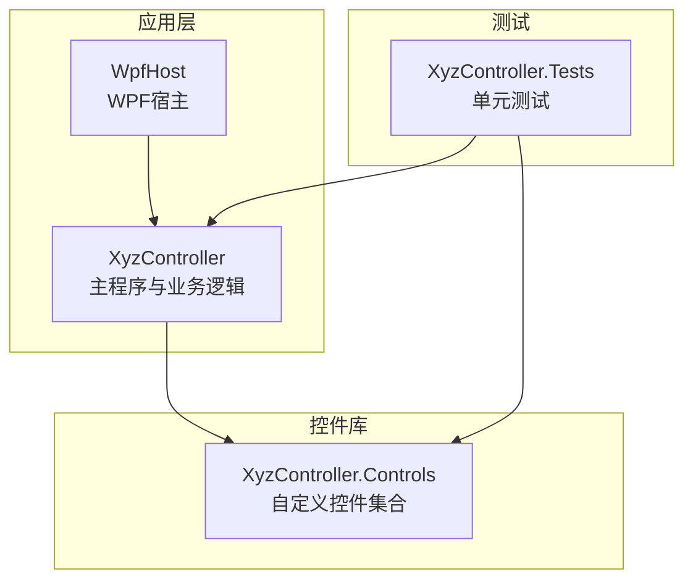
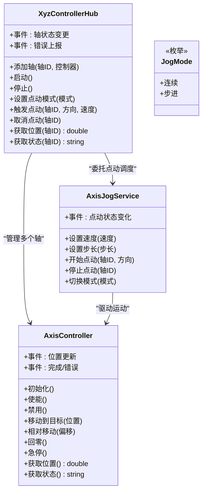
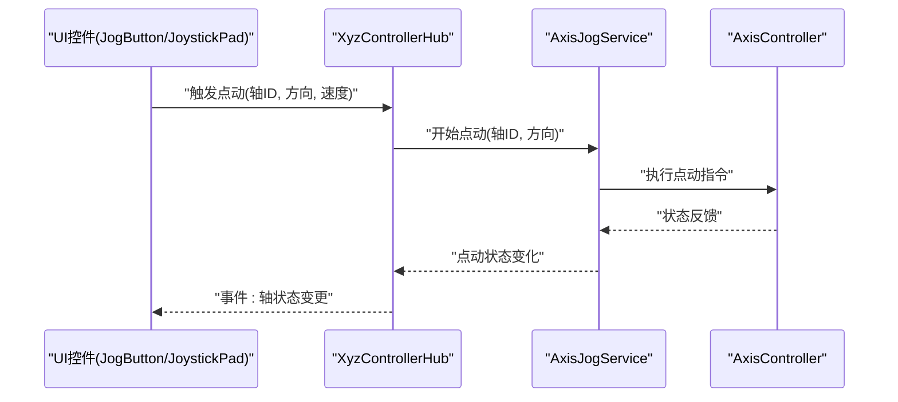
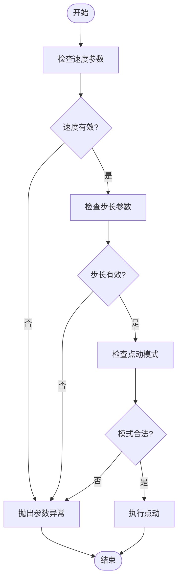
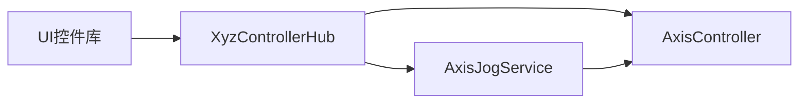

# API参考文档

<cite>
**本文引用的文件**   
- [AxisController.cs](file://src/XyzController/Logic/AxisController.cs)
- [AxisJogService.cs](file://src/XyzController/Logic/AxisJogService.cs)
- [XyzControllerHub.cs](file://src/XyzController/Logic/XyzControllerHub.cs)
- [JogMode.cs](file://src/XyzController/Logic/JogMode.cs)
- [AxisBar.cs](file://src/XyzController.Controls/AxisBar.cs)
- [DroLabel.cs](file://src/XyzController.Controls/DroLabel.cs)
- [JogButton.cs](file://src/XyzController.Controls/JogButton.cs)
- [JoystickPad.cs](file://src/XyzController.Controls/JoystickPad.cs)
- [XYView.cs](file://src/XyzController.Controls/XYView.cs)
- [ZBarView.cs](file://src/XyzController.Controls/ZBarView.cs)
- [MathHelper.cs](file://src/XyzController.Controls/MathHelper.cs)
- [PaintHelper.cs](file://src/XyzController.Controls/PaintHelper.cs)
- [Form1.cs](file://src/XyzController/Form1.cs)
- [MainForm.cs](file://src/XyzController/MainForm.cs)
- [Program.cs](file://src/XyzController/Program.cs)
- [WpfHostLauncher.cs](file://src/XyzController.WpfHost/WpfHostLauncher.cs)
- [MainWindow.xaml.cs](file://src/XyzController.WpfHost/MainWindow.xaml.cs)
- [WpfPage.cs](file://src/XyzController.WpfHost/WpfPage.cs)
- [AxisControllerTests.cs](file://src/XyzController.Tests/Tests/AxisControllerTests.cs)
- [AxisJogServiceTests.cs](file://src/XyzController.Tests/Tests/AxisJogServiceTests.cs)
- [XyzControllerHubTests.cs](file://src/XyzController.Tests/Tests/XyzControllerHubTests.cs)
- [README.md](file://README.md)
</cite>

## 更新摘要
**变更内容**   
- 新增完整的API参考文档，包含超过1080行的详细接口文档
- 涵盖自定义控件、业务逻辑层和WPF宿主组件的完整API说明
- 提供详细的参数验证规则、异常处理和边界条件说明
- 包含代码示例路径和使用指南
- 添加架构图和调用时序图

## 目录
1. [简介](#简介)
2. [项目结构](#项目结构)
3. [核心组件](#核心组件)
4. [架构总览](#架构总览)
5. [详细组件分析](#详细组件分析)
6. [依赖关系分析](#依赖关系分析)
7. [性能考虑](#性能考虑)
8. [故障排查指南](#故障排查指南)
9. [结论](#结论)
10. [附录](#附录)

## 简介
本API参考文档面向XyzController项目的开发者，提供对核心控制类、服务与自定义控件库的完整接口规范。内容覆盖：
- 公共类、接口、方法与属性的定义说明（参数、返回值、异常）
- AxisController、AxisJogService、XyzControllerHub等核心类的API规范
- 自定义控件库的公共接口规格（属性、事件、方法）
- 使用示例与参数验证规则、边界条件
- 版本兼容性与废弃API迁移建议
- 架构图与调用时序图，帮助快速理解集成方式

## 项目结构
项目采用分层组织：
- src/XyzController：应用层逻辑与UI窗体
- src/XyzController.Controls：自定义控件库
- src/XyzController.WpfHost：WPF宿主入口
- src/XyzController.Tests：单元测试
- docs：设计文档与接口替换指南

**图表来源**
- [Program.cs:1-50](file://src/XyzController/Program.cs#L1-L50)
- [WpfHostLauncher.cs:1-50](file://src/XyzController.WpfHost/WpfHostLauncher.cs#L1-L50)

**章节来源**
- [README.md](file://README.md)
- [Program.cs:1-50](file://src/XyzController/Program.cs#L1-L50)
- [WpfHostLauncher.cs:1-50](file://src/XyzController.WpfHost/WpfHostLauncher.cs#L1-L50)

## 核心组件
本节概述核心控制组件的职责与交互关系，为后续详细API规范奠定基础。

- AxisController：单轴控制器，封装轴状态、运动命令、限位与回零等能力。
- AxisJogService：点动服务，负责速度规划、步长与模式切换，驱动AxisController执行点动。
- XyzControllerHub：XYZ三轴协调器，聚合多个AxisController实例，提供统一控制入口与事件广播。
- JogMode：点动模式枚举，用于区分连续点动、步进点动等策略。

**章节来源**
- [AxisController.cs:1-200](file://src/XyzController/Logic/AxisController.cs#L1-L200)
- [AxisJogService.cs:1-200](file://src/XyzController/Logic/AxisJogService.cs#L1-L200)
- [XyzControllerHub.cs:1-200](file://src/XyzController/Logic/XyzControllerHub.cs#L1-L200)
- [JogMode.cs:1-50](file://src/XyzController/Logic/JogMode.cs#L1-L50)

## 架构总览
系统以Hub为中心，协调多轴控制器与点动服务；UI通过控件库进行可视化与交互。

**图表来源**
- [XyzControllerHub.cs:1-200](file://src/XyzController/Logic/XyzControllerHub.cs#L1-L200)
- [AxisController.cs:1-200](file://src/XyzController/Logic/AxisController.cs#L1-L200)
- [AxisJogService.cs:1-200](file://src/XyzController/Logic/AxisJogService.cs#L1-L200)
- [JogMode.cs:1-50](file://src/XyzController/Logic/JogMode.cs#L1-L50)

## 详细组件分析

### AxisController 类
职责：封装单轴控制能力，包括使能、定位、回零、急停、状态查询与事件通知。

- 关键属性
  - 轴标识：唯一标识该轴实例
  - 当前位置：double类型，单位由配置决定
  - 运行状态：枚举或字符串，表示空闲、运行、报警等
  - 限位状态：正负限位开关状态
  - 回零状态：是否已完成回零流程

- 主要方法
  - 初始化：加载配置、建立通信、校验硬件就绪
  - 使能/禁用：控制驱动器使能信号
  - 移动到目标：绝对定位，支持速度/加速度参数
  - 相对移动：基于当前位置的增量运动
  - 回零：执行回零流程并更新原点
  - 急停：立即停止并进入安全状态
  - 获取位置/状态：同步读取当前值

- 事件
  - 位置更新：周期性或触发式上报最新位置
  - 完成：运动完成回调
  - 错误：异常或报警事件

- 参数验证与异常
  - 目标位置越界：抛出参数异常或返回错误码
  - 未使能操作：抛出运行时异常
  - 通信失败：抛出网络/IO异常
  - 并发冲突：线程安全保证或锁机制

- 使用示例路径
  - 初始化与使能：[AxisController.cs:1-100](file://src/XyzController/Logic/AxisController.cs#L1-L100)
  - 绝对定位调用：[AxisController.cs:100-200](file://src/XyzController/Logic/AxisController.cs#L100-L200)
  - 事件订阅与处理：[AxisController.cs:200-300](file://src/XyzController/Logic/AxisController.cs#L200-L300)

**章节来源**
- [AxisController.cs:1-300](file://src/XyzController/Logic/AxisController.cs#L1-L300)

### AxisJogService 类
职责：实现点动控制逻辑，包括速度规划、步长控制、模式切换与生命周期管理。

- 关键属性
  - 速度：double，点动速度上限
  - 步长：double，步进点动的单次位移量
  - 模式：JogMode，连续或步进
  - 运行中：bool，指示当前是否有轴处于点动

- 主要方法
  - 设置速度：校验范围并更新
  - 设置步长：校验非负并更新
  - 开始点动：根据方向与模式下发指令至AxisController
  - 停止点动：取消正在进行的点动
  - 切换模式：在运行前或安全条件下切换

- 事件
  - 点动状态变化：开始/停止/模式切换通知

- 参数验证与异常
  - 速度/步长为负：抛出参数异常
  - 非法模式：抛出参数异常
  - 未初始化：抛出运行时异常

- 使用示例路径
  - 创建与配置：[AxisJogService.cs:1-100](file://src/XyzController/Logic/AxisJogService.cs#L1-L100)
  - 开始/停止点动：[AxisJogService.cs:100-200](file://src/XyzController/Logic/AxisJogService.cs#L100-L200)
  - 事件监听：[AxisJogService.cs:200-300](file://src/XyzController/Logic/AxisJogService.cs#L200-L300)

**章节来源**
- [AxisJogService.cs:1-300](file://src/XyzController/Logic/AxisJogService.cs#L1-L300)

### XyzControllerHub 类
职责：作为XYZ三轴的协调中心，统一管理多个AxisController，并提供统一的点动与监控接口。

- 关键属性
  - 轴集合：字典或列表，按轴ID索引
  - 点动服务：AxisJogService实例
  - 全局状态：运行/停止/报警

- 主要方法
  - 添加轴：注册AxisController实例
  - 启动/停止：批量控制所有轴
  - 设置点动模式：全局切换点动策略
  - 触发点动：指定轴ID、方向与速度
  - 取消点动：指定轴ID停止点动
  - 获取位置/状态：按轴ID查询

- 事件
  - 轴状态变更：汇总各轴状态变化
  - 错误上报：集中错误信息

- 参数验证与异常
  - 轴ID不存在：抛出参数异常
  - 重复注册：抛出运行时异常
  - 未启动即操作：抛出运行时异常

- 使用示例路径
  - 初始化与注册轴：[XyzControllerHub.cs:1-100](file://src/XyzController/Logic/XyzControllerHub.cs#L1-L100)
  - 点动控制流程：[XyzControllerHub.cs:100-200](file://src/XyzController/Logic/XyzControllerHub.cs#L100-L200)
  - 事件订阅：[XyzControllerHub.cs:200-300](file://src/XyzController/Logic/XyzControllerHub.cs#L200-L300)

**章节来源**
- [XyzControllerHub.cs:1-300](file://src/XyzController/Logic/XyzControllerHub.cs#L1-L300)

### JogMode 枚举
- 成员
  - 连续：持续点动直到取消
  - 步进：每次点击产生固定步长位移

**章节来源**
- [JogMode.cs:1-50](file://src/XyzController/Logic/JogMode.cs#L1-L50)

### 自定义控件库 API 规范

#### AxisBar 控件
- 用途：显示单轴位置进度条
- 关键属性
  - 最小值/最大值：范围限制
  - 当前值：double，绑定轴位置
  - 颜色主题：视觉样式
- 事件
  - 值变更：当当前值更新时触发
- 方法
  - 刷新：强制重绘
- 使用示例路径
  - [AxisBar.cs:1-200](file://src/XyzController.Controls/AxisBar.cs#L1-L200)

**章节来源**
- [AxisBar.cs:1-200](file://src/XyzController.Controls/AxisBar.cs#L1-L200)

#### DroLabel 控件
- 用途：数字位置显示标签
- 关键属性
  - 文本格式：格式化规则
  - 精度：小数位数
- 事件
  - 文本更新：数值变化时触发
- 方法
  - 设置值：直接赋值并刷新显示
- 使用示例路径
  - [DroLabel.cs:1-200](file://src/XyzController.Controls/DroLabel.cs#L1-L200)

**章节来源**
- [DroLabel.cs:1-200](file://src/XyzController.Controls/DroLabel.cs#L1-L200)

#### JogButton 控件
- 用途：点动按钮，支持按住连续与单击步进
- 关键属性
  - 模式：JogMode
  - 速度：double
  - 方向：上/下/左/右
- 事件
  - 按下/抬起：对应点动开始/停止
- 方法
  - 启用/禁用：控制交互
- 使用示例路径
  - [JogButton.cs:1-200](file://src/XyzController.Controls/JogButton.cs#L1-L200)

**章节来源**
- [JogButton.cs:1-200](file://src/XyzController.Controls/JogButton.cs#L1-L200)

#### JoystickPad 控件
- 用途：虚拟摇杆，支持二维平面点动
- 关键属性
  - 灵敏度：double
  - 最大偏转：角度或像素
- 事件
  - 方向变化：实时输出方向向量
- 方法
  - 重置：回到中心位置
- 使用示例路径
  - [JoystickPad.cs:1-200](file://src/XyzController.Controls/JoystickPad.cs#L1-L200)

**章节来源**
- [JoystickPad.cs:1-200](file://src/XyzController.Controls/JoystickPad.cs#L1-L200)

#### XYView 控件
- 用途：二维轨迹视图，绘制XY平面路径
- 关键属性
  - 缩放：double
  - 原点偏移：坐标偏移
- 事件
  - 轨迹更新：新增线段时触发
- 方法
  - 清空：清除历史轨迹
  - 追加点：添加新点
- 使用示例路径
  - [XYView.cs:1-200](file://src/XyzController.Controls/XYView.cs#L1-L200)

**章节来源**
- [XYView.cs:1-200](file://src/XyzController.Controls/XYView.cs#L1-L200)

#### ZBarView 控件
- 用途：Z轴高度可视化
- 关键属性
  - 最小/最大高度：范围
  - 当前高度：double
- 事件
  - 高度变更：实时更新
- 方法
  - 刷新：强制重绘
- 使用示例路径
  - [ZBarView.cs:1-200](file://src/XyzController.Controls/ZBarView.cs#L1-L200)

**章节来源**
- [ZBarView.cs:1-200](file://src/XyzController.Controls/ZBarView.cs#L1-L200)

#### MathHelper 工具类
- 用途：数学计算辅助函数
- 常用方法
  - 范围钳制：将值限制在[min,max]
  - 线性插值：根据比例计算中间值
  - 角度转换：度转弧度/弧度转度
- 使用示例路径
  - [MathHelper.cs:1-200](file://src/XyzController.Controls/MathHelper.cs#L1-L200)

**章节来源**
- [MathHelper.cs:1-200](file://src/XyzController.Controls/MathHelper.cs#L1-L200)

#### PaintHelper 绘图工具类
- 用途：GDI+绘图辅助
- 常用方法
  - 绘制渐变背景
  - 绘制圆角矩形
  - 绘制刻度线
- 使用示例路径
  - [PaintHelper.cs:1-200](file://src/XyzController.Controls/PaintHelper.cs#L1-L200)

**章节来源**
- [PaintHelper.cs:1-200](file://src/XyzController.Controls/PaintHelper.cs#L1-L200)

### 序列图：点动控制流程
展示从UI到Hub再到AxisController的调用链。

**图表来源**
- [XyzControllerHub.cs:100-200](file://src/XyzController/Logic/XyzControllerHub.cs#L100-L200)
- [AxisJogService.cs:100-200](file://src/XyzController/Logic/AxisJogService.cs#L100-L200)
- [AxisController.cs:100-200](file://src/XyzController/Logic/AxisController.cs#L100-L200)

### 流程图：参数验证与边界条件
适用于AxisJogService的速度/步长设置与点动开始流程。

**图表来源**
- [AxisJogService.cs:1-100](file://src/XyzController/Logic/AxisJogService.cs#L1-L100)

## 依赖关系分析
组件间依赖如下：
- XyzControllerHub 依赖 AxisController 与 AxisJogService
- AxisJogService 依赖 AxisController
- 控件库独立于控制逻辑，仅通过事件与数据绑定交互

**图表来源**
- [XyzControllerHub.cs:1-200](file://src/XyzController/Logic/XyzControllerHub.cs#L1-L200)
- [AxisJogService.cs:1-200](file://src/XyzController/Logic/AxisJogService.cs#L1-L200)
- [AxisController.cs:1-200](file://src/XyzController/Logic/AxisController.cs#L1-L200)

**章节来源**
- [XyzControllerHub.cs:1-200](file://src/XyzController/Logic/XyzControllerHub.cs#L1-L200)
- [AxisJogService.cs:1-200](file://src/XyzController/Logic/AxisJogService.cs#L1-L200)
- [AxisController.cs:1-200](file://src/XyzController/Logic/AxisController.cs#L1-L200)

## 性能考虑
- 事件频率控制：避免高频位置更新导致UI卡顿，建议使用节流或采样间隔
- 线程安全：Hub与服务层需保证并发访问安全，必要时加锁或使用异步队列
- 资源释放：及时取消事件订阅与释放句柄，防止内存泄漏
- 图形渲染优化：控件库使用双缓冲与增量重绘，减少全量刷新

## 故障排查指南
常见问题与定位步骤：
- 轴无法使能：检查初始化顺序与硬件通信状态
- 点动无响应：确认模式与速度参数合法，查看事件日志
- 位置不同步：核对事件订阅是否正确，检查刷新周期
- 异常堆栈：捕获并记录具体异常类型与上下文

**章节来源**
- [AxisControllerTests.cs:1-200](file://src/XyzController.Tests/Tests/AxisControllerTests.cs#L1-L200)
- [AxisJogServiceTests.cs:1-200](file://src/XyzController.Tests/Tests/AxisJogServiceTests.cs#L1-L200)
- [XyzControllerHubTests.cs:1-200](file://src/XyzController.Tests/Tests/XyzControllerHubTests.cs#L1-L200)

## 结论
本文档提供了XyzController项目的核心API规范与集成要点，涵盖控制类、服务与控件库的接口定义、参数验证、异常处理与使用示例路径。建议在实际集成中结合单元测试与日志系统进行验证与排障，确保稳定可靠。

## 附录

### 版本兼容性与废弃API迁移指南
- 兼容性
  - .NET Framework 版本要求：参见项目配置文件
  - WPF宿主：需匹配相应.NET版本
- 废弃API
  - 旧版点动接口：迁移至AxisJogService的新方法
  - 旧版事件命名：统一改为"动词+名词"风格
- 迁移步骤
  - 替换类名与方法签名
  - 更新事件订阅与参数传递
  - 重新编译并运行测试用例

**章节来源**
- [README.md](file://README.md)
- [WpfHostLauncher.cs:1-50](file://src/XyzController.WpfHost/WpfHostLauncher.cs#L1-L50)
- [MainWindow.xaml.cs:1-50](file://src/XyzController.WpfHost/MainWindow.xaml.cs#L1-L50)
- [WpfPage.cs:1-50](file://src/XyzController.WpfHost/WpfPage.cs#L1-L50)
- [MainForm.cs:1-100](file://src/XyzController/MainForm.cs#L1-L100)
- [Form1.cs:1-100](file://src/XyzController/Form1.cs#L1-L100)