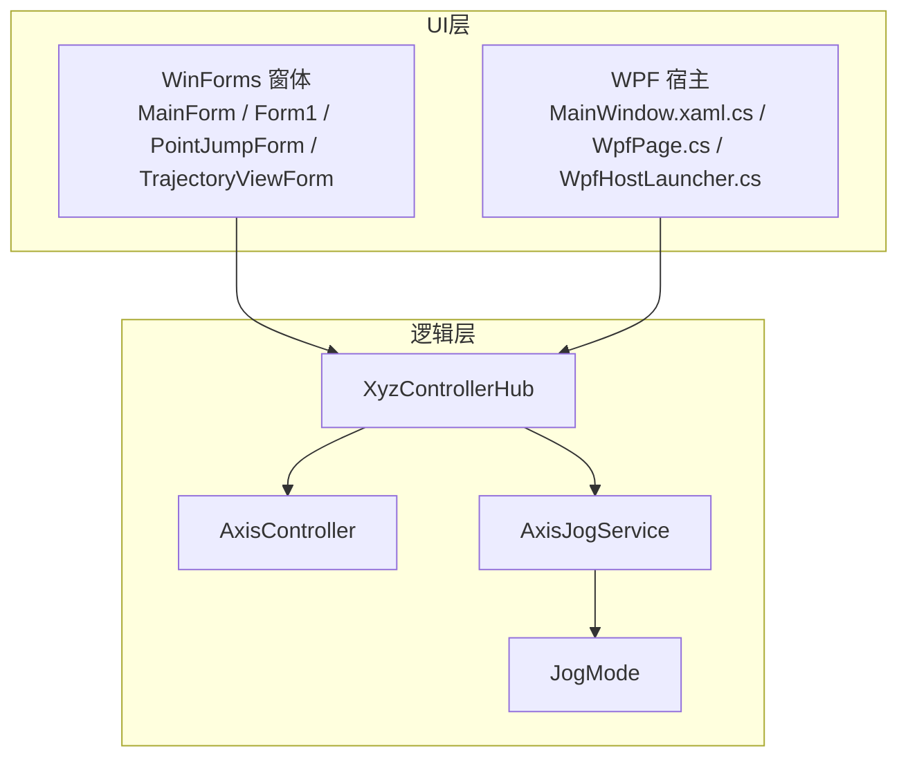
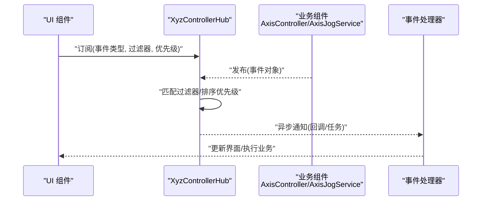
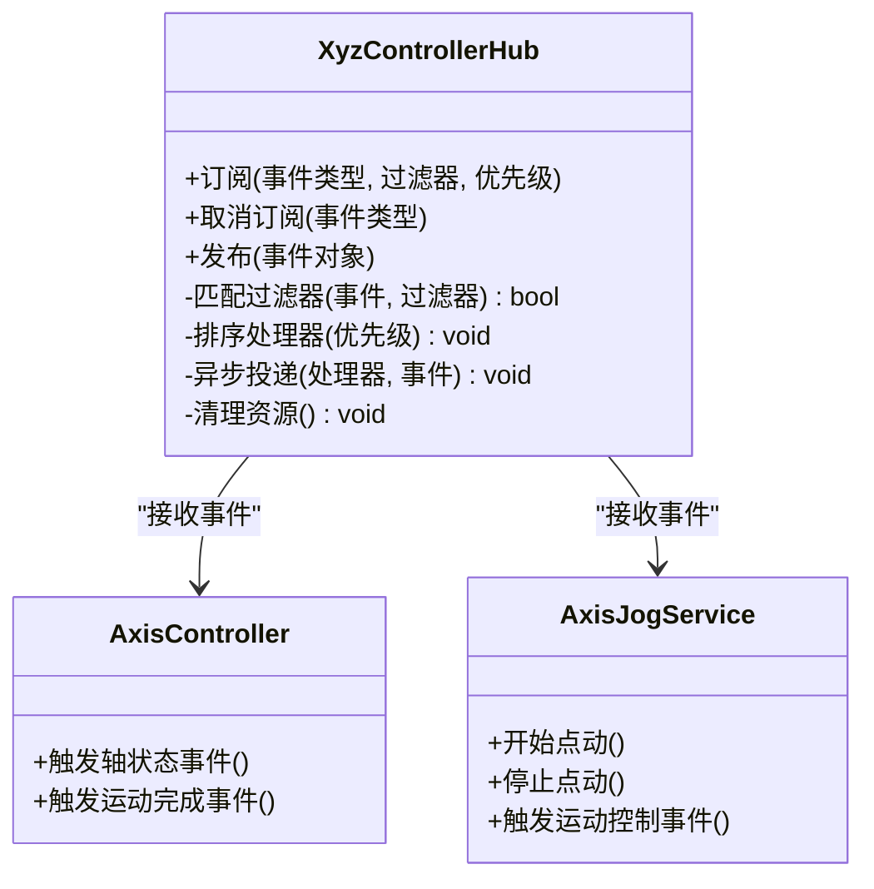
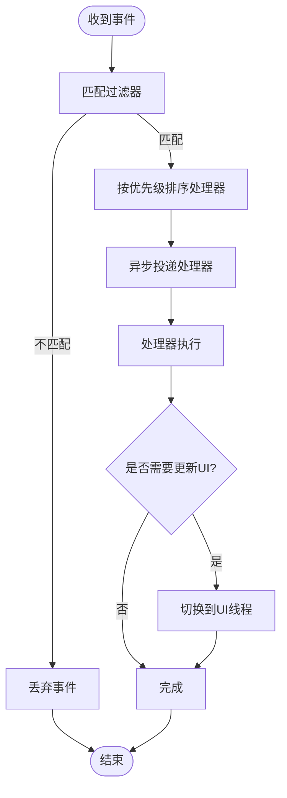
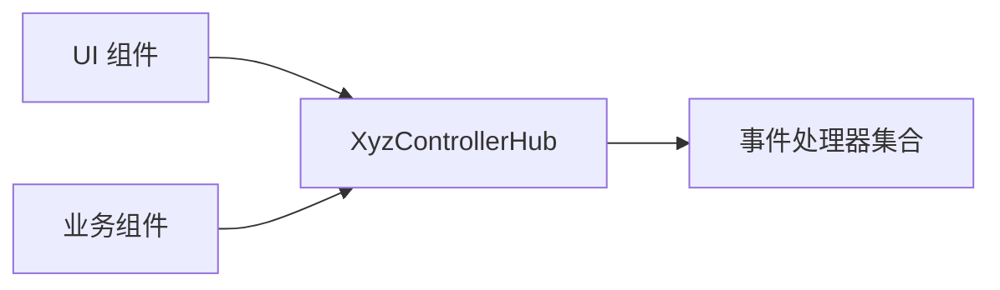

# 事件与通信

<cite>
**本文引用的文件**   
- [XyzControllerHub.cs](file://src/XyzController/Logic/XyzControllerHub.cs)
- [AxisController.cs](file://src/XyzController/Logic/AxisController.cs)
- [AxisJogService.cs](file://src/XyzController/Logic/AxisJogService.cs)
- [JogMode.cs](file://src/XyzController/Logic/JogMode.cs)
- [Form1.cs](file://src/XyzController/Form1.cs)
- [MainForm.cs](file://src/XyzController/MainForm.cs)
- [PointJumpForm.cs](file://src/XyzController/PointJumpForm.cs)
- [TrajectoryViewForm.cs](file://src/XyzController/TrajectoryViewForm.cs)
- [WpfPage.cs](file://src/XyzController.WpfHost/WpfPage.cs)
- [MainWindow.xaml.cs](file://src/XyzController.WpfHost/MainWindow.xaml.cs)
- [WpfHostLauncher.cs](file://src/XyzController.WpfHost/WpfHostLauncher.cs)
- [组件通信机制.md](file://src/content/核心架构设计/组件通信机制.md)
- [主窗体协调器.md](file://src/content/核心架构设计/主窗体协调器.md)
- [点动服务.md](file://src/content/核心架构设计/点动服务.md)
- [轴控制系统.md](file://src/content/核心架构设计/轴控制系统.md)
</cite>

## 目录
1. [简介](#简介)
2. [项目结构](#项目结构)
3. [核心组件](#核心组件)
4. [架构总览](#架构总览)
5. [详细组件分析](#详细组件分析)
6. [依赖关系分析](#依赖关系分析)
7. [性能考虑](#性能考虑)
8. [故障排查指南](#故障排查指南)
9. [结论](#结论)
10. [附录：API参考](#附录api参考)

## 简介
本文件面向事件驱动通信机制，围绕 XyzControllerHub 的事件定义、消息传递协议、订阅/发布接口、过滤与优先级、异步通知、生命周期管理（注册/注销/清理）以及最佳实践与优化建议进行系统化说明。文档同时覆盖三类典型事件：轴状态事件、运动控制事件、用户交互事件，并提供完整的代码示例路径与异常处理策略，帮助读者快速集成并稳定扩展系统。

## 项目结构
本项目采用分层与按功能域组织相结合的结构：
- 逻辑层：包含控制器与服务（如轴控制、点动服务）、中心枢纽（Hub）等核心能力
- UI层：WinForms与WPF宿主分别承载界面与交互
- 文档层：提供架构与设计说明，辅助理解事件模型与通信约定

图表来源
- [XyzControllerHub.cs](file://src/XyzController/Logic/XyzControllerHub.cs)
- [AxisController.cs](file://src/XyzController/Logic/AxisController.cs)
- [AxisJogService.cs](file://src/XyzController/Logic/AxisJogService.cs)
- [JogMode.cs](file://src/XyzController/Logic/JogMode.cs)
- [MainForm.cs](file://src/XyzController/MainForm.cs)
- [Form1.cs](file://src/XyzController/Form1.cs)
- [PointJumpForm.cs](file://src/XyzController/PointJumpForm.cs)
- [TrajectoryViewForm.cs](file://src/XyzController/TrajectoryViewForm.cs)
- [MainWindow.xaml.cs](file://src/XyzController.WpfHost/MainWindow.xaml.cs)
- [WpfPage.cs](file://src/XyzController.WpfHost/WpfPage.cs)
- [WpfHostLauncher.cs](file://src/XyzController.WpfHost/WpfHostLauncher.cs)

章节来源
- [组件通信机制.md](file://src/content/核心架构设计/组件通信机制.md)
- [主窗体协调器.md](file://src/content/核心架构设计/主窗体协调器.md)
- [点动服务.md](file://src/content/核心架构设计/点动服务.md)
- [轴控制系统.md](file://src/content/核心架构设计/轴控制系统.md)

## 核心组件
- XyzControllerHub：事件总线与消息路由中心，负责事件的注册、分发、过滤与优先级调度，对外暴露统一的订阅/发布接口
- AxisController：轴控制执行单元，产生轴状态事件与运动结果事件
- AxisJogService：点动服务，封装 jog 模式与步长策略，触发运动控制事件
- JogMode：点动模式枚举或配置，影响事件语义与参数
- UI 组件：通过 Hub 订阅事件以更新显示或响应用户操作；在生命周期结束时注销事件以避免泄漏

章节来源
- [XyzControllerHub.cs](file://src/XyzController/Logic/XyzControllerHub.cs)
- [AxisController.cs](file://src/XyzController/Logic/AxisController.cs)
- [AxisJogService.cs](file://src/XyzController/Logic/AxisJogService.cs)
- [JogMode.cs](file://src/XyzController/Logic/JogMode.cs)

## 架构总览
下图展示事件驱动通信的整体流程：UI 与业务组件通过 Hub 订阅/发布事件；Hub 根据过滤器与优先级将事件投递给合适的处理器；异步通知确保 UI 线程安全与高吞吐。

图表来源
- [XyzControllerHub.cs](file://src/XyzController/Logic/XyzControllerHub.cs)
- [AxisController.cs](file://src/XyzController/Logic/AxisController.cs)
- [AxisJogService.cs](file://src/XyzController/Logic/AxisJogService.cs)
- [MainForm.cs](file://src/XyzController/MainForm.cs)
- [WpfPage.cs](file://src/XyzController.WpfHost/WpfPage.cs)

## 详细组件分析

### XyzControllerHub：事件总线与消息路由
职责
- 统一事件注册/注销
- 基于事件类型、标签、轴标识等的过滤
- 基于优先级的处理器调度
- 异步通知与线程切换（UI 安全）
- 生命周期管理与资源清理

关键概念
- 事件类型：用于区分不同领域的事件（如轴状态、运动控制、用户交互）
- 事件载荷：携带具体数据（位置、速度、目标、错误码等）
- 过滤器：按条件筛选事件（如轴号、区域、时间窗口）
- 优先级：决定处理器被调用的顺序
- 异步通知：非阻塞投递，支持并发处理

图表来源
- [XyzControllerHub.cs](file://src/XyzController/Logic/XyzControllerHub.cs)
- [AxisController.cs](file://src/XyzController/Logic/AxisController.cs)
- [AxisJogService.cs](file://src/XyzController/Logic/AxisJogService.cs)

章节来源
- [XyzControllerHub.cs](file://src/XyzController/Logic/XyzControllerHub.cs)
- [组件通信机制.md](file://src/content/核心架构设计/组件通信机制.md)

### 轴状态事件
语义
- 描述轴的实时状态变化，如位置、速度、使能状态、报警、限位等
- 通常由底层硬件或仿真层驱动，经 AxisController 聚合后发布

典型字段
- 轴标识、时间戳、位置、速度、误差、状态位、错误码

订阅建议
- 高频刷新场景使用轻量过滤器（仅匹配轴号）
- 对 UI 渲染做节流或合并更新，避免频繁重绘

发布时机
- 周期采样或状态变更时立即发布

章节来源
- [AxisController.cs](file://src/XyzController/Logic/AxisController.cs)
- [轴控制系统.md](file://src/content/核心架构设计/轴控制系统.md)

### 运动控制事件
语义
- 描述运动指令的发起、执行与完成，包括 jog、定位、插补等
- 由 AxisJogService 或上层编排器触发

典型字段
- 运动类型、目标坐标、速度/加速度、起始/结束时间、结果码

处理要点
- 需要保证同一轴的运动互斥（可通过事件中的轴号与锁策略）
- 失败重试与回退策略应在处理器中实现

章节来源
- [AxisJogService.cs](file://src/XyzController/Logic/AxisJogService.cs)
- [点动服务.md](file://src/content/核心架构设计/点动服务.md)

### 用户交互事件
语义
- 来自 UI 的用户输入，如按钮点击、摇杆移动、面板参数修改
- 经 Hub 转发到业务层，触发相应的运动或配置变更

典型字段
- 控件标识、动作类型、参数快照、来源上下文

注意事项
- 防抖与去重：避免重复触发
- 线程切换：从 UI 线程切换到后台线程执行耗时逻辑

章节来源
- [MainForm.cs](file://src/XyzController/MainForm.cs)
- [Form1.cs](file://src/XyzController/Form1.cs)
- [PointJumpForm.cs](file://src/XyzController/PointJumpForm.cs)
- [主窗体协调器.md](file://src/content/核心架构设计/主窗体协调器.md)

### 事件订阅与发布的 API 规范
- 订阅接口
  - 入参：事件类型、过滤器（可选）、优先级（可选）
  - 返回：订阅句柄（用于取消订阅）
  - 行为：注册处理器，加入优先级队列，等待发布时异步投递
- 取消订阅接口
  - 入参：事件类型或订阅句柄
  - 行为：移除处理器，释放引用，避免内存泄漏
- 发布接口
  - 入参：事件对象（含类型与载荷）
  - 行为：匹配过滤器、排序优先级、异步投递至处理器

过滤与优先级
- 过滤器：支持按轴号、事件标签、时间范围等条件组合
- 优先级：数值越小优先级越高；同优先级按注册顺序

异步通知
- 默认在非 UI 线程执行处理器；若需更新 UI，请在处理器内切换至 UI 线程
- 支持批量投递与背压策略（在高负载下丢弃低优先级事件）

章节来源
- [XyzControllerHub.cs](file://src/XyzController/Logic/XyzControllerHub.cs)
- [组件通信机制.md](file://src/content/核心架构设计/组件通信机制.md)

### 生命周期管理
- 启动阶段：初始化 Hub，注册全局处理器（如日志、遥测）
- 运行阶段：动态订阅/取消订阅，按需调整过滤器与优先级
- 关闭阶段：统一取消订阅，释放外部资源（定时器、连接、缓存）

最佳实践
- 在组件构造时订阅，在析构/Dispose 时取消订阅
- 为每个订阅保留句柄，集中管理生命周期
- 使用作用域订阅（如页面级）减少全局耦合

章节来源
- [XyzControllerHub.cs](file://src/XyzController/Logic/XyzControllerHub.cs)
- [WpfPage.cs](file://src/XyzController.WpfHost/WpfPage.cs)
- [MainWindow.xaml.cs](file://src/XyzController.WpfHost/MainWindow.xaml.cs)

### 事件处理流程图

图表来源
- [XyzControllerHub.cs](file://src/XyzController/Logic/XyzControllerHub.cs)

## 依赖关系分析
- Hub 与业务组件解耦：通过事件类型与载荷约定通信，降低直接调用耦合
- UI 与业务分离：UI 仅订阅事件，不直接调用业务方法
- 外部依赖最小化：Hub 内部实现可替换，便于测试与替换后端

图表来源
- [XyzControllerHub.cs](file://src/XyzController/Logic/XyzControllerHub.cs)
- [MainForm.cs](file://src/XyzController/MainForm.cs)
- [WpfPage.cs](file://src/XyzController.WpfHost/WpfPage.cs)

章节来源
- [组件通信机制.md](file://src/content/核心架构设计/组件通信机制.md)

## 性能考虑
- 事件过滤前置：尽量在 Hub 层过滤以减少处理器数量
- 优先级合理设置：高频事件使用较低优先级，关键控制事件提高优先级
- 异步批处理：对高频状态事件进行合并与节流
- 避免阻塞处理器：耗时操作放入后台任务，必要时限流
- 内存管理：及时取消订阅，避免闭包持有大对象

[本节为通用指导，无需特定文件来源]

## 故障排查指南
常见问题
- 事件未到达：检查过滤器是否过严、订阅是否生效、线程上下文是否正确
- 处理器未执行：确认优先级与队列容量、是否存在死锁或长时间阻塞
- UI 无响应：处理器是否在 UI 线程执行了耗时操作
- 内存泄漏：是否存在未取消订阅或闭包引用

定位步骤
- 在 Hub 入口记录事件元数据（类型、轴号、时间戳）
- 在处理器入口/出口打点，统计延迟与失败率
- 针对高频事件开启采样日志，避免日志风暴

章节来源
- [XyzControllerHub.cs](file://src/XyzController/Logic/XyzControllerHub.cs)
- [主窗体协调器.md](file://src/content/核心架构设计/主窗体协调器.md)

## 结论
通过 XyzControllerHub 构建的事件驱动通信机制，实现了 UI 与业务解耦、可扩展的事件模型与灵活的过滤/优先级策略。遵循本文的最佳实践与生命周期管理规范，可在保证性能的同时提升系统的稳定性与可维护性。

[本节为总结，无需特定文件来源]

## 附录：API参考

### 事件类型与载荷约定
- 轴状态事件
  - 用途：上报轴实时状态
  - 关键字段：轴号、位置、速度、状态位、错误码、时间戳
- 运动控制事件
  - 用途：描述运动指令与结果
  - 关键字段：运动类型、目标、速度/加速度、起止时间、结果码
- 用户交互事件
  - 用途：捕获用户输入并触发业务动作
  - 关键字段：控件ID、动作类型、参数、来源上下文

章节来源
- [AxisController.cs](file://src/XyzController/Logic/AxisController.cs)
- [AxisJogService.cs](file://src/XyzController/Logic/AxisJogService.cs)
- [MainForm.cs](file://src/XyzController/MainForm.cs)

### 订阅/发布接口摘要
- 订阅(事件类型, 过滤器?, 优先级?) -> 订阅句柄
- 取消订阅(事件类型 | 订阅句柄)
- 发布(事件对象)

章节来源
- [XyzControllerHub.cs](file://src/XyzController/Logic/XyzControllerHub.cs)

### 代码示例路径
- 订阅轴状态事件并在 UI 更新
  - [MainForm.cs](file://src/XyzController/MainForm.cs)
  - [TrajectoryViewForm.cs](file://src/XyzController/TrajectoryViewForm.cs)
- 订阅用户交互事件并触发运动
  - [PointJumpForm.cs](file://src/XyzController/PointJumpForm.cs)
  - [Form1.cs](file://src/XyzController/Form1.cs)
- WPF 宿主中订阅与生命周期管理
  - [WpfPage.cs](file://src/XyzController.WpfHost/WpfPage.cs)
  - [MainWindow.xaml.cs](file://src/XyzController.WpfHost/MainWindow.xaml.cs)
  - [WpfHostLauncher.cs](file://src/XyzController.WpfHost/WpfHostLauncher.cs)

章节来源
- [MainForm.cs](file://src/XyzController/MainForm.cs)
- [PointJumpForm.cs](file://src/XyzController/PointJumpForm.cs)
- [TrajectoryViewForm.cs](file://src/XyzController/TrajectoryViewForm.cs)
- [WpfPage.cs](file://src/XyzController.WpfHost/WpfPage.cs)
- [MainWindow.xaml.cs](file://src/XyzController.WpfHost/MainWindow.xaml.cs)
- [WpfHostLauncher.cs](file://src/XyzController.WpfHost/WpfHostLauncher.cs)

### 冲突与异常处理策略
- 冲突处理
  - 同一轴并发运动：通过事件载荷中的轴号加锁，串行化处理
  - 多处理器竞争：利用优先级与互斥策略保证关键路径优先
- 异常处理
  - 处理器异常隔离：单个处理器异常不影响其他处理器
  - 降级策略：关键事件失败时回退到安全状态
  - 告警与重试：记录错误上下文，必要时重试或上报

章节来源
- [XyzControllerHub.cs](file://src/XyzController/Logic/XyzControllerHub.cs)
- [点动服务.md](file://src/content/核心架构设计/点动服务.md)