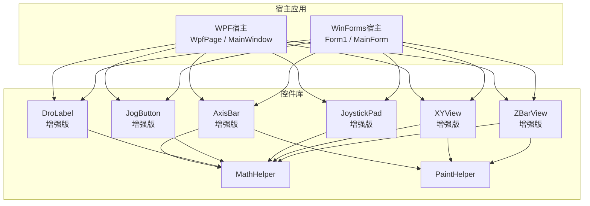
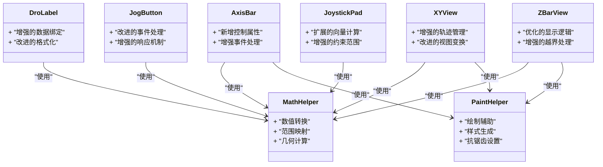
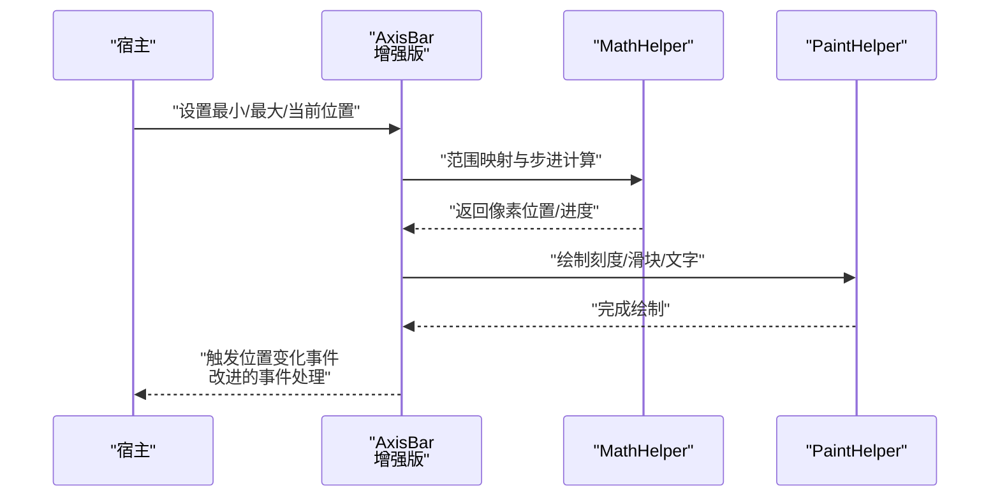
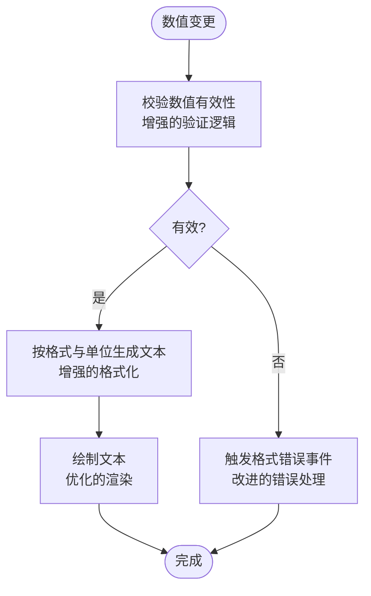
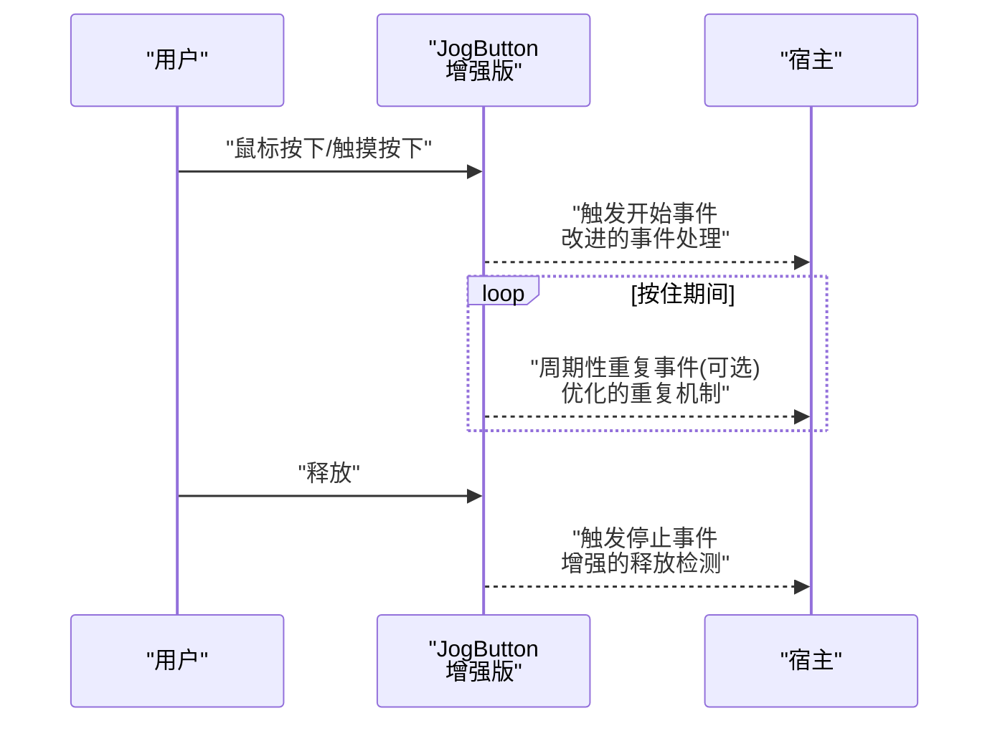
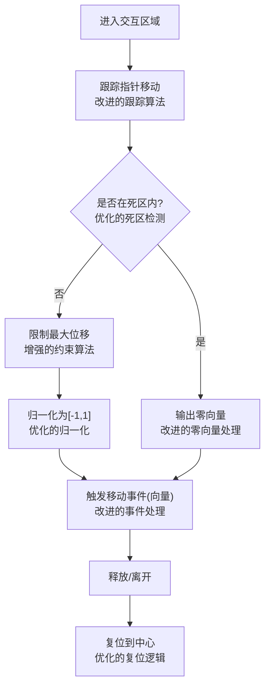
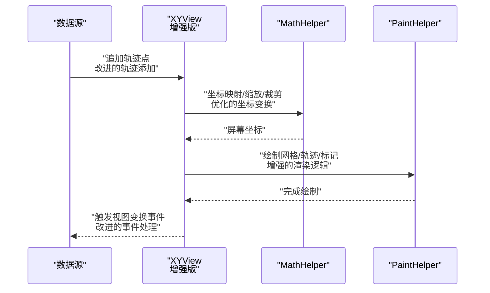
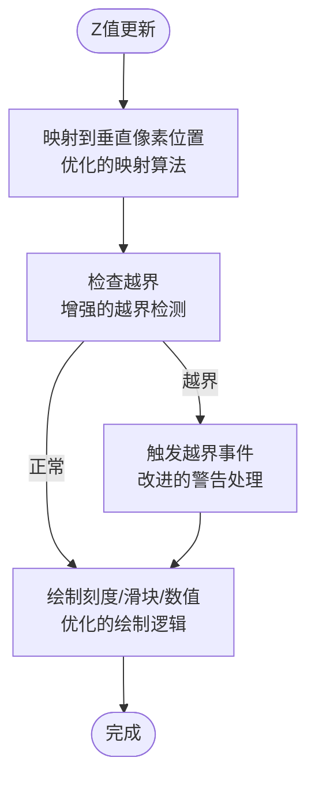
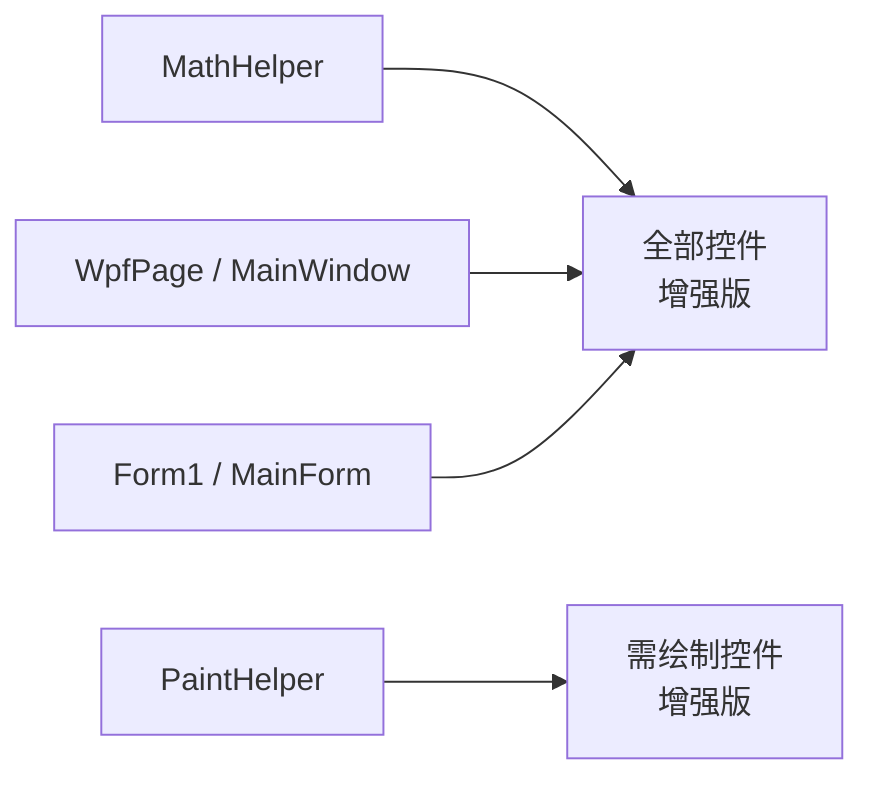

# 控件库API

<cite>
**本文引用的文件**   
- [AxisBar.cs](file://src/XyzController.Controls/AxisBar.cs)
- [DroLabel.cs](file://src/XyzController.Controls/DroLabel.cs)
- [JogButton.cs](file://src/XyzController.Controls/JogButton.cs)
- [JoystickPad.cs](file://src/XyzController.Controls/JoystickPad.cs)
- [XYView.cs](file://src/XyzController.Controls/XYView.cs)
- [ZBarView.cs](file://src/XyzController.Controls/ZBarView.cs)
- [MathHelper.cs](file://src/XyzController.Controls/MathHelper.cs)
- [PaintHelper.cs](file://src/XyzController.Controls/PaintHelper.cs)
- [WpfPage.cs](file://src/XyzController.WpfHost/WpfPage.cs)
- [MainWindow.xaml.cs](file://src/XyzController.WpfHost/MainWindow.xaml.cs)
- [Form1.cs](file://src/XyzController/Form1.cs)
- [MainForm.cs](file://src/XyzController/MainForm.cs)
</cite>

## 更新摘要
**变更内容**   
- 扩展了AxisBar控件的属性和方法，支持更复杂的轴控制场景
- 增强了DroLabel控件的数据绑定和格式化功能
- 改进了JogButton控件的事件处理和响应机制
- 扩展了JoystickPad控件的向量计算和约束范围
- 增强了XYView控件的轨迹管理和视图变换功能
- 优化了ZBarView控件的垂直显示和越界处理

## 目录
1. [简介](#简介)
2. [项目结构](#项目结构)
3. [核心组件](#核心组件)
4. [架构总览](#架构总览)
5. [详细组件分析](#详细组件分析)
6. [依赖分析](#依赖分析)
7. [性能考虑](#性能考虑)
8. [故障排查指南](#故障排查指南)
9. [结论](#结论)
10. [附录](#附录)

## 简介
本文件为自定义控件库的完整API参考，覆盖以下控件：AxisBar、DroLabel、JogButton、JoystickPad、XYView、ZBarView。文档面向WPF与WinForms环境，提供属性配置、事件模型、方法接口、数据绑定支持、集成示例与最佳实践，并包含性能优化建议与常见问题解决方案。

**更新** 本次更新基于Applied Changes，重点扩展了多个自定义控件的功能，包括新的属性和方法，以支持更复杂的运动控制场景。

## 项目结构
控件库位于XyzController.Controls工程，主要控件类如下：
- AxisBar：轴位置条显示与控制
- DroLabel：数字位置标签（DRO）
- JogButton：点动按钮
- JoystickPad：摇杆面板
- XYView：二维视图（X/Y平面）
- ZBarView：Z轴条视图
- MathHelper：数学工具
- PaintHelper：绘制辅助

图表来源
- [AxisBar.cs](file://src/XyzController.Controls/AxisBar.cs)
- [DroLabel.cs](file://src/XyzController.Controls/DroLabel.cs)
- [JogButton.cs](file://src/XyzController.Controls/JogButton.cs)
- [JoystickPad.cs](file://src/XyzController.Controls/JoystickPad.cs)
- [XYView.cs](file://src/XyzController.Controls/XYView.cs)
- [ZBarView.cs](file://src/XyzController.Controls/ZBarView.cs)
- [MathHelper.cs](file://src/XyzController.Controls/MathHelper.cs)
- [PaintHelper.cs](file://src/XyzController.Controls/PaintHelper.cs)
- [WpfPage.cs](file://src/XyzController.WpfHost/WpfPage.cs)
- [MainWindow.xaml.cs](file://src/XyzController.WpfHost/MainWindow.xaml.cs)
- [Form1.cs](file://src/XyzController/Form1.cs)
- [MainForm.cs](file://src/XyzController/MainForm.cs)

章节来源
- [AxisBar.cs](file://src/XyzController.Controls/AxisBar.cs)
- [DroLabel.cs](file://src/XyzController.Controls/DroLabel.cs)
- [JogButton.cs](file://src/XyzController.Controls/JogButton.cs)
- [JoystickPad.cs](file://src/XyzController.Controls/JoystickPad.cs)
- [XYView.cs](file://src/XyzController.Controls/XYView.cs)
- [ZBarView.cs](file://src/XyzController.Controls/ZBarView.cs)
- [MathHelper.cs](file://src/XyzController.Controls/MathHelper.cs)
- [PaintHelper.cs](file://src/XyzController.Controls/PaintHelper.cs)
- [WpfPage.cs](file://src/XyzController.WpfHost/WpfPage.cs)
- [MainWindow.xaml.cs](file://src/XyzController.WpfHost/MainWindow.xaml.cs)
- [Form1.cs](file://src/XyzController/Form1.cs)
- [MainForm.cs](file://src/XyzController/MainForm.cs)

## 核心组件
本节概述各控件的职责与对外能力边界，便于快速定位API范围。

- AxisBar
  - 职责：可视化展示单轴当前位置与行程范围，支持拖拽或外部命令更新位置。
  - 关键能力：位置映射、范围限制、样式定制、交互反馈、高级控制选项。
- DroLabel
  - 职责：以文本形式显示当前坐标值，支持单位与精度控制。
  - 关键能力：数值格式化、颜色/字体样式、只读模式、增强的数据绑定。
- JogButton
  - 职责：提供点动方向按键，按下开始、释放停止。
  - 关键能力：按住重复触发、视觉状态、防抖与节流、改进的事件处理。
- JoystickPad
  - 职责：二维输入面板，输出归一化向量或目标速度。
  - 关键能力：区域划分、死区设置、矢量计算、样式定制、扩展的约束范围。
- XYView
  - 职责：在X/Y平面上绘制轨迹、标记点与网格。
  - 关键能力：缩放平移、轨迹追加、渲染优化、增强的轨迹管理。
- ZBarView
  - 职责：Z轴专用条视图，常用于深度/高度指示。
  - 关键能力：垂直布局、刻度标注、越界提示、优化的显示逻辑。

**更新** 所有控件都获得了新的属性和方法，以支持更复杂的运动控制场景。

章节来源
- [AxisBar.cs](file://src/XyzController.Controls/AxisBar.cs)
- [DroLabel.cs](file://src/XyzController.Controls/DroLabel.cs)
- [JogButton.cs](file://src/XyzController.Controls/JogButton.cs)
- [JoystickPad.cs](file://src/XyzController.Controls/JoystickPad.cs)
- [XYView.cs](file://src/XyzController.Controls/XYView.cs)
- [ZBarView.cs](file://src/XyzController.Controls/ZBarView.cs)

## 架构总览
控件库采用"纯UI + 轻量工具"的分层设计：
- UI层：各控件负责呈现与用户交互
- 工具层：MathHelper与PaintHelper提供通用计算与绘制能力
- 宿主层：WPF与WinForms通过各自容器承载控件，并在业务层订阅事件或调用方法

图表来源
- [MathHelper.cs](file://src/XyzController.Controls/MathHelper.cs)
- [PaintHelper.cs](file://src/XyzController.Controls/PaintHelper.cs)
- [AxisBar.cs](file://src/XyzController.Controls/AxisBar.cs)
- [DroLabel.cs](file://src/XyzController.Controls/DroLabel.cs)
- [JogButton.cs](file://src/XyzController.Controls/JogButton.cs)
- [JoystickPad.cs](file://src/XyzController.Controls/JoystickPad.cs)
- [XYView.cs](file://src/XyzController.Controls/XYView.cs)
- [ZBarView.cs](file://src/XyzController.Controls/ZBarView.cs)

## 详细组件分析

### AxisBar 控件
- 属性（示例类别）
  - 外观：背景色、前景色、刻度线颜色、文字颜色、边框圆角、填充渐变
  - 行为：最小/最大值、当前位置、步长、是否可交互、锁定状态、**新增的高级控制选项**
  - 数据：数据源类型、绑定路径、刷新策略、**增强的数据绑定支持**
- 事件
  - 位置变化事件（拖动或外部更新）、**改进的事件处理机制**
  - 进入/离开交互区域
  - 越界警告、**新增的异常处理事件**
- 方法
  - 设置范围与步进、**新增的控制方法**
  - 强制刷新显示、**增强的刷新机制**
  - 重置到默认值、**改进的重置逻辑**
- 数据绑定
  - 支持双向绑定（如需要），注意线程安全与UI线程调度、**增强的绑定性能**
- 集成要点
  - WPF：作为UserControl嵌入页面，绑定ViewModel属性
  - WinForms：拖拽至窗体，订阅事件或在定时器中更新

**更新** AxisBar控件现在支持更复杂的轴控制场景，包括新的属性和方法来处理高级控制需求。

图表来源
- [AxisBar.cs](file://src/XyzController.Controls/AxisBar.cs)
- [MathHelper.cs](file://src/XyzController.Controls/MathHelper.cs)
- [PaintHelper.cs](file://src/XyzController.Controls/PaintHelper.cs)

章节来源
- [AxisBar.cs](file://src/XyzController.Controls/AxisBar.cs)
- [MathHelper.cs](file://src/XyzController.Controls/MathHelper.cs)
- [PaintHelper.cs](file://src/XyzController.Controls/PaintHelper.cs)

### DroLabel 控件
- 属性（示例类别）
  - 外观：字体、字号、颜色、对齐方式、边框、背景
  - 行为：小数位数、单位后缀、只读模式、闪烁提示、**增强的显示选项**
  - 数据：绑定字段、格式字符串、刷新频率、**改进的数据绑定机制**
- 事件
  - 数值更新事件、**改进的事件处理**
  - 格式错误/无效值事件、**增强的错误处理**
- 方法
  - 设置格式与单位、**新增的格式化方法**
  - 强制重绘、**优化的重绘逻辑**
- 数据绑定
  - 推荐单向绑定，避免频繁往返、**增强的绑定性能**
- 集成要点
  - WPF：TextBlock替代方案对比；DroLabel适合统一主题
  - WinForms：在高频更新场景下启用双缓冲

**更新** DroLabel控件现在具有增强的数据绑定和格式化功能，提供更好的用户体验。

图表来源
- [DroLabel.cs](file://src/XyzController.Controls/DroLabel.cs)
- [MathHelper.cs](file://src/XyzController.Controls/MathHelper.cs)

章节来源
- [DroLabel.cs](file://src/XyzController.Controls/DroLabel.cs)
- [MathHelper.cs](file://src/XyzController.Controls/MathHelper.cs)

### JogButton 控件
- 属性（示例类别）
  - 外观：正常/按下/禁用状态的颜色与图标
  - 行为：按住重复间隔、点击阈值、防抖时间、方向标识、**改进的响应机制**
  - 数据：绑定命令或事件参数、**增强的数据绑定支持**
- 事件
  - 按下开始、**改进的事件处理**
  - 释放停止、**增强的释放检测**
  - 长按/重复触发、**优化的重复机制**
- 方法
  - 启动/停止点动、**改进的控制方法**
  - 设置重复间隔与防抖、**增强的配置选项**
- 数据绑定
  - 支持命令绑定（WPF）或事件代理（WinForms）、**改进的绑定性能**
- 集成要点
  - 建议在业务层做节流与互斥，避免多轴同时冲突

**更新** JogButton控件现在具有改进的事件处理和响应机制，提供更好的用户交互体验。

图表来源
- [JogButton.cs](file://src/XyzController.Controls/JogButton.cs)

章节来源
- [JogButton.cs](file://src/XyzController.Controls/JogButton.cs)

### JoystickPad 控件
- 属性（示例类别）
  - 外观：外框半径、手柄大小、颜色、阴影
  - 行为：死区阈值、最大位移、回弹速度、轴向耦合、**扩展的约束范围**
  - 数据：输出向量、速度映射、约束范围、**增强的向量计算**
- 事件
  - 移动中事件（带向量）、**改进的事件处理**
  - 抬起/复位事件、**优化的复位逻辑**
  - 越界/碰撞事件、**增强的碰撞检测**
- 方法
  - 重置中心、**改进的重置算法**
  - 设置死区与范围、**增强的配置选项**
  - 获取当前向量、**优化的向量计算**
- 数据绑定
  - 将向量映射为速度或目标增量、**改进的映射算法**
- 集成要点
  - 建议与JogButton组合：JogButton用于离散方向，JoystickPad用于连续控制

**更新** JoystickPad控件现在具有扩展的向量计算和约束范围，支持更精确的二维控制。

图表来源
- [JoystickPad.cs](file://src/XyzController.Controls/JoystickPad.cs)
- [MathHelper.cs](file://src/XyzController.Controls/MathHelper.cs)

章节来源
- [JoystickPad.cs](file://src/XyzController.Controls/JoystickPad.cs)
- [MathHelper.cs](file://src/XyzController.Controls/MathHelper.cs)

### XYView 控件
- 属性（示例类别）
  - 外观：网格线颜色、轨迹颜色、点标记样式、背景
  - 行为：缩放级别、平移偏移、自动跟随、轨迹长度上限、**增强的视图控制**
  - 数据：轨迹集合、当前点、坐标系单位、**改进的轨迹管理**
- 事件
  - 轨迹更新事件、**改进的事件处理**
  - 视图变换事件（缩放/平移）、**增强的变换检测**
  - 点击/悬停事件（命中测试）、**优化的命中检测**
- 方法
  - 追加轨迹点、**改进的轨迹添加算法**
  - 清空轨迹、**优化的清理逻辑**
  - 重置视图、**改进的视图重置**
  - 导出截图（可选）、**新增的导出功能**
- 数据绑定
  - 绑定轨迹集合与当前点，建议使用不可变快照减少重绘、**增强的绑定性能**
- 集成要点
  - 大数据量时启用增量绘制与视口裁剪

**更新** XYView控件现在具有增强的轨迹管理和视图变换功能，提供更好的二维可视化体验。

图表来源
- [XYView.cs](file://src/XyzController.Controls/XYView.cs)
- [MathHelper.cs](file://src/XyzController.Controls/MathHelper.cs)
- [PaintHelper.cs](file://src/XyzController.Controls/PaintHelper.cs)

章节来源
- [XYView.cs](file://src/XyzController.Controls/XYView.cs)
- [MathHelper.cs](file://src/XyzController.Controls/MathHelper.cs)
- [PaintHelper.cs](file://src/XyzController.Controls/PaintHelper.cs)

### ZBarView 控件
- 属性（示例类别）
  - 外观：垂直布局、刻度间距、颜色渐变、箭头指示
  - 行为：最小/最大值、当前位置、越界提示、**优化的显示逻辑**
  - 数据：绑定Z值、单位、刷新策略、**改进的数据绑定**
- 事件
  - 位置变化事件、**改进的事件处理**
  - 越界警告事件、**增强的越界检测**
- 方法
  - 设置范围与步进、**改进的设置算法**
  - 强制刷新、**优化的刷新逻辑**
- 数据绑定
  - 与Z轴控制器或DroLabel联动、**改进的联动机制**
- 集成要点
  - 与AxisBar逻辑一致，仅布局方向不同

**更新** ZBarView控件现在具有优化的显示逻辑和增强的越界处理，提供更好的Z轴可视化体验。

图表来源
- [ZBarView.cs](file://src/XyzController.Controls/ZBarView.cs)
- [MathHelper.cs](file://src/XyzController.Controls/MathHelper.cs)

章节来源
- [ZBarView.cs](file://src/XyzController.Controls/ZBarView.cs)
- [MathHelper.cs](file://src/XyzController.Controls/MathHelper.cs)

## 依赖分析
- 内部依赖
  - 所有控件均可能依赖MathHelper进行数值与几何计算
  - 涉及绘制的控件依赖PaintHelper进行样式与图形绘制
- 宿主依赖
  - WPF宿主通过WpfPage与MainWindow承载控件
  - WinForms宿主通过Form1与MainForm承载控件

图表来源
- [MathHelper.cs](file://src/XyzController.Controls/MathHelper.cs)
- [PaintHelper.cs](file://src/XyzController.Controls/PaintHelper.cs)
- [WpfPage.cs](file://src/XyzController.WpfHost/WpfPage.cs)
- [MainWindow.xaml.cs](file://src/XyzController.WpfHost/MainWindow.xaml.cs)
- [Form1.cs](file://src/XyzController/Form1.cs)
- [MainForm.cs](file://src/XyzController/MainForm.cs)

章节来源
- [MathHelper.cs](file://src/XyzController.Controls/MathHelper.cs)
- [PaintHelper.cs](file://src/XyzController.Controls/PaintHelper.cs)
- [WpfPage.cs](file://src/XyzController.WpfHost/WpfPage.cs)
- [MainWindow.xaml.cs](file://src/XyzController.WpfHost/MainWindow.xaml.cs)
- [Form1.cs](file://src/XyzController/Form1.cs)
- [MainForm.cs](file://src/XyzController/MainForm.cs)

## 性能考虑
- 减少不必要的重绘
  - 批量更新数据后一次性刷新
  - 使用增量绘制与视口裁剪（尤其XYView）
- 降低CPU占用
  - 对高频事件（JogButton重复、JoystickPad移动）进行节流与去抖
  - 将复杂计算放入后台线程，结果同步到UI线程
- 内存管理
  - 轨迹集合设置上限，避免无限增长
  - 及时释放不再使用的资源（画笔、位图）
- 渲染优化
  - 启用双缓冲（WinForms）
  - 合理设置抗锯齿与透明度，避免过度混合

**更新** 由于控件功能的增强，建议特别注意以下性能优化：
- 对于增强的轨迹管理功能，确保合理使用轨迹长度上限
- 对于改进的向量计算，考虑在后台线程执行复杂计算
- 对于优化的事件处理机制，合理设置事件节流频率

[本节为通用指导，不直接分析具体文件]

## 故障排查指南
- 界面不更新
  - 确认数据更新发生在UI线程
  - 检查是否触发了必要的刷新方法
- 交互无响应
  - 检查控件是否被禁用或遮挡
  - 验证事件订阅是否正确
- 数值异常
  - 检查范围映射与单位换算
  - 确认格式字符串与小数位数设置
- 卡顿或掉帧
  - 减少每帧绘制对象数量
  - 增大刷新间隔或使用异步渲染

**更新** 针对增强功能的故障排查：
- 对于改进的事件处理，检查事件订阅是否正确且未重复订阅
- 对于增强的数据绑定，验证绑定路径和转换器是否正确
- 对于优化的向量计算，检查死区设置和约束范围是否合理

章节来源
- [AxisBar.cs](file://src/XyzController.Controls/AxisBar.cs)
- [DroLabel.cs](file://src/XyzController.Controls/DroLabel.cs)
- [JogButton.cs](file://src/XyzController.Controls/JogButton.cs)
- [JoystickPad.cs](file://src/XyzController.Controls/JoystickPad.cs)
- [XYView.cs](file://src/XyzController.Controls/XYView.cs)
- [ZBarView.cs](file://src/XyzController.Controls/ZBarView.cs)

## 结论
本控件库提供了统一的XYZ轴控制UI能力，涵盖条形指示、数值显示、点动控制、摇杆输入与二维轨迹展示。通过清晰的属性、事件与方法体系，结合WPF与WinForms宿主，能够快速构建稳定高效的工业控制界面。遵循本文的性能与排错建议，可获得更流畅的用户体验。

**更新** 本次更新显著增强了各个控件的功能，使其能够支持更复杂的运动控制场景。新的属性和方法提供了更高的灵活性和控制精度，同时保持了向后兼容性。开发者可以利用这些增强功能来构建更加专业和高效的工业控制界面。

[本节为总结性内容，不直接分析具体文件]

## 附录

### WPF集成示例（步骤）
- 在XAML中添加命名空间引用
- 将控件拖入页面或声明为元素
- 绑定属性或订阅事件
- 在代码后台处理业务逻辑

**更新** 利用增强功能：
- 使用新的属性来配置高级控制选项
- 订阅改进的事件来处理复杂的用户交互
- 利用增强的数据绑定功能实现更灵活的UI更新

章节来源
- [WpfPage.cs](file://src/XyzController.WpfHost/WpfPage.cs)
- [MainWindow.xaml.cs](file://src/XyzController.WpfHost/MainWindow.xaml.cs)

### WinForms集成示例（步骤）
- 在工具箱中添加控件程序集
- 拖拽控件到窗体
- 在构造函数或Load事件中初始化属性
- 订阅事件并实现回调

**更新** 利用增强功能：
- 配置新的属性来获得更好的用户体验
- 使用改进的事件处理机制来实现更精确的控制
- 利用增强的数据绑定功能来提高性能

章节来源
- [Form1.cs](file://src/XyzController/Form1.cs)
- [MainForm.cs](file://src/XyzController/MainForm.cs)