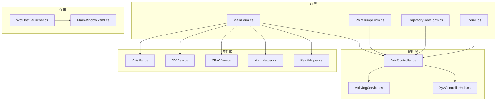
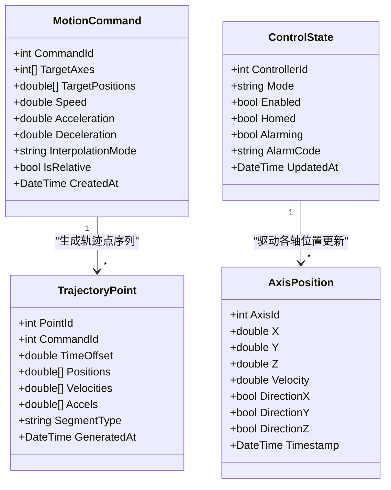
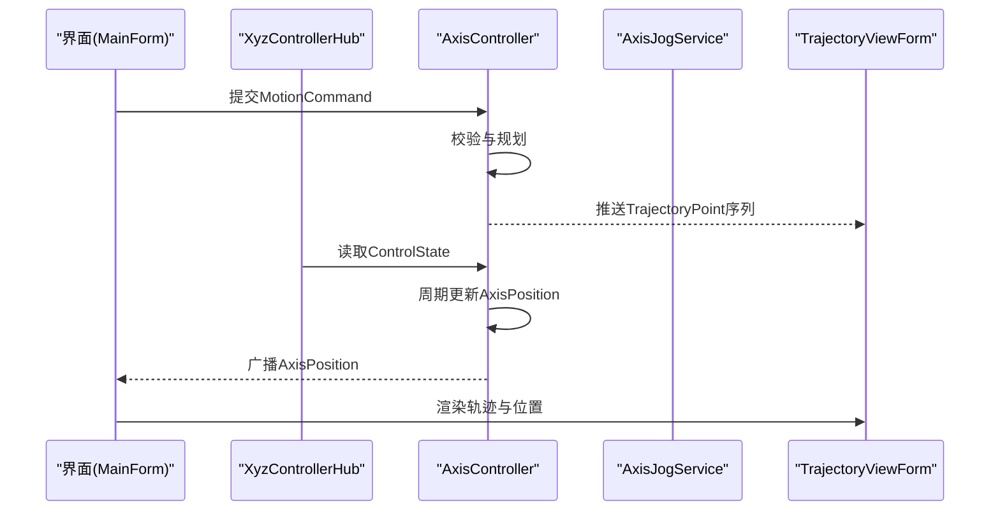
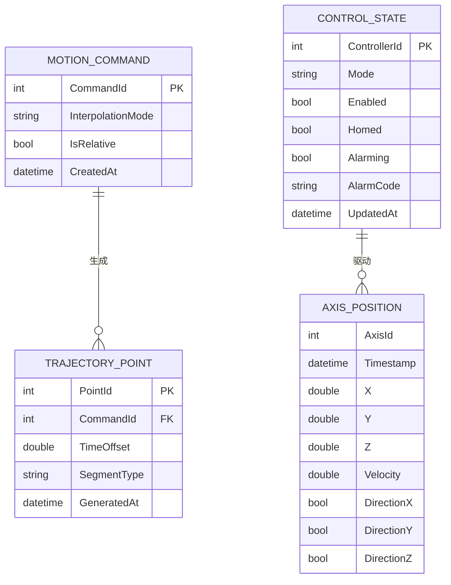
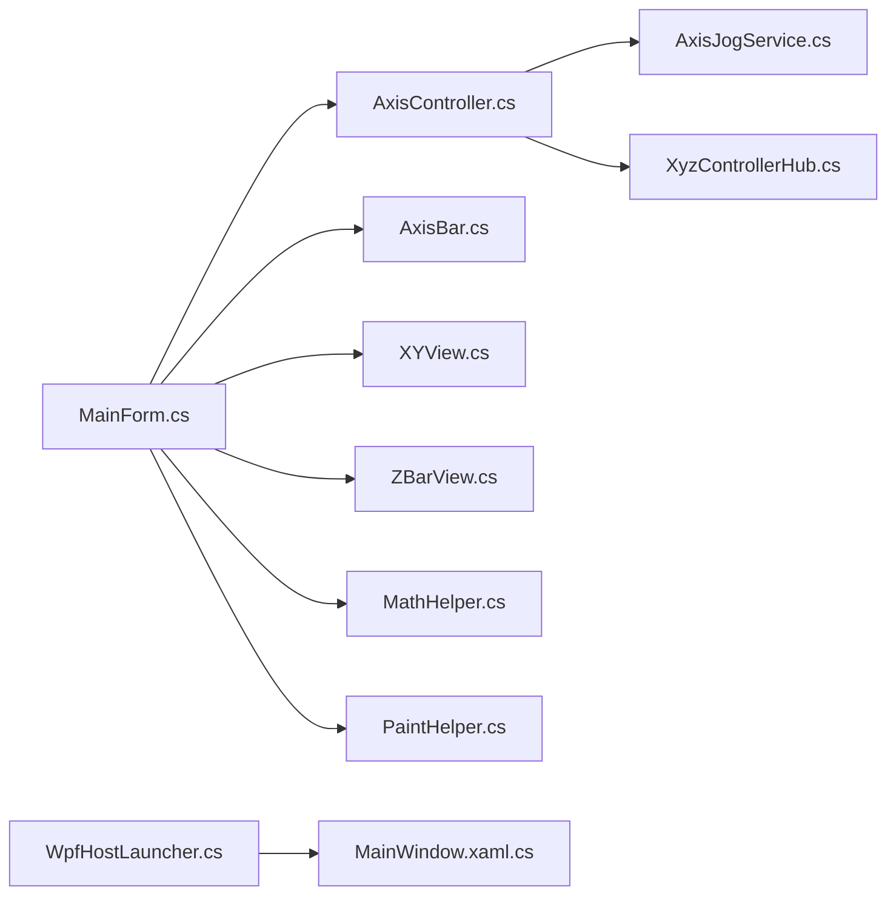

# 数据模型

<cite>
**本文引用的文件**   
- [AxisController.cs](file://src/XyzController/Logic/AxisController.cs)
- [AxisJogService.cs](file://src/XyzController/Logic/AxisJogService.cs)
- [XyzControllerHub.cs](file://src/XyzController/Logic/XyzControllerHub.cs)
- [Form1.cs](file://src/XyzController/Form1.cs)
- [MainForm.cs](file://src/XyzController/MainForm.cs)
- [PointJumpForm.cs](file://src/XyzController/PointJumpForm.cs)
- [TrajectoryViewForm.cs](file://src/XyzController/TrajectoryViewForm.cs)
- [Program.cs](file://src/XyzController/Program.cs)
- [AxisBar.cs](file://src/XyzController.Controls/AxisBar.cs)
- [XYView.cs](file://src/XyzController.Controls/XYView.cs)
- [ZBarView.cs](file://src/XyzController.Controls/ZBarView.cs)
- [MathHelper.cs](file://src/XyzController.Controls/MathHelper.cs)
- [PaintHelper.cs](file://src/XyzController.Controls/PaintHelper.cs)
- [WpfHostLauncher.cs](file://src/XyzController.WpfHost/WpfHostLauncher.cs)
- [MainWindow.xaml.cs](file://src/XyzController.WpfHost/MainWindow.xaml.cs)
</cite>

## 目录
1. [简介](#简介)
2. [项目结构](#项目结构)
3. [核心数据模型](#核心数据模型)
4. [架构总览](#架构总览)
5. [详细组件分析](#详细组件分析)
6. [依赖关系分析](#依赖关系分析)
7. [性能与约束](#性能与约束)
8. [故障排查指南](#故障排查指南)
9. [结论](#结论)
10. [附录：序列化与验证规范](#附录：序列化与验证规范)

## 简介
本文件聚焦于项目中与运动控制相关的数据模型，围绕以下核心概念进行系统化说明：
- AxisPosition：轴位置状态（当前坐标、速度、方向等）
- MotionCommand：运动指令（目标位置、速度、加速度、插补模式等）
- TrajectoryPoint：轨迹点（时间戳、目标位置、插补参数等）
- ControlState：控制器全局状态（运行模式、报警、使能、同步标志等）

文档将给出字段类型、取值范围、业务含义、关系与约束、序列化格式（JSON/XML）、验证规则与业务约束，并提供创建、修改、查询的示例路径，帮助开发者正确使用这些数据结构。

## 项目结构
本项目采用分层组织方式：
- 逻辑层（Logic）：包含轴控制、点动服务、Hub通信等核心逻辑
- 控件库（Controls）：提供可视化与交互控件
- WPF宿主（WpfHost）：提供UI入口与页面承载
- 测试（Tests）：单元测试与集成测试

图表来源
- [AxisController.cs](file://src/XyzController/Logic/AxisController.cs)
- [AxisJogService.cs](file://src/XyzController/Logic/AxisJogService.cs)
- [XyzControllerHub.cs](file://src/XyzController/Logic/XyzControllerHub.cs)
- [MainForm.cs](file://src/XyzController/MainForm.cs)
- [PointJumpForm.cs](file://src/XyzController/PointJumpForm.cs)
- [TrajectoryViewForm.cs](file://src/XyzController/TrajectoryViewForm.cs)
- [Form1.cs](file://src/XyzController/Form1.cs)
- [AxisBar.cs](file://src/XyzController.Controls/AxisBar.cs)
- [XYView.cs](file://src/XyzController.Controls/XYView.cs)
- [ZBarView.cs](file://src/XyzController.Controls/ZBarView.cs)
- [MathHelper.cs](file://src/XyzController.Controls/MathHelper.cs)
- [PaintHelper.cs](file://src/XyzController.Controls/PaintHelper.cs)
- [WpfHostLauncher.cs](file://src/XyzController.WpfHost/WpfHostLauncher.cs)
- [MainWindow.xaml.cs](file://src/XyzController.WpfHost/MainWindow.xaml.cs)

章节来源
- [AxisController.cs](file://src/XyzController/Logic/AxisController.cs)
- [AxisJogService.cs](file://src/XyzController/Logic/AxisJogService.cs)
- [XyzControllerHub.cs](file://src/XyzController/Logic/XyzControllerHub.cs)
- [MainForm.cs](file://src/XyzController/MainForm.cs)
- [PointJumpForm.cs](file://src/XyzController/PointJumpForm.cs)
- [TrajectoryViewForm.cs](file://src/XyzController/TrajectoryViewForm.cs)
- [Form1.cs](file://src/XyzController/Form1.cs)
- [AxisBar.cs](file://src/XyzController.Controls/AxisBar.cs)
- [XYView.cs](file://src/XyzController.Controls/XYView.cs)
- [ZBarView.cs](file://src/XyzController.Controls/ZBarView.cs)
- [MathHelper.cs](file://src/XyzController.Controls/MathHelper.cs)
- [PaintHelper.cs](file://src/XyzController.Controls/PaintHelper.cs)
- [WpfHostLauncher.cs](file://src/XyzController.WpfHost/WpfHostLauncher.cs)
- [MainWindow.xaml.cs](file://src/XyzController.WpfHost/MainWindow.xaml.cs)

## 核心数据模型
本节对四个核心数据模型进行统一建模与说明。为便于理解，先给出类图，再逐一分解字段、约束与关系。

图表来源
- [AxisController.cs](file://src/XyzController/Logic/AxisController.cs)
- [AxisJogService.cs](file://src/XyzController/Logic/AxisJogService.cs)
- [XyzControllerHub.cs](file://src/XyzController/Logic/XyzControllerHub.cs)

### AxisPosition（轴位置状态）
- 用途：描述单条轴或三轴组合的实时位置、速度与方向，供UI显示与上层逻辑使用。
- 关键字段
  - AxisId：整型，标识轴编号（建议范围 0..N-1，N为轴数）
  - X/Y/Z：双精度浮点，单位通常为毫米或脉冲当量换算后的物理单位
  - Velocity：双精度浮点，瞬时速度，非负
  - DirectionX/Y/Z：布尔，表示当前移动方向（正/负）
  - Timestamp：时间戳，记录采样时刻
- 取值范围与约束
  - X/Y/Z：受硬件限位与行程限制；需满足最小分辨率与最大行程
  - Velocity：≥0，且不超过轴最大允许速度
  - Direction：仅取真/假
- 业务含义
  - 用于闭环反馈、越界保护、轨迹跟踪误差计算
- 关联关系
  - 被ControlState驱动更新，作为其子状态的一部分

章节来源
- [AxisController.cs](file://src/XyzController/Logic/AxisController.cs)
- [MainForm.cs](file://src/XyzController/MainForm.cs)
- [TrajectoryViewForm.cs](file://src/XyzController/TrajectoryViewForm.cs)

### MotionCommand（运动指令）
- 用途：表达一次或多轴的期望运动，包括目标位置、速度曲线与插补模式。
- 关键字段
  - CommandId：整型，唯一标识命令
  - TargetAxes：整型数组，参与插补的轴索引集合
  - TargetPositions：双精度数组，对应轴的目标位置
  - Speed/Acceleration/Deceleration：双精度，速度及加减速参数
  - InterpolationMode：字符串，如“直线”、“圆弧”、“样条”等
  - IsRelative：布尔，相对/绝对定位
  - CreatedAt：时间戳，命令创建时间
- 取值范围与约束
  - TargetAxes与TargetPositions长度一致
  - Speed/Acceleration/Deceleration ≥0
  - InterpolationMode需在枚举值范围内
- 业务含义
  - 作为轨迹规划输入，生成TrajectoryPoint序列
- 关联关系
  - 一对多关联到TrajectoryPoint

章节来源
- [AxisController.cs](file://src/XyzController/Logic/AxisController.cs)
- [AxisJogService.cs](file://src/XyzController/Logic/AxisJogService.cs)
- [PointJumpForm.cs](file://src/XyzController/PointJumpForm.cs)

### TrajectoryPoint（轨迹点）
- 用途：由MotionCommand经轨迹规划生成的离散点集，用于下发执行或回放展示。
- 关键字段
  - PointId：整型，唯一标识轨迹点
  - CommandId：整型，外键指向所属命令
  - TimeOffset：双精度，相对命令起始的时间偏移
  - Positions/Velocities/Accels：双精度数组，对应轴在该点的状态
  - SegmentType：字符串，线段类型（如直线段、过渡段）
  - GeneratedAt：时间戳，生成时间
- 取值范围与约束
  - TimeOffset单调递增
  - 数组长度与命令中轴数一致
- 业务含义
  - 作为执行器下发的步进参考，也用于轨迹回放与可视化
- 关联关系
  - 外键关联至MotionCommand

章节来源
- [AxisController.cs](file://src/XyzController/Logic/AxisController.cs)
- [TrajectoryViewForm.cs](file://src/XyzController/TrajectoryViewForm.cs)

### ControlState（控制器状态）
- 用途：描述控制器整体运行状态，包括模式、使能、报警等。
- 关键字段
  - ControllerId：整型，控制器标识
  - Mode：字符串，运行模式（如“手动”、“自动”、“回零”）
  - Enabled：布尔，是否使能
  - Homed：布尔，是否完成回零
  - Alarming：布尔，是否存在报警
  - AlarmCode：字符串，报警码
  - UpdatedAt：时间戳，状态更新时间
- 取值范围与约束
  - Mode需在允许的模式集合内
  - Alarming为真时，AlarmCode不应为空
- 业务含义
  - 决定系统可接受的操作类型与安全策略
- 关联关系
  - 驱动AxisPosition的周期性更新

章节来源
- [XyzControllerHub.cs](file://src/XyzController/Logic/XyzControllerHub.cs)
- [MainForm.cs](file://src/XyzController/MainForm.cs)

## 架构总览
下图展示了数据模型在系统中的流转与依赖关系：ControlState驱动AxisPosition更新；MotionCommand经规划生成TrajectoryPoint；UI通过控件读取并展示这些数据。

图表来源
- [XyzControllerHub.cs](file://src/XyzController/Logic/XyzControllerHub.cs)
- [AxisController.cs](file://src/XyzController/Logic/AxisController.cs)
- [AxisJogService.cs](file://src/XyzController/Logic/AxisJogService.cs)
- [MainForm.cs](file://src/XyzController/MainForm.cs)
- [TrajectoryViewForm.cs](file://src/XyzController/TrajectoryViewForm.cs)

## 详细组件分析

### 数据模型关系与约束
- 主键与外键
  - MotionCommand.CommandId：主键
  - TrajectoryPoint.PointId：主键
  - TrajectoryPoint.CommandId：外键，引用MotionCommand.CommandId
  - ControlState.ControllerId：主键（若按控制器维度存储）
  - AxisPosition.AxisId：复合主键的一部分（与Timestamp共同构成时序主键）
- 一致性约束
  - TargetAxes与TargetPositions长度相等
  - Positions/Velocities/Accels长度等于轴数
  - TimeOffset严格递增
- 安全约束
  - 速度、加速度非负
  - 位置不超出硬件限位
  - 报警状态下禁止下发新指令

图表来源
- [AxisController.cs](file://src/XyzController/Logic/AxisController.cs)
- [AxisJogService.cs](file://src/XyzController/Logic/AxisJogService.cs)
- [XyzControllerHub.cs](file://src/XyzController/Logic/XyzControllerHub.cs)

章节来源
- [AxisController.cs](file://src/XyzController/Logic/AxisController.cs)
- [AxisJogService.cs](file://src/XyzController/Logic/AxisJogService.cs)
- [XyzControllerHub.cs](file://src/XyzController/Logic/XyzControllerHub.cs)

### 创建、修改与查询示例路径
以下为常见操作的代码片段路径，便于快速定位实现：
- 创建MotionCommand并提交
  - [PointJumpForm.cs](file://src/XyzController/PointJumpForm.cs)
  - [AxisController.cs](file://src/XyzController/Logic/AxisController.cs)
- 生成TrajectoryPoint序列
  - [AxisController.cs](file://src/XyzController/Logic/AxisController.cs)
  - [TrajectoryViewForm.cs](file://src/XyzController/TrajectoryViewForm.cs)
- 读取与控制ControlState
  - [XyzControllerHub.cs](file://src/XyzController/Logic/XyzControllerHub.cs)
  - [MainForm.cs](file://src/XyzController/MainForm.cs)
- 订阅与展示AxisPosition
  - [MainForm.cs](file://src/XyzController/MainForm.cs)
  - [TrajectoryViewForm.cs](file://src/XyzController/TrajectoryViewForm.cs)
  - [AxisBar.cs](file://src/XyzController.Controls/AxisBar.cs)
  - [XYView.cs](file://src/XyzController.Controls/XYView.cs)
  - [ZBarView.cs](file://src/XyzController.Controls/ZBarView.cs)

章节来源
- [PointJumpForm.cs](file://src/XyzController/PointJumpForm.cs)
- [AxisController.cs](file://src/XyzController/Logic/AxisController.cs)
- [TrajectoryViewForm.cs](file://src/XyzController/TrajectoryViewForm.cs)
- [XyzControllerHub.cs](file://src/XyzController/Logic/XyzControllerHub.cs)
- [MainForm.cs](file://src/XyzController/MainForm.cs)
- [AxisBar.cs](file://src/XyzController.Controls/AxisBar.cs)
- [XYView.cs](file://src/XyzController.Controls/XYView.cs)
- [ZBarView.cs](file://src/XyzController.Controls/ZBarView.cs)

## 依赖关系分析
- 模块耦合
  - AxisController依赖AxisJogService（点动模式）与XyzControllerHub（通信）
  - UI层依赖控件库进行可视化
- 外部依赖
  - 数学与绘图工具：MathHelper、PaintHelper
  - WPF宿主：WpfHostLauncher、MainWindow

图表来源
- [AxisController.cs](file://src/XyzController/Logic/AxisController.cs)
- [AxisJogService.cs](file://src/XyzController/Logic/AxisJogService.cs)
- [XyzControllerHub.cs](file://src/XyzController/Logic/XyzControllerHub.cs)
- [MainForm.cs](file://src/XyzController/MainForm.cs)
- [AxisBar.cs](file://src/XyzController.Controls/AxisBar.cs)
- [XYView.cs](file://src/XyzController.Controls/XYView.cs)
- [ZBarView.cs](file://src/XyzController.Controls/ZBarView.cs)
- [MathHelper.cs](file://src/XyzController.Controls/MathHelper.cs)
- [PaintHelper.cs](file://src/XyzController.Controls/PaintHelper.cs)
- [WpfHostLauncher.cs](file://src/XyzController.WpfHost/WpfHostLauncher.cs)
- [MainWindow.xaml.cs](file://src/XyzController.WpfHost/MainWindow.xaml.cs)

章节来源
- [AxisController.cs](file://src/XyzController/Logic/AxisController.cs)
- [AxisJogService.cs](file://src/XyzController/Logic/AxisJogService.cs)
- [XyzControllerHub.cs](file://src/XyzController/Logic/XyzControllerHub.cs)
- [MainForm.cs](file://src/XyzController/MainForm.cs)
- [AxisBar.cs](file://src/XyzController.Controls/AxisBar.cs)
- [XYView.cs](file://src/XyzController.Controls/XYView.cs)
- [ZBarView.cs](file://src/XyzController.Controls/ZBarView.cs)
- [MathHelper.cs](file://src/XyzController.Controls/MathHelper.cs)
- [PaintHelper.cs](file://src/XyzController.Controls/PaintHelper.cs)
- [WpfHostLauncher.cs](file://src/XyzController.WpfHost/WpfHostLauncher.cs)
- [MainWindow.xaml.cs](file://src/XyzController.WpfHost/MainWindow.xaml.cs)

## 性能与约束
- 批量处理
  - 轨迹点应批量下发，减少频繁IO与上下文切换
- 内存占用
  - 大轨迹需分页或流式处理，避免一次性加载全部点
- 线程安全
  - AxisPosition更新与UI读取需保证并发安全
- 数值稳定性
  - 使用双精度浮点，注意累积误差与舍入策略
- 限幅与防抖
  - 对速度、加速度设置上限，防止过冲与抖动

[本节为通用指导，无需具体文件来源]

## 故障排查指南
- 常见问题
  - 轨迹点TimeOffset不单调：检查规划算法与时间基准
  - 轴位置越界：核对限位配置与目标位置合法性
  - 报警未清除：确认AlarmCode并复位后重试
- 定位方法
  - 查看ControlState.Mode与Alarming标志
  - 对比MotionCommand与TrajectoryPoint的一致性
  - 检查AxisPosition变化趋势与Velocity峰值

章节来源
- [XyzControllerHub.cs](file://src/XyzController/Logic/XyzControllerHub.cs)
- [AxisController.cs](file://src/XyzController/Logic/AxisController.cs)
- [MainForm.cs](file://src/XyzController/MainForm.cs)

## 结论
通过对AxisPosition、MotionCommand、TrajectoryPoint、ControlState四大模型的统一建模与约束定义，结合清晰的依赖关系与序列化规范，可为开发、测试与维护提供一致的数据契约。建议在后续迭代中补充完整的枚举定义、边界条件与异常分支，以提升系统的健壮性与可维护性。

[本节为总结性内容，无需具体文件来源]

## 附录：序列化与验证规范

### JSON格式约定
- 根对象
  - MotionCommand：包含CommandId、TargetAxes、TargetPositions、Speed、Acceleration、Deceleration、InterpolationMode、IsRelative、CreatedAt
  - TrajectoryPoint：包含PointId、CommandId、TimeOffset、Positions、Velocities、Accels、SegmentType、GeneratedAt
  - ControlState：包含ControllerId、Mode、Enabled、Homed、Alarming、AlarmCode、UpdatedAt
  - AxisPosition：包含AxisId、X、Y、Z、Velocity、DirectionX、DirectionY、DirectionZ、Timestamp
- 命名风格
  - 使用小驼峰命名（例如：commandId、targetAxes、createdAt）
- 数值与时间
  - 数值使用双精度浮点
  - 时间使用ISO 8601字符串（UTC）

### XML格式约定
- 根元素
  - <MotionCommand>、<TrajectoryPoint>、<ControlState>、<AxisPosition>
- 属性与子节点
  - 基本类型以属性形式出现（如 commandId="123"）
  - 数组以重复子节点呈现（如 <TargetAxes><i>0</i><i>1</i></TargetAxes>）
- 命名空间
  - 建议使用统一命名空间以避免冲突

### 验证规则与业务约束
- 必填字段
  - CommandId、PointId、ControllerId、AxisId不可为空
  - TargetAxes与TargetPositions长度必须一致
  - Positions/Velocities/Accels长度必须等于轴数
- 范围约束
  - Speed/Acceleration/Deceleration ≥0
  - TimeOffset严格递增
  - X/Y/Z在硬件限位范围内
- 状态机约束
  - Alarming为真时，禁止下发新MotionCommand
  - Mode为“回零”期间，禁止相对定位

章节来源
- [AxisController.cs](file://src/XyzController/Logic/AxisController.cs)
- [AxisJogService.cs](file://src/XyzController/Logic/AxisJogService.cs)
- [XyzControllerHub.cs](file://src/XyzController/Logic/XyzControllerHub.cs)
- [MainForm.cs](file://src/XyzController/MainForm.cs)
- [TrajectoryViewForm.cs](file://src/XyzController/TrajectoryViewForm.cs)