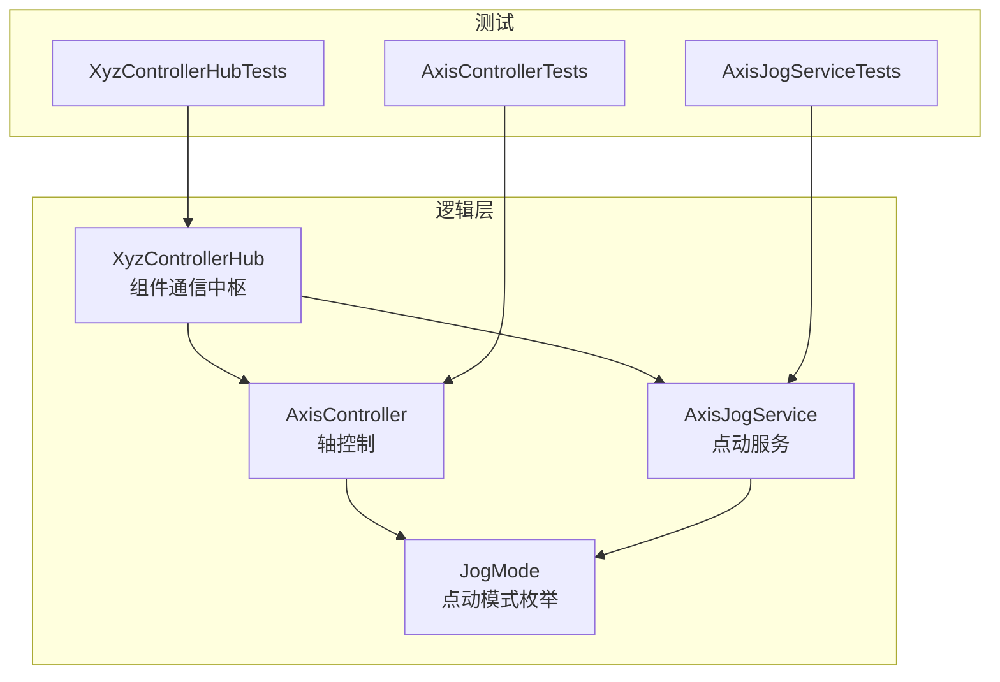
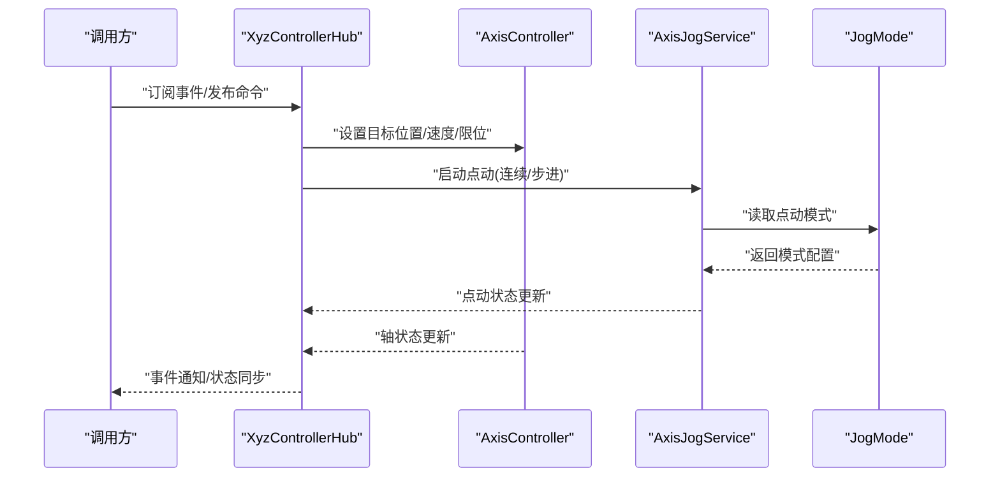
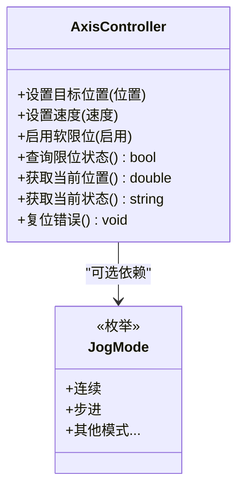
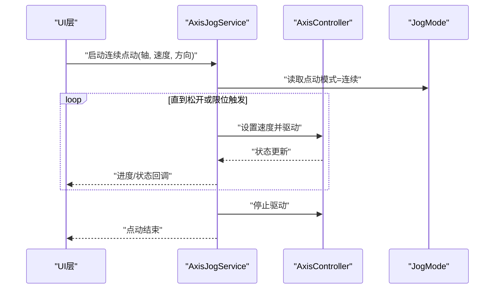
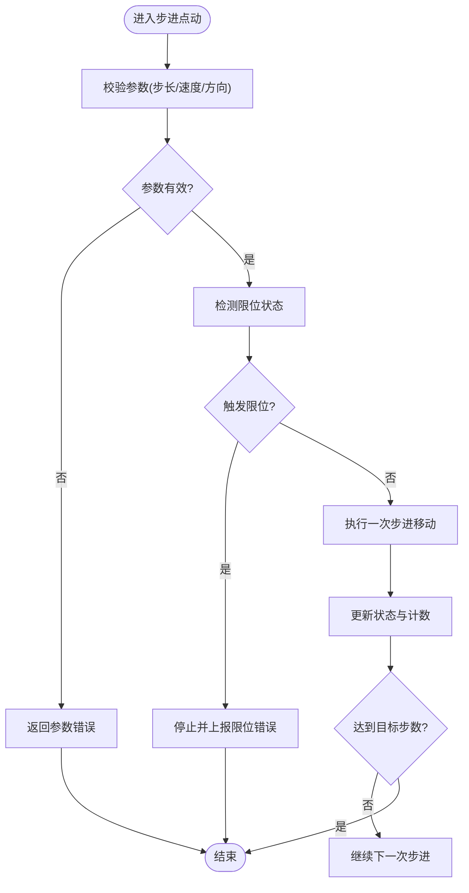
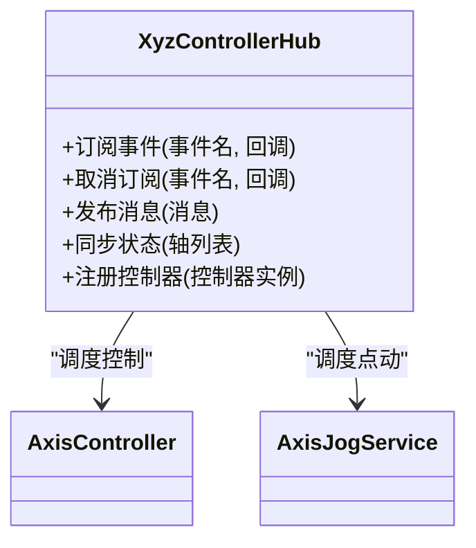
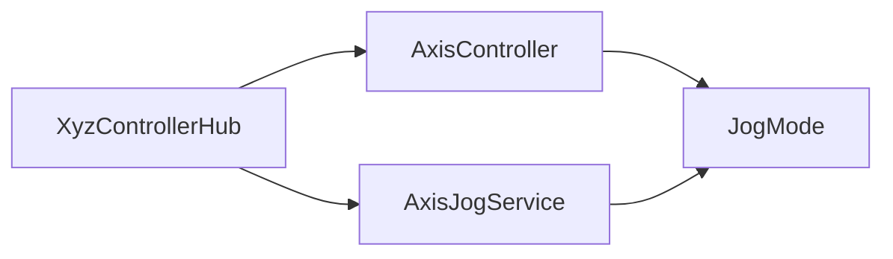

# 核心控制API

<cite>
**本文引用的文件**   
- [AxisController.cs](file://src/XyzController/Logic/AxisController.cs)
- [AxisJogService.cs](file://src/XyzController/Logic/AxisJogService.cs)
- [JogMode.cs](file://src/XyzController/Logic/JogMode.cs)
- [XyzControllerHub.cs](file://src/XyzController/Logic/XyzControllerHub.cs)
- [AxisControllerTests.cs](file://src/XyzController.Tests/Tests/AxisControllerTests.cs)
- [AxisJogServiceTests.cs](file://src/XyzController.Tests/Tests/AxisJogServiceTests.cs)
- [XyzControllerHubTests.cs](file://src/XyzController.Tests/Tests/XyzControllerHubTests.cs)
</cite>

## 目录
1. [简介](#简介)
2. [项目结构](#项目结构)
3. [核心组件](#核心组件)
4. [架构总览](#架构总览)
5. [详细组件分析](#详细组件分析)
6. [依赖关系分析](#依赖关系分析)
7. [性能考虑](#性能考虑)
8. [故障排查指南](#故障排查指南)
9. [结论](#结论)
10. [附录](#附录)

## 简介
本文件聚焦于“核心控制API”，面向需要调用轴控制、点动与组件通信能力的开发者。文档覆盖以下范围：
- AxisController 类的完整接口说明（轴位置控制、速度设置、限位保护等）
- AxisJogService 的点动控制 API（连续点动与步进点动）
- XyzControllerHub 的组件通信接口（事件订阅、消息发布、状态同步）
- JogMode 枚举的所有选项与使用场景
- 公共方法的参数验证规则与边界条件
- 异常处理与错误码含义
- 完整的代码示例路径，便于快速定位实现与测试用例

## 项目结构
核心控制相关源码位于 src/XyzController/Logic 目录下，测试用例位于 src/XyzController.Tests/Tests 目录。下图展示了核心类之间的组织关系与职责划分。

图表来源
- [AxisController.cs](file://src/XyzController/Logic/AxisController.cs)
- [AxisJogService.cs](file://src/XyzController/Logic/AxisJogService.cs)
- [JogMode.cs](file://src/XyzController/Logic/JogMode.cs)
- [XyzControllerHub.cs](file://src/XyzController/Logic/XyzControllerHub.cs)
- [AxisControllerTests.cs](file://src/XyzController.Tests/Tests/AxisControllerTests.cs)
- [AxisJogServiceTests.cs](file://src/XyzController.Tests/Tests/AxisJogServiceTests.cs)
- [XyzControllerHubTests.cs](file://src/XyzController.Tests/Tests/XyzControllerHubTests.cs)

章节来源
- [AxisController.cs](file://src/XyzController/Logic/AxisController.cs)
- [AxisJogService.cs](file://src/XyzController/Logic/AxisJogService.cs)
- [JogMode.cs](file://src/XyzController/Logic/JogMode.cs)
- [XyzControllerHub.cs](file://src/XyzController/Logic/XyzControllerHub.cs)

## 核心组件
本节概述各核心组件的职责与对外暴露的关键能力，为后续详细分析提供上下文。

- AxisController：负责单轴的底层控制，包括目标位置设定、速度配置、限位保护、状态查询等。
- AxisJogService：封装点动控制逻辑，支持连续点动与步进点动两种模式，并协调 JogMode 的行为差异。
- JogMode：定义点动模式枚举，用于区分不同点动策略（如连续、步进、回零等）。
- XyzControllerHub：作为组件通信中枢，提供事件订阅、消息发布与状态同步机制，协调上层控制器与子系统。

章节来源
- [AxisController.cs](file://src/XyzController/Logic/AxisController.cs)
- [AxisJogService.cs](file://src/XyzController/Logic/AxisJogService.cs)
- [JogMode.cs](file://src/XyzController/Logic/JogMode.cs)
- [XyzControllerHub.cs](file://src/XyzController/Logic/XyzControllerHub.cs)

## 架构总览
下图展示核心控制API在系统内的交互关系：上层通过 Hub 进行事件与消息的订阅/发布；Hub 调度 AxisController 与 AxisJogService 完成具体控制任务；JogMode 影响点动行为。

图表来源
- [XyzControllerHub.cs](file://src/XyzController/Logic/XyzControllerHub.cs)
- [AxisController.cs](file://src/XyzController/Logic/AxisController.cs)
- [AxisJogService.cs](file://src/XyzController/Logic/AxisJogService.cs)
- [JogMode.cs](file://src/XyzController/Logic/JogMode.cs)

## 详细组件分析

### AxisController 类接口说明
AxisController 提供对单个轴的精细化控制能力，涵盖位置、速度、限位与状态查询等关键方法。为保证安全与稳定性，所有公共方法均包含严格的参数验证与边界检查。

- 典型能力与方法类别
  - 位置控制：设置目标位置、获取当前位置、相对/绝对移动
  - 速度设置：设置运行速度、加速度/减速度、速度上限
  - 限位保护：启用/禁用软限位、查询限位状态、触发限位后的复位流程
  - 状态查询：当前状态、是否运动、是否到达目标、错误码
  - 参数校验：输入范围、单位换算、越界保护

- 参数验证规则与边界条件
  - 数值型参数需满足最小/最大阈值，超出范围将抛出参数异常或返回错误码
  - 速度必须为正数且不超过硬件上限
  - 目标位置需在机械行程范围内，否则拒绝执行并记录错误
  - 限位开关状态变化时需去抖与防误触处理

- 异常处理与错误码
  - 常见错误码：参数非法、设备忙、通信失败、限位触发、超时
  - 异常类型：参数异常、业务异常、运行时异常
  - 建议捕获策略：在调用处统一捕获并转换为可恢复的错误响应

- 代码示例路径
  - 参考测试用例中的调用方式与断言，以了解正确用法与边界处理
    - [AxisControllerTests.cs](file://src/XyzController.Tests/Tests/AxisControllerTests.cs)

章节来源
- [AxisController.cs](file://src/XyzController/Logic/AxisController.cs)
- [AxisControllerTests.cs](file://src/XyzController.Tests/Tests/AxisControllerTests.cs)

#### 类图（AxisController 及其依赖）

图表来源
- [AxisController.cs](file://src/XyzController/Logic/AxisController.cs)
- [JogMode.cs](file://src/XyzController/Logic/JogMode.cs)

### AxisJogService 点动控制 API
AxisJogService 封装了点动控制的高级语义，支持连续点动与步进点动两种模式，并通过 JogMode 切换行为。

- 连续点动
  - 适用场景：手动微调、对准、观察轨迹
  - 行为特征：按住按钮期间持续以指定速度移动，松开即停
  - 关键方法：启动连续点动、停止连续点动、查询点动状态

- 步进点动
  - 适用场景：精确定位、分步调整
  - 行为特征：每次触发移动固定步长，完成后自动停止
  - 关键方法：执行一次步进、设置步长、查询剩余步数

- 参数验证与边界条件
  - 速度、步长、方向等参数需符合范围限制
  - 点动过程中若检测到限位触发，立即停止并上报错误
  - 并发控制：同一轴在同一时刻仅允许一个点动任务

- 异常处理与错误码
  - 常见错误码：点动冲突、限位触发、参数非法、设备不可用
  - 建议策略：在 UI 层显示错误提示，并提供重试与复位入口

- 代码示例路径
  - 参考测试用例中关于连续与步进点动的调用与断言
    - [AxisJogServiceTests.cs](file://src/XyzController.Tests/Tests/AxisJogServiceTests.cs)

章节来源
- [AxisJogService.cs](file://src/XyzController/Logic/AxisJogService.cs)
- [AxisJogServiceTests.cs](file://src/XyzController.Tests/Tests/AxisJogServiceTests.cs)

#### 序列图（连续点动流程）

图表来源
- [AxisJogService.cs](file://src/XyzController/Logic/AxisJogService.cs)
- [AxisController.cs](file://src/XyzController/Logic/AxisController.cs)
- [JogMode.cs](file://src/XyzController/Logic/JogMode.cs)

#### 流程图（步进点动算法）

图表来源
- [AxisJogService.cs](file://src/XyzController/Logic/AxisJogService.cs)
- [AxisController.cs](file://src/XyzController/Logic/AxisController.cs)

### XyzControllerHub 组件通信接口
XyzControllerHub 作为中枢，提供事件订阅、消息发布与状态同步能力，协调 AxisController 与 AxisJogService 的工作。

- 事件订阅
  - 订阅轴状态变更、点动状态、错误事件
  - 支持一次性订阅与长期监听两种模式
  - 订阅者需具备取消订阅能力，避免内存泄漏

- 消息发布
  - 发布控制命令（如设置位置、速度、启动点动）
  - 发布系统级指令（如复位、自检、校准）
  - 消息格式应包含目标轴、参数、优先级与超时时间

- 状态同步
  - 定期广播最新状态（位置、速度、限位、错误码）
  - 支持增量同步与全量同步两种策略
  - 状态一致性保证：采用版本号或时间戳去重

- 错误处理与重试
  - 对发布失败的消息进行重试与降级
  - 对订阅者异常进行隔离，不影响其他订阅者
  - 提供错误日志与诊断信息

- 代码示例路径
  - 参考测试用例中的订阅/发布与状态同步断言
    - [XyzControllerHubTests.cs](file://src/XyzController.Tests/Tests/XyzControllerHubTests.cs)

章节来源
- [XyzControllerHub.cs](file://src/XyzController/Logic/XyzControllerHub.cs)
- [XyzControllerHubTests.cs](file://src/XyzController.Tests/Tests/XyzControllerHubTests.cs)

#### 类图（XyzControllerHub 与其协作对象）

图表来源
- [XyzControllerHub.cs](file://src/XyzController/Logic/XyzControllerHub.cs)
- [AxisController.cs](file://src/XyzController/Logic/AxisController.cs)
- [AxisJogService.cs](file://src/XyzController/Logic/AxisJogService.cs)

### JogMode 枚举选项与使用场景
JogMode 用于定义点动模式，影响 AxisJogService 的行为策略。

- 选项与场景
  - 连续：适用于手动微调与实时观察
  - 步进：适用于精确定位与分步调整
  - 其他模式：根据业务扩展（如回零、寻边等）

- 选择策略
  - UI 控件根据用户意图切换模式
  - 安全策略：在限位触发时强制切换到停止状态
  - 性能考量：连续模式下降低控制频率以提升流畅度

- 代码示例路径
  - 参考测试用例中对不同模式的断言与行为验证
    - [AxisJogServiceTests.cs](file://src/XyzController.Tests/Tests/AxisJogServiceTests.cs)

章节来源
- [JogMode.cs](file://src/XyzController/Logic/JogMode.cs)
- [AxisJogServiceTests.cs](file://src/XyzController.Tests/Tests/AxisJogServiceTests.cs)

## 依赖关系分析
下图展示核心控制API的依赖关系与耦合情况，有助于识别潜在循环依赖与外部集成点。

图表来源
- [AxisController.cs](file://src/XyzController/Logic/AxisController.cs)
- [AxisJogService.cs](file://src/XyzController/Logic/AxisJogService.cs)
- [JogMode.cs](file://src/XyzController/Logic/JogMode.cs)
- [XyzControllerHub.cs](file://src/XyzController/Logic/XyzControllerHub.cs)

章节来源
- [AxisController.cs](file://src/XyzController/Logic/AxisController.cs)
- [AxisJogService.cs](file://src/XyzController/Logic/AxisJogService.cs)
- [JogMode.cs](file://src/XyzController/Logic/JogMode.cs)
- [XyzControllerHub.cs](file://src/XyzController/Logic/XyzControllerHub.cs)

## 性能考虑
- 控制频率与刷新率：合理设置状态同步周期，避免过高频率导致 CPU 占用
- 批量操作：合并多次小步长移动为一次大移动，减少控制开销
- 异步处理：点动与状态更新采用异步模型，提升响应性
- 资源释放：及时取消订阅与释放句柄，防止内存泄漏

## 故障排查指南
- 常见问题
  - 参数非法：检查速度、步长、目标位置是否在允许范围
  - 限位触发：确认限位开关状态与复位流程
  - 设备忙：等待前一次任务完成或主动取消
  - 通信失败：检查连接状态与重试策略
- 调试建议
  - 启用详细日志，记录关键参数与状态变化
  - 使用测试用例复现问题，逐步缩小范围
  - 关注错误码与异常堆栈，定位根因

章节来源
- [AxisControllerTests.cs](file://src/XyzController.Tests/Tests/AxisControllerTests.cs)
- [AxisJogServiceTests.cs](file://src/XyzController.Tests/Tests/AxisJogServiceTests.cs)
- [XyzControllerHubTests.cs](file://src/XyzController.Tests/Tests/XyzControllerHubTests.cs)

## 结论
本文档系统化梳理了核心控制API的设计与使用方法，涵盖 AxisController、AxisJogService、JogMode 与 XyzControllerHub 的关键接口与交互流程。通过明确的参数验证、异常处理与错误码约定，以及完善的测试用例支撑，开发者可以安全高效地集成与扩展控制系统。

## 附录
- 术语表
  - 点动：通过按钮或指令使轴按指定速度与方向移动
  - 限位：机械或软件设定的行程边界，触发后停止运动
  - 状态同步：将设备最新状态广播给订阅者
- 参考路径
  - 轴控制示例：[AxisControllerTests.cs](file://src/XyzController.Tests/Tests/AxisControllerTests.cs)
  - 点动示例：[AxisJogServiceTests.cs](file://src/XyzController.Tests/Tests/AxisJogServiceTests.cs)
  - 通信示例：[XyzControllerHubTests.cs](file://src/XyzController.Tests/Tests/XyzControllerHubTests.cs)