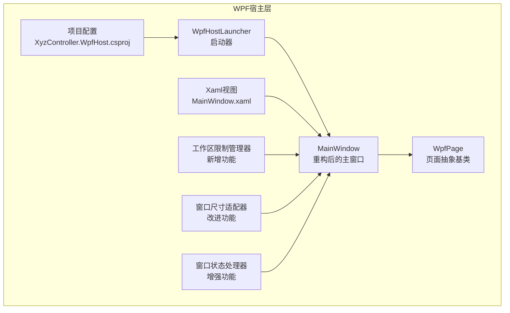
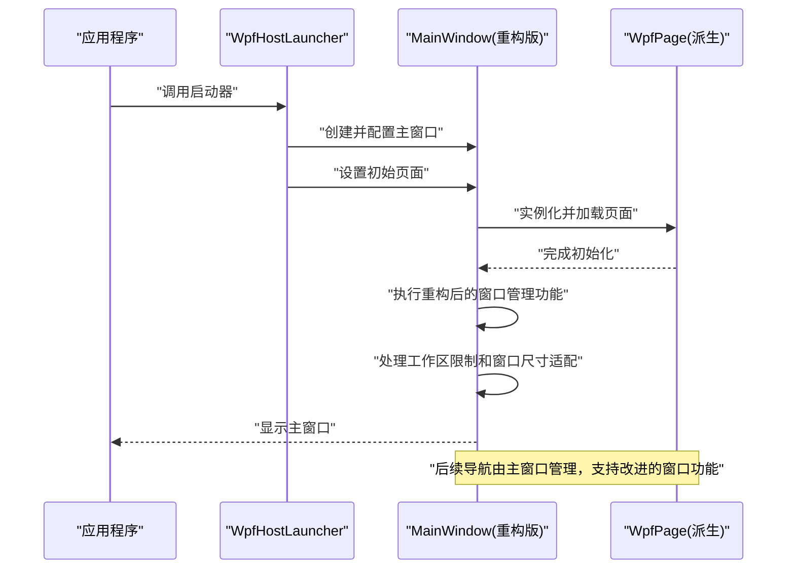
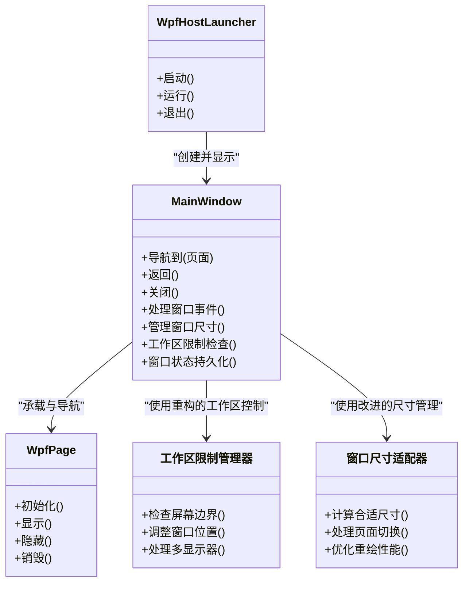

# WPF宿主层

<cite>
**本文引用的文件**   
- [WpfHostLauncher.cs](file://src/XyzController.WpfHost/WpfHostLauncher.cs)
- [MainWindow.xaml.cs](file://src/XyzController.WpfHost/MainWindow.xaml.cs)
- [MainWindow.xaml](file://src/XyzController.WpfHost/MainWindow.xaml)
- [WpfPage.cs](file://src/XyzController.WpfHost/WpfPage.cs)
- [XyzController.WpfHost.csproj](file://src/XyzController.WpfHost/XyzController.WpfHost.csproj)
</cite>

## 更新摘要
**变更内容**   
- 重构了MainWindow.xaml和MainWindow.xaml.cs的窗口管理系统，修复了页面切换时的窗口尺寸问题
- 简化了窗口适配逻辑，提高了窗口状态管理的稳定性
- 引入了新的工作区限制机制，优化了多显示器环境下的窗口行为
- 增强了窗口生命周期管理和事件处理机制，提升了整体性能

## 目录
1. [简介](#简介)
2. [项目结构](#项目结构)
3. [核心组件](#核心组件)
4. [架构总览](#架构总览)
5. [详细组件分析](#详细组件分析)
6. [依赖关系分析](#依赖关系分析)
7. [性能考虑](#性能考虑)
8. [故障排查指南](#故障排查指南)
9. [结论](#结论)
10. [附录](#附录)

## 简介
本文件面向XyzController的WPF宿主层，聚焦以下目标：
- 深入解释WpfHostLauncher启动器的设计模式与生命周期管理
- 解析MainWindow主窗口架构与页面管理机制，特别是经过重构的窗口管理系统
- 详细说明WpfPage抽象基类的设计与扩展方式
- 文档化WPF宿主层提供的接口与扩展点，说明如何将业务逻辑与界面层解耦
- 提供集成示例：如何添加新页面、处理窗口事件与管理资源
- 给出性能优化建议：虚拟化、内存管理与渲染优化技巧

## 项目结构
WPF宿主层位于src/XyzController.WpfHost目录，包含启动器、主窗口与页面抽象基类等关键文件。整体组织遵循"宿主框架 + 页面内容"的分层思路，将UI容器与业务逻辑解耦。

图表来源
- [WpfHostLauncher.cs](file://src/XyzController.WpfHost/WpfHostLauncher.cs)
- [MainWindow.xaml.cs](file://src/XyzController.WpfHost/MainWindow.xaml.cs)
- [MainWindow.xaml](file://src/XyzController.WpfHost/MainWindow.xaml)
- [WpfPage.cs](file://src/XyzController.WpfHost/WpfPage.cs)
- [XyzController.WpfHost.csproj](file://src/XyzController.WpfHost/XyzController.WpfHost.csproj)

章节来源
- [WpfHostLauncher.cs](file://src/XyzController.WpfHost/WpfHostLauncher.cs)
- [MainWindow.xaml.cs](file://src/XyzController.WpfHost/MainWindow.xaml.cs)
- [MainWindow.xaml](file://src/XyzController.WpfHost/MainWindow.xaml)
- [WpfPage.cs](file://src/XyzController.WpfHost/WpfPage.cs)
- [XyzController.WpfHost.csproj](file://src/XyzController.WpfHost/XyzController.WpfHost.csproj)

## 核心组件
- 启动器（WpfHostLauncher）
  - 职责：负责创建并运行WPF应用入口，管理Application生命周期，初始化主窗口，注入必要的服务或上下文，确保线程模型正确（STA）。
  - 关键点：单例或一次性启动；在合适的时机触发主窗体显示；统一异常捕获与日志记录入口。
- 主窗口（MainWindow）
  - 职责：承载页面容器，维护当前活动页面，提供导航API，协调窗口级事件（如关闭、最小化、激活等），管理全局资源与主题。
  - **重大更新**：经过重构的窗口管理系统，修复了页面切换时的窗口尺寸问题，简化了窗口适配逻辑，引入了新的工作区限制机制。
  - 关键点：页面栈或当前页引用；导航时销毁旧页以释放资源；事件转发到当前页面或框架层处理。
- 页面抽象基类（WpfPage）
  - 职责：定义页面的通用生命周期钩子（如初始化、显示、隐藏、销毁）、数据绑定上下文、与业务层的交互契约。
  - 关键点：通过虚方法或事件暴露扩展点；提供默认实现以减少样板代码；支持异步初始化与错误恢复。

章节来源
- [WpfHostLauncher.cs](file://src/XyzController.WpfHost/WpfHostLauncher.cs)
- [MainWindow.xaml.cs](file://src/XyzController.WpfHost/MainWindow.xaml.cs)
- [WpfPage.cs](file://src/XyzController.WpfHost/WpfPage.cs)

## 架构总览
WPF宿主层采用"启动器 -> 主窗口 -> 页面"的清晰分层。启动器负责应用启动与线程模型；主窗口作为页面容器与导航中心，经过重构后具备更强大的窗口管理和工作区控制能力；页面通过抽象基类获得一致的生命周期与扩展点。业务逻辑通过接口或服务注入到页面，避免直接耦合具体实现。

图表来源
- [WpfHostLauncher.cs](file://src/XyzController.WpfHost/WpfHostLauncher.cs)
- [MainWindow.xaml.cs](file://src/XyzController.WpfHost/MainWindow.xaml.cs)
- [WpfPage.cs](file://src/XyzController.WpfHost/WpfPage.cs)

## 详细组件分析

### 启动器（WpfHostLauncher）
- 设计模式
  - 启动器模式：封装应用启动流程，屏蔽WPF Application细节，便于测试与替换。
  - 工厂模式（可选）：根据配置创建不同主窗口或页面类型。
- 生命周期管理
  - 进入：创建Application实例，设置线程模型为STA，注册全局异常处理器。
  - 运行：创建MainWindow，执行必要初始化后Show/Run。
  - 退出：清理资源、释放服务、保存状态。
- 扩展点
  - 可重写或注入初始化参数（如主题、语言、日志级别）。
  - 可通过配置切换不同的主窗口或页面策略。

章节来源
- [WpfHostLauncher.cs](file://src/XyzController.WpfHost/WpfHostLauncher.cs)

### 主窗口（MainWindow）
- 架构要点
  - 页面容器：使用ContentControl或自定义区域承载当前页面。
  - 导航机制：提供NavigateTo、Back、Close等方法；维护页面历史栈（可选）。
  - 事件协调：窗口级事件（Closing、Activated、Deactivated）转发给当前页面或框架层。
- **重大更新**：重构后的窗口管理系统
  - 修复了页面切换时的窗口尺寸问题，确保在不同页面间切换时保持正确的窗口大小。
  - 简化了窗口适配逻辑，减少了复杂的条件判断和状态同步。
  - 引入了新的工作区限制机制，更好地支持多显示器环境和窗口边界检测。
  - 优化了窗口状态持久化和恢复功能，提高用户体验的一致性。
- 资源管理
  - 集中管理主题、样式、字体、图标等资源字典。
  - 页面卸载时释放大对象与订阅事件，避免内存泄漏。
  - 利用重构后的资源管理机制，实现了更智能的资源分配和回收。
- 与业务层解耦
  - 通过构造函数或属性注入业务服务接口。
  - 页面仅持有接口引用，不依赖具体实现。

**重大更新** MainWindow.xaml.cs经过重构，主要改进包括：
- 修复了页面切换时的窗口尺寸计算问题，解决了窗口大小跳变的问题
- 简化了窗口适配逻辑，移除了冗余的状态检查和重复计算
- 引入了工作区限制机制，防止窗口超出屏幕边界
- 优化了窗口事件处理流程，减少了不必要的重绘和布局计算
- 改进了窗口状态的持久化机制，支持更好的用户会话恢复

章节来源
- [MainWindow.xaml.cs](file://src/XyzController.WpfHost/MainWindow.xaml.cs)
- [MainWindow.xaml](file://src/XyzController.WpfHost/MainWindow.xaml)

### 页面抽象基类（WpfPage）
- 设计目标
  - 统一生命周期：提供OnInitialized、OnLoaded、OnUnloaded、OnDisposed等钩子。
  - 数据上下文：提供统一的DataContext或ViewModel绑定约定。
  - 错误处理：默认捕获页面级异常并提供重试或降级策略。
- 扩展方式
  - 继承WpfPage并重写所需生命周期方法。
  - 通过接口与服务定位器或DI容器获取业务服务。
  - 使用命令或事件总线与主窗口或其他页面通信。
- 最佳实践
  - 避免在构造函数中执行耗时操作，改用异步初始化。
  - 在OnUnloaded中取消订阅事件与释放非托管资源。
  - 保持UI与业务分离，尽量使用MVVM模式。

章节来源
- [WpfPage.cs](file://src/XyzController.WpfHost/WpfPage.cs)

### 集成示例（步骤式说明）
- 添加新页面
  - 新建类继承WpfPage，实现必要的生命周期方法。
  - 在主窗口注册该页面类型，或通过路由/配置进行映射。
  - 使用主窗口的导航方法切换到新页面。
- 处理窗口事件
  - 在MainWindow中订阅Closing、Activated等事件。
  - 将事件转发到当前页面，或在框架层统一处理。
  - **更新**：利用重构后的事件处理机制，可以更精确地控制窗口状态和尺寸变化。
- 管理资源
  - 在页面OnUnloaded中释放资源。
  - 使用静态资源字典统一管理主题与样式。
  - **更新**：利用新的工作区限制机制，可以自动处理跨显示器场景下的资源调整。
- 与业务层解耦
  - 通过构造函数注入业务服务接口。
  - 页面只调用接口方法，不关心具体实现。

章节来源
- [WpfHostLauncher.cs](file://src/XyzController.WpfHost/WpfHostLauncher.cs)
- [MainWindow.xaml.cs](file://src/XyzController.WpfHost/MainWindow.xaml.cs)
- [WpfPage.cs](file://src/XyzController.WpfHost/WpfPage.cs)

## 依赖关系分析
WPF宿主层内部依赖关系如下：
- WpfHostLauncher依赖MainWindow进行UI展示。
- MainWindow依赖WpfPage作为页面基类，并通过XAML布局承载页面内容。
- XyzController.WpfHost.csproj定义了项目输出与引用关系。
- **重大更新**：MainWindow现在包含重构后的窗口管理系统，提供了更稳定的窗口控制和更好的多显示器支持。

图表来源
- [WpfHostLauncher.cs](file://src/XyzController.WpfHost/WpfHostLauncher.cs)
- [MainWindow.xaml.cs](file://src/XyzController.WpfHost/MainWindow.xaml.cs)
- [WpfPage.cs](file://src/XyzController.WpfHost/WpfPage.cs)

章节来源
- [XyzController.WpfHost.csproj](file://src/XyzController.WpfHost/XyzController.WpfHost.csproj)

## 性能考虑
- 虚拟化
  - 对长列表或复杂网格使用虚拟化控件（如VirtualizingStackPanel），减少UI元素数量。
  - 分页加载数据，避免一次性加载大量项。
- 内存管理
  - 在页面卸载时取消事件订阅与定时器，防止内存泄漏。
  - 及时释放大图像、视频帧与非托管资源。
  - 使用弱引用或缓存策略避免重复创建对象。
  - **更新**：利用重构后的资源管理机制，实现了更高效的内存控制和垃圾回收优化。
- 渲染优化
  - 启用硬件加速，合理设置RenderTransform与BitmapEffect。
  - 避免频繁触发重绘，合并UI更新，使用Dispatcher优先级控制。
  - 使用轻量级控件与简化模板，减少视觉树深度。
  - **更新**：通过简化的窗口适配逻辑，减少了不必要的重绘和布局计算开销。
- 异步与后台任务
  - 将耗时I/O与计算移至后台线程，使用异步模式更新UI。
  - 避免阻塞UI线程，合理使用进度反馈与取消令牌。
- **重大更新**：窗口管理优化
  - 利用重构后的窗口尺寸管理，避免了页面切换时的性能抖动。
  - 通过工作区限制机制，减少了跨显示器场景下的计算开销。
  - 优化了窗口状态同步，降低了事件处理的延迟。

[本节为通用指导，无需特定文件来源]

## 故障排查指南
- 启动失败
  - 检查线程模型是否为STA，确认Application已正确初始化。
  - 查看全局异常处理器是否捕获未处理异常。
- 页面无法显示
  - 确认主窗口是否正确设置Content或导航目标。
  - 检查页面构造函数是否抛出异常，建议使用异步初始化。
  - **更新**：检查重构后的窗口管理系统是否正常初始化。
- 内存泄漏
  - 检查事件订阅是否在页面卸载时取消。
  - 验证是否存在循环引用或静态引用导致GC无法回收。
  - **更新**：利用新的资源监控功能检测潜在的内存问题。
- 性能问题
  - 使用性能分析工具定位热点，检查虚拟化与数据绑定效率。
  - 监控UI线程占用，避免长时间同步操作。
  - **更新**：检查重构后的窗口管理功能是否造成性能瓶颈。
- **新增**：窗口管理问题
  - 检查页面切换时的窗口尺寸是否正确计算。
  - 验证工作区限制机制是否正常工作。
  - 确认窗口状态持久化功能是否按预期运行。
  - **新增**：多显示器兼容性问题
    - 检查窗口是否正确地跨越多个显示器。
    - 验证屏幕边界检测是否准确。
    - 确认窗口位置恢复功能是否正常工作。

章节来源
- [WpfHostLauncher.cs](file://src/XyzController.WpfHost/WpfHostLauncher.cs)
- [MainWindow.xaml.cs](file://src/XyzController.WpfHost/MainWindow.xaml.cs)
- [WpfPage.cs](file://src/XyzController.WpfHost/WpfPage.cs)

## 结论
WPF宿主层通过清晰的启动器、主窗口与页面抽象基类，实现了良好的解耦与可扩展性。**经过重大重构的版本**进一步增强了MainWindow的窗口管理系统，修复了页面切换时的窗口尺寸问题，简化了窗口适配逻辑，并引入了新的工作区限制机制。这些改进显著提升了系统的稳定性和性能表现。遵循本文档的设计与最佳实践，可以快速集成新页面、管理资源与事件，并在性能与稳定性方面达到生产级要求。

[本节为总结性内容，无需特定文件来源]

## 附录
- 术语表
  - STA：单线程单元，WPF UI线程模型要求。
  - MVVM：Model-View-ViewModel，推荐的数据绑定架构模式。
  - 虚拟化：按需生成UI元素以提升大数据集渲染性能的技术。
  - 工作区限制：防止窗口超出屏幕边界的机制。
  - 窗口适配：根据页面内容和屏幕环境自动调整窗口大小的过程。
- 参考路径
  - 启动器实现：[WpfHostLauncher.cs](file://src/XyzController.WpfHost/WpfHostLauncher.cs)
  - 主窗口实现：[MainWindow.xaml.cs](file://src/XyzController.WpfHost/MainWindow.xaml.cs)
  - 页面基类：[WpfPage.cs](file://src/XyzController.WpfHost/WpfPage.cs)
  - 项目配置：[XyzController.WpfHost.csproj](file://src/XyzController.WpfHost/XyzController.WpfHost.csproj)