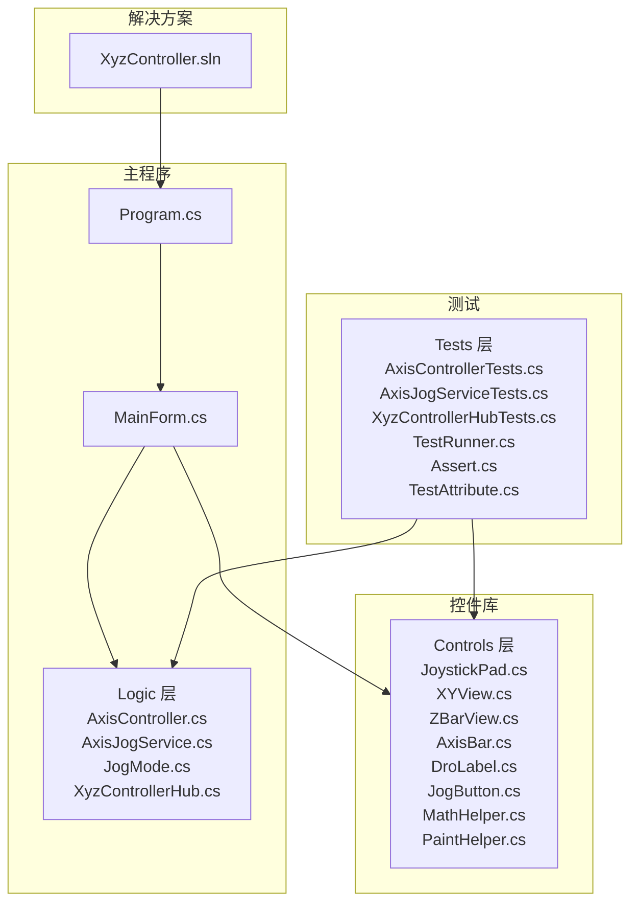
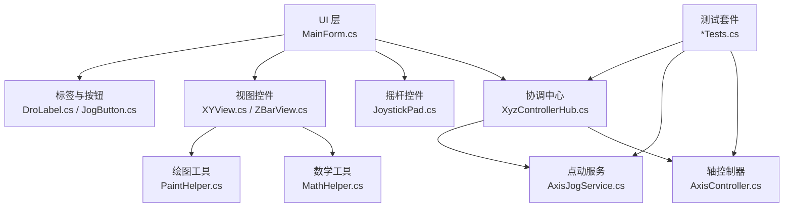
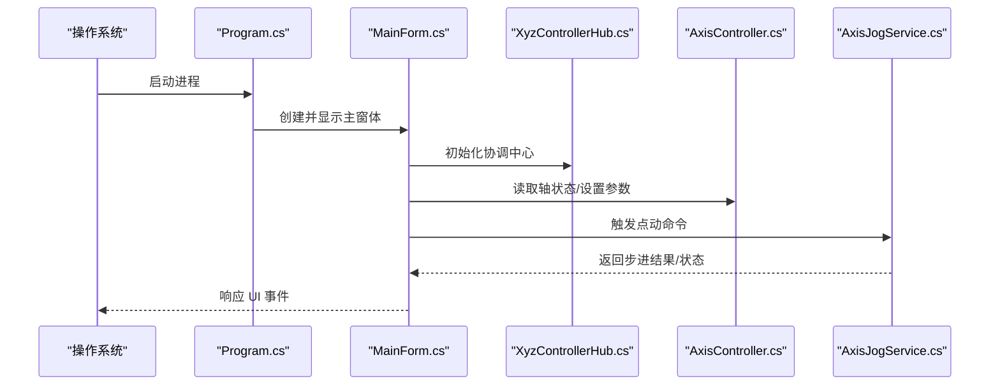
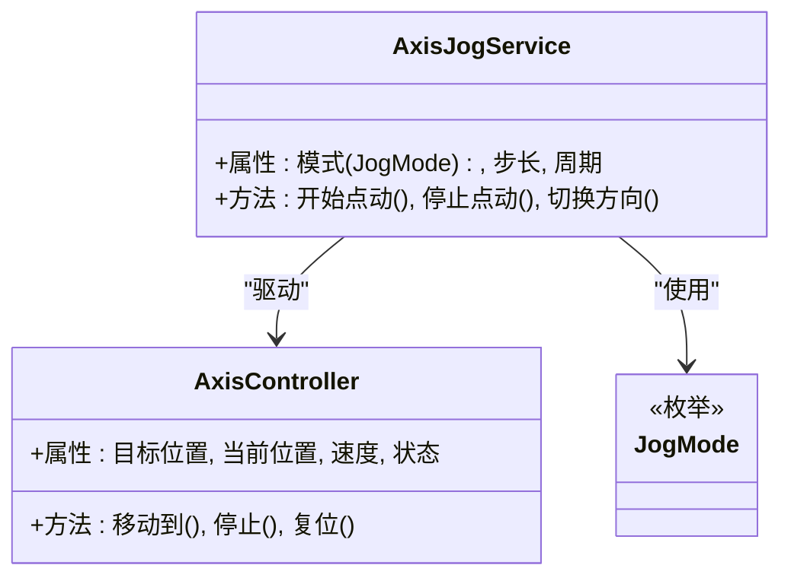
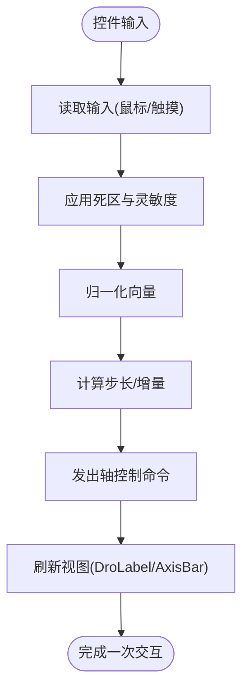
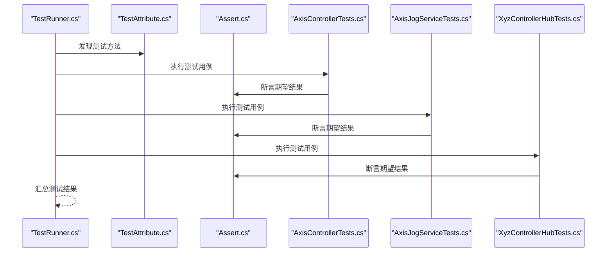
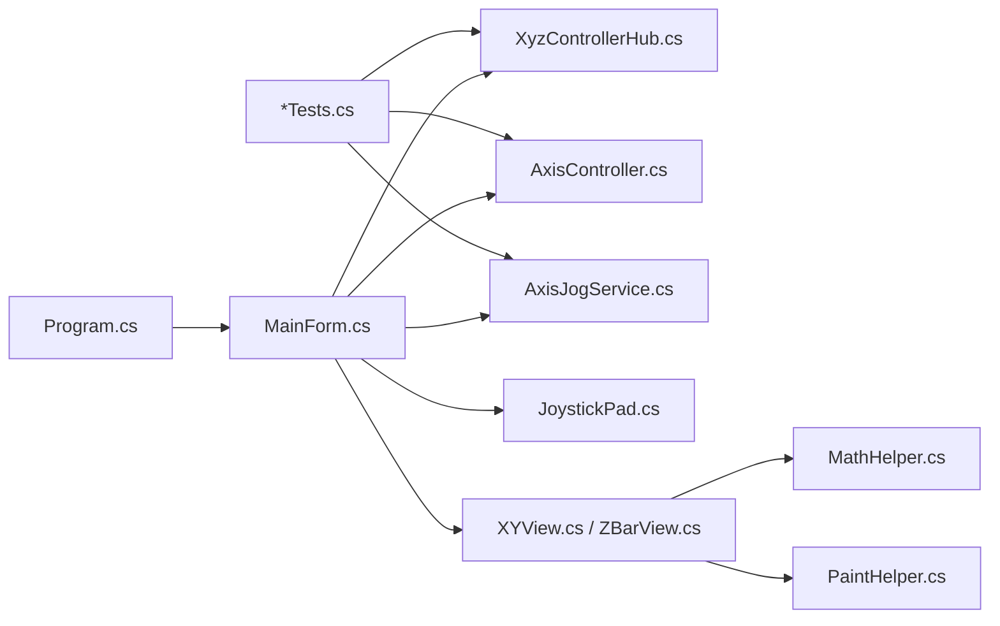

# 开发指南

<cite>
**本文引用的文件**   
- [README.md](file://XyzController/README.md)
- [Program.cs](file://XyzController/src/XyzController/Program.cs)
- [MainForm.cs](file://XyzController/src/XyzController/MainForm.cs)
- [AxisController.cs](file://XyzController/src/XyzController/Logic/AxisController.cs)
- [AxisJogService.cs](file://XyzController/src/XyzController/Logic/AxisJogService.cs)
- [JogMode.cs](file://XyzController/src/XyzController/Logic/JogMode.cs)
- [XyzControllerHub.cs](file://XyzController/src/XyzController/Logic/XyzControllerHub.cs)
- [JoystickPad.cs](file://XyzController/src/XyzController.Controls/JoystickPad.cs)
- [XYView.cs](file://XyzController/src/XyzController.Controls/XYView.cs)
- [ZBarView.cs](file://XyzController/src/XyzController.Controls/ZBarView.cs)
- [AxisBar.cs](file://XyzController/src/XyzController.Controls/AxisBar.cs)
- [DroLabel.cs](file://XyzController/src/XyzController.Controls/DroLabel.cs)
- [JogButton.cs](file://XyzController/src/XyzController.Controls/JogButton.cs)
- [MathHelper.cs](file://XyzController/src/XyzController.Controls/MathHelper.cs)
- [PaintHelper.cs](file://XyzController/src/XyzController.Controls/PaintHelper.cs)
- [AxisControllerTests.cs](file://XyzController/src/XyzController.Tests/Tests/AxisControllerTests.cs)
- [AxisJogServiceTests.cs](file://XyzController/src/XyzController.Tests/Tests/AxisJogServiceTests.cs)
- [XyzControllerHubTests.cs](file://XyzController/src/XyzController.Tests/Tests/XyzControllerHubTests.cs)
- [TestRunner.cs](file://XyzController/src/XyzController.Tests/Testing/TestRunner.cs)
- [Assert.cs](file://XyzController/src/XyzController.Tests/Testing/Assert.cs)
- [TestAttribute.cs](file://XyzController/src/XyzController.Tests/Testing/TestAttribute.cs)
- [XyzController.sln](file://XyzController/XyzController.sln)
</cite>

## 目录
1. [简介](#简介)
2. [项目结构](#项目结构)
3. [核心组件](#核心组件)
4. [架构总览](#架构总览)
5. [详细组件分析](#详细组件分析)
6. [依赖关系分析](#依赖关系分析)
7. [性能考虑](#性能考虑)
8. [故障排查指南](#故障排查指南)
9. [结论](#结论)
10. [附录](#附录)

## 简介
本开发指南面向希望参与 XyzController 项目的开发者，涵盖环境搭建、代码规范、调试技巧、扩展开发、版本管理与贡献流程等。项目采用 C# 与 WinForms 构建桌面应用，包含轴控制逻辑、自定义控件以及轻量级测试框架，适合初学者快速上手，也为有经验的开发者提供扩展点与最佳实践建议。

## 项目结构
仓库根目录为 XyzController，解决方案文件位于根目录，源码按功能分层组织：
- src/XyzController：主程序与业务逻辑（WinForms 窗体、轴控制、步进服务、通信中心）
- src/XyzController.Controls：自定义 UI 控件（摇杆、视图、标签、按钮、绘图辅助）
- src/XyzController.Tests：单元测试与自研测试运行器

图表来源
- [XyzController.sln](file://XyzController/XyzController.sln)
- [Program.cs](file://XyzController/src/XyzController/Program.cs)
- [MainForm.cs](file://XyzController/src/XyzController/MainForm.cs)
- [AxisController.cs](file://XyzController/src/XyzController/Logic/AxisController.cs)
- [AxisJogService.cs](file://XyzController/src/XyzController/Logic/AxisJogService.cs)
- [JogMode.cs](file://XyzController/src/XyzController/Logic/JogMode.cs)
- [XyzControllerHub.cs](file://XyzController/src/XyzController/Logic/XyzControllerHub.cs)
- [JoystickPad.cs](file://XyzController/src/XyzController.Controls/JoystickPad.cs)
- [XYView.cs](file://XyzController/src/XyzController.Controls/XYView.cs)
- [ZBarView.cs](file://XyzController/src/XyzController.Controls/ZBarView.cs)
- [AxisBar.cs](file://XyzController/src/XyzController.Controls/AxisBar.cs)
- [DroLabel.cs](file://XyzController/src/XyzController.Controls/DroLabel.cs)
- [JogButton.cs](file://XyzController/src/XyzController.Controls/JogButton.cs)
- [MathHelper.cs](file://XyzController/src/XyzController.Controls/MathHelper.cs)
- [PaintHelper.cs](file://XyzController/src/XyzController.Controls/PaintHelper.cs)
- [AxisControllerTests.cs](file://XyzController/src/XyzController.Tests/Tests/AxisControllerTests.cs)
- [AxisJogServiceTests.cs](file://XyzController/src/XyzController.Tests/Tests/AxisJogServiceTests.cs)
- [XyzControllerHubTests.cs](file://XyzController/src/XyzController.Tests/Tests/XyzControllerHubTests.cs)
- [TestRunner.cs](file://XyzController/src/XyzController.Tests/Testing/TestRunner.cs)
- [Assert.cs](file://XyzController/src/XyzController.Tests/Testing/Assert.cs)
- [TestAttribute.cs](file://XyzController/src/XyzController.Tests/Testing/TestAttribute.cs)

章节来源
- [README.md](file://XyzController/README.md)
- [XyzController.sln](file://XyzController/XyzController.sln)

## 核心组件
- 程序入口与启动流程
  - Program.cs 负责应用程序初始化与主窗体生命周期管理。
  - MainForm.cs 承载用户界面与交互事件，协调 Logic 层与 Controls 层。
- 轴控制与步进服务
  - AxisController.cs 封装单轴控制能力（如目标位置、速度、状态）。
  - AxisJogService.cs 提供点动（Jog）模式下的步进调度与状态机。
  - JogMode.cs 定义点动模式枚举或配置项。
  - XyzControllerHub.cs 作为多轴协同与消息分发中心。
- 自定义控件
  - JoystickPad.cs：摇杆输入控件，映射到轴增量指令。
  - XYView.cs / ZBarView.cs：二维/一维可视化视图。
  - AxisBar.cs / DroLabel.cs / JogButton.cs：轴进度条、位置显示与点动按钮。
  - MathHelper.cs / PaintHelper.cs：数学与绘图工具方法。
- 测试框架
  - TestRunner.cs / Assert.cs / TestAttribute.cs：轻量测试运行器与断言。
  - Tests/*：针对核心逻辑的单元测试用例。

章节来源
- [Program.cs](file://XyzController/src/XyzController/Program.cs)
- [MainForm.cs](file://XyzController/src/XyzController/MainForm.cs)
- [AxisController.cs](file://XyzController/src/XyzController/Logic/AxisController.cs)
- [AxisJogService.cs](file://XyzController/src/XyzController/Logic/AxisJogService.cs)
- [JogMode.cs](file://XyzController/src/XyzController/Logic/JogMode.cs)
- [XyzControllerHub.cs](file://XyzController/src/XyzController/Logic/XyzControllerHub.cs)
- [JoystickPad.cs](file://XyzController/src/XyzController.Controls/JoystickPad.cs)
- [XYView.cs](file://XyzController/src/XyzController.Controls/XYView.cs)
- [ZBarView.cs](file://XyzController/src/XyzController.Controls/ZBarView.cs)
- [AxisBar.cs](file://XyzController/src/XyzController.Controls/AxisBar.cs)
- [DroLabel.cs](file://XyzController/src/XyzController.Controls/DroLabel.cs)
- [JogButton.cs](file://XyzController/src/XyzController.Controls/JogButton.cs)
- [MathHelper.cs](file://XyzController/src/XyzController.Controls/MathHelper.cs)
- [PaintHelper.cs](file://XyzController/src/XyzController.Controls/PaintHelper.cs)
- [TestRunner.cs](file://XyzController/src/XyzController.Tests/Testing/TestRunner.cs)
- [Assert.cs](file://XyzController/src/XyzController.Tests/Testing/Assert.cs)
- [TestAttribute.cs](file://XyzController/src/XyzController.Tests/Testing/TestAttribute.cs)

## 架构总览
系统采用“UI 层 + 业务逻辑层 + 控件库”的分层设计，通过 Hub 进行跨组件协调，测试覆盖核心逻辑。

图表来源
- [MainForm.cs](file://XyzController/src/XyzController/MainForm.cs)
- [XyzControllerHub.cs](file://XyzController/src/XyzController/Logic/XyzControllerHub.cs)
- [AxisController.cs](file://XyzController/src/XyzController/Logic/AxisController.cs)
- [AxisJogService.cs](file://XyzController/src/XyzController/Logic/AxisJogService.cs)
- [JoystickPad.cs](file://XyzController/src/XyzController.Controls/JoystickPad.cs)
- [XYView.cs](file://XyzController/src/XyzController.Controls/XYView.cs)
- [ZBarView.cs](file://XyzController/src/XyzController.Controls/ZBarView.cs)
- [DroLabel.cs](file://XyzController/src/XyzController.Controls/DroLabel.cs)
- [JogButton.cs](file://XyzController/src/XyzController.Controls/JogButton.cs)
- [MathHelper.cs](file://XyzController/src/XyzController.Controls/MathHelper.cs)
- [PaintHelper.cs](file://XyzController/src/XyzController.Controls/PaintHelper.cs)
- [AxisControllerTests.cs](file://XyzController/src/XyzController.Tests/Tests/AxisControllerTests.cs)
- [AxisJogServiceTests.cs](file://XyzController/src/XyzController.Tests/Tests/AxisJogServiceTests.cs)
- [XyzControllerHubTests.cs](file://XyzController/src/XyzController.Tests/Tests/XyzControllerHubTests.cs)

## 详细组件分析

### 程序入口与主窗体
- Program.cs：负责创建并运行主窗体，处理异常捕获与应用退出。
- MainForm.cs：承载 UI 布局与事件绑定，调用 Logic 层执行轴控制与点动操作，更新控件状态。

图表来源
- [Program.cs](file://XyzController/src/XyzController/Program.cs)
- [MainForm.cs](file://XyzController/src/XyzController/MainForm.cs)
- [XyzControllerHub.cs](file://XyzController/src/XyzController/Logic/XyzControllerHub.cs)
- [AxisController.cs](file://XyzController/src/XyzController/Logic/AxisController.cs)
- [AxisJogService.cs](file://XyzController/src/XyzController/Logic/AxisJogService.cs)

章节来源
- [Program.cs](file://XyzController/src/XyzController/Program.cs)
- [MainForm.cs](file://XyzController/src/XyzController/MainForm.cs)

### 轴控制与点动服务
- AxisController.cs：维护轴的目标位置、当前状态、速度限制等；提供移动、停止、复位等方法。
- AxisJogService.cs：实现点动模式的状态机，根据 JogMode 配置生成步进序列，并与 AxisController 协作。
- JogMode.cs：定义点动模式（如连续、脉冲、方向选择等）。

图表来源
- [AxisController.cs](file://XyzController/src/XyzController/Logic/AxisController.cs)
- [AxisJogService.cs](file://XyzController/src/XyzController/Logic/AxisJogService.cs)
- [JogMode.cs](file://XyzController/src/XyzController/Logic/JogMode.cs)

章节来源
- [AxisController.cs](file://XyzController/src/XyzController/Logic/AxisController.cs)
- [AxisJogService.cs](file://XyzController/src/XyzController/Logic/AxisJogService.cs)
- [JogMode.cs](file://XyzController/src/XyzController/Logic/JogMode.cs)

### 自定义控件与绘图
- JoystickPad.cs：接收鼠标/触摸输入，转换为轴增量指令，支持死区与灵敏度调节。
- XYView.cs / ZBarView.cs：绘制轴位置与范围，支持缩放与滚动。
- AxisBar.cs / DroLabel.cs / JogButton.cs：展示轴进度、实时位置与点动控制。
- MathHelper.cs / PaintHelper.cs：提供坐标变换、插值、颜色与画笔封装。

图表来源
- [JoystickPad.cs](file://XyzController/src/XyzController.Controls/JoystickPad.cs)
- [XYView.cs](file://XyzController/src/XyzController.Controls/XYView.cs)
- [ZBarView.cs](file://XyzController/src/XyzController.Controls/ZBarView.cs)
- [AxisBar.cs](file://XyzController/src/XyzController.Controls/AxisBar.cs)
- [DroLabel.cs](file://XyzController/src/XyzController.Controls/DroLabel.cs)
- [JogButton.cs](file://XyzController/src/XyzController.Controls/JogButton.cs)
- [MathHelper.cs](file://XyzController/src/XyzController.Controls/MathHelper.cs)
- [PaintHelper.cs](file://XyzController/src/XyzController.Controls/PaintHelper.cs)

章节来源
- [JoystickPad.cs](file://XyzController/src/XyzController.Controls/JoystickPad.cs)
- [XYView.cs](file://XyzController/src/XyzController.Controls/XYView.cs)
- [ZBarView.cs](file://XyzController/src/XyzController.Controls/ZBarView.cs)
- [AxisBar.cs](file://XyzController/src/XyzController.Controls/AxisBar.cs)
- [DroLabel.cs](file://XyzController/src/XyzController.Controls/DroLabel.cs)
- [JogButton.cs](file://XyzController/src/XyzController.Controls/JogButton.cs)
- [MathHelper.cs](file://XyzController/src/XyzController.Controls/MathHelper.cs)
- [PaintHelper.cs](file://XyzController/src/XyzController.Controls/PaintHelper.cs)

### 测试框架与用例
- TestRunner.cs：扫描标记测试方法并执行，收集结果。
- Assert.cs：提供基本断言方法。
- TestAttribute.cs：用于标注测试方法。
- Tests/*：对 AxisController、AxisJogService、XyzControllerHub 的行为进行验证。

图表来源
- [TestRunner.cs](file://XyzController/src/XyzController.Tests/Testing/TestRunner.cs)
- [TestAttribute.cs](file://XyzController/src/XyzController.Tests/Testing/TestAttribute.cs)
- [Assert.cs](file://XyzController/src/XyzController.Tests/Testing/Assert.cs)
- [AxisControllerTests.cs](file://XyzController/src/XyzController.Tests/Tests/AxisControllerTests.cs)
- [AxisJogServiceTests.cs](file://XyzController/src/XyzController.Tests/Tests/AxisJogServiceTests.cs)
- [XyzControllerHubTests.cs](file://XyzController/src/XyzController.Tests/Tests/XyzControllerHubTests.cs)

章节来源
- [TestRunner.cs](file://XyzController/src/XyzController.Tests/Testing/TestRunner.cs)
- [Assert.cs](file://XyzController/src/XyzController.Tests/Testing/Assert.cs)
- [TestAttribute.cs](file://XyzController/src/XyzController.Tests/Testing/TestAttribute.cs)
- [AxisControllerTests.cs](file://XyzController/src/XyzController.Tests/Tests/AxisControllerTests.cs)
- [AxisJogServiceTests.cs](file://XyzController/src/XyzController.Tests/Tests/AxisJogServiceTests.cs)
- [XyzControllerHubTests.cs](file://XyzController/src/XyzController.Tests/Tests/XyzControllerHubTests.cs)

## 依赖关系分析
- 主程序依赖 Logic 层与 Controls 层，通过 Hub 解耦 UI 与业务。
- 控件库内部依赖 MathHelper 与 PaintHelper，避免在控件中重复实现通用逻辑。
- 测试套件直接依赖 Logic 层与部分控件，确保关键路径可测。

图表来源
- [Program.cs](file://XyzController/src/XyzController/Program.cs)
- [MainForm.cs](file://XyzController/src/XyzController/MainForm.cs)
- [XyzControllerHub.cs](file://XyzController/src/XyzController/Logic/XyzControllerHub.cs)
- [AxisController.cs](file://XyzController/src/XyzController/Logic/AxisController.cs)
- [AxisJogService.cs](file://XyzController/src/XyzController/Logic/AxisJogService.cs)
- [JoystickPad.cs](file://XyzController/src/XyzController.Controls/JoystickPad.cs)
- [XYView.cs](file://XyzController/src/XyzController.Controls/XYView.cs)
- [ZBarView.cs](file://XyzController/src/XyzController.Controls/ZBarView.cs)
- [MathHelper.cs](file://XyzController/src/XyzController.Controls/MathHelper.cs)
- [PaintHelper.cs](file://XyzController/src/XyzController.Controls/PaintHelper.cs)
- [AxisControllerTests.cs](file://XyzController/src/XyzController.Tests/Tests/AxisControllerTests.cs)
- [AxisJogServiceTests.cs](file://XyzController/src/XyzController.Tests/Tests/AxisJogServiceTests.cs)
- [XyzControllerHubTests.cs](file://XyzController/src/XyzController.Tests/Tests/XyzControllerHubTests.cs)

章节来源
- [XyzController.sln](file://XyzController/XyzController.sln)

## 性能考虑
- 减少不必要的重绘：在 XYView/ZBarView 中使用双缓冲与区域更新，避免整屏刷新。
- 节流与合并事件：对高频输入（摇杆、鼠标移动）进行采样与合并，降低 CPU 占用。
- 异步与线程安全：在 Hub 与 Jog 服务中避免阻塞 UI 线程，使用合适的同步原语保护共享状态。
- 数值精度与溢出：在 MathHelper 中进行边界检查与精度控制，防止累积误差。
- 资源释放：及时释放 GDI+ 对象与事件订阅，避免内存泄漏。

[本节为通用指导，不直接分析具体文件]

## 故障排查指南
- 启动失败
  - 确认 .NET Framework 版本与 Visual Studio 工作负载已安装。
  - 检查解决方案与项目引用是否完整，清理并重建。
- UI 无响应
  - 检查是否在 UI 线程执行耗时操作，必要时使用异步或后台任务。
  - 查看是否有未处理的异常导致线程崩溃。
- 轴控制异常
  - 校验 JogMode 配置与步长参数，确保不会越界或产生非法指令。
  - 在 Hub 中添加日志输出，定位命令下发与状态回传问题。
- 测试失败
  - 使用 TestRunner 单独运行失败用例，结合 Assert 信息定位断言失败原因。
  - 检查测试数据与模拟条件是否符合预期。

章节来源
- [TestRunner.cs](file://XyzController/src/XyzController.Tests/Testing/TestRunner.cs)
- [Assert.cs](file://XyzController/src/XyzController.Tests/Testing/Assert.cs)
- [AxisControllerTests.cs](file://XyzController/src/XyzController.Tests/Tests/AxisControllerTests.cs)
- [AxisJogServiceTests.cs](file://XyzController/src/XyzController.Tests/Tests/AxisJogServiceTests.cs)
- [XyzControllerHubTests.cs](file://XyzController/src/XyzController.Tests/Tests/XyzControllerHubTests.cs)

## 结论
本项目以清晰的层次结构与可扩展的控件体系为基础，提供了轴控制与点动服务的核心能力。通过测试框架保障质量，通过 Hub 协调各模块，便于后续扩展与维护。遵循本文档的环境搭建、编码规范、调试与扩展指南，将有助于团队高效协作与持续交付。

[本节为总结性内容，不直接分析具体文件]

## 附录

### 环境搭建步骤
- 安装 .NET Framework
  - 根据项目需求安装对应版本的 .NET Framework（参考 README 说明）。
- 安装 Visual Studio
  - 安装包含“.NET 桌面开发”工作负载的 Visual Studio。
- 打开解决方案
  - 使用 Visual Studio 打开 XyzController.sln。
- 还原与构建
  - 恢复 NuGet 包（如有），然后生成解决方案。
- 运行与调试
  - 设置启动项目为主程序，F5 启动调试。

章节来源
- [README.md](file://XyzController/README.md)
- [XyzController.sln](file://XyzController/XyzController.sln)

### 代码规范与命名约定
- C# 编码标准
  - 类名与方法名使用 PascalCase；字段与私有成员使用 camelCase。
  - 常量使用 UPPER_SNAKE_CASE；布尔变量避免双重否定。
- 文件组织结构
  - 按功能划分目录：Logic、Controls、Tests；每个文件职责单一。
- 注释规范
  - 公共 API 添加 XML 文档注释；复杂算法补充行内注释说明意图与边界条件。
- 错误处理
  - 明确抛出与捕获异常；对外暴露友好的错误信息；避免吞掉异常。

[本节为通用指导，不直接分析具体文件]

### 调试技巧与工具
- 断点调试
  - 在关键方法入口与分支处设置断点，观察变量与调用栈。
- 日志记录
  - 在 Hub 与 Jog 服务中加入结构化日志，记录命令、状态与异常。
- 性能分析
  - 使用 Visual Studio 性能分析器识别热点函数与内存分配。
- 单元测试
  - 使用 TestRunner 执行测试，结合 Assert 快速定位回归问题。

章节来源
- [XyzControllerHub.cs](file://XyzController/src/XyzController/Logic/XyzControllerHub.cs)
- [AxisJogService.cs](file://XyzController/src/XyzController/Logic/AxisJogService.cs)
- [TestRunner.cs](file://XyzController/src/XyzController.Tests/Testing/TestRunner.cs)
- [Assert.cs](file://XyzController/src/XyzController.Tests/Testing/Assert.cs)

### 扩展开发指南
- 添加新的轴控制算法
  - 在 Logic 层新增算法类，实现统一接口（如 MoveTo、Stop、Reset）。
  - 在 Hub 中注册新算法，并提供配置项与切换机制。
- 自定义控件
  - 继承现有控件基类或 UserControl，复用 MathHelper 与 PaintHelper。
  - 在 XYView/ZBarView 中集成新控件，保持渲染与交互一致性。
- 业务逻辑扩展
  - 在 AxisJogService 中扩展 JogMode 与新策略，确保线程安全与状态一致。
  - 编写对应单元测试，覆盖新增行为与边界条件。

章节来源
- [AxisController.cs](file://XyzController/src/XyzController/Logic/AxisController.cs)
- [AxisJogService.cs](file://XyzController/src/XyzController/Logic/AxisJogService.cs)
- [JogMode.cs](file://XyzController/src/XyzController/Logic/JogMode.cs)
- [XyzControllerHub.cs](file://XyzController/src/XyzController/Logic/XyzControllerHub.cs)
- [XYView.cs](file://XyzController/src/XyzController.Controls/XYView.cs)
- [ZBarView.cs](file://XyzController/src/XyzController.Controls/ZBarView.cs)
- [MathHelper.cs](file://XyzController/src/XyzController.Controls/MathHelper.cs)
- [PaintHelper.cs](file://XyzController/src/XyzController.Controls/PaintHelper.cs)

### 版本管理、代码审查与贡献指南
- 版本管理
  - 使用 Git 进行版本控制，遵循语义化版本（主版本.次版本.修订号）。
  - 提交信息清晰描述变更目的与影响范围。
- 代码审查
  - 提交 Pull Request，至少一名 reviewer 审核通过后合并。
  - 关注可读性、健壮性与性能，确保测试覆盖率。
- 贡献流程
  - Fork 仓库，创建功能分支，提交变更并推送。
  - 发起 PR，附上变更说明与测试截图/日志。
  - 通过 CI 检查与人工审核后合并至主分支。

[本节为通用指导，不直接分析具体文件]