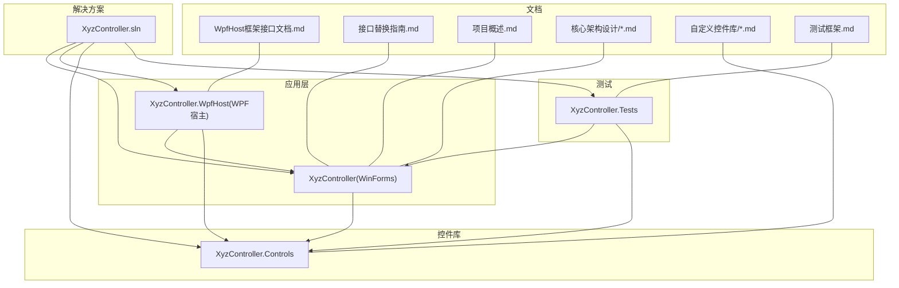
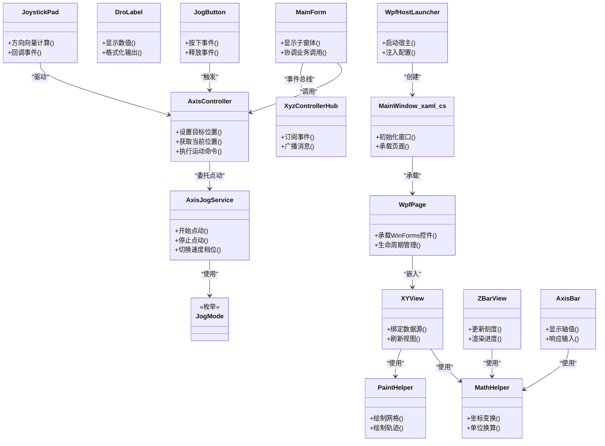
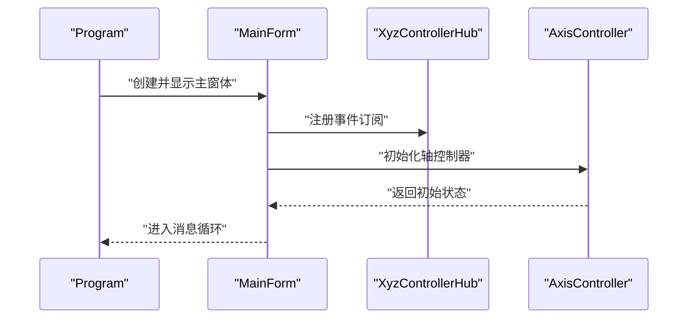
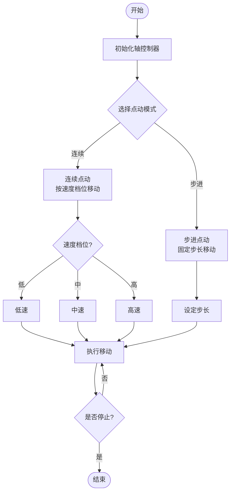
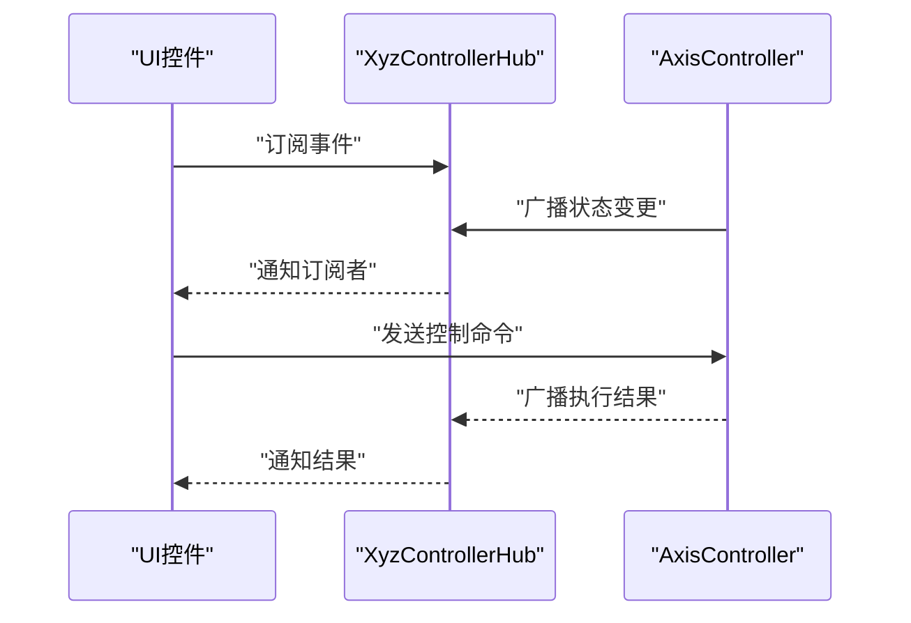
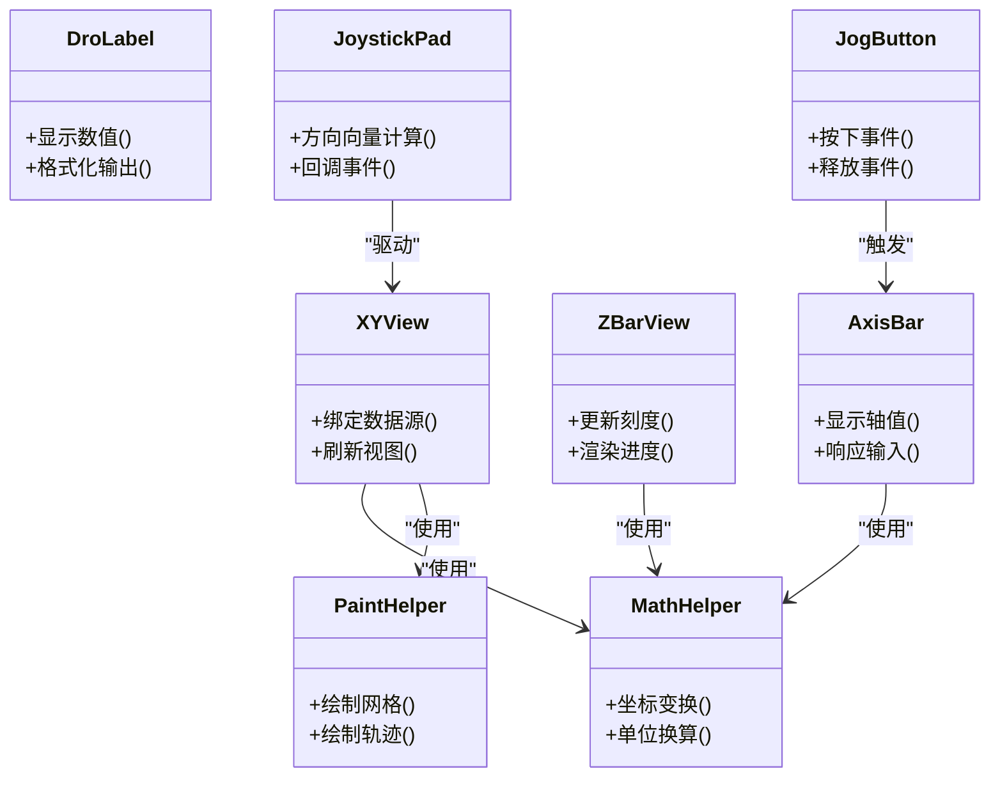
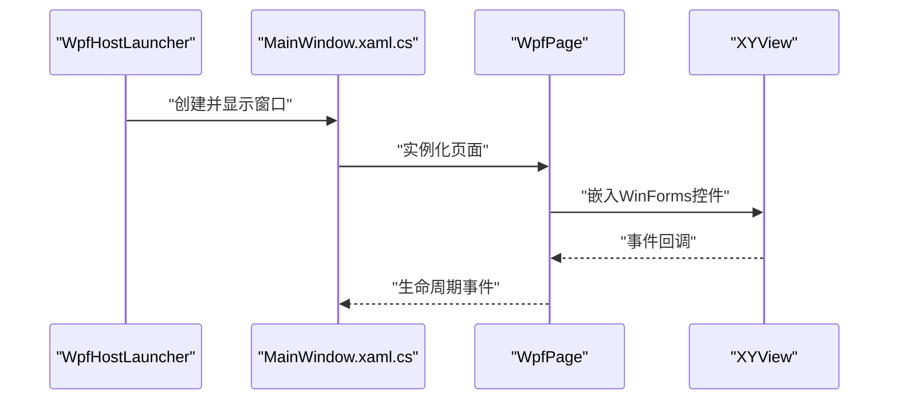
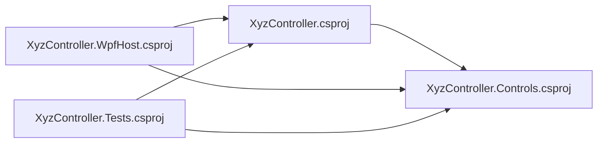

# 开发指南

<cite>
**本文引用的文件**   
- [README.md](file://README.md)
- [XyzController.sln](file://XyzController.sln)
- [src/XyzController/Program.cs](file://src/XyzController/Program.cs)
- [src/XyzController/MainForm.cs](file://src/XyzController/MainForm.cs)
- [src/XyzController/Form1.cs](file://src/XyzController/Form1.cs)
- [src/XyzController/Form2.cs](file://src/XyzController/Form2.cs)
- [src/XyzController/PointJumpForm.cs](file://src/XyzController/PointJumpForm.cs)
- [src/XyzController/TrajectoryViewForm.cs](file://src/XyzController/TrajectoryViewForm.cs)
- [src/XyzController/Logic/AxisController.cs](file://src/XyzController/Logic/AxisController.cs)
- [src/XyzController/Logic/AxisJogService.cs](file://src/XyzController/Logic/AxisJogService.cs)
- [src/XyzController/Logic/JogMode.cs](file://src/XyzController/Logic/JogMode.cs)
- [src/XyzController/Logic/XyzControllerHub.cs](file://src/XyzController/Logic/XyzControllerHub.cs)
- [src/XyzController/XyzController.csproj](file://src/XyzController/XyzController.csproj)
- [src/XyzController.Controls/MathHelper.cs](file://src/XyzController.Controls/MathHelper.cs)
- [src/XyzController.Controls/PaintHelper.cs](file://src/XyzController.Controls/PaintHelper.cs)
- [src/XyzController.Controls/XYView.cs](file://src/XyzController.Controls/XYView.cs)
- [src/XyzController.Controls/ZBarView.cs](file://src/XyzController.Controls/ZBarView.cs)
- [src/XyzController.Controls/AxisBar.cs](file://src/XyzController.Controls/AxisBar.cs)
- [src/XyzController.Controls/DroLabel.cs](file://src/XyzController.Controls/DroLabel.cs)
- [src/XyzController.Controls/JogButton.cs](file://src/XyzController.Controls/JogButton.cs)
- [src/XyzController.Controls/JoystickPad.cs](file://src/XyzController.Controls/JoystickPad.cs)
- [src/XyzController.Controls/XyzController.Controls.csproj](file://src/XyzController.Controls/XyzController.Controls.csproj)
- [src/XyzController.Tests/Program.cs](file://src/XyzController.Tests/Program.cs)
- [src/XyzController.Tests/Testing/TestRunner.cs](file://src/XyzController.Tests/Testing/TestRunner.cs)
- [src/XyzController.Tests/Testing/TestAttribute.cs](file://src/XyzController.Tests/Testing/TestAttribute.cs)
- [src/XyzController.Tests/Testing/Assert.cs](file://src/XyzController.Tests/Testing/Assert.cs)
- [src/XyzController.Tests/Tests/AxisControllerTests.cs](file://src/XyzController.Tests/Tests/AxisControllerTests.cs)
- [src/XyzController.Tests/Tests/AxisJogServiceTests.cs](file://src/XyzController.Tests/Tests/AxisJogServiceTests.cs)
- [src/XyzController.Tests/Tests/XyzControllerHubTests.cs](file://src/XyzController.Tests/Tests/XyzControllerHubTests.cs)
- [src/XyzController.Tests/XyzController.Tests.csproj](file://src/XyzController.Tests/XyzController.Tests.csproj)
- [src/XyzController.WpfHost/WpfHostLauncher.cs](file://src/XyzController.WpfHost/WpfHostLauncher.cs)
- [src/XyzController.WpfHost/MainWindow.xaml.cs](file://src/XyzController.WpfHost/MainWindow.xaml.cs)
- [src/XyzController.WpfHost/WpfPage.cs](file://src/XyzController.WpfHost/WpfPage.cs)
- [src/XyzController.WpfHost/XyzController.WpfHost.csproj](file://src/XyzController.WpfHost/XyzController.WpfHost.csproj)
- [docs/WpfHost框架接口文档.md](file://docs/WpfHost框架接口文档.md)
- [docs/接口替换指南.md](file://docs/接口替换指南.md)
- [src/content/项目概述.md](file://src/content/项目概述.md)
- [src/content/核心架构设计/主窗体协调器.md](file://src/content/核心架构设计/主窗体协调器.md)
- [src/content/核心架构设计/轴控制系统.md](file://src/content/核心架构设计/轴控制系统.md)
- [src/content/自定义控件库/基础控件.md](file://src/content/自定义控件库/基础控件.md)
- [src/content/自定义控件库/高级控件.md](file://src/content/自定义控件库/高级控件.md)
- [src/content/测试框架.md](file://src/content/测试框架.md)
</cite>

## 目录
1. [简介](#简介)
2. [项目结构](#项目结构)
3. [核心组件](#核心组件)
4. [架构总览](#架构总览)
5. [详细组件分析](#详细组件分析)
6. [依赖关系分析](#依赖关系分析)
7. [性能与稳定性](#性能与稳定性)
8. [故障排除指南](#故障排除指南)
9. [构建、版本与发布](#构建版本与发布)
10. [贡献指南](#贡献指南)
11. [结论](#结论)
12. [附录](#附录)

## 简介
本指南面向新加入的开发者，提供从环境搭建到代码规范、调试排障、构建发布以及贡献流程的全链路说明。目标是帮助团队在统一的工程实践下高效协作，确保代码质量与交付稳定性。

## 项目结构
仓库采用多项目解决方案组织，包含：
- 桌面应用入口与业务逻辑（WinForms）
- 可复用的自定义控件库
- 单元测试项目
- WPF宿主示例与集成
- 文档与内容说明

图表来源
- [XyzController.sln](file://XyzController.sln)
- [src/XyzController/XyzController.csproj](file://src/XyzController/XyzController.csproj)
- [src/XyzController.Controls/XyzController.Controls.csproj](file://src/XyzController.Controls/XyzController.Controls.csproj)
- [src/XyzController.Tests/XyzController.Tests.csproj](file://src/XyzController.Tests/XyzController.Tests.csproj)
- [src/XyzController.WpfHost/XyzController.WpfHost.csproj](file://src/XyzController.WpfHost/XyzController.WpfHost.csproj)
- [docs/WpfHost框架接口文档.md](file://docs/WpfHost框架接口文档.md)
- [docs/接口替换指南.md](file://docs/接口替换指南.md)
- [src/content/项目概述.md](file://src/content/项目概述.md)

章节来源
- [README.md](file://README.md)
- [XyzController.sln](file://XyzController.sln)
- [src/content/项目概述.md](file://src/content/项目概述.md)

## 核心组件
- 应用入口与主界面
  - 程序入口负责初始化并启动主窗体。
  - 主窗体作为协调中心，承载各功能子窗体与业务交互。
- 控制逻辑
  - 轴控制器负责轴状态、运动参数与命令处理。
  - 点动服务封装点动模式与速度步进等策略。
  - 控制器集线器用于跨模块通信与事件分发。
- 自定义控件库
  - 数学与绘图辅助工具类。
  - XY视图、Z条视图、轴条、DRO标签、点动按钮、摇杆面板等可视化控件。
- WPF宿主
  - 提供WPF容器加载WinForms控件或页面的能力。
- 测试
  - 基于轻量测试框架的单元测试，覆盖核心逻辑。

章节来源
- [src/XyzController/Program.cs](file://src/XyzController/Program.cs)
- [src/XyzController/MainForm.cs](file://src/XyzController/MainForm.cs)
- [src/XyzController/Logic/AxisController.cs](file://src/XyzController/Logic/AxisController.cs)
- [src/XyzController/Logic/AxisJogService.cs](file://src/XyzController/Logic/AxisJogService.cs)
- [src/XyzController/Logic/JogMode.cs](file://src/XyzController/Logic/JogMode.cs)
- [src/XyzController/Logic/XyzControllerHub.cs](file://src/XyzController/Logic/XyzControllerHub.cs)
- [src/XyzController.Controls/MathHelper.cs](file://src/XyzController.Controls/MathHelper.cs)
- [src/XyzController.Controls/PaintHelper.cs](file://src/XyzController.Controls/PaintHelper.cs)
- [src/XyzController.Controls/XYView.cs](file://src/XyzController.Controls/XYView.cs)
- [src/XyzController.Controls/ZBarView.cs](file://src/XyzController.Controls/ZBarView.cs)
- [src/XyzController.Controls/AxisBar.cs](file://src/XyzController.Controls/AxisBar.cs)
- [src/XyzController.Controls/DroLabel.cs](file://src/XyzController.Controls/DroLabel.cs)
- [src/XyzController.Controls/JogButton.cs](file://src/XyzController.Controls/JogButton.cs)
- [src/XyzController.Controls/JoystickPad.cs](file://src/XyzController.Controls/JoystickPad.cs)
- [src/XyzController.WpfHost/WpfHostLauncher.cs](file://src/XyzController.WpfHost/WpfHostLauncher.cs)
- [src/XyzController.WpfHost/MainWindow.xaml.cs](file://src/XyzController.WpfHost/MainWindow.xaml.cs)
- [src/XyzController.WpfHost/WpfPage.cs](file://src/XyzController.WpfHost/WpfPage.cs)
- [src/XyzController.Tests/Testing/TestRunner.cs](file://src/XyzController.Tests/Testing/TestRunner.cs)
- [src/XyzController.Tests/Testing/TestAttribute.cs](file://src/XyzController.Tests/Testing/TestAttribute.cs)
- [src/XyzController.Tests/Testing/Assert.cs](file://src/XyzController.Tests/Testing/Assert.cs)

## 架构总览
整体采用分层与模块化设计：
- 表现层：WinForms主应用与WPF宿主
- 业务层：轴控制、点动服务、集线器
- 控件层：通用可视化控件与辅助工具
- 测试层：针对业务与控件的单元测试

图表来源
- [src/XyzController/MainForm.cs](file://src/XyzController/MainForm.cs)
- [src/XyzController/Logic/AxisController.cs](file://src/XyzController/Logic/AxisController.cs)
- [src/XyzController/Logic/AxisJogService.cs](file://src/XyzController/Logic/AxisJogService.cs)
- [src/XyzController/Logic/JogMode.cs](file://src/XyzController/Logic/JogMode.cs)
- [src/XyzController/Logic/XyzControllerHub.cs](file://src/XyzController/Logic/XyzControllerHub.cs)
- [src/XyzController.Controls/MathHelper.cs](file://src/XyzController.Controls/MathHelper.cs)
- [src/XyzController.Controls/PaintHelper.cs](file://src/XyzController.Controls/PaintHelper.cs)
- [src/XyzController.Controls/XYView.cs](file://src/XyzController.Controls/XYView.cs)
- [src/XyzController.Controls/ZBarView.cs](file://src/XyzController.Controls/ZBarView.cs)
- [src/XyzController.Controls/AxisBar.cs](file://src/XyzController.Controls/AxisBar.cs)
- [src/XyzController.Controls/DroLabel.cs](file://src/XyzController.Controls/DroLabel.cs)
- [src/XyzController.Controls/JogButton.cs](file://src/XyzController.Controls/JogButton.cs)
- [src/XyzController.Controls/JoystickPad.cs](file://src/XyzController.Controls/JoystickPad.cs)
- [src/XyzController.WpfHost/WpfHostLauncher.cs](file://src/XyzController.WpfHost/WpfHostLauncher.cs)
- [src/XyzController.WpfHost/MainWindow.xaml.cs](file://src/XyzController.WpfHost/MainWindow.xaml.cs)
- [src/XyzController.WpfHost/WpfPage.cs](file://src/XyzController.WpfHost/WpfPage.cs)

## 详细组件分析

### 应用入口与主窗体
- 程序入口负责初始化运行环境并启动主窗体。
- 主窗体承担导航、布局与业务协调职责，通过集线器进行跨模块通信。

图表来源
- [src/XyzController/Program.cs](file://src/XyzController/Program.cs)
- [src/XyzController/MainForm.cs](file://src/XyzController/MainForm.cs)
- [src/XyzController/Logic/XyzControllerHub.cs](file://src/XyzController/Logic/XyzControllerHub.cs)
- [src/XyzController/Logic/AxisController.cs](file://src/XyzController/Logic/AxisController.cs)

章节来源
- [src/XyzController/Program.cs](file://src/XyzController/Program.cs)
- [src/XyzController/MainForm.cs](file://src/XyzController/MainForm.cs)

### 轴控制与点动服务
- 轴控制器维护轴状态与运动参数，对外暴露设置与查询接口。
- 点动服务封装点动策略，支持速度档位与模式切换。
- 点动模式由枚举定义，便于扩展新的点动行为。

图表来源
- [src/XyzController/Logic/AxisController.cs](file://src/XyzController/Logic/AxisController.cs)
- [src/XyzController/Logic/AxisJogService.cs](file://src/XyzController/Logic/AxisJogService.cs)
- [src/XyzController/Logic/JogMode.cs](file://src/XyzController/Logic/JogMode.cs)

章节来源
- [src/XyzController/Logic/AxisController.cs](file://src/XyzController/Logic/AxisController.cs)
- [src/XyzController/Logic/AxisJogService.cs](file://src/XyzController/Logic/AxisJogService.cs)
- [src/XyzController/Logic/JogMode.cs](file://src/XyzController/Logic/JogMode.cs)

### 控制器集线器（事件总线）
- 提供订阅与广播机制，解耦模块间通信。
- 适用于轴状态变更、用户操作指令、UI刷新等场景。

图表来源
- [src/XyzController/Logic/XyzControllerHub.cs](file://src/XyzController/Logic/XyzControllerHub.cs)
- [src/XyzController/Logic/AxisController.cs](file://src/XyzController/Logic/AxisController.cs)

章节来源
- [src/XyzController/Logic/XyzControllerHub.cs](file://src/XyzController/Logic/XyzControllerHub.cs)

### 自定义控件库
- 数学与绘图辅助：提供坐标变换、单位换算、网格与轨迹绘制等通用能力。
- 可视化控件：XY视图、Z条视图、轴条、DRO标签、点动按钮、摇杆面板等。
- 控件之间通过数据绑定与事件回调与业务层交互。

图表来源
- [src/XyzController.Controls/MathHelper.cs](file://src/XyzController.Controls/MathHelper.cs)
- [src/XyzController.Controls/PaintHelper.cs](file://src/XyzController.Controls/PaintHelper.cs)
- [src/XyzController.Controls/XYView.cs](file://src/XyzController.Controls/XYView.cs)
- [src/XyzController.Controls/ZBarView.cs](file://src/XyzController.Controls/ZBarView.cs)
- [src/XyzController.Controls/AxisBar.cs](file://src/XyzController.Controls/AxisBar.cs)
- [src/XyzController.Controls/DroLabel.cs](file://src/XyzController.Controls/DroLabel.cs)
- [src/XyzController.Controls/JogButton.cs](file://src/XyzController.Controls/JogButton.cs)
- [src/XyzController.Controls/JoystickPad.cs](file://src/XyzController.Controls/JoystickPad.cs)

章节来源
- [src/XyzController.Controls/MathHelper.cs](file://src/XyzController.Controls/MathHelper.cs)
- [src/XyzController.Controls/PaintHelper.cs](file://src/XyzController.Controls/PaintHelper.cs)
- [src/XyzController.Controls/XYView.cs](file://src/XyzController.Controls/XYView.cs)
- [src/XyzController.Controls/ZBarView.cs](file://src/XyzController.Controls/ZBarView.cs)
- [src/XyzController.Controls/AxisBar.cs](file://src/XyzController.Controls/AxisBar.cs)
- [src/XyzController.Controls/DroLabel.cs](file://src/XyzController.Controls/DroLabel.cs)
- [src/XyzController.Controls/JogButton.cs](file://src/XyzController.Controls/JogButton.cs)
- [src/XyzController.Controls/JoystickPad.cs](file://src/XyzController.Controls/JoystickPad.cs)

### WPF宿主与页面承载
- WPF宿主提供容器能力，将WinForms控件或页面嵌入WPF窗口。
- 页面基类负责生命周期管理与资源清理。

图表来源
- [src/XyzController.WpfHost/WpfHostLauncher.cs](file://src/XyzController.WpfHost/WpfHostLauncher.cs)
- [src/XyzController.WpfHost/MainWindow.xaml.cs](file://src/XyzController.WpfHost/MainWindow.xaml.cs)
- [src/XyzController.WpfHost/WpfPage.cs](file://src/XyzController.WpfHost/WpfPage.cs)
- [src/XyzController.Controls/XYView.cs](file://src/XyzController.Controls/XYView.cs)

章节来源
- [src/XyzController.WpfHost/WpfHostLauncher.cs](file://src/XyzController.WpfHost/WpfHostLauncher.cs)
- [src/XyzController.WpfHost/MainWindow.xaml.cs](file://src/XyzController.WpfHost/MainWindow.xaml.cs)
- [src/XyzController.WpfHost/WpfPage.cs](file://src/XyzController.WpfHost/WpfPage.cs)

### 其他窗体与功能
- 点跳窗体：用于快速跳转到指定点位。
- 轨迹视图窗体：展示历史轨迹与实时路径。
- 辅助窗体：提供参数设置与诊断信息。

章节来源
- [src/XyzController/PointJumpForm.cs](file://src/XyzController/PointJumpForm.cs)
- [src/XyzController/TrajectoryViewForm.cs](file://src/XyzController/TrajectoryViewForm.cs)
- [src/XyzController/Form1.cs](file://src/XyzController/Form1.cs)
- [src/XyzController/Form2.cs](file://src/XyzController/Form2.cs)

## 依赖关系分析
- 项目引用关系
  - 应用项目引用控件库与业务逻辑。
  - WPF宿主引用应用与控件库。
  - 测试项目引用应用与控件库以验证核心逻辑。
- 外部依赖
  - .NET Framework运行时与Windows Forms/WPF框架。
  - 第三方依赖以NuGet包形式引入（具体包名见项目文件）。

图表来源
- [src/XyzController/XyzController.csproj](file://src/XyzController/XyzController.csproj)
- [src/XyzController.Controls/XyzController.Controls.csproj](file://src/XyzController.Controls/XyzController.Controls.csproj)
- [src/XyzController.WpfHost/XyzController.WpfHost.csproj](file://src/XyzController.WpfHost/XyzController.WpfHost.csproj)
- [src/XyzController.Tests/XyzController.Tests.csproj](file://src/XyzController.Tests/XyzController.Tests.csproj)

章节来源
- [src/XyzController/XyzController.csproj](file://src/XyzController/XyzController.csproj)
- [src/XyzController.Controls/XyzController.Controls.csproj](file://src/XyzController.Controls/XyzController.Controls.csproj)
- [src/XyzController.WpfHost/XyzController.WpfHost.csproj](file://src/XyzController.WpfHost/XyzController.WpfHost.csproj)
- [src/XyzController.Tests/XyzController.Tests.csproj](file://src/XyzController.Tests/XyzController.Tests.csproj)

## 性能与稳定性
- 渲染优化
  - 避免频繁重绘，合并绘制区域；对大对象缓存复用。
  - 使用双缓冲减少闪烁。
- 线程模型
  - UI线程仅处理界面更新，耗时任务放入后台线程。
  - 跨线程访问UI需通过调度器。
- 内存管理
  - 及时释放未使用的句柄与事件订阅。
  - 避免闭包捕获大对象导致泄漏。
- I/O与网络
  - 异步I/O，避免阻塞UI线程。
  - 合理设置超时与重试策略。

[本节为通用指导，不直接分析具体文件]

## 故障排除指南
- 常见问题定位
  - 检查程序入口是否正确初始化主窗体与依赖。
  - 核对事件订阅是否重复或未正确取消。
  - 确认控件数据绑定与刷新时机。
- 日志与诊断
  - 在关键路径添加结构化日志，记录异常堆栈与上下文。
  - 使用控制台输出或文件日志持久化问题现场。
- 性能分析
  - 使用CPU采样与GPU渲染分析定位瓶颈。
  - 监控内存增长趋势，识别潜在泄漏。
- 断点与调试
  - 在业务方法边界设置断点，逐步验证状态变化。
  - 使用条件断点过滤无关调用。

章节来源
- [src/XyzController/Program.cs](file://src/XyzController/Program.cs)
- [src/XyzController/MainForm.cs](file://src/XyzController/MainForm.cs)
- [src/XyzController/Logic/XyzControllerHub.cs](file://src/XyzController/Logic/XyzControllerHub.cs)

## 构建、版本与发布
- 构建环境
  - Visual Studio：建议使用最新稳定版，安装Windows Forms与WPF工作负载。
  - .NET Framework：根据项目文件指定的目标框架版本安装对应SDK与运行时。
  - NuGet：确保包还原成功，必要时清理本地缓存后重试。
- 构建流程
  - 打开解决方案，选择Release配置。
  - 执行“生成解决方案”，检查输出目录产物。
  - 运行测试项目，确保全部用例通过。
- 版本管理
  - 使用语义化版本号（主.次.修订），在提交前更新版本元数据。
  - 分支策略：主干稳定，功能分支开发，合并前完成审查与测试。
- 发布策略
  - 打包部署清单，记录依赖与系统要求。
  - 发布前进行回归测试与兼容性验证。
  - 归档构建产物与变更记录。

章节来源
- [XyzController.sln](file://XyzController.sln)
- [src/XyzController/XyzController.csproj](file://src/XyzController/XyzController.csproj)
- [src/XyzController.Tests/XyzController.Tests.csproj](file://src/XyzController.Tests/XyzController.Tests.csproj)

## 贡献指南
- 代码规范
  - C#编码标准：遵循微软官方C#风格指南，统一缩进、命名与注释格式。
  - 文件组织：按功能域划分目录，保持单一职责。
  - 命名约定：类与方法使用PascalCase，字段与私有成员使用camelCase，常量使用UPPER_SNAKE_CASE。
- Git工作流
  - 分支命名：feature/xxx、fix/xxx、release/xxx。
  - 提交信息：动词开头，简洁描述变更目的与范围。
  - 合并请求：附带变更说明、影响范围与测试报告。
- 编写测试
  - 新增或修改逻辑时，同步补充单元测试。
  - 使用现有测试框架与断言工具，覆盖边界与异常路径。
- 代码审查
  - 自测通过后发起评审，关注可读性、健壮性与性能。
  - 评审意见需在合并前闭环。

章节来源
- [src/XyzController.Tests/Testing/TestRunner.cs](file://src/XyzController.Tests/Testing/TestRunner.cs)
- [src/XyzController.Tests/Testing/TestAttribute.cs](file://src/XyzController.Tests/Testing/TestAttribute.cs)
- [src/XyzController.Tests/Testing/Assert.cs](file://src/XyzController.Tests/Testing/Assert.cs)
- [src/XyzController.Tests/Tests/AxisControllerTests.cs](file://src/XyzController.Tests/Tests/AxisControllerTests.cs)
- [src/XyzController.Tests/Tests/AxisJogServiceTests.cs](file://src/XyzController.Tests/Tests/AxisJogServiceTests.cs)
- [src/XyzController.Tests/Tests/XyzControllerHubTests.cs](file://src/XyzController.Tests/Tests/XyzControllerHubTests.cs)

## 结论
本指南提供了从环境搭建、架构理解、组件分析到构建发布与贡献流程的完整说明。建议新成员先阅读项目概述与核心架构文档，再结合源码与测试加深理解，最后按照规范参与开发与评审，确保高质量交付。

[本节为总结性内容，不直接分析具体文件]

## 附录
- 参考文档
  - WPF宿主框架接口文档
  - 接口替换指南
  - 核心架构设计（主窗体协调器、轴控制系统）
  - 自定义控件库（基础控件、高级控件）
  - 测试框架说明

章节来源
- [docs/WpfHost框架接口文档.md](file://docs/WpfHost框架接口文档.md)
- [docs/接口替换指南.md](file://docs/接口替换指南.md)
- [src/content/核心架构设计/主窗体协调器.md](file://src/content/核心架构设计/主窗体协调器.md)
- [src/content/核心架构设计/轴控制系统.md](file://src/content/核心架构设计/轴控制系统.md)
- [src/content/自定义控件库/基础控件.md](file://src/content/自定义控件库/基础控件.md)
- [src/content/自定义控件库/高级控件.md](file://src/content/自定义控件库/高级控件.md)
- [src/content/测试框架.md](file://src/content/测试框架.md)