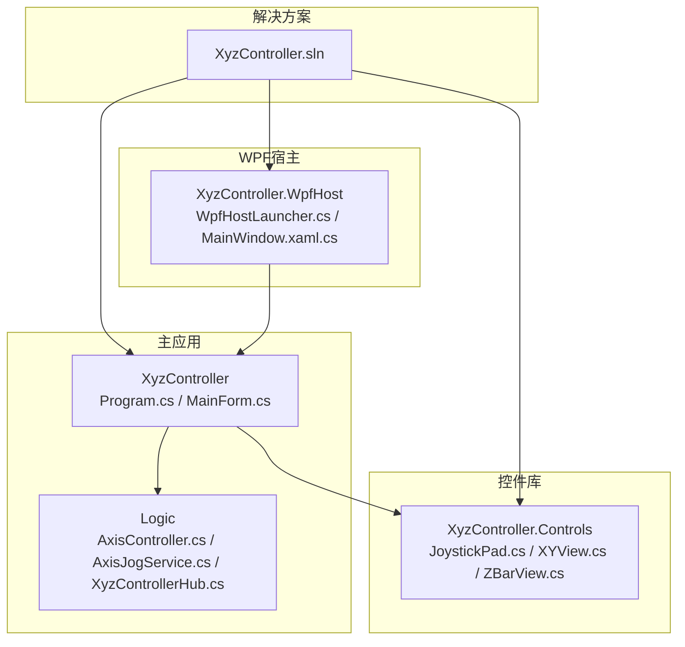
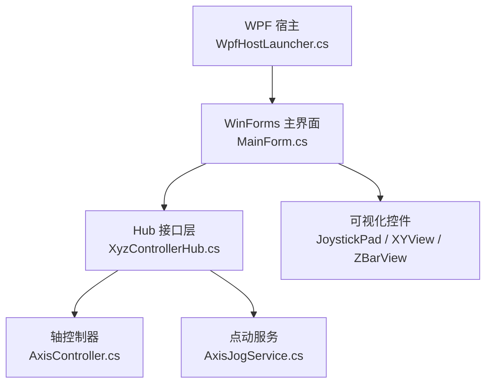
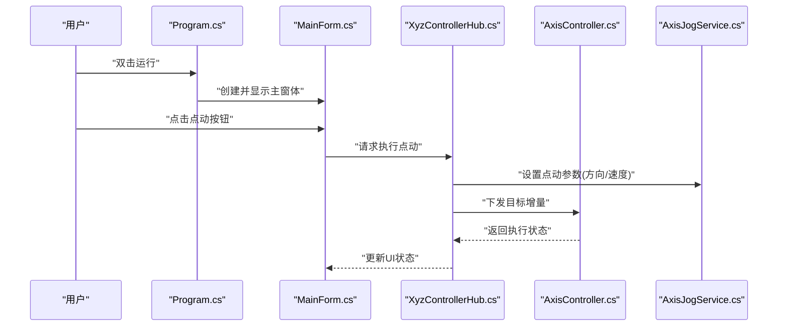
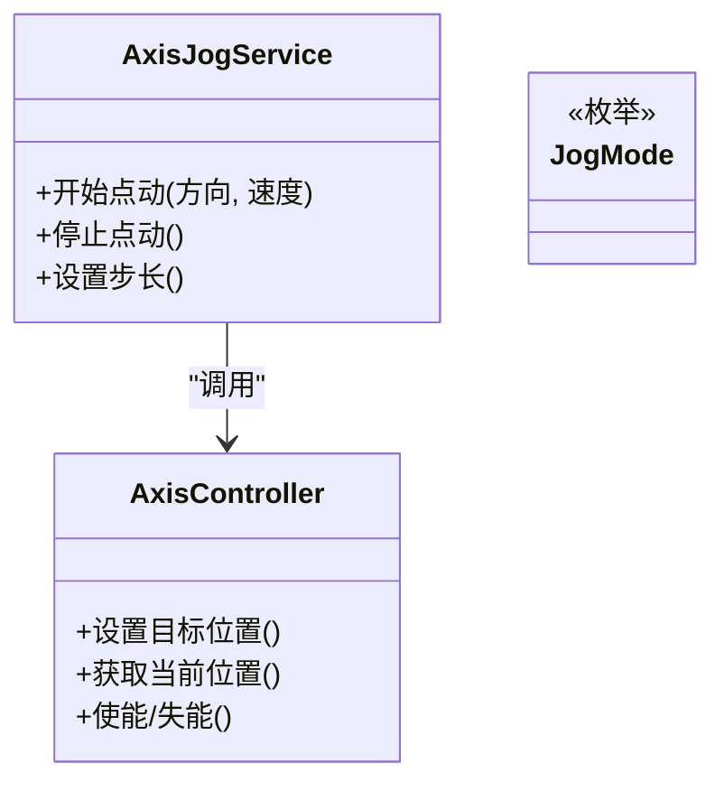
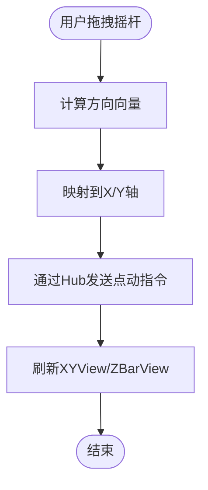
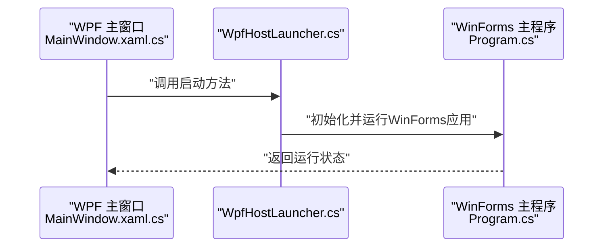
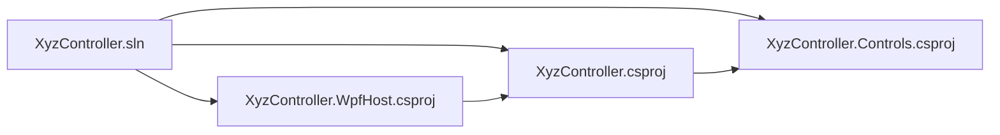

# 快速开始

<cite>
**本文引用的文件**   
- [README.md](file://README.md)
- [XyzController.sln](file://XyzController.sln)
- [Program.cs](file://src/XyzController/Program.cs)
- [MainForm.cs](file://src/XyzController/MainForm.cs)
- [AxisController.cs](file://src/XyzController/Logic/AxisController.cs)
- [AxisJogService.cs](file://src/XyzController/Logic/AxisJogService.cs)
- [XyzControllerHub.cs](file://src/XyzController/Logic/XyzControllerHub.cs)
- [JoystickPad.cs](file://src/XyzController.Controls/JoystickPad.cs)
- [XYView.cs](file://src/XyzController.Controls/XYView.cs)
- [ZBarView.cs](file://src/XyzController.Controls/ZBarView.cs)
- [WpfHostLauncher.cs](file://src/XyzController.WpfHost/WpfHostLauncher.cs)
- [MainWindow.xaml.cs](file://src/XyzController.WpfHost/MainWindow.xaml.cs)
- [XyzController.csproj](file://src/XyzController/XyzController.csproj)
- [XyzController.Controls.csproj](file://src/XyzController.Controls/XyzController.Controls.csproj)
- [XyzController.WpfHost.csproj](file://src/XyzController.WpfHost/XyzController.WpfHost.csproj)
</cite>

## 目录
1. [简介](#简介)
2. [项目结构](#项目结构)
3. [核心组件](#核心组件)
4. [架构总览](#架构总览)
5. [详细组件分析](#详细组件分析)
6. [依赖关系分析](#依赖关系分析)
7. [性能注意事项](#性能注意事项)
8. [故障排除指南](#故障排除指南)
9. [结论](#结论)
10. [附录](#附录)

## 简介
本快速开始指南面向首次接触 XyzController 的开发者与用户，目标是帮助你在最短时间内完成环境准备、代码克隆、构建与运行，并掌握基本的轴控制与点动操作流程。文档同时提供常见问题排查建议，确保你能顺利推进后续开发与集成工作。

## 项目结构
仓库采用多项目解决方案组织，包含主应用、自定义控件库、WPF宿主以及测试工程：
- src/XyzController：WinForms 主程序入口与业务逻辑（轴控制、点动服务、Hub 通信等）
- src/XyzController.Controls：可复用的可视化控件（摇杆、视图、指示条等）
- src/XyzController.WpfHost：WPF 宿主，用于承载或启动 WinForms 功能
- src/XyzController.Tests：单元测试与测试框架
- docs：架构与设计文档
- XyzController.sln：解决方案文件

图表来源
- [XyzController.sln](file://XyzController.sln)
- [Program.cs](file://src/XyzController/Program.cs)
- [MainForm.cs](file://src/XyzController/MainForm.cs)
- [AxisController.cs](file://src/XyzController/Logic/AxisController.cs)
- [AxisJogService.cs](file://src/XyzController/Logic/AxisJogService.cs)
- [XyzControllerHub.cs](file://src/XyzController/Logic/XyzControllerHub.cs)
- [JoystickPad.cs](file://src/XyzController.Controls/JoystickPad.cs)
- [XYView.cs](file://src/XyzController.Controls/XYView.cs)
- [ZBarView.cs](file://src/XyzController.Controls/ZBarView.cs)
- [WpfHostLauncher.cs](file://src/XyzController.WpfHost/WpfHostLauncher.cs)
- [MainWindow.xaml.cs](file://src/XyzController.WpfHost/MainWindow.xaml.cs)

章节来源
- [XyzController.sln](file://XyzController.sln)
- [Program.cs](file://src/XyzController/Program.cs)
- [MainForm.cs](file://src/XyzController/MainForm.cs)

## 核心组件
- 程序入口与主窗体
  - Program.cs：负责应用程序生命周期与入口初始化
  - MainForm.cs：主界面协调器，承载轴状态显示、操作按钮与视图控件
- 轴控制与点动服务
  - AxisController.cs：封装单轴控制能力（如目标位置、速度、使能等）
  - AxisJogService.cs：实现点动（Jog）模式与步长、方向、加减速策略
  - JogMode.cs：定义点动模式枚举
- Hub 通信
  - XyzControllerHub.cs：对外暴露统一接口，供 UI 或其他模块调用
- 可视化控件
  - JoystickPad.cs：摇杆输入控件
  - XYView.cs：二维平面视图
  - ZBarView.cs：Z轴进度条视图
- WPF 宿主
  - WpfHostLauncher.cs：WPF 侧启动器，负责加载并展示 WinForms 功能
  - MainWindow.xaml.cs：WPF 主窗口逻辑

章节来源
- [Program.cs](file://src/XyzController/Program.cs)
- [MainForm.cs](file://src/XyzController/MainForm.cs)
- [AxisController.cs](file://src/XyzController/Logic/AxisController.cs)
- [AxisJogService.cs](file://src/XyzController/Logic/AxisJogService.cs)
- [XyzControllerHub.cs](file://src/XyzController/Logic/XyzControllerHub.cs)
- [JoystickPad.cs](file://src/XyzController.Controls/JoystickPad.cs)
- [XYView.cs](file://src/XyzController.Controls/XYView.cs)
- [ZBarView.cs](file://src/XyzController.Controls/ZBarView.cs)
- [WpfHostLauncher.cs](file://src/XyzController.WpfHost/WpfHostLauncher.cs)
- [MainWindow.xaml.cs](file://src/XyzController.WpfHost/MainWindow.xaml.cs)

## 架构总览
整体采用“UI 层 + 控制逻辑层 + 可视化控件库”的分层设计，并通过 Hub 对外提供统一接口；WPF 宿主可作为可选包装层以适配不同宿主场景。

图表来源
- [MainForm.cs](file://src/XyzController/MainForm.cs)
- [XyzControllerHub.cs](file://src/XyzController/Logic/XyzControllerHub.cs)
- [AxisController.cs](file://src/XyzController/Logic/AxisController.cs)
- [AxisJogService.cs](file://src/XyzController/Logic/AxisJogService.cs)
- [JoystickPad.cs](file://src/XyzController.Controls/JoystickPad.cs)
- [XYView.cs](file://src/XyzController.Controls/XYView.cs)
- [ZBarView.cs](file://src/XyzController.Controls/ZBarView.cs)
- [WpfHostLauncher.cs](file://src/XyzController.WpfHost/WpfHostLauncher.cs)

## 详细组件分析

### 程序入口与主界面
- 程序入口
  - Program.cs 负责创建并运行主线程与应用上下文
- 主界面
  - MainForm.cs 作为协调器，组合轴控制、点动服务与可视化控件，处理用户交互事件

图表来源
- [Program.cs](file://src/XyzController/Program.cs)
- [MainForm.cs](file://src/XyzController/MainForm.cs)
- [XyzControllerHub.cs](file://src/XyzController/Logic/XyzControllerHub.cs)
- [AxisController.cs](file://src/XyzController/Logic/AxisController.cs)
- [AxisJogService.cs](file://src/XyzController/Logic/AxisJogService.cs)

章节来源
- [Program.cs](file://src/XyzController/Program.cs)
- [MainForm.cs](file://src/XyzController/MainForm.cs)

### 轴控制与点动服务
- AxisController.cs：管理单轴状态与运动指令
- AxisJogService.cs：实现点动流程（开始/停止/步进），并与 AxisController 协作
- JogMode.cs：定义点动模式

图表来源
- [AxisController.cs](file://src/XyzController/Logic/AxisController.cs)
- [AxisJogService.cs](file://src/XyzController/Logic/AxisJogService.cs)
- [JogMode.cs](file://src/XyzController/Logic/JogMode.cs)

章节来源
- [AxisController.cs](file://src/XyzController/Logic/AxisController.cs)
- [AxisJogService.cs](file://src/XyzController/Logic/AxisJogService.cs)
- [JogMode.cs](file://src/XyzController/Logic/JogMode.cs)

### 可视化控件
- JoystickPad.cs：接收摇杆输入并转换为轴向命令
- XYView.cs：绘制 XY 平面轨迹与当前坐标
- ZBarView.cs：显示 Z 轴进度与状态

图表来源
- [JoystickPad.cs](file://src/XyzController.Controls/JoystickPad.cs)
- [XYView.cs](file://src/XyzController.Controls/XYView.cs)
- [ZBarView.cs](file://src/XyzController.Controls/ZBarView.cs)
- [XyzControllerHub.cs](file://src/XyzController/Logic/XyzControllerHub.cs)

章节来源
- [JoystickPad.cs](file://src/XyzController.Controls/JoystickPad.cs)
- [XYView.cs](file://src/XyzController.Controls/XYView.cs)
- [ZBarView.cs](file://src/XyzController.Controls/ZBarView.cs)

### WPF 宿主
- WpfHostLauncher.cs：在 WPF 环境中启动并承载 WinForms 功能
- MainWindow.xaml.cs：WPF 主窗口逻辑与布局

图表来源
- [WpfHostLauncher.cs](file://src/XyzController.WpfHost/WpfHostLauncher.cs)
- [MainWindow.xaml.cs](file://src/XyzController.WpfHost/MainWindow.xaml.cs)
- [Program.cs](file://src/XyzController/Program.cs)

章节来源
- [WpfHostLauncher.cs](file://src/XyzController.WpfHost/WpfHostLauncher.cs)
- [MainWindow.xaml.cs](file://src/XyzController.WpfHost/MainWindow.xaml.cs)

## 依赖关系分析
- 解决方案级依赖
  - XyzController.sln 聚合了主应用、控件库与 WPF 宿主
- 项目级依赖
  - 主应用引用控件库与内部逻辑
  - WPF 宿主引用主应用以承载其功能
- 运行时依赖
  - .NET Framework 版本由各项目 csproj 指定

图表来源
- [XyzController.sln](file://XyzController.sln)
- [XyzController.csproj](file://src/XyzController/XyzController.csproj)
- [XyzController.Controls.csproj](file://src/XyzController.Controls/XyzController.Controls.csproj)
- [XyzController.WpfHost.csproj](file://src/XyzController.WpfHost/XyzController.WpfHost.csproj)

章节来源
- [XyzController.sln](file://XyzController.sln)
- [XyzController.csproj](file://src/XyzController/XyzController.csproj)
- [XyzController.Controls.csproj](file://src/XyzController.Controls/XyzController.Controls.csproj)
- [XyzController.WpfHost.csproj](file://src/XyzController.WpfHost/XyzController.WpfHost.csproj)

## 性能注意事项
- 避免在主线程执行耗时任务，使用异步或后台线程进行设备通信与数据处理
- 合理设置点动速度与步长，防止频繁触发导致 UI 卡顿
- 对高频数据刷新（如坐标更新）进行节流或批量更新，减少重绘开销
- 在资源受限环境下，关闭不必要的动画与高 DPI 特效

## 故障排除指南
- 无法启动或崩溃
  - 检查 .NET Framework 版本是否与项目配置一致
  - 确认 Visual Studio 已安装对应工作负载与 SDK
- 构建失败
  - 清理并重新生成解决方案
  - 检查 NuGet 包恢复是否成功
- 控件不显示或无响应
  - 确认控件库已成功引用
  - 检查 UI 线程调度是否正确
- 点动无效
  - 检查 Hub 接口调用链路与参数
  - 验证 AxisController 与 AxisJogService 的状态机

章节来源
- [XyzController.csproj](file://src/XyzController/XyzController.csproj)
- [XyzController.Controls.csproj](file://src/XyzController.Controls/XyzController.Controls.csproj)
- [XyzController.WpfHost.csproj](file://src/XyzController.WpfHost/XyzController.WpfHost.csproj)
- [Program.cs](file://src/XyzController/Program.cs)
- [MainForm.cs](file://src/XyzController/MainForm.cs)
- [XyzControllerHub.cs](file://src/XyzController/Logic/XyzControllerHub.cs)
- [AxisController.cs](file://src/XyzController/Logic/AxisController.cs)
- [AxisJogService.cs](file://src/XyzController/Logic/AxisJogService.cs)

## 结论
通过以上步骤，你可以快速搭建开发环境、构建并运行 XyzController，理解主界面、轴控制与点动服务的协作方式，并使用可视化控件进行基本操作。若遇到问题，请参考故障排除指南定位原因并解决。

## 附录

### 环境要求与工具
- 操作系统：Windows
- .NET Framework：请根据各项目的 csproj 中指定的目标框架版本选择对应版本
- 开发工具：Visual Studio（含 .NET 桌面开发工作负载）
- 其他：Git（用于克隆代码）

章节来源
- [XyzController.csproj](file://src/XyzController/XyzController.csproj)
- [XyzController.Controls.csproj](file://src/XyzController.Controls/XyzController.Controls.csproj)
- [XyzController.WpfHost.csproj](file://src/XyzController.WpfHost/XyzController.WpfHost.csproj)

### 克隆与构建
- 克隆仓库
  - 使用 Git 将仓库克隆至本地
- 打开解决方案
  - 使用 Visual Studio 打开 XyzController.sln
- 还原与构建
  - 还原 NuGet 包后，生成解决方案
- 运行
  - 将主应用设为启动项目并运行

章节来源
- [XyzController.sln](file://XyzController.sln)
- [Program.cs](file://src/XyzController/Program.cs)

### 基本使用示例
- 启动应用
  - 直接运行主应用或从 WPF 宿主启动
- 初始化轴控制
  - 通过 Hub 接口完成轴使能与基础参数设置
- 执行点动操作
  - 在主界面点击点动按钮或使用摇杆控件触发点动
  - 观察 XYView 与 ZBarView 的实时反馈

章节来源
- [Program.cs](file://src/XyzController/Program.cs)
- [MainForm.cs](file://src/XyzController/MainForm.cs)
- [XyzControllerHub.cs](file://src/XyzController/Logic/XyzControllerHub.cs)
- [AxisJogService.cs](file://src/XyzController/Logic/AxisJogService.cs)
- [JoystickPad.cs](file://src/XyzController.Controls/JoystickPad.cs)
- [XYView.cs](file://src/XyzController.Controls/XYView.cs)
- [ZBarView.cs](file://src/XyzController.Controls/ZBarView.cs)
- [WpfHostLauncher.cs](file://src/XyzController.WpfHost/WpfHostLauncher.cs)