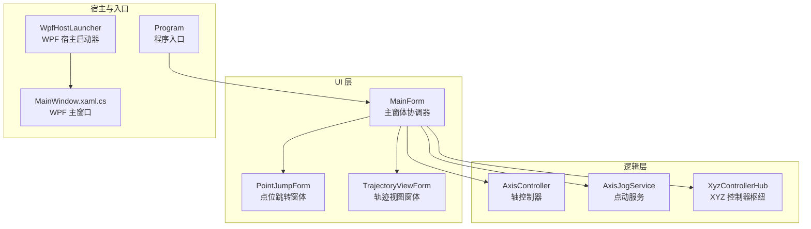
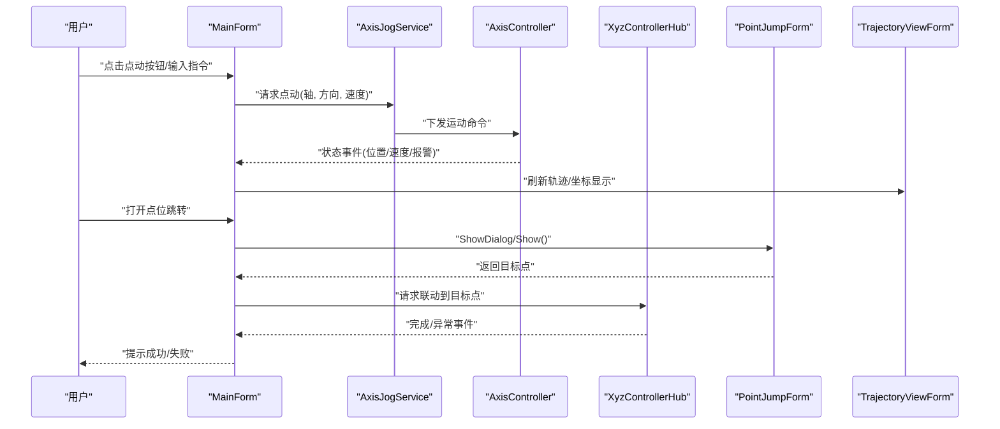
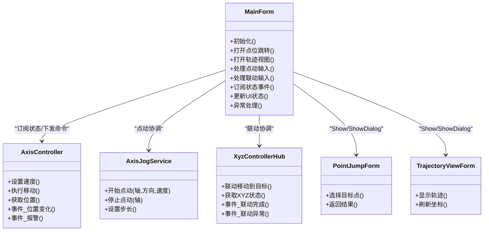
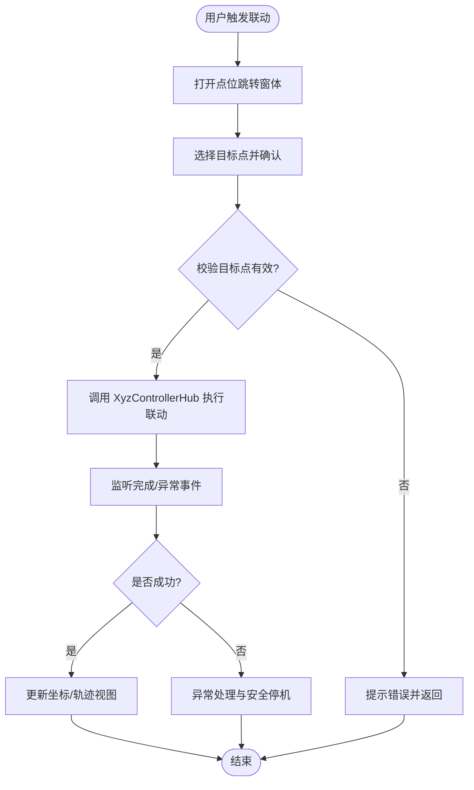
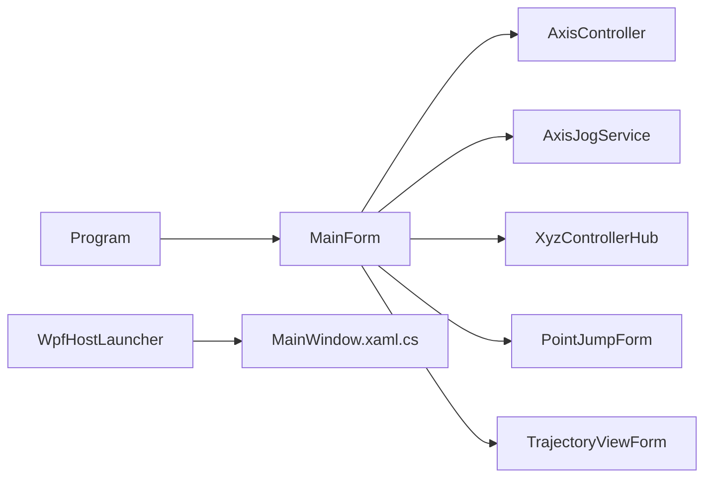

# 主窗体协调器

<cite>
**本文引用的文件**   
- [MainForm.cs](file://src/XyzController/MainForm.cs)
- [MainForm.Designer.cs](file://src/XyzController/MainForm.Designer.cs)
- [AxisController.cs](file://src/XyzController/Logic/AxisController.cs)
- [AxisJogService.cs](file://src/XyzController/Logic/AxisJogService.cs)
- [XyzControllerHub.cs](file://src/XyzController/Logic/XyzControllerHub.cs)
- [Program.cs](file://src/XyzController/Program.cs)
- [PointJumpForm.cs](file://src/XyzController/PointJumpForm.cs)
- [TrajectoryViewForm.cs](file://src/XyzController/TrajectoryViewForm.cs)
- [WpfHostLauncher.cs](file://src/XyzController.WpfHost/WpfHostLauncher.cs)
- [MainWindow.xaml.cs](file://src/XyzController.WpfHost/MainWindow.xaml.cs)
</cite>

## 目录
1. [简介](#简介)
2. [项目结构](#项目结构)
3. [核心组件](#核心组件)
4. [架构总览](#架构总览)
5. [详细组件分析](#详细组件分析)
6. [依赖关系分析](#依赖关系分析)
7. [性能考虑](#性能考虑)
8. [故障排查指南](#故障排查指南)
9. [结论](#结论)
10. [附录](#附录)

## 简介
本文件聚焦于主窗体协调器的设计与实现，围绕 MainForm 作为应用协调器的角色与职责展开。文档将系统阐述：
- 子窗体生命周期管理策略
- 用户输入分发机制
- 与 AxisController、AxisJogService、XyzControllerHub 等核心组件的集成方式
- 初始化流程、事件处理与状态管理模式
- 异常处理、错误恢复与用户反馈机制
- 常用协调模式与最佳实践（以代码片段路径引用代替直接粘贴代码）

## 项目结构
本项目采用分层与按功能域组织相结合的结构：
- UI 层：WinForms 主窗体与若干业务子窗体
- 逻辑层：轴控制、点动服务、控制器枢纽等
- WPF 宿主：提供 WPF 宿主入口与页面承载能力
- 测试与文档：单元测试与开发文档

图表来源
- [Program.cs](file://src/XyzController/Program.cs)
- [MainForm.cs](file://src/XyzController/MainForm.cs)
- [AxisController.cs](file://src/XyzController/Logic/AxisController.cs)
- [AxisJogService.cs](file://src/XyzController/Logic/AxisJogService.cs)
- [XyzControllerHub.cs](file://src/XyzController/Logic/XyzControllerHub.cs)
- [WpfHostLauncher.cs](file://src/XyzController.WpfHost/WpfHostLauncher.cs)
- [MainWindow.xaml.cs](file://src/XyzController.WpfHost/MainWindow.xaml.cs)

章节来源
- [Program.cs](file://src/XyzController/Program.cs)
- [MainForm.cs](file://src/XyzController/MainForm.cs)
- [AxisController.cs](file://src/XyzController/Logic/AxisController.cs)
- [AxisJogService.cs](file://src/XyzController/Logic/AxisJogService.cs)
- [XyzControllerHub.cs](file://src/XyzController/Logic/XyzControllerHub.cs)
- [WpfHostLauncher.cs](file://src/XyzController.WpfHost/WpfHostLauncher.cs)
- [MainWindow.xaml.cs](file://src/XyzController.WpfHost/MainWindow.xaml.cs)

## 核心组件
- MainForm（主窗体协调器）
  - 职责：应用级协调者，负责子窗体生命周期、用户输入分发、与业务组件交互、全局状态管理与异常兜底。
  - 关键行为：初始化时装配 AxisController、AxisJogService、XyzControllerHub；订阅其状态变更事件；根据用户操作调度业务调用并更新 UI。
- AxisController（轴控制器）
  - 职责：封装单轴或组合轴的控制命令与状态读取，暴露运动控制接口与状态事件。
- AxisJogService（点动服务）
  - 职责：提供点动（Jog）模式的统一入口，协调速度、步长、方向等参数，驱动 AxisController 执行。
- XyzControllerHub（XYZ 控制器枢纽）
  - 职责：聚合 XYZ 三轴协同控制能力，提供多轴联动、插补、同步等高级能力，对外发布统一的状态与事件。

章节来源
- [MainForm.cs](file://src/XyzController/MainForm.cs)
- [AxisController.cs](file://src/XyzController/Logic/AxisController.cs)
- [AxisJogService.cs](file://src/XyzController/Logic/AxisJogService.cs)
- [XyzControllerHub.cs](file://src/XyzController/Logic/XyzControllerHub.cs)

## 架构总览
主窗体协调器位于 UI 与业务逻辑之间，承担“编排”职责：接收 UI 事件，转换为领域命令，交由业务组件执行，并将结果回写到 UI。

图表来源
- [MainForm.cs](file://src/XyzController/MainForm.cs)
- [AxisJogService.cs](file://src/XyzController/Logic/AxisJogService.cs)
- [AxisController.cs](file://src/XyzController/Logic/AxisController.cs)
- [XyzControllerHub.cs](file://src/XyzController/Logic/XyzControllerHub.cs)
- [PointJumpForm.cs](file://src/XyzController/PointJumpForm.cs)
- [TrajectoryViewForm.cs](file://src/XyzController/TrajectoryViewForm.cs)

## 详细组件分析

### MainForm 主窗体协调器
- 初始化流程
  - 在构造或加载阶段完成以下工作：
    - 创建并持有 AxisController、AxisJogService、XyzControllerHub 实例
    - 订阅各组件的状态与事件（如位置变化、完成、异常）
    - 绑定 UI 控件的事件到协调方法
  - 参考路径
    - [MainForm.cs](file://src/XyzController/MainForm.cs)
    - [MainForm.Designer.cs](file://src/XyzController/MainForm.Designer.cs)

- 子窗体生命周期管理
  - 使用 Show/ShowDialog 打开 PointJumpForm、TrajectoryViewForm 等
  - 对已打开的子窗体进行引用缓存，避免重复创建
  - 在父窗体关闭或切换时释放子窗体资源
  - 参考路径
    - [MainForm.cs](file://src/XyzController/MainForm.cs)
    - [PointJumpForm.cs](file://src/XyzController/PointJumpForm.cs)
    - [TrajectoryViewForm.cs](file://src/XyzController/TrajectoryViewForm.cs)

- 用户输入分发
  - 将 UI 事件（按钮、键盘、摇杆、自定义控件）转换为领域命令
  - 通过 AxisJogService 下发点动命令，或通过 XyzControllerHub 执行联动
  - 参考路径
    - [MainForm.cs](file://src/XyzController/MainForm.cs)
    - [AxisJogService.cs](file://src/XyzController/Logic/AxisJogService.cs)
    - [XyzControllerHub.cs](file://src/XyzController/Logic/XyzControllerHub.cs)

- 状态管理模式
  - 订阅 AxisController 与 XyzControllerHub 的状态事件，集中维护当前坐标、速度、报警等信息
  - 使用线程安全的更新机制将状态推送至 UI
  - 参考路径
    - [MainForm.cs](file://src/XyzController/MainForm.cs)
    - [AxisController.cs](file://src/XyzController/Logic/AxisController.cs)
    - [XyzControllerHub.cs](file://src/XyzController/Logic/XyzControllerHub.cs)

- 异常处理与错误恢复
  - 在关键调用处捕获异常，记录日志并提示用户
  - 对可恢复错误尝试重试或降级（例如切换到安全速度）
  - 对不可恢复错误触发安全停机并引导用户复位
  - 参考路径
    - [MainForm.cs](file://src/XyzController/MainForm.cs)

- 常用协调模式与最佳实践（以路径引用代替代码）
  - 事件驱动协调：订阅业务组件事件，统一回调处理
      - [MainForm.cs](file://src/XyzController/MainForm.cs)
      - [AxisController.cs](file://src/XyzController/Logic/AxisController.cs)
  - 命令-服务封装：将 UI 动作封装为服务调用
      - [MainForm.cs](file://src/XyzController/MainForm.cs)
      - [AxisJogService.cs](file://src/XyzController/Logic/AxisJogService.cs)
  - 子窗体复用与资源释放：缓存实例并在合适时机 Dispose
      - [MainForm.cs](file://src/XyzController/MainForm.cs)
      - [PointJumpForm.cs](file://src/XyzController/PointJumpForm.cs)
      - [TrajectoryViewForm.cs](file://src/XyzController/TrajectoryViewForm.cs)

图表来源
- [MainForm.cs](file://src/XyzController/MainForm.cs)
- [AxisController.cs](file://src/XyzController/Logic/AxisController.cs)
- [AxisJogService.cs](file://src/XyzController/Logic/AxisJogService.cs)
- [XyzControllerHub.cs](file://src/XyzController/Logic/XyzControllerHub.cs)
- [PointJumpForm.cs](file://src/XyzController/PointJumpForm.cs)
- [TrajectoryViewForm.cs](file://src/XyzController/TrajectoryViewForm.cs)

章节来源
- [MainForm.cs](file://src/XyzController/MainForm.cs)
- [MainForm.Designer.cs](file://src/XyzController/MainForm.Designer.cs)
- [AxisController.cs](file://src/XyzController/Logic/AxisController.cs)
- [AxisJogService.cs](file://src/XyzController/Logic/AxisJogService.cs)
- [XyzControllerHub.cs](file://src/XyzController/Logic/XyzControllerHub.cs)
- [PointJumpForm.cs](file://src/XyzController/PointJumpForm.cs)
- [TrajectoryViewForm.cs](file://src/XyzController/TrajectoryViewForm.cs)

### 与 AxisController 的集成
- 订阅位置/速度/报警等事件，用于实时刷新 UI
- 通过命令接口执行单轴移动、速度设置等操作
- 在异常事件中触发安全停机或告警提示
- 参考路径
  - [MainForm.cs](file://src/XyzController/MainForm.cs)
  - [AxisController.cs](file://src/XyzController/Logic/AxisController.cs)

### 与 AxisJogService 的集成
- 将 UI 的点动输入（方向、速度、步长）转换为服务调用
- 支持多轴并发点动的协调与互斥
- 在点动过程中持续监听取消/停止信号
- 参考路径
  - [MainForm.cs](file://src/XyzController/MainForm.cs)
  - [AxisJogService.cs](file://src/XyzController/Logic/AxisJogService.cs)

### 与 XyzControllerHub 的集成
- 通过 Hub 发起 XYZ 联动任务（点到点、插补等）
- 监听联动完成/异常事件，更新 UI 并提供用户反馈
- 在多轴场景下保证状态一致性
- 参考路径
  - [MainForm.cs](file://src/XyzController/MainForm.cs)
  - [XyzControllerHub.cs](file://src/XyzController/Logic/XyzControllerHub.cs)

### 子窗体协调模式
- 点位跳转：由 MainForm 打开 PointJumpForm，获取目标点后调用 XyzControllerHub 执行联动
- 轨迹视图：由 MainForm 打开 TrajectoryViewForm，订阅状态事件并刷新轨迹显示
- 参考路径
  - [MainForm.cs](file://src/XyzController/MainForm.cs)
  - [PointJumpForm.cs](file://src/XyzController/PointJumpForm.cs)
  - [TrajectoryViewForm.cs](file://src/XyzController/TrajectoryViewForm.cs)

图表来源
- [MainForm.cs](file://src/XyzController/MainForm.cs)
- [PointJumpForm.cs](file://src/XyzController/PointJumpForm.cs)
- [XyzControllerHub.cs](file://src/XyzController/Logic/XyzControllerHub.cs)
- [TrajectoryViewForm.cs](file://src/XyzController/TrajectoryViewForm.cs)

## 依赖关系分析
- 入口与启动
  - Program 启动 WinForms 主应用，创建并运行 MainForm
  - WpfHostLauncher 提供 WPF 宿主入口，MainWindow 可作为扩展承载页
- 主窗体依赖
  - MainForm 依赖 AxisController、AxisJogService、XyzControllerHub
  - MainForm 依赖若干子窗体（PointJumpForm、TrajectoryViewForm）

图表来源
- [Program.cs](file://src/XyzController/Program.cs)
- [MainForm.cs](file://src/XyzController/MainForm.cs)
- [AxisController.cs](file://src/XyzController/Logic/AxisController.cs)
- [AxisJogService.cs](file://src/XyzController/Logic/AxisJogService.cs)
- [XyzControllerHub.cs](file://src/XyzController/Logic/XyzControllerHub.cs)
- [PointJumpForm.cs](file://src/XyzController/PointJumpForm.cs)
- [TrajectoryViewForm.cs](file://src/XyzController/TrajectoryViewForm.cs)
- [WpfHostLauncher.cs](file://src/XyzController.WpfHost/WpfHostLauncher.cs)
- [MainWindow.xaml.cs](file://src/XyzController.WpfHost/MainWindow.xaml.cs)

章节来源
- [Program.cs](file://src/XyzController/Program.cs)
- [WpfHostLauncher.cs](file://src/XyzController.WpfHost/WpfHostLauncher.cs)
- [MainWindow.xaml.cs](file://src/XyzController.WpfHost/MainWindow.xaml.cs)
- [MainForm.cs](file://src/XyzController/MainForm.cs)

## 性能考虑
- 事件订阅与去抖：对高频状态事件（位置/速度）做节流或合并更新，降低 UI 刷新压力
- 异步与线程模型：确保 UI 更新在主线程执行，长时间任务在后台线程执行
- 资源管理：及时释放子窗体与未使用的对象，避免内存泄漏
- 批量更新：对多点数据采用批处理更新，减少重绘次数

[本节为通用指导，不直接分析具体文件]

## 故障排查指南
- 常见问题定位
  - 子窗体无法打开或重复创建：检查 MainForm 中的实例缓存与生命周期管理
  - 点动无响应：核对 AxisJogService 调用链与 AxisController 命令下发
  - 联动失败：查看 XyzControllerHub 的异常事件与返回值
- 建议的调试步骤
  - 在 MainForm 的关键调用处添加日志输出
  - 使用断点跟踪事件订阅与回调链路
  - 验证 UI 线程上下文是否正确
- 参考路径
  - [MainForm.cs](file://src/XyzController/MainForm.cs)
  - [AxisJogService.cs](file://src/XyzController/Logic/AxisJogService.cs)
  - [AxisController.cs](file://src/XyzController/Logic/AxisController.cs)
  - [XyzControllerHub.cs](file://src/XyzController/Logic/XyzControllerHub.cs)

章节来源
- [MainForm.cs](file://src/XyzController/MainForm.cs)
- [AxisJogService.cs](file://src/XyzController/Logic/AxisJogService.cs)
- [AxisController.cs](file://src/XyzController/Logic/AxisController.cs)
- [XyzControllerHub.cs](file://src/XyzController/Logic/XyzControllerHub.cs)

## 结论
MainForm 作为应用协调器，承担了 UI 与业务逻辑之间的桥梁作用。通过清晰的生命周期管理、稳定的事件驱动与良好的异常处理，确保了系统的可维护性与用户体验。与 AxisController、AxisJogService、XyzControllerHub 的解耦集成，使得功能扩展与替换更加灵活。

[本节为总结性内容，不直接分析具体文件]

## 附录
- 常用协调模式清单（以路径引用代替代码）
  - 事件驱动协调
    - [MainForm.cs](file://src/XyzController/MainForm.cs)
    - [AxisController.cs](file://src/XyzController/Logic/AxisController.cs)
  - 命令-服务封装
    - [MainForm.cs](file://src/XyzController/MainForm.cs)
    - [AxisJogService.cs](file://src/XyzController/Logic/AxisJogService.cs)
  - 子窗体复用与资源释放
    - [MainForm.cs](file://src/XyzController/MainForm.cs)
    - [PointJumpForm.cs](file://src/XyzController/PointJumpForm.cs)
    - [TrajectoryViewForm.cs](file://src/XyzController/TrajectoryViewForm.cs)
  - 异常处理与用户反馈
    - [MainForm.cs](file://src/XyzController/MainForm.cs)
    - [XyzControllerHub.cs](file://src/XyzController/Logic/XyzControllerHub.cs)