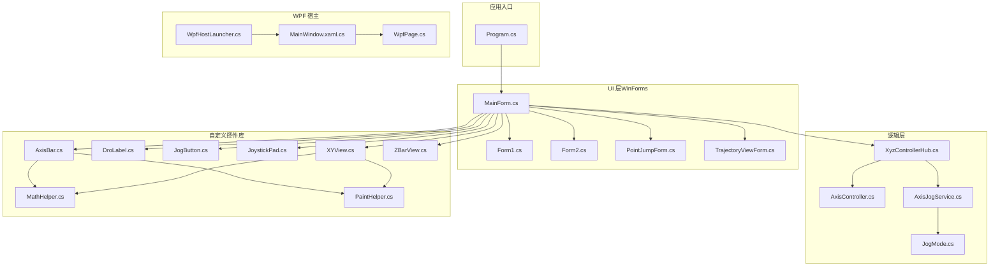
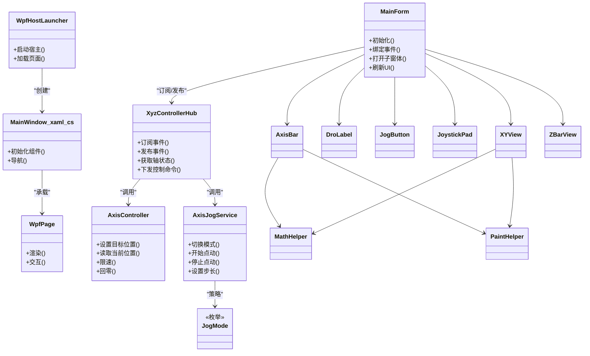
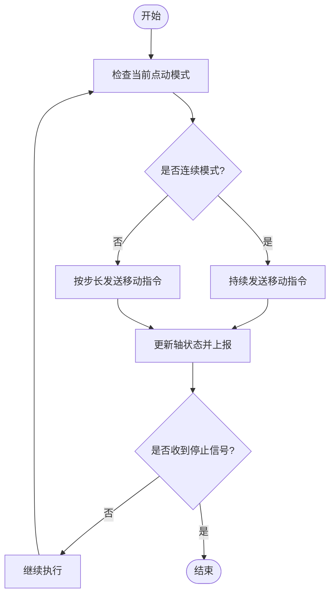
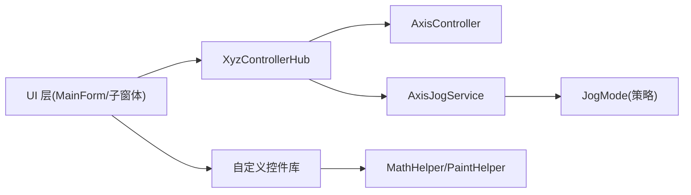

# 架构设计

<cite>
**本文引用的文件**   
- [Program.cs](file://src/XyzController/Program.cs)
- [MainForm.cs](file://src/XyzController/MainForm.cs)
- [XyzControllerHub.cs](file://src/XyzController/Logic/XyzControllerHub.cs)
- [AxisController.cs](file://src/XyzController/Logic/AxisController.cs)
- [AxisJogService.cs](file://src/XyzController/Logic/AxisJogService.cs)
- [JogMode.cs](file://src/XyzController/Logic/JogMode.cs)
- [Form1.cs](file://src/XyzController/Form1.cs)
- [Form2.cs](file://src/XyzController/Form2.cs)
- [PointJumpForm.cs](file://src/XyzController/PointJumpForm.cs)
- [TrajectoryViewForm.cs](file://src/XyzController/TrajectoryViewForm.cs)
- [WpfHostLauncher.cs](file://src/XyzController.WpfHost/WpfHostLauncher.cs)
- [MainWindow.xaml.cs](file://src/XyzController.WpfHost/MainWindow.xaml.cs)
- [WpfPage.cs](file://src/XyzController.WpfHost/WpfPage.cs)
- [AxisBar.cs](file://src/XyzController.Controls/AxisBar.cs)
- [DroLabel.cs](file://src/XyzController.Controls/DroLabel.cs)
- [JogButton.cs](file://src/XyzController.Controls/JogButton.cs)
- [JoystickPad.cs](file://src/XyzController.Controls/JoystickPad.cs)
- [XYView.cs](file://src/XyzController.Controls/XYView.cs)
- [ZBarView.cs](file://src/XyzController.Controls/ZBarView.cs)
- [MathHelper.cs](file://src/XyzController.Controls/MathHelper.cs)
- [PaintHelper.cs](file://src/XyzController.Controls/PaintHelper.cs)
- [核心架构设计.md](file://src/content/核心架构设计/核心架构设计.md)
- [主窗体协调器.md](file://src/content/核心架构设计/主窗体协调器.md)
- [组件通信机制.md](file://src/content/核心架构设计/组件通信机制.md)
- [轴控制系统.md](file://src/content/核心架构设计/轴控制系统.md)
- [点动服务.md](file://src/content/核心架构设计/点动服务.md)
</cite>

## 目录
1. [引言](#引言)
2. [项目结构](#项目结构)
3. [核心组件](#核心组件)
4. [架构总览](#架构总览)
5. [详细组件分析](#详细组件分析)
6. [依赖关系分析](#依赖关系分析)
7. [性能考虑](#性能考虑)
8. [故障排查指南](#故障排查指南)
9. [结论](#结论)
10. [附录](#附录)

## 引言
本架构设计文档面向 XyzController 系统，目标是帮助开发者理解整体分层架构、模块化设计与关键组件关系。文档重点阐述：
- 分层架构模式与模块边界
- MVC 模式在 UI 层的应用
- 观察者模式在事件驱动通信中的实现
- 工厂模式与策略模式的典型使用场景
- 核心组件 Main Form 主窗体协调器与 XyzControllerHub 通信中心的设计理念与实现要点
- 数据流向、组件交互模式与扩展点设计

## 项目结构
项目采用多工程组织，按职责划分为应用入口、业务逻辑、UI 窗体、自定义控件库以及 WPF 宿主等模块：
- 应用入口与主流程：Program.cs
- 主窗体协调器：MainForm.cs
- 业务逻辑与通信中心：XyzControllerHub.cs、AxisController.cs、AxisJogService.cs、JogMode.cs
- 辅助窗体：Form1.cs、Form2.cs、PointJumpForm.cs、TrajectoryViewForm.cs
- WPF 宿主：WpfHostLauncher.cs、MainWindow.xaml.cs、WpfPage.cs
- 自定义控件库：AxisBar.cs、DroLabel.cs、JogButton.cs、JoystickPad.cs、XYView.cs、ZBarView.cs、MathHelper.cs、PaintHelper.cs
- 架构与设计说明文档：核心架构设计系列文档

图表来源
- [Program.cs](file://src/XyzController/Program.cs)
- [MainForm.cs](file://src/XyzController/MainForm.cs)
- [XyzControllerHub.cs](file://src/XyzController/Logic/XyzControllerHub.cs)
- [AxisController.cs](file://src/XyzController/Logic/AxisController.cs)
- [AxisJogService.cs](file://src/XyzController/Logic/AxisJogService.cs)
- [JogMode.cs](file://src/XyzController/Logic/JogMode.cs)
- [WpfHostLauncher.cs](file://src/XyzController.WpfHost/WpfHostLauncher.cs)
- [MainWindow.xaml.cs](file://src/XyzController.WpfHost/MainWindow.xaml.cs)
- [WpfPage.cs](file://src/XyzController.WpfHost/WpfPage.cs)
- [AxisBar.cs](file://src/XyzController.Controls/AxisBar.cs)
- [DroLabel.cs](file://src/XyzController.Controls/DroLabel.cs)
- [JogButton.cs](file://src/XyzController.Controls/JogButton.cs)
- [JoystickPad.cs](file://src/XyzController.Controls/JoystickPad.cs)
- [XYView.cs](file://src/XyzController.Controls/XYView.cs)
- [ZBarView.cs](file://src/XyzController.Controls/ZBarView.cs)
- [MathHelper.cs](file://src/XyzController.Controls/MathHelper.cs)
- [PaintHelper.cs](file://src/XyzController.Controls/PaintHelper.cs)

章节来源
- [Program.cs](file://src/XyzController/Program.cs)
- [MainForm.cs](file://src/XyzController/MainForm.cs)
- [XyzControllerHub.cs](file://src/XyzController/Logic/XyzControllerHub.cs)
- [AxisController.cs](file://src/XyzController/Logic/AxisController.cs)
- [AxisJogService.cs](file://src/XyzController/Logic/AxisJogService.cs)
- [JogMode.cs](file://src/XyzController/Logic/JogMode.cs)
- [WpfHostLauncher.cs](file://src/XyzController.WpfHost/WpfHostLauncher.cs)
- [MainWindow.xaml.cs](file://src/XyzController.WpfHost/MainWindow.xaml.cs)
- [WpfPage.cs](file://src/XyzController.WpfHost/WpfPage.cs)
- [AxisBar.cs](file://src/XyzController.Controls/AxisBar.cs)
- [DroLabel.cs](file://src/XyzController.Controls/DroLabel.cs)
- [JogButton.cs](file://src/XyzController.Controls/JogButton.cs)
- [JoystickPad.cs](file://src/XyzController.Controls/JoystickPad.cs)
- [XYView.cs](file://src/XyzController.Controls/XYView.cs)
- [ZBarView.cs](file://src/XyzController.Controls/ZBarView.cs)
- [MathHelper.cs](file://src/XyzController.Controls/MathHelper.cs)
- [PaintHelper.cs](file://src/XyzController.Controls/PaintHelper.cs)

## 核心组件
- 主窗体协调器（MainForm）
  - 作为 UI 层的协调者，负责生命周期管理、子窗体编排、与通信中心的交互以及状态同步到视图。
  - 通过订阅通信中心的事件，将设备状态、轨迹数据等更新到 UI 控件。
- 通信中心（XyzControllerHub）
  - 提供跨组件的发布/订阅能力，解耦 UI 与业务逻辑，屏蔽底层设备细节。
  - 聚合轴控制与点动服务，统一对外暴露命令与事件。
- 轴控制器（AxisController）
  - 封装单轴或多轴的坐标、速度、限位、回零等控制能力。
  - 向通信中心上报状态变更事件，供 UI 消费。
- 点动服务（AxisJogService）
  - 处理点动模式切换、步长与速度策略，基于 JogMode 策略执行连续或步进运动。
- 策略枚举（JogMode）
  - 定义点动模式（如连续/步进），为点动服务提供可扩展的策略选择。

章节来源
- [MainForm.cs](file://src/XyzController/MainForm.cs)
- [XyzControllerHub.cs](file://src/XyzController/Logic/XyzControllerHub.cs)
- [AxisController.cs](file://src/XyzController/Logic/AxisController.cs)
- [AxisJogService.cs](file://src/XyzController/Logic/AxisJogService.cs)
- [JogMode.cs](file://src/XyzController/Logic/JogMode.cs)

## 架构总览
系统采用分层架构与模块化设计：
- 表现层（UI）：WinForms 主窗体与辅助窗体，承载用户交互与可视化展示；WPF 宿主用于页面化集成。
- 领域层（逻辑）：通信中心、轴控制、点动服务等核心业务。
- 基础设施层（控件库）：通用绘图与交互控件，提供可复用的 UI 能力。

图表来源
- [MainForm.cs](file://src/XyzController/MainForm.cs)
- [XyzControllerHub.cs](file://src/XyzController/Logic/XyzControllerHub.cs)
- [AxisController.cs](file://src/XyzController/Logic/AxisController.cs)
- [AxisJogService.cs](file://src/XyzController/Logic/AxisJogService.cs)
- [JogMode.cs](file://src/XyzController/Logic/JogMode.cs)
- [WpfHostLauncher.cs](file://src/XyzController.WpfHost/WpfHostLauncher.cs)
- [MainWindow.xaml.cs](file://src/XyzController.WpfHost/MainWindow.xaml.cs)
- [WpfPage.cs](file://src/XyzController.WpfHost/WpfPage.cs)
- [AxisBar.cs](file://src/XyzController.Controls/AxisBar.cs)
- [DroLabel.cs](file://src/XyzController.Controls/DroLabel.cs)
- [JogButton.cs](file://src/XyzController.Controls/JogButton.cs)
- [JoystickPad.cs](file://src/XyzController.Controls/JoystickPad.cs)
- [XYView.cs](file://src/XyzController.Controls/XYView.cs)
- [ZBarView.cs](file://src/XyzController.Controls/ZBarView.cs)
- [MathHelper.cs](file://src/XyzController.Controls/MathHelper.cs)
- [PaintHelper.cs](file://src/XyzController.Controls/PaintHelper.cs)

## 详细组件分析

### 主窗体协调器（MainForm）
- 角色与职责
  - 作为 UI 协调者，负责窗口生命周期、子窗体管理与状态同步。
  - 订阅通信中心事件，驱动 UI 刷新与交互反馈。
- 与 MVC 的关系
  - View：窗体与自定义控件呈现界面。
  - Controller：MainForm 承担协调职责，转发用户操作至 Hub。
  - Model：由 Hub 聚合的 AxisController 与 AxisJogService 提供领域模型与状态。
- 扩展点
  - 新增子功能可通过注册新的事件处理器与子窗体进行扩展。
  - 通过注入新的策略或命令类型，复用现有事件通道。

章节来源
- [MainForm.cs](file://src/XyzController/MainForm.cs)
- [主窗体协调器.md](file://src/content/核心架构设计/主窗体协调器.md)

### 通信中心（XyzControllerHub）
- 设计理念
  - 以“发布/订阅”为核心，解耦 UI 与业务逻辑，屏蔽设备差异。
  - 集中管理轴控制与点动服务的实例，提供统一的命令与事件接口。
- 事件驱动通信
  - 使用观察者模式：组件订阅特定事件，Hub 在状态变化时广播消息。
  - 支持多订阅者，避免直接耦合。
- 与策略/工厂的结合
  - 对 JogMode 的选择可采用策略模式；对复杂对象构造可使用工厂模式（例如根据配置创建不同轴控制器）。

章节来源
- [XyzControllerHub.cs](file://src/XyzController/Logic/XyzControllerHub.cs)
- [组件通信机制.md](file://src/content/核心架构设计/组件通信机制.md)

### 轴控制器（AxisController）
- 职责
  - 封装单轴/多轴的控制原语：目标位置、速度、限位、回零、状态读取等。
  - 将内部状态变化以事件形式上报给 Hub。
- 复杂度与优化
  - 高频状态上报建议采用批处理或节流策略，降低 UI 刷新压力。
  - 对并发访问需保证线程安全。

章节来源
- [AxisController.cs](file://src/XyzController/Logic/AxisController.cs)
- [轴控制系统.md](file://src/content/核心架构设计/轴控制系统.md)

### 点动服务（AxisJogService）与策略（JogMode）
- 职责
  - 管理点动模式切换、步长与速度策略，驱动轴控制器执行连续或步进运动。
- 策略模式
  - JogMode 作为策略枚举，决定点动行为；未来可替换为具体策略类以支持更复杂的算法。
- 流程图（点动执行）

图表来源
- [AxisJogService.cs](file://src/XyzController/Logic/AxisJogService.cs)
- [JogMode.cs](file://src/XyzController/Logic/JogMode.cs)

章节来源
- [AxisJogService.cs](file://src/XyzController/Logic/AxisJogService.cs)
- [JogMode.cs](file://src/XyzController/Logic/JogMode.cs)
- [点动服务.md](file://src/content/核心架构设计/点动服务.md)

### WPF 宿主与页面
- 角色
  - 提供 WPF 宿主环境，加载与管理页面，便于嵌入或替代 WinForms 界面。
- 交互
  - 通过宿主启动器创建主窗口与页面，页面内可与 Hub 交互。

章节来源
- [WpfHostLauncher.cs](file://src/XyzController.WpfHost/WpfHostLauncher.cs)
- [MainWindow.xaml.cs](file://src/XyzController.WpfHost/MainWindow.xaml.cs)
- [WpfPage.cs](file://src/XyzController.WpfHost/WpfPage.cs)

### 自定义控件库
- 职责
  - 提供可复用的 UI 组件：轴条、数值显示、点动按钮、摇杆、二维/三维视图等。
  - 封装数学计算与绘制逻辑，提升 UI 一致性与性能。
- 依赖
  - 数学与绘制工具：MathHelper、PaintHelper。

章节来源
- [AxisBar.cs](file://src/XyzController.Controls/AxisBar.cs)
- [DroLabel.cs](file://src/XyzController.Controls/DroLabel.cs)
- [JogButton.cs](file://src/XyzController.Controls/JogButton.cs)
- [JoystickPad.cs](file://src/XyzController.Controls/JoystickPad.cs)
- [XYView.cs](file://src/XyzController.Controls/XYView.cs)
- [ZBarView.cs](file://src/XyzController.Controls/ZBarView.cs)
- [MathHelper.cs](file://src/XyzController.Controls/MathHelper.cs)
- [PaintHelper.cs](file://src/XyzController.Controls/PaintHelper.cs)

## 依赖关系分析
- 松耦合设计
  - UI 仅依赖 Hub 的抽象接口（事件与命令），不直接依赖 AxisController 与 AxisJogService。
  - 业务逻辑通过 Hub 聚合，避免 UI 与底层控制的强耦合。
- 可能的循环依赖
  - 若控件直接依赖 Hub，可能引入反向依赖；建议通过事件回调或接口隔离。
- 外部依赖
  - 设备驱动或硬件抽象层应位于 AxisController 之下，保持上层稳定。

图表来源
- [MainForm.cs](file://src/XyzController/MainForm.cs)
- [XyzControllerHub.cs](file://src/XyzController/Logic/XyzControllerHub.cs)
- [AxisController.cs](file://src/XyzController/Logic/AxisController.cs)
- [AxisJogService.cs](file://src/XyzController/Logic/AxisJogService.cs)
- [JogMode.cs](file://src/XyzController/Logic/JogMode.cs)
- [AxisBar.cs](file://src/XyzController.Controls/AxisBar.cs)
- [MathHelper.cs](file://src/XyzController.Controls/MathHelper.cs)
- [PaintHelper.cs](file://src/XyzController.Controls/PaintHelper.cs)

章节来源
- [XyzControllerHub.cs](file://src/XyzController/Logic/XyzControllerHub.cs)
- [AxisController.cs](file://src/XyzController/Logic/AxisController.cs)
- [AxisJogService.cs](file://src/XyzController/Logic/AxisJogService.cs)
- [JogMode.cs](file://src/XyzController/Logic/JogMode.cs)
- [AxisBar.cs](file://src/XyzController.Controls/AxisBar.cs)
- [MathHelper.cs](file://src/XyzController.Controls/MathHelper.cs)
- [PaintHelper.cs](file://src/XyzController.Controls/PaintHelper.cs)

## 性能考虑
- 事件频率控制
  - 对高频状态上报进行节流或合并，减少 UI 重绘与布局开销。
- 绘制优化
  - 自定义控件使用双缓冲与增量绘制，避免全量重绘。
- 线程模型
  - 确保设备 I/O 与 UI 线程分离，使用合适的调度机制更新 UI。
- 资源管理
  - 及时释放图形资源与句柄，避免内存泄漏。

[本节为通用指导，无需列出具体文件来源]

## 故障排查指南
- 常见问题定位
  - 事件未触发：检查 Hub 的订阅是否正确注册，是否存在重复订阅或提前释放。
  - UI 无刷新：确认事件是否在 UI 线程分发，必要时进行线程切换。
  - 点动异常：核对 JogMode 策略与步长/速度参数，检查停止信号路径。
- 日志与断点
  - 在 Hub 的发布/订阅处添加日志，追踪事件链路。
  - 在 AxisController 的状态变更处增加断点，验证数据一致性。

章节来源
- [XyzControllerHub.cs](file://src/XyzController/Logic/XyzControllerHub.cs)
- [AxisController.cs](file://src/XyzController/Logic/AxisController.cs)
- [AxisJogService.cs](file://src/XyzController/Logic/AxisJogService.cs)

## 结论
XyzController 系统通过分层架构与模块化设计实现了清晰的职责划分与良好的扩展性。主窗体协调器与通信中心构成了 UI 与业务之间的桥梁，观察者模式保障了事件驱动的松耦合通信。策略模式在点动服务中提供了灵活的行为选择，未来可在更多场景引入工厂模式以简化复杂对象的创建。建议在后续迭代中进一步完善接口抽象、增强错误处理与性能监控，以提升系统的稳定性与可维护性。

[本节为总结性内容，无需列出具体文件来源]

## 附录
- 参考文档
  - 核心架构设计系列文档提供了更高视角的设计说明与背景信息。

章节来源
- [核心架构设计.md](file://src/content/核心架构设计/核心架构设计.md)
- [主窗体协调器.md](file://src/content/核心架构设计/主窗体协调器.md)
- [组件通信机制.md](file://src/content/核心架构设计/组件通信机制.md)
- [轴控制系统.md](file://src/content/核心架构设计/轴控制系统.md)
- [点动服务.md](file://src/content/核心架构设计/点动服务.md)