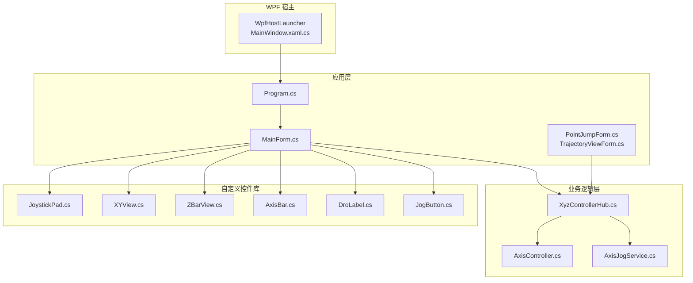
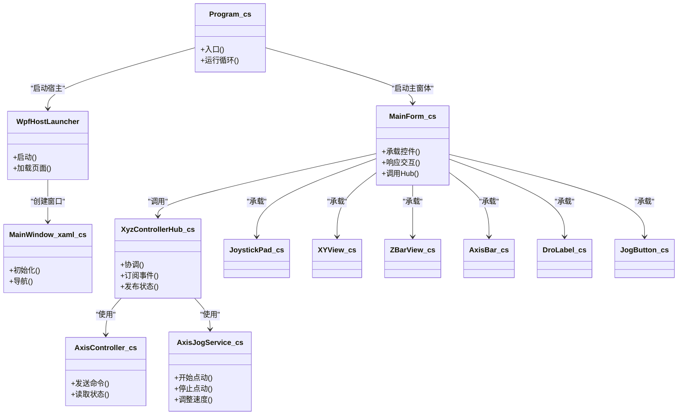
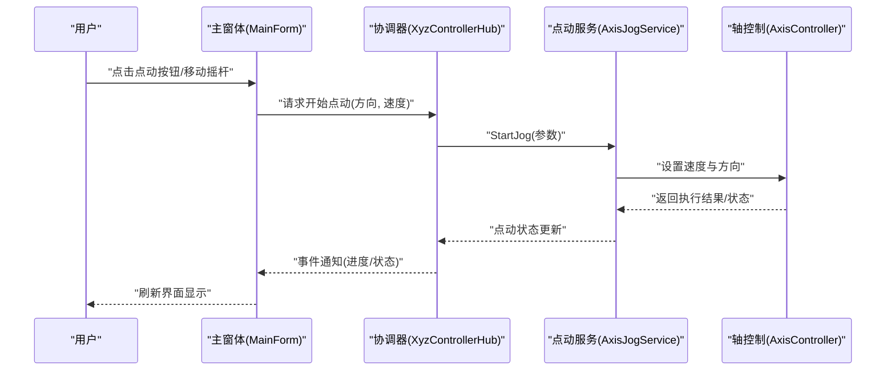
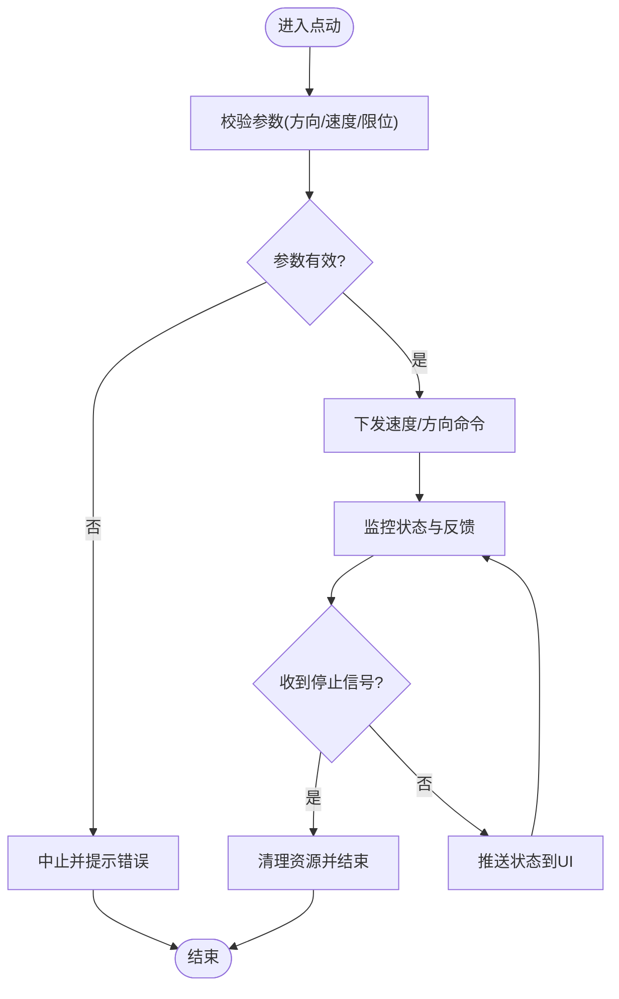
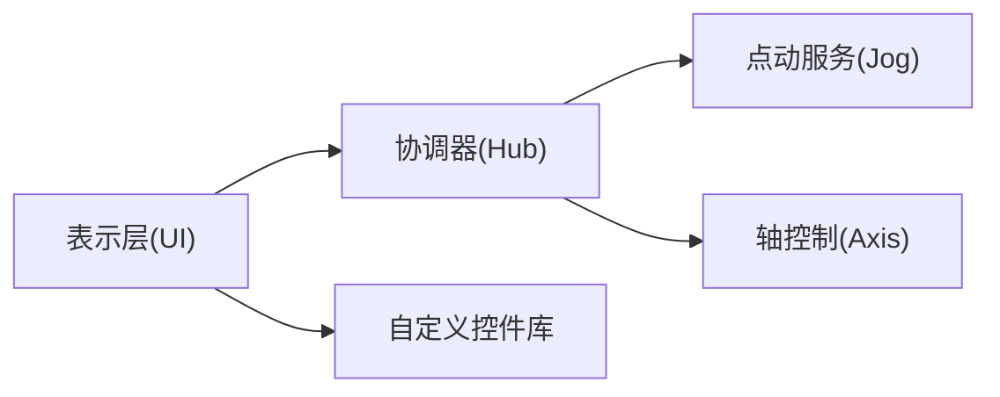

# 核心架构概览

<cite>
**本文引用的文件**   
- [Program.cs](file://src/XyzController/Program.cs)
- [MainForm.cs](file://src/XyzController/MainForm.cs)
- [XyzControllerHub.cs](file://src/XyzController/Logic/XyzControllerHub.cs)
- [AxisController.cs](file://src/XyzController/Logic/AxisController.cs)
- [AxisJogService.cs](file://src/XyzController/Logic/AxisJogService.cs)
- [WpfHostLauncher.cs](file://src/XyzController.WpfHost/WpfHostLauncher.cs)
- [MainWindow.xaml.cs](file://src/XyzController.WpfHost/MainWindow.xaml.cs)
- [WpfPage.cs](file://src/XyzController.WpfHost/WpfPage.cs)
- [JoystickPad.cs](file://src/XyzController.Controls/JoystickPad.cs)
- [XYView.cs](file://src/XyzController.Controls/XYView.cs)
- [ZBarView.cs](file://src/XyzController.Controls/ZBarView.cs)
- [AxisBar.cs](file://src/XyzController.Controls/AxisBar.cs)
- [DroLabel.cs](file://src/XyzController.Controls/DroLabel.cs)
- [JogButton.cs](file://src/XyzController.Controls/JogButton.cs)
- [PointJumpForm.cs](file://src/XyzController/PointJumpForm.cs)
- [TrajectoryViewForm.cs](file://src/XyzController/TrajectoryViewForm.cs)
- [核心架构设计.md](file://src/content/核心架构设计/核心架构设计.md)
- [主窗体协调器.md](file://src/content/核心架构设计/主窗体协调器.md)
- [点动服务.md](file://src/content/核心架构设计/点动服务.md)
- [组件通信机制.md](file://src/content/核心架构设计/组件通信机制.md)
- [轴控制系统.md](file://src/content/核心架构设计/轴控制系统.md)
</cite>

## 目录
1. [简介](#简介)
2. [项目结构](#项目结构)
3. [核心组件](#核心组件)
4. [架构总览](#架构总览)
5. [详细组件分析](#详细组件分析)
6. [依赖关系分析](#依赖关系分析)
7. [性能考虑](#性能考虑)
8. [故障排查指南](#故障排查指南)
9. [结论](#结论)
10. [附录](#附录)

## 简介
本文件为 XyzController 系统的核心架构概览，面向希望快速理解系统整体结构与分层职责的开发者。文档聚焦以下目标：
- 描述系统的整体架构模式与模块化组织方式
- 解释 MVC 在应用中的具体实现与职责划分（表示层、业务逻辑层、数据访问层）
- 说明主要技术决策与约束（如选择 WPF 作为界面框架、事件驱动架构的优势）
- 提供系统上下文图与组件关系图，帮助定位各层之间的依赖关系

## 项目结构
仓库采用多项目组织，按关注点拆分：
- 应用入口与主窗体：位于 src/XyzController，包含 Program.cs、MainForm.cs 以及若干辅助窗体
- 业务逻辑与控制器：位于 src/XyzController/Logic，包含轴控制、点动服务、中心协调器等
- 自定义控件库：位于 src/XyzController.Controls，封装可复用的 UI 控件
- WPF 宿主：位于 src/XyzController.WpfHost，负责以 WPF 承载并启动应用
- 测试工程：位于 src/XyzController.Tests
- 设计与开发文档：位于 src/content

图表来源
- [WpfHostLauncher.cs](file://src/XyzController.WpfHost/WpfHostLauncher.cs)
- [MainWindow.xaml.cs](file://src/XyzController.WpfHost/MainWindow.xaml.cs)
- [Program.cs](file://src/XyzController/Program.cs)
- [MainForm.cs](file://src/XyzController/MainForm.cs)
- [XyzControllerHub.cs](file://src/XyzController/Logic/XyzControllerHub.cs)
- [AxisController.cs](file://src/XyzController/Logic/AxisController.cs)
- [AxisJogService.cs](file://src/XyzController/Logic/AxisJogService.cs)
- [JoystickPad.cs](file://src/XyzController.Controls/JoystickPad.cs)
- [XYView.cs](file://src/XyzController.Controls/XYView.cs)
- [ZBarView.cs](file://src/XyzController.Controls/ZBarView.cs)
- [AxisBar.cs](file://src/XyzController.Controls/AxisBar.cs)
- [DroLabel.cs](file://src/XyzController.Controls/DroLabel.cs)
- [JogButton.cs](file://src/XyzController.Controls/JogButton.cs)
- [PointJumpForm.cs](file://src/XyzController/PointJumpForm.cs)
- [TrajectoryViewForm.cs](file://src/XyzController/TrajectoryViewForm.cs)

章节来源
- [Program.cs](file://src/XyzController/Program.cs)
- [MainForm.cs](file://src/XyzController/MainForm.cs)
- [WpfHostLauncher.cs](file://src/XyzController.WpfHost/WpfHostLauncher.cs)
- [MainWindow.xaml.cs](file://src/XyzController.WpfHost/MainWindow.xaml.cs)
- [XyzControllerHub.cs](file://src/XyzController/Logic/XyzControllerHub.cs)
- [AxisController.cs](file://src/XyzController/Logic/AxisController.cs)
- [AxisJogService.cs](file://src/XyzController/Logic/AxisJogService.cs)
- [JoystickPad.cs](file://src/XyzController.Controls/JoystickPad.cs)
- [XYView.cs](file://src/XyzController.Controls/XYView.cs)
- [ZBarView.cs](file://src/XyzController.Controls/ZBarView.cs)
- [AxisBar.cs](file://src/XyzController.Controls/AxisBar.cs)
- [DroLabel.cs](file://src/XyzController.Controls/DroLabel.cs)
- [JogButton.cs](file://src/XyzController.Controls/JogButton.cs)
- [PointJumpForm.cs](file://src/XyzController/PointJumpForm.cs)
- [TrajectoryViewForm.cs](file://src/XyzController/TrajectoryViewForm.cs)

## 核心组件
- 应用入口与宿主
  - Program.cs：定义应用程序生命周期入口，负责初始化与启动主界面
  - WpfHostLauncher.cs / MainWindow.xaml.cs：WPF 宿主负责创建窗口、加载页面、管理宿主生命周期
- 主窗体与协调器
  - MainForm.cs：作为主视图容器，承载自定义控件与子窗体，协调用户交互与业务调用
  - XyzControllerHub.cs：作为中枢协调器，聚合轴控制与点动服务等业务能力，对外暴露统一接口
- 业务逻辑
  - AxisController.cs：封装单轴或轴组的底层控制能力（运动命令、状态查询等）
  - AxisJogService.cs：实现点动（Jog）策略与流程编排，处理速度、方向、步进等参数
- 自定义控件库
  - JoystickPad.cs、XYView.cs、ZBarView.cs、AxisBar.cs、DroLabel.cs、JogButton.cs：提供可视化操作与状态展示的可复用控件

章节来源
- [Program.cs](file://src/XyzController/Program.cs)
- [WpfHostLauncher.cs](file://src/XyzController.WpfHost/WpfHostLauncher.cs)
- [MainWindow.xaml.cs](file://src/XyzController.WpfHost/MainWindow.xaml.cs)
- [MainForm.cs](file://src/XyzController/MainForm.cs)
- [XyzControllerHub.cs](file://src/XyzController/Logic/XyzControllerHub.cs)
- [AxisController.cs](file://src/XyzController/Logic/AxisController.cs)
- [AxisJogService.cs](file://src/XyzController/Logic/AxisJogService.cs)
- [JoystickPad.cs](file://src/XyzController.Controls/JoystickPad.cs)
- [XYView.cs](file://src/XyzController.Controls/XYView.cs)
- [ZBarView.cs](file://src/XyzController.Controls/ZBarView.cs)
- [AxisBar.cs](file://src/XyzController.Controls/AxisBar.cs)
- [DroLabel.cs](file://src/XyzController.Controls/DroLabel.cs)
- [JogButton.cs](file://src/XyzController.Controls/JogButton.cs)

## 架构总览
系统采用“WPF 宿主 + WinForms 应用 + 业务逻辑 + 自定义控件”的分层组合：
- 表示层（UI）
  - WPF 宿主负责窗口与页面承载
  - WinForms 主窗体与子窗体负责交互与布局
  - 自定义控件库提供高内聚的可视化组件
- 业务逻辑层（BLL）
  - 通过 Hub 协调器统一调度轴控制与点动服务
  - 将复杂业务流程从 UI 中解耦，便于测试与扩展
- 数据访问层（DAL）
  - 由 AxisController 抽象对底层设备/驱动的访问边界，便于替换与模拟

图表来源
- [WpfHostLauncher.cs](file://src/XyzController.WpfHost/WpfHostLauncher.cs)
- [MainWindow.xaml.cs](file://src/XyzController.WpfHost/MainWindow.xaml.cs)
- [Program.cs](file://src/XyzController/Program.cs)
- [MainForm.cs](file://src/XyzController/MainForm.cs)
- [XyzControllerHub.cs](file://src/XyzController/Logic/XyzControllerHub.cs)
- [AxisController.cs](file://src/XyzController/Logic/AxisController.cs)
- [AxisJogService.cs](file://src/XyzController/Logic/AxisJogService.cs)
- [JoystickPad.cs](file://src/XyzController.Controls/JoystickPad.cs)
- [XYView.cs](file://src/XyzController.Controls/XYView.cs)
- [ZBarView.cs](file://src/XyzController.Controls/ZBarView.cs)
- [AxisBar.cs](file://src/XyzController.Controls/AxisBar.cs)
- [DroLabel.cs](file://src/XyzController.Controls/DroLabel.cs)
- [JogButton.cs](file://src/XyzController.Controls/JogButton.cs)

## 详细组件分析

### 表示层（MVC 的 View）
- WPF 宿主
  - 职责：创建窗口、加载页面、管理宿主生命周期；为上层应用提供稳定的 UI 运行时
  - 关键文件：[WpfHostLauncher.cs](file://src/XyzController.WpfHost/WpfHostLauncher.cs)、[MainWindow.xaml.cs](file://src/XyzController.WpfHost/MainWindow.xaml.cs)
- WinForms 主窗体与子窗体
  - 职责：承载自定义控件、响应用户输入、触发业务调用、展示结果
  - 关键文件：[MainForm.cs](file://src/XyzController/MainForm.cs)、[PointJumpForm.cs](file://src/XyzController/PointJumpForm.cs)、[TrajectoryViewForm.cs](file://src/XyzController/TrajectoryViewForm.cs)
- 自定义控件库
  - 职责：封装特定领域的可视化与交互逻辑，提升复用性与一致性
  - 关键文件：[JoystickPad.cs](file://src/XyzController.Controls/JoystickPad.cs)、[XYView.cs](file://src/XyzController.Controls/XYView.cs)、[ZBarView.cs](file://src/XyzController.Controls/ZBarView.cs)、[AxisBar.cs](file://src/XyzController.Controls/AxisBar.cs)、[DroLabel.cs](file://src/XyzController.Controls/DroLabel.cs)、[JogButton.cs](file://src/XyzController.Controls/JogButton.cs)

章节来源
- [WpfHostLauncher.cs](file://src/XyzController.WpfHost/WpfHostLauncher.cs)
- [MainWindow.xaml.cs](file://src/XyzController.WpfHost/MainWindow.xaml.cs)
- [MainForm.cs](file://src/XyzController/MainForm.cs)
- [PointJumpForm.cs](file://src/XyzController/PointJumpForm.cs)
- [TrajectoryViewForm.cs](file://src/XyzController/TrajectoryViewForm.cs)
- [JoystickPad.cs](file://src/XyzController.Controls/JoystickPad.cs)
- [XYView.cs](file://src/XyzController.Controls/XYView.cs)
- [ZBarView.cs](file://src/XyzController.Controls/ZBarView.cs)
- [AxisBar.cs](file://src/XyzController.Controls/AxisBar.cs)
- [DroLabel.cs](file://src/XyzController.Controls/DroLabel.cs)
- [JogButton.cs](file://src/XyzController.Controls/JogButton.cs)

### 业务逻辑层（MVC 的 Controller/Model）
- 协调器（Hub）
  - 职责：聚合业务能力、订阅/发布事件、协调多个子系统协作
  - 关键文件：[XyzControllerHub.cs](file://src/XyzController/Logic/XyzControllerHub.cs)
- 轴控制（AxisController）
  - 职责：封装对单轴/多轴的命令下发与状态读取，屏蔽底层差异
  - 关键文件：[AxisController.cs](file://src/XyzController/Logic/AxisController.cs)
- 点动服务（AxisJogService）
  - 职责：实现点动流程（开始、停止、变速、方向切换），保证安全与一致性
  - 关键文件：[AxisJogService.cs](file://src/XyzController/Logic/AxisJogService.cs)

章节来源
- [XyzControllerHub.cs](file://src/XyzController/Logic/XyzControllerHub.cs)
- [AxisController.cs](file://src/XyzController/Logic/AxisController.cs)
- [AxisJogService.cs](file://src/XyzController/Logic/AxisJogService.cs)

### 数据访问层（DAL）
- 抽象边界
  - 通过 AxisController 抽象出设备/驱动访问边界，便于替换真实驱动与单元测试 Mock
- 典型职责
  - 命令序列化与校验
  - 状态轮询与事件上报
  - 错误码映射与重试策略

章节来源
- [AxisController.cs](file://src/XyzController/Logic/AxisController.cs)

### 事件驱动架构与交互时序
下图展示了从用户操作到业务执行的关键时序：

图表来源
- [MainForm.cs](file://src/XyzController/MainForm.cs)
- [XyzControllerHub.cs](file://src/XyzController/Logic/XyzControllerHub.cs)
- [AxisJogService.cs](file://src/XyzController/Logic/AxisJogService.cs)
- [AxisController.cs](file://src/XyzController/Logic/AxisController.cs)

### 点动流程算法（流程图）

图表来源
- [AxisJogService.cs](file://src/XyzController/Logic/AxisJogService.cs)
- [AxisController.cs](file://src/XyzController/Logic/AxisController.cs)

## 依赖关系分析
- 松耦合原则
  - UI 仅依赖 Hub 提供的稳定接口，不直接耦合 AxisController 与 AxisJogService
  - Hub 作为装配点，集中管理依赖注入与事件订阅
- 模块边界
  - 自定义控件库独立于业务逻辑，仅通过事件/属性与上层交互
  - 业务逻辑层对 DAL 的依赖通过 AxisController 抽象，便于替换与测试

图表来源
- [MainForm.cs](file://src/XyzController/MainForm.cs)
- [XyzControllerHub.cs](file://src/XyzController/Logic/XyzControllerHub.cs)
- [AxisJogService.cs](file://src/XyzController/Logic/AxisJogService.cs)
- [AxisController.cs](file://src/XyzController/Logic/AxisController.cs)
- [JoystickPad.cs](file://src/XyzController.Controls/JoystickPad.cs)
- [XYView.cs](file://src/XyzController.Controls/XYView.cs)
- [ZBarView.cs](file://src/XyzController.Controls/ZBarView.cs)
- [AxisBar.cs](file://src/XyzController.Controls/AxisBar.cs)
- [DroLabel.cs](file://src/XyzController.Controls/DroLabel.cs)
- [JogButton.cs](file://src/XyzController.Controls/JogButton.cs)

## 性能考虑
- 事件驱动减少阻塞
  - 通过事件/回调异步更新 UI，避免长耗时操作阻塞消息泵
- 控件绘制优化
  - 自定义控件应尽量减少重绘范围，必要时使用双缓冲与增量更新
- 命令批处理与节流
  - 高频点动指令建议进行节流与合并，降低总线压力
- 状态缓存
  - 对频繁读取的状态可在 Hub 层做短时缓存，降低重复访问开销

## 故障排查指南
- 常见问题定位
  - 界面无响应：检查是否在主线程执行了耗时任务
  - 点动异常：核对参数校验、限位保护与停止信号链路
  - 控件状态不同步：确认事件订阅是否正确、是否存在竞态条件
- 日志与断点
  - 在 Hub 与 Jog 服务处增加关键路径日志，结合断点追踪状态流转
- 隔离验证
  - 使用 AxisController 的替代实现进行端到端验证，排除硬件差异影响

## 结论
XyzController 采用清晰的层次化与模块化设计：WPF 宿主提供稳定 UI 运行时，WinForms 主窗体承载交互，Hub 协调器聚合业务能力，AxisController 与 AxisJogService 分别承担设备访问与流程编排。事件驱动架构提升了系统的可维护性与可扩展性，自定义控件库增强了 UI 的一致性与复用性。该架构既满足当前需求，也为后续功能演进预留了良好空间。

## 附录
- 设计文档参考
  - [核心架构设计.md](file://src/content/核心架构设计/核心架构设计.md)
  - [主窗体协调器.md](file://src/content/核心架构设计/主窗体协调器.md)
  - [点动服务.md](file://src/content/核心架构设计/点动服务.md)
  - [组件通信机制.md](file://src/content/核心架构设计/组件通信机制.md)
  - [轴控制系统.md](file://src/content/核心架构设计/轴控制系统.md)