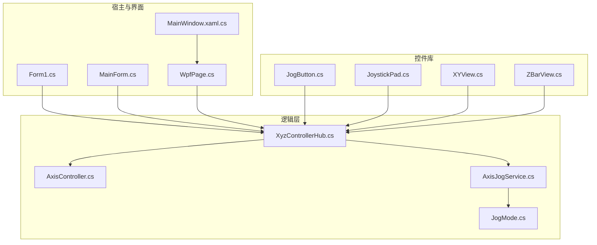
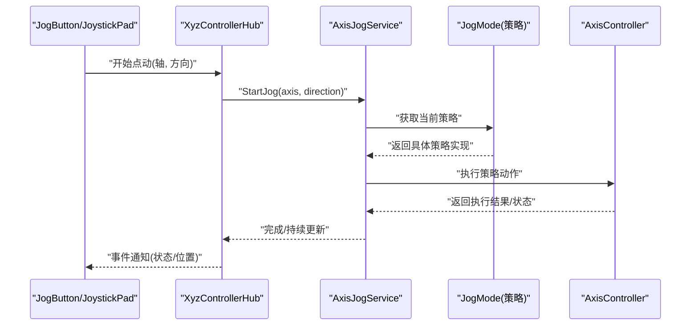
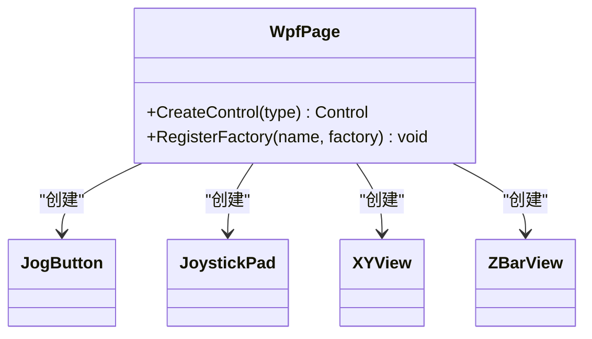
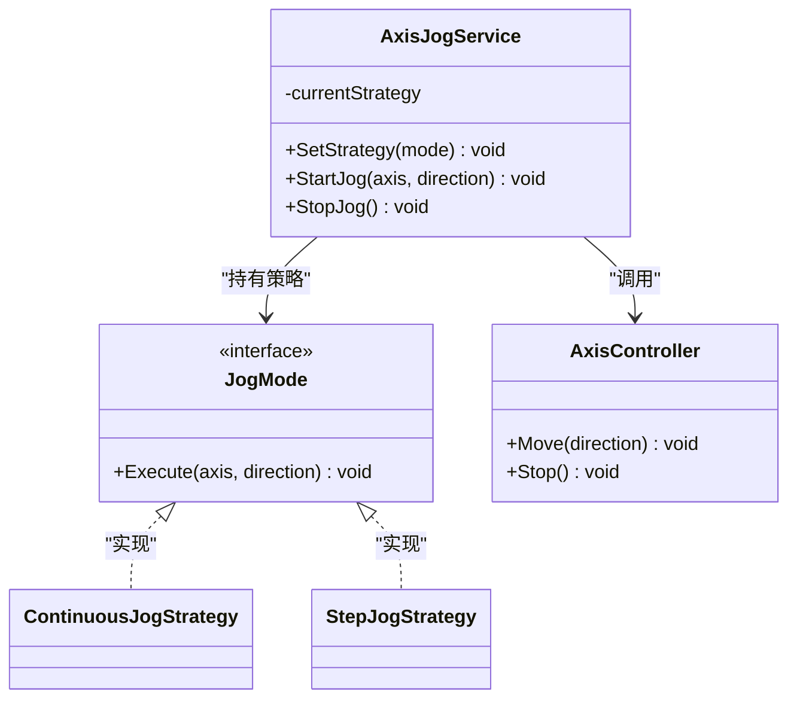
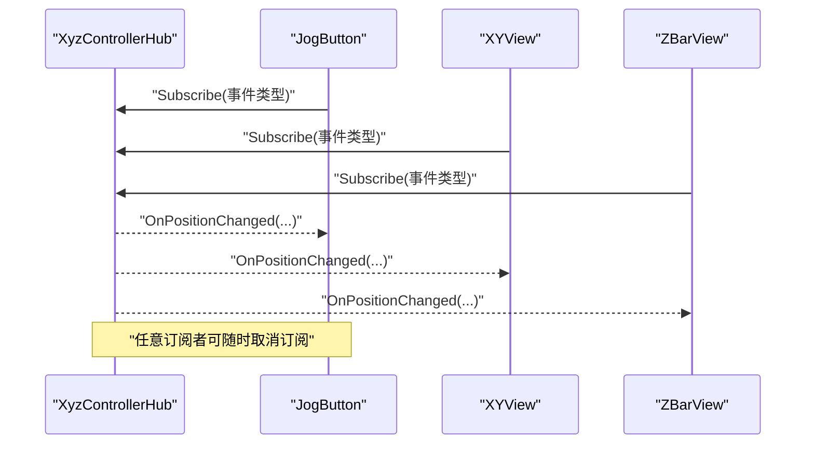
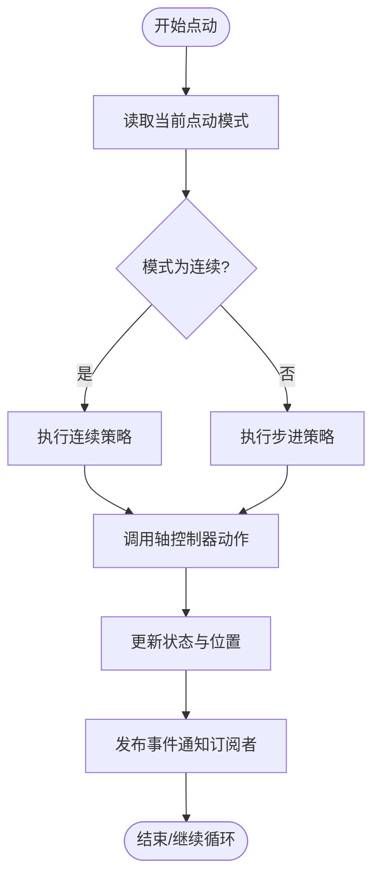
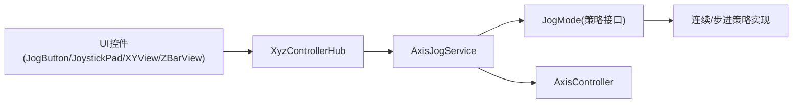

# 设计模式应用

<cite>
**本文引用的文件**   
- [src/XyzController/Logic/AxisJogService.cs](file://src/XyzController/Logic/AxisJogService.cs)
- [src/XyzController/Logic/JogMode.cs](file://src/XyzController/Logic/JogMode.cs)
- [src/XyzController/Logic/AxisController.cs](file://src/XyzController/Logic/AxisController.cs)
- [src/XyzController/Logic/XyzControllerHub.cs](file://src/XyzController/Logic/XyzControllerHub.cs)
- [src/XyzController.Controls/JogButton.cs](file://src/XyzController.Controls/JogButton.cs)
- [src/XyzController.Controls/JoystickPad.cs](file://src/XyzController.Controls/JoystickPad.cs)
- [src/XyzController.Controls/XYView.cs](file://src/XyzController.Controls/XYView.cs)
- [src/XyzController.Controls/ZBarView.cs](file://src/XyzController.Controls/ZBarView.cs)
- [src/XyzController/Form1.cs](file://src/XyzController/Form1.cs)
- [src/XyzController/MainForm.cs](file://src/XyzController/MainForm.cs)
- [src/XyzController.WpfHost/WpfPage.cs](file://src/XyzController.WpfHost/WpfPage.cs)
- [src/XyzController.WpfHost/MainWindow.xaml.cs](file://src/XyzController.WpfHost/MainWindow.xaml.cs)
</cite>

## 目录
1. [简介](#简介)
2. [项目结构](#项目结构)
3. [核心组件](#核心组件)
4. [架构总览](#架构总览)
5. [详细组件分析](#详细组件分析)
6. [依赖关系分析](#依赖关系分析)
7. [性能考量](#性能考量)
8. [故障排查指南](#故障排查指南)
9. [结论](#结论)
10. [附录](#附录)

## 简介
本文件聚焦于XyzController项目中设计模式的系统化应用与实现，重点覆盖：
- 工厂模式在控件实例化中的应用
- 策略模式在不同点动模式（连续/步进）中的实现
- 观察者模式在事件系统中的运用

文档将解释每种模式的适用场景、实现方式与收益，提供具体代码示例路径，并说明模式间的组合使用。同时给出权衡考虑与扩展性设计建议，帮助读者以可读性与可维护性为目标正确使用这些模式。

## 项目结构
项目采用分层与特性组织相结合的结构：
- 逻辑层：轴控制、点动服务、控制器集线器
- 控件库：自定义UI控件（按钮、摇杆、视图等）
- 宿主与界面：WinForms主程序与WPF宿主页
- 测试：针对核心逻辑的单元测试

图表来源
- [src/XyzController/Logic/AxisController.cs](file://src/XyzController/Logic/AxisController.cs)
- [src/XyzController/Logic/AxisJogService.cs](file://src/XyzController/Logic/AxisJogService.cs)
- [src/XyzController/Logic/JogMode.cs](file://src/XyzController/Logic/JogMode.cs)
- [src/XyzController/Logic/XyzControllerHub.cs](file://src/XyzController/Logic/XyzControllerHub.cs)
- [src/XyzController.Controls/JogButton.cs](file://src/XyzController.Controls/JogButton.cs)
- [src/XyzController.Controls/JoystickPad.cs](file://src/XyzController.Controls/JoystickPad.cs)
- [src/XyzController.Controls/XYView.cs](file://src/XyzController.Controls/XYView.cs)
- [src/XyzController.Controls/ZBarView.cs](file://src/XyzController.Controls/ZBarView.cs)
- [src/XyzController/Form1.cs](file://src/XyzController/Form1.cs)
- [src/XyzController/MainForm.cs](file://src/XyzController/MainForm.cs)
- [src/XyzController.WpfHost/WpfPage.cs](file://src/XyzController.WpfHost/WpfPage.cs)
- [src/XyzController.WpfHost/MainWindow.xaml.cs](file://src/XyzController.WpfHost/MainWindow.xaml.cs)

章节来源
- [src/XyzController/Logic/AxisController.cs](file://src/XyzController/Logic/AxisController.cs)
- [src/XyzController/Logic/AxisJogService.cs](file://src/XyzController/Logic/AxisJogService.cs)
- [src/XyzController/Logic/JogMode.cs](file://src/XyzController/Logic/JogMode.cs)
- [src/XyzController/Logic/XyzControllerHub.cs](file://src/XyzController/Logic/XyzControllerHub.cs)
- [src/XyzController.Controls/JogButton.cs](file://src/XyzController.Controls/JogButton.cs)
- [src/XyzController.Controls/JoystickPad.cs](file://src/XyzController.Controls/JoystickPad.cs)
- [src/XyzController.Controls/XYView.cs](file://src/XyzController.Controls/XYView.cs)
- [src/XyzController.Controls/ZBarView.cs](file://src/XyzController.Controls/ZBarView.cs)
- [src/XyzController/Form1.cs](file://src/XyzController/Form1.cs)
- [src/XyzController/MainForm.cs](file://src/XyzController/MainForm.cs)
- [src/XyzController.WpfHost/WpfPage.cs](file://src/XyzController.WpfHost/WpfPage.cs)
- [src/XyzController.WpfHost/MainWindow.xaml.cs](file://src/XyzController.WpfHost/MainWindow.xaml.cs)

## 核心组件
- 轴控制器：封装单轴运动能力与状态，作为策略执行的具体动作提供者。
- 点动服务：协调不同点动策略（连续/步进），对外暴露统一的点动接口。
- 点动模式：定义策略接口与具体策略类型，支持运行时切换。
- 控制器集线器：面向UI与外部模块的统一入口，聚合轴控制与点动服务，并提供事件通知。
- 自定义控件：按钮、摇杆、视图等通过集线器订阅事件或调用API，驱动控制流程。

章节来源
- [src/XyzController/Logic/AxisController.cs](file://src/XyzController/Logic/AxisController.cs)
- [src/XyzController/Logic/AxisJogService.cs](file://src/XyzController/Logic/AxisJogService.cs)
- [src/XyzController/Logic/JogMode.cs](file://src/XyzController/Logic/JogMode.cs)
- [src/XyzController/Logic/XyzControllerHub.cs](file://src/XyzController/Logic/XyzControllerHub.cs)

## 架构总览
整体采用“UI -> 集线器 -> 策略/控制器”的分层协作：
- UI控件通过集线器发起点动请求或订阅状态变化
- 集线器根据当前策略选择相应的点动算法
- 点动策略调用轴控制器执行底层动作
- 关键事件通过观察者机制广播给所有订阅者

图表来源
- [src/XyzController/Logic/XyzControllerHub.cs](file://src/XyzController/Logic/XyzControllerHub.cs)
- [src/XyzController/Logic/AxisJogService.cs](file://src/XyzController/Logic/AxisJogService.cs)
- [src/XyzController/Logic/JogMode.cs](file://src/XyzController/Logic/JogMode.cs)
- [src/XyzController/Logic/AxisController.cs](file://src/XyzController/Logic/AxisController.cs)
- [src/XyzController.Controls/JogButton.cs](file://src/XyzController.Controls/JogButton.cs)
- [src/XyzController.Controls/JoystickPad.cs](file://src/XyzController.Controls/JoystickPad.cs)

## 详细组件分析

### 工厂模式在控件实例化中的应用
- 适用场景
  - 需要集中管理控件创建逻辑，避免UI层散落大量new语句
  - 需要根据配置或上下文动态选择控件类型（如不同主题、不同行为）
- 实现方式
  - 在宿主或页面中引入工厂方法，按名称或枚举创建对应控件实例
  - 工厂内部负责初始化默认属性、绑定事件、注入依赖（如集线器引用）
- 带来的好处
  - 降低耦合：UI仅依赖工厂接口，不关心具体控件构造细节
  - 提升一致性：统一初始化流程，减少遗漏配置的风险
  - 便于替换与扩展：新增控件只需在工厂注册，无需改动调用方
- 示例路径
  - 工厂方法入口参考：[src/XyzController.WpfHost/WpfPage.cs](file://src/XyzController.WpfHost/WpfPage.cs)
  - 典型控件类参考：
    - [src/XyzController.Controls/JogButton.cs](file://src/XyzController.Controls/JogButton.cs)
    - [src/XyzController.Controls/JoystickPad.cs](file://src/XyzController.Controls/JoystickPad.cs)
    - [src/XyzController.Controls/XYView.cs](file://src/XyzController.Controls/XYView.cs)
    - [src/XyzController.Controls/ZBarView.cs](file://src/XyzController.Controls/ZBarView.cs)

图表来源
- [src/XyzController.WpfHost/WpfPage.cs](file://src/XyzController.WpfHost/WpfPage.cs)
- [src/XyzController.Controls/JogButton.cs](file://src/XyzController.Controls/JogButton.cs)
- [src/XyzController.Controls/JoystickPad.cs](file://src/XyzController.Controls/JoystickPad.cs)
- [src/XyzController.Controls/XYView.cs](file://src/XyzController.Controls/XYView.cs)
- [src/XyzController.Controls/ZBarView.cs](file://src/XyzController.Controls/ZBarView.cs)

章节来源
- [src/XyzController.WpfHost/WpfPage.cs](file://src/XyzController.WpfHost/WpfPage.cs)
- [src/XyzController.Controls/JogButton.cs](file://src/XyzController.Controls/JogButton.cs)
- [src/XyzController.Controls/JoystickPad.cs](file://src/XyzController.Controls/JoystickPad.cs)
- [src/XyzController.Controls/XYView.cs](file://src/XyzController.Controls/XYView.cs)
- [src/XyzController.Controls/ZBarView.cs](file://src/XyzController.Controls/ZBarView.cs)

### 策略模式在不同点动模式（连续/步进）中的实现
- 适用场景
  - 同一业务目标（点动）存在多种算法（连续移动、步进移动）
  - 需要在运行时动态切换算法，且保持调用方稳定
- 实现方式
  - 定义策略接口（例如包含执行点动动作的方法）
  - 为每种模式提供具体策略实现（连续/步进）
  - 点动服务持有策略引用，并在运行时根据配置或用户选择切换
- 带来的好处
  - 开闭原则：新增点动模式无需修改现有调用链
  - 单一职责：策略只关注算法本身，服务负责编排与生命周期
  - 可测试性：可对策略进行独立单元测试
- 示例路径
  - 策略接口与枚举：[src/XyzController/Logic/JogMode.cs](file://src/XyzController/Logic/JogMode.cs)
  - 策略编排服务：[src/XyzController/Logic/AxisJogService.cs](file://src/XyzController/Logic/AxisJogService.cs)
  - 策略执行目标（轴控制器）：[src/XyzController/Logic/AxisController.cs](file://src/XyzController/Logic/AxisController.cs)

图表来源
- [src/XyzController/Logic/AxisJogService.cs](file://src/XyzController/Logic/AxisJogService.cs)
- [src/XyzController/Logic/JogMode.cs](file://src/XyzController/Logic/JogMode.cs)
- [src/XyzController/Logic/AxisController.cs](file://src/XyzController/Logic/AxisController.cs)

章节来源
- [src/XyzController/Logic/AxisJogService.cs](file://src/XyzController/Logic/AxisJogService.cs)
- [src/XyzController/Logic/JogMode.cs](file://src/XyzController/Logic/JogMode.cs)
- [src/XyzController/Logic/AxisController.cs](file://src/XyzController/Logic/AxisController.cs)

### 观察者模式在事件系统中的运用
- 适用场景
  - 多个UI组件需要响应轴状态、位置、错误等变化
  - 解耦发布方与订阅方，避免硬编码依赖
- 实现方式
  - 集线器作为事件发布者，提供订阅/取消订阅方法
  - 各控件或页面作为订阅者，注册回调处理更新
  - 关键变更（如位置更新、点动状态）触发事件通知
- 带来的好处
  - 松耦合：新增订阅者不影响发布者
  - 可扩展：支持多订阅者并发接收消息
  - 易维护：事件契约清晰，便于定位问题
- 示例路径
  - 事件发布中心：[src/XyzController/Logic/XyzControllerHub.cs](file://src/XyzController/Logic/XyzControllerHub.cs)
  - 订阅者示例（UI控件）：
    - [src/XyzController.Controls/JogButton.cs](file://src/XyzController.Controls/JogButton.cs)
    - [src/XyzController.Controls/JoystickPad.cs](file://src/XyzController.Controls/JoystickPad.cs)
    - [src/XyzController.Controls/XYView.cs](file://src/XyzController.Controls/XYView.cs)
    - [src/XyzController.Controls/ZBarView.cs](file://src/XyzController.Controls/ZBarView.cs)
  - 宿主集成：
    - [src/XyzController.Form1.cs](file://src/XyzController/Form1.cs)
    - [src/XyzController.MainForm.cs](file://src/XyzController/MainForm.cs)
    - [src/XyzController.WpfHost/WpfPage.cs](file://src/XyzController.WpfHost/WpfPage.cs)
    - [src/XyzController.WpfHost/MainWindow.xaml.cs](file://src/XyzController.WpfHost/MainWindow.xaml.cs)

图表来源
- [src/XyzController/Logic/XyzControllerHub.cs](file://src/XyzController/Logic/XyzControllerHub.cs)
- [src/XyzController.Controls/JogButton.cs](file://src/XyzController.Controls/JogButton.cs)
- [src/XyzController.Controls/XYView.cs](file://src/XyzController.Controls/XYView.cs)
- [src/XyzController.Controls/ZBarView.cs](file://src/XyzController.Controls/ZBarView.cs)

章节来源
- [src/XyzController/Logic/XyzControllerHub.cs](file://src/XyzController/Logic/XyzControllerHub.cs)
- [src/XyzController.Controls/JogButton.cs](file://src/XyzController.Controls/JogButton.cs)
- [src/XyzController.Controls/JoystickPad.cs](file://src/XyzController.Controls/JoystickPad.cs)
- [src/XyzController.Controls/XYView.cs](file://src/XyzController.Controls/XYView.cs)
- [src/XyzController.Controls/ZBarView.cs](file://src/XyzController.Controls/ZBarView.cs)
- [src/XyzController/Form1.cs](file://src/XyzController/Form1.cs)
- [src/XyzController/MainForm.cs](file://src/XyzController/MainForm.cs)
- [src/XyzController.WpfHost/WpfPage.cs](file://src/XyzController.WpfHost/WpfPage.cs)
- [src/XyzController.WpfHost/MainWindow.xaml.cs](file://src/XyzController.WpfHost/MainWindow.xaml.cs)

### 复杂逻辑流程图：点动策略执行

图表来源
- [src/XyzController/Logic/AxisJogService.cs](file://src/XyzController/Logic/AxisJogService.cs)
- [src/XyzController/Logic/JogMode.cs](file://src/XyzController/Logic/JogMode.cs)
- [src/XyzController/Logic/AxisController.cs](file://src/XyzController/Logic/AxisController.cs)
- [src/XyzController/Logic/XyzControllerHub.cs](file://src/XyzController/Logic/XyzControllerHub.cs)

## 依赖关系分析
- 低耦合高内聚
  - UI控件仅依赖集线器接口，不直接依赖策略或轴控制器
  - 点动服务依赖策略接口，不感知具体实现
  - 集线器聚合服务与控制器，承担编排与事件分发职责
- 可能的循环依赖风险
  - 若控件反向依赖服务或控制器，需通过集线器解耦
  - 建议在宿主层装配依赖，避免在控件内部硬编码

图表来源
- [src/XyzController.Controls/JogButton.cs](file://src/XyzController.Controls/JogButton.cs)
- [src/XyzController.Controls/JoystickPad.cs](file://src/XyzController.Controls/JoystickPad.cs)
- [src/XyzController.Controls/XYView.cs](file://src/XyzController.Controls/XYView.cs)
- [src/XyzController.Controls/ZBarView.cs](file://src/XyzController.Controls/ZBarView.cs)
- [src/XyzController/Logic/XyzControllerHub.cs](file://src/XyzController/Logic/XyzControllerHub.cs)
- [src/XyzController/Logic/AxisJogService.cs](file://src/XyzController/Logic/AxisJogService.cs)
- [src/XyzController/Logic/JogMode.cs](file://src/XyzController/Logic/JogMode.cs)
- [src/XyzController/Logic/AxisController.cs](file://src/XyzController/Logic/AxisController.cs)

章节来源
- [src/XyzController/Logic/XyzControllerHub.cs](file://src/XyzController/Logic/XyzControllerHub.cs)
- [src/XyzController/Logic/AxisJogService.cs](file://src/XyzController/Logic/AxisJogService.cs)
- [src/XyzController/Logic/JogMode.cs](file://src/XyzController/Logic/JogMode.cs)
- [src/XyzController/Logic/AxisController.cs](file://src/XyzController/Logic/AxisController.cs)
- [src/XyzController.Controls/JogButton.cs](file://src/XyzController.Controls/JogButton.cs)
- [src/XyzController.Controls/JoystickPad.cs](file://src/XyzController.Controls/JoystickPad.cs)
- [src/XyzController.Controls/XYView.cs](file://src/XyzController.Controls/XYView.cs)
- [src/XyzController.Controls/ZBarView.cs](file://src/XyzController.Controls/ZBarView.cs)

## 性能考量
- 事件频率控制
  - 高频位置更新时，应在集线器侧做节流或合并，避免UI过载
- 策略切换开销
  - 策略对象应复用，避免频繁创建销毁
- 线程模型
  - 确保事件发布与UI更新在同一线程或使用合适的调度器
- 资源释放
  - 订阅者在卸载时及时取消订阅，防止内存泄漏

## 故障排查指南
- 常见问题
  - 事件未触发：检查订阅是否成功注册、事件名是否一致
  - 策略未生效：确认当前策略设置是否正确、是否存在竞态条件
  - 控件无响应：验证工厂创建的控件是否绑定了正确的事件与依赖
- 定位步骤
  - 在集线器处添加日志输出，观察事件发布与订阅情况
  - 在点动服务中记录策略选择与执行结果
  - 在轴控制器中记录动作执行与异常信息
- 修复建议
  - 明确事件契约，避免命名不一致
  - 对策略切换增加幂等保护
  - 在工厂中统一初始化顺序，减少遗漏

章节来源
- [src/XyzController/Logic/XyzControllerHub.cs](file://src/XyzController/Logic/XyzControllerHub.cs)
- [src/XyzController/Logic/AxisJogService.cs](file://src/XyzController/Logic/AxisJogService.cs)
- [src/XyzController/Logic/AxisController.cs](file://src/XyzController/Logic/AxisController.cs)
- [src/XyzController.WpfHost/WpfPage.cs](file://src/XyzController.WpfHost/WpfPage.cs)

## 结论
通过将工厂、策略与观察者模式有机结合，XyzController实现了：
- 清晰的职责划分与松耦合架构
- 灵活的点动算法扩展与运行时切换
- 稳定的事件驱动通信机制
- 良好的可测试性与可维护性

在实际开发中，建议遵循以下原则：
- 以接口为中心，避免在高层直接依赖具体实现
- 在工厂中集中管理创建与初始化，保证一致性
- 在策略中专注算法，在服务中编排生命周期
- 在事件系统中明确契约，做好订阅管理与异常隔离

## 附录
- 最佳实践清单
  - 工厂：注册表式创建，统一初始化，参数校验
  - 策略：接口抽象、具体实现单一职责、可插拔
  - 观察者：事件命名规范、订阅生命周期管理、防抖与限流
- 扩展性设计
  - 新增点动模式：实现策略接口并在服务中注册
  - 新增控件：在工厂注册，订阅必要事件
  - 新增事件：在集线器中定义并发布，通知相关订阅者