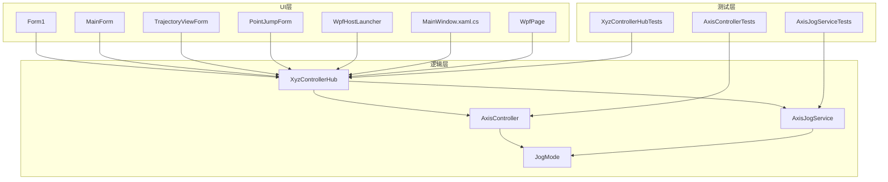
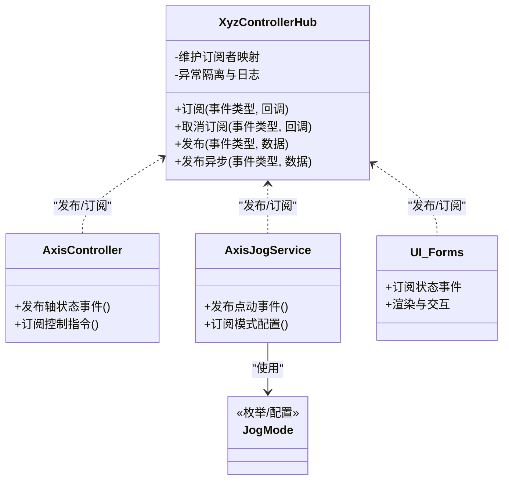
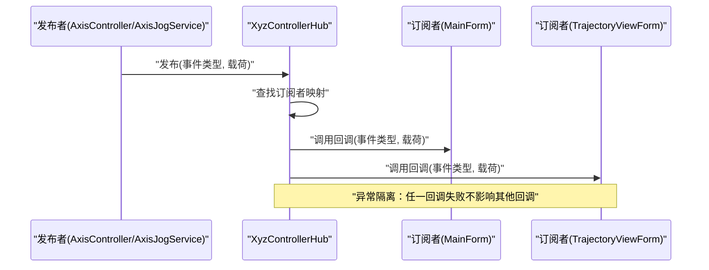
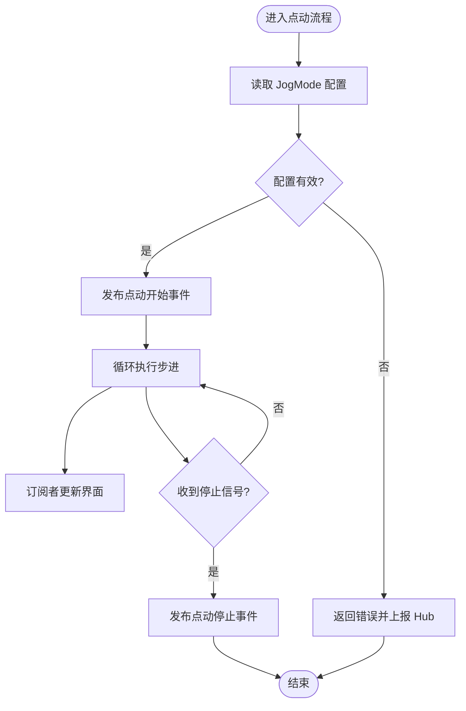
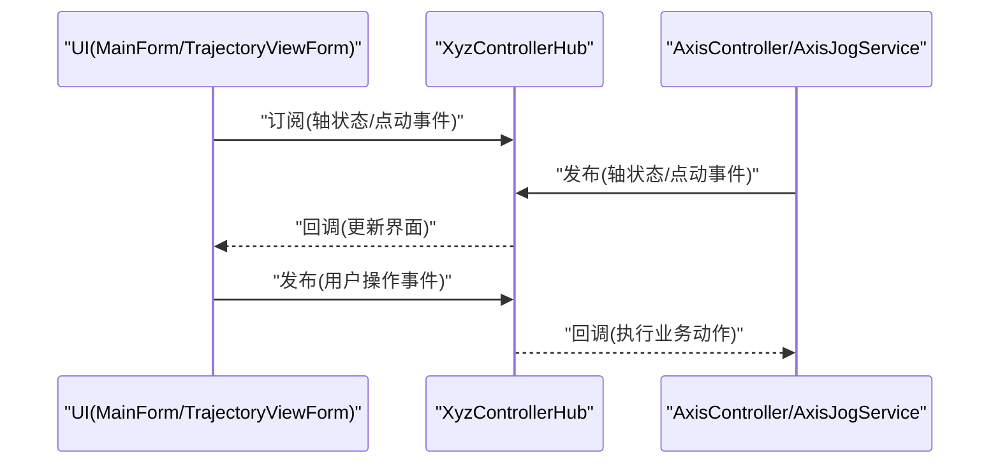
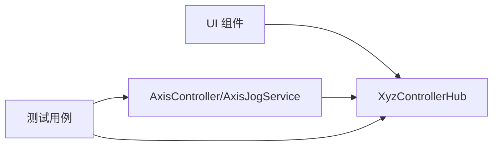

# 通信机制

<cite>
**本文引用的文件**   
- [XyzControllerHub.cs](file://src/XyzController/Logic/XyzControllerHub.cs)
- [AxisController.cs](file://src/XyzController/Logic/AxisController.cs)
- [AxisJogService.cs](file://src/XyzController/Logic/AxisJogService.cs)
- [JogMode.cs](file://src/XyzController/Logic/JogMode.cs)
- [Form1.cs](file://src/XyzController/Form1.cs)
- [MainForm.cs](file://src/XyzController/MainForm.cs)
- [TrajectoryViewForm.cs](file://src/XyzController/TrajectoryViewForm.cs)
- [PointJumpForm.cs](file://src/XyzController/PointJumpForm.cs)
- [Program.cs](file://src/XyzController/Program.cs)
- [WpfHostLauncher.cs](file://src/XyzController.WpfHost/WpfHostLauncher.cs)
- [MainWindow.xaml.cs](file://src/XyzController.WpfHost/MainWindow.xaml.cs)
- [WpfPage.cs](file://src/XyzController.WpfHost/WpfPage.cs)
- [XyzControllerHubTests.cs](file://src/XyzController.Tests/Tests/XyzControllerHubTests.cs)
- [AxisControllerTests.cs](file://src/XyzController.Tests/Tests/AxisControllerTests.cs)
- [AxisJogServiceTests.cs](file://src/XyzController.Tests/Tests/AxisJogServiceTests.cs)
- [组件通信机制.md](file://src/content/核心架构设计/组件通信机制.md)
</cite>

## 目录
1. [简介](#简介)
2. [项目结构](#项目结构)
3. [核心组件](#核心组件)
4. [架构总览](#架构总览)
5. [详细组件分析](#详细组件分析)
6. [依赖关系分析](#依赖关系分析)
7. [性能考虑](#性能考虑)
8. [故障排查指南](#故障排查指南)
9. [结论](#结论)
10. [附录](#附录)

## 简介
本文件围绕 XyzController 项目的“通信机制”进行系统化技术文档化，重点阐述以 XyzControllerHub 为核心的事件驱动与观察者模式实现。文档涵盖：
- 设计理念与解耦原则
- 事件类型、消息格式、订阅与发布机制
- 委托与异步处理
- 典型消息流转的流程图与时序图
- 错误处理、重试策略与性能优化建议

## 项目结构
本项目采用分层与按功能域组织相结合的结构：
- 逻辑层（Logic）：包含轴控制、点动服务以及作为通信中心的 Hub
- UI 层（Forms/WPF Host）：通过订阅 Hub 的事件来响应系统状态变化
- 测试层（Tests）：对 Hub 与各控制器进行行为验证
- 文档（content）：包含架构与设计说明

图表来源
- [XyzControllerHub.cs](file://src/XyzController/Logic/XyzControllerHub.cs)
- [AxisController.cs](file://src/XyzController/Logic/AxisController.cs)
- [AxisJogService.cs](file://src/XyzController/Logic/AxisJogService.cs)
- [JogMode.cs](file://src/XyzController/Logic/JogMode.cs)
- [Form1.cs](file://src/XyzController/Form1.cs)
- [MainForm.cs](file://src/XyzController/MainForm.cs)
- [TrajectoryViewForm.cs](file://src/XyzController/TrajectoryViewForm.cs)
- [PointJumpForm.cs](file://src/XyzController/PointJumpForm.cs)
- [WpfHostLauncher.cs](file://src/XyzController.WpfHost/WpfHostLauncher.cs)
- [MainWindow.xaml.cs](file://src/XyzController.WpfHost/MainWindow.xaml.cs)
- [WpfPage.cs](file://src/XyzController.WpfHost/WpfPage.cs)
- [XyzControllerHubTests.cs](file://src/XyzController.Tests/Tests/XyzControllerHubTests.cs)
- [AxisControllerTests.cs](file://src/XyzController.Tests/Tests/AxisControllerTests.cs)
- [AxisJogServiceTests.cs](file://src/XyzController.Tests/Tests/AxisJogServiceTests.cs)

章节来源
- [XyzControllerHub.cs](file://src/XyzController/Logic/XyzControllerHub.cs)
- [AxisController.cs](file://src/XyzController/Logic/AxisController.cs)
- [AxisJogService.cs](file://src/XyzController/Logic/AxisJogService.cs)
- [JogMode.cs](file://src/XyzController/Logic/JogMode.cs)
- [Form1.cs](file://src/XyzController/Form1.cs)
- [MainForm.cs](file://src/XyzController/MainForm.cs)
- [TrajectoryViewForm.cs](file://src/XyzController/TrajectoryViewForm.cs)
- [PointJumpForm.cs](file://src/XyzController/PointJumpForm.cs)
- [WpfHostLauncher.cs](file://src/XyzController.WpfHost/WpfHostLauncher.cs)
- [MainWindow.xaml.cs](file://src/XyzController.WpfHost/MainWindow.xaml.cs)
- [WpfPage.cs](file://src/XyzController.WpfHost/WpfPage.cs)
- [XyzControllerHubTests.cs](file://src/XyzController.Tests/Tests/XyzControllerHubTests.cs)
- [AxisControllerTests.cs](file://src/XyzController.Tests/Tests/AxisControllerTests.cs)
- [AxisJogServiceTests.cs](file://src/XyzController.Tests/Tests/AxisJogServiceTests.cs)

## 核心组件
- XyzControllerHub：作为系统内所有组件的通信中心，负责事件的定义、订阅注册、消息分发与生命周期管理。其职责包括：
  - 维护订阅者集合与事件路由表
  - 提供统一的发布接口，支持同步与异步派发
  - 保证线程安全与异常隔离，避免单个订阅者失败影响整体
- AxisController：轴控制业务实体，向 Hub 发布轴状态变更、运动完成等事件；同时可订阅来自其他组件的控制指令。
- AxisJogService：点动服务，封装 jog 操作的业务流程，通过 Hub 发布点动开始/停止/步进等事件，并订阅 JogMode 相关配置变更。
- JogMode：点动模式枚举或配置载体，用于描述不同点动策略（如速度、步长、加速度等）。
- UI 组件（Form1、MainForm、TrajectoryViewForm、PointJumpForm、WPF 宿主）：作为订阅者，监听 Hub 事件以更新界面或触发用户交互。

章节来源
- [XyzControllerHub.cs](file://src/XyzController/Logic/XyzControllerHub.cs)
- [AxisController.cs](file://src/XyzController/Logic/AxisController.cs)
- [AxisJogService.cs](file://src/XyzController/Logic/AxisJogService.cs)
- [JogMode.cs](file://src/XyzController/Logic/JogMode.cs)
- [Form1.cs](file://src/XyzController/Form1.cs)
- [MainForm.cs](file://src/XyzController/MainForm.cs)
- [TrajectoryViewForm.cs](file://src/XyzController/TrajectoryViewForm.cs)
- [PointJumpForm.cs](file://src/XyzController/PointJumpForm.cs)
- [WpfHostLauncher.cs](file://src/XyzController.WpfHost/WpfHostLauncher.cs)
- [MainWindow.xaml.cs](file://src/XyzController.WpfHost/MainWindow.xaml.cs)
- [WpfPage.cs](file://src/XyzController.WpfHost/WpfPage.cs)

## 架构总览
XyzControllerHub 采用事件驱动与观察者模式，将发布者与订阅者完全解耦。各组件仅依赖 Hub 提供的抽象接口，不直接相互引用，从而提升可测试性与可扩展性。

图表来源
- [XyzControllerHub.cs](file://src/XyzController/Logic/XyzControllerHub.cs)
- [AxisController.cs](file://src/XyzController/Logic/AxisController.cs)
- [AxisJogService.cs](file://src/XyzController/Logic/AxisJogService.cs)
- [JogMode.cs](file://src/XyzController/Logic/JogMode.cs)
- [Form1.cs](file://src/XyzController/Form1.cs)
- [MainForm.cs](file://src/XyzController/MainForm.cs)
- [TrajectoryViewForm.cs](file://src/XyzController/TrajectoryViewForm.cs)
- [PointJumpForm.cs](file://src/XyzController/PointJumpForm.cs)
- [WpfHostLauncher.cs](file://src/XyzController.WpfHost/WpfHostLauncher.cs)
- [MainWindow.xaml.cs](file://src/XyzController.WpfHost/MainWindow.xaml.cs)
- [WpfPage.cs](file://src/XyzController.WpfHost/WpfPage.cs)

## 详细组件分析

### XyzControllerHub 设计与实现要点
- 事件驱动架构
  - 事件类型：为每类领域事件定义唯一标识（如轴状态、点动控制、轨迹更新、错误告警等），便于路由与过滤。
  - 消息格式：每个事件携带结构化数据载荷（例如轴号、位置、速度、目标、时间戳、错误码等），确保订阅者可无歧义解析。
  - 订阅与发布：提供统一注册与注销接口，支持一次性订阅与长期订阅；发布时按事件类型路由到对应回调集合。
- 观察者模式运用
  - 订阅者集合：内部维护事件类型到回调列表的映射，支持并发访问保护。
  - 回调执行：同步遍历执行回调；可选异步派发以避免阻塞发布者。
  - 异常隔离：单个订阅者抛错不影响其他订阅者，记录错误上下文以便诊断。
- 委托与异步处理
  - 委托签名：定义标准回调签名，统一参数约定（事件类型、载荷、上下文）。
  - 异步派发：在需要非阻塞场景下，使用任务队列或线程池执行回调，避免 UI 线程阻塞。
- 生命周期与资源清理
  - 订阅注销：组件销毁时主动取消订阅，防止内存泄漏。
  - Hub 关闭：释放内部资源，停止后台任务。

图表来源
- [XyzControllerHub.cs](file://src/XyzController/Logic/XyzControllerHub.cs)
- [AxisController.cs](file://src/XyzController/Logic/AxisController.cs)
- [AxisJogService.cs](file://src/XyzController/Logic/AxisJogService.cs)
- [MainForm.cs](file://src/XyzController/MainForm.cs)
- [TrajectoryViewForm.cs](file://src/XyzController/TrajectoryViewForm.cs)

章节来源
- [XyzControllerHub.cs](file://src/XyzController/Logic/XyzControllerHub.cs)
- [XyzControllerHubTests.cs](file://src/XyzController.Tests/Tests/XyzControllerHubTests.cs)

### AxisController 与 AxisJogService 的通信参与
- AxisController
  - 发布事件：轴状态变更、运动完成、错误告警等。
  - 订阅事件：外部控制指令（如启动、停止、复位）、模式切换。
- AxisJogService
  - 发布事件：点动开始、步进、停止、模式切换结果。
  - 订阅事件：JogMode 配置变更、全局暂停/恢复。
- JogMode
  - 作为配置载体，被 Hub 广播给所有订阅者，确保 UI 与服务端一致。

图表来源
- [AxisJogService.cs](file://src/XyzController/Logic/AxisJogService.cs)
- [JogMode.cs](file://src/XyzController/Logic/JogMode.cs)
- [XyzControllerHub.cs](file://src/XyzController/Logic/XyzControllerHub.cs)

章节来源
- [AxisController.cs](file://src/XyzController/Logic/AxisController.cs)
- [AxisJogService.cs](file://src/XyzController/Logic/AxisJogService.cs)
- [JogMode.cs](file://src/XyzController/Logic/JogMode.cs)
- [AxisJogServiceTests.cs](file://src/XyzController.Tests/Tests/AxisJogServiceTests.cs)

### UI 组件的订阅与渲染
- MainForm、Form1、TrajectoryViewForm、PointJumpForm 等作为订阅者：
  - 订阅轴状态与点动事件，更新控件显示（如坐标、进度条、轨迹曲线）。
  - 通过 Hub 发布用户操作（如点击按钮、输入数值），由后端控制器消费。
- WPF 宿主（WpfHostLauncher、MainWindow.xaml.cs、WpfPage）：
  - 在 WPF 环境中同样遵循订阅-发布模型，保持 WinForms 与 WPF 一致的通信语义。

图表来源
- [MainForm.cs](file://src/XyzController/MainForm.cs)
- [TrajectoryViewForm.cs](file://src/XyzController/TrajectoryViewForm.cs)
- [PointJumpForm.cs](file://src/XyzController/PointJumpForm.cs)
- [WpfHostLauncher.cs](file://src/XyzController.WpfHost/WpfHostLauncher.cs)
- [MainWindow.xaml.cs](file://src/XyzController.WpfHost/MainWindow.xaml.cs)
- [WpfPage.cs](file://src/XyzController.WpfHost/WpfPage.cs)
- [XyzControllerHub.cs](file://src/XyzController/Logic/XyzControllerHub.cs)

章节来源
- [Form1.cs](file://src/XyzController/Form1.cs)
- [MainForm.cs](file://src/XyzController/MainForm.cs)
- [TrajectoryViewForm.cs](file://src/XyzController/TrajectoryViewForm.cs)
- [PointJumpForm.cs](file://src/XyzController/PointJumpForm.cs)
- [WpfHostLauncher.cs](file://src/XyzController.WpfHost/WpfHostLauncher.cs)
- [MainWindow.xaml.cs](file://src/XyzController.WpfHost/MainWindow.xaml.cs)
- [WpfPage.cs](file://src/XyzController.WpfHost/WpfPage.cs)

## 依赖关系分析
- 松耦合原则
  - 组件间不直接互相引用，仅依赖 Hub 的抽象接口，降低耦合度。
  - 通过事件类型与消息载荷进行契约约定，便于替换实现与扩展新事件。
- 依赖方向
  - UI 依赖 Hub 与业务控制器（通过事件）
  - 业务控制器依赖 Hub（发布/订阅）
  - 测试依赖具体实现（断言行为）

图表来源
- [XyzControllerHub.cs](file://src/XyzController/Logic/XyzControllerHub.cs)
- [AxisController.cs](file://src/XyzController/Logic/AxisController.cs)
- [AxisJogService.cs](file://src/XyzController/Logic/AxisJogService.cs)
- [XyzControllerHubTests.cs](file://src/XyzController.Tests/Tests/XyzControllerHubTests.cs)
- [AxisControllerTests.cs](file://src/XyzController.Tests/Tests/AxisControllerTests.cs)
- [AxisJogServiceTests.cs](file://src/XyzController.Tests/Tests/AxisJogServiceTests.cs)

章节来源
- [XyzControllerHub.cs](file://src/XyzController/Logic/XyzControllerHub.cs)
- [AxisController.cs](file://src/XyzController/Logic/AxisController.cs)
- [AxisJogService.cs](file://src/XyzController/Logic/AxisJogService.cs)
- [XyzControllerHubTests.cs](file://src/XyzController.Tests/Tests/XyzControllerHubTests.cs)
- [AxisControllerTests.cs](file://src/XyzController.Tests/Tests/AxisControllerTests.cs)
- [AxisJogServiceTests.cs](file://src/XyzController.Tests/Tests/AxisJogServiceTests.cs)

## 性能考虑
- 事件派发效率
  - 批量发布：合并高频小事件，减少回调次数。
  - 异步派发：对耗时回调使用异步执行，避免阻塞发布者与 UI 线程。
- 订阅者数量控制
  - 动态注册/注销：仅在需要时订阅，避免不必要的回调开销。
  - 去重订阅：同一回调多次注册需去重，防止重复执行。
- 内存与对象分配
  - 复用消息载荷对象：在高吞吐场景下减少 GC 压力。
  - 避免在回调中创建大对象，必要时延迟加载。
- 线程安全
  - 使用锁或并发容器保护订阅者集合。
  - 跨线程回调注意 UI 线程调度（WinForms/WPF 的调度器）。

[本节为通用性能指导，不直接分析具体文件]

## 故障排查指南
- 常见问题定位
  - 事件未触发：检查订阅是否成功注册、事件类型是否匹配、订阅是否在正确生命周期内。
  - 回调异常：查看 Hub 的异常隔离日志，确认具体订阅者与事件载荷。
  - UI 不更新：确认回调是否在主线程执行，必要时使用调度器切换到 UI 线程。
- 重试与恢复
  - 幂等性：确保订阅回调具备幂等特性，支持重试。
  - 退避策略：对网络或硬件相关事件，采用指数退避重试。
  - 降级模式：关键路径失败时回退到安全状态并发布告警事件。
- 调试技巧
  - 启用 Hub 的调试输出，记录事件路由与回调执行时序。
  - 使用单元测试复现问题，聚焦单一事件流。

章节来源
- [XyzControllerHub.cs](file://src/XyzController/Logic/XyzControllerHub.cs)
- [XyzControllerHubTests.cs](file://src/XyzController.Tests/Tests/XyzControllerHubTests.cs)

## 结论
XyzControllerHub 作为通信中心，通过事件驱动与观察者模式实现了组件间的松耦合通信。统一的订阅/发布接口、标准化的消息格式、异常隔离与异步处理能力，使得系统具备良好的可扩展性与可维护性。配合合理的性能优化与故障排查策略，可在复杂工业控制场景中稳定运行。

[本节为总结性内容，不直接分析具体文件]

## 附录
- 事件类型建议清单（示例）
  - 轴状态：位置、速度、误差、报警码
  - 点动控制：开始、步进、停止、模式切换
  - 轨迹更新：路径点、插补进度
  - 系统告警：错误码、严重级别、上下文信息
- 消息载荷字段建议
  - 事件类型、时间戳、源组件、目标组件（可选）、载荷数据、版本标识
- 参考文档
  - [组件通信机制.md](file://src/content/核心架构设计/组件通信机制.md)

章节来源
- [组件通信机制.md](file://src/content/核心架构设计/组件通信机制.md)