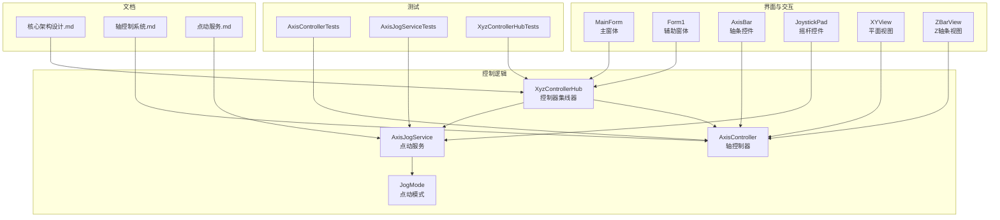
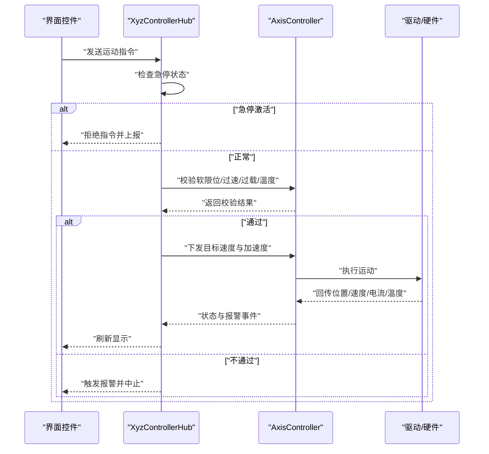
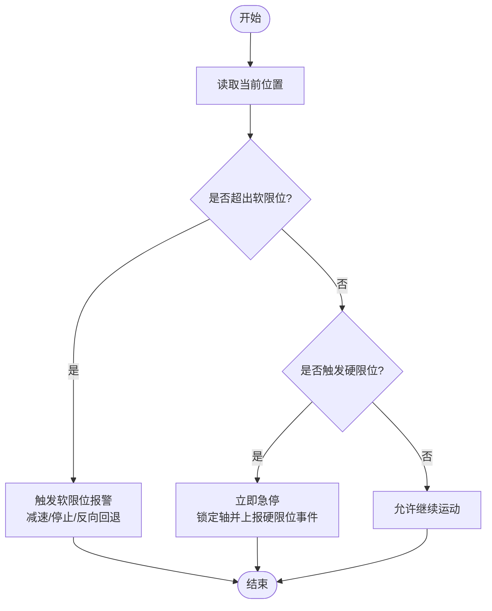
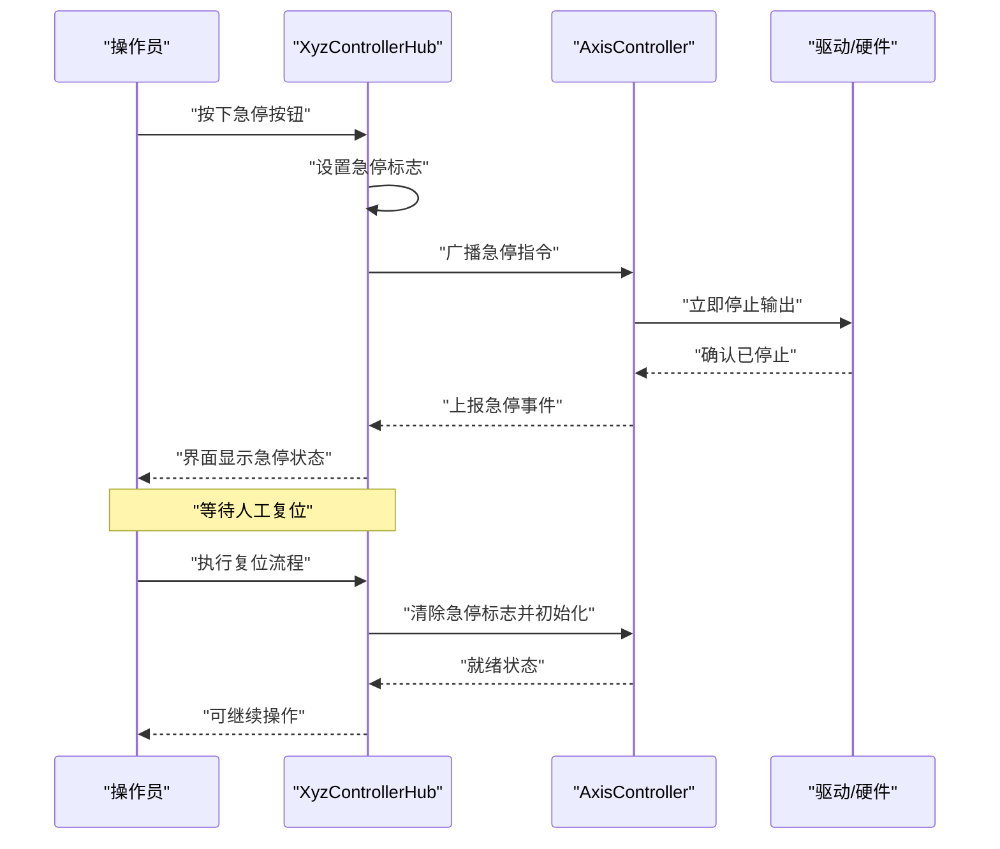
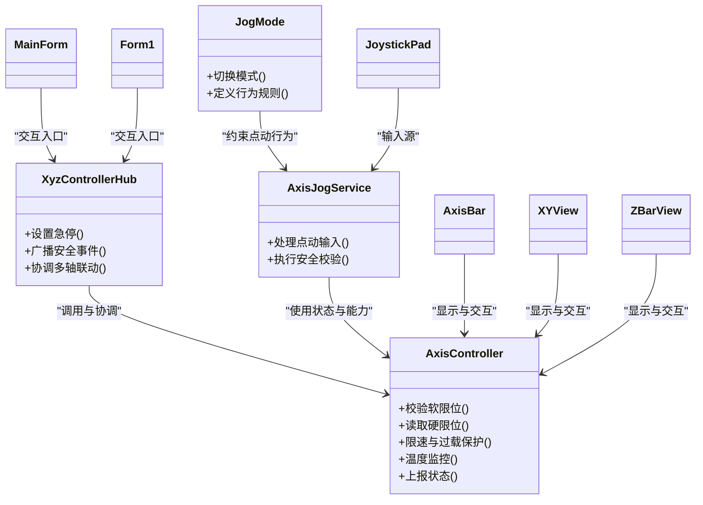

# 安全机制

<cite>
**本文引用的文件**   
- [AxisController.cs](file://src/XyzController/Logic/AxisController.cs)
- [XyzControllerHub.cs](file://src/XyzController/Logic/XyzControllerHub.cs)
- [AxisJogService.cs](file://src/XyzController/Logic/AxisJogService.cs)
- [JogMode.cs](file://src/XyzController/Logic/JogMode.cs)
- [Form1.cs](file://src/XyzController/Form1.cs)
- [MainForm.cs](file://src/XyzController/MainForm.cs)
- [Program.cs](file://src/XyzController/Program.cs)
- [AxisBar.cs](file://src/XyzController.Controls/AxisBar.cs)
- [JoystickPad.cs](file://src/XyzController.Controls/JoystickPad.cs)
- [XYView.cs](file://src/XyzController.Controls/XYView.cs)
- [ZBarView.cs](file://src/XyzController.Controls/ZBarView.cs)
- [AxisControllerTests.cs](file://src/XyzController.Tests/Tests/AxisControllerTests.cs)
- [AxisJogServiceTests.cs](file://src/XyzController.Tests/Tests/AxisJogServiceTests.cs)
- [XyzControllerHubTests.cs](file://src/XyzController.Tests/Tests/XyzControllerHubTests.cs)
- [核心架构设计.md](file://src/content/核心架构设计/核心架构设计.md)
- [轴控制系统.md](file://src/content/核心架构设计/轴控制系统.md)
- [点动服务.md](file://src/content/核心架构设计/点动服务.md)
</cite>

## 目录
1. [引言](#引言)
2. [项目结构](#项目结构)
3. [核心组件](#核心组件)
4. [架构总览](#架构总览)
5. [详细组件分析](#详细组件分析)
6. [依赖关系分析](#依赖关系分析)
7. [性能与安全特性](#性能与安全特性)
8. [故障排查指南](#故障排查指南)
9. [结论](#结论)
10. [附录：配置与测试示例](#附录配置与测试示例)

## 引言
本技术文档聚焦于XYZ轴控制系统的安全机制，覆盖限位保护（软限位与硬限位）、紧急停止的优先级与状态恢复、过速保护、过载检测、温度监控等关键安全策略。文档同时提供参数配置示例、事件处理流程、测试方法与验证步骤，以及最佳实践与故障恢复指南，帮助读者快速理解并正确部署安全功能。

## 项目结构
本项目采用分层组织方式：
- 控制逻辑层：包含轴控制器、点动服务、控制器集线器等核心类
- 控件库：提供可视化与交互控件，用于显示限位状态、报警与操作输入
- 测试工程：针对控制器与服务进行单元测试
- 文档资料：核心架构设计与各子系统说明

图表来源
- [AxisController.cs](file://src/XyzController/Logic/AxisController.cs)
- [XyzControllerHub.cs](file://src/XyzController/Logic/XyzControllerHub.cs)
- [AxisJogService.cs](file://src/XyzController/Logic/AxisJogService.cs)
- [JogMode.cs](file://src/XyzController/Logic/JogMode.cs)
- [MainForm.cs](file://src/XyzController/MainForm.cs)
- [Form1.cs](file://src/XyzController/Form1.cs)
- [AxisBar.cs](file://src/XyzController.Controls/AxisBar.cs)
- [JoystickPad.cs](file://src/XyzController.Controls/JoystickPad.cs)
- [XYView.cs](file://src/XyzController.Controls/XYView.cs)
- [ZBarView.cs](file://src/XyzController.Controls/ZBarView.cs)
- [AxisControllerTests.cs](file://src/XyzController.Tests/Tests/AxisControllerTests.cs)
- [AxisJogServiceTests.cs](file://src/XyzController.Tests/Tests/AxisJogServiceTests.cs)
- [XyzControllerHubTests.cs](file://src/XyzController.Tests/Tests/XyzControllerHubTests.cs)
- [核心架构设计.md](file://src/content/核心架构设计/核心架构设计.md)
- [轴控制系统.md](file://src/content/核心架构设计/轴控制系统.md)
- [点动服务.md](file://src/content/核心架构设计/点动服务.md)

章节来源
- [核心架构设计.md](file://src/content/核心架构设计/核心架构设计.md)
- [轴控制系统.md](file://src/content/核心架构设计/轴控制系统.md)
- [点动服务.md](file://src/content/核心架构设计/点动服务.md)

## 核心组件
- 轴控制器（AxisController）：负责单轴运动控制、限位判断、速度/加速度限制、报警与状态上报
- 控制器集线器（XyzControllerHub）：协调多轴联动、统一安全策略、事件分发与全局紧急停止
- 点动服务（AxisJogService）：管理点动模式与输入源（摇杆/按键），在点动过程中执行安全校验
- 点动模式（JogMode）：定义点动行为与切换规则
- 界面控件（AxisBar、XYView、ZBarView、JoystickPad）：展示限位状态、报警信息与用户输入

章节来源
- [AxisController.cs](file://src/XyzController/Logic/AxisController.cs)
- [XyzControllerHub.cs](file://src/XyzController/Logic/XyzControllerHub.cs)
- [AxisJogService.cs](file://src/XyzController/Logic/AxisJogService.cs)
- [JogMode.cs](file://src/XyzController/Logic/JogMode.cs)
- [AxisBar.cs](file://src/XyzController.Controls/AxisBar.cs)
- [XYView.cs](file://src/XyzController.Controls/XYView.cs)
- [ZBarView.cs](file://src/XyzController.Controls/ZBarView.cs)
- [JoystickPad.cs](file://src/XyzController.Controls/JoystickPad.cs)

## 架构总览
安全机制贯穿“输入—调度—执行—反馈”全链路：
- 输入层：用户通过界面控件或外部设备发出指令
- 调度层：集线器对指令进行安全前置校验（急停、限位、过速、过载、温度）
- 执行层：轴控制器根据安全策略下发运动命令
- 反馈层：实时采集位置、速度、电流、温度等信息，触发报警与状态更新

图表来源
- [XyzControllerHub.cs](file://src/XyzController/Logic/XyzControllerHub.cs)
- [AxisController.cs](file://src/XyzController/Logic/AxisController.cs)

## 详细组件分析

### 限位保护系统（软限位与硬限位）
- 软限位
  - 原理：基于当前坐标与配置的行程上限/下限进行边界判断；当接近极限时降低速度或禁止继续同向移动
  - 实现要点：在每次运动前与运行中周期性校验；支持不同方向独立阈值；与点动服务联动，防止越界
  - 响应：触发软限位报警、减速至零、反向回退或保持静止，直至人工复位
- 硬限位
  - 原理：读取硬件限位开关信号，作为最高优先级的物理保护
  - 实现要点：中断或高频轮询读取；一旦检测到硬限位立即切断输出并进入安全状态
  - 响应：立即急停、锁定轴、上报硬限位事件，需手动复位后方可恢复

图表来源
- [AxisController.cs](file://src/XyzController/Logic/AxisController.cs)
- [AxisJogService.cs](file://src/XyzController/Logic/AxisJogService.cs)

章节来源
- [AxisController.cs](file://src/XyzController/Logic/AxisController.cs)
- [AxisJogService.cs](file://src/XyzController/Logic/AxisJogService.cs)

### 紧急停止（E-Stop）优先级与状态恢复
- 优先级
  - 硬限位 > 急停 > 软限位 > 过速/过载/温度报警
  - 急停为全局最高优先级之一，任何运动指令均被立即阻断
- 处理流程
  - 接收急停信号后，立即停止所有轴、屏蔽后续指令、记录事件日志
  - 进入锁定状态，仅允许通过明确的人工复位流程解除
- 状态恢复
  - 确认现场安全后，先复位硬限位与急停硬件
  - 在软件侧执行复位序列：清除报警、重新建立参考位、逐步恢复点动与自动模式

图表来源
- [XyzControllerHub.cs](file://src/XyzController/Logic/XyzControllerHub.cs)
- [AxisController.cs](file://src/XyzController/Logic/AxisController.cs)

章节来源
- [XyzControllerHub.cs](file://src/XyzController/Logic/XyzControllerHub.cs)
- [AxisController.cs](file://src/XyzController/Logic/AxisController.cs)

### 过速保护
- 原理：比较实际速度与设定最大速度阈值，超限时采取降速或停止
- 实现要点：在速度环反馈路径中进行阈值比较；支持瞬时峰值与持续超速的不同策略
- 响应：触发过速报警、降低目标速度或立即停止，必要时回退到安全速度曲线

章节来源
- [AxisController.cs](file://src/XyzController/Logic/AxisController.cs)

### 过载检测
- 原理：监测电机电流或扭矩估算值，超过负载阈值即判定为过载
- 实现要点：支持短时过载容忍与长时间过载保护；结合温度信息进行综合判断
- 响应：触发过载报警、降低功率或停机，避免机械损坏

章节来源
- [AxisController.cs](file://src/XyzController/Logic/AxisController.cs)

### 温度监控
- 原理：读取驱动器或电机温度传感器，超过安全阈值触发保护
- 实现要点：温度采样周期与滤波策略；与过载检测联动，避免热累积
- 响应：温度过高时降额运行或停机，待冷却后恢复

章节来源
- [AxisController.cs](file://src/XyzController/Logic/AxisController.cs)

### 点动服务中的安全校验
- 在点动模式下，每次输入变化都需经过软限位、急停、过速、过载、温度等安全检查
- 若任一条件不满足，则拒绝点动指令并提示用户

章节来源
- [AxisJogService.cs](file://src/XyzController/Logic/AxisJogService.cs)
- [JogMode.cs](file://src/XyzController/Logic/JogMode.cs)

## 依赖关系分析
- 集线器对轴控制器具有强依赖，负责统一安全策略与事件分发
- 点动服务依赖轴控制器提供的状态与能力接口
- 界面控件依赖控制器暴露的状态与事件以进行显示与交互
- 测试工程直接依赖控制器与服务以实现隔离测试

图表来源
- [XyzControllerHub.cs](file://src/XyzController/Logic/XyzControllerHub.cs)
- [AxisController.cs](file://src/XyzController/Logic/AxisController.cs)
- [AxisJogService.cs](file://src/XyzController/Logic/AxisJogService.cs)
- [JogMode.cs](file://src/XyzController/Logic/JogMode.cs)
- [MainForm.cs](file://src/XyzController/MainForm.cs)
- [Form1.cs](file://src/XyzController/Form1.cs)
- [AxisBar.cs](file://src/XyzController.Controls/AxisBar.cs)
- [XYView.cs](file://src/XyzController.Controls/XYView.cs)
- [ZBarView.cs](file://src/XyzController.Controls/ZBarView.cs)
- [JoystickPad.cs](file://src/XyzController.Controls/JoystickPad.cs)

章节来源
- [XyzControllerHub.cs](file://src/XyzController/Logic/XyzControllerHub.cs)
- [AxisController.cs](file://src/XyzController/Logic/AxisController.cs)
- [AxisJogService.cs](file://src/XyzController/Logic/AxisJogService.cs)
- [JogMode.cs](file://src/XyzController/Logic/JogMode.cs)
- [MainForm.cs](file://src/XyzController/MainForm.cs)
- [Form1.cs](file://src/XyzController/Form1.cs)
- [AxisBar.cs](file://src/XyzController.Controls/AxisBar.cs)
- [XYView.cs](file://src/XyzController.Controls/XYView.cs)
- [ZBarView.cs](file://src/XyzController.Controls/ZBarView.cs)
- [JoystickPad.cs](file://src/XyzController.Controls/JoystickPad.cs)

## 性能与安全特性
- 安全校验应在高频循环中执行，但需避免阻塞主线程；建议采用异步或定时器机制
- 阈值与延时参数应可调，便于在不同工况下平衡安全性与效率
- 事件上报与日志记录应避免频繁I/O，采用批处理或缓冲策略
- 界面刷新频率与状态同步需与底层采样周期匹配，减少抖动与误报

[本节为通用指导，无需具体文件引用]

## 故障排查指南
- 常见现象
  - 软限位频繁触发：检查行程配置与实际零点偏移
  - 急停无法复位：确认硬件复位顺序与软件复位流程
  - 过速/过载报警：核查负载、加减速曲线与速度阈值
  - 温度过高：检查散热与环境温度，调整降额策略
- 定位方法
  - 查看报警事件与日志，确认触发顺序与时间戳
  - 使用测试用例模拟异常场景，验证保护逻辑
  - 分模块隔离问题：先断言控制器内部逻辑，再联调集线器与界面

章节来源
- [AxisControllerTests.cs](file://src/XyzController.Tests/Tests/AxisControllerTests.cs)
- [AxisJogServiceTests.cs](file://src/XyzController.Tests/Tests/AxisJogServiceTests.cs)
- [XyzControllerHubTests.cs](file://src/XyzController.Tests/Tests/XyzControllerHubTests.cs)

## 结论
XYZ轴控制系统的安全机制以“硬限位与急停为最高优先级、软限位与多项传感器保护为日常防护”为核心原则，通过集线器统一调度与控制器精细执行，形成闭环的安全保障体系。合理配置阈值与恢复流程、完善测试与日志，是确保系统稳定运行的关键。

[本节为总结性内容，无需具体文件引用]

## 附录：配置与测试示例

### 安全参数配置示例
- 软限位
  - 正负方向上限/下限：分别设置最小与最大坐标
  - 接近阈值：到达该范围时触发减速或禁止继续同向移动
- 急停
  - 全局急停标志：启用/禁用
  - 复位策略：硬件复位后需软件二次确认
- 过速保护
  - 最大速度阈值：单位与换算规则
  - 瞬时峰值容忍：允许的短时超限时间与幅度
- 过载检测
  - 电流/扭矩阈值：连续与短时不同阈值
  - 与温度联动：高温时降低过载阈值
- 温度监控
  - 采样周期与滤波系数
  - 降额与停机阈值

章节来源
- [AxisController.cs](file://src/XyzController/Logic/AxisController.cs)
- [XyzControllerHub.cs](file://src/XyzController/Logic/XyzControllerHub.cs)

### 安全事件处理流程
- 事件类型：软限位、硬限位、急停、过速、过载、温度
- 处理动作：报警、降额、停止、锁定、复位
- 通知机制：界面显示、日志记录、回调订阅

章节来源
- [XyzControllerHub.cs](file://src/XyzController/Logic/XyzControllerHub.cs)
- [AxisController.cs](file://src/XyzController/Logic/AxisController.cs)

### 测试方法与验证流程
- 单元测试
  - 轴控制器：模拟位置/速度/电流/温度输入，断言报警与停止行为
  - 点动服务：模拟输入变化，断言安全校验与指令拒绝
  - 集线器：广播急停与复位，断言全局状态一致
- 集成测试
  - 端到端流程：从界面输入到硬件执行的完整链路
  - 异常注入：随机超时、数据异常、通信失败，验证鲁棒性

章节来源
- [AxisControllerTests.cs](file://src/XyzController.Tests/Tests/AxisControllerTests.cs)
- [AxisJogServiceTests.cs](file://src/XyzController.Tests/Tests/AxisJogServiceTests.cs)
- [XyzControllerHubTests.cs](file://src/XyzController.Tests/Tests/XyzControllerHubTests.cs)

### 最佳实践与故障恢复指南
- 最佳实践
  - 将急停与硬限位置于最高优先级，确保不可绕过
  - 参数分级管理：默认保守值，上线前按工况调优
  - 事件与日志结构化，便于追溯与分析
- 故障恢复
  - 先硬件后软件：先复位硬件限位与急停，再进行软件复位
  - 逐步恢复：先点动再自动，先低速再额定
  - 复测验证：恢复后执行回归测试，确认无隐患

章节来源
- [MainForm.cs](file://src/XyzController/MainForm.cs)
- [Form1.cs](file://src/XyzController/Form1.cs)
- [Program.cs](file://src/XyzController/Program.cs)