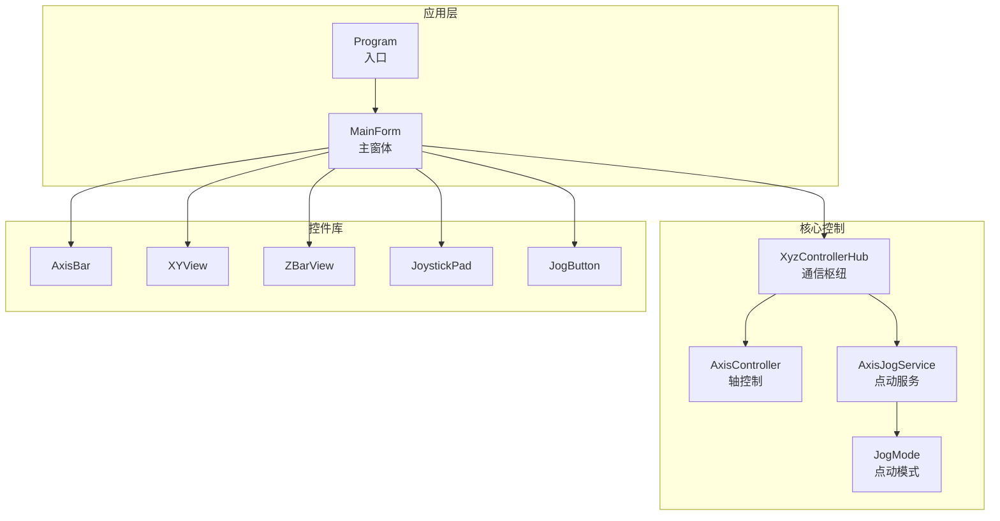
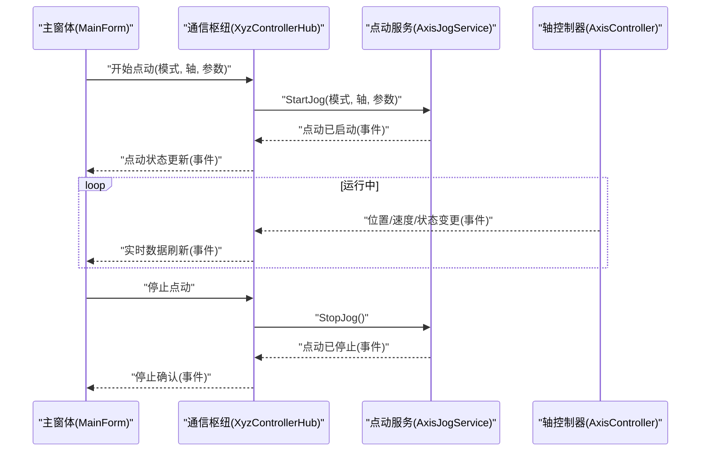
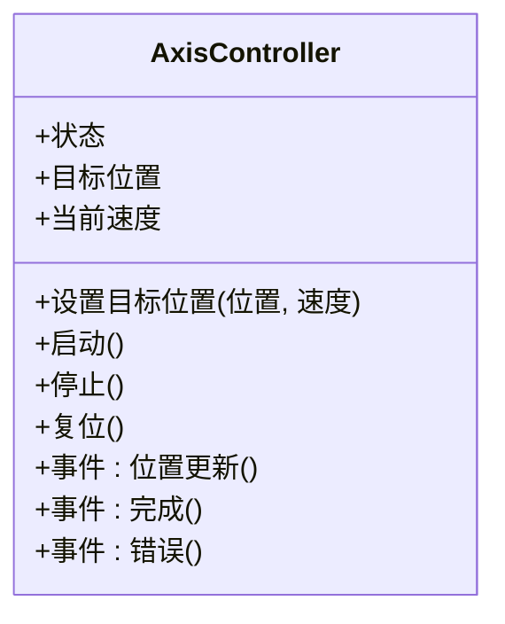
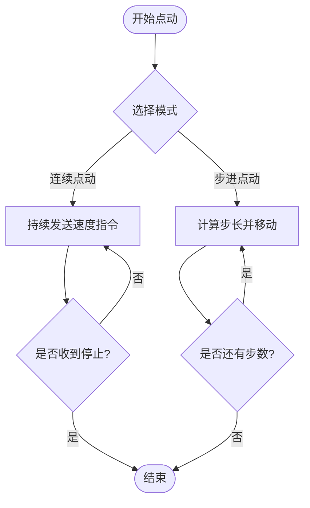
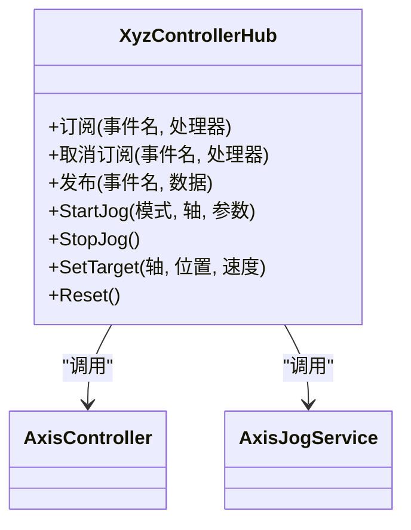
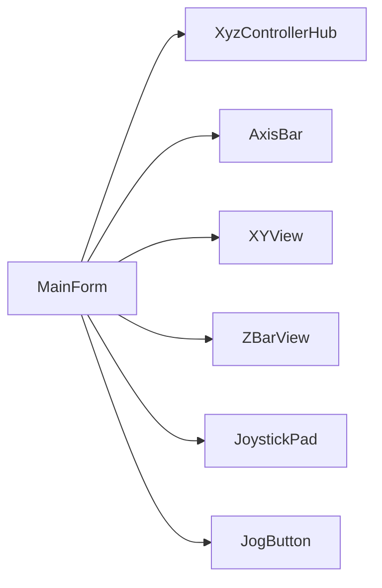
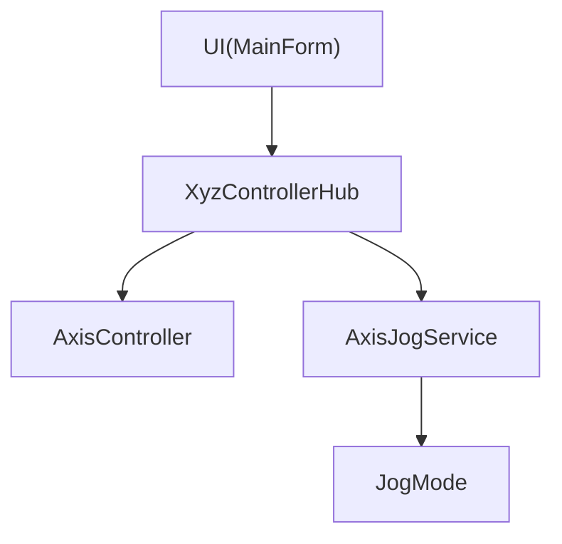

# 核心控制系统

<cite>
**本文引用的文件**   
- [AxisController.cs](file://src/XyzController/Logic/AxisController.cs)
- [AxisJogService.cs](file://src/XyzController/Logic/AxisJogService.cs)
- [JogMode.cs](file://src/XyzController/Logic/JogMode.cs)
- [XyzControllerHub.cs](file://src/XyzController/Logic/XyzControllerHub.cs)
- [MainForm.cs](file://src/XyzController/MainForm.cs)
- [Program.cs](file://src/XyzController/Program.cs)
- [AxisBar.cs](file://src/XyzController.Controls/AxisBar.cs)
- [XYView.cs](file://src/XyzController.Controls/XYView.cs)
- [ZBarView.cs](file://src/XyzController.Controls/ZBarView.cs)
- [JoystickPad.cs](file://src/XyzController.Controls/JoystickPad.cs)
- [JogButton.cs](file://src/XyzController.Controls/JogButton.cs)
- [AxisControllerTests.cs](file://src/XyzController.Tests/Tests/AxisControllerTests.cs)
- [AxisJogServiceTests.cs](file://src/XyzController.Tests/Tests/AxisJogServiceTests.cs)
- [XyzControllerHubTests.cs](file://src/XyzController.Tests/Tests/XyzControllerHubTests.cs)
- [主窗体协调器.md](file://src/content/核心架构设计/主窗体协调器.md)
- [点动服务.md](file://src/content/核心架构设计/点动服务.md)
- [组件通信机制.md](file://src/content/核心架构设计/组件通信机制.md)
- [轴控制系统.md](file://src/content/核心架构设计/轴控制系统.md)
</cite>

## 目录
1. [简介](#简介)
2. [项目结构](#项目结构)
3. [核心组件](#核心组件)
4. [架构总览](#架构总览)
5. [详细组件分析](#详细组件分析)
6. [依赖关系分析](#依赖关系分析)
7. [性能考虑](#性能考虑)
8. [故障排查指南](#故障排查指南)
9. [结论](#结论)
10. [附录](#附录)

## 简介
本技术文档聚焦于XYZ三轴运动控制的核心控制系统，围绕以下关键目标展开：
- AxisController轴控制器的核心逻辑、位置控制算法与速度调节机制
- 安全保护功能（限位、急停、越界等）
- AxisJogService点动服务的多种控制模式（连续点动、步进点动）与参数配置
- XyzControllerHub事件驱动架构与消息传递机制
- 组件间依赖关系与数据流
- 使用示例与最佳实践
- 性能优化建议

## 项目结构
本项目采用分层与按职责划分相结合的组织方式：
- 核心控制逻辑位于 src/XyzController/Logic 下，包含轴控制器、点动服务、控制模式枚举与通信枢纽
- UI层位于 src/XyzController 下的窗体与控件，负责用户交互与可视化
- 自定义控件库位于 src/XyzController.Controls，提供通用UI能力
- 测试位于 src/XyzController.Tests，覆盖核心逻辑的单元测试
- WPF宿主位于 src/XyzController.WpfHost，用于在WPF环境中承载与控制
- 设计文档位于 src/content/核心架构设计，辅助理解整体架构

图表来源
- [MainForm.cs](file://src/XyzController/MainForm.cs)
- [Program.cs](file://src/XyzController/Program.cs)
- [AxisController.cs](file://src/XyzController/Logic/AxisController.cs)
- [AxisJogService.cs](file://src/XyzController/Logic/AxisJogService.cs)
- [JogMode.cs](file://src/XyzController/Logic/JogMode.cs)
- [XyzControllerHub.cs](file://src/XyzController/Logic/XyzControllerHub.cs)
- [AxisBar.cs](file://src/XyzController.Controls/AxisBar.cs)
- [XYView.cs](file://src/XyzController.Controls/XYView.cs)
- [ZBarView.cs](file://src/XyzController.Controls/ZBarView.cs)
- [JoystickPad.cs](file://src/XyzController.Controls/JoystickPad.cs)
- [JogButton.cs](file://src/XyzController.Controls/JogButton.cs)

章节来源
- [主窗体协调器.md](file://src/content/核心架构设计/主窗体协调器.md)
- [组件通信机制.md](file://src/content/核心架构设计/组件通信机制.md)
- [轴控制系统.md](file://src/content/核心架构设计/轴控制系统.md)

## 核心组件
- AxisController：封装单轴的运动控制，包括位置目标设定、速度曲线规划、状态机管理、安全边界检查与异常恢复。
- AxisJogService：提供点动控制能力，支持连续点动与步进点动两种模式，并维护点动参数（速度、步长、加速度等）。
- JogMode：定义点动模式的枚举类型，供点动服务与上层逻辑进行模式切换。
- XyzControllerHub：作为事件驱动的通信枢纽，聚合多轴控制与点动服务，统一发布/订阅事件，解耦UI与底层控制。

章节来源
- [AxisController.cs](file://src/XyzController/Logic/AxisController.cs)
- [AxisJogService.cs](file://src/XyzController/Logic/AxisJogService.cs)
- [JogMode.cs](file://src/XyzController/Logic/JogMode.cs)
- [XyzControllerHub.cs](file://src/XyzController/Logic/XyzControllerHub.cs)

## 架构总览
系统采用“事件驱动 + 命令/查询”混合架构：
- UI通过命令向Hub发起控制请求（如启动点动、设置目标位置）
- Hub将命令分发至AxisController或AxisJogService执行
- 各组件在执行过程中发布状态与事件（位置更新、完成、错误）
- UI订阅事件以刷新显示与用户反馈

图表来源
- [MainForm.cs](file://src/XyzController/MainForm.cs)
- [XyzControllerHub.cs](file://src/XyzController/Logic/XyzControllerHub.cs)
- [AxisJogService.cs](file://src/XyzController/Logic/AxisJogService.cs)
- [AxisController.cs](file://src/XyzController/Logic/AxisController.cs)

## 详细组件分析

### AxisController（轴控制器）
- 职责
  - 维护轴的状态（空闲、运行、报警、回零等）
  - 处理位置目标与速度指令，生成平滑轨迹
  - 执行安全校验（软限位、硬限位、越界、急停）
  - 暴露事件（位置更新、完成、错误）供上层订阅
- 关键流程
  - 接收目标位置与速度参数
  - 计算加减速曲线与插补路径（若为多轴联动）
  - 下发底层驱动指令并轮询/回调获取实际状态
  - 触发安全保护（立即停止、记录错误码）
- 数据结构与复杂度
  - 状态机：O(1)状态转换
  - 轨迹规划：典型梯形/S形曲线，时间复杂度与步数线性相关
  - 事件发布：基于观察者模式，O(n)订阅者通知
- 错误处理
  - 非法参数返回错误事件
  - 硬件通信失败重试与降级策略
  - 安全边界触发时强制停机并上报

图表来源
- [AxisController.cs](file://src/XyzController/Logic/AxisController.cs)

章节来源
- [AxisController.cs](file://src/XyzController/Logic/AxisController.cs)
- [AxisControllerTests.cs](file://src/XyzController.Tests/Tests/AxisControllerTests.cs)

### AxisJogService（点动服务）
- 职责
  - 提供连续点动与步进点动两种模式
  - 管理点动参数（速度、步长、加速度、保持时间等）
  - 与AxisController协作，将点动指令转换为轴控制命令
- 控制模式
  - 连续点动：按住按钮期间持续发送速度指令，松开即停止
  - 步进点动：每次触发移动固定步长，完成后自动停止
- 参数配置
  - 速度上限、步长、加速度、保持时间、重复次数等
- 事件与状态
  - 点动开始/结束事件
  - 运行中周期性状态上报（位置、速度、剩余步数）

图表来源
- [AxisJogService.cs](file://src/XyzController/Logic/AxisJogService.cs)
- [JogMode.cs](file://src/XyzController/Logic/JogMode.cs)

章节来源
- [AxisJogService.cs](file://src/XyzController/Logic/AxisJogService.cs)
- [JogMode.cs](file://src/XyzController/Logic/JogMode.cs)
- [AxisJogServiceTests.cs](file://src/XyzController.Tests/Tests/AxisJogServiceTests.cs)
- [点动服务.md](file://src/content/核心架构设计/点动服务.md)

### XyzControllerHub（通信枢纽）
- 职责
  - 聚合AxisController与AxisJogService
  - 统一对外发布/订阅事件，解耦UI与控制逻辑
  - 路由命令到具体服务，转发状态与错误
- 事件驱动架构
  - 命令事件：StartJog、StopJog、SetTarget、Reset等
  - 状态事件：PositionChanged、VelocityChanged、Completed、ErrorOccurred
  - 订阅模型：UI订阅Hub事件，Hub转发至对应组件
- 消息传递机制
  - 内部队列或线程安全的发布/订阅实现
  - 事件去抖与批量合并（可选）以提升UI刷新性能

图表来源
- [XyzControllerHub.cs](file://src/XyzController/Logic/XyzControllerHub.cs)

章节来源
- [XyzControllerHub.cs](file://src/XyzController/Logic/XyzControllerHub.cs)
- [XyzControllerHubTests.cs](file://src/XyzController.Tests/Tests/XyzControllerHubTests.cs)
- [组件通信机制.md](file://src/content/核心架构设计/组件通信机制.md)

### UI与控件集成
- MainForm负责编排Hub与各控件的交互，将用户操作转化为命令事件
- 自定义控件（AxisBar、XYView、ZBarView、JoystickPad、JogButton）提供直观的点动与轨迹展示
- 数据绑定与事件转发确保低延迟的UI响应

图表来源
- [MainForm.cs](file://src/XyzController/MainForm.cs)
- [AxisBar.cs](file://src/XyzController.Controls/AxisBar.cs)
- [XYView.cs](file://src/XyzController.Controls/XYView.cs)
- [ZBarView.cs](file://src/XyzController.Controls/ZBarView.cs)
- [JoystickPad.cs](file://src/XyzController.Controls/JoystickPad.cs)
- [JogButton.cs](file://src/XyzController.Controls/JogButton.cs)

章节来源
- [主窗体协调器.md](file://src/content/核心架构设计/主窗体协调器.md)

## 依赖关系分析
- 松耦合：UI仅依赖Hub接口，不直接耦合AxisController与AxisJogService
- 内聚性：每个组件职责单一，便于测试与维护
- 外部依赖：底层驱动接口由AxisController抽象，便于替换不同硬件平台

图表来源
- [MainForm.cs](file://src/XyzController/MainForm.cs)
- [XyzControllerHub.cs](file://src/XyzController/Logic/XyzControllerHub.cs)
- [AxisController.cs](file://src/XyzController/Logic/AxisController.cs)
- [AxisJogService.cs](file://src/XyzController/Logic/AxisJogService.cs)
- [JogMode.cs](file://src/XyzController/Logic/JogMode.cs)

章节来源
- [组件通信机制.md](file://src/content/核心架构设计/组件通信机制.md)

## 性能考虑
- 事件批处理：对高频位置/速度事件进行合并，降低UI刷新压力
- 异步与线程安全：避免阻塞UI线程，使用异步任务与线程安全队列
- 轨迹规划优化：根据轴特性选择合适的加减速曲线，减少抖动与过冲
- 资源释放：及时取消订阅与释放资源，防止内存泄漏
- 缓存与节流：对只读状态进行短期缓存，减少重复计算

[本节为通用指导，无需特定文件引用]

## 故障排查指南
- 常见问题
  - 点动无响应：检查Hub是否正确转发命令，确认AxisJogService是否处于可运行状态
  - 位置漂移：核对安全边界与限位参数，检查底层驱动反馈
  - UI卡顿：评估事件频率，启用批处理与节流
- 定位步骤
  - 查看错误事件与日志，确认错误码与堆栈
  - 使用测试用例复现问题，隔离UI与控制逻辑
  - 逐步禁用订阅者，缩小影响范围

章节来源
- [AxisControllerTests.cs](file://src/XyzController.Tests/Tests/AxisControllerTests.cs)
- [AxisJogServiceTests.cs](file://src/XyzController.Tests/Tests/AxisJogServiceTests.cs)
- [XyzControllerHubTests.cs](file://src/XyzController.Tests/Tests/XyzControllerHubTests.cs)

## 结论
本控制系统通过清晰的组件划分与事件驱动架构，实现了高内聚、低耦合的XYZ三轴运动控制。AxisController负责精确的位置与速度控制及安全保护；AxisJogService提供灵活的点动模式；XyzControllerHub作为中枢统一调度与事件传播。结合合理的性能优化与完善的测试覆盖，系统具备良好的可扩展性与稳定性。

[本节为总结，无需特定文件引用]

## 附录
- 使用示例与最佳实践
  - 初始化顺序：先创建Hub，再注册订阅者，最后启动控制服务
  - 参数校验：在Hub入口处集中校验，避免无效命令进入控制链路
  - 安全优先：任何异常路径都应触发安全停机并上报
  - 可观测性：为关键事件添加结构化日志，便于追踪与分析

[本节为补充说明，无需特定文件引用]