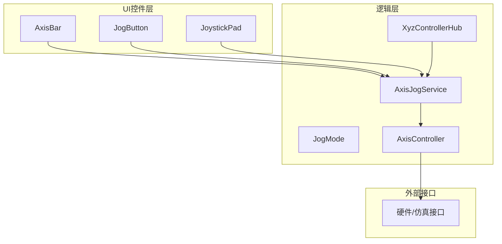
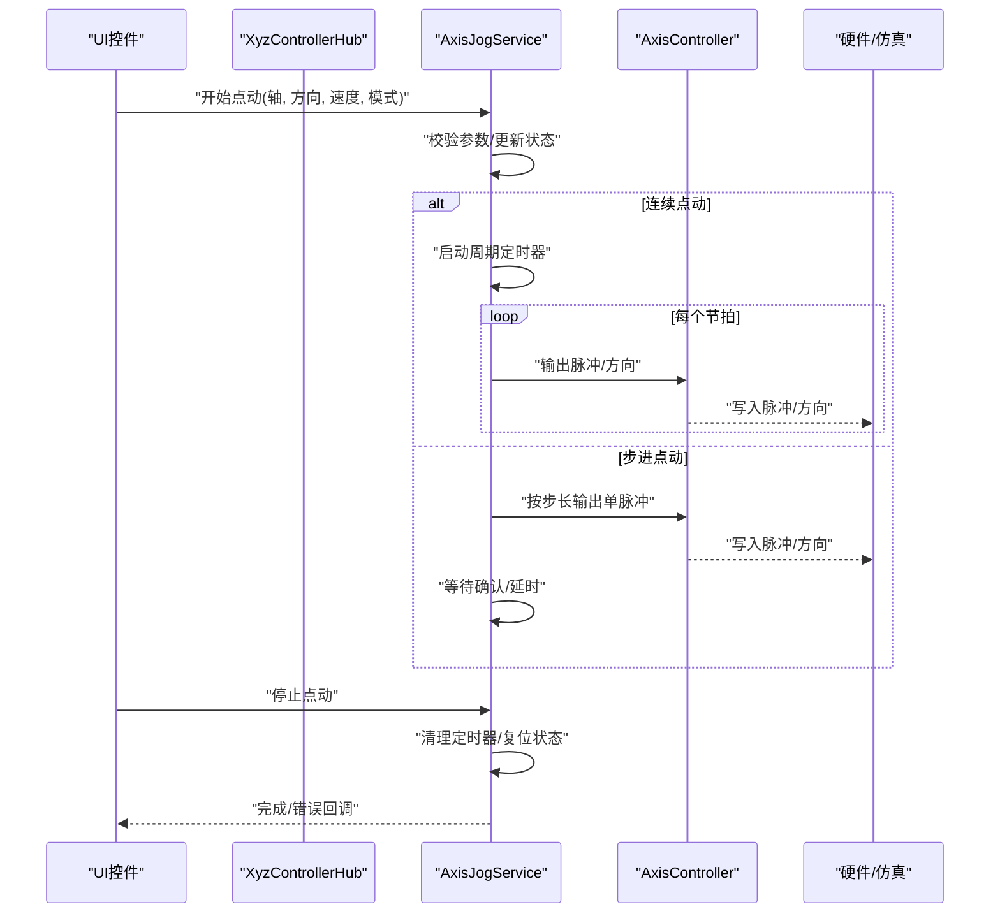
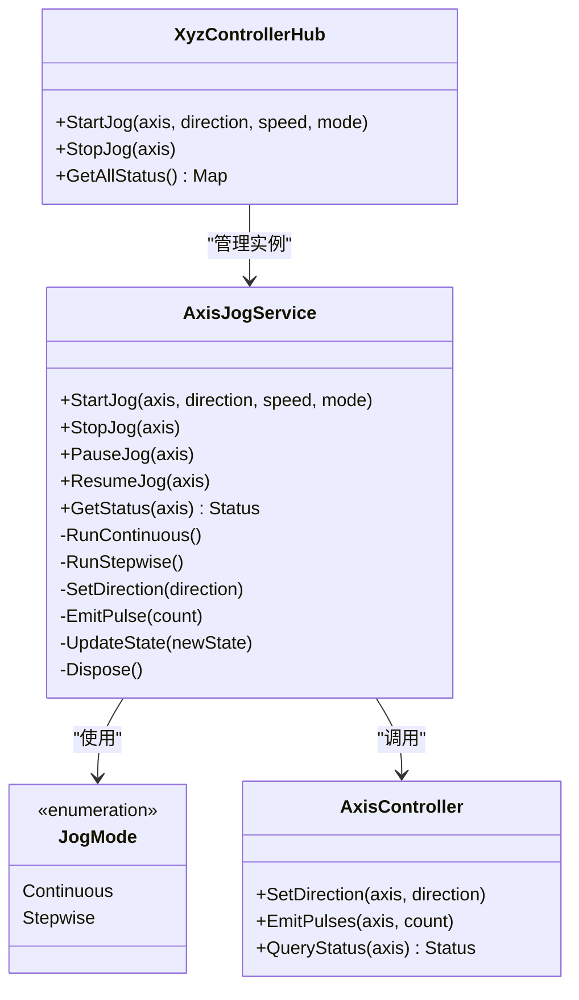
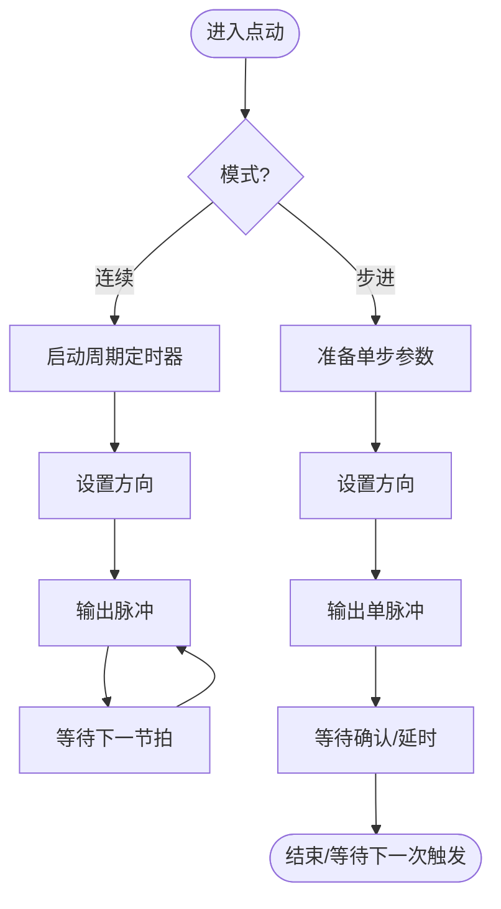
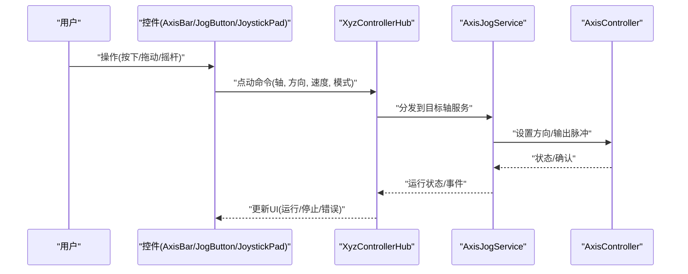
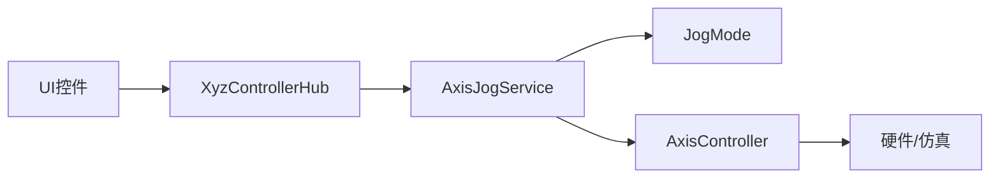

# 点动服务

<cite>
**本文引用的文件**   
- [AxisJogService.cs](file://src/XyzController/Logic/AxisJogService.cs)
- [JogMode.cs](file://src/XyzController/Logic/JogMode.cs)
- [AxisController.cs](file://src/XyzController/Logic/AxisController.cs)
- [XyzControllerHub.cs](file://src/XyzController/Logic/XyzControllerHub.cs)
- [AxisBar.cs](file://src/XyzController.Controls/AxisBar.cs)
- [JogButton.cs](file://src/XyzController.Controls/JogButton.cs)
- [JoystickPad.cs](file://src/XyzController.Controls/JoystickPad.cs)
- [AxisJogServiceTests.cs](file://src/XyzController.Tests/Tests/AxisJogServiceTests.cs)
</cite>

## 目录
1. [简介](#简介)
2. [项目结构](#项目结构)
3. [核心组件](#核心组件)
4. [架构总览](#架构总览)
5. [详细组件分析](#详细组件分析)
6. [依赖关系分析](#依赖关系分析)
7. [性能考虑](#性能考虑)
8. [故障排除指南](#故障排除指南)
9. [结论](#结论)
10. [附录](#附录)

## 简介
本文件面向点动（Jog）服务的实现与使用，重点围绕 AxisJogService 的设计与工作机制展开。文档涵盖：
- 连续点动模式与步进点动模式的原理与差异
- JogMode 枚举的模式分类与适用场景
- 速度控制、方向管理、脉冲生成与时序控制算法
- 配置参数、启动/停止控制、用户输入处理流程
- 线程安全机制、状态同步与资源管理
- 故障排除与性能调优建议

## 项目结构
点动服务位于 Logic 层，由 AxisJogService 作为核心调度器，配合 JogMode 枚举定义点动模式，并通过 AxisController 与底层硬件或仿真接口交互。UI 控件（AxisBar、JogButton、JoystickPad）负责采集用户输入并驱动服务。测试用例覆盖关键路径。

图表来源
- [AxisJogService.cs](file://src/XyzController/Logic/AxisJogService.cs)
- [JogMode.cs](file://src/XyzController/Logic/JogMode.cs)
- [AxisController.cs](file://src/XyzController/Logic/AxisController.cs)
- [XyzControllerHub.cs](file://src/XyzController/Logic/XyzControllerHub.cs)
- [AxisBar.cs](file://src/XyzController.Controls/AxisBar.cs)
- [JogButton.cs](file://src/XyzController.Controls/JogButton.cs)
- [JoystickPad.cs](file://src/XyzController.Controls/JoystickPad.cs)

章节来源
- [AxisJogService.cs](file://src/XyzController/Logic/AxisJogService.cs)
- [JogMode.cs](file://src/XyzController/Logic/JogMode.cs)
- [AxisController.cs](file://src/XyzController/Logic/AxisController.cs)
- [XyzControllerHub.cs](file://src/XyzController/Logic/XyzControllerHub.cs)
- [AxisBar.cs](file://src/XyzController.Controls/AxisBar.cs)
- [JogButton.cs](file://src/XyzController.Controls/JogButton.cs)
- [JoystickPad.cs](file://src/XyzController.Controls/JoystickPad.cs)

## 核心组件
- AxisJogService：点动服务主控制器，负责解析点动命令、维护运行状态、调度定时器/任务、生成脉冲序列、协调多轴并发与互斥。
- JogMode：点动模式枚举，区分连续点动、步进点动等模式，决定时序与步长策略。
- AxisController：轴控制抽象，封装对硬件或仿真的写脉冲、设置速度/方向等操作。
- XyzControllerHub：上层协调器，聚合多个 AxisJogService 实例并提供统一入口。
- UI 控件：AxisBar、JogButton、JoystickPad 将用户操作转换为点动命令并触发服务。

章节来源
- [AxisJogService.cs](file://src/XyzController/Logic/AxisJogService.cs)
- [JogMode.cs](file://src/XyzController/Logic/JogMode.cs)
- [AxisController.cs](file://src/XyzController/Logic/AxisController.cs)
- [XyzControllerHub.cs](file://src/XyzController/Logic/XyzControllerHub.cs)

## 架构总览
点动服务采用“事件驱动 + 定时调度”的架构：
- 输入层：UI 控件捕获按键/摇杆事件，产生带方向、速度、模式的点动指令。
- 调度层：AxisJogService 根据 JogMode 选择连续或步进策略，维护运行态与计时器。
- 执行层：通过 AxisController 下发脉冲与方向信号至硬件/仿真。
- 协调层：XyzControllerHub 统一管理多轴服务实例，提供启停、查询与广播能力。

图表来源
- [AxisJogService.cs](file://src/XyzController/Logic/AxisJogService.cs)
- [AxisController.cs](file://src/XyzController/Logic/AxisController.cs)
- [XyzControllerHub.cs](file://src/XyzController/Logic/XyzControllerHub.cs)

## 详细组件分析

### AxisJogService 设计与实现要点
- 职责边界
  - 接收点动命令，校验参数（轴号、方向、速度、模式）。
  - 维护运行状态机（空闲、运行中、暂停、停止中、异常）。
  - 根据 JogMode 选择连续或步进策略，驱动定时器或单次脉冲。
  - 与 AxisController 协作，确保方向与脉冲时序正确。
  - 提供启停接口、状态查询、错误上报。
- 关键数据结构
  - 运行上下文：包含目标轴、方向、速度、模式、已发脉冲计数、时间戳等。
  - 定时器/任务句柄：用于节拍调度或延时等待。
  - 锁/信号量：保护状态读写与并发访问。
- 算法与策略
  - 连续点动：基于固定节拍周期循环输出脉冲；速度通过调节周期或每拍脉冲数实现。
  - 步进点动：每次触发输出一个脉冲（或固定步长），等待确认或延时后结束。
  - 方向管理：在输出脉冲前设置方向信号，保证方向稳定后再发脉冲。
  - 时序控制：使用高精度定时器或任务调度器，避免 UI 线程阻塞。
- 线程安全与状态同步
  - 使用互斥锁保护状态变更与定时器启停。
  - 状态变更通过事件或回调通知调用方。
  - 支持跨线程调用，内部队列化命令以避免竞态。
- 资源管理
  - 启动时分配定时器/句柄，停止时释放。
  - 异常路径确保资源回收与状态复位。

图表来源
- [AxisJogService.cs](file://src/XyzController/Logic/AxisJogService.cs)
- [JogMode.cs](file://src/XyzController/Logic/JogMode.cs)
- [AxisController.cs](file://src/XyzController/Logic/AxisController.cs)
- [XyzControllerHub.cs](file://src/XyzController/Logic/XyzControllerHub.cs)

章节来源
- [AxisJogService.cs](file://src/XyzController/Logic/AxisJogService.cs)
- [JogMode.cs](file://src/XyzController/Logic/JogMode.cs)
- [AxisController.cs](file://src/XyzController/Logic/AxisController.cs)
- [XyzControllerHub.cs](file://src/XyzController/Logic/XyzControllerHub.cs)

### JogMode 枚举与适用场景
- 连续点动（Continuous）
  - 特点：持续输出脉冲，适合快速定位、粗调。
  - 适用：大范围移动、寻位、预对齐。
- 步进点动（Stepwise）
  - 特点：每次触发输出固定步长，适合精确定位、微调。
  - 适用：精密装配、间隙调整、微位移。

章节来源
- [JogMode.cs](file://src/XyzController/Logic/JogMode.cs)

### 速度控制、方向管理与脉冲生成
- 速度控制
  - 连续模式：通过调节节拍周期或每拍脉冲数量实现速度变化。
  - 步进模式：通过调节步长或两次触发之间的最小间隔影响等效速度。
- 方向管理
  - 先设置方向，再输出脉冲，避免方向抖动导致误动作。
  - 支持方向切换时的减速/停顿策略（可选）。
- 脉冲生成与时序
  - 使用高精度定时器或任务调度器保证节拍稳定。
  - 脉冲宽度与间隔需满足硬件要求，必要时加入死区时间。

图表来源
- [AxisJogService.cs](file://src/XyzController/Logic/AxisJogService.cs)
- [AxisController.cs](file://src/XyzController/Logic/AxisController.cs)

章节来源
- [AxisJogService.cs](file://src/XyzController/Logic/AxisJogService.cs)
- [AxisController.cs](file://src/XyzController/Logic/AxisController.cs)

### 用户输入到点动执行的端到端流程
- 输入源
  - AxisBar：拖拽或点击产生方向与速度。
  - JogButton：按下/抬起对应开始/停止。
  - JoystickPad：摇杆偏移映射为速度与方向。
- 处理链路
  - 控件将输入转换为标准化点动命令。
  - 通过 XyzControllerHub 路由到具体轴的 AxisJogService。
  - 服务执行并反馈状态给 UI。

图表来源
- [AxisBar.cs](file://src/XyzController.Controls/AxisBar.cs)
- [JogButton.cs](file://src/XyzController.Controls/JogButton.cs)
- [JoystickPad.cs](file://src/XyzController.Controls/JoystickPad.cs)
- [XyzControllerHub.cs](file://src/XyzController/Logic/XyzControllerHub.cs)
- [AxisJogService.cs](file://src/XyzController/Logic/AxisJogService.cs)
- [AxisController.cs](file://src/XyzController/Logic/AxisController.cs)

章节来源
- [AxisBar.cs](file://src/XyzController.Controls/AxisBar.cs)
- [JogButton.cs](file://src/XyzController.Controls/JogButton.cs)
- [JoystickPad.cs](file://src/XyzController.Controls/JoystickPad.cs)
- [XyzControllerHub.cs](file://src/XyzController/Logic/XyzControllerHub.cs)
- [AxisJogService.cs](file://src/XyzController/Logic/AxisJogService.cs)
- [AxisController.cs](file://src/XyzController/Logic/AxisController.cs)

### 使用示例与最佳实践
- 配置点动参数
  - 选择模式：根据精度需求选择连续或步进。
  - 设定速度：连续模式优先调节节拍周期；步进模式调节步长或触发频率。
  - 指定方向：正/负方向，必要时启用方向切换缓冲。
- 启动/停止控制
  - 启动：传入轴号、方向、速度、模式，服务返回运行状态。
  - 停止：发送停止命令，服务清理定时器并复位状态。
- 处理用户输入
  - 控件层做输入归一化与防抖，避免重复触发。
  - 在 UI 线程外执行耗时操作，通过回调更新界面。
- 参考路径
  - 服务接口与用法：[AxisJogService.cs](file://src/XyzController/Logic/AxisJogService.cs)
  - 模式定义：[JogMode.cs](file://src/XyzController/Logic/JogMode.cs)
  - 控件集成：[AxisBar.cs](file://src/XyzController.Controls/AxisBar.cs)、[JogButton.cs](file://src/XyzController.Controls/JogButton.cs)、[JoystickPad.cs](file://src/XyzController.Controls/JoystickPad.cs)
  - 单元测试用例：[AxisJogServiceTests.cs](file://src/XyzController.Tests/Tests/AxisJogServiceTests.cs)

章节来源
- [AxisJogService.cs](file://src/XyzController/Logic/AxisJogService.cs)
- [JogMode.cs](file://src/XyzController/Logic/JogMode.cs)
- [AxisBar.cs](file://src/XyzController.Controls/AxisBar.cs)
- [JogButton.cs](file://src/XyzController.Controls/JogButton.cs)
- [JoystickPad.cs](file://src/XyzController.Controls/JoystickPad.cs)
- [AxisJogServiceTests.cs](file://src/XyzController.Tests/Tests/AxisJogServiceTests.cs)

## 依赖关系分析
- 组件耦合
  - AxisJogService 依赖 AxisController 进行底层操作，依赖 JogMode 决定行为分支。
  - XyzControllerHub 聚合多个 AxisJogService 实例，提供统一 API。
  - UI 控件仅与服务/Hub 交互，不直接访问硬件。
- 外部依赖
  - AxisController 对接硬件/仿真接口，屏蔽设备差异。
- 潜在风险
  - 若 AxisController 响应延迟，需在服务层增加超时与重试策略。
  - 多轴并发时需确保共享资源的互斥访问。

图表来源
- [AxisJogService.cs](file://src/XyzController/Logic/AxisJogService.cs)
- [JogMode.cs](file://src/XyzController/Logic/JogMode.cs)
- [AxisController.cs](file://src/XyzController/Logic/AxisController.cs)
- [XyzControllerHub.cs](file://src/XyzController/Logic/XyzControllerHub.cs)

章节来源
- [AxisJogService.cs](file://src/XyzController/Logic/AxisJogService.cs)
- [JogMode.cs](file://src/XyzController/Logic/JogMode.cs)
- [AxisController.cs](file://src/XyzController/Logic/AxisController.cs)
- [XyzControllerHub.cs](file://src/XyzController/Logic/XyzControllerHub.cs)

## 性能考虑
- 定时器精度
  - 使用高精度定时器或系统级任务调度，避免 UI 线程阻塞。
  - 在高节拍下减少对象分配，复用缓冲区。
- 并发与锁粒度
  - 缩小临界区范围，避免长时间持有锁。
  - 多轴独立服务实例，降低锁竞争。
- I/O 批处理
  - 批量写入脉冲与方向，减少系统调用次数。
- 背压与限流
  - 当硬件响应慢时，服务层应限速或排队，防止堆积。
- 内存与资源
  - 及时释放定时器/句柄，避免泄漏。
  - 异常路径确保资源回收。

## 故障排除指南
- 常见问题
  - 无脉冲输出：检查方向设置是否成功、定时器是否启动、AxisController 是否正常。
  - 方向错误：确认方向设置时机与顺序，避免与脉冲并发。
  - 速度异常：核对节拍周期与步长配置，检查硬件上限。
  - 卡顿/掉帧：排查 UI 线程阻塞、锁竞争、I/O 瓶颈。
- 诊断步骤
  - 查看服务状态与事件日志，确认状态机流转。
  - 使用测试用例复现问题，隔离 UI 与硬件因素。
  - 逐步替换 AxisController 为仿真实现，验证服务逻辑。
- 恢复策略
  - 自动重试与超时回退。
  - 强制停止并复位状态，确保可再次启动。

章节来源
- [AxisJogService.cs](file://src/XyzController/Logic/AxisJogService.cs)
- [AxisJogServiceTests.cs](file://src/XyzController.Tests/Tests/AxisJogServiceTests.cs)

## 结论
AxisJogService 以清晰的状态机与策略分离实现了连续与步进两种点动模式，结合 JogMode 与 AxisController 形成可扩展的点动体系。通过合理的线程安全设计、资源管理与性能优化，可在多轴并发与高节拍场景下保持稳定与可靠。建议在工程实践中完善监控与日志，结合测试用例持续验证关键路径。

## 附录
- 术语
  - 点动（Jog）：手动或半自动方式对轴进行小幅度或连续移动。
  - 节拍：连续点动中的固定时间间隔。
  - 步长：步进点动中每次输出的脉冲数量或位移量。
- 参考路径
  - 服务实现：[AxisJogService.cs](file://src/XyzController/Logic/AxisJogService.cs)
  - 模式定义：[JogMode.cs](file://src/XyzController/Logic/JogMode.cs)
  - 轴控制：[AxisController.cs](file://src/XyzController/Logic/AxisController.cs)
  - 协调器：[XyzControllerHub.cs](file://src/XyzController/Logic/XyzControllerHub.cs)
  - 控件集成：[AxisBar.cs](file://src/XyzController.Controls/AxisBar.cs)、[JogButton.cs](file://src/XyzController.Controls/JogButton.cs)、[JoystickPad.cs](file://src/XyzController.Controls/JoystickPad.cs)
  - 测试用例：[AxisJogServiceTests.cs](file://src/XyzController.Tests/Tests/AxisJogServiceTests.cs)