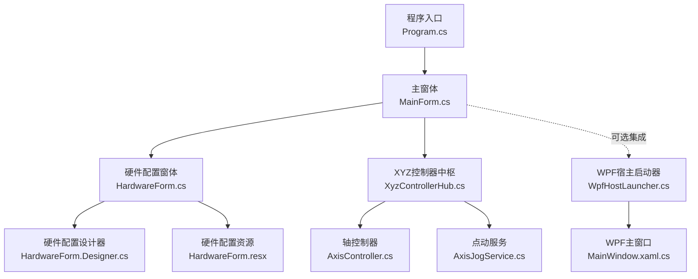
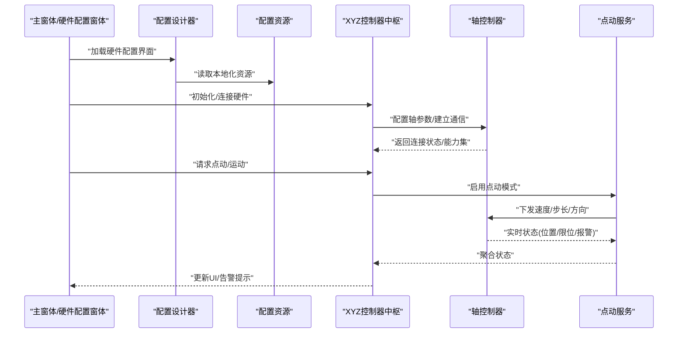
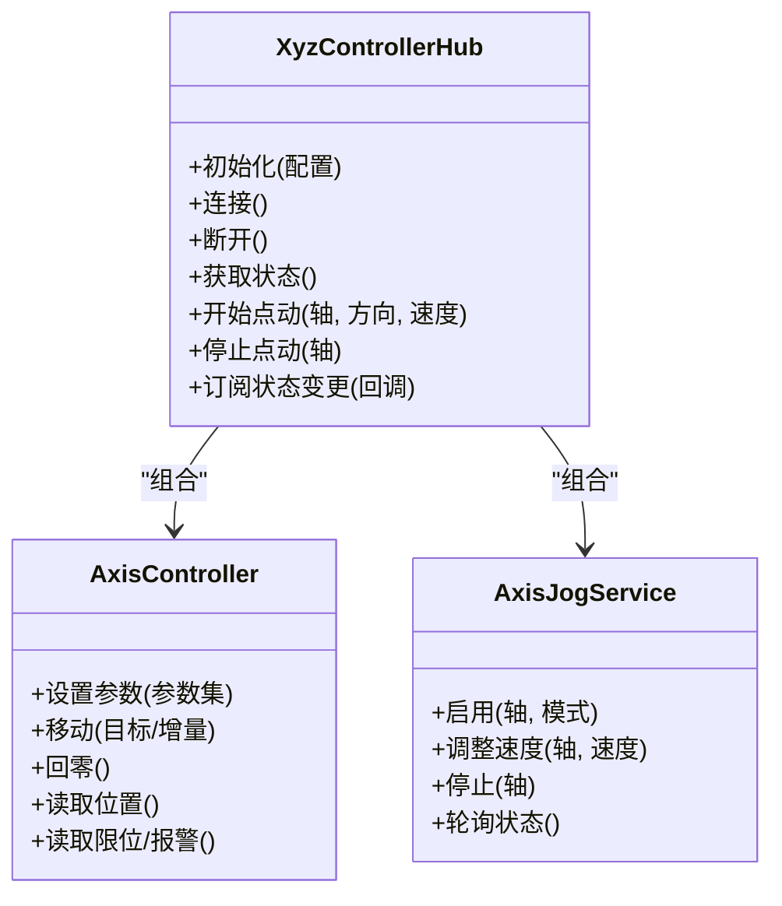
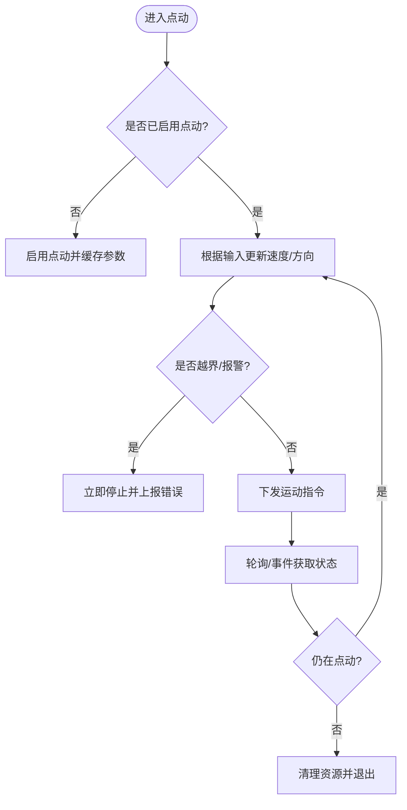
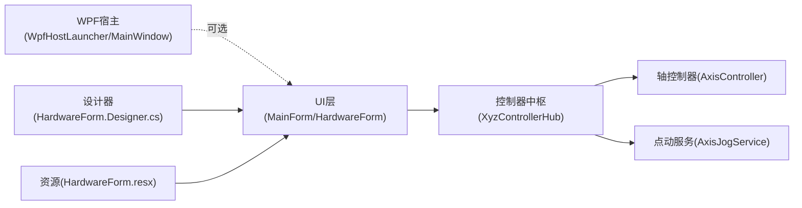

# 硬件配置管理

<cite>
**本文引用的文件**   
- [Program.cs](file://src/XyzController/Program.cs)
- [MainForm.cs](file://src/XyzController/MainForm.cs)
- [HardwareForm.cs](file://src/XyzController/HardwareForm.cs)
- [HardwareForm.Designer.cs](file://src/XyzController/HardwareForm.Designer.cs)
- [HardwareForm.resx](file://src/XyzController/HardwareForm.resx)
- [AxisController.cs](file://src/XyzController/Logic/AxisController.cs)
- [XyzControllerHub.cs](file://src/XyzController/Logic/XyzControllerHub.cs)
- [AxisJogService.cs](file://src/XyzController/Logic/AxisJogService.cs)
- [WpfHostLauncher.cs](file://src/XyzController.WpfHost/WpfHostLauncher.cs)
- [MainWindow.xaml.cs](file://src/XyzController.WpfHost/MainWindow.xaml.cs)
- [README.md](file://README.md)
- [API.md](file://API.md)
</cite>

## 更新摘要
**变更内容**   
- 新增HardwareForm硬件配置界面完整实现，包含设计器文件和资源文件
- 扩展了硬件参数配置、校验和管理的详细功能说明
- 更新了硬件配置窗体的交互流程和架构设计
- 完善了硬件设置界面的用户交互和状态管理

## 目录
1. [简介](#简介)
2. [项目结构](#项目结构)
3. [核心组件](#核心组件)
4. [架构总览](#架构总览)
5. [详细组件分析](#详细组件分析)
6. [依赖关系分析](#依赖关系分析)
7. [性能与稳定性考虑](#性能与稳定性考虑)
8. [故障排查指南](#故障排查指南)
9. [结论](#结论)
10. [附录](#附录)

## 简介
本文件聚焦于"硬件配置管理"主题，围绕轴控制器、点动服务、主机窗体与WPF宿主等关键模块，梳理硬件初始化、参数加载、运行时状态管理与异常恢复流程。文档以可操作的方式说明如何完成硬件连接、参数校验、运行模式切换与错误处理，帮助读者快速理解并正确使用该项目的硬件配置能力。

**更新** 新增了完整的HardwareForm硬件配置界面，提供图形化的硬件参数设置和管理功能，包含设计器文件和资源文件的完整支持。

## 项目结构
从仓库结构看，硬件配置相关代码主要分布在以下位置：
- Windows Forms 应用入口与主界面：Program.cs、MainForm.cs、HardwareForm.cs
- 硬件配置界面文件：HardwareForm.Designer.cs、HardwareForm.resx
- 硬件控制逻辑：Logic/AxisController.cs、Logic/AxisJogService.cs、Logic/XyzControllerHub.cs
- WPF 宿主集成：WpfHostLauncher.cs、MainWindow.xaml.cs
- 顶层说明与接口：README.md、API.md

**图表来源**
- [Program.cs](file://src/XyzController/Program.cs)
- [MainForm.cs](file://src/XyzController/MainForm.cs)
- [HardwareForm.cs](file://src/XyzController/HardwareForm.cs)
- [HardwareForm.Designer.cs](file://src/XyzController/HardwareForm.Designer.cs)
- [HardwareForm.resx](file://src/XyzController/HardwareForm.resx)
- [XyzControllerHub.cs](file://src/XyzController/Logic/XyzControllerHub.cs)
- [AxisController.cs](file://src/XyzController/Logic/AxisController.cs)
- [AxisJogService.cs](file://src/XyzController/Logic/AxisJogService.cs)
- [WpfHostLauncher.cs](file://src/XyzController.WpfHost/WpfHostLauncher.cs)
- [MainWindow.xaml.cs](file://src/XyzController.WpfHost/MainWindow.xaml.cs)

**章节来源**
- [Program.cs](file://src/XyzController/Program.cs)
- [MainForm.cs](file://src/XyzController/MainForm.cs)
- [HardwareForm.cs](file://src/XyzController/HardwareForm.cs)
- [HardwareForm.Designer.cs](file://src/XyzController/HardwareForm.Designer.cs)
- [HardwareForm.resx](file://src/XyzController/HardwareForm.resx)
- [XyzControllerHub.cs](file://src/XyzController/Logic/XyzControllerHub.cs)
- [AxisController.cs](file://src/XyzController/Logic/AxisController.cs)
- [AxisJogService.cs](file://src/XyzController/Logic/AxisJogService.cs)
- [WpfHostLauncher.cs](file://src/XyzController.WpfHost/WpfHostLauncher.cs)
- [MainWindow.xaml.cs](file://src/XyzController.WpfHost/MainWindow.xaml.cs)

## 核心组件
- 程序入口与生命周期
  - 负责创建并运行主窗体，必要时启动WPF宿主环境。
- 主窗体（MainForm）
  - 协调硬件配置、显示与控制面板，承载对控制器中枢的调用。
- 硬件配置窗体（HardwareForm）
  - **新增** 提供完整的硬件参数输入、校验与保存入口，驱动控制器初始化。
  - 包含设计器文件支持，提供可视化的界面布局管理。
  - 集成资源文件，支持多语言和本地化配置。
- XYZ控制器中枢（XyzControllerHub）
  - 统一暴露轴控制、点动、状态查询等能力，屏蔽底层差异。
- 轴控制器（AxisController）
  - 封装单轴或轴的集合操作，包括运动命令、限位、回零、速度/加速度等。
- 点动服务（AxisJogService）
  - 实现点动模式下的连续/步进控制、按键事件到运动指令的转换。
- WPF宿主（WpfHostLauncher / MainWindow）
  - 在WPF环境中托管WinForms控件或页面，便于UI扩展与集成。

**章节来源**
- [Program.cs](file://src/XyzController/Program.cs)
- [MainForm.cs](file://src/XyzController/MainForm.cs)
- [HardwareForm.cs](file://src/XyzController/HardwareForm.cs)
- [HardwareForm.Designer.cs](file://src/XyzController/HardwareForm.Designer.cs)
- [HardwareForm.resx](file://src/XyzController/HardwareForm.resx)
- [XyzControllerHub.cs](file://src/XyzController/Logic/XyzControllerHub.cs)
- [AxisController.cs](file://src/XyzController/Logic/AxisController.cs)
- [AxisJogService.cs](file://src/XyzController/Logic/AxisJogService.cs)
- [WpfHostLauncher.cs](file://src/XyzController.WpfHost/WpfHostLauncher.cs)
- [MainWindow.xaml.cs](file://src/XyzController.WpfHost/MainWindow.xaml.cs)

## 架构总览
下图展示了硬件配置与控制的端到端流程：从UI触发到控制器中枢，再到具体轴控制与点动服务，最终反馈状态至UI。

**图表来源**
- [MainForm.cs](file://src/XyzController/MainForm.cs)
- [HardwareForm.cs](file://src/XyzController/HardwareForm.cs)
- [HardwareForm.Designer.cs](file://src/XyzController/HardwareForm.Designer.cs)
- [HardwareForm.resx](file://src/XyzController/HardwareForm.resx)
- [XyzControllerHub.cs](file://src/XyzController/Logic/XyzControllerHub.cs)
- [AxisController.cs](file://src/XyzController/Logic/AxisController.cs)
- [AxisJogService.cs](file://src/XyzController/Logic/AxisJogService.cs)

## 详细组件分析

### 硬件配置窗体（HardwareForm）
职责
- 收集硬件参数（如端口、波特率、轴数量、行程、分辨率等）。
- 执行参数校验（范围检查、一致性检查）。
- 将有效配置提交给控制器中枢进行初始化。
- **新增** 提供可视化界面设计器支持，便于拖拽式界面开发。
- **新增** 集成资源文件管理，支持界面文本的多语言和本地化。

交互要点
- 通过事件或回调通知主窗体刷新状态。
- 支持配置导入/导出（若存在相应方法）。
- **新增** 响应式设计器文件，支持界面布局和控件属性的可视化编辑。

建议
- 所有用户输入需做前端校验与后端二次校验。
- 对不可逆操作（如复位、清除配置）增加确认与日志记录。
- **新增** 利用设计器文件优化界面布局，确保在不同屏幕尺寸下的良好显示效果。
- **新增** 使用资源文件管理界面文本，便于后续国际化支持。

**章节来源**
- [HardwareForm.cs](file://src/XyzController/HardwareForm.cs)
- [HardwareForm.Designer.cs](file://src/XyzController/HardwareForm.Designer.cs)
- [HardwareForm.resx](file://src/XyzController/HardwareForm.resx)
- [MainForm.cs](file://src/XyzController/MainForm.cs)

### XYZ控制器中枢（XyzControllerHub）
职责
- 作为对外统一入口，封装轴控制、点动、状态读取、事件订阅等。
- 维护轴实例集合与点动服务实例。
- 提供线程安全的状态广播与错误上报。

典型流程
- 初始化：根据配置创建轴控制器实例，建立通信通道。
- 运行期：接收来自UI的命令，转发至轴控制器或点动服务。
- 状态同步：定时或事件驱动地将最新状态推送给UI。

**图表来源**
- [XyzControllerHub.cs](file://src/XyzController/Logic/XyzControllerHub.cs)
- [AxisController.cs](file://src/XyzController/Logic/AxisController.cs)
- [AxisJogService.cs](file://src/XyzController/Logic/AxisJogService.cs)

**章节来源**
- [XyzControllerHub.cs](file://src/XyzController/Logic/XyzControllerHub.cs)
- [AxisController.cs](file://src/XyzController/Logic/AxisController.cs)
- [AxisJogService.cs](file://src/XyzController/Logic/AxisJogService.cs)

### 轴控制器（AxisController）
职责
- 抽象单轴或轴组的行为，包括参数设置、运动控制、状态读取。
- 处理安全边界（软限位、硬限位）、急停、回零等。

关键点
- 参数校验：速度、加速度、脉冲当量、行程等需在合理范围内。
- 并发访问：避免同时修改参数与下发运动命令。
- 错误码映射：将底层错误转换为上层可读信息。

**章节来源**
- [AxisController.cs](file://src/XyzController/Logic/AxisController.cs)

### 点动服务（AxisJogService）
职责
- 将用户输入（按钮、摇杆、键盘）转化为稳定的点动指令。
- 管理点动模式切换、速度曲线、防抖与节流。

算法要点
- 输入去抖与平滑：过滤抖动，保证速度变化连续。
- 优先级策略：新命令覆盖旧命令时的过渡处理。
- 状态机：空闲、加速、匀速、减速、停止等状态流转。

**图表来源**
- [AxisJogService.cs](file://src/XyzController/Logic/AxisJogService.cs)
- [AxisController.cs](file://src/XyzController/Logic/AxisController.cs)

**章节来源**
- [AxisJogService.cs](file://src/XyzController/Logic/AxisJogService.cs)
- [AxisController.cs](file://src/XyzController/Logic/AxisController.cs)

### 主窗体与程序入口（MainForm / Program）
职责
- 程序入口负责创建主窗体并启动消息循环。
- 主窗体负责整合硬件配置、控制器中枢与UI展示。

注意事项
- 确保在UI线程中更新界面，后台任务使用合适的调度器。
- 在关闭时正确释放硬件资源与句柄。

**章节来源**
- [Program.cs](file://src/XyzController/Program.cs)
- [MainForm.cs](file://src/XyzController/MainForm.cs)

### WPF宿主集成（WpfHostLauncher / MainWindow）
职责
- 在WPF应用中启动并托管WinForms控件或页面。
- 提供与WinForms侧的桥接方法，以便复用现有硬件控制逻辑。

集成建议
- 明确跨框架调用的线程模型与异常传播路径。
- 为WPF侧提供统一的配置与服务代理类。

**章节来源**
- [WpfHostLauncher.cs](file://src/XyzController.WpfHost/WpfHostLauncher.cs)
- [MainWindow.xaml.cs](file://src/XyzController.WpfHost/MainWindow.xaml.cs)

## 依赖关系分析
- 松耦合设计
  - UI层仅依赖控制器中枢，不直接操作轴控制器或点动服务。
- 内聚性
  - 轴控制器与点动服务各自封装单一职责，便于测试与替换。
- 外部依赖
  - 硬件通信库、序列化/反序列化（若用于配置持久化）、UI框架（WinForms/WPF）。
- **新增** 设计器依赖
  - HardwareForm依赖设计器文件进行界面布局管理。
  - 资源文件提供界面文本和图标等资源支持。

**图表来源**
- [MainForm.cs](file://src/XyzController/MainForm.cs)
- [HardwareForm.cs](file://src/XyzController/HardwareForm.cs)
- [HardwareForm.Designer.cs](file://src/XyzController/HardwareForm.Designer.cs)
- [HardwareForm.resx](file://src/XyzController/HardwareForm.resx)
- [XyzControllerHub.cs](file://src/XyzController/Logic/XyzControllerHub.cs)
- [AxisController.cs](file://src/XyzController/Logic/AxisController.cs)
- [AxisJogService.cs](file://src/XyzController/Logic/AxisJogService.cs)
- [WpfHostLauncher.cs](file://src/XyzController.WpfHost/WpfHostLauncher.cs)
- [MainWindow.xaml.cs](file://src/XyzController.WpfHost/MainWindow.xaml.cs)

**章节来源**
- [MainForm.cs](file://src/XyzController/MainForm.cs)
- [HardwareForm.cs](file://src/XyzController/HardwareForm.cs)
- [HardwareForm.Designer.cs](file://src/XyzController/HardwareForm.Designer.cs)
- [HardwareForm.resx](file://src/XyzController/HardwareForm.resx)
- [XyzControllerHub.cs](file://src/XyzController/Logic/XyzControllerHub.cs)
- [AxisController.cs](file://src/XyzController/Logic/AxisController.cs)
- [AxisJogService.cs](file://src/XyzController/Logic/AxisJogService.cs)
- [WpfHostLauncher.cs](file://src/XyzController.WpfHost/WpfHostLauncher.cs)
- [MainWindow.xaml.cs](file://src/XyzController.WpfHost/MainWindow.xaml.cs)

## 性能与稳定性考虑
- 线程模型
  - 硬件I/O与轮询应在后台线程执行，UI更新必须回到UI线程。
- 资源管理
  - 及时释放通信句柄、定时器与事件订阅，避免内存泄漏。
- 容错与重试
  - 对网络/串口等不稳定传输增加重试与超时机制。
- 参数校验
  - 严格限制速度与加速度，防止机械冲击；对超限参数拒绝生效并提示。
- 日志与监控
  - 记录关键操作与异常堆栈，便于定位问题。
- **新增** 界面性能优化
  - 利用设计器文件优化控件布局，减少不必要的重绘。
  - 合理使用资源文件，避免重复加载相同资源。

[本节为通用指导，无需特定文件引用]

## 故障排查指南
常见问题与定位步骤
- 无法连接硬件
  - 检查端口/地址是否正确，权限是否足够，设备是否在线。
  - 查看控制器中枢的连接方法与错误码映射。
- 点动无响应或抖动
  - 确认点动服务是否启用，速度/方向参数是否合法。
  - 检查输入去抖与节流逻辑是否生效。
- 越界或报警
  - 核对软/硬限位设置，确认当前坐标是否在允许范围内。
  - 查看报警状态位与最近一次运动命令。
- 界面卡顿
  - 确认耗时操作未阻塞UI线程，轮询频率是否过高。
- **新增** 硬件配置界面问题
  - 检查设计器文件是否正确生成，资源文件是否完整。
  - 验证硬件参数输入框的验证逻辑和错误提示。
  - 确认配置保存和加载功能的完整性。

**章节来源**
- [XyzControllerHub.cs](file://src/XyzController/Logic/XyzControllerHub.cs)
- [AxisController.cs](file://src/XyzController/Logic/AxisController.cs)
- [AxisJogService.cs](file://src/XyzController/Logic/AxisJogService.cs)
- [MainForm.cs](file://src/XyzController/MainForm.cs)
- [HardwareForm.cs](file://src/XyzController/HardwareForm.cs)
- [HardwareForm.Designer.cs](file://src/XyzController/HardwareForm.Designer.cs)
- [HardwareForm.resx](file://src/XyzController/HardwareForm.resx)

## 结论
本项目通过"控制器中枢+轴控制器+点动服务"的分层设计，实现了清晰的硬件配置管理与控制流程。UI层仅面向中枢暴露的接口，降低了耦合度，提升了可维护性与可扩展性。**新增的HardwareForm硬件配置界面**提供了完整的图形化配置体验，包含设计器文件支持和资源文件管理，进一步增强了用户体验和系统功能。建议在后续迭代中完善配置持久化、参数模板与更丰富的诊断日志，进一步提升用户体验与系统可靠性。

[本节为总结性内容，无需特定文件引用]

## 附录
- 参考文档
  - README.md：项目概述与使用说明
  - API.md：对外接口定义与示例

**章节来源**
- [README.md](file://README.md)
- [API.md](file://API.md)