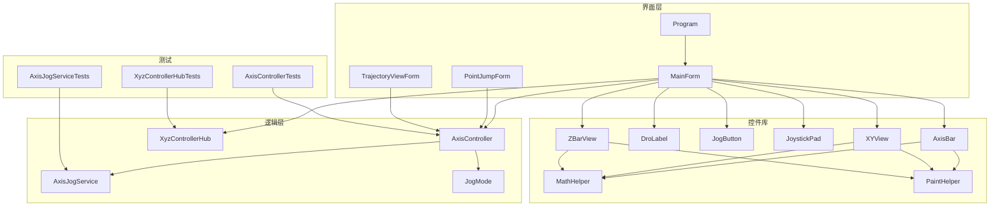
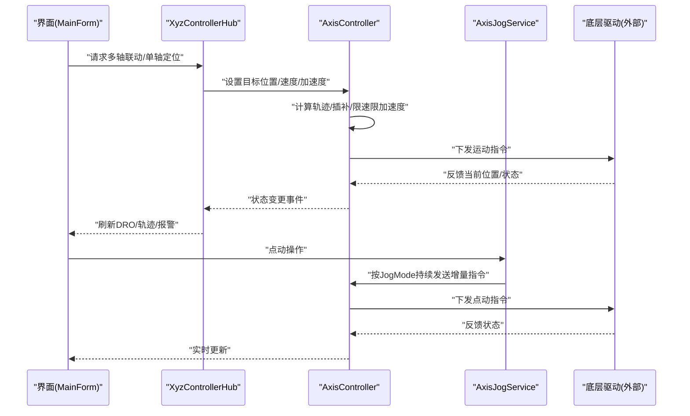
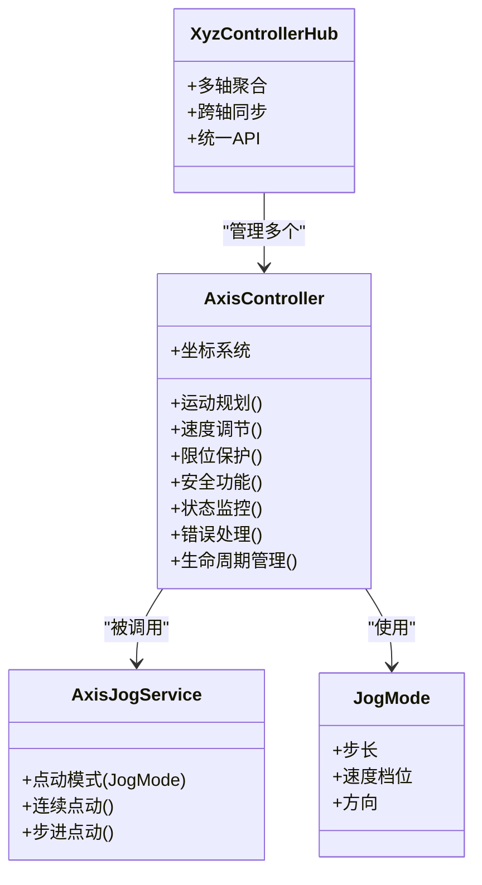
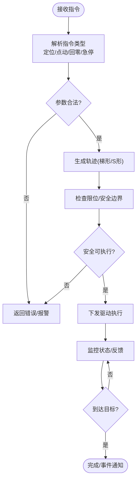
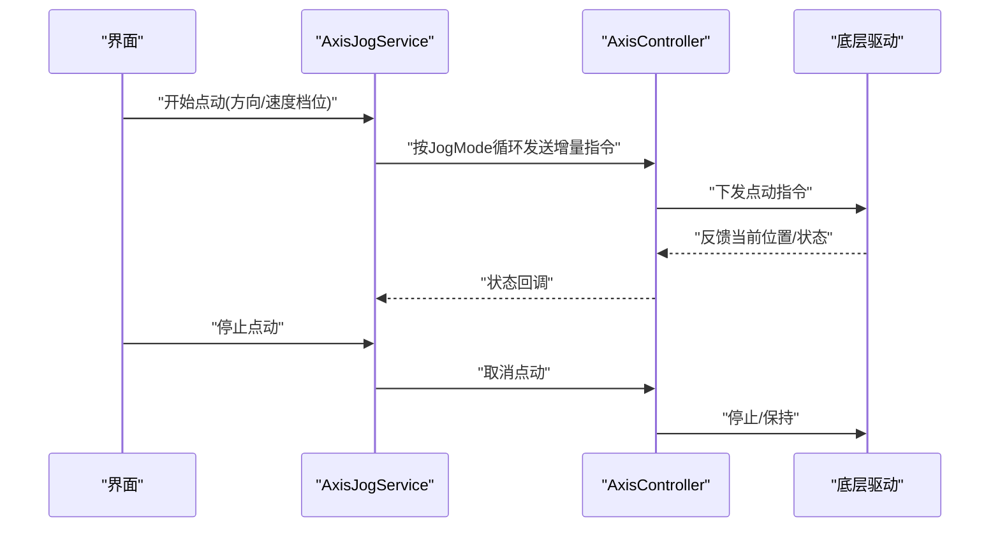
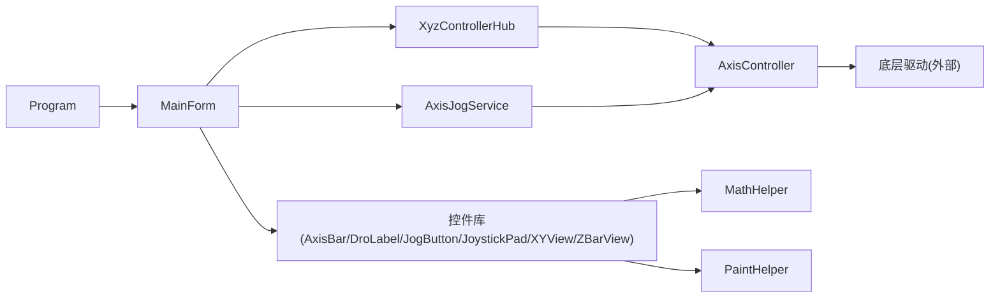

# 轴控制系统

<cite>
**本文引用的文件**   
- [AxisController.cs](file://src/XyzController/Logic/AxisController.cs)
- [AxisJogService.cs](file://src/XyzController/Logic/AxisJogService.cs)
- [JogMode.cs](file://src/XyzController/Logic/JogMode.cs)
- [XyzControllerHub.cs](file://src/XyzController/Logic/XyzControllerHub.cs)
- [Program.cs](file://src/XyzController/Program.cs)
- [MainForm.cs](file://src/XyzController/MainForm.cs)
- [PointJumpForm.cs](file://src/XyzController/PointJumpForm.cs)
- [TrajectoryViewForm.cs](file://src/XyzController/TrajectoryViewForm.cs)
- [AxisBar.cs](file://src/XyzController.Controls/AxisBar.cs)
- [DroLabel.cs](file://src/XyzController.Controls/DroLabel.cs)
- [JogButton.cs](file://src/XyzController.Controls/JogButton.cs)
- [JoystickPad.cs](file://src/XyzController.Controls/JoystickPad.cs)
- [XYView.cs](file://src/XyzController.Controls/XYView.cs)
- [ZBarView.cs](file://src/XyzController.Controls/ZBarView.cs)
- [MathHelper.cs](file://src/XyzController.Controls/MathHelper.cs)
- [PaintHelper.cs](file://src/XyzController.Controls/PaintHelper.cs)
- [AxisControllerTests.cs](file://src/XyzController.Tests/Tests/AxisControllerTests.cs)
- [AxisJogServiceTests.cs](file://src/XyzController.Tests/Tests/AxisJogServiceTests.cs)
- [XyzControllerHubTests.cs](file://src/XyzController.Tests/Tests/XyzControllerHubTests.cs)
- [主窗体协调器.md](file://src/content/核心架构设计/主窗体协调器.md)
- [核心架构设计.md](file://src/content/核心架构设计/核心架构设计.md)
- [点动服务.md](file://src/content/核心架构设计/点动服务.md)
- [组件通信机制.md](file://src/content/核心架构设计/组件通信机制.md)
- [轴控制系统.md](file://src/content/核心架构设计/轴控制系统.md)
</cite>

## 目录
1. [简介](#简介)
2. [项目结构](#项目结构)
3. [核心组件](#核心组件)
4. [架构总览](#架构总览)
5. [详细组件分析](#详细组件分析)
6. [依赖关系分析](#依赖关系分析)
7. [性能考虑](#性能考虑)
8. [故障排查指南](#故障排查指南)
9. [结论](#结论)
10. [附录](#附录)

## 简介
本技术文档面向XYZ轴控制系统的开发与维护人员，聚焦于AxisController的核心实现与整体系统架构。文档深入解释三轴位置控制算法、速度调节机制、限位保护与安全功能；详述轴坐标系统、运动指令处理、状态监控与错误处理机制；并提供初始化、设置目标位置、配置速度与加速度参数的实践指引。同时涵盖生命周期管理、资源释放与异常恢复策略，以及性能优化建议与调试技巧。

## 项目结构
本项目采用分层与模块化组织方式：
- 逻辑层（Logic）：包含AxisController、AxisJogService、JogMode、XyzControllerHub等核心控制与调度组件。
- 界面层（Forms）：提供主窗体、点位跳转、轨迹可视化等交互入口。
- 控件库（Controls）：封装轴条、DRO显示、点动按钮、摇杆、XY视图、Z轴视图及绘图辅助工具。
- 测试（Tests）：针对核心组件的单元测试。
- WPF宿主（WpfHost）：可选的WPF宿主应用，用于承载页面与集成。
- 文档（content）：内部设计与接口说明文档。

图表来源
- [Program.cs](file://src/XyzController/Program.cs)
- [MainForm.cs](file://src/XyzController/MainForm.cs)
- [AxisController.cs](file://src/XyzController/Logic/AxisController.cs)
- [AxisJogService.cs](file://src/XyzController/Logic/AxisJogService.cs)
- [JogMode.cs](file://src/XyzController/Logic/JogMode.cs)
- [XyzControllerHub.cs](file://src/XyzController/Logic/XyzControllerHub.cs)
- [AxisBar.cs](file://src/XyzController.Controls/AxisBar.cs)
- [DroLabel.cs](file://src/XyzController.Controls/DroLabel.cs)
- [JogButton.cs](file://src/XyzController.Controls/JogButton.cs)
- [JoystickPad.cs](file://src/XyzController.Controls/JoystickPad.cs)
- [XYView.cs](file://src/XyzController.Controls/XYView.cs)
- [ZBarView.cs](file://src/XyzController.Controls/ZBarView.cs)
- [MathHelper.cs](file://src/XyzController.Controls/MathHelper.cs)
- [PaintHelper.cs](file://src/XyzController.Controls/PaintHelper.cs)

章节来源
- [Program.cs](file://src/XyzController/Program.cs)
- [MainForm.cs](file://src/XyzController/MainForm.cs)
- [核心架构设计.md](file://src/content/核心架构设计/核心架构设计.md)
- [主窗体协调器.md](file://src/content/核心架构设计/主窗体协调器.md)

## 核心组件
- AxisController：三轴位置控制的核心类，负责坐标系统、运动规划、速度/加速度曲线生成、限位与安全校验、状态机与事件通知。
- AxisJogService：点动服务，支持连续/步进点动模式，结合JogMode进行行为切换。
- JogMode：点动模式枚举或配置对象，定义点动步长、速度档位、方向等参数。
- XyzControllerHub：控制器中枢，聚合多轴控制器实例，提供统一API与跨轴同步能力。

章节来源
- [AxisController.cs](file://src/XyzController/Logic/AxisController.cs)
- [AxisJogService.cs](file://src/XyzController/Logic/AxisJogService.cs)
- [JogMode.cs](file://src/XyzController/Logic/JogMode.cs)
- [XyzControllerHub.cs](file://src/XyzController/Logic/XyzControllerHub.cs)

## 架构总览
系统以“界面—中枢—控制器—驱动”的分层架构运行：
- 界面层通过MainForm等窗体发起控制命令。
- XyzControllerHub作为中枢，协调多轴控制器并处理跨轴同步。
- AxisController执行单轴的运动规划、安全校验与状态更新。
- 控件库提供实时DRO显示、轨迹绘制与点动交互。

图表来源
- [MainForm.cs](file://src/XyzController/MainForm.cs)
- [XyzControllerHub.cs](file://src/XyzController/Logic/XyzControllerHub.cs)
- [AxisController.cs](file://src/XyzController/Logic/AxisController.cs)
- [AxisJogService.cs](file://src/XyzController/Logic/AxisJogService.cs)

## 详细组件分析

### AxisController 核心实现
- 坐标系统与单位换算：维护绝对/相对坐标系、脉冲与物理单位转换、零点偏移与比例因子。
- 运动规划：支持梯形/S形加减速曲线，依据最大速度、加速度/减速度、 jerk限制生成时间最优轨迹。
- 速度调节机制：闭环速度环与开环速度前馈结合，根据负载与误差动态调整输出。
- 限位保护与安全：硬限位/软限位检测、急停、回零流程、碰撞预警与互锁。
- 状态监控与事件：位置、速度、力矩、温度、报警码等状态上报，订阅/发布式事件通知。
- 错误处理与恢复：异常分类（硬件、通信、越界、超时），自动重试、降级运行与人工确认恢复。

图表来源
- [AxisController.cs](file://src/XyzController/Logic/AxisController.cs)
- [AxisJogService.cs](file://src/XyzController/Logic/AxisJogService.cs)
- [JogMode.cs](file://src/XyzController/Logic/JogMode.cs)
- [XyzControllerHub.cs](file://src/XyzController/Logic/XyzControllerHub.cs)

章节来源
- [AxisController.cs](file://src/XyzController/Logic/AxisController.cs)
- [AxisJogService.cs](file://src/XyzController/Logic/AxisJogService.cs)
- [JogMode.cs](file://src/XyzController/Logic/JogMode.cs)
- [XyzControllerHub.cs](file://src/XyzController/Logic/XyzControllerHub.cs)

#### 运动指令处理流程

图表来源
- [AxisController.cs](file://src/XyzController/Logic/AxisController.cs)

章节来源
- [AxisController.cs](file://src/XyzController/Logic/AxisController.cs)

#### 点动服务流程

图表来源
- [AxisJogService.cs](file://src/XyzController/Logic/AxisJogService.cs)
- [JogMode.cs](file://src/XyzController/Logic/JogMode.cs)
- [AxisController.cs](file://src/XyzController/Logic/AxisController.cs)

章节来源
- [AxisJogService.cs](file://src/XyzController/Logic/AxisJogService.cs)
- [JogMode.cs](file://src/XyzController/Logic/JogMode.cs)

### 界面与控件集成
- MainForm：作为主协调器，绑定AxisController与XyzControllerHub，处理用户输入与状态展示。
- PointJumpForm：点位跳转表单，批量设置目标位置与轨迹预览。
- TrajectoryViewForm：轨迹可视化，实时绘制多轴轨迹与偏差。
- 控件库：AxisBar、DroLabel、JogButton、JoystickPad、XYView、ZBarView配合MathHelper与PaintHelper实现高性能渲染与交互。

章节来源
- [MainForm.cs](file://src/XyzController/MainForm.cs)
- [PointJumpForm.cs](file://src/XyzController/PointJumpForm.cs)
- [TrajectoryViewForm.cs](file://src/XyzController/TrajectoryViewForm.cs)
- [AxisBar.cs](file://src/XyzController.Controls/AxisBar.cs)
- [DroLabel.cs](file://src/XyzController.Controls/DroLabel.cs)
- [JogButton.cs](file://src/XyzController.Controls/JogButton.cs)
- [JoystickPad.cs](file://src/XyzController.Controls/JoystickPad.cs)
- [XYView.cs](file://src/XyzController.Controls/XYView.cs)
- [ZBarView.cs](file://src/XyzController.Controls/ZBarView.cs)
- [MathHelper.cs](file://src/XyzController.Controls/MathHelper.cs)
- [PaintHelper.cs](file://src/XyzController.Controls/PaintHelper.cs)

### 单元测试与验证
- AxisControllerTests：覆盖定位、速度/加速度配置、限位触发、错误恢复等场景。
- AxisJogServiceTests：验证点动模式切换、连续/步进行为、中断与停止。
- XyzControllerHubTests：验证多轴聚合、跨轴同步与统一API响应。

章节来源
- [AxisControllerTests.cs](file://src/XyzController.Tests/Tests/AxisControllerTests.cs)
- [AxisJogServiceTests.cs](file://src/XyzController.Tests/Tests/AxisJogServiceTests.cs)
- [XyzControllerHubTests.cs](file://src/XyzController.Tests/Tests/XyzControllerHubTests.cs)

## 依赖关系分析
- 低耦合高内聚：AxisController专注于单轴控制，XyzControllerHub负责多轴编排，界面与控件仅消费状态与事件。
- 关键依赖链：
  - Program -> MainForm -> XyzControllerHub -> AxisController -> 底层驱动
  - AxisJogService -> AxisController
  - 控件库 -> MathHelper / PaintHelper

图表来源
- [Program.cs](file://src/XyzController/Program.cs)
- [MainForm.cs](file://src/XyzController/MainForm.cs)
- [XyzControllerHub.cs](file://src/XyzController/Logic/XyzControllerHub.cs)
- [AxisController.cs](file://src/XyzController/Logic/AxisController.cs)
- [AxisJogService.cs](file://src/XyzController/Logic/AxisJogService.cs)
- [AxisBar.cs](file://src/XyzController.Controls/AxisBar.cs)
- [DroLabel.cs](file://src/XyzController.Controls/DroLabel.cs)
- [JogButton.cs](file://src/XyzController.Controls/JogButton.cs)
- [JoystickPad.cs](file://src/XyzController.Controls/JoystickPad.cs)
- [XYView.cs](file://src/XyzController.Controls/XYView.cs)
- [ZBarView.cs](file://src/XyzController.Controls/ZBarView.cs)
- [MathHelper.cs](file://src/XyzController.Controls/MathHelper.cs)
- [PaintHelper.cs](file://src/XyzController.Controls/PaintHelper.cs)

章节来源
- [Program.cs](file://src/XyzController/Program.cs)
- [MainForm.cs](file://src/XyzController/MainForm.cs)
- [XyzControllerHub.cs](file://src/XyzController/Logic/XyzControllerHub.cs)
- [AxisController.cs](file://src/XyzController/Logic/AxisController.cs)
- [AxisJogService.cs](file://src/XyzController/Logic/AxisJogService.cs)
- [AxisBar.cs](file://src/XyzController.Controls/AxisBar.cs)
- [DroLabel.cs](file://src/XyzController.Controls/DroLabel.cs)
- [JogButton.cs](file://src/XyzController.Controls/JogButton.cs)
- [JoystickPad.cs](file://src/XyzController.Controls/JoystickPad.cs)
- [XYView.cs](file://src/XyzController.Controls/XYView.cs)
- [ZBarView.cs](file://src/XyzController.Controls/ZBarView.cs)
- [MathHelper.cs](file://src/XyzController.Controls/MathHelper.cs)
- [PaintHelper.cs](file://src/XyzController.Controls/PaintHelper.cs)

## 性能考虑
- 轨迹规划优化：优先S形曲线以减少冲击与振动；合理设置jerk限制提升平滑度。
- 速度环与前馈：在高速段引入速度前馈降低跟踪误差；对负载变化自适应增益。
- 事件与UI解耦：状态事件批量合并与节流，避免高频刷新导致界面卡顿。
- 绘图优化：控件库使用双缓冲与增量绘制，减少重绘开销。
- 线程模型：控制线程与UI线程分离，确保实时性与响应性。
- 资源复用：重用轨迹缓冲区与临时对象，降低GC压力。

[本节为通用性能指导，不直接分析具体文件]

## 故障排查指南
- 常见错误分类：
  - 硬件相关：驱动器通信失败、编码器异常、电机过热。
  - 通信相关：超时、丢包、协议不一致。
  - 业务相关：越界、限位触发、急停激活、参数非法。
- 诊断步骤：
  - 查看状态码与报警日志，定位错误源。
  - 回放轨迹与偏差曲线，识别规划或跟随问题。
  - 逐步禁用功能模块（如点动、联动）缩小范围。
  - 使用单元测试复现问题，验证修复效果。
- 恢复策略：
  - 自动重试与降级运行（如降速、短行程）。
  - 人工确认后复位（解除限位、清除报警）。
  - 安全停机与数据持久化，防止二次伤害。

章节来源
- [AxisController.cs](file://src/XyzController/Logic/AxisController.cs)
- [AxisControllerTests.cs](file://src/XyzController.Tests/Tests/AxisControllerTests.cs)

## 结论
AxisController作为XYZ轴控制系统的核心，提供了完善的三轴位置控制算法、速度调节机制、限位保护与安全功能。通过XyzControllerHub的多轴聚合与界面层的友好交互，系统实现了稳定可靠的运动控制。遵循本文的性能优化与故障排查建议，可进一步提升系统稳定性与用户体验。

[本节为总结性内容，不直接分析具体文件]

## 附录

### 初始化与基本使用示例（路径指引）
- 初始化轴控制器：参考主程序与主窗体的启动流程，创建并配置AxisController实例。
  - 参考路径：[Program.cs](file://src/XyzController/Program.cs)、[MainForm.cs](file://src/XyzController/MainForm.cs)
- 设置目标位置与速度/加速度参数：通过AxisController提供的API设置目标位置、最大速度、加速度/减速度。
  - 参考路径：[AxisController.cs](file://src/XyzController/Logic/AxisController.cs)
- 点动控制：使用AxisJogService与JogMode配置点动步长与速度档位。
  - 参考路径：[AxisJogService.cs](file://src/XyzController/Logic/AxisJogService.cs)、[JogMode.cs](file://src/XyzController/Logic/JogMode.cs)
- 多轴同步：通过XyzControllerHub进行跨轴协调与统一API调用。
  - 参考路径：[XyzControllerHub.cs](file://src/XyzController/Logic/XyzControllerHub.cs)

章节来源
- [Program.cs](file://src/XyzController/Program.cs)
- [MainForm.cs](file://src/XyzController/MainForm.cs)
- [AxisController.cs](file://src/XyzController/Logic/AxisController.cs)
- [AxisJogService.cs](file://src/XyzController/Logic/AxisJogService.cs)
- [JogMode.cs](file://src/XyzController/Logic/JogMode.cs)
- [XyzControllerHub.cs](file://src/XyzController/Logic/XyzControllerHub.cs)

### 生命周期管理与资源释放
- 生命周期阶段：初始化→就绪→运行→暂停→停止→销毁。
- 资源释放：关闭驱动连接、释放轨迹缓冲区、注销事件订阅、清理UI绑定。
- 异常恢复：捕获异常后进入安全状态，记录日志并提示人工干预。

章节来源
- [AxisController.cs](file://src/XyzController/Logic/AxisController.cs)
- [XyzControllerHub.cs](file://src/XyzController/Logic/XyzControllerHub.cs)

### 调试技巧
- 启用详细日志：记录轨迹规划、速度环输出、限位与安全事件。
- 轨迹回放：对比期望与实际轨迹，定位偏差来源。
- 断点与单步：在关键方法（轨迹生成、限位检查、错误处理）处设置断点。
- 单元测试回归：覆盖边界条件与异常路径，确保修复有效。

章节来源
- [AxisController.cs](file://src/XyzController/Logic/AxisController.cs)
- [AxisControllerTests.cs](file://src/XyzController.Tests/Tests/AxisControllerTests.cs)

### 内部设计文档索引
- 核心架构设计：了解整体分层与职责划分。
  - 参考路径：[核心架构设计.md](file://src/content/核心架构设计/核心架构设计.md)
- 主窗体协调器：掌握界面与控制的协调机制。
  - 参考路径：[主窗体协调器.md](file://src/content/核心架构设计/主窗体协调器.md)
- 点动服务：理解点动模式与行为细节。
  - 参考路径：[点动服务.md](file://src/content/核心架构设计/点动服务.md)
- 组件通信机制：掌握事件与消息传递方式。
  - 参考路径：[组件通信机制.md](file://src/content/核心架构设计/组件通信机制.md)
- 轴控制系统：深入了解AxisController的设计要点。
  - 参考路径：[轴控制系统.md](file://src/content/核心架构设计/轴控制系统.md)

章节来源
- [核心架构设计.md](file://src/content/核心架构设计/核心架构设计.md)
- [主窗体协调器.md](file://src/content/核心架构设计/主窗体协调器.md)
- [点动服务.md](file://src/content/核心架构设计/点动服务.md)
- [组件通信机制.md](file://src/content/核心架构设计/组件通信机制.md)
- [轴控制系统.md](file://src/content/核心架构设计/轴控制系统.md)