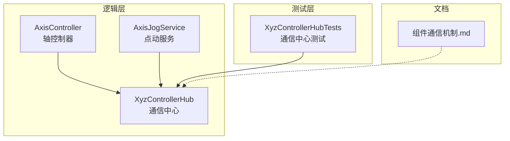
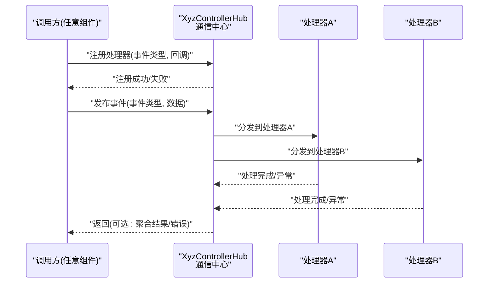
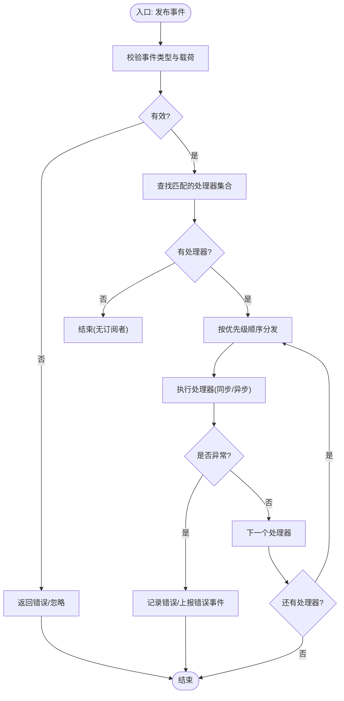
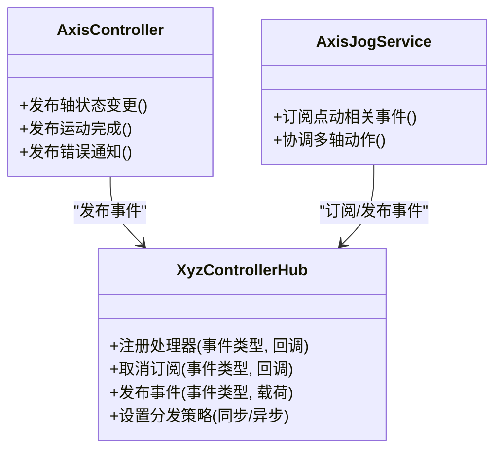

# 通信中心

<cite>
**本文引用的文件**   
- [XyzControllerHub.cs](file://src/XyzController/Logic/XyzControllerHub.cs)
- [AxisController.cs](file://src/XyzController/Logic/AxisController.cs)
- [AxisJogService.cs](file://src/XyzController/Logic/AxisJogService.cs)
- [XyzControllerHubTests.cs](file://src/XyzController.Tests/Tests/XyzControllerHubTests.cs)
- [组件通信机制.md](file://src/content/核心架构设计/组件通信机制.md)
</cite>

## 目录
1. [简介](#简介)
2. [项目结构](#项目结构)
3. [核心组件](#核心组件)
4. [架构总览](#架构总览)
5. [详细组件分析](#详细组件分析)
6. [依赖关系分析](#依赖关系分析)
7. [性能考虑](#性能考虑)
8. [故障排查指南](#故障排查指南)
9. [结论](#结论)
10. [附录](#附录)

## 简介
本设计文档围绕 XyzControllerHub 通信中心，系统化阐述其事件驱动架构的实现原理与工程实践。重点覆盖：
- 消息发布订阅模式的设计与实现
- 事件类型定义与数据结构规范
- 处理器注册机制与生命周期管理
- 组件间解耦通信的设计理念与落地细节
- 典型事件（轴状态变更、运动完成、错误通知等）的传递格式
- 如何注册事件处理器、发送自定义消息与处理异步回调
- 性能优化策略、内存管理与错误处理机制
- 扩展新事件类型的指导原则

## 项目结构
本项目采用分层与按功能域组织相结合的结构。与通信中心直接相关的核心代码位于 Logic 层，测试位于 Tests 层，配套设计说明位于 content 文档中。

图表来源
- [XyzControllerHub.cs](file://src/XyzController/Logic/XyzControllerHub.cs)
- [AxisController.cs](file://src/XyzController/Logic/AxisController.cs)
- [AxisJogService.cs](file://src/XyzController/Logic/AxisJogService.cs)
- [XyzControllerHubTests.cs](file://src/XyzController.Tests/Tests/XyzControllerHubTests.cs)
- [组件通信机制.md](file://src/content/核心架构设计/组件通信机制.md)

章节来源
- [XyzControllerHub.cs](file://src/XyzController/Logic/XyzControllerHub.cs)
- [AxisController.cs](file://src/XyzController/Logic/AxisController.cs)
- [AxisJogService.cs](file://src/XyzController/Logic/AxisJogService.cs)
- [XyzControllerHubTests.cs](file://src/XyzController.Tests/Tests/XyzControllerHubTests.cs)
- [组件通信机制.md](file://src/content/核心架构设计/组件通信机制.md)

## 核心组件
- 通信中心（XyzControllerHub）
  - 职责：提供全局事件总线能力，负责事件类型注册、处理器订阅/取消订阅、消息分发与调度。
  - 关键能力：
    - 事件类型枚举或常量定义（用于区分不同业务事件）
    - 处理器注册表（支持多订阅者、优先级或过滤条件）
    - 同步/异步分发器（支持线程切换与背压控制）
    - 生命周期管理（初始化、销毁、资源清理）
- 轴控制器（AxisController）
  - 职责：封装单轴控制逻辑，通过通信中心发布轴状态变更、运动完成、错误通知等事件。
- 点动服务（AxisJogService）
  - 职责：协调多轴点动流程，订阅并响应相关事件，触发后续动作。
- 测试套件（XyzControllerHubTests）
  - 职责：验证事件注册、分发、取消订阅、异常路径与并发场景。

章节来源
- [XyzControllerHub.cs](file://src/XyzController/Logic/XyzControllerHub.cs)
- [AxisController.cs](file://src/XyzController/Logic/AxisController.cs)
- [AxisJogService.cs](file://src/XyzController/Logic/AxisJogService.cs)
- [XyzControllerHubTests.cs](file://src/XyzController.Tests/Tests/XyzControllerHubTests.cs)

## 架构总览
通信中心作为系统内各组件之间的“松耦合枢纽”，采用发布-订阅模型进行事件路由。组件仅关心事件语义，不感知彼此存在，从而提升可维护性与可扩展性。

图表来源
- [XyzControllerHub.cs](file://src/XyzController/Logic/XyzControllerHub.cs)
- [AxisController.cs](file://src/XyzController/Logic/AxisController.cs)
- [AxisJogService.cs](file://src/XyzController/Logic/AxisJogService.cs)

## 详细组件分析

### 事件类型与数据结构
为便于统一管理与序列化传输，建议将事件类型集中定义，并为每类事件约定最小必要字段。以下为常见事件类别及字段建议（以描述为主，避免具体代码片段）：
- 轴状态变更
  - 字段建议：轴标识、目标位置、当前位置、速度、加速度、运行状态、时间戳
- 运动完成
  - 字段建议：轴标识、运动结果码、耗时、最终位置、误差
- 错误通知
  - 字段建议：错误级别、错误码、错误消息、来源组件、上下文快照、发生时间
- 自定义消息
  - 字段建议：消息类型、载荷对象、优先级、超时、重试次数

章节来源
- [XyzControllerHub.cs](file://src/XyzController/Logic/XyzControllerHub.cs)
- [AxisController.cs](file://src/XyzController/Logic/AxisController.cs)
- [AxisJogService.cs](file://src/XyzController/Logic/AxisJogService.cs)

### 处理器注册机制
- 注册接口
  - 支持按事件类型注册处理器，允许重复注册时覆盖或合并策略
  - 支持指定执行上下文（如 UI 线程、后台线程）
- 取消订阅
  - 提供显式取消订阅方法，防止内存泄漏
- 优先级与过滤
  - 可按优先级排序处理器，或在分发前基于事件数据进行过滤

章节来源
- [XyzControllerHub.cs](file://src/XyzController/Logic/XyzControllerHub.cs)
- [XyzControllerHubTests.cs](file://src/XyzController.Tests/Tests/XyzControllerHubTests.cs)

### 事件分发与异步回调
- 同步分发
  - 适用于轻量、快速处理；需保证处理器无阻塞
- 异步分发
  - 使用任务队列或线程池，避免阻塞发布者
  - 支持回调链与错误传播
- 背压与限流
  - 当处理器消费慢时，采用队列长度限制或丢弃策略，保障系统稳定

章节来源
- [XyzControllerHub.cs](file://src/XyzController/Logic/XyzControllerHub.cs)
- [AxisJogService.cs](file://src/XyzController/Logic/AxisJogService.cs)

### 组件间解耦通信
- 设计理念
  - 组件只依赖事件契约，不依赖具体实现
  - 通过通信中心屏蔽组件间的直接耦合
- 实现要点
  - 事件命名遵循领域语义
  - 载荷对象不可变或深拷贝，避免副作用
  - 错误通过事件或回调上报，而非异常冒泡

章节来源
- [组件通信机制.md](file://src/content/核心架构设计/组件通信机制.md)
- [XyzControllerHub.cs](file://src/XyzController/Logic/XyzControllerHub.cs)

### 示例：注册事件处理器、发送消息与处理异步回调
- 注册处理器
  - 在应用启动阶段，向通信中心注册对特定事件的处理器
  - 建议在容器或模块初始化中完成注册，确保生命周期一致
- 发送自定义消息
  - 通过通信中心的发布接口发送事件，附带结构化载荷
- 处理异步回调
  - 处理器内部可使用异步方法，并在完成后更新状态或触发下一事件

章节来源
- [XyzControllerHubTests.cs](file://src/XyzController.Tests/Tests/XyzControllerHubTests.cs)
- [XyzControllerHub.cs](file://src/XyzController/Logic/XyzControllerHub.cs)

### 流程图：事件分发主流程

图表来源
- [XyzControllerHub.cs](file://src/XyzController/Logic/XyzControllerHub.cs)

## 依赖关系分析
通信中心与轴控制器、点动服务之间存在明确的事件依赖关系。下图展示主要依赖方向与交互边界。

图表来源
- [XyzControllerHub.cs](file://src/XyzController/Logic/XyzControllerHub.cs)
- [AxisController.cs](file://src/XyzController/Logic/AxisController.cs)
- [AxisJogService.cs](file://src/XyzController/Logic/AxisJogService.cs)

章节来源
- [XyzControllerHub.cs](file://src/XyzController/Logic/XyzControllerHub.cs)
- [AxisController.cs](file://src/XyzController/Logic/AxisController.cs)
- [AxisJogService.cs](file://src/XyzController/Logic/AxisJogService.cs)

## 性能考虑
- 事件载荷大小控制
  - 避免在大事件中传递冗余数据，必要时采用引用或分片
- 分发策略选择
  - 高频事件优先异步分发，降低发布者延迟
- 队列与背压
  - 合理设置队列容量与丢弃策略，防止内存暴涨
- 线程模型
  - 明确 UI 线程与后台线程边界，避免跨线程访问导致额外开销
- 缓存与复用
  - 对热点处理器或事件类型做轻量缓存，减少查找成本

[本节为通用性能建议，无需源码引用]

## 故障排查指南
- 常见问题定位
  - 未收到事件：检查处理器是否正确注册、事件类型是否匹配、是否存在取消订阅
  - 处理器异常：查看错误日志与错误事件载荷，确认上下文信息是否完整
  - 性能问题：监控队列长度、分发耗时、CPU/内存占用
- 调试技巧
  - 启用事件追踪日志，记录事件生命周期
  - 使用测试用例复现问题，逐步缩小范围
- 恢复策略
  - 对关键事件增加重试与幂等处理
  - 对错误事件建立告警与降级路径

章节来源
- [XyzControllerHubTests.cs](file://src/XyzController.Tests/Tests/XyzControllerHubTests.cs)
- [XyzControllerHub.cs](file://src/XyzController/Logic/XyzControllerHub.cs)

## 结论
XyzControllerHub 通信中心通过清晰的事件契约与统一的分发机制，实现了组件间的松耦合通信。借助合理的异步策略、背压控制与错误处理，系统在可扩展性与稳定性之间取得平衡。遵循本文档的扩展原则与实践建议，可高效新增事件类型与处理器，持续演进系统能力。

[本节为总结性内容，无需源码引用]

## 附录

### 扩展新事件类型的指导原则
- 定义事件类型
  - 在事件类型集中新增条目，保持命名一致性
- 定义载荷结构
  - 明确必填字段与可选字段，尽量保持不可变
- 注册处理器
  - 在合适的生命周期阶段注册处理器，避免重复注册
- 发布事件
  - 在业务关键点发布事件，携带必要的上下文信息
- 测试验证
  - 编写单元测试覆盖正常路径与异常路径
  - 验证异步回调与错误传播是否符合预期

章节来源
- [XyzControllerHub.cs](file://src/XyzController/Logic/XyzControllerHub.cs)
- [XyzControllerHubTests.cs](file://src/XyzController.Tests/Tests/XyzControllerHubTests.cs)