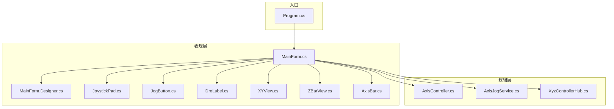
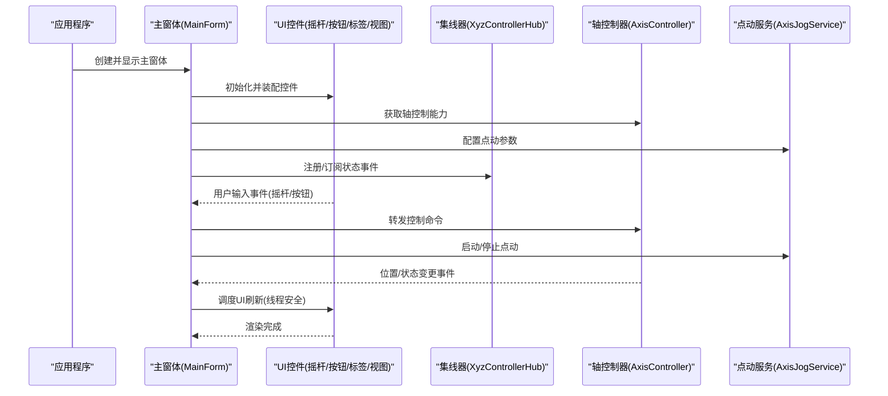
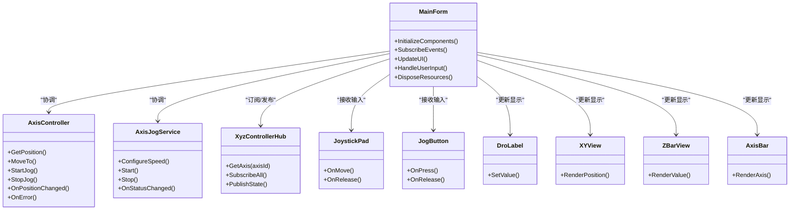
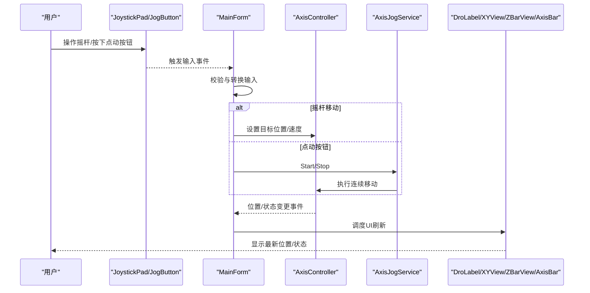
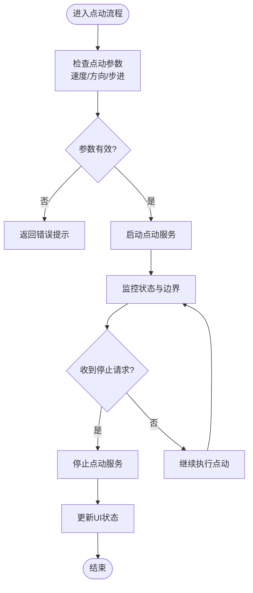
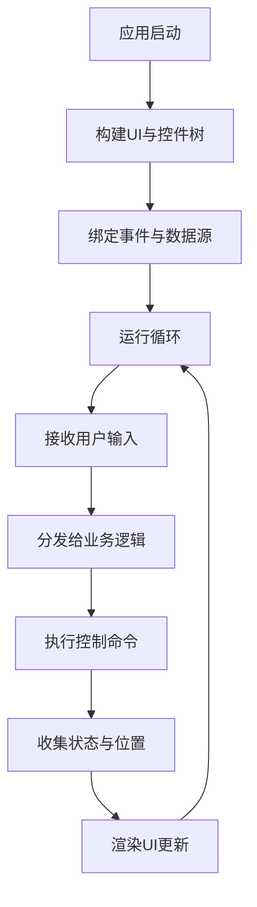
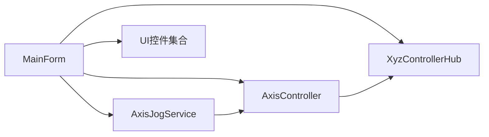

# 主窗体协调器

<cite>
**本文引用的文件**   
- [MainForm.cs](file://src/XyzController/MainForm.cs)
- [MainForm.Designer.cs](file://src/XyzController/MainForm.Designer.cs)
- [Program.cs](file://src/XyzController/Program.cs)
- [AxisController.cs](file://src/XyzController/Logic/AxisController.cs)
- [AxisJogService.cs](file://src/XyzController/Logic/AxisJogService.cs)
- [XyzControllerHub.cs](file://src/XyzController/Logic/XyzControllerHub.cs)
- [JoystickPad.cs](file://src/XyzController.Controls/JoystickPad.cs)
- [JogButton.cs](file://src/XyzController.Controls/JogButton.cs)
- [DroLabel.cs](file://src/XyzController.Controls/DroLabel.cs)
- [XYView.cs](file://src/XyzController.Controls/XYView.cs)
- [ZBarView.cs](file://src/XyzController.Controls/ZBarView.cs)
- [AxisBar.cs](file://src/XyzController.Controls/AxisBar.cs)
</cite>

## 目录
1. [简介](#简介)
2. [项目结构](#项目结构)
3. [核心组件](#核心组件)
4. [架构总览](#架构总览)
5. [详细组件分析](#详细组件分析)
6. [依赖关系分析](#依赖关系分析)
7. [性能考虑](#性能考虑)
8. [故障排查指南](#故障排查指南)
9. [结论](#结论)
10. [附录](#附录)

## 简介
本文件围绕“主窗体协调器”展开，聚焦于 MainForm 类作为应用协调器的设计模式。文档将深入解释：
- 组件生命周期管理：从程序入口到主窗体初始化、控件装配、服务启动与资源释放的完整流程。
- 事件分发机制：用户输入（摇杆、点动按钮等）如何经 UI 层传递至业务逻辑层并驱动硬件控制。
- 数据绑定策略：实时位置、状态、错误信息如何在 AxisController、AxisJogService 与 UI 控件之间同步更新。
- 交互协调：主窗体如何协调 AxisController、AxisJogService 和各种自定义控件（如 JoystickPad、JogButton、DroLabel、XYView、ZBarView、AxisBar）。
- 界面更新与刷新：采用何种机制实现低延迟、线程安全的 UI 刷新与状态同步。
- 扩展指导：如何添加新的控制组件、处理用户输入、响应系统事件；如何进行界面定制与高级开发。

## 项目结构
本项目采用分层组织方式：
- 表现层（UI）：Windows Forms 主窗体及其 Designer 文件，以及一组自定义控件。
- 逻辑层（业务）：轴控制器、点动服务、集线器等核心逻辑。
- 测试层：针对关键逻辑的单元测试。

图表来源
- [Program.cs](file://src/XyzController/Program.cs)
- [MainForm.cs](file://src/XyzController/MainForm.cs)
- [MainForm.Designer.cs](file://src/XyzController/MainForm.Designer.cs)
- [AxisController.cs](file://src/XyzController/Logic/AxisController.cs)
- [AxisJogService.cs](file://src/XyzController/Logic/AxisJogService.cs)
- [XyzControllerHub.cs](file://src/XyzController/Logic/XyzControllerHub.cs)
- [JoystickPad.cs](file://src/XyzController.Controls/JoystickPad.cs)
- [JogButton.cs](file://src/XyzController.Controls/JogButton.cs)
- [DroLabel.cs](file://src/XyzController.Controls/DroLabel.cs)
- [XYView.cs](file://src/XyzController.Controls/XYView.cs)
- [ZBarView.cs](file://src/XyzController.Controls/ZBarView.cs)
- [AxisBar.cs](file://src/XyzController.Controls/AxisBar.cs)

章节来源
- [Program.cs](file://src/XyzController/Program.cs)
- [MainForm.cs](file://src/XyzController/MainForm.cs)
- [MainForm.Designer.cs](file://src/XyzController/MainForm.Designer.cs)

## 核心组件
- 主窗体协调器（MainForm）
  - 职责：装配 UI 控件、订阅/发布事件、维护与 AxisController 和 AxisJogService 的引用、调度 UI 刷新、管理生命周期与资源清理。
  - 关键点：在构造或加载阶段完成控件实例化与绑定；在关闭时释放非托管资源与取消订阅事件。
- 轴控制器（AxisController）
  - 职责：封装对轴的底层控制能力，提供位置读取、运动命令、状态查询等接口；对外暴露属性变化事件以驱动 UI 更新。
- 点动服务（AxisJogService）
  - 职责：处理点动（Jog）模式下的速度、方向、步进等策略；与 AxisController 协作执行连续移动。
- 集线器（XyzControllerHub）
  - 职责：聚合多个轴的控制能力，提供统一的访问入口；可能负责跨轴协调与并发安全。
- 自定义控件
  - JoystickPad：摇杆输入，产生方向与力度事件。
  - JogButton：点动按钮，触发开始/停止点动指令。
  - DroLabel：数字显示标签，展示当前 DRO（数字读数）值。
  - XYView：二维视图，用于可视化 XY 平面位置。
  - ZBarView：Z 轴条形视图，直观显示 Z 轴位置。
  - AxisBar：通用轴条视图，可复用显示任意轴的位置与状态。

章节来源
- [MainForm.cs](file://src/XyzController/MainForm.cs)
- [AxisController.cs](file://src/XyzController/Logic/AxisController.cs)
- [AxisJogService.cs](file://src/XyzController/Logic/AxisJogService.cs)
- [XyzControllerHub.cs](file://src/XyzController/Logic/XyzControllerHub.cs)
- [JoystickPad.cs](file://src/XyzController.Controls/JoystickPad.cs)
- [JogButton.cs](file://src/XyzController.Controls/JogButton.cs)
- [DroLabel.cs](file://src/XyzController.Controls/DroLabel.cs)
- [XYView.cs](file://src/XyzController.Controls/XYView.cs)
- [ZBarView.cs](file://src/XyzController.Controls/ZBarView.cs)
- [AxisBar.cs](file://src/XyzController.Controls/AxisBar.cs)

## 架构总览
下图展示了主窗体协调器在整体架构中的角色与交互路径。

图表来源
- [MainForm.cs](file://src/XyzController/MainForm.cs)
- [XyzControllerHub.cs](file://src/XyzController/Logic/XyzControllerHub.cs)
- [AxisController.cs](file://src/XyzController/Logic/AxisController.cs)
- [AxisJogService.cs](file://src/XyzController/Logic/AxisJogService.cs)
- [JoystickPad.cs](file://src/XyzController.Controls/JoystickPad.cs)
- [JogButton.cs](file://src/XyzController.Controls/JogButton.cs)
- [DroLabel.cs](file://src/XyzController.Controls/DroLabel.cs)
- [XYView.cs](file://src/XyzController.Controls/XYView.cs)
- [ZBarView.cs](file://src/XyzController.Controls/ZBarView.cs)
- [AxisBar.cs](file://src/XyzController.Controls/AxisBar.cs)

## 详细组件分析

### 主窗体协调器（MainForm）
- 设计模式
  - 协调器（Facade/Coordinator）：统一入口，屏蔽底层复杂性，为 UI 提供简洁的调用接口。
  - 观察者（Observer）：订阅 AxisController/AxisJogService 的状态事件，驱动 UI 更新。
  - 工厂（Factory）：按需创建或配置控件与服务实例。
- 生命周期管理
  - 初始化：在构造或 Load 事件中完成控件实例化、事件订阅、服务配置。
  - 运行期：保持对服务的弱引用或受控引用，避免内存泄漏。
  - 销毁：在 FormClosing 中取消订阅、释放资源、停止后台任务。
- 事件分发机制
  - 用户输入：JoystickPad 的 Move/Release、JogButton 的 Press/Release 等事件由 MainForm 捕获并转换为业务命令。
  - 状态回调：AxisController 的位置/错误/连接状态事件通过 MainForm 路由到各 UI 控件。
- 数据绑定策略
  - 单向绑定为主：从 AxisController 到 UI 的只读展示（DroLabel、XYView、ZBarView、AxisBar）。
  - 双向交互：UI 输入经 MainForm 校验后下发给 AxisController/AxisJogService。
  - 线程安全：所有 UI 更新通过 Windows Forms 的线程调度机制进行，确保跨线程安全。
- 界面更新与刷新
  - 使用合适的刷新频率，避免频繁重绘导致卡顿。
  - 批量更新：合并多次状态变更，减少 UI 重绘次数。
  - 节流/去抖：对高频事件（如摇杆移动）进行节流，降低负载。
- 配置管理与资源清理
  - 配置：集中管理轴参数、点动速度、视图缩放等。
  - 清理：在退出时停止点动、断开连接、释放绘图资源。

图表来源
- [MainForm.cs](file://src/XyzController/MainForm.cs)
- [AxisController.cs](file://src/XyzController/Logic/AxisController.cs)
- [AxisJogService.cs](file://src/XyzController/Logic/AxisJogService.cs)
- [XyzControllerHub.cs](file://src/XyzController/Logic/XyzControllerHub.cs)
- [JoystickPad.cs](file://src/XyzController.Controls/JoystickPad.cs)
- [JogButton.cs](file://src/XyzController.Controls/JogButton.cs)
- [DroLabel.cs](file://src/XyzController.Controls/DroLabel.cs)
- [XYView.cs](file://src/XyzController.Controls/XYView.cs)
- [ZBarView.cs](file://src/XyzController.Controls/ZBarView.cs)
- [AxisBar.cs](file://src/XyzController.Controls/AxisBar.cs)

章节来源
- [MainForm.cs](file://src/XyzController/MainForm.cs)
- [MainForm.Designer.cs](file://src/XyzController/MainForm.Designer.cs)

### 用户输入到控制的序列流程

图表来源
- [JoystickPad.cs](file://src/XyzController.Controls/JoystickPad.cs)
- [JogButton.cs](file://src/XyzController.Controls/JogButton.cs)
- [MainForm.cs](file://src/XyzController/MainForm.cs)
- [AxisController.cs](file://src/XyzController/Logic/AxisController.cs)
- [AxisJogService.cs](file://src/XyzController/Logic/AxisJogService.cs)
- [DroLabel.cs](file://src/XyzController.Controls/DroLabel.cs)
- [XYView.cs](file://src/XyzController.Controls/XYView.cs)
- [ZBarView.cs](file://src/XyzController.Controls/ZBarView.cs)
- [AxisBar.cs](file://src/XyzController.Controls/AxisBar.cs)

### 复杂逻辑流程图：点动控制

图表来源
- [AxisJogService.cs](file://src/XyzController/Logic/AxisJogService.cs)
- [AxisController.cs](file://src/XyzController/Logic/AxisController.cs)
- [MainForm.cs](file://src/XyzController/MainForm.cs)

章节来源
- [AxisJogService.cs](file://src/XyzController/Logic/AxisJogService.cs)
- [AxisController.cs](file://src/XyzController/Logic/AxisController.cs)
- [MainForm.cs](file://src/XyzController/MainForm.cs)

### 概念性概览
以下图示为概念性工作流程，不直接映射具体代码结构，用于帮助初学者理解整体交互思路。

[此图为概念性说明，无需图表来源]

## 依赖关系分析
- 松耦合原则
  - MainForm 仅依赖抽象接口或稳定的公共 API，避免与底层实现强耦合。
  - 通过 XyzControllerHub 聚合多轴能力，降低 MainForm 的直接依赖复杂度。
- 内聚性
  - AxisController 专注单轴控制；AxisJogService 专注点动策略；MainForm 专注协调与 UI 同步。
- 外部依赖与集成点
  - Windows Forms 消息泵与线程模型。
  - 可能的硬件通信层（通过 AxisController 抽象）。
- 潜在循环依赖
  - 应避免 UI 反向依赖业务层的内部实现细节，仅通过事件与接口交互。

图表来源
- [MainForm.cs](file://src/XyzController/MainForm.cs)
- [AxisController.cs](file://src/XyzController/Logic/AxisController.cs)
- [AxisJogService.cs](file://src/XyzController/Logic/AxisJogService.cs)
- [XyzControllerHub.cs](file://src/XyzController/Logic/XyzControllerHub.cs)

章节来源
- [MainForm.cs](file://src/XyzController/MainForm.cs)
- [AxisController.cs](file://src/XyzController/Logic/AxisController.cs)
- [AxisJogService.cs](file://src/XyzController/Logic/AxisJogService.cs)
- [XyzControllerHub.cs](file://src/XyzController/Logic/XyzControllerHub.cs)

## 性能考虑
- 事件节流与去抖
  - 对高频输入（摇杆移动）进行节流，避免过多命令下发与 UI 重绘。
- 批量更新
  - 合并多次状态变更，减少 UI 刷新次数，提升渲染效率。
- 异步与线程安全
  - 使用 Windows Forms 的线程调度机制更新 UI，避免跨线程异常。
- 资源管理
  - 及时释放绘图对象、取消订阅事件、停止后台任务，防止内存泄漏。
- 渲染优化
  - 双缓冲绘制、区域裁剪、按需重绘，降低 CPU/GPU 占用。

[本节为通用性能建议，无需章节来源]

## 故障排查指南
- 常见问题定位
  - UI 无刷新：检查事件订阅是否生效、线程调度是否正确、刷新频率是否过高。
  - 控制无响应：确认输入事件是否被正确捕获、参数校验是否通过、业务逻辑是否抛出异常。
  - 资源泄漏：确认在关闭时取消订阅、释放对象、停止服务。
- 调试技巧
  - 在关键路径增加日志输出（事件触发、命令下发、状态回调）。
  - 使用断点跟踪事件链路与数据流。
  - 隔离问题：先验证 AxisController 与 AxisJogService 的行为，再检查 UI 绑定。
- 恢复策略
  - 自动重试与降级：在网络或硬件不可用时提供回退方案。
  - 安全停机：在异常情况下立即停止点动与运动，确保设备安全。

章节来源
- [MainForm.cs](file://src/XyzController/MainForm.cs)
- [AxisController.cs](file://src/XyzController/Logic/AxisController.cs)
- [AxisJogService.cs](file://src/XyzController/Logic/AxisJogService.cs)

## 结论
MainForm 作为主窗体协调器，承担了装配 UI、订阅事件、调度刷新与管理生命周期的核心职责。通过与 AxisController、AxisJogService 及 XyzControllerHub 的协作，实现了用户输入到控制命令的高效转化与状态反馈。遵循松耦合、高内聚的设计原则，结合事件驱动与线程安全的 UI 更新策略，能够支撑复杂的实时控制场景。对于扩展开发，建议在保持现有接口稳定的前提下，新增控件或服务并通过 MainForm 进行集成。

[本节为总结性内容，无需章节来源]

## 附录

### 扩展开发指导原则
- 添加新控制组件
  - 定义清晰的输入事件与输出状态。
  - 在 MainForm 中注册事件处理器，并将输入转换为业务命令。
  - 如需显示状态，提供对应的 UI 更新方法。
- 处理用户输入
  - 统一输入校验与转换逻辑，避免重复代码。
  - 对高频输入进行节流与去抖。
- 响应系统事件
  - 订阅 AxisController/AxisJogService 的状态事件，并在 UI 线程上安全更新。
- 界面定制
  - 通过配置对象集中管理外观与行为参数。
  - 使用样式与主题机制，便于切换不同视觉风格。
- 高级定制技巧
  - 引入插件化架构，动态加载新控件或服务。
  - 使用依赖注入容器管理实例生命周期与解耦。
  - 引入缓存与预测渲染，提升交互流畅度。

[本节为通用指导，无需章节来源]