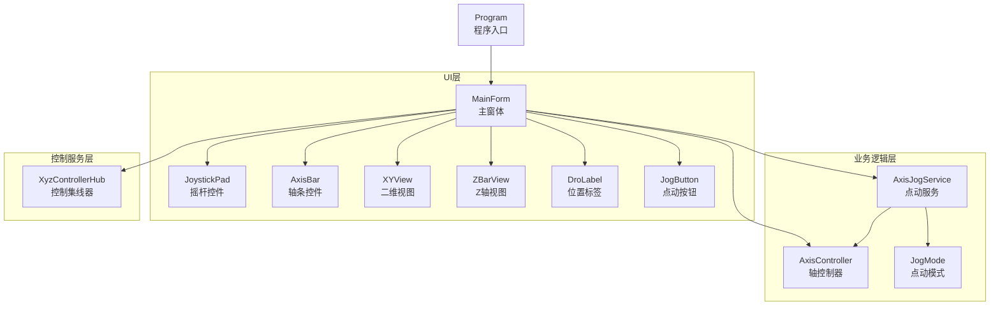
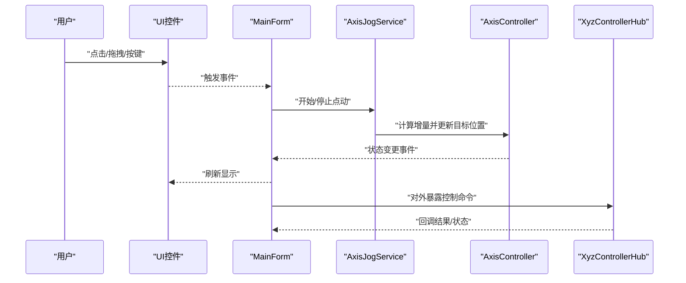
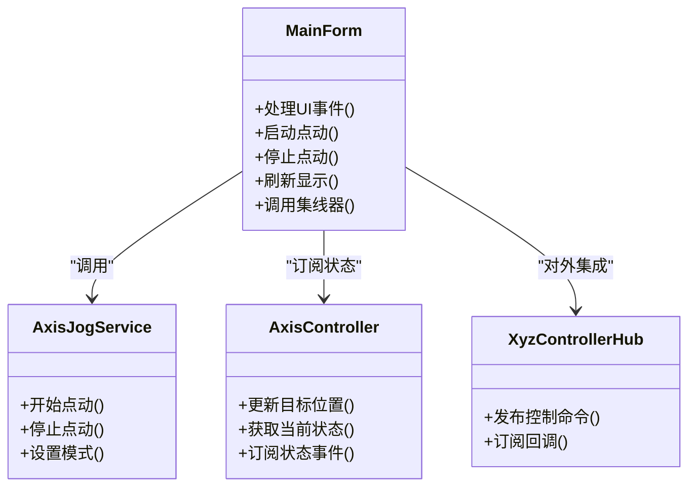
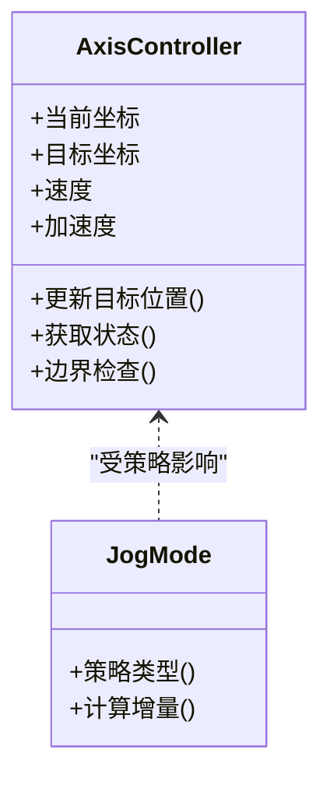
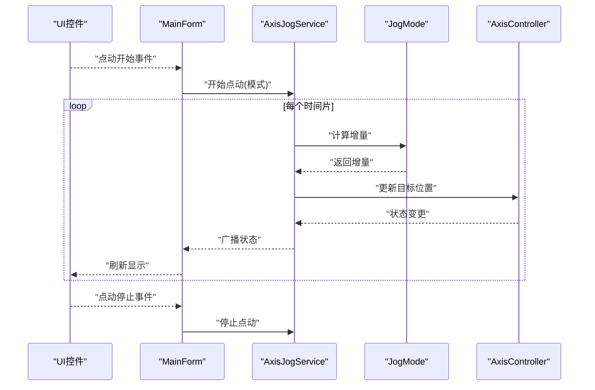
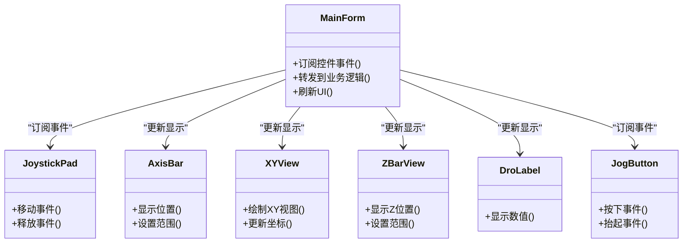
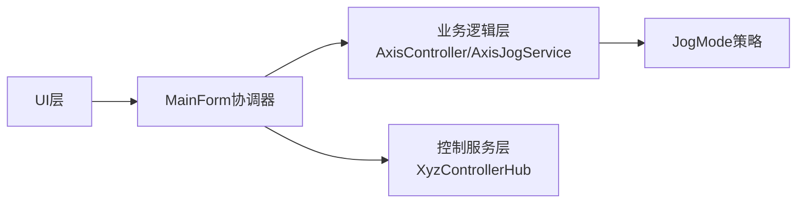

# 核心架构设计

<cite>
**本文引用的文件**   
- [MainForm.cs](file://src/XyzController/MainForm.cs)
- [AxisController.cs](file://src/XyzController/Logic/AxisController.cs)
- [AxisJogService.cs](file://src/XyzController/Logic/AxisJogService.cs)
- [JogMode.cs](file://src/XyzController/Logic/JogMode.cs)
- [XyzControllerHub.cs](file://src/XyzController/Logic/XyzControllerHub.cs)
- [Program.cs](file://src/XyzController/Program.cs)
- [JoystickPad.cs](file://src/XyzController.Controls/JoystickPad.cs)
- [AxisBar.cs](file://src/XyzController.Controls/AxisBar.cs)
- [XYView.cs](file://src/XyzController.Controls/XYView.cs)
- [ZBarView.cs](file://src/XyzController.Controls/ZBarView.cs)
- [DroLabel.cs](file://src/XyzController.Controls/DroLabel.cs)
- [JogButton.cs](file://src/XyzController.Controls/JogButton.cs)
- [MathHelper.cs](file://src/XyzController.Controls/MathHelper.cs)
- [PaintHelper.cs](file://src/XyzController.Controls/PaintHelper.cs)
- [AxisControllerTests.cs](file://src/XyzController.Tests/Tests/AxisControllerTests.cs)
- [AxisJogServiceTests.cs](file://src/XyzController.Tests/Tests/AxisJogServiceTests.cs)
- [XyzControllerHubTests.cs](file://src/XyzController.Tests/Tests/XyzControllerHubTests.cs)
</cite>

## 目录
1. [简介](#简介)
2. [项目结构](#项目结构)
3. [核心组件](#核心组件)
4. [架构总览](#架构总览)
5. [详细组件分析](#详细组件分析)
6. [依赖关系分析](#依赖关系分析)
7. [性能考虑](#性能考虑)
8. [故障排查指南](#故障排查指南)
9. [结论](#结论)
10. [附录](#附录)

## 简介
本文件面向初学者与有经验的开发者，系统化阐述XYZ控制器应用的核心架构设计。重点覆盖分层架构（UI层、业务逻辑层、控制服务层）与组件化设计原则；深入解析MainForm主窗体作为协调器的职责、AxisController轴控制器的核心能力，以及AxisJogService点动服务的实现机制。文档包含架构图与组件关系图，解释数据流向与事件驱动模式，并给出关键模式的代码片段路径，帮助读者快速理解与落地实践。

## 项目结构
项目采用清晰的分层与组件化组织：
- UI层：Windows Forms主窗体与自定义控件，负责用户交互与可视化展示
- 业务逻辑层：轴控制与点动策略等核心算法与状态管理
- 控制服务层：对外暴露的控制入口与集成点（如集线器）
- 测试层：针对核心组件的单元测试

图表来源
- [Program.cs](file://src/XyzController/Program.cs)
- [MainForm.cs](file://src/XyzController/MainForm.cs)
- [AxisController.cs](file://src/XyzController/Logic/AxisController.cs)
- [AxisJogService.cs](file://src/XyzController/Logic/AxisJogService.cs)
- [JogMode.cs](file://src/XyzController/Logic/JogMode.cs)
- [XyzControllerHub.cs](file://src/XyzController/Logic/XyzControllerHub.cs)
- [JoystickPad.cs](file://src/XyzController.Controls/JoystickPad.cs)
- [AxisBar.cs](file://src/XyzController.Controls/AxisBar.cs)
- [XYView.cs](file://src/XyzController.Controls/XYView.cs)
- [ZBarView.cs](file://src/XyzController.Controls/ZBarView.cs)
- [DroLabel.cs](file://src/XyzController.Controls/DroLabel.cs)
- [JogButton.cs](file://src/XyzController.Controls/JogButton.cs)

章节来源
- [Program.cs](file://src/XyzController/Program.cs)
- [MainForm.cs](file://src/XyzController/MainForm.cs)

## 核心组件
- MainForm主窗体：作为协调器，统一编排UI事件到业务逻辑与服务层的调用，维护视图与模型的状态同步
- AxisController轴控制器：封装单轴或多轴的运动控制状态机、速度/加速度参数、目标位置计算与安全边界检查
- AxisJogService点动服务：提供连续点动能力，基于时间片或事件驱动更新位移增量，支持多种点动模式
- JogMode点动模式：定义点动行为策略（如步进、连续、变速等），供点动服务选择
- XyzControllerHub控制集线器：对外暴露统一的控制接口，聚合多个轴控制器的操作，便于扩展与集成
- UI控件族：JoystickPad、AxisBar、XYView、ZBarView、DroLabel、JogButton等，承载输入与可视化反馈

章节来源
- [MainForm.cs](file://src/XyzController/MainForm.cs)
- [AxisController.cs](file://src/XyzController/Logic/AxisController.cs)
- [AxisJogService.cs](file://src/XyzController/Logic/AxisJogService.cs)
- [JogMode.cs](file://src/XyzController/Logic/JogMode.cs)
- [XyzControllerHub.cs](file://src/XyzController/Logic/XyzControllerHub.cs)
- [JoystickPad.cs](file://src/XyzController.Controls/JoystickPad.cs)
- [AxisBar.cs](file://src/XyzController.Controls/AxisBar.cs)
- [XYView.cs](file://src/XyzController.Controls/XYView.cs)
- [ZBarView.cs](file://src/XyzController.Controls/ZBarView.cs)
- [DroLabel.cs](file://src/XyzController.Controls/DroLabel.cs)
- [JogButton.cs](file://src/XyzController.Controls/JogButton.cs)

## 架构总览
系统遵循分层架构与事件驱动模式：
- UI层通过事件将用户意图传递给MainForm
- MainForm作为协调器，调用AxisController与AxisJogService执行控制逻辑
- AxisJogService根据JogMode策略生成位移增量，驱动AxisController更新状态
- XyzControllerHub提供统一入口，便于外部系统集成与扩展
- 数据流从UI事件出发，经协调器进入业务逻辑，最终回写至UI进行可视化反馈

图表来源
- [MainForm.cs](file://src/XyzController/MainForm.cs)
- [AxisJogService.cs](file://src/XyzController/Logic/AxisJogService.cs)
- [AxisController.cs](file://src/XyzController/Logic/AxisController.cs)
- [XyzControllerHub.cs](file://src/XyzController/Logic/XyzControllerHub.cs)

## 详细组件分析

### MainForm主窗体（协调器）
- 角色定位：协调UI事件与业务逻辑，避免在UI中直接编写复杂控制算法
- 主要职责：
  - 订阅UI控件的事件（如摇杆移动、按钮按下）
  - 调用AxisJogService启动/停止点动
  - 订阅AxisController的状态变更事件，刷新UI显示
  - 通过XyzControllerHub对外发布控制指令
- 设计权衡：
  - 将“控制流程编排”集中在协调器，降低UI耦合度
  - 使用事件驱动减少轮询开销，提升响应性

章节来源
- [MainForm.cs](file://src/XyzController/MainForm.cs)

#### 类关系图（MainForm与其依赖）

图表来源
- [MainForm.cs](file://src/XyzController/MainForm.cs)
- [AxisJogService.cs](file://src/XyzController/Logic/AxisJogService.cs)
- [AxisController.cs](file://src/XyzController/Logic/AxisController.cs)
- [XyzControllerHub.cs](file://src/XyzController/Logic/XyzControllerHub.cs)

### AxisController轴控制器
- 核心功能：
  - 维护轴的当前位置、目标位置、速度与加速度参数
  - 计算运动轨迹与步长，确保不超过安全边界
  - 暴露状态变更事件，供UI与服务层订阅
- 数据结构与复杂度：
  - 状态字段为标量或向量，更新操作通常为O(1)
  - 边界检查与约束计算为常数时间
- 错误处理：
  - 对非法输入进行校验并返回错误状态
  - 在越界时采取保护策略（如限制最大速度或立即停止）

章节来源
- [AxisController.cs](file://src/XyzController/Logic/AxisController.cs)

#### 类关系图（AxisController与其依赖）

图表来源
- [AxisController.cs](file://src/XyzController/Logic/AxisController.cs)
- [JogMode.cs](file://src/XyzController/Logic/JogMode.cs)

### AxisJogService点动服务
- 实现机制：
  - 基于时间片或事件驱动循环，按JogMode策略计算位移增量
  - 调用AxisController更新目标位置，并触发状态事件
  - 支持多模式切换（如步进、连续、变速）
- 数据流向：
  - UI事件 → MainForm → AxisJogService → AxisController → 状态事件 → MainForm → UI刷新
- 优化机会：
  - 使用定时器或异步任务提高精度与稳定性
  - 对高频事件进行节流，避免UI卡顿

章节来源
- [AxisJogService.cs](file://src/XyzController/Logic/AxisJogService.cs)
- [JogMode.cs](file://src/XyzController/Logic/JogMode.cs)

#### 序列图（点动流程）

图表来源
- [MainForm.cs](file://src/XyzController/MainForm.cs)
- [AxisJogService.cs](file://src/XyzController/Logic/AxisJogService.cs)
- [JogMode.cs](file://src/XyzController/Logic/JogMode.cs)
- [AxisController.cs](file://src/XyzController/Logic/AxisController.cs)

### JogMode点动模式
- 设计要点：
  - 抽象不同点动策略，便于扩展新行为
  - 提供统一的增量计算接口，供点动服务调用
- 适用场景：
  - 步进模式：固定步长
  - 连续模式：持续累加
  - 变速模式：根据输入强度调整速度

章节来源
- [JogMode.cs](file://src/XyzController/Logic/JogMode.cs)

### XyzControllerHub控制集线器
- 职责：
  - 聚合多个轴控制器的操作，提供统一API
  - 管理外部集成回调，解耦上层系统与底层控制
- 集成点：
  - 对外暴露命令发布与状态订阅接口
  - 支持插件式扩展新的控制模块

章节来源
- [XyzControllerHub.cs](file://src/XyzController/Logic/XyzControllerHub.cs)

### UI控件族（组件化设计）
- 组件职责：
  - JoystickPad：接收用户摇杆输入，转换为方向与力度
  - AxisBar：可视化单轴位置与范围
  - XYView：二维平面视图，展示XY轴相对位置
  - ZBarView：Z轴高度可视化
  - DroLabel：显示实时位置数值
  - JogButton：触发点动操作的快捷按钮
- 设计原则：
  - 高内聚低耦合：每个控件专注单一职责
  - 事件驱动：通过事件通知父窗体，避免紧耦合
  - 可复用：控件可在不同界面复用

章节来源
- [JoystickPad.cs](file://src/XyzController.Controls/JoystickPad.cs)
- [AxisBar.cs](file://src/XyzController.Controls/AxisBar.cs)
- [XYView.cs](file://src/XyzController.Controls/XYView.cs)
- [ZBarView.cs](file://src/XyzController.Controls/ZBarView.cs)
- [DroLabel.cs](file://src/XyzController.Controls/DroLabel.cs)
- [JogButton.cs](file://src/XyzController.Controls/JogButton.cs)

#### 类关系图（UI控件与MainForm）

图表来源
- [MainForm.cs](file://src/XyzController/MainForm.cs)
- [JoystickPad.cs](file://src/XyzController.Controls/JoystickPad.cs)
- [AxisBar.cs](file://src/XyzController.Controls/AxisBar.cs)
- [XYView.cs](file://src/XyzController.Controls/XYView.cs)
- [ZBarView.cs](file://src/XyzController.Controls/ZBarView.cs)
- [DroLabel.cs](file://src/XyzController.Controls/DroLabel.cs)
- [JogButton.cs](file://src/XyzController.Controls/JogButton.cs)

## 依赖关系分析
- 松耦合：UI层仅依赖MainForm，不直接访问业务逻辑
- 明确边界：业务逻辑层不感知UI细节，通过事件与接口通信
- 可扩展：XyzControllerHub作为集成点，便于新增控制模块
- 潜在风险：需避免MainForm过度膨胀，必要时拆分子协调器

图表来源
- [MainForm.cs](file://src/XyzController/MainForm.cs)
- [AxisController.cs](file://src/XyzController/Logic/AxisController.cs)
- [AxisJogService.cs](file://src/XyzController/Logic/AxisJogService.cs)
- [JogMode.cs](file://src/XyzController/Logic/JogMode.cs)
- [XyzControllerHub.cs](file://src/XyzController/Logic/XyzControllerHub.cs)

章节来源
- [MainForm.cs](file://src/XyzController/MainForm.cs)
- [AxisController.cs](file://src/XyzController/Logic/AxisController.cs)
- [AxisJogService.cs](file://src/XyzController/Logic/AxisJogService.cs)
- [JogMode.cs](file://src/XyzController/Logic/JogMode.cs)
- [XyzControllerHub.cs](file://src/XyzController/Logic/XyzControllerHub.cs)

## 性能考虑
- 事件驱动优于轮询：减少CPU占用，提升响应性
- 节流与去抖：对高频UI事件进行节流，避免频繁刷新导致卡顿
- 增量计算优化：在点动服务中使用高效算法计算位移增量
- 线程模型：将耗时操作移至后台线程，UI线程仅负责渲染

[本节为通用指导，无需特定文件引用]

## 故障排查指南
- 常见问题：
  - 点动无响应：检查MainForm是否正确订阅UI事件并调用AxisJogService
  - 位置不更新：确认AxisController是否触发状态事件且MainForm已刷新UI
  - 越界报错：验证AxisController的边界检查逻辑与JogMode的增量计算
- 调试建议：
  - 在关键节点添加日志输出
  - 使用单元测试复现问题路径
  - 逐步缩小范围，定位具体组件

章节来源
- [AxisControllerTests.cs](file://src/XyzController.Tests/Tests/AxisControllerTests.cs)
- [AxisJogServiceTests.cs](file://src/XyzController.Tests/Tests/AxisJogServiceTests.cs)
- [XyzControllerHubTests.cs](file://src/XyzController.Tests/Tests/XyzControllerHubTests.cs)

## 结论
本架构通过分层设计与组件化原则，实现了清晰的职责划分与良好的可扩展性。MainForm作为协调器有效解耦了UI与业务逻辑，AxisController与AxisJogService共同提供了稳定可靠的轴控制能力。事件驱动模式提升了系统的响应性与可维护性。建议在后续迭代中继续强化单元测试覆盖率与性能监控，以支撑更复杂的控制需求。

[本节为总结性内容，无需特定文件引用]

## 附录
- 关键代码片段路径（用于快速定位实现）：
  - MainForm协调器入口与事件绑定：[MainForm.cs](file://src/XyzController/MainForm.cs)
  - AxisController核心控制逻辑：[AxisController.cs](file://src/XyzController/Logic/AxisController.cs)
  - AxisJogService点动服务实现：[AxisJogService.cs](file://src/XyzController/Logic/AxisJogService.cs)
  - JogMode策略定义：[JogMode.cs](file://src/XyzController/Logic/JogMode.cs)
  - XyzControllerHub集成点：[XyzControllerHub.cs](file://src/XyzController/Logic/XyzControllerHub.cs)
  - UI控件实现示例：
    - [JoystickPad.cs](file://src/XyzController.Controls/JoystickPad.cs)
    - [AxisBar.cs](file://src/XyzController.Controls/AxisBar.cs)
    - [XYView.cs](file://src/XyzController.Controls/XYView.cs)
    - [ZBarView.cs](file://src/XyzController.Controls/ZBarView.cs)
    - [DroLabel.cs](file://src/XyzController.Controls/DroLabel.cs)
    - [JogButton.cs](file://src/XyzController.Controls/JogButton.cs)
  - 辅助工具：
    - [MathHelper.cs](file://src/XyzController.Controls/MathHelper.cs)
    - [PaintHelper.cs](file://src/XyzController.Controls/PaintHelper.cs)
  - 程序入口：
    - [Program.cs](file://src/XyzController/Program.cs)