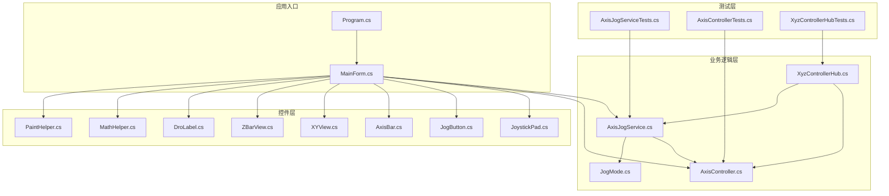
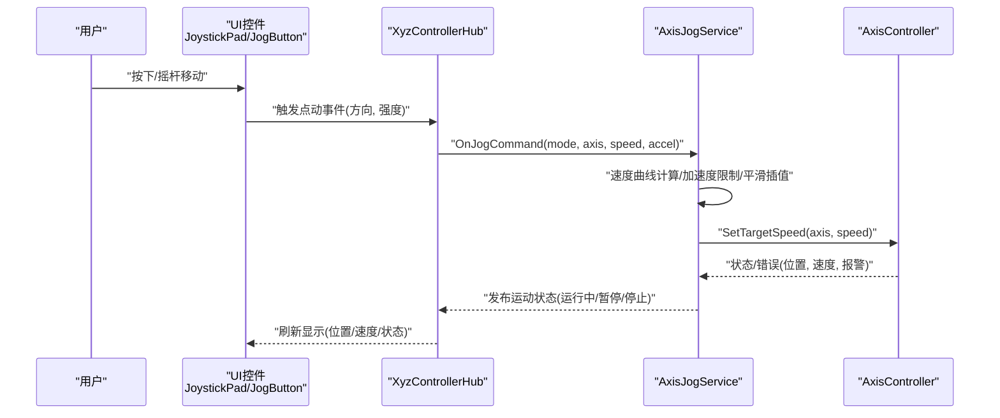
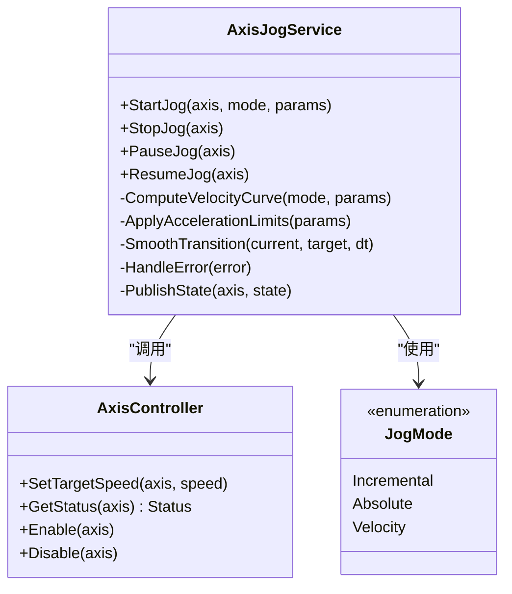
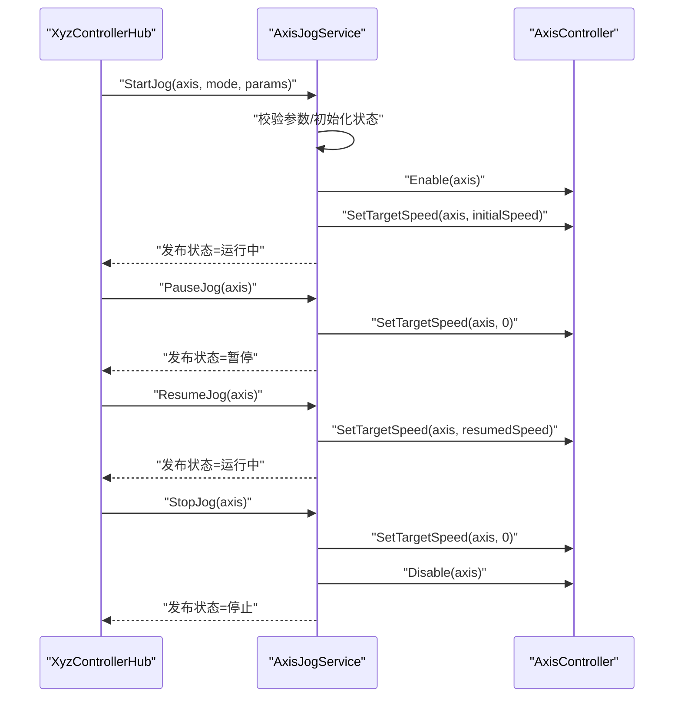
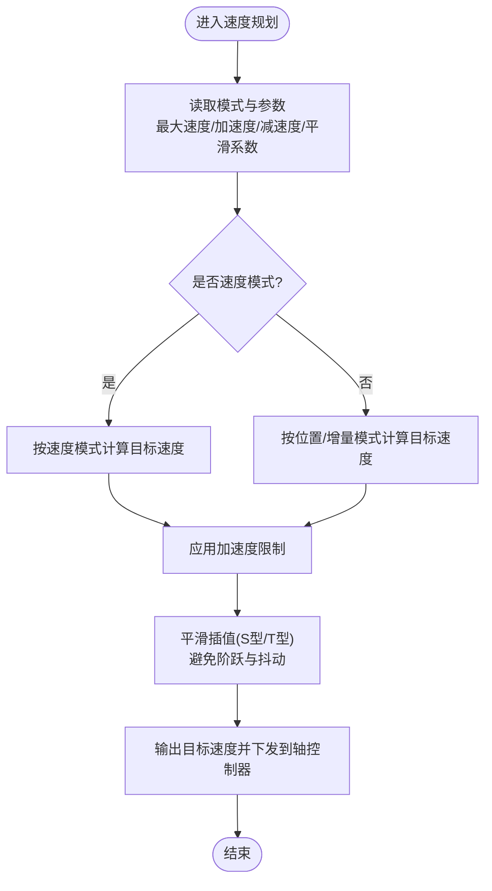
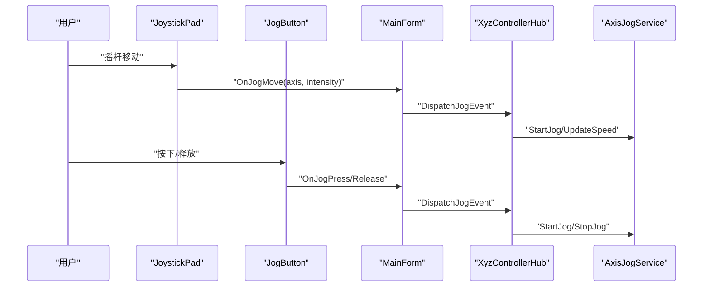
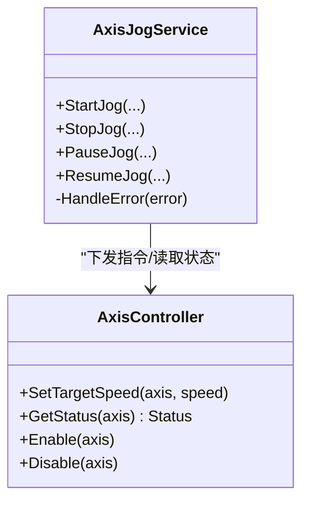
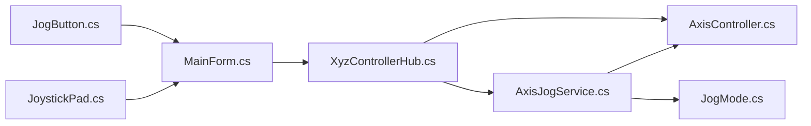

# 点动服务

<cite>
**本文引用的文件**   
- [AxisJogService.cs](file://src/XyzController/Logic/AxisJogService.cs)
- [AxisController.cs](file://src/XyzController/Logic/AxisController.cs)
- [JogMode.cs](file://src/XyzController/Logic/JogMode.cs)
- [XyzControllerHub.cs](file://src/XyzController/Logic/XyzControllerHub.cs)
- [MainForm.cs](file://src/XyzController/MainForm.cs)
- [JoystickPad.cs](file://src/XyzController.Controls/JoystickPad.cs)
- [JogButton.cs](file://src/XyzController.Controls/JogButton.cs)
- [AxisBar.cs](file://src/XyzController.Controls/AxisBar.cs)
- [XYView.cs](file://src/XyzController.Controls/XYView.cs)
- [ZBarView.cs](file://src/XyzController.Controls/ZBarView.cs)
- [MathHelper.cs](file://src/XyzController.Controls/MathHelper.cs)
- [PaintHelper.cs](file://src/XyzController.Controls/PaintHelper.cs)
- [DroLabel.cs](file://src/XyzController.Controls/DroLabel.cs)
- [Program.cs](file://src/XyzController/Program.cs)
- [XyzController.csproj](file://src/XyzController/XyzController.csproj)
- [XyzController.Tests.csproj](file://src/XyzController.Tests/XyzController.Tests.csproj)
- [AxisJogServiceTests.cs](file://src/XyzController.Tests/Tests/AxisJogServiceTests.cs)
- [AxisControllerTests.cs](file://src/XyzController.Tests/Tests/AxisControllerTests.cs)
- [XyzControllerHubTests.cs](file://src/XyzController.Tests/Tests/XyzControllerHubTests.cs)
</cite>

## 目录
1. [简介](#简介)
2. [项目结构](#项目结构)
3. [核心组件](#核心组件)
4. [架构总览](#架构总览)
5. [详细组件分析](#详细组件分析)
6. [依赖关系分析](#依赖关系分析)
7. [性能考虑](#性能考虑)
8. [故障排除指南](#故障排除指南)
9. [结论](#结论)
10. [附录](#附录)

## 简介
本文件面向“点动服务”的完整技术文档，重点围绕 AxisJogService 类的实现机制与使用方式展开。内容涵盖：
- 连续运动控制、速度调节算法与运动平滑处理
- 启动、停止、暂停逻辑与用户输入事件处理
- 速度曲线计算、加速度控制与轨迹优化思路
- 配置示例、状态监听与异常处理实践
- 与轴控制器（AxisController）协作关系
- 性能调优与故障排除建议
- 面向初学者的基础概念与面向高级用户的扩展方法

## 项目结构
本项目采用分层组织方式：
- 业务逻辑层：包含轴控制、点动服务、模式枚举与通信中心
- 控件层：提供可视化操作界面与交互控件
- 测试层：对关键类进行单元测试覆盖
- 应用入口与工程配置

图表来源
- [Program.cs](file://src/XyzController/Program.cs)
- [MainForm.cs](file://src/XyzController/MainForm.cs)
- [AxisJogService.cs](file://src/XyzController/Logic/AxisJogService.cs)
- [AxisController.cs](file://src/XyzController/Logic/AxisController.cs)
- [JogMode.cs](file://src/XyzController/Logic/JogMode.cs)
- [XyzControllerHub.cs](file://src/XyzController/Logic/XyzControllerHub.cs)
- [JoystickPad.cs](file://src/XyzController.Controls/JoystickPad.cs)
- [JogButton.cs](file://src/XyzController.Controls/JogButton.cs)
- [AxisBar.cs](file://src/XyzController.Controls/AxisBar.cs)
- [XYView.cs](file://src/XyzController.Controls/XYView.cs)
- [ZBarView.cs](file://src/XyzController.Controls/ZBarView.cs)
- [MathHelper.cs](file://src/XyzController.Controls/MathHelper.cs)
- [PaintHelper.cs](file://src/XyzController.Controls/PaintHelper.cs)
- [DroLabel.cs](file://src/XyzController.Controls/DroLabel.cs)
- [AxisJogServiceTests.cs](file://src/XyzController.Tests/Tests/AxisJogServiceTests.cs)
- [AxisControllerTests.cs](file://src/XyzController.Tests/Tests/AxisControllerTests.cs)
- [XyzControllerHubTests.cs](file://src/XyzController.Tests/Tests/XyzControllerHubTests.cs)

章节来源
- [Program.cs](file://src/XyzController/Program.cs)
- [XyzController.csproj](file://src/XyzController/XyzController.csproj)
- [XyzController.Tests.csproj](file://src/XyzController.Tests/XyzController.Tests.csproj)

## 核心组件
- AxisJogService：点动服务的核心，负责接收用户输入、生成目标速度与加速度、执行平滑过渡并驱动轴控制器完成连续运动。
- AxisController：底层轴控制抽象，封装具体硬件或仿真轴的指令下发、状态查询与错误上报。
- JogMode：定义点动模式（如增量、绝对、速度等），用于切换不同点动策略。
- XyzControllerHub：协调多轴与UI的事件分发与状态同步。
- UI控件：JoystickPad、JogButton、AxisBar、XYView、ZBarView、DroLabel 等，负责采集用户操作与显示实时位置/速度。

章节来源
- [AxisJogService.cs](file://src/XyzController/Logic/AxisJogService.cs)
- [AxisController.cs](file://src/XyzController/Logic/AxisController.cs)
- [JogMode.cs](file://src/XyzController/Logic/JogMode.cs)
- [XyzControllerHub.cs](file://src/XyzController/Logic/XyzControllerHub.cs)
- [JoystickPad.cs](file://src/XyzController.Controls/JoystickPad.cs)
- [JogButton.cs](file://src/XyzController.Controls/JogButton.cs)
- [AxisBar.cs](file://src/XyzController.Controls/AxisBar.cs)
- [XYView.cs](file://src/XyzController.Controls/XYView.cs)
- [ZBarView.cs](file://src/XyzController.Controls/ZBarView.cs)
- [DroLabel.cs](file://src/XyzController.Controls/DroLabel.cs)

## 架构总览
点动服务整体遵循“输入采集—速度规划—平滑执行—状态反馈”的闭环流程。UI控件捕获用户操作，转换为点动命令；AxisJogService 根据 JogMode 与参数计算速度曲线与加速度，调用 AxisController 下发指令；AxisController 返回当前状态与错误信息，由 Hub 统一广播给 UI 更新。

图表来源
- [JoystickPad.cs](file://src/XyzController.Controls/JoystickPad.cs)
- [JogButton.cs](file://src/XyzController.Controls/JogButton.cs)
- [XyzControllerHub.cs](file://src/XyzController/Logic/XyzControllerHub.cs)
- [AxisJogService.cs](file://src/XyzController/Logic/AxisJogService.cs)
- [AxisController.cs](file://src/XyzController/Logic/AxisController.cs)

## 详细组件分析

### AxisJogService 类分析
AxisJogService 是点动控制的核心，承担以下职责：
- 接收来自 Hub 的点动命令，解析模式与参数
- 根据 JogMode 选择速度曲线与加速度策略
- 执行平滑过渡（S型/T型速度曲线、加减速限制、抖动抑制）
- 驱动 AxisController 设置目标速度/位置，并轮询状态
- 管理运行生命周期（启动、暂停、停止）与异常恢复

#### 类图（基于源码结构）

图表来源
- [AxisJogService.cs](file://src/XyzController/Logic/AxisJogService.cs)
- [AxisController.cs](file://src/XyzController/Logic/AxisController.cs)
- [JogMode.cs](file://src/XyzController/Logic/JogMode.cs)

#### 启动/停止/暂停流程（序列图）

图表来源
- [AxisJogService.cs](file://src/XyzController/Logic/AxisJogService.cs)
- [AxisController.cs](file://src/XyzController/Logic/AxisController.cs)
- [XyzControllerHub.cs](file://src/XyzController/Logic/XyzControllerHub.cs)

#### 速度曲线与加速度控制（流程图）

图表来源
- [AxisJogService.cs](file://src/XyzController/Logic/AxisJogService.cs)
- [JogMode.cs](file://src/XyzController/Logic/JogMode.cs)

章节来源
- [AxisJogService.cs](file://src/XyzController/Logic/AxisJogService.cs)
- [AxisController.cs](file://src/XyzController/Logic/AxisController.cs)
- [JogMode.cs](file://src/XyzController/Logic/JogMode.cs)

### 用户输入事件处理
- JoystickPad：将摇杆偏移量映射为各轴的速度比例，触发点动事件。
- JogButton：按键按下/释放对应点动开始/结束，支持长按加速或步进增量。
- MainForm：订阅控件事件，转发至 XyzControllerHub，再由 Hub 调度 AxisJogService。

图表来源
- [JoystickPad.cs](file://src/XyzController.Controls/JoystickPad.cs)
- [JogButton.cs](file://src/XyzController.Controls/JogButton.cs)
- [MainForm.cs](file://src/XyzController/MainForm.cs)
- [XyzControllerHub.cs](file://src/XyzController/Logic/XyzControllerHub.cs)
- [AxisJogService.cs](file://src/XyzController/Logic/AxisJogService.cs)

章节来源
- [JoystickPad.cs](file://src/XyzController.Controls/JoystickPad.cs)
- [JogButton.cs](file://src/XyzController.Controls/JogButton.cs)
- [MainForm.cs](file://src/XyzController/MainForm.cs)
- [XyzControllerHub.cs](file://src/XyzController/Logic/XyzControllerHub.cs)

### 与轴控制器的协作关系
- AxisJogService 通过 AxisController 设置目标速度、启用/禁用轴、获取状态与错误码。
- 当出现超限、过载或通信失败时，AxisController 上报错误，AxisJogService 执行安全降级（立即降速、暂停或停止）。

图表来源
- [AxisJogService.cs](file://src/XyzController/Logic/AxisJogService.cs)
- [AxisController.cs](file://src/XyzController/Logic/AxisController.cs)

章节来源
- [AxisJogService.cs](file://src/XyzController/Logic/AxisJogService.cs)
- [AxisController.cs](file://src/XyzController/Logic/AxisController.cs)

### 配置与使用示例（路径指引）
- 配置点动参数（最大速度、加速度、平滑系数、模式）：参考 AxisJogService 的参数构造与设置方法。
- 监听运动状态：订阅 Hub 的状态事件，在 UI 中更新位置、速度与运行状态。
- 处理异常情况：在 AxisJogService 的错误处理分支中记录日志、触发报警并执行安全停机。

章节来源
- [AxisJogService.cs](file://src/XyzController/Logic/AxisJogService.cs)
- [XyzControllerHub.cs](file://src/XyzController/Logic/XyzControllerHub.cs)
- [MainForm.cs](file://src/XyzController/MainForm.cs)

### 测试与验证
- AxisJogServiceTests：覆盖启动/停止/暂停、速度曲线边界条件、错误恢复路径。
- AxisControllerTests：验证 SetTargetSpeed、状态读取与错误上报。
- XyzControllerHubTests：验证事件分发与状态广播的正确性。

章节来源
- [AxisJogServiceTests.cs](file://src/XyzController.Tests/Tests/AxisJogServiceTests.cs)
- [AxisControllerTests.cs](file://src/XyzController.Tests/Tests/AxisControllerTests.cs)
- [XyzControllerHubTests.cs](file://src/XyzController.Tests/Tests/XyzControllerHubTests.cs)

## 依赖关系分析
- AxisJogService 依赖 AxisController 与 JogMode，并通过 XyzControllerHub 与 UI 解耦。
- UI 控件仅负责输入采集与显示，不直接耦合业务逻辑。
- 测试层对关键类进行隔离测试，确保行为可预期。

图表来源
- [AxisJogService.cs](file://src/XyzController/Logic/AxisJogService.cs)
- [AxisController.cs](file://src/XyzController/Logic/AxisController.cs)
- [JogMode.cs](file://src/XyzController/Logic/JogMode.cs)
- [XyzControllerHub.cs](file://src/XyzController/Logic/XyzControllerHub.cs)
- [MainForm.cs](file://src/XyzController/MainForm.cs)
- [JoystickPad.cs](file://src/XyzController.Controls/JoystickPad.cs)
- [JogButton.cs](file://src/XyzController.Controls/JogButton.cs)

章节来源
- [AxisJogService.cs](file://src/XyzController/Logic/AxisJogService.cs)
- [AxisController.cs](file://src/XyzController/Logic/AxisController.cs)
- [JogMode.cs](file://src/XyzController/Logic/JogMode.cs)
- [XyzControllerHub.cs](file://src/XyzController/Logic/XyzControllerHub.cs)
- [MainForm.cs](file://src/XyzController/MainForm.cs)
- [JoystickPad.cs](file://src/XyzController.Controls/JoystickPad.cs)
- [JogButton.cs](file://src/XyzController.Controls/JogButton.cs)

## 性能考虑
- 速度曲线计算复杂度：通常为 O(1) 每步迭代，关键在于时间步长与插值精度平衡。
- 平滑插值：S型/T型曲线可减少冲击与振动，但需权衡计算开销与响应延迟。
- 线程与调度：建议在独立定时器或任务循环中执行速度更新，避免阻塞 UI 线程。
- 资源占用：减少频繁对象分配，复用缓冲区与数据结构。
- I/O 频率：合理降低与 AxisController 的通信频率，批量更新状态。

[本节为通用性能指导，不涉及具体文件分析]

## 故障排除指南
- 现象：点动无响应
  - 检查 AxisController.Enable 是否成功，确认通信链路正常。
  - 查看 Hub 是否正确分发事件，UI 是否订阅状态变更。
- 现象：速度突变或抖动
  - 调整平滑系数与加速度限制，验证速度曲线参数。
  - 检查输入采样频率与去抖逻辑。
- 现象：异常报错
  - 定位 AxisController 返回的错误码，结合 AxisJogService 的错误处理分支进行诊断。
  - 记录上下文（轴号、模式、参数、当前速度）以便复现。

章节来源
- [AxisJogService.cs](file://src/XyzController/Logic/AxisJogService.cs)
- [AxisController.cs](file://src/XyzController/Logic/AxisController.cs)
- [XyzControllerHub.cs](file://src/XyzController/Logic/XyzControllerHub.cs)

## 结论
AxisJogService 作为点动服务的核心，实现了从用户输入到轴控制的完整闭环。通过合理的速度曲线与加速度控制、平滑插值以及健壮的错误处理，系统能够在保证安全的前提下提供流畅的点动体验。配合 UI 控件与 Hub 的事件机制，开发者可以灵活扩展点动模式与自定义策略，满足不同应用场景的需求。

[本节为总结性内容，不涉及具体文件分析]

## 附录
- 术语说明
  - 点动：以短时、可控的方式驱动轴进行小范围移动。
  - S型/T型速度曲线：用于平滑加减速，减少机械冲击。
  - 增量/绝对/速度模式：不同的点动策略与目标定义方式。
- 扩展建议
  - 自定义 JogMode：新增模式并在 AxisJogService 中接入速度曲线计算。
  - 插件化轴控制器：通过接口抽象替换 AxisController 实现，适配不同硬件。
  - 自适应参数：根据负载与温度动态调整加速度与平滑系数。

[本节为概念性补充，不涉及具体文件分析]