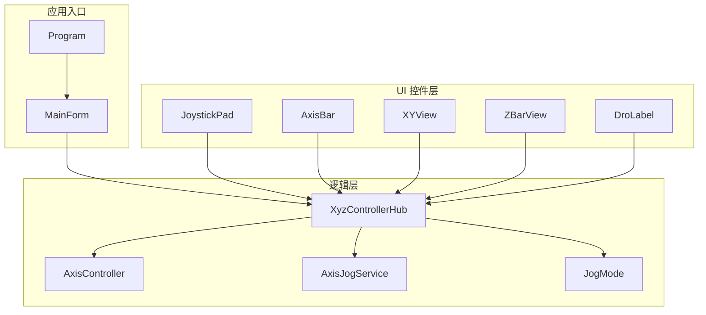
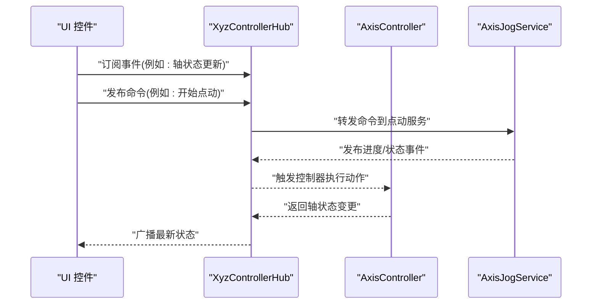
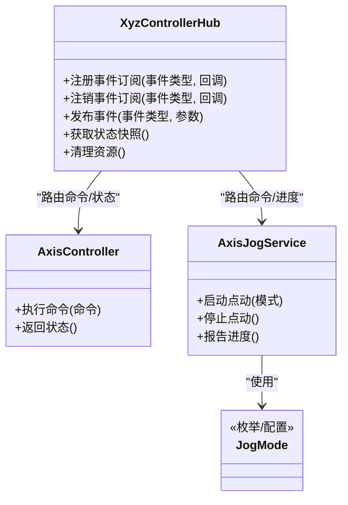
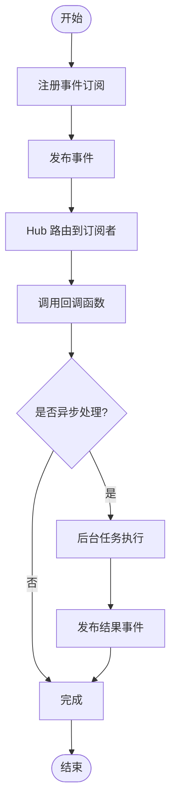
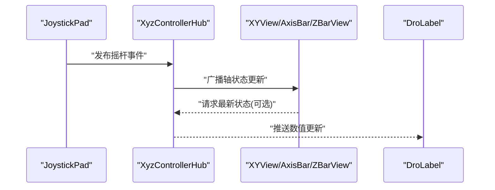
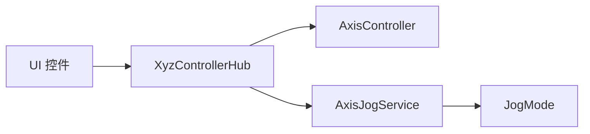

# 组件通信机制

<cite>
**本文引用的文件**   
- [XyzControllerHub.cs](file://src/XyzController/Logic/XyzControllerHub.cs)
- [AxisController.cs](file://src/XyzController/Logic/AxisController.cs)
- [AxisJogService.cs](file://src/XyzController/Logic/AxisJogService.cs)
- [JogMode.cs](file://src/XyzController/Logic/JogMode.cs)
- [MainForm.cs](file://src/XyzController/MainForm.cs)
- [Program.cs](file://src/XyzController/Program.cs)
- [JoystickPad.cs](file://src/XyzController.Controls/JoystickPad.cs)
- [AxisBar.cs](file://src/XyzController.Controls/AxisBar.cs)
- [XYView.cs](file://src/XyzController.Controls/XYView.cs)
- [ZBarView.cs](file://src/XyzController.Controls/ZBarView.cs)
- [DroLabel.cs](file://src/XyzController.Controls/DroLabel.cs)
- [XyzControllerHubTests.cs](file://src/XyzController.Tests/Tests/XyzControllerHubTests.cs)
- [AxisControllerTests.cs](file://src/XyzController.Tests/Tests/AxisControllerTests.cs)
- [AxisJogServiceTests.cs](file://src/XyzController.Tests/Tests/AxisJogServiceTests.cs)
</cite>

## 目录
1. [简介](#简介)
2. [项目结构](#项目结构)
3. [核心组件](#核心组件)
4. [架构总览](#架构总览)
5. [详细组件分析](#详细组件分析)
6. [依赖关系分析](#依赖关系分析)
7. [性能考虑](#性能考虑)
8. [故障排查指南](#故障排查指南)
9. [结论](#结论)
10. [附录](#附录)

## 简介
本文件围绕 XyzController 项目的“组件通信机制”展开，重点解析中心枢纽类 XyzControllerHub 的设计模式与消息路由机制，阐述事件驱动的组件间通信模型（订阅、发布、回调），并说明数据流向、状态同步与异步操作处理方法。文档同时提供自定义事件的定义方式、处理器注册与解耦实践，解释通信协议设计、错误传播机制与性能优化策略，并给出面向初学者的入门指导以及面向高级开发者的扩展与插件集成建议。

## 项目结构
项目采用分层组织：
- 逻辑层（Logic）：包含控制器与服务，如轴控制、点动服务与中心枢纽。
- UI 控件层（Controls）：提供可视化控件，用于展示轴位置、视图与交互输入。
- 测试层（Tests）：针对关键组件的单元测试。

图表来源
- [XyzControllerHub.cs](file://src/XyzController/Logic/XyzControllerHub.cs)
- [AxisController.cs](file://src/XyzController/Logic/AxisController.cs)
- [AxisJogService.cs](file://src/XyzController/Logic/AxisJogService.cs)
- [JogMode.cs](file://src/XyzController/Logic/JogMode.cs)
- [MainForm.cs](file://src/XyzController/MainForm.cs)
- [Program.cs](file://src/XyzController/Program.cs)
- [JoystickPad.cs](file://src/XyzController.Controls/JoystickPad.cs)
- [AxisBar.cs](file://src/XyzController.Controls/AxisBar.cs)
- [XYView.cs](file://src/XyzController.Controls/XYView.cs)
- [ZBarView.cs](file://src/XyzController.Controls/ZBarView.cs)
- [DroLabel.cs](file://src/XyzController.Controls/DroLabel.cs)

章节来源
- [Program.cs](file://src/XyzController/Program.cs)
- [MainForm.cs](file://src/XyzController/MainForm.cs)
- [XyzControllerHub.cs](file://src/XyzController/Logic/XyzControllerHub.cs)
- [AxisController.cs](file://src/XyzController/Logic/AxisController.cs)
- [AxisJogService.cs](file://src/XyzController/Logic/AxisJogService.cs)
- [JogMode.cs](file://src/XyzController/Logic/JogMode.cs)
- [JoystickPad.cs](file://src/XyzController.Controls/JoystickPad.cs)
- [AxisBar.cs](file://src/XyzController.Controls/AxisBar.cs)
- [XYView.cs](file://src/XyzController.Controls/XYView.cs)
- [ZBarView.cs](file://src/XyzController.Controls/ZBarView.cs)
- [DroLabel.cs](file://src/XyzController.Controls/DroLabel.cs)

## 核心组件
- XyzControllerHub：作为系统的事件总线与协调器，负责集中管理组件间的消息路由、事件分发与状态广播。其职责包括：
  - 事件注册与注销
  - 事件发布与路由
  - 跨组件状态同步
  - 生命周期管理与资源清理
- AxisController：封装单轴控制逻辑，对外暴露状态与命令接口，并通过 Hub 进行事件发布与订阅。
- AxisJogService：实现点动（Jog）行为，结合 JogMode 配置，通过 Hub 与其他组件协作。
- JogMode：描述点动模式的枚举或配置对象，供服务与控制器使用。

章节来源
- [XyzControllerHub.cs](file://src/XyzController/Logic/XyzControllerHub.cs)
- [AxisController.cs](file://src/XyzController/Logic/AxisController.cs)
- [AxisJogService.cs](file://src/XyzController/Logic/AxisJogService.cs)
- [JogMode.cs](file://src/XyzController/Logic/JogMode.cs)

## 架构总览
整体采用“中心枢纽 + 事件驱动”的架构：
- UI 控件通过 Hub 订阅轴状态变化与命令结果；
- 业务服务（如点动服务）通过 Hub 发布动作事件；
- 控制器在收到命令后执行并回传状态变更；
- Hub 统一维护事件表与订阅者集合，确保低耦合与高内聚。

图表来源
- [XyzControllerHub.cs](file://src/XyzController/Logic/XyzControllerHub.cs)
- [AxisController.cs](file://src/XyzController/Logic/AxisController.cs)
- [AxisJogService.cs](file://src/XyzController/Logic/AxisJogService.cs)

## 详细组件分析

### XyzControllerHub 中心枢纽类
- 设计模式
  - 事件总线：集中管理事件类型、订阅者与发布流程，降低组件耦合度。
  - 观察者模式：订阅者注册回调，发布者触发时通知所有订阅者。
  - 中介者模式：Hub 作为中间人协调多个组件之间的交互。
- 消息路由机制
  - 事件命名约定：采用“领域.子域.动作”的命名规范，便于分类与过滤。
  - 路由策略：按事件类型精确匹配订阅者，支持通配符或前缀匹配以简化批量订阅。
  - 优先级与顺序：可引入优先级队列，保证关键事件优先处理。
- 数据流向与状态同步
  - 单向数据流：UI -> Hub -> 控制器/服务 -> Hub -> UI。
  - 状态快照：Hub 维护当前状态快照，订阅者可按需拉取最新值。
- 异步操作处理
  - 非阻塞发布：发布事件时采用异步派发，避免阻塞 UI 线程。
  - 任务编排：对耗时操作使用任务调度，完成后回调 Hub 再广播结果。
- 错误传播机制
  - 异常隔离：单个订阅者异常不影响其他订阅者。
  - 错误事件：将错误包装为特定事件类型，由错误处理订阅者统一捕获与上报。
- 性能优化策略
  - 去重订阅：同一订阅者重复注册同一事件时自动去重。
  - 批量发布：合并高频小事件为批次事件，减少分发开销。
  - 弱引用订阅：防止内存泄漏，及时释放不再使用的订阅者。

图表来源
- [XyzControllerHub.cs](file://src/XyzController/Logic/XyzControllerHub.cs)
- [AxisController.cs](file://src/XyzController/Logic/AxisController.cs)
- [AxisJogService.cs](file://src/XyzController/Logic/AxisJogService.cs)
- [JogMode.cs](file://src/XyzController/Logic/JogMode.cs)

章节来源
- [XyzControllerHub.cs](file://src/XyzController/Logic/XyzControllerHub.cs)
- [AxisController.cs](file://src/XyzController/Logic/AxisController.cs)
- [AxisJogService.cs](file://src/XyzController/Logic/AxisJogService.cs)
- [JogMode.cs](file://src/XyzController/Logic/JogMode.cs)

### 事件驱动通信模型
- 事件订阅
  - 订阅者向 Hub 注册事件类型与回调函数。
  - 支持一次性订阅与持久订阅两种模式。
- 事件发布
  - 发布者调用 Hub 的发布接口，附带事件参数。
  - Hub 查找匹配的订阅者并依次调用回调。
- 回调处理
  - 回调函数应幂等且快速执行，避免阻塞。
  - 复杂处理委托给后台任务，完成后再次发布结果事件。

图表来源
- [XyzControllerHub.cs](file://src/XyzController/Logic/XyzControllerHub.cs)

章节来源
- [XyzControllerHub.cs](file://src/XyzController/Logic/XyzControllerHub.cs)

### 自定义事件定义与处理器注册
- 定义自定义事件
  - 明确事件名称、参数结构与语义。
  - 将事件类型集中管理，避免硬编码字符串。
- 注册事件处理器
  - 在组件初始化阶段完成订阅。
  - 在组件销毁时注销订阅，防止内存泄漏。
- 组件解耦
  - 通过事件而非直接引用实现松耦合。
  - 使用 Hub 作为唯一通信点，屏蔽内部实现细节。

章节来源
- [XyzControllerHub.cs](file://src/XyzController/Logic/XyzControllerHub.cs)
- [AxisController.cs](file://src/XyzController/Logic/AxisController.cs)
- [AxisJogService.cs](file://src/XyzController/Logic/AxisJogService.cs)

### UI 控件与 Hub 的交互
- JoystickPad：用户输入源，发布“摇杆移动”事件至 Hub。
- AxisBar、XYView、ZBarView：订阅轴状态事件，更新可视化。
- DroLabel：显示数值信息，从 Hub 拉取最新状态。

图表来源
- [JoystickPad.cs](file://src/XyzController.Controls/JoystickPad.cs)
- [XYView.cs](file://src/XyzController.Controls/XYView.cs)
- [AxisBar.cs](file://src/XyzController.Controls/AxisBar.cs)
- [ZBarView.cs](file://src/XyzController.Controls/ZBarView.cs)
- [DroLabel.cs](file://src/XyzController.Controls/DroLabel.cs)
- [XyzControllerHub.cs](file://src/XyzController/Logic/XyzControllerHub.cs)

章节来源
- [JoystickPad.cs](file://src/XyzController.Controls/JoystickPad.cs)
- [AxisBar.cs](file://src/XyzController.Controls/AxisBar.cs)
- [XYView.cs](file://src/XyzController.Controls/XYView.cs)
- [ZBarView.cs](file://src/XyzController.Controls/ZBarView.cs)
- [DroLabel.cs](file://src/XyzController.Controls/DroLabel.cs)
- [XyzControllerHub.cs](file://src/XyzController/Logic/XyzControllerHub.cs)

### 应用入口与主窗体
- Program：应用程序入口，创建并运行主窗体。
- MainForm：初始化 Hub、注册全局订阅者、启动 UI 与业务服务。

章节来源
- [Program.cs](file://src/XyzController/Program.cs)
- [MainForm.cs](file://src/XyzController/MainForm.cs)

## 依赖关系分析
- 组件耦合度
  - 通过 Hub 解耦，UI 与业务逻辑无直接依赖。
- 外部依赖
  - 可能依赖 .NET 事件系统与异步编程模型。
- 循环依赖
  - 应避免控制器与服务互相直接引用，统一通过 Hub 通信。

图表来源
- [XyzControllerHub.cs](file://src/XyzController/Logic/XyzControllerHub.cs)
- [AxisController.cs](file://src/XyzController/Logic/AxisController.cs)
- [AxisJogService.cs](file://src/XyzController/Logic/AxisJogService.cs)
- [JogMode.cs](file://src/XyzController/Logic/JogMode.cs)

章节来源
- [XyzControllerHub.cs](file://src/XyzController/Logic/XyzControllerHub.cs)
- [AxisController.cs](file://src/XyzController/Logic/AxisController.cs)
- [AxisJogService.cs](file://src/XyzController/Logic/AxisJogService.cs)
- [JogMode.cs](file://src/XyzController/Logic/JogMode.cs)

## 性能考虑
- 事件批处理：合并高频小事件，降低分发频率。
- 异步派发：避免阻塞 UI 线程，提升响应性。
- 订阅去重：防止重复回调导致额外开销。
- 弱引用订阅：及时释放不再使用的订阅者，避免内存增长。
- 状态快照缓存：减少频繁查询带来的压力。

[本节为通用性能建议，不直接分析具体文件]

## 故障排查指南
- 常见问题
  - 事件未触发：检查订阅是否正确注册、事件名称是否一致。
  - 回调异常：确认回调函数中异常隔离机制生效，查看错误事件日志。
  - 内存泄漏：确认组件销毁时已注销订阅。
- 调试技巧
  - 在 Hub 增加事件路由日志，记录发布与订阅匹配情况。
  - 使用测试用例验证事件链路，参考测试文件中的断言与模拟。

章节来源
- [XyzControllerHubTests.cs](file://src/XyzController.Tests/Tests/XyzControllerHubTests.cs)
- [AxisControllerTests.cs](file://src/XyzController.Tests/Tests/AxisControllerTests.cs)
- [AxisJogServiceTests.cs](file://src/XyzController.Tests/Tests/AxisJogServiceTests.cs)

## 结论
XyzControllerHub 作为中心枢纽，实现了基于事件驱动的组件通信机制，有效降低了模块耦合度，提升了系统的可扩展性与可维护性。通过合理的事件命名、异步派发、错误传播与性能优化策略，系统能够在复杂交互场景下保持稳定与高效。遵循本文档的实践建议，开发者可以安全地扩展功能与集成插件。

[本节为总结性内容，不直接分析具体文件]

## 附录

### 初学者指南：事件驱动编程概念
- 什么是事件：事件是组件间通信的信号，表示某个动作或状态变化。
- 订阅与发布：订阅者声明对某事件的兴趣，发布者发出信号，Hub 负责分发。
- 回调函数：订阅者注册的函数，在事件发生时被调用。
- 解耦的好处：组件无需知道彼此存在，仅通过事件契约协作。

[本节为概念性内容，不直接分析具体文件]

### 高级模式与最佳实践
- 事件聚合：将多个相关事件合并为一个复合事件，简化订阅逻辑。
- 事件版本化：当事件结构演进时，保持向后兼容，提供迁移路径。
- 插件集成：通过 Hub 的动态注册机制，允许第三方组件注入新事件与处理器。
- 错误边界：为每个订阅者设置错误边界，避免级联失败。

[本节为通用实践建议，不直接分析具体文件]