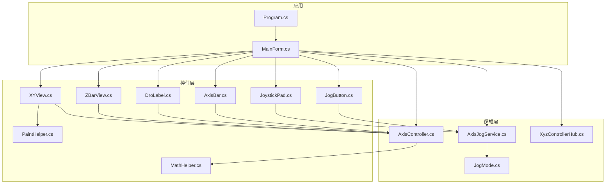
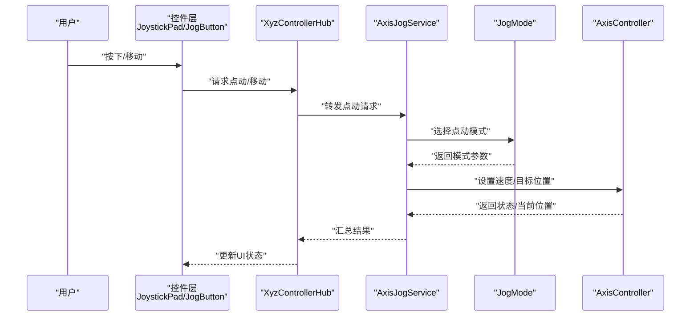
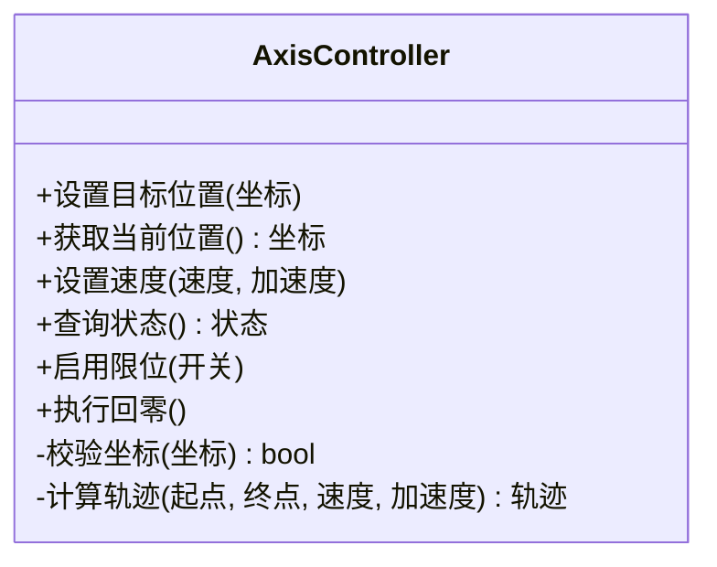
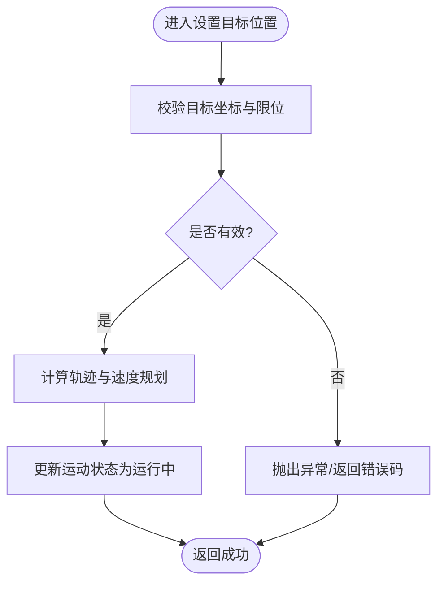
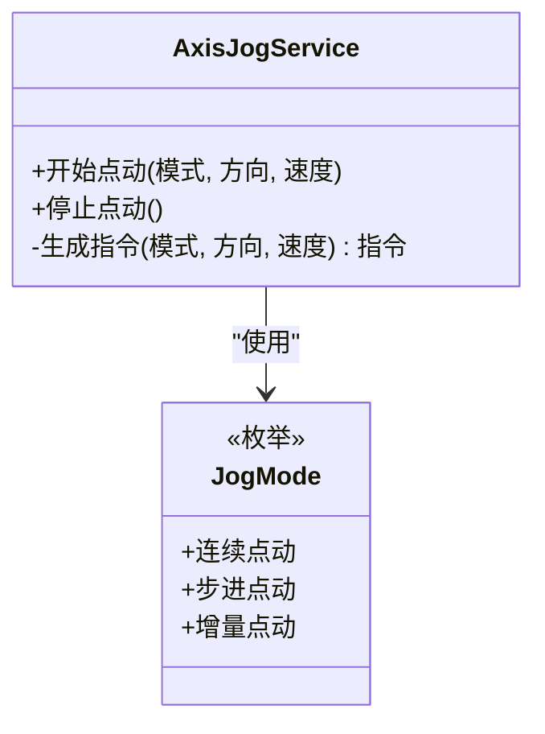
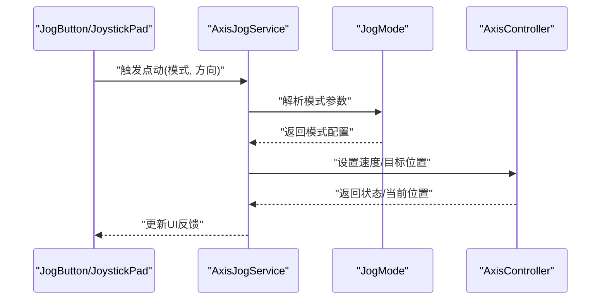
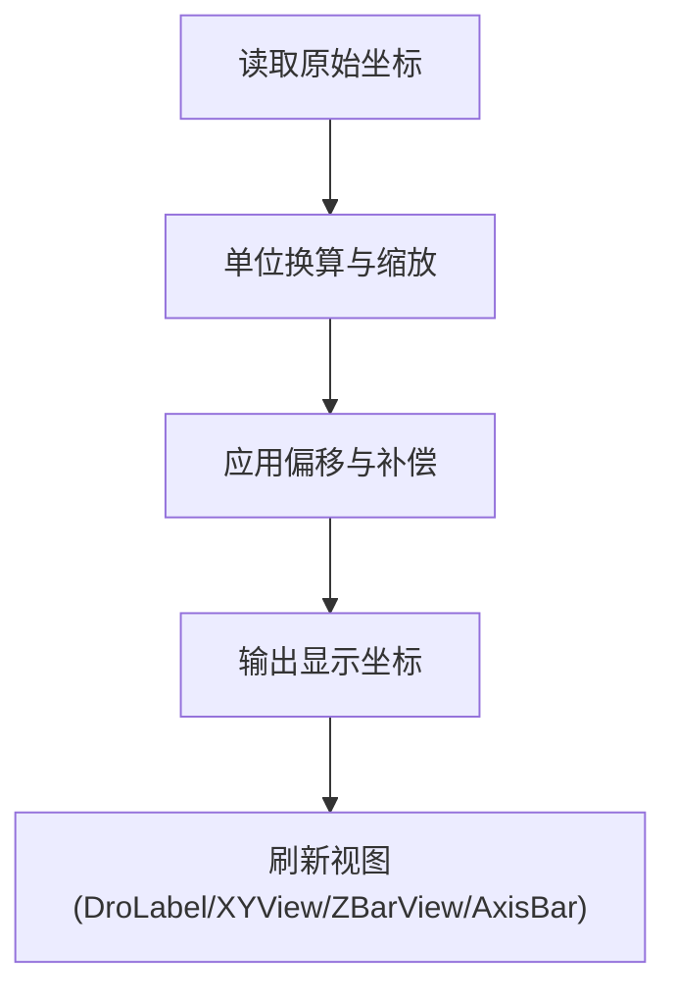
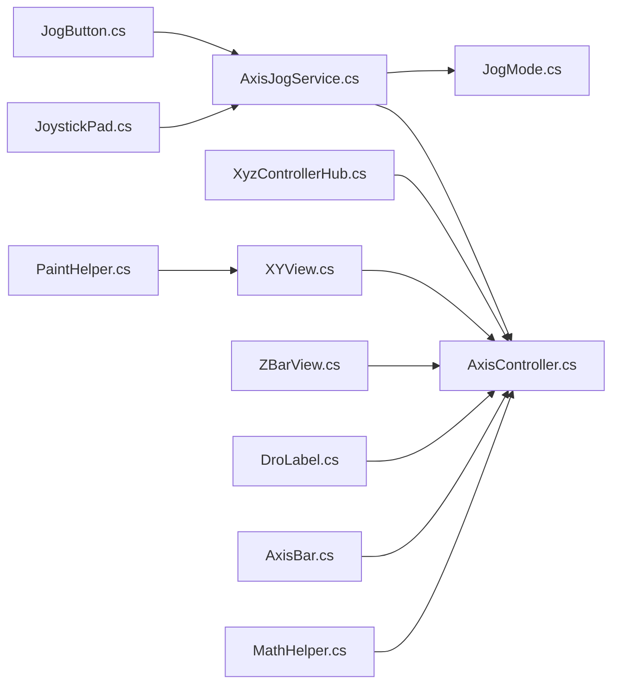

# 轴控制系统

<cite>
**本文引用的文件**   
- [AxisController.cs](file://src/XyzController/Logic/AxisController.cs)
- [JogMode.cs](file://src/XyzController/Logic/JogMode.cs)
- [AxisJogService.cs](file://src/XyzController/Logic/AxisJogService.cs)
- [XyzControllerHub.cs](file://src/XyzController/Logic/XyzControllerHub.cs)
- [MainForm.cs](file://src/XyzController/MainForm.cs)
- [Program.cs](file://src/XyzController/Program.cs)
- [JoystickPad.cs](file://src/XyzController.Controls/JoystickPad.cs)
- [JogButton.cs](file://src/XyzController.Controls/JogButton.cs)
- [XYView.cs](file://src/XyzController.Controls/XYView.cs)
- [ZBarView.cs](file://src/XyzController.Controls/ZBarView.cs)
- [DroLabel.cs](file://src/XyzController.Controls/DroLabel.cs)
- [AxisBar.cs](file://src/XyzController.Controls/AxisBar.cs)
- [MathHelper.cs](file://src/XyzController.Controls/MathHelper.cs)
- [PaintHelper.cs](file://src/XyzController.Controls/PaintHelper.cs)
- [AxisControllerTests.cs](file://src/XyzController.Tests/Tests/AxisControllerTests.cs)
- [AxisJogServiceTests.cs](file://src/XyzController.Tests/Tests/AxisJogServiceTests.cs)
- [XyzControllerHubTests.cs](file://src/XyzController.Tests/Tests/XyzControllerHubTests.cs)
</cite>

## 目录
1. [简介](#简介)
2. [项目结构](#项目结构)
3. [核心组件](#核心组件)
4. [架构总览](#架构总览)
5. [详细组件分析](#详细组件分析)
6. [依赖关系分析](#依赖关系分析)
7. [性能考虑](#性能考虑)
8. [故障排查指南](#故障排查指南)
9. [结论](#结论)
10. [附录](#附录)

## 简介
本文件系统性地阐述轴控制系统的整体设计与实现，重点围绕 AxisController 类的核心能力：轴位置管理、运动状态控制、速度调节与坐标计算；并深入说明 JogMode 枚举及点动模式机制。文档同时覆盖控制器生命周期管理、错误处理策略与性能优化方法，提供初始化、设置目标位置、获取当前位置等典型使用场景的最佳实践，帮助初学者理解基本概念，也为有经验的开发者提供扩展指南。

## 项目结构
仓库采用分层组织方式：
- 逻辑层（Logic）：包含轴控制器、点动服务、点动模式定义以及对外通信的 Hub。
- 控件层（Controls）：提供 UI 交互与可视化组件，如摇杆、点动按钮、视图与数值显示等。
- 测试层（Tests）：针对核心逻辑与服务进行单元测试。
- 应用入口与主窗体：Program.cs 负责启动，MainForm.cs 承载界面与集成逻辑。

图表来源
- [Program.cs](file://src/XyzController/Program.cs)
- [MainForm.cs](file://src/XyzController/MainForm.cs)
- [AxisController.cs](file://src/XyzController/Logic/AxisController.cs)
- [AxisJogService.cs](file://src/XyzController/Logic/AxisJogService.cs)
- [JogMode.cs](file://src/XyzController/Logic/JogMode.cs)
- [XyzControllerHub.cs](file://src/XyzController/Logic/XyzControllerHub.cs)
- [JoystickPad.cs](file://src/XyzController.Controls/JoystickPad.cs)
- [JogButton.cs](file://src/XyzController.Controls/JogButton.cs)
- [XYView.cs](file://src/XyzController.Controls/XYView.cs)
- [ZBarView.cs](file://src/XyzController.Controls/ZBarView.cs)
- [DroLabel.cs](file://src/XyzController.Controls/DroLabel.cs)
- [AxisBar.cs](file://src/XyzController.Controls/AxisBar.cs)
- [MathHelper.cs](file://src/XyzController.Controls/MathHelper.cs)
- [PaintHelper.cs](file://src/XyzController.Controls/PaintHelper.cs)

章节来源
- [Program.cs](file://src/XyzController/Program.cs)
- [MainForm.cs](file://src/XyzController/MainForm.cs)
- [AxisController.cs](file://src/XyzController/Logic/AxisController.cs)
- [AxisJogService.cs](file://src/XyzController/Logic/AxisJogService.cs)
- [JogMode.cs](file://src/XyzController/Logic/JogMode.cs)
- [XyzControllerHub.cs](file://src/XyzController/Logic/XyzControllerHub.cs)
- [JoystickPad.cs](file://src/XyzController.Controls/JoystickPad.cs)
- [JogButton.cs](file://src/XyzController.Controls/JogButton.cs)
- [XYView.cs](file://src/XyzController.Controls/XYView.cs)
- [ZBarView.cs](file://src/XyzController.Controls/ZBarView.cs)
- [DroLabel.cs](file://src/XyzController.Controls/DroLabel.cs)
- [AxisBar.cs](file://src/XyzController.Controls/AxisBar.cs)
- [MathHelper.cs](file://src/XyzController.Controls/MathHelper.cs)
- [PaintHelper.cs](file://src/XyzController.Controls/PaintHelper.cs)

## 核心组件
- AxisController：轴控制的核心类，负责轴位置管理、运动状态控制、速度调节与坐标计算。提供设置目标位置、读取当前位置、配置速度与加速度、查询运行状态等方法。内部维护当前坐标、目标坐标、速度限制、加速度、限位与回零策略等参数，并提供线程安全的访问接口。
- JogMode：点动模式枚举，用于区分不同的点动行为（例如连续点动、步进点动、增量点动等），由点动服务根据该模式生成相应的运动指令。
- AxisJogService：点动服务，封装点动流程，依据 JogMode 与用户输入（摇杆、按钮）产生速度/位移指令，并与 AxisController 协作完成实际运动。
- XyzControllerHub：对外暴露的通信枢纽，聚合多个轴的控制器实例，提供统一的 API 供上层或外部系统调用。
- 控件层：JoystickPad、JogButton 等负责采集用户输入；XYView、ZBarView、DroLabel、AxisBar 负责可视化展示；MathHelper、PaintHelper 提供数学与绘制辅助。

章节来源
- [AxisController.cs](file://src/XyzController/Logic/AxisController.cs)
- [JogMode.cs](file://src/XyzController/Logic/JogMode.cs)
- [AxisJogService.cs](file://src/XyzController/Logic/AxisJogService.cs)
- [XyzControllerHub.cs](file://src/XyzController/Logic/XyzControllerHub.cs)
- [JoystickPad.cs](file://src/XyzController.Controls/JoystickPad.cs)
- [JogButton.cs](file://src/XyzController.Controls/JogButton.cs)
- [XYView.cs](file://src/XyzController.Controls/XYView.cs)
- [ZBarView.cs](file://src/XyzController.Controls/ZBarView.cs)
- [DroLabel.cs](file://src/XyzController.Controls/DroLabel.cs)
- [AxisBar.cs](file://src/XyzController.Controls/AxisBar.cs)
- [MathHelper.cs](file://src/XyzController.Controls/MathHelper.cs)
- [PaintHelper.cs](file://src/XyzController.Controls/PaintHelper.cs)

## 架构总览
系统采用“UI 输入 -> 点动服务 -> 轴控制器 -> 硬件抽象”的分层架构。UI 控件捕获用户操作，交由点动服务解析为运动指令，再由轴控制器执行具体运动控制。Hub 作为统一入口，屏蔽多轴细节，便于上层集成。

图表来源
- [XyzControllerHub.cs](file://src/XyzController/Logic/XyzControllerHub.cs)
- [AxisJogService.cs](file://src/XyzController/Logic/AxisJogService.cs)
- [JogMode.cs](file://src/XyzController/Logic/JogMode.cs)
- [AxisController.cs](file://src/XyzController/Logic/AxisController.cs)
- [JoystickPad.cs](file://src/XyzController.Controls/JoystickPad.cs)
- [JogButton.cs](file://src/XyzController.Controls/JogButton.cs)

## 详细组件分析

### AxisController 类分析
AxisController 是轴控制的核心，承担以下职责：
- 轴位置管理：维护当前坐标、目标坐标、最小/最大限位、零点偏移等。
- 运动状态控制：支持停止、点动、绝对定位、相对移动等状态机式控制。
- 速度调节：提供速度上限、加速度、加减速曲线配置。
- 坐标计算：在绝对/相对坐标之间转换，结合限位与回零策略进行边界检查。

图表来源
- [AxisController.cs](file://src/XyzController/Logic/AxisController.cs)

章节来源
- [AxisController.cs](file://src/XyzController/Logic/AxisController.cs)

#### 关键流程：设置目标位置

图表来源
- [AxisController.cs](file://src/XyzController/Logic/AxisController.cs)

### JogMode 枚举与点动模式
JogMode 定义了不同点动行为的模式标识，例如：
- 连续点动：按住时持续以设定速度运动。
- 步进点动：每次触发按固定步长移动。
- 增量点动：基于当前坐标进行相对位移。

点动服务根据所选模式生成相应指令，并与 AxisController 协作完成运动。

图表来源
- [JogMode.cs](file://src/XyzController/Logic/JogMode.cs)
- [AxisJogService.cs](file://src/XyzController/Logic/AxisJogService.cs)

章节来源
- [JogMode.cs](file://src/XyzController/Logic/JogMode.cs)
- [AxisJogService.cs](file://src/XyzController/Logic/AxisJogService.cs)

### 点动服务与控制器协作
点动服务负责将用户输入转换为运动指令，并根据 JogMode 调整行为。它与 AxisController 通过明确的接口契约交互，确保状态一致性与线程安全。

图表来源
- [AxisJogService.cs](file://src/XyzController/Logic/AxisJogService.cs)
- [JogMode.cs](file://src/XyzController/Logic/JogMode.cs)
- [AxisController.cs](file://src/XyzController/Logic/AxisController.cs)
- [JogButton.cs](file://src/XyzController.Controls/JogButton.cs)
- [JoystickPad.cs](file://src/XyzController.Controls/JoystickPad.cs)

章节来源
- [AxisJogService.cs](file://src/XyzController/Logic/AxisJogService.cs)
- [JogMode.cs](file://src/XyzController/Logic/JogMode.cs)
- [AxisController.cs](file://src/XyzController/Logic/AxisController.cs)
- [JogButton.cs](file://src/XyzController.Controls/JogButton.cs)
- [JoystickPad.cs](file://src/XyzController.Controls/JoystickPad.cs)

### 坐标计算与可视化
坐标计算涉及绝对/相对坐标转换、缩放与单位换算，由 MathHelper 提供支持。可视化组件（XYView、ZBarView、DroLabel、AxisBar）从 AxisController 读取状态并渲染。

图表来源
- [MathHelper.cs](file://src/XyzController.Controls/MathHelper.cs)
- [DroLabel.cs](file://src/XyzController.Controls/DroLabel.cs)
- [XYView.cs](file://src/XyzController.Controls/XYView.cs)
- [ZBarView.cs](file://src/XyzController.Controls/ZBarView.cs)
- [AxisBar.cs](file://src/XyzController.Controls/AxisBar.cs)

章节来源
- [MathHelper.cs](file://src/XyzController.Controls/MathHelper.cs)
- [DroLabel.cs](file://src/XyzController.Controls/DroLabel.cs)
- [XYView.cs](file://src/XyzController.Controls/XYView.cs)
- [ZBarView.cs](file://src/XyzController.Controls/ZBarView.cs)
- [AxisBar.cs](file://src/XyzController.Controls/AxisBar.cs)

### 生命周期管理与错误处理
- 生命周期：控制器在创建后需进行初始化（加载配置、复位状态），在退出前释放资源（关闭定时器、断开事件订阅）。
- 错误处理：对非法坐标、越界、设备不可用等情况进行异常捕获与日志记录，并通过状态位向 UI 反馈。
- 线程安全：所有公共方法应保证并发访问安全，避免竞态条件。

章节来源
- [AxisController.cs](file://src/XyzController/Logic/AxisController.cs)
- [XyzControllerHub.cs](file://src/XyzController/Logic/XyzControllerHub.cs)

### 性能优化方法
- 批量更新：合并多次坐标更新，减少 UI 刷新频率。
- 节流与去抖：对用户输入进行节流与去抖，降低点动指令风暴。
- 轨迹预计算：对常用路径进行缓存，缩短响应时间。
- 异步处理：将耗时计算与 I/O 操作移至后台线程，避免阻塞 UI。

章节来源
- [AxisController.cs](file://src/XyzController/Logic/AxisController.cs)
- [AxisJogService.cs](file://src/XyzController/Logic/AxisJogService.cs)

## 依赖关系分析
- 控件层依赖逻辑层：JoystickPad、JogButton 通过 Hub 或直接调用 AxisJogService 与 AxisController。
- 逻辑层内部耦合：AxisJogService 依赖 JogMode 与 AxisController；Hub 聚合多个 AxisController 实例。
- 工具库：MathHelper、PaintHelper 被多处复用，提升代码复用率。

图表来源
- [JogButton.cs](file://src/XyzController.Controls/JogButton.cs)
- [JoystickPad.cs](file://src/XyzController.Controls/JoystickPad.cs)
- [AxisJogService.cs](file://src/XyzController/Logic/AxisJogService.cs)
- [JogMode.cs](file://src/XyzController/Logic/JogMode.cs)
- [AxisController.cs](file://src/XyzController/Logic/AxisController.cs)
- [XyzControllerHub.cs](file://src/XyzController/Logic/XyzControllerHub.cs)
- [XYView.cs](file://src/XyzController.Controls/XYView.cs)
- [ZBarView.cs](file://src/XyzController.Controls/ZBarView.cs)
- [DroLabel.cs](file://src/XyzController.Controls/DroLabel.cs)
- [AxisBar.cs](file://src/XyzController.Controls/AxisBar.cs)
- [MathHelper.cs](file://src/XyzController.Controls/MathHelper.cs)
- [PaintHelper.cs](file://src/XyzController.Controls/PaintHelper.cs)

章节来源
- [JogButton.cs](file://src/XyzController.Controls/JogButton.cs)
- [JoystickPad.cs](file://src/XyzController.Controls/JoystickPad.cs)
- [AxisJogService.cs](file://src/XyzController/Logic/AxisJogService.cs)
- [JogMode.cs](file://src/XyzController/Logic/JogMode.cs)
- [AxisController.cs](file://src/XyzController/Logic/AxisController.cs)
- [XyzControllerHub.cs](file://src/XyzController/Logic/XyzControllerHub.cs)
- [XYView.cs](file://src/XyzController.Controls/XYView.cs)
- [ZBarView.cs](file://src/XyzController.Controls/ZBarView.cs)
- [DroLabel.cs](file://src/XyzController.Controls/DroLabel.cs)
- [AxisBar.cs](file://src/XyzController.Controls/AxisBar.cs)
- [MathHelper.cs](file://src/XyzController.Controls/MathHelper.cs)
- [PaintHelper.cs](file://src/XyzController.Controls/PaintHelper.cs)

## 性能考虑
- 控制循环频率：合理设置采样与更新周期，避免过高频率导致 CPU 占用过大。
- 指令合并：将短时间内多次点动指令合并为一次，减少抖动。
- 视图刷新：使用双缓冲与区域重绘，降低绘制开销。
- 内存管理：避免频繁分配临时对象，重用缓冲区与数据结构。

[本节为通用指导，不直接分析具体文件]

## 故障排查指南
- 常见问题
  - 无法到达目标位置：检查限位配置与坐标合法性。
  - 点动无响应：确认 JogMode 与输入源绑定是否正确。
  - UI 显示异常：验证坐标换算与刷新时机。
- 调试建议
  - 打印关键状态与轨迹参数。
  - 使用断点跟踪调用链。
  - 隔离问题到单轴或单控件，逐步复现。

章节来源
- [AxisController.cs](file://src/XyzController/Logic/AxisController.cs)
- [AxisJogService.cs](file://src/XyzController/Logic/AxisJogService.cs)
- [JogMode.cs](file://src/XyzController/Logic/JogMode.cs)

## 结论
轴控制系统通过清晰的层次划分与明确的责任边界，实现了稳定的轴位置管理、运动状态控制、速度调节与坐标计算。JogMode 与 AxisJogService 的组合提供了灵活且可扩展的点动机制。配合完善的错误处理与性能优化策略，系统既适合初学者快速上手，也满足高级用户的深度定制需求。

[本节为总结性内容，不直接分析具体文件]

## 附录

### 常见使用场景与最佳实践
- 初始化轴控制器
  - 步骤：创建控制器实例 -> 加载配置 -> 注册事件回调 -> 启动控制循环。
  - 参考路径：[AxisController.cs](file://src/XyzController/Logic/AxisController.cs)
- 设置目标位置
  - 步骤：计算目标坐标 -> 校验限位 -> 提交指令 -> 等待完成或轮询状态。
  - 参考路径：[AxisController.cs](file://src/XyzController/Logic/AxisController.cs)
- 获取当前位置
  - 步骤：调用读取接口 -> 进行单位换算 -> 更新 UI。
  - 参考路径：[AxisController.cs](file://src/XyzController/Logic/AxisController.cs), [DroLabel.cs](file://src/XyzController.Controls/DroLabel.cs)
- 点动控制
  - 步骤：选择 JogMode -> 绑定输入源 -> 设置速度与方向 -> 开始/停止点动。
  - 参考路径：[AxisJogService.cs](file://src/XyzController/Logic/AxisJogService.cs), [JogMode.cs](file://src/XyzController/Logic/JogMode.cs), [JogButton.cs](file://src/XyzController.Controls/JogButton.cs), [JoystickPad.cs](file://src/XyzController.Controls/JoystickPad.cs)
- 集成 Hub
  - 步骤：通过 Hub 统一管理多轴 -> 调用统一 API -> 分发到对应控制器。
  - 参考路径：[XyzControllerHub.cs](file://src/XyzController/Logic/XyzControllerHub.cs)

章节来源
- [AxisController.cs](file://src/XyzController/Logic/AxisController.cs)
- [AxisJogService.cs](file://src/XyzController/Logic/AxisJogService.cs)
- [JogMode.cs](file://src/XyzController/Logic/JogMode.cs)
- [JogButton.cs](file://src/XyzController.Controls/JogButton.cs)
- [JoystickPad.cs](file://src/XyzController.Controls/JoystickPad.cs)
- [DroLabel.cs](file://src/XyzController.Controls/DroLabel.cs)
- [XyzControllerHub.cs](file://src/XyzController/Logic/XyzControllerHub.cs)

### 单元测试要点
- 轴控制器
  - 校验坐标边界、速度规划正确性、状态切换一致性。
  - 参考路径：[AxisControllerTests.cs](file://src/XyzController.Tests/Tests/AxisControllerTests.cs)
- 点动服务
  - 验证不同 JogMode 的行为差异、指令生成与取消逻辑。
  - 参考路径：[AxisJogServiceTests.cs](file://src/XyzController.Tests/Tests/AxisJogServiceTests.cs)
- Hub 集成
  - 检查多轴调度、错误传播与状态同步。
  - 参考路径：[XyzControllerHubTests.cs](file://src/XyzController.Tests/Tests/XyzControllerHubTests.cs)

章节来源
- [AxisControllerTests.cs](file://src/XyzController.Tests/Tests/AxisControllerTests.cs)
- [AxisJogServiceTests.cs](file://src/XyzController.Tests/Tests/AxisJogServiceTests.cs)
- [XyzControllerHubTests.cs](file://src/XyzController.Tests/Tests/XyzControllerHubTests.cs)