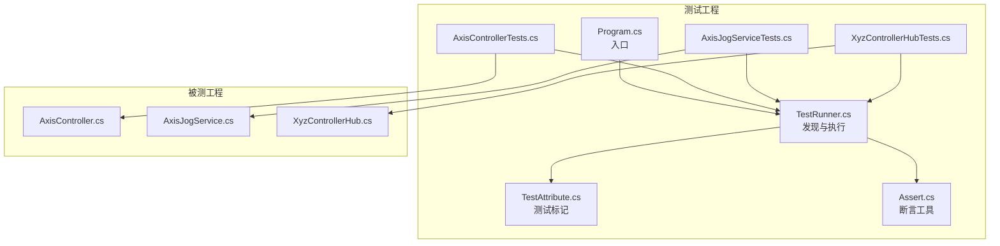
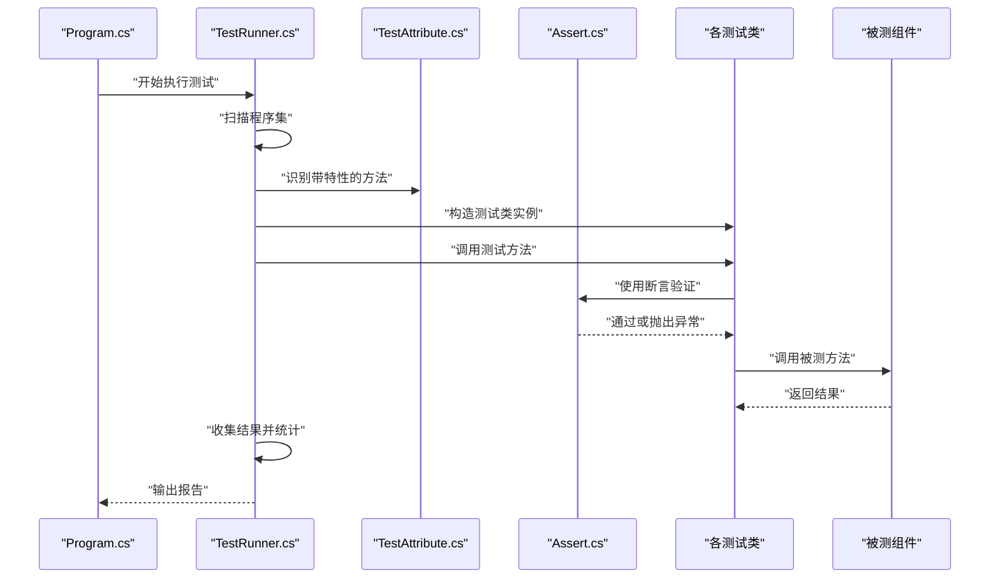
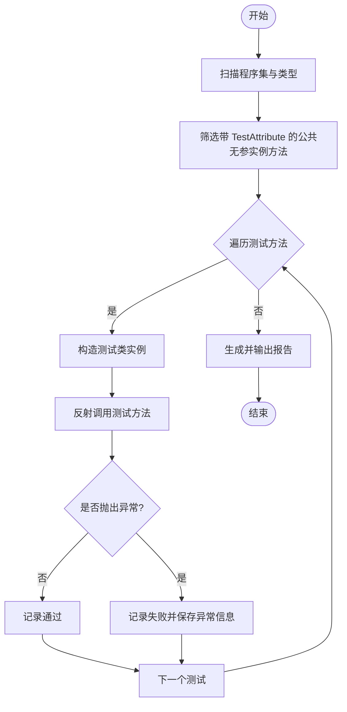
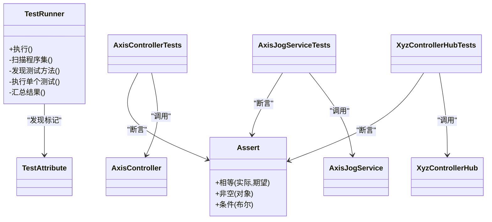

# 测试框架

<cite>
**本文引用的文件**   
- [TestRunner.cs](file://src/XyzController.Tests/Testing/TestRunner.cs)
- [Assert.cs](file://src/XyzController.Tests/Testing/Assert.cs)
- [TestAttribute.cs](file://src/XyzController.Tests/Testing/TestAttribute.cs)
- [Program.cs](file://src/XyzController.Tests/Program.cs)
- [AxisControllerTests.cs](file://src/XyzController.Tests/Tests/AxisControllerTests.cs)
- [AxisJogServiceTests.cs](file://src/XyzController.Tests/Tests/AxisJogServiceTests.cs)
- [XyzControllerHubTests.cs](file://src/XyzController.Tests/Tests/XyzControllerHubTests.cs)
- [AxisController.cs](file://src/XyzController/Logic/AxisController.cs)
- [AxisJogService.cs](file://src/XyzController/Logic/AxisJogService.cs)
- [XyzControllerHub.cs](file://src/XyzController/Logic/XyzControllerHub.cs)
</cite>

## 目录
1. [简介](#简介)
2. [项目结构](#项目结构)
3. [核心组件](#核心组件)
4. [架构总览](#架构总览)
5. [详细组件分析](#详细组件分析)
6. [依赖关系分析](#依赖关系分析)
7. [性能考虑](#性能考虑)
8. [故障排查指南](#故障排查指南)
9. [结论](#结论)
10. [附录](#附录)

## 简介
本仓库包含一个轻量级、自托管的单元测试框架，用于对 XyzController 项目的核心逻辑进行验证。该框架由以下三个关键部分组成：
- TestAttribute：用于标记测试方法
- Assert：提供断言能力
- TestRunner：基于反射发现并执行被标记为测试的方法

此外，测试工程提供了针对 AxisController、AxisJogService、XyzControllerHub 等核心组件的示例测试用例，展示了如何编写与运行测试套件。

## 项目结构
测试框架位于 Tests 工程中，核心实现集中在 Testing 目录下；具体业务组件的测试用例位于 Tests 目录下；入口程序在 Program.cs 中负责启动测试执行。

图表来源
- [Program.cs](file://src/XyzController.Tests/Program.cs)
- [TestRunner.cs](file://src/XyzController.Tests/Testing/TestRunner.cs)
- [TestAttribute.cs](file://src/XyzController.Tests/Testing/TestAttribute.cs)
- [Assert.cs](file://src/XyzController.Tests/Testing/Assert.cs)
- [AxisControllerTests.cs](file://src/XyzController.Tests/Tests/AxisControllerTests.cs)
- [AxisJogServiceTests.cs](file://src/XyzController.Tests/Tests/AxisJogServiceTests.cs)
- [XyzControllerHubTests.cs](file://src/XyzController.Tests/Tests/XyzControllerHubTests.cs)
- [AxisController.cs](file://src/XyzController/Logic/AxisController.cs)
- [AxisJogService.cs](file://src/XyzController/Logic/AxisJogService.cs)
- [XyzControllerHub.cs](file://src/XyzController/Logic/XyzControllerHub.cs)

章节来源
- [Program.cs](file://src/XyzController.Tests/Program.cs)
- [TestRunner.cs](file://src/XyzController.Tests/Testing/TestRunner.cs)
- [TestAttribute.cs](file://src/XyzController.Tests/Testing/TestAttribute.cs)
- [Assert.cs](file://src/XyzController.Tests/Testing/Assert.cs)
- [AxisControllerTests.cs](file://src/XyzController.Tests/Tests/AxisControllerTests.cs)
- [AxisJogServiceTests.cs](file://src/XyzController.Tests/Tests/AxisJogServiceTests.cs)
- [XyzControllerHubTests.cs](file://src/XyzController.Tests/Tests/XyzControllerHubTests.cs)
- [AxisController.cs](file://src/XyzController/Logic/AxisController.cs)
- [AxisJogService.cs](file://src/XyzController/Logic/AxisJogService.cs)
- [XyzControllerHub.cs](file://src/XyzController/Logic/XyzControllerHub.cs)

## 核心组件
本节深入介绍测试框架的三个核心组件及其职责。

- TestAttribute（测试标记）
  - 作用：标注某个公共无参实例方法为“测试方法”，供 TestRunner 通过反射发现。
  - 设计要点：作为特性类，仅用于元数据标记，不包含运行时逻辑。
  - 扩展点：可添加属性以支持跳过、分类、超时等高级场景。

- Assert（断言工具）
  - 作用：提供一系列静态断言方法，用于验证期望与实际结果是否一致。
  - 行为约定：当断言失败时抛出异常，从而让 TestRunner 将对应测试标记为失败。
  - 常见能力：相等性比较、空值检查、范围判断、集合校验等。

- TestRunner（测试执行器）
  - 作用：扫描当前程序集中所有类型与方法，查找带有 TestAttribute 的方法并通过反射调用执行。
  - 执行流程：发现 -> 构造实例 -> 调用方法 -> 捕获异常 -> 汇总结果。
  - 输出：打印每个测试的名称、状态（通过/失败）、耗时与错误信息。

章节来源
- [TestAttribute.cs](file://src/XyzController.Tests/Testing/TestAttribute.cs)
- [Assert.cs](file://src/XyzController.Tests/Testing/Assert.cs)
- [TestRunner.cs](file://src/XyzController.Tests/Testing/TestRunner.cs)

## 架构总览
下图展示了从入口到测试执行的完整时序。

图表来源
- [Program.cs](file://src/XyzController.Tests/Program.cs)
- [TestRunner.cs](file://src/XyzController.Tests/Testing/TestRunner.cs)
- [TestAttribute.cs](file://src/XyzController.Tests/Testing/TestAttribute.cs)
- [Assert.cs](file://src/XyzController.Tests/Testing/Assert.cs)
- [AxisControllerTests.cs](file://src/XyzController.Tests/Tests/AxisControllerTests.cs)
- [AxisJogServiceTests.cs](file://src/XyzController.Tests/Tests/AxisJogServiceTests.cs)
- [XyzControllerHubTests.cs](file://src/XyzController.Tests/Tests/XyzControllerHubTests.cs)
- [AxisController.cs](file://src/XyzController/Logic/AxisController.cs)
- [AxisJogService.cs](file://src/XyzController/Logic/AxisJogService.cs)
- [XyzControllerHub.cs](file://src/XyzController/Logic/XyzControllerHub.cs)

## 详细组件分析

### 测试执行器 TestRunner
- 功能概述
  - 反射扫描当前程序集，定位所有公共实例方法且带有 TestAttribute 的方法。
  - 为每个测试方法创建对应的测试类实例并调用。
  - 捕获执行过程中的异常，记录失败原因。
  - 汇总通过/失败数量、总耗时，并输出可读的报告。

- 执行流程（流程图）

图表来源
- [TestRunner.cs](file://src/XyzController.Tests/Testing/TestRunner.cs)

章节来源
- [TestRunner.cs](file://src/XyzController.Tests/Testing/TestRunner.cs)

### 断言工具 Assert
- 设计目标
  - 提供简洁、易读的断言 API，使测试意图清晰。
  - 失败时抛出异常，便于统一由 TestRunner 捕获并记录。

- 典型能力
  - 相等性断言：验证两个对象或值是否相等。
  - 空值断言：验证对象是否为 null 或非 null。
  - 条件断言：根据布尔表达式判定成功或失败。
  - 集合断言：验证集合大小、成员存在性等。

- 最佳实践
  - 一次测试只关注一个行为，避免在一个测试中堆叠过多断言。
  - 断言消息应明确表达期望与实际差异，便于快速定位问题。

章节来源
- [Assert.cs](file://src/XyzController.Tests/Testing/Assert.cs)

### 测试标记 TestAttribute
- 角色定位
  - 作为元数据标记，标识某个方法为测试方法。
  - 不携带运行时逻辑，保持最小化设计。

- 扩展建议
  - 增加 Category 属性以支持按类别筛选执行。
  - 增加 Timeout 属性以支持超时控制。
  - 增加 Skip 属性以支持选择性跳过。

章节来源
- [TestAttribute.cs](file://src/XyzController.Tests/Testing/TestAttribute.cs)

### 入口程序 Program
- 职责
  - 初始化并调用 TestRunner 执行全部测试。
  - 可选：读取命令行参数以过滤测试、输出格式控制等。

章节来源
- [Program.cs](file://src/XyzController.Tests/Program.cs)

### 测试用例示例与用法

#### 如何编写测试用例
- 步骤
  - 新建测试类，命名建议以“被测类名+Tests”结尾。
  - 在需要测试的公共无参实例方法上添加 TestAttribute。
  - 在方法内部使用 Assert 进行断言。
  - 如需准备资源，可在构造函数或专用初始化方法中完成。

- 参考路径
  - [AxisControllerTests.cs](file://src/XyzController.Tests/Tests/AxisControllerTests.cs)
  - [AxisJogServiceTests.cs](file://src/XyzController.Tests/Tests/AxisJogServiceTests.cs)
  - [XyzControllerHubTests.cs](file://src/XyzController.Tests/Tests/XyzControllerHubTests.cs)

#### 如何定义测试方法
- 要求
  - 必须是公共实例方法。
  - 必须无参数。
  - 必须带有 TestAttribute。

- 参考路径
  - [TestAttribute.cs](file://src/XyzController.Tests/Testing/TestAttribute.cs)

#### 如何执行测试套件
- 方式
  - 直接运行测试工程的入口程序，自动发现并执行全部测试。
  - 或通过构建系统（如 dotnet test 若已集成）执行。

- 参考路径
  - [Program.cs](file://src/XyzController.Tests/Program.cs)
  - [TestRunner.cs](file://src/XyzController.Tests/Testing/TestRunner.cs)

#### 示例：测试 AxisController
- 目标
  - 验证轴控制器在给定输入下的行为是否符合预期。
  - 覆盖正常路径与边界条件。

- 建议用例
  - 设置初始位置后查询当前位置。
  - 移动至目标位置并验证最终坐标。
  - 越界或非法输入时的错误处理。

- 参考路径
  - [AxisControllerTests.cs](file://src/XyzController.Tests/Tests/AxisControllerTests.cs)
  - [AxisController.cs](file://src/XyzController/Logic/AxisController.cs)

#### 示例：测试 AxisJogService
- 目标
  - 验证点动服务在不同模式与速度下的响应。
  - 确保状态切换与并发访问安全。

- 建议用例
  - 切换 JogMode 并验证当前模式。
  - 多次点动命令后的累计位移。
  - 停止命令中断正在进行的点动。

- 参考路径
  - [AxisJogServiceTests.cs](file://src/XyzController.Tests/Tests/AxisJogServiceTests.cs)
  - [AxisJogService.cs](file://src/XyzController/Logic/AxisJogService.cs)

#### 示例：测试 XyzControllerHub
- 目标
  - 验证 Hub 对外暴露的接口行为与事件通知。
  - 确保多客户端场景下的正确性与稳定性。

- 建议用例
  - 连接/断开事件触发。
  - 广播消息的正确路由。
  - 错误与异常的上报。

- 参考路径
  - [XyzControllerHubTests.cs](file://src/XyzController.Tests/Tests/XyzControllerHubTests.cs)
  - [XyzControllerHub.cs](file://src/XyzController/Logic/XyzControllerHub.cs)

## 依赖关系分析
- 组件耦合
  - TestRunner 依赖 TestAttribute 进行方法发现。
  - 测试类依赖 Assert 进行断言。
  - 测试类与被测组件（AxisController、AxisJogService、XyzControllerHub）存在调用关系。

- 外部依赖
  - 主要依赖 .NET 反射机制与基础库。
  - 无第三方测试框架依赖，保持轻量。

图表来源
- [TestRunner.cs](file://src/XyzController.Tests/Testing/TestRunner.cs)
- [TestAttribute.cs](file://src/XyzController.Tests/Testing/TestAttribute.cs)
- [Assert.cs](file://src/XyzController.Tests/Testing/Assert.cs)
- [AxisControllerTests.cs](file://src/XyzController.Tests/Tests/AxisControllerTests.cs)
- [AxisJogServiceTests.cs](file://src/XyzController.Tests/Tests/AxisJogServiceTests.cs)
- [XyzControllerHubTests.cs](file://src/XyzController.Tests/Tests/XyzControllerHubTests.cs)
- [AxisController.cs](file://src/XyzController/Logic/AxisController.cs)
- [AxisJogService.cs](file://src/XyzController/Logic/AxisJogService.cs)
- [XyzControllerHub.cs](file://src/XyzController/Logic/XyzControllerHub.cs)

章节来源
- [TestRunner.cs](file://src/XyzController.Tests/Testing/TestRunner.cs)
- [TestAttribute.cs](file://src/XyzController.Tests/Testing/TestAttribute.cs)
- [Assert.cs](file://src/XyzController.Tests/Testing/Assert.cs)
- [AxisControllerTests.cs](file://src/XyzController.Tests/Tests/AxisControllerTests.cs)
- [AxisJogServiceTests.cs](file://src/XyzController.Tests/Tests/AxisJogServiceTests.cs)
- [XyzControllerHubTests.cs](file://src/XyzController.Tests/Tests/XyzControllerHubTests.cs)
- [AxisController.cs](file://src/XyzController/Logic/AxisController.cs)
- [AxisJogService.cs](file://src/XyzController/Logic/AxisJogService.cs)
- [XyzControllerHub.cs](file://src/XyzController/Logic/XyzControllerHub.cs)

## 性能考虑
- 反射开销
  - 测试发现阶段使用反射，建议在大型项目中缓存类型与方法列表以减少重复扫描。
- 测试隔离
  - 每个测试方法独立构造实例，避免共享状态导致的竞态与额外同步开销。
- 并行执行
  - 当前为顺序执行，可按需引入线程池或任务并行策略，但需注意线程安全与资源竞争。
- I/O 与外部依赖
  - 尽量使用内存中的模拟对象替代真实 I/O，缩短单测执行时间。

[本节为通用指导，无需特定文件引用]

## 故障排查指南
- 常见问题
  - 测试未被发现：确认方法为公共、无参、实例方法，且带有 TestAttribute。
  - 断言失败：检查断言消息与实际值，必要时在测试中打印上下文信息。
  - 执行异常：TestRunner 会捕获异常并记录失败原因，查看控制台输出定位问题。
- 调试技巧
  - 在测试方法内设置断点，使用 IDE 逐步执行。
  - 缩小测试范围：仅运行单个测试类或方法，提高反馈速度。
  - 简化被测环境：用最小化的 Mock 替换复杂依赖，聚焦核心逻辑。

章节来源
- [TestRunner.cs](file://src/XyzController.Tests/Testing/TestRunner.cs)
- [Assert.cs](file://src/XyzController.Tests/Testing/Assert.cs)

## 结论
本测试框架以最小实现满足单元测试的核心需求：标记、发现、执行与断言。通过清晰的职责划分与可扩展的设计，开发者可以快速编写高质量测试用例，并对 AxisController、AxisJogService、XyzControllerHub 等核心组件进行有效验证。后续可根据团队需求引入更多特性（如分类、超时、并行），并结合持续集成提升质量保障水平。

[本节为总结性内容，无需特定文件引用]

## 附录

### 初学者入门
- 基本概念
  - 测试目的：尽早发现问题，保证代码行为符合预期。
  - 测试粒度：优先围绕单一职责方法进行验证。
- 实践建议
  - 先写失败的测试，再实现功能使其通过。
  - 使用有意义的断言消息，便于理解失败原因。
  - 保持测试稳定、快速、可重复。

[本节为概念性内容，无需特定文件引用]

### 高级策略
- 分层测试
  - 单元层：纯逻辑与算法验证。
  - 集成层：组合多个组件验证交互。
- 模拟与桩
  - 使用简单模拟对象替代外部依赖，隔离副作用。
- 性能测试
  - 对热点路径进行基准测试，关注平均耗时与方差。
  - 结合压力测试评估并发与资源占用。

[本节为概念性内容，无需特定文件引用]

### 覆盖率分析与持续集成
- 覆盖率
  - 建议使用 .NET 生态中的覆盖率工具（例如内置或第三方插件）生成行/分支覆盖率报告。
  - 将覆盖率阈值纳入质量门禁，防止回归。
- 持续集成
  - 在 CI 流水线中构建测试工程并执行测试。
  - 输出测试结果与覆盖率报告，失败则阻断合并。

[本节为通用指导，无需特定文件引用]