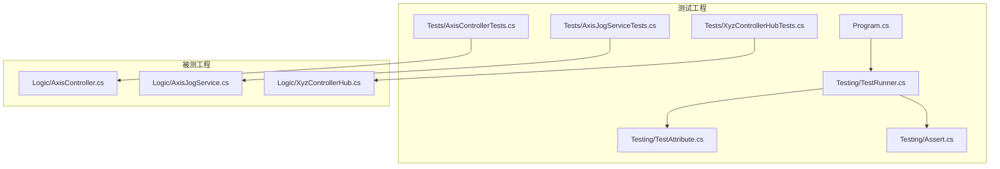
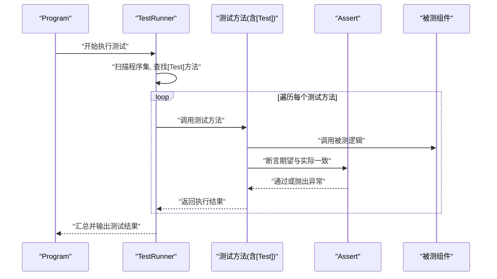
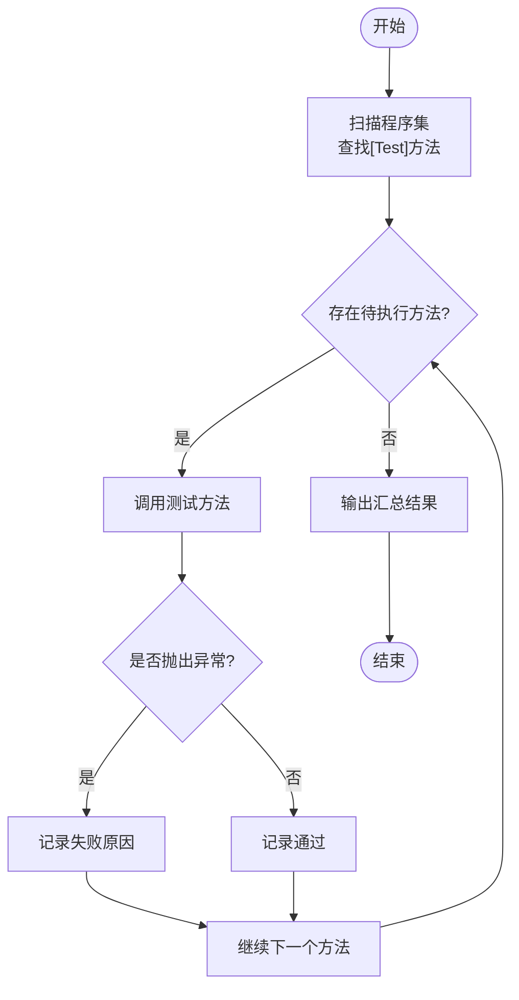
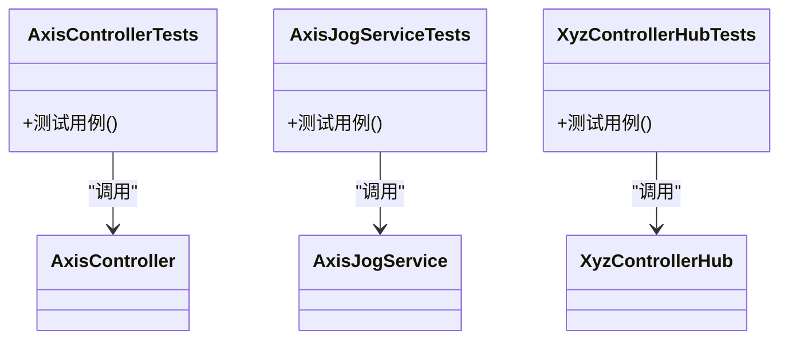
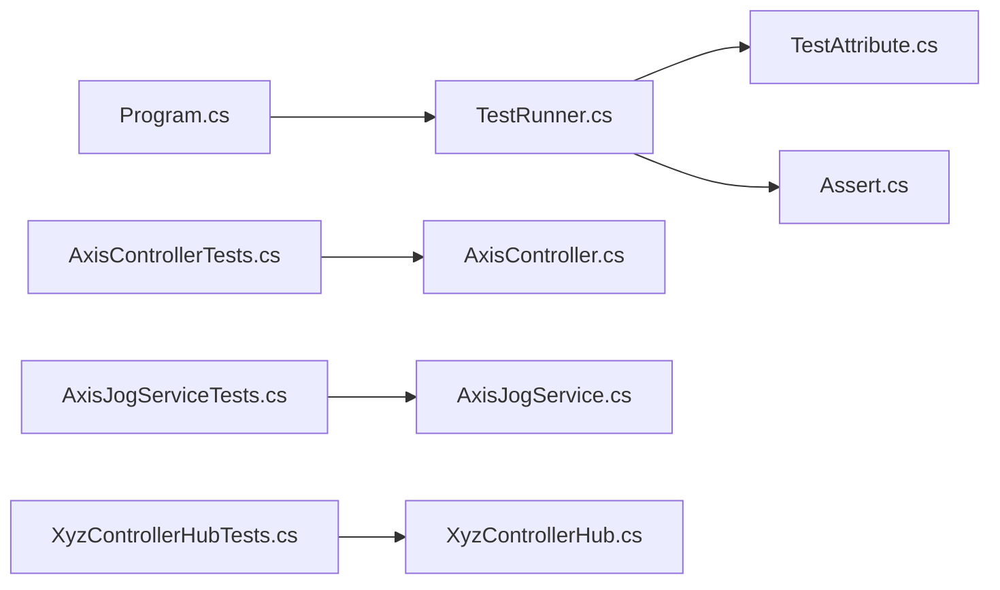

# 测试框架

<cite>
**本文引用的文件**   
- [src/XyzController.Tests/Testing/TestRunner.cs](file://src/XyzController.Tests/Testing/TestRunner.cs)
- [src/XyzController.Tests/Testing/TestAttribute.cs](file://src/XyzController.Tests/Testing/TestAttribute.cs)
- [src/XyzController.Tests/Testing/Assert.cs](file://src/XyzController.Tests/Testing/Assert.cs)
- [src/XyzController.Tests/Program.cs](file://src/XyzController.Tests/Program.cs)
- [src/XyzController.Tests/Tests/AxisControllerTests.cs](file://src/XyzController.Tests/Tests/AxisControllerTests.cs)
- [src/XyzController.Tests/Tests/AxisJogServiceTests.cs](file://src/XyzController.Tests/Tests/AxisJogServiceTests.cs)
- [src/XyzController.Tests/Tests/XyzControllerHubTests.cs](file://src/XyzController.Tests/Tests/XyzControllerHubTests.cs)
- [src/XyzController/Logic/AxisController.cs](file://src/XyzController/Logic/AxisController.cs)
- [src/XyzController/Logic/AxisJogService.cs](file://src/XyzController/Logic/AxisJogService.cs)
- [src/XyzController/Logic/XyzControllerHub.cs](file://src/XyzController/Logic/XyzControllerHub.cs)
</cite>

## 目录
1. [简介](#简介)
2. [项目结构](#项目结构)
3. [核心组件](#核心组件)
4. [架构总览](#架构总览)
5. [详细组件分析](#详细组件分析)
6. [依赖关系分析](#依赖关系分析)
7. [性能考虑](#性能考虑)
8. [故障排除指南](#故障排除指南)
9. [结论](#结论)
10. [附录](#附录)

## 简介
本文件为 XyzController 项目的测试框架提供全面文档，覆盖自定义测试架构的设计理念与实现细节。重点包括：
- TestRunner 测试运行器的工作机制
- TestAttribute 测试标记属性的使用方式
- Assert 断言库的设计与用法
- 单元测试的组织结构与命名约定
- 高质量测试用例编写最佳实践
- 模拟对象的使用方法与测试数据准备策略
- 针对 AxisController、AxisJogService 等核心组件的测试示例说明
- 测试覆盖率统计、持续集成配置建议与性能优化技巧
- 调试测试用例的方法与常见问题排查

## 项目结构
测试相关代码位于 src/XyzController.Tests 目录下，采用“按特性组织”的结构：
- Testing：测试基础设施（TestRunner、TestAttribute、Assert）
- Tests：具体业务组件的测试类
- Program：测试入口程序，负责发现并执行测试

图表来源
- [src/XyzController.Tests/Program.cs](file://src/XyzController.Tests/Program.cs)
- [src/XyzController.Tests/Testing/TestRunner.cs](file://src/XyzController.Tests/Testing/TestRunner.cs)
- [src/XyzController.Tests/Testing/TestAttribute.cs](file://src/XyzController.Tests/Testing/TestAttribute.cs)
- [src/XyzController.Tests/Testing/Assert.cs](file://src/XyzController.Tests/Testing/Assert.cs)
- [src/XyzController.Tests/Tests/AxisControllerTests.cs](file://src/XyzController.Tests/Tests/AxisControllerTests.cs)
- [src/XyzController.Tests/Tests/AxisJogServiceTests.cs](file://src/XyzController.Tests/Tests/AxisJogServiceTests.cs)
- [src/XyzController.Tests/Tests/XyzControllerHubTests.cs](file://src/XyzController.Tests/Tests/XyzControllerHubTests.cs)
- [src/XyzController/Logic/AxisController.cs](file://src/XyzController/Logic/AxisController.cs)
- [src/XyzController/Logic/AxisJogService.cs](file://src/XyzController/Logic/AxisJogService.cs)
- [src/XyzController/Logic/XyzControllerHub.cs](file://src/XyzController/Logic/XyzControllerHub.cs)

章节来源
- [src/XyzController.Tests/Program.cs](file://src/XyzController.Tests/Program.cs)
- [src/XyzController.Tests/Testing/TestRunner.cs](file://src/XyzController.Tests/Testing/TestRunner.cs)
- [src/XyzController.Tests/Testing/TestAttribute.cs](file://src/XyzController.Tests/Testing/TestAttribute.cs)
- [src/XyzController.Tests/Testing/Assert.cs](file://src/XyzController.Tests/Testing/Assert.cs)
- [src/XyzController.Tests/Tests/AxisControllerTests.cs](file://src/XyzController.Tests/Tests/AxisControllerTests.cs)
- [src/XyzController.Tests/Tests/AxisJogServiceTests.cs](file://src/XyzController.Tests/Tests/AxisJogServiceTests.cs)
- [src/XyzController.Tests/Tests/XyzControllerHubTests.cs](file://src/XyzController.Tests/Tests/XyzControllerHubTests.cs)

## 核心组件
本节概述测试框架的核心构件及其职责：
- TestAttribute：用于标注测试方法，使运行器能够识别可执行的测试用例
- TestRunner：扫描程序集，发现带 TestAttribute 的方法，依次执行并收集结果
- Assert：提供丰富的断言方法，用于验证期望与实际结果的一致性
- Program：控制台入口，初始化运行器并输出测试结果

设计要点
- 最小化依赖：仅依赖反射与基础类型，便于在多种环境中运行
- 可扩展性：通过扩展 Assert 或引入新的 Attribute 支持更复杂的场景
- 可观测性：统一的结果收集与输出格式，便于后续接入覆盖率工具与 CI

章节来源
- [src/XyzController.Tests/Testing/TestAttribute.cs](file://src/XyzController.Tests/Testing/TestAttribute.cs)
- [src/XyzController.Tests/Testing/TestRunner.cs](file://src/XyzController.Tests/Testing/TestRunner.cs)
- [src/XyzController.Tests/Testing/Assert.cs](file://src/XyzController.Tests/Testing/Assert.cs)
- [src/XyzController.Tests/Program.cs](file://src/XyzController.Tests/Program.cs)

## 架构总览
下图展示了测试运行时的关键交互流程：Program 启动后调用 TestRunner，TestRunner 利用反射发现所有被 TestAttribute 标记的方法，逐个执行并在失败时记录异常信息。

图表来源
- [src/XyzController.Tests/Program.cs](file://src/XyzController.Tests/Program.cs)
- [src/XyzController.Tests/Testing/TestRunner.cs](file://src/XyzController.Tests/Testing/TestRunner.cs)
- [src/XyzController.Tests/Testing/TestAttribute.cs](file://src/XyzController.Tests/Testing/TestAttribute.cs)
- [src/XyzController.Tests/Testing/Assert.cs](file://src/XyzController.Tests/Testing/Assert.cs)

## 详细组件分析

### TestAttribute 测试标记属性
- 作用：标注测试方法，供 TestRunner 发现与执行
- 使用方式：在测试方法上添加该属性即可纳入运行范围
- 扩展点：可附加参数以控制执行顺序、超时、重试等（如需要）

章节来源
- [src/XyzController.Tests/Testing/TestAttribute.cs](file://src/XyzController.Tests/Testing/TestAttribute.cs)

### TestRunner 测试运行器
- 功能：
  - 反射扫描当前程序集，定位所有带有 TestAttribute 的方法
  - 实例化包含测试方法的类（若需要）
  - 逐一执行测试方法，捕获异常并记录失败原因
  - 汇总并通过控制台输出测试结果
- 执行流程：
  - 初始化阶段：加载程序集、解析类型与方法
  - 执行阶段：按发现顺序执行测试方法
  - 收尾阶段：统计通过/失败数量，输出报告

图表来源
- [src/XyzController.Tests/Testing/TestRunner.cs](file://src/XyzController.Tests/Testing/TestRunner.cs)

章节来源
- [src/XyzController.Tests/Testing/TestRunner.cs](file://src/XyzController.Tests/Testing/TestRunner.cs)

### Assert 断言库
- 目标：提供清晰、可读的断言方法，帮助快速定位失败原因
- 常见能力：
  - 相等性比较
  - 布尔条件判断
  - 异常预期检查
  - 集合/数值范围断言
- 行为约定：
  - 断言失败时抛出异常，由 TestRunner 捕获并记录
  - 断言消息应包含上下文信息，便于定位问题

章节来源
- [src/XyzController.Tests/Testing/Assert.cs](file://src/XyzController.Tests/Testing/Assert.cs)

### 测试入口 Program
- 职责：
  - 创建并调用 TestRunner
  - 打印测试结果摘要
- 特点：
  - 简单直接，避免复杂依赖
  - 便于在 CI 中作为命令行入口执行

章节来源
- [src/XyzController.Tests/Program.cs](file://src/XyzController.Tests/Program.cs)

### 核心组件测试示例

#### AxisController 测试
- 关注点：
  - 轴状态变更、边界限制、运动命令处理
  - 事件触发与回调的正确性
- 建议用例：
  - 正常移动与停止
  - 越界保护与错误码
  - 并发访问下的线程安全（必要时）

章节来源
- [src/XyzController.Tests/Tests/AxisControllerTests.cs](file://src/XyzController.Tests/Tests/AxisControllerTests.cs)
- [src/XyzController/Logic/AxisController.cs](file://src/XyzController/Logic/AxisController.cs)

#### AxisJogService 测试
- 关注点：
  - 点动模式切换、速度/加速度控制
  - 与 AxisController 的协作
- 建议用例：
  - 不同 JogMode 的行为差异
  - 动态调整速度与步长
  - 中断与恢复

章节来源
- [src/XyzController.Tests/Tests/AxisJogServiceTests.cs](file://src/XyzController.Tests/Tests/AxisJogServiceTests.cs)
- [src/XyzController/Logic/AxisJogService.cs](file://src/XyzController/Logic/AxisJogService.cs)

#### XyzControllerHub 测试
- 关注点：
  - 多轴协调与通信
  - 事件分发与订阅
- 建议用例：
  - 多轴联动场景
  - Hub 生命周期管理

章节来源
- [src/XyzController.Tests/Tests/XyzControllerHubTests.cs](file://src/XyzController.Tests/Tests/XyzControllerHubTests.cs)
- [src/XyzController/Logic/XyzControllerHub.cs](file://src/XyzController/Logic/XyzControllerHub.cs)

### 面向对象组件关系图（测试视角）
下图展示测试类与被测类的依赖关系，体现测试对业务组件的调用路径。

图表来源
- [src/XyzController.Tests/Tests/AxisControllerTests.cs](file://src/XyzController.Tests/Tests/AxisControllerTests.cs)
- [src/XyzController.Tests/Tests/AxisJogServiceTests.cs](file://src/XyzController.Tests/Tests/AxisJogServiceTests.cs)
- [src/XyzController.Tests/Tests/XyzControllerHubTests.cs](file://src/XyzController.Tests/Tests/XyzControllerHubTests.cs)
- [src/XyzController/Logic/AxisController.cs](file://src/XyzController/Logic/AxisController.cs)
- [src/XyzController/Logic/AxisJogService.cs](file://src/XyzController/Logic/AxisJogService.cs)
- [src/XyzController/Logic/XyzControllerHub.cs](file://src/XyzController/Logic/XyzControllerHub.cs)

## 依赖关系分析
- 测试工程依赖被测工程中的 Logic 层组件
- TestRunner 依赖反射机制进行方法发现与执行
- Assert 作为纯函数式断言库，无外部依赖
- Program 作为入口，仅依赖 TestRunner

图表来源
- [src/XyzController.Tests/Program.cs](file://src/XyzController.Tests/Program.cs)
- [src/XyzController.Tests/Testing/TestRunner.cs](file://src/XyzController.Tests/Testing/TestRunner.cs)
- [src/XyzController.Tests/Testing/TestAttribute.cs](file://src/XyzController.Tests/Testing/TestAttribute.cs)
- [src/XyzController.Tests/Testing/Assert.cs](file://src/XyzController.Tests/Testing/Assert.cs)
- [src/XyzController.Tests/Tests/AxisControllerTests.cs](file://src/XyzController.Tests/Tests/AxisControllerTests.cs)
- [src/XyzController.Tests/Tests/AxisJogServiceTests.cs](file://src/XyzController.Tests/Tests/AxisJogServiceTests.cs)
- [src/XyzController.Tests/Tests/XyzControllerHubTests.cs](file://src/XyzController.Tests/Tests/XyzControllerHubTests.cs)
- [src/XyzController/Logic/AxisController.cs](file://src/XyzController/Logic/AxisController.cs)
- [src/XyzController/Logic/AxisJogService.cs](file://src/XyzController/Logic/AxisJogService.cs)
- [src/XyzController/Logic/XyzControllerHub.cs](file://src/XyzController/Logic/XyzControllerHub.cs)

章节来源
- [src/XyzController.Tests/Program.cs](file://src/XyzController.Tests/Program.cs)
- [src/XyzController.Tests/Testing/TestRunner.cs](file://src/XyzController.Tests/Testing/TestRunner.cs)
- [src/XyzController.Tests/Testing/TestAttribute.cs](file://src/XyzController.Tests/Testing/TestAttribute.cs)
- [src/XyzController.Tests/Testing/Assert.cs](file://src/XyzController.Tests/Testing/Assert.cs)
- [src/XyzController.Tests/Tests/AxisControllerTests.cs](file://src/XyzController.Tests/Tests/AxisControllerTests.cs)
- [src/XyzController.Tests/Tests/AxisJogServiceTests.cs](file://src/XyzController.Tests/Tests/AxisJogServiceTests.cs)
- [src/XyzController.Tests/Tests/XyzControllerHubTests.cs](file://src/XyzController.Tests/Tests/XyzControllerHubTests.cs)
- [src/XyzController/Logic/AxisController.cs](file://src/XyzController/Logic/AxisController.cs)
- [src/XyzController/Logic/AxisJogService.cs](file://src/XyzController/Logic/AxisJogService.cs)
- [src/XyzController/Logic/XyzControllerHub.cs](file://src/XyzController/Logic/XyzControllerHub.cs)

## 性能考虑
- 减少反射开销：
  - 将测试方法缓存到静态字典，避免重复扫描
  - 仅在首次运行时构建方法元数据
- 并行执行：
  - 对无共享状态的测试方法启用并行执行
  - 对共享资源（如全局配置）加锁或使用隔离上下文
- 断言优化：
  - 优先使用轻量级断言，避免昂贵的计算
  - 在断言前进行快速失败的条件检查
- 测试数据准备：
  - 使用工厂方法或数据生成器批量构造对象
  - 复用不可变数据，减少分配

[本节为通用指导，不直接分析具体文件]

## 故障排除指南
- 测试未被执行：
  - 确认测试方法已正确添加 TestAttribute
  - 检查方法是否为公共且无参数
- 断言失败难以定位：
  - 在 Assert 中提供清晰的上下文消息
  - 打印关键变量值与状态快照
- 异步测试不稳定：
  - 使用同步等待或超时机制
  - 避免竞态条件，必要时增加延迟或重试
- 内存泄漏与资源未释放：
  - 确保在测试结束时释放句柄、关闭连接
  - 使用 try/finally 或 using 模式保证清理

章节来源
- [src/XyzController.Tests/Testing/TestRunner.cs](file://src/XyzController.Tests/Testing/TestRunner.cs)
- [src/XyzController.Tests/Testing/Assert.cs](file://src/XyzController.Tests/Testing/Assert.cs)

## 结论
本测试框架以最小依赖与高可扩展性为目标，通过 TestAttribute 与 TestRunner 的组合实现了简洁而强大的测试执行模型。配合 Assert 断言库与合理的测试组织方式，能够有效保障 AxisController、AxisJogService、XyzControllerHub 等核心组件的质量。建议在团队内推广统一的测试规范，并结合覆盖率统计与持续集成，进一步提升软件可靠性与交付效率。

[本节为总结性内容，不直接分析具体文件]

## 附录

### 单元测试组织与命名约定
- 文件组织：
  - 每个被测类对应一个测试类，位于 Tests 目录
  - 测试类名遵循“被测类名+Tests”的约定
- 方法命名：
  - 使用描述性名称表达输入、操作与期望结果
  - 示例风格：当_某条件_时应_某行为_
- 测试结构：
  - Arrange（准备）：构造输入与依赖
  - Act（执行）：调用被测方法
  - Assert（断言）：验证结果与副作用

[本节为通用指导，不直接分析具体文件]

### 模拟对象与测试数据准备
- 模拟对象：
  - 使用接口抽象外部依赖，便于替换为模拟实现
  - 在测试中注入模拟对象，控制返回值与行为
- 测试数据：
  - 使用常量或工厂方法集中管理
  - 对边界值、异常路径与典型路径分别准备数据

[本节为通用指导，不直接分析具体文件]

### 覆盖率统计与持续集成
- 覆盖率统计：
  - 在本地或 CI 环境运行测试并生成覆盖率报告
  - 关注分支覆盖率与关键路径覆盖
- 持续集成：
  - 在每次提交后自动执行测试
  - 失败时阻断合并，确保主干质量

[本节为通用指导，不直接分析具体文件]

### 调试测试用例
- 单步调试：
  - 在测试方法入口设置断点，逐步执行
- 日志输出：
  - 在关键路径输出必要信息，辅助定位问题
- 隔离问题：
  - 将复杂测试拆分为多个小测试，缩小问题范围

[本节为通用指导，不直接分析具体文件]