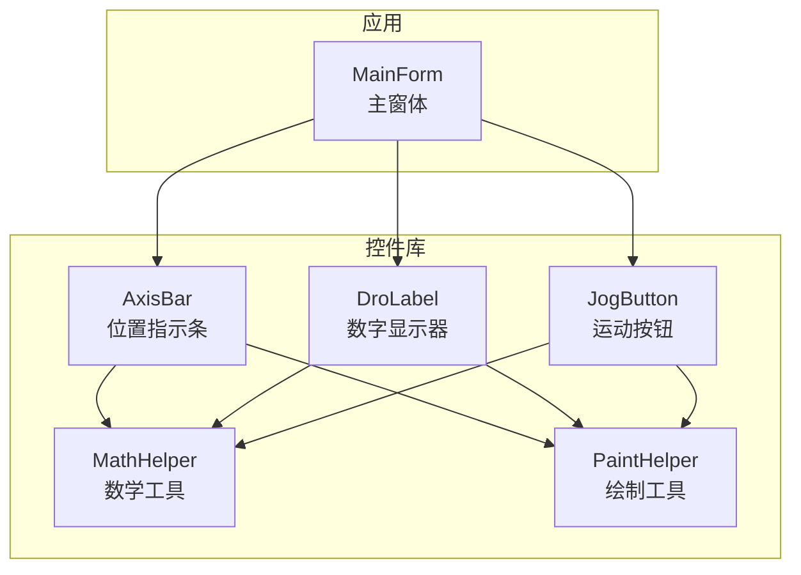
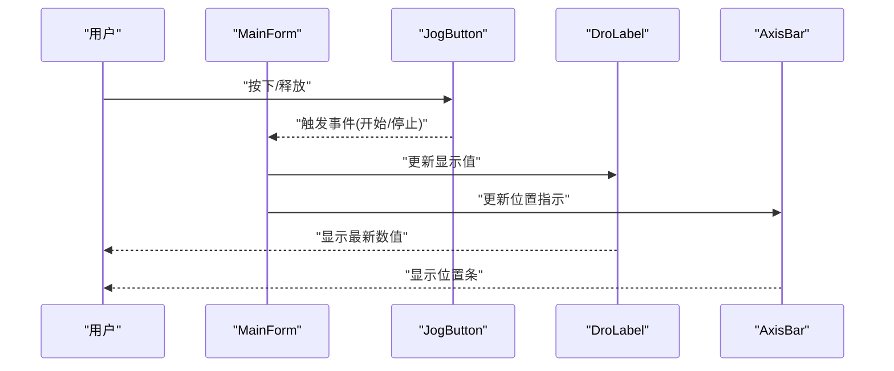
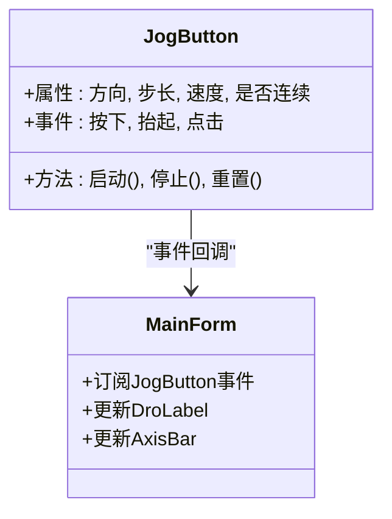
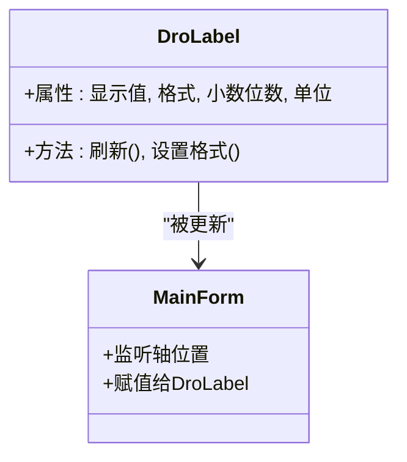
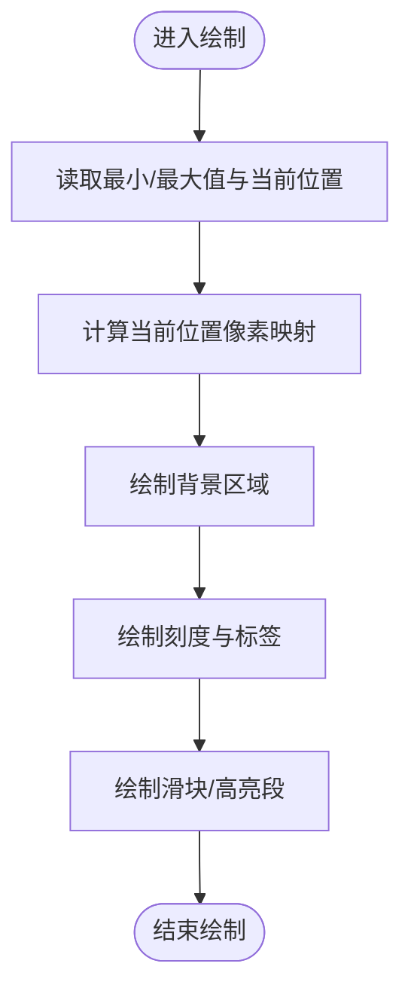
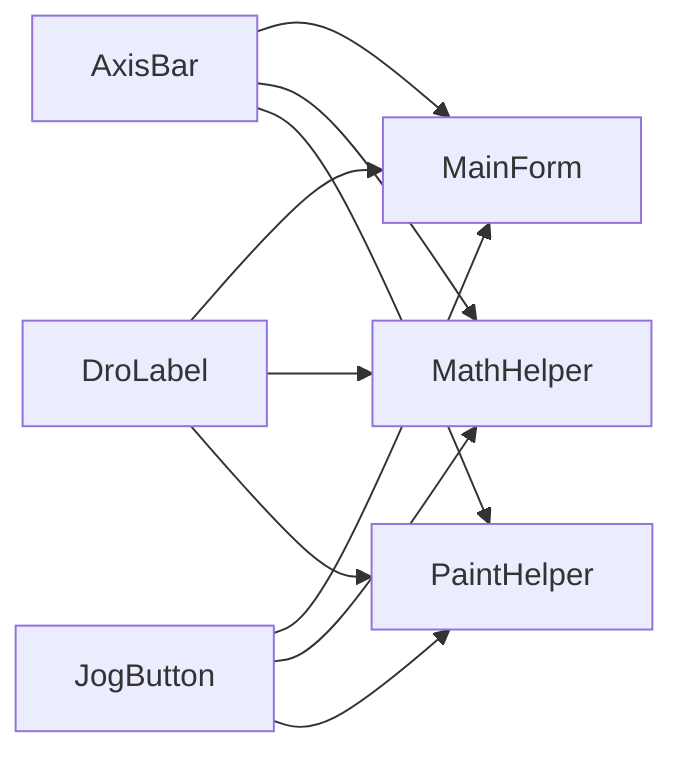

# 基础控件

<cite>
**本文引用的文件**   
- [JogButton.cs](file://src/XyzController.Controls/JogButton.cs)
- [DroLabel.cs](file://src/XyzController.Controls/DroLabel.cs)
- [AxisBar.cs](file://src/XyzController.Controls/AxisBar.cs)
- [MathHelper.cs](file://src/XyzController.Controls/MathHelper.cs)
- [PaintHelper.cs](file://src/XyzController.Controls/PaintHelper.cs)
- [MainForm.cs](file://src/XyzController/MainForm.cs)
- [MainForm.Designer.cs](file://src/XyzController/MainForm.Designer.cs)
</cite>

## 目录
1. [简介](#简介)
2. [项目结构](#项目结构)
3. [核心组件](#核心组件)
4. [架构总览](#架构总览)
5. [详细组件分析](#详细组件分析)
6. [依赖关系分析](#依赖关系分析)
7. [性能考虑](#性能考虑)
8. [故障排查指南](#故障排查指南)
9. [结论](#结论)
10. [附录](#附录)

## 简介
本文件面向“基础控件”主题，聚焦以下三个可复用 UI 控件的实现与使用：
- JogButton 运动按钮：用于触发轴的运动（点动/步进）控制。
- DroLabel 数字显示器：用于显示当前轴位置或相关数值。
- AxisBar 位置指示条：用于可视化轴的当前位置、范围与目标。

文档将深入说明这些控件的接口、配置项、事件与绘制逻辑，并通过调用序列图展示它们与主窗体及业务层的交互方式。内容兼顾初学者友好与资深开发者的技术深度。

## 项目结构
本项目采用分层组织：
- 控制层与业务逻辑位于 XyzController 工程（如 MainForm）。
- 自定义控件位于 XyzController.Controls 工程（JogButton、DroLabel、AxisBar 等）。
- 辅助工具类 MathHelper、PaintHelper 为控件提供数学与绘制支持。

图表来源
- [MainForm.cs](file://src/XyzController/MainForm.cs)
- [JogButton.cs](file://src/XyzController.Controls/JogButton.cs)
- [DroLabel.cs](file://src/XyzController.Controls/DroLabel.cs)
- [AxisBar.cs](file://src/XyzController.Controls/AxisBar.cs)
- [MathHelper.cs](file://src/XyzController.Controls/MathHelper.cs)
- [PaintHelper.cs](file://src/XyzController.Controls/PaintHelper.cs)

章节来源
- [MainForm.cs](file://src/XyzController/MainForm.cs)
- [MainForm.Designer.cs](file://src/XyzController/MainForm.Designer.cs)
- [JogButton.cs](file://src/XyzController.Controls/JogButton.cs)
- [DroLabel.cs](file://src/XyzController.Controls/DroLabel.cs)
- [AxisBar.cs](file://src/XyzController.Controls/AxisBar.cs)
- [MathHelper.cs](file://src/XyzController.Controls/MathHelper.cs)
- [PaintHelper.cs](file://src/XyzController.Controls/PaintHelper.cs)

## 核心组件
本节概述三个控件的职责与对外暴露的关键能力（属性、方法、事件），并给出典型用法模式。为避免直接粘贴代码，所有实现细节均以“源码路径+行号”形式引用。

- JogButton 运动按钮
  - 职责：封装用户点击/按住行为，向上层发出“开始运动/停止运动”指令，支持方向、步长、速度等参数。
  - 关键属性（示例）：方向、步长、是否连续、样式等。
  - 关键事件：按下、抬起、点击等。
  - 典型用法：在 MainForm 中绑定到对应轴的控制命令；通过属性设置步长与方向。
  - 参考路径：[JogButton.cs](file://src/XyzController.Controls/JogButton.cs)、[MainForm.cs](file://src/XyzController/MainForm.cs)

- DroLabel 数字显示器
  - 职责：以文本形式显示数值（如轴坐标），支持格式化、精度、单位等。
  - 关键属性：显示值、格式字符串、小数位数、单位、颜色等。
  - 刷新策略：当底层数据变化时更新显示。
  - 典型用法：绑定到轴位置源，随位置更新而重绘。
  - 参考路径：[DroLabel.cs](file://src/XyzController.Controls/DroLabel.cs)、[MainForm.cs](file://src/XyzController/MainForm.cs)

- AxisBar 位置指示条
  - 职责：可视化轴的当前位置与范围，支持刻度、比例缩放、高亮段等。
  - 关键属性：最小/最大值、当前位置、刻度间隔、颜色、对齐等。
  - 绘制流程：计算比例映射、绘制背景/刻度/滑块/标签。
  - 典型用法：与 JogButton 和 DroLabel 联动，形成“控制-显示-指示”的闭环。
  - 参考路径：[AxisBar.cs](file://src/XyzController.Controls/AxisBar.cs)、[MathHelper.cs](file://src/XyzController.Controls/MathHelper.cs)、[PaintHelper.cs](file://src/XyzController.Controls/PaintHelper.cs)

章节来源
- [JogButton.cs](file://src/XyzController.Controls/JogButton.cs)
- [DroLabel.cs](file://src/XyzController.Controls/DroLabel.cs)
- [AxisBar.cs](file://src/XyzController.Controls/AxisBar.cs)
- [MainForm.cs](file://src/XyzController/MainForm.cs)

## 架构总览
下图展示了主窗体如何组合并使用这三个控件，以及控件之间的协作关系。

图表来源
- [MainForm.cs](file://src/XyzController/MainForm.cs)
- [JogButton.cs](file://src/XyzController.Controls/JogButton.cs)
- [DroLabel.cs](file://src/XyzController.Controls/DroLabel.cs)
- [AxisBar.cs](file://src/XyzController.Controls/AxisBar.cs)

## 详细组件分析

### JogButton 运动按钮
- 设计要点
  - 输入处理：捕获鼠标按下/抬起/移动等事件，区分单击与长按，驱动不同动作。
  - 状态管理：维护“运行中/空闲”状态，避免重复触发。
  - 参数化：支持方向、步长、速度等配置，便于统一控制多个轴。
  - 事件模型：向宿主（MainForm）抛出事件，由上层协调业务逻辑。
- 关键接口（概念性）
  - 属性：方向、步长、速度、是否连续、样式等。
  - 事件：按下、抬起、点击、状态变更。
  - 方法：启动、停止、重置。
- 使用模式
  - 在 MainForm 中实例化并订阅事件；根据事件调用控制器或更新其他控件。
  - 通过属性面板或配置文件动态调整步长与方向。
- 常见问题
  - 快速多次点击导致状态错乱：需在内部加锁或状态机保护。
  - 长按无响应：检查计时器或定时器线程与 UI 线程同步。
- 参考路径
  - [JogButton.cs](file://src/XyzController.Controls/JogButton.cs)
  - [MainForm.cs](file://src/XyzController/MainForm.cs)

#### 类关系图

图表来源
- [JogButton.cs](file://src/XyzController.Controls/JogButton.cs)
- [MainForm.cs](file://src/XyzController/MainForm.cs)

章节来源
- [JogButton.cs](file://src/XyzController.Controls/JogButton.cs)
- [MainForm.cs](file://src/XyzController/MainForm.cs)

### DroLabel 数字显示器
- 设计要点
  - 数据绑定：接收外部数值源，内部缓存最新值，按需刷新。
  - 格式化：支持固定小数位、科学计数、单位后缀等。
  - 绘制优化：仅在值变化或尺寸变化时重绘，减少闪烁。
- 关键接口（概念性）
  - 属性：显示值、格式字符串、小数位数、单位、颜色、字体等。
  - 方法：刷新、设置格式。
- 使用模式
  - 在 MainForm 中监听轴位置变化，赋值给 DroLabel 的显示值。
  - 通过属性面板切换单位或精度。
- 常见问题
  - 频繁刷新导致界面卡顿：合并更新或使用双缓冲。
  - 数值过大/过小显示异常：校验格式与范围。
- 参考路径
  - [DroLabel.cs](file://src/XyzController.Controls/DroLabel.cs)
  - [MainForm.cs](file://src/XyzController/MainForm.cs)

#### 类关系图

图表来源
- [DroLabel.cs](file://src/XyzController.Controls/DroLabel.cs)
- [MainForm.cs](file://src/XyzController/MainForm.cs)

章节来源
- [DroLabel.cs](file://src/XyzController.Controls/DroLabel.cs)
- [MainForm.cs](file://src/XyzController/MainForm.cs)

### AxisBar 位置指示条
- 设计要点
  - 比例映射：将物理坐标映射到像素区间，支持反转与偏移。
  - 刻度与标签：按间隔绘制刻度线与数值标签。
  - 高亮与范围：标记安全区、目标区或当前段。
  - 绘制工具：借助 PaintHelper 进行通用绘制，借助 MathHelper 进行数值计算。
- 关键接口（概念性）
  - 属性：最小值、最大值、当前位置、刻度间隔、颜色、对齐、标签可见性等。
  - 方法：更新范围、刷新、设置刻度。
- 使用模式
  - 在 MainForm 中根据轴的最小/最大/当前位置更新 AxisBar。
  - 与 JogButton 联动，点击拖动或滚轮微调位置。
- 常见问题
  - 比例失真：检查最小/最大值与当前值的边界条件。
  - 标签重叠：动态调整刻度间隔或隐藏部分标签。
- 参考路径
  - [AxisBar.cs](file://src/XyzController.Controls/AxisBar.cs)
  - [MathHelper.cs](file://src/XyzController.Controls/MathHelper.cs)
  - [PaintHelper.cs](file://src/XyzController.Controls/PaintHelper.cs)

#### 流程图（位置映射与绘制）

图表来源
- [AxisBar.cs](file://src/XyzController.Controls/AxisBar.cs)
- [MathHelper.cs](file://src/XyzController.Controls/MathHelper.cs)
- [PaintHelper.cs](file://src/XyzController.Controls/PaintHelper.cs)

章节来源
- [AxisBar.cs](file://src/XyzController.Controls/AxisBar.cs)
- [MathHelper.cs](file://src/XyzController.Controls/MathHelper.cs)
- [PaintHelper.cs](file://src/XyzController.Controls/PaintHelper.cs)

## 依赖关系分析
- 控件间耦合
  - JogButton 与 MainForm 松耦合：通过事件解耦，便于替换控制器。
  - DroLabel 与 AxisBar 均依赖 MathHelper 与 PaintHelper，提升复用性与一致性。
- 外部依赖
  - 主窗体负责编排控件与业务逻辑，控件不直接访问业务层。
- 潜在循环依赖
  - 控件之间不互相引用，仅通过 MainForm 协调，避免循环依赖。

图表来源
- [JogButton.cs](file://src/XyzController.Controls/JogButton.cs)
- [DroLabel.cs](file://src/XyzController.Controls/DroLabel.cs)
- [AxisBar.cs](file://src/XyzController.Controls/AxisBar.cs)
- [MathHelper.cs](file://src/XyzController.Controls/MathHelper.cs)
- [PaintHelper.cs](file://src/XyzController.Controls/PaintHelper.cs)
- [MainForm.cs](file://src/XyzController/MainForm.cs)

章节来源
- [JogButton.cs](file://src/XyzController.Controls/JogButton.cs)
- [DroLabel.cs](file://src/XyzController.Controls/DroLabel.cs)
- [AxisBar.cs](file://src/XyzController.Controls/AxisBar.cs)
- [MathHelper.cs](file://src/XyzController.Controls/MathHelper.cs)
- [PaintHelper.cs](file://src/XyzController.Controls/PaintHelper.cs)
- [MainForm.cs](file://src/XyzController/MainForm.cs)

## 性能考虑
- 减少不必要的重绘
  - 对 DroLabel 与 AxisBar 的值变化进行去抖或批量更新。
  - 启用双缓冲以降低闪烁。
- 绘制优化
  - 仅在尺寸变化或数据变化时重绘。
  - 合理设置刻度间隔，避免过多标签绘制。
- 事件节流
  - 对 JogButton 的快速点击进行节流，防止频繁触发业务逻辑。

## 故障排查指南
- JogButton 无响应
  - 检查事件订阅是否正确绑定。
  - 确认内部状态机未处于锁定状态。
  - 参考路径：[JogButton.cs](file://src/XyzController.Controls/JogButton.cs)
- DroLabel 显示异常
  - 检查格式字符串与小数位数设置。
  - 确认数值源是否为空或越界。
  - 参考路径：[DroLabel.cs](file://src/XyzController.Controls/DroLabel.cs)
- AxisBar 比例错误
  - 核对最小/最大值与当前位置的边界条件。
  - 检查比例映射函数返回值。
  - 参考路径：[AxisBar.cs](file://src/XyzController.Controls/AxisBar.cs)、[MathHelper.cs](file://src/XyzController.Controls/MathHelper.cs)
- 主窗体集成问题
  - 确认控件初始化顺序与属性设置时机。
  - 参考路径：[MainForm.cs](file://src/XyzController/MainForm.cs)、[MainForm.Designer.cs](file://src/XyzController/MainForm.Designer.cs)

章节来源
- [JogButton.cs](file://src/XyzController.Controls/JogButton.cs)
- [DroLabel.cs](file://src/XyzController.Controls/DroLabel.cs)
- [AxisBar.cs](file://src/XyzController.Controls/AxisBar.cs)
- [MathHelper.cs](file://src/XyzController.Controls/MathHelper.cs)
- [MainForm.cs](file://src/XyzController/MainForm.cs)
- [MainForm.Designer.cs](file://src/XyzController/MainForm.Designer.cs)

## 结论
JogButton、DroLabel 与 AxisBar 构成了“控制-显示-指示”的基础控件集。通过事件驱动的松耦合设计与统一的数学/绘制工具，它们在保持易用的同时具备良好的扩展性与可维护性。建议在实际项目中结合业务需求进一步抽象参数与样式，以提升一致性与复用度。

## 附录
- 常用配置项速查（概念性）
  - JogButton：方向、步长、速度、是否连续、样式。
  - DroLabel：显示值、格式字符串、小数位数、单位、颜色、字体。
  - AxisBar：最小/最大值、当前位置、刻度间隔、颜色、对齐、标签可见性。
- 典型调用序列（概念性）
  - 用户操作 JogButton → 触发事件 → MainForm 更新 DroLabel 与 AxisBar → 界面反馈。