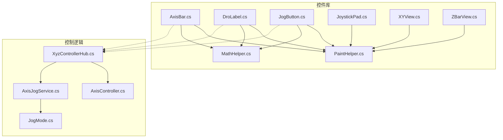
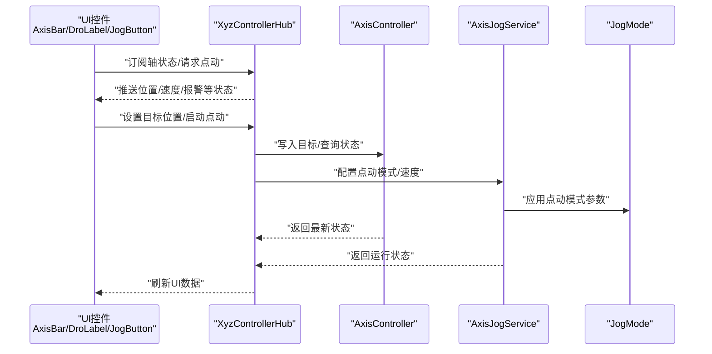
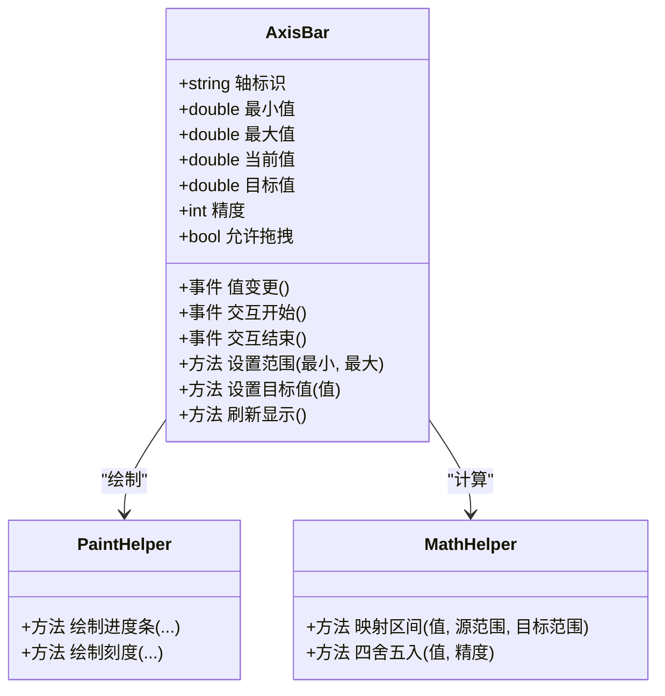
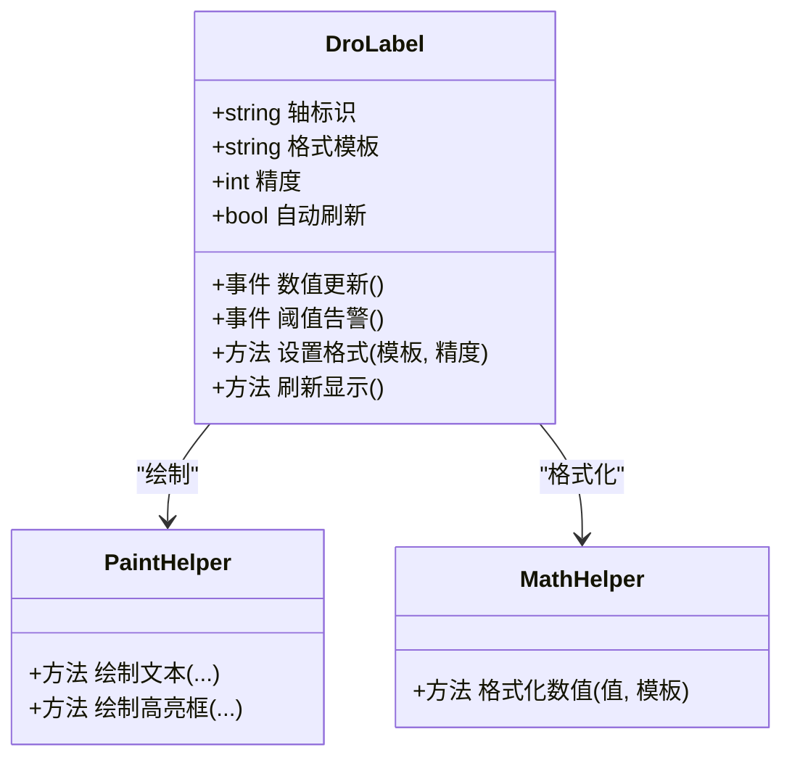
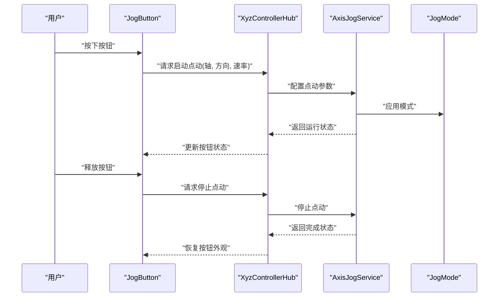
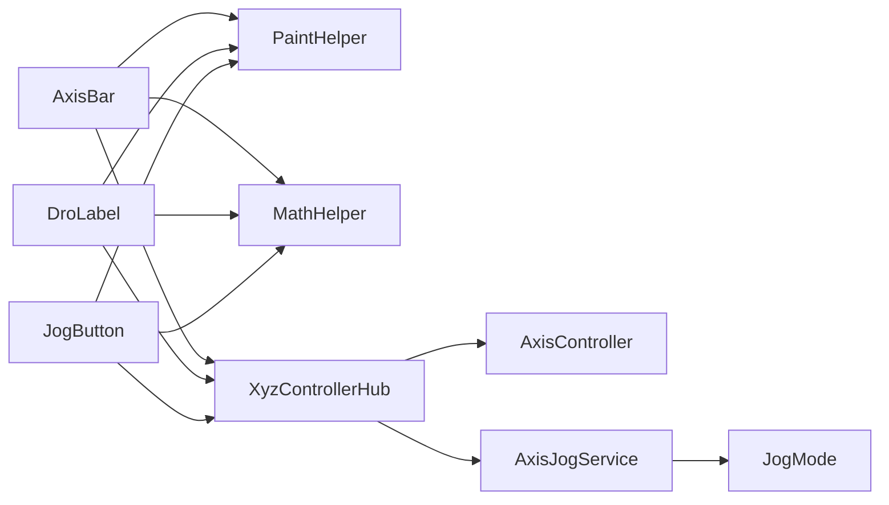

# 基础控件

<cite>
**本文引用的文件**   
- [AxisBar.cs](file://src/XyzController.Controls/AxisBar.cs)
- [DroLabel.cs](file://src/XyzController.Controls/DroLabel.cs)
- [JogButton.cs](file://src/XyzController.Controls/JogButton.cs)
- [PaintHelper.cs](file://src/XyzController.Controls/PaintHelper.cs)
- [MathHelper.cs](file://src/XyzController.Controls/MathHelper.cs)
- [JoystickPad.cs](file://src/XyzController.Controls/JoystickPad.cs)
- [XYView.cs](file://src/XyzController.Controls/XYView.cs)
- [ZBarView.cs](file://src/XyzController.Controls/ZBarView.cs)
- [XyzControllerHub.cs](file://src/XyzController/Logic/XyzControllerHub.cs)
- [AxisController.cs](file://src/XyzController/Logic/AxisController.cs)
- [AxisJogService.cs](file://src/XyzController/Logic/AxisJogService.cs)
- [JogMode.cs](file://src/XyzController/Logic/JogMode.cs)
</cite>

## 目录
1. [简介](#简介)
2. [项目结构](#项目结构)
3. [核心组件](#核心组件)
4. [架构总览](#架构总览)
5. [详细组件分析](#详细组件分析)
6. [依赖关系分析](#依赖关系分析)
7. [性能考虑](#性能考虑)
8. [故障排查指南](#故障排查指南)
9. [结论](#结论)
10. [附录](#附录)

## 简介
本文件聚焦于 XyzController 中的三个基础控件：AxisBar（轴进度条）、DroLabel（数字位置标签）与 JogButton（点动按钮）。文档从功能特性、属性配置、事件机制、数据绑定与状态同步、使用示例、性能优化与最佳实践等维度进行系统化说明，既适合初学者快速上手，也便于高级用户深入定制。

## 项目结构
基础控件位于控件库项目中，围绕绘制辅助与数学工具提供统一的渲染与计算能力；业务逻辑通过控制器与服务层暴露给 UI 控件，实现松耦合的数据驱动界面。

图表来源
- [AxisBar.cs](file://src/XyzController.Controls/AxisBar.cs)
- [DroLabel.cs](file://src/XyzController.Controls/DroLabel.cs)
- [JogButton.cs](file://src/XyzController.Controls/JogButton.cs)
- [PaintHelper.cs](file://src/XyzController.Controls/PaintHelper.cs)
- [MathHelper.cs](file://src/XyzController.Controls/MathHelper.cs)
- [JoystickPad.cs](file://src/XyzController.Controls/JoystickPad.cs)
- [XYView.cs](file://src/XyzController.Controls/XYView.cs)
- [ZBarView.cs](file://src/XyzController.Controls/ZBarView.cs)
- [XyzControllerHub.cs](file://src/XyzController/Logic/XyzControllerHub.cs)
- [AxisController.cs](file://src/XyzController/Logic/AxisController.cs)
- [AxisJogService.cs](file://src/XyzController/Logic/AxisJogService.cs)
- [JogMode.cs](file://src/XyzController/Logic/JogMode.cs)

章节来源
- [AxisBar.cs](file://src/XyzController.Controls/AxisBar.cs)
- [DroLabel.cs](file://src/XyzController.Controls/DroLabel.cs)
- [JogButton.cs](file://src/XyzController.Controls/JogButton.cs)
- [PaintHelper.cs](file://src/XyzController.Controls/PaintHelper.cs)
- [MathHelper.cs](file://src/XyzController.Controls/MathHelper.cs)
- [XyzControllerHub.cs](file://src/XyzController/Logic/XyzControllerHub.cs)
- [AxisController.cs](file://src/XyzController/Logic/AxisController.cs)
- [AxisJogService.cs](file://src/XyzController/Logic/AxisJogService.cs)
- [JogMode.cs](file://src/XyzController/Logic/JogMode.cs)

## 核心组件
本节概述三个基础控件的职责与协作方式：
- AxisBar：以可视化进度条形式展示单轴当前位置、范围与目标值，支持拖拽或外部命令更新。
- DroLabel：显示轴的实时数值（如位置、速度），具备格式化与单位显示能力。
- JogButton：用于触发点动操作，支持按住持续点动、点击步进、方向选择与速率控制。

这些控件通过 Hub 与控制器/服务交互，遵循“数据驱动 + 事件回调”的模式，确保 UI 与底层运动控制解耦。

章节来源
- [AxisBar.cs](file://src/XyzController.Controls/AxisBar.cs)
- [DroLabel.cs](file://src/XyzController.Controls/DroLabel.cs)
- [JogButton.cs](file://src/XyzController.Controls/JogButton.cs)
- [XyzControllerHub.cs](file://src/XyzController/Logic/XyzControllerHub.cs)

## 架构总览
下图展示了控件与控制层的交互路径：控件通过 Hub 访问轴控制器与点动服务，读取状态并下发指令；绘制与数值计算由 PaintHelper 与 MathHelper 支撑。

图表来源
- [XyzControllerHub.cs](file://src/XyzController/Logic/XyzControllerHub.cs)
- [AxisController.cs](file://src/XyzController/Logic/AxisController.cs)
- [AxisJogService.cs](file://src/XyzController/Logic/AxisJogService.cs)
- [JogMode.cs](file://src/XyzController/Logic/JogMode.cs)

## 详细组件分析

### AxisBar（轴进度条）
- 功能特性
  - 显示轴当前位置、最小/最大范围、目标位置指示线。
  - 支持鼠标拖拽调整目标位置，或通过外部命令更新。
  - 可配置刻度、颜色主题、是否允许用户交互。
- 关键属性（建议）
  - 轴标识：用于区分不同轴。
  - 范围：最小/最大值。
  - 当前值/目标值：双向绑定。
  - 步长/精度：数值步进与显示小数位。
  - 样式：背景色、前景色、刻度颜色、字体大小。
  - 交互：是否启用拖拽、是否显示提示文本。
- 事件机制
  - 值变更事件：当目标值变化时触发，供上层持久化或联动其他控件。
  - 交互开始/结束事件：用于记录用户操作日志或进入特定工作模式。
- 数据绑定与状态同步
  - 通过 Hub 订阅轴状态，自动刷新当前值与目标值。
  - 支持单向/双向绑定策略，避免频繁重绘。
- 使用示例（步骤）
  - 实例化控件并指定轴标识。
  - 设置范围与精度。
  - 绑定到 Hub 的轴状态源。
  - 注册值变更事件处理。
  - 在容器布局中放置控件。
- 自定义与扩展
  - 重写绘制逻辑以适配特殊刻度或动画效果。
  - 组合多个 AxisBar 形成多轴面板。
- 性能优化
  - 增量更新：仅重绘变化区域。
  - 节流刷新：高频状态下合并更新周期。
  - 缓存画笔与字体资源。

章节来源
- [AxisBar.cs](file://src/XyzController.Controls/AxisBar.cs)
- [PaintHelper.cs](file://src/XyzController.Controls/PaintHelper.cs)
- [MathHelper.cs](file://src/XyzController.Controls/MathHelper.cs)
- [XyzControllerHub.cs](file://src/XyzController/Logic/XyzControllerHub.cs)

#### 类图（AxisBar）

图表来源
- [AxisBar.cs](file://src/XyzController.Controls/AxisBar.cs)
- [PaintHelper.cs](file://src/XyzController.Controls/PaintHelper.cs)
- [MathHelper.cs](file://src/XyzController.Controls/MathHelper.cs)

### DroLabel（数字位置标签）
- 功能特性
  - 显示轴的数值信息（位置、速度、误差等），支持单位与格式字符串。
  - 支持高亮、闪烁等视觉反馈，用于异常或越界提示。
- 关键属性（建议）
  - 数据源：关联的轴标识或具体数值。
  - 格式：数值格式化模板（含单位）。
  - 精度：小数位数。
  - 样式：字体、颜色、对齐方式。
  - 行为：是否自动刷新、刷新频率。
- 事件机制
  - 数值更新事件：可用于统计或联动其他显示。
  - 阈值告警事件：超出安全范围时触发。
- 数据绑定与状态同步
  - 通过 Hub 订阅轴状态，按配置频率刷新显示。
  - 支持只读模式与编辑模式切换。
- 使用示例（步骤）
  - 创建 DroLabel 并绑定轴标识。
  - 设置格式与精度。
  - 配置刷新策略。
  - 注册阈值告警事件。
- 自定义与扩展
  - 自定义格式器以支持工程单位换算。
  - 叠加图标或状态指示灯。
- 性能优化
  - 按需刷新：仅在值变化超过阈值时更新。
  - 文本缓存：减少字符串拼接开销。

章节来源
- [DroLabel.cs](file://src/XyzController.Controls/DroLabel.cs)
- [PaintHelper.cs](file://src/XyzController.Controls/PaintHelper.cs)
- [MathHelper.cs](file://src/XyzController.Controls/MathHelper.cs)
- [XyzControllerHub.cs](file://src/XyzController/Logic/XyzControllerHub.cs)

#### 类图（DroLabel）

图表来源
- [DroLabel.cs](file://src/XyzController.Controls/DroLabel.cs)
- [PaintHelper.cs](file://src/XyzController.Controls/PaintHelper.cs)
- [MathHelper.cs](file://src/XyzController.Controls/MathHelper.cs)

### JogButton（点动按钮）
- 功能特性
  - 支持按住持续点动、点击步进移动。
  - 可选择方向（正/负）、速率档位，支持快捷键绑定。
- 关键属性（建议）
  - 轴标识：目标轴。
  - 方向：正向/反向。
  - 速率：点动速度或步进量。
  - 模式：按住连续/点击步进。
  - 样式：正常/按下/禁用状态外观。
- 事件机制
  - 按下/释放事件：用于控制点动启停。
  - 模式切换事件：用于记录操作历史或切换工作模式。
- 数据绑定与状态同步
  - 通过 Hub 调用点动服务，根据模式与速率下发指令。
  - 监听运行状态，动态更新按钮可用性与外观。
- 使用示例（步骤）
  - 创建 JogButton 并绑定轴标识与方向。
  - 设置速率与模式。
  - 注册按下/释放事件。
  - 将按钮放入工具栏或控制面板。
- 自定义与扩展
  - 扩展速率档位与快捷键映射。
  - 组合多轴 JogButton 实现联动点动。
- 性能优化
  - 事件节流：防止高频重复触发。
  - 状态去抖：避免快速切换导致的抖动。

章节来源
- [JogButton.cs](file://src/XyzController.Controls/JogButton.cs)
- [PaintHelper.cs](file://src/XyzController.Controls/PaintHelper.cs)
- [MathHelper.cs](file://src/XyzController.Controls/MathHelper.cs)
- [XyzControllerHub.cs](file://src/XyzController/Logic/XyzControllerHub.cs)
- [AxisJogService.cs](file://src/XyzController/Logic/AxisJogService.cs)
- [JogMode.cs](file://src/XyzController/Logic/JogMode.cs)

#### 序列图（JogButton 点动流程）

图表来源
- [JogButton.cs](file://src/XyzController.Controls/JogButton.cs)
- [XyzControllerHub.cs](file://src/XyzController/Logic/XyzControllerHub.cs)
- [AxisJogService.cs](file://src/XyzController/Logic/AxisJogService.cs)
- [JogMode.cs](file://src/XyzController/Logic/JogMode.cs)

## 依赖关系分析
- 控件对绘制与数学工具的依赖
  - AxisBar、DroLabel、JogButton 均依赖 PaintHelper 进行统一绘制，依赖 MathHelper 进行数值映射与格式化。
- 控件对控制层的依赖
  - 通过 XyzControllerHub 访问 AxisController 与 AxisJogService，实现状态读取与指令下发。
- 潜在循环依赖
  - 控件不直接引用控制器，而是通过 Hub 间接通信，降低耦合度。

图表来源
- [AxisBar.cs](file://src/XyzController.Controls/AxisBar.cs)
- [DroLabel.cs](file://src/XyzController.Controls/DroLabel.cs)
- [JogButton.cs](file://src/XyzController.Controls/JogButton.cs)
- [PaintHelper.cs](file://src/XyzController.Controls/PaintHelper.cs)
- [MathHelper.cs](file://src/XyzController.Controls/MathHelper.cs)
- [XyzControllerHub.cs](file://src/XyzController/Logic/XyzControllerHub.cs)
- [AxisController.cs](file://src/XyzController/Logic/AxisController.cs)
- [AxisJogService.cs](file://src/XyzController/Logic/AxisJogService.cs)
- [JogMode.cs](file://src/XyzController/Logic/JogMode.cs)

章节来源
- [AxisBar.cs](file://src/XyzController.Controls/AxisBar.cs)
- [DroLabel.cs](file://src/XyzController.Controls/DroLabel.cs)
- [JogButton.cs](file://src/XyzController.Controls/JogButton.cs)
- [PaintHelper.cs](file://src/XyzController.Controls/PaintHelper.cs)
- [MathHelper.cs](file://src/XyzController.Controls/MathHelper.cs)
- [XyzControllerHub.cs](file://src/XyzController/Logic/XyzControllerHub.cs)
- [AxisController.cs](file://src/XyzController/Logic/AxisController.cs)
- [AxisJogService.cs](file://src/XyzController/Logic/AxisJogService.cs)
- [JogMode.cs](file://src/XyzController/Logic/JogMode.cs)

## 性能考虑
- 绘制优化
  - 使用双缓冲减少闪烁。
  - 局部重绘：仅更新变化区域，避免整屏刷新。
  - 缓存画笔、字体与渐变对象，避免重复创建。
- 数据刷新
  - 采用节流策略合并高频状态更新。
  - 差值比较：仅当数值变化超过阈值时触发 UI 更新。
- 交互响应
  - 事件去抖与节流，避免快速操作导致的状态抖动。
  - 异步处理耗时操作，保持 UI 线程流畅。
- 内存管理
  - 及时释放未使用的资源（如图像、字体）。
  - 避免在绘制过程中分配大量临时对象。

[本节为通用性能指导，无需列出具体文件来源]

## 故障排查指南
- 常见问题
  - 数值不更新：检查 Hub 订阅是否正确、刷新频率是否过低。
  - 点动无响应：确认 JogButton 模式与速率配置、Hub 与点动服务连接状态。
  - 显示错位：验证范围映射与精度设置、坐标转换是否正确。
- 定位方法
  - 启用调试输出，记录关键事件与状态变化。
  - 逐步断点：在控件事件与 Hub 调用处插入断点。
  - 简化复现：移除非必要控件与样式，缩小问题范围。
- 修复建议
  - 修正数据绑定路径与格式模板。
  - 增加边界检查与异常捕获，提升健壮性。
  - 合理设置刷新间隔与阈值，平衡实时性与性能。

章节来源
- [AxisBar.cs](file://src/XyzController.Controls/AxisBar.cs)
- [DroLabel.cs](file://src/XyzController.Controls/DroLabel.cs)
- [JogButton.cs](file://src/XyzController.Controls/JogButton.cs)
- [XyzControllerHub.cs](file://src/XyzController/Logic/XyzControllerHub.cs)

## 结论
AxisBar、DroLabel 与 JogButton 构成了 XyzController 的基础交互层，通过 Hub 与控制器/服务解耦，实现了清晰的数据流与事件模型。借助 PaintHelper 与 MathHelper 的统一绘制与计算能力，控件具备良好的可扩展性与性能表现。遵循本文的最佳实践与优化建议，可在保证用户体验的同时，稳定高效地驱动轴控制系统。

[本节为总结性内容，无需列出具体文件来源]

## 附录
- 相关控件参考
  - JoystickPad：摇杆输入控件，常用于多轴联动控制。
  - XYView：二维视图控件，用于轨迹与平面位置显示。
  - ZBarView：Z轴专用条形视图，与 AxisBar 类似但针对 Z 轴场景优化。

章节来源
- [JoystickPad.cs](file://src/XyzController.Controls/JoystickPad.cs)
- [XYView.cs](file://src/XyzController.Controls/XYView.cs)
- [ZBarView.cs](file://src/XyzController.Controls/ZBarView.cs)