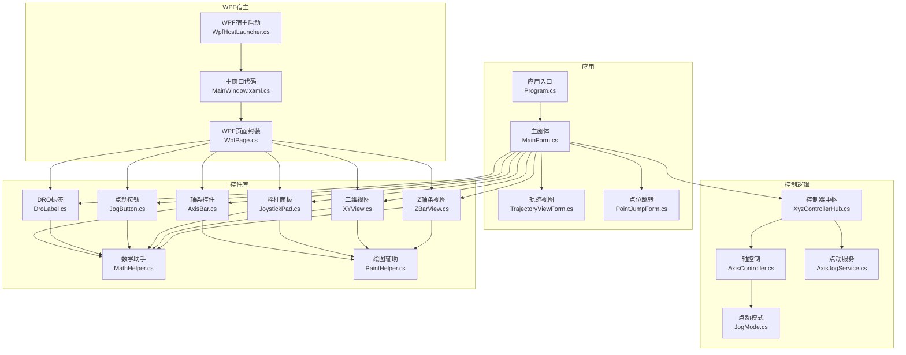
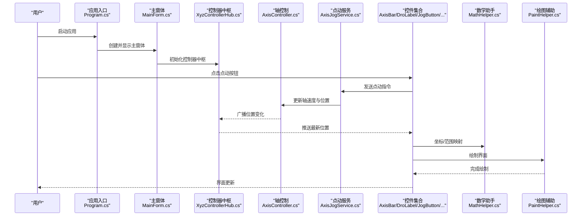
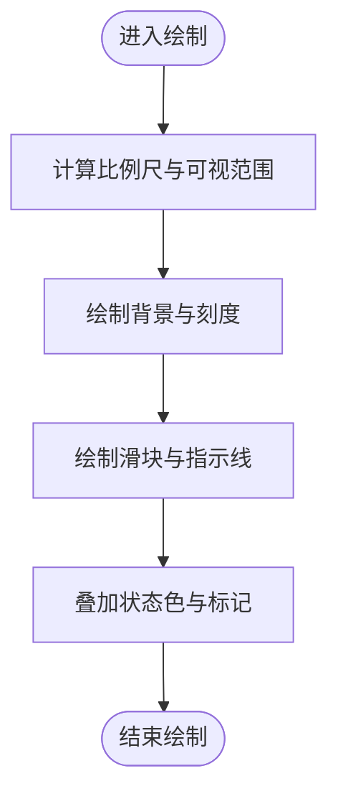
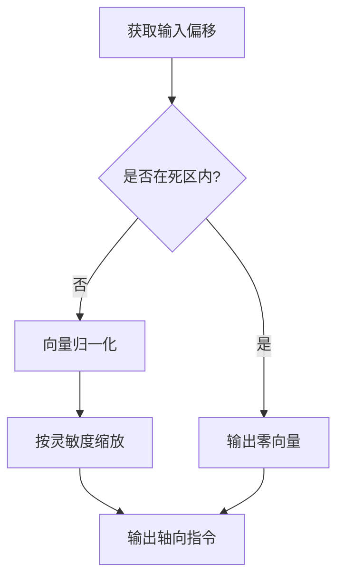
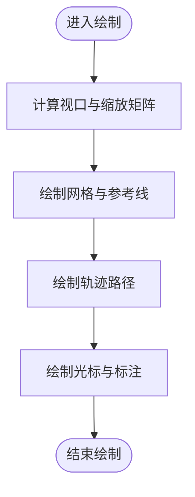
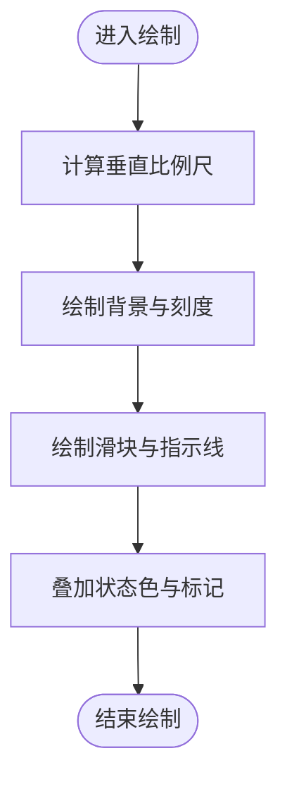
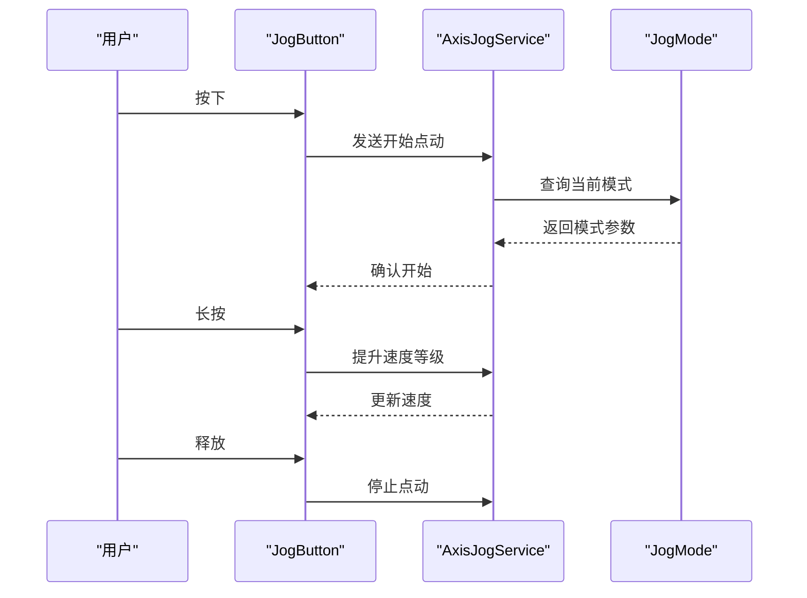
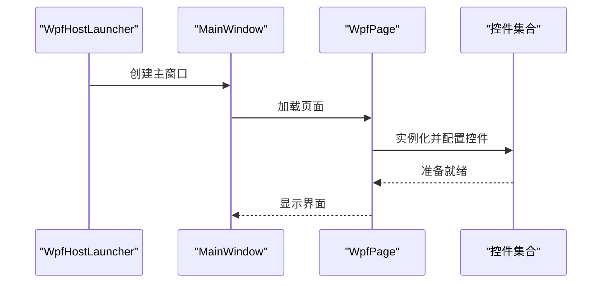
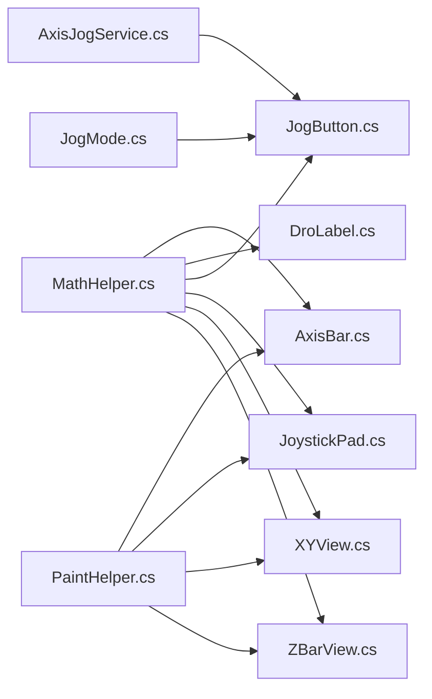

# 控件开发指南

<cite>
**本文引用的文件**   
- [MathHelper.cs](file://src/XyzController.Controls/MathHelper.cs)
- [PaintHelper.cs](file://src/XyzController.Controls/PaintHelper.cs)
- [AxisBar.cs](file://src/XyzController.Controls/AxisBar.cs)
- [DroLabel.cs](file://src/XyzController.Controls/DroLabel.cs)
- [JogButton.cs](file://src/XyzController.Controls/JogButton.cs)
- [JoystickPad.cs](file://src/XyzController.Controls/JoystickPad.cs)
- [XYView.cs](file://src/XyzController.Controls/XYView.cs)
- [ZBarView.cs](file://src/XyzController.Controls/ZBarView.cs)
- [XyzController.Controls.csproj](file://src/XyzController.Controls/XyzController.Controls.csproj)
- [WpfHostLauncher.cs](file://src/XyzController.WpfHost/WpfHostLauncher.cs)
- [MainWindow.xaml.cs](file://src/XyzController.WpfHost/MainWindow.xaml.cs)
- [WpfPage.cs](file://src/XyzController.WpfHost/WpfPage.cs)
- [XyzController.WpfHost.csproj](file://src/XyzController.WpfHost/XyzController.WpfHost.csproj)
- [Program.cs](file://src/XyzController/Program.cs)
- [MainForm.cs](file://src/XyzController/MainForm.cs)
- [TrajectoryViewForm.cs](file://src/XyzController/TrajectoryViewForm.cs)
- [PointJumpForm.cs](file://src/XyzController/PointJumpForm.cs)
- [AxisController.cs](file://src/XyzController/Logic/AxisController.cs)
- [AxisJogService.cs](file://src/XyzController/Logic/AxisJogService.cs)
- [XyzControllerHub.cs](file://src/XyzController/Logic/XyzControllerHub.cs)
- [JogMode.cs](file://src/XyzController/Logic/JogMode.cs)
- [XyzController.csproj](file://src/XyzController/XyzController.csproj)
- [测试框架.md](file://src/content/测试框架.md)
- [自定义控件库.md](file://src/content/自定义控件库.md)
- [基础控件.md](file://src/content/自定义控件库/基础控件.md)
- [高级控件.md](file://src/content/自定义控件库/高级控件.md)
</cite>

## 目录
1. [简介](#简介)
2. [项目结构](#项目结构)
3. [核心组件](#核心组件)
4. [架构总览](#架构总览)
5. [详细组件分析](#详细组件分析)
6. [依赖关系分析](#依赖关系分析)
7. [性能考虑](#性能考虑)
8. [故障排查指南](#故障排查指南)
9. [结论](#结论)
10. [附录](#附录)

## 简介
本指南面向希望在 XyzController 项目中基于现有工具类（MathHelper、PaintHelper）与已有控件实现高质量、可复用自定义控件的开发者。内容覆盖：
- 控件继承体系与基类选择策略
- WPF 控件生命周期、绘制机制与事件处理模型
- 从需求分析到实现测试的完整流程
- 设计模式、性能优化与调试方法
- 打包、版本管理与分发实践

## 项目结构
本项目采用分层与特性组织相结合的结构：
- 控制逻辑层：轴控制、点动服务、中心协调器
- 自定义控件库：通用绘图辅助、数学计算、UI 控件
- WPF 宿主：承载控件并演示集成方式
- 应用入口与示例窗体：展示控件使用场景

图表来源
- [Program.cs](file://src/XyzController/Program.cs)
- [MainForm.cs](file://src/XyzController/MainForm.cs)
- [TrajectoryViewForm.cs](file://src/XyzController/TrajectoryViewForm.cs)
- [PointJumpForm.cs](file://src/XyzController/PointJumpForm.cs)
- [XyzControllerHub.cs](file://src/XyzController/Logic/XyzControllerHub.cs)
- [AxisController.cs](file://src/XyzController/Logic/AxisController.cs)
- [AxisJogService.cs](file://src/XyzController/Logic/AxisJogService.cs)
- [JogMode.cs](file://src/XyzController/Logic/JogMode.cs)
- [MathHelper.cs](file://src/XyzController.Controls/MathHelper.cs)
- [PaintHelper.cs](file://src/XyzController.Controls/PaintHelper.cs)
- [AxisBar.cs](file://src/XyzController.Controls/AxisBar.cs)
- [DroLabel.cs](file://src/XyzController.Controls/DroLabel.cs)
- [JogButton.cs](file://src/XyzController.Controls/JogButton.cs)
- [JoystickPad.cs](file://src/XyzController.Controls/JoystickPad.cs)
- [XYView.cs](file://src/XyzController.Controls/XYView.cs)
- [ZBarView.cs](file://src/XyzController.Controls/ZBarView.cs)
- [WpfHostLauncher.cs](file://src/XyzController.WpfHost/WpfHostLauncher.cs)
- [MainWindow.xaml.cs](file://src/XyzController.WpfHost/MainWindow.xaml.cs)
- [WpfPage.cs](file://src/XyzController.WpfHost/WpfPage.cs)

章节来源
- [Program.cs](file://src/XyzController/Program.cs)
- [MainForm.cs](file://src/XyzController/MainForm.cs)
- [TrajectoryViewForm.cs](file://src/XyzController/TrajectoryViewForm.cs)
- [PointJumpForm.cs](file://src/XyzController/PointJumpForm.cs)
- [XyzControllerHub.cs](file://src/XyzController/Logic/XyzControllerHub.cs)
- [AxisController.cs](file://src/XyzController/Logic/AxisController.cs)
- [AxisJogService.cs](file://src/XyzController/Logic/AxisJogService.cs)
- [JogMode.cs](file://src/XyzController/Logic/JogMode.cs)
- [MathHelper.cs](file://src/XyzController.Controls/MathHelper.cs)
- [PaintHelper.cs](file://src/XyzController.Controls/PaintHelper.cs)
- [AxisBar.cs](file://src/XyzController.Controls/AxisBar.cs)
- [DroLabel.cs](file://src/XyzController.Controls/DroLabel.cs)
- [JogButton.cs](file://src/XyzController.Controls/JogButton.cs)
- [JoystickPad.cs](file://src/XyzController.Controls/JoystickPad.cs)
- [XYView.cs](file://src/XyzController.Controls/XYView.cs)
- [ZBarView.cs](file://src/XyzController.Controls/ZBarView.cs)
- [WpfHostLauncher.cs](file://src/XyzController.WpfHost/WpfHostLauncher.cs)
- [MainWindow.xaml.cs](file://src/XyzController.WpfHost/MainWindow.xaml.cs)
- [WpfPage.cs](file://src/XyzController.WpfHost/WpfPage.cs)

## 核心组件
- 数学助手（MathHelper）
  - 职责：提供坐标变换、范围映射、插值、角度/弧度转换等纯函数式工具，避免在 UI 线程执行耗时计算。
  - 建议：将复杂计算下沉至该模块，保持控件轻量；对外暴露稳定接口，便于单元测试。
- 绘图辅助（PaintHelper）
  - 职责：封装常用绘制原语（线条、矩形、文本、渐变、抗锯齿设置等），统一视觉风格与 DPI 适配。
  - 建议：通过静态方法或单例访问，减少重复代码；对高 DPI 环境进行缩放因子计算。
- 轴条控件（AxisBar）
  - 职责：可视化显示轴位置、行程范围、目标位置与报警状态；支持拖拽与刻度标注。
  - 依赖：MathHelper（范围映射）、PaintHelper（绘制）。
- DRO 标签（DroLabel）
  - 职责：以数字形式显示当前轴位置，支持单位切换与精度控制。
  - 依赖：MathHelper（格式化前的数值处理）。
- 点动按钮（JogButton）
  - 职责：触发点动命令，绑定 JogMode 与 AxisJogService。
  - 交互：按下/释放事件驱动，防抖与长按加速。
- 摇杆面板（JoystickPad）
  - 职责：二维输入映射为两轴速度/位移指令，支持死区与灵敏度调节。
  - 依赖：MathHelper（向量归一化、死区过滤）、PaintHelper（摇杆图形绘制）。
- 二维视图（XYView）
  - 职责：绘制 XY 平面轨迹、参考线、网格与光标定位。
  - 依赖：MathHelper（坐标变换）、PaintHelper（路径绘制）。
- Z 轴条视图（ZBarView）
  - 职责：垂直方向轴条可视化，常用于高度/深度指示。
  - 依赖：MathHelper、PaintHelper。

章节来源
- [MathHelper.cs](file://src/XyzController.Controls/MathHelper.cs)
- [PaintHelper.cs](file://src/XyzController.Controls/PaintHelper.cs)
- [AxisBar.cs](file://src/XyzController.Controls/AxisBar.cs)
- [DroLabel.cs](file://src/XyzController.Controls/DroLabel.cs)
- [JogButton.cs](file://src/XyzController.Controls/JogButton.cs)
- [JoystickPad.cs](file://src/XyzController.Controls/JoystickPad.cs)
- [XYView.cs](file://src/XyzController.Controls/XYView.cs)
- [ZBarView.cs](file://src/XyzController.Controls/ZBarView.cs)

## 架构总览
下图展示了从应用入口到控件绘制的整体调用链与数据流，体现“逻辑层—控件层—宿主”的分层协作。

图表来源
- [Program.cs](file://src/XyzController/Program.cs)
- [MainForm.cs](file://src/XyzController/MainForm.cs)
- [XyzControllerHub.cs](file://src/XyzController/Logic/XyzControllerHub.cs)
- [AxisController.cs](file://src/XyzController/Logic/AxisController.cs)
- [AxisJogService.cs](file://src/XyzController/Logic/AxisJogService.cs)
- [AxisBar.cs](file://src/XyzController.Controls/AxisBar.cs)
- [DroLabel.cs](file://src/XyzController.Controls/DroLabel.cs)
- [JogButton.cs](file://src/XyzController.Controls/JogButton.cs)
- [JoystickPad.cs](file://src/XyzController.Controls/JoystickPad.cs)
- [XYView.cs](file://src/XyzController.Controls/XYView.cs)
- [ZBarView.cs](file://src/XyzController.Controls/ZBarView.cs)
- [MathHelper.cs](file://src/XyzController.Controls/MathHelper.cs)
- [PaintHelper.cs](file://src/XyzController.Controls/PaintHelper.cs)

## 详细组件分析

### 控件继承体系与基类选择
- 基类选择原则
  - 若需完全自定义绘制：优先继承自 WPF 的 Canvas 或 Panel，结合 RenderTransform 与 DrawingContext 进行绘制。
  - 若仅需组合现有控件：继承自 UserControl，内部组合多个子控件与布局容器。
  - 若需要行为扩展：继承自 Button/Slider 等原生控件，重写模板与事件。
- 推荐模式
  - 组合优于继承：通过组合 MathHelper 与 PaintHelper 降低耦合。
  - 属性变更通知：使用依赖属性与 PropertyChangedCallback 驱动重绘。
  - 主题与样式：通过 Style/Template 分离外观与行为。

章节来源
- [AxisBar.cs](file://src/XyzController.Controls/AxisBar.cs)
- [DroLabel.cs](file://src/XyzController.Controls/DroLabel.cs)
- [JogButton.cs](file://src/XyzController.Controls/JogButton.cs)
- [JoystickPad.cs](file://src/XyzController.Controls/JoystickPad.cs)
- [XYView.cs](file://src/XyzController.Controls/XYView.cs)
- [ZBarView.cs](file://src/XyzController.Controls/ZBarView.cs)

### 数学助手（MathHelper）最佳实践
- 设计要点
  - 纯函数式接口：无副作用，易于测试与缓存。
  - 边界保护：对除零、越界、NaN 等情况做防御性处理。
  - 精度控制：浮点比较使用容差，避免抖动。
- 典型用法
  - 范围映射：将传感器原始值映射到物理单位。
  - 插值与平滑：用于轨迹预览与动画过渡。
  - 角度/弧度转换：用于旋转与极坐标绘制。

章节来源
- [MathHelper.cs](file://src/XyzController.Controls/MathHelper.cs)

### 绘图辅助（PaintHelper）最佳实践
- 设计要点
  - 统一画笔/画刷：集中管理颜色、线宽、字体与阴影。
  - DPI 感知：根据屏幕缩放因子调整绘制尺寸。
  - 批量绘制：合并绘制调用，减少上下文切换。
- 典型用法
  - 绘制刻度与网格：在 XYView 中生成规则网格。
  - 绘制进度条与指示器：在 AxisBar 与 ZBarView 中使用。
  - 文本渲染：在 DroLabel 中显示高精度数值。

章节来源
- [PaintHelper.cs](file://src/XyzController.Controls/PaintHelper.cs)

### 轴条控件（AxisBar）分析
- 职责与交互
  - 显示当前位置、目标位置、行程限制与报警状态。
  - 支持鼠标拖拽设置目标位置，键盘微调。
- 关键属性
  - 最小/最大值、当前位置、目标位置、刻度间隔、是否允许拖拽。
- 绘制流程
  - 计算可视区域与比例尺 → 绘制背景与刻度 → 绘制滑块与指示线 → 叠加状态色。

图表来源
- [AxisBar.cs](file://src/XyzController.Controls/AxisBar.cs)
- [MathHelper.cs](file://src/XyzController.Controls/MathHelper.cs)
- [PaintHelper.cs](file://src/XyzController.Controls/PaintHelper.cs)

章节来源
- [AxisBar.cs](file://src/XyzController.Controls/AxisBar.cs)

### 摇杆面板（JoystickPad）分析
- 职责与交互
  - 接收鼠标/触摸输入，映射为两轴速度或位移。
  - 支持死区、灵敏度与返回中心的弹性效果。
- 关键算法
  - 向量归一化与死区过滤 → 输出轴向指令。
  - 触摸跟踪与多点触控兼容。

图表来源
- [JoystickPad.cs](file://src/XyzController.Controls/JoystickPad.cs)
- [MathHelper.cs](file://src/XyzController.Controls/MathHelper.cs)
- [PaintHelper.cs](file://src/XyzController.Controls/PaintHelper.cs)

章节来源
- [JoystickPad.cs](file://src/XyzController.Controls/JoystickPad.cs)

### 二维视图（XYView）分析
- 职责与交互
  - 绘制轨迹、网格、参考线与光标定位。
  - 支持缩放、平移与局部刷新。
- 绘制流程
  - 计算视口矩阵 → 绘制网格与参考线 → 绘制轨迹路径 → 叠加光标与标注。

图表来源
- [XYView.cs](file://src/XyzController.Controls/XYView.cs)
- [MathHelper.cs](file://src/XyzController.Controls/MathHelper.cs)
- [PaintHelper.cs](file://src/XyzController.Controls/PaintHelper.cs)

章节来源
- [XYView.cs](file://src/XyzController.Controls/XYView.cs)

### Z 轴条视图（ZBarView）分析
- 职责与交互
  - 垂直方向的轴条可视化，常用于高度/深度指示。
  - 支持上下滚动与快速定位。
- 绘制流程
  - 计算垂直比例尺 → 绘制背景与刻度 → 绘制滑块与指示线 → 叠加状态色。

图表来源
- [ZBarView.cs](file://src/XyzController.Controls/ZBarView.cs)
- [MathHelper.cs](file://src/XyzController.Controls/MathHelper.cs)
- [PaintHelper.cs](file://src/XyzController.Controls/PaintHelper.cs)

章节来源
- [ZBarView.cs](file://src/XyzController.Controls/ZBarView.cs)

### 点动按钮（JogButton）分析
- 职责与交互
  - 触发点动命令，绑定 JogMode 与 AxisJogService。
  - 支持长按加速与双击复位。
- 事件模型
  - 按下：开始点动，记录时间戳。
  - 释放：停止点动或减速。
  - 长按：逐步提升速度等级。

图表来源
- [JogButton.cs](file://src/XyzController.Controls/JogButton.cs)
- [AxisJogService.cs](file://src/XyzController/Logic/AxisJogService.cs)
- [JogMode.cs](file://src/XyzController/Logic/JogMode.cs)

章节来源
- [JogButton.cs](file://src/XyzController.Controls/JogButton.cs)
- [AxisJogService.cs](file://src/XyzController/Logic/AxisJogService.cs)
- [JogMode.cs](file://src/XyzController/Logic/JogMode.cs)

### DRO 标签（DroLabel）分析
- 职责与交互
  - 显示当前轴位置，支持单位切换与精度控制。
  - 响应数据源变化，自动刷新显示。
- 关键属性
  - 数值、单位、小数位数、对齐方式、颜色主题。

章节来源
- [DroLabel.cs](file://src/XyzController.Controls/DroLabel.cs)
- [MathHelper.cs](file://src/XyzController.Controls/MathHelper.cs)

### WPF 宿主集成（WpfHost）
- 启动流程
  - WpfHostLauncher 负责创建并运行 WPF 应用。
  - MainWindow 承载 WpfPage，后者组合并展示控件。
- 集成要点
  - 在 XAML 中引用控件命名空间。
  - 通过 DataContext 注入数据源与命令。
  - 使用 Dispatcher 确保跨线程更新安全。

图表来源
- [WpfHostLauncher.cs](file://src/XyzController.WpfHost/WpfHostLauncher.cs)
- [MainWindow.xaml.cs](file://src/XyzController.WpfHost/MainWindow.xaml.cs)
- [WpfPage.cs](file://src/XyzController.WpfHost/WpfPage.cs)

章节来源
- [WpfHostLauncher.cs](file://src/XyzController.WpfHost/WpfHostLauncher.cs)
- [MainWindow.xaml.cs](file://src/XyzController.WpfHost/MainWindow.xaml.cs)
- [WpfPage.cs](file://src/XyzController.WpfHost/WpfPage.cs)

## 依赖关系分析
- 内聚与耦合
  - 控件层对 MathHelper 与 PaintHelper 的依赖为单向，利于解耦与替换。
  - 控件之间尽量通过事件或消息总线通信，避免直接引用。
- 外部依赖
  - WPF 运行时与 .NET 框架版本由项目文件指定。
  - 第三方库（如绘图或日志）应通过 NuGet 引入并在 csproj 中声明。

图表来源
- [MathHelper.cs](file://src/XyzController.Controls/MathHelper.cs)
- [PaintHelper.cs](file://src/XyzController.Controls/PaintHelper.cs)
- [AxisBar.cs](file://src/XyzController.Controls/AxisBar.cs)
- [DroLabel.cs](file://src/XyzController.Controls/DroLabel.cs)
- [JogButton.cs](file://src/XyzController.Controls/JogButton.cs)
- [JoystickPad.cs](file://src/XyzController.Controls/JoystickPad.cs)
- [XYView.cs](file://src/XyzController.Controls/XYView.cs)
- [ZBarView.cs](file://src/XyzController.Controls/ZBarView.cs)
- [AxisJogService.cs](file://src/XyzController/Logic/AxisJogService.cs)
- [JogMode.cs](file://src/XyzController/Logic/JogMode.cs)

章节来源
- [XyzController.Controls.csproj](file://src/XyzController.Controls/XyzController.Controls.csproj)
- [XyzController.WpfHost.csproj](file://src/XyzController.WpfHost/XyzController.WpfHost.csproj)
- [XyzController.csproj](file://src/XyzController/XyzController.csproj)

## 性能考虑
- 绘制优化
  - 使用双缓冲与离屏绘制，减少闪烁。
  - 按需重绘：仅在数据变化或可见区域改变时触发。
  - 合并绘制：批量绘制相同样式的元素。
- 计算优化
  - 将耗时计算移至后台线程，结果回传 UI 线程更新。
  - 缓存中间结果，避免重复计算。
- 内存与资源
  - 及时释放画笔、画刷与位图资源。
  - 避免在高频回调中分配大量对象。

[本节为通用指导，不直接分析具体文件]

## 故障排查指南
- 常见问题
  - 界面不更新：检查依赖属性变更通知是否正确触发。
  - 绘制错位：核对 DPI 缩放因子与坐标变换矩阵。
  - 事件丢失：确认事件路由与冒泡顺序。
- 调试技巧
  - 使用 Visual Studio 断点与输出窗口打印关键变量。
  - 启用 WPF 可视化树查看器定位布局问题。
  - 针对 MathHelper 与 PaintHelper 编写单元测试验证边界条件。

章节来源
- [测试框架.md](file://src/content/测试框架.md)

## 结论
通过遵循本指南的设计模式与最佳实践，开发者可以基于 MathHelper 与 PaintHelper 构建高性能、可复用的自定义控件。建议在实现过程中持续进行单元测试与集成测试，确保控件在不同环境与负载下表现稳定。

[本节为总结，不直接分析具体文件]

## 附录
- 开发流程清单
  - 需求分析：明确控件职责、属性与交互。
  - 设计阶段：确定继承体系、依赖关系与 API 契约。
  - 实现阶段：分步实现绘制与事件处理，逐步集成。
  - 测试阶段：单元与集成测试覆盖关键路径。
  - 发布阶段：打包、版本管理与分发。
- 打包与分发
  - 使用 .NET SDK 发布为独立应用或类库。
  - 通过 NuGet 包管理器分发控件库。
  - 版本号遵循语义化版本规范（主.次.修订）。

章节来源
- [自定义控件库.md](file://src/content/自定义控件库.md)
- [基础控件.md](file://src/content/自定义控件库/基础控件.md)
- [高级控件.md](file://src/content/自定义控件库/高级控件.md)