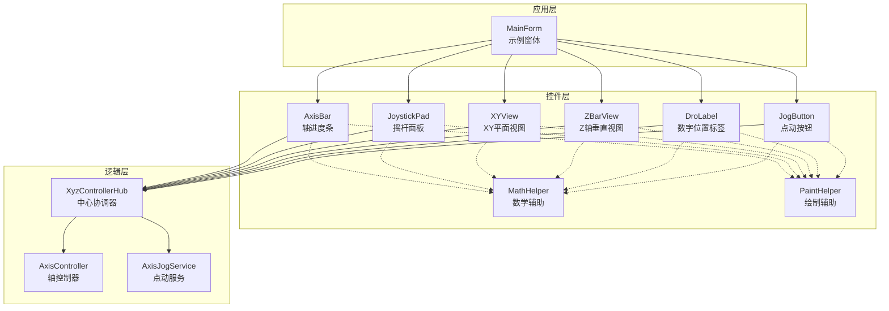
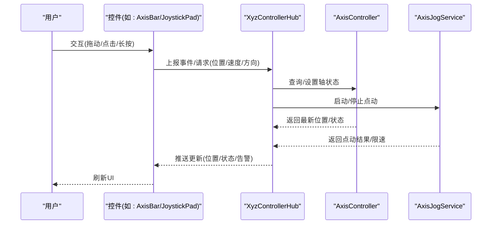
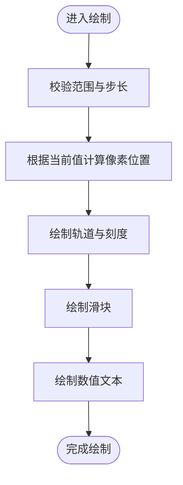
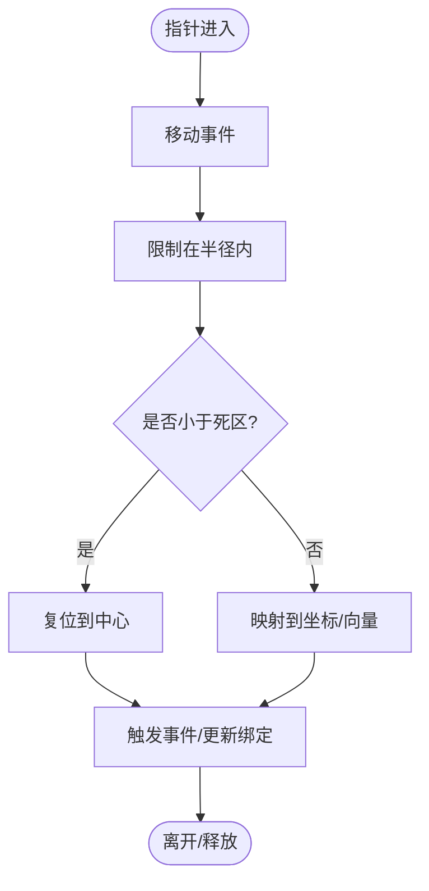
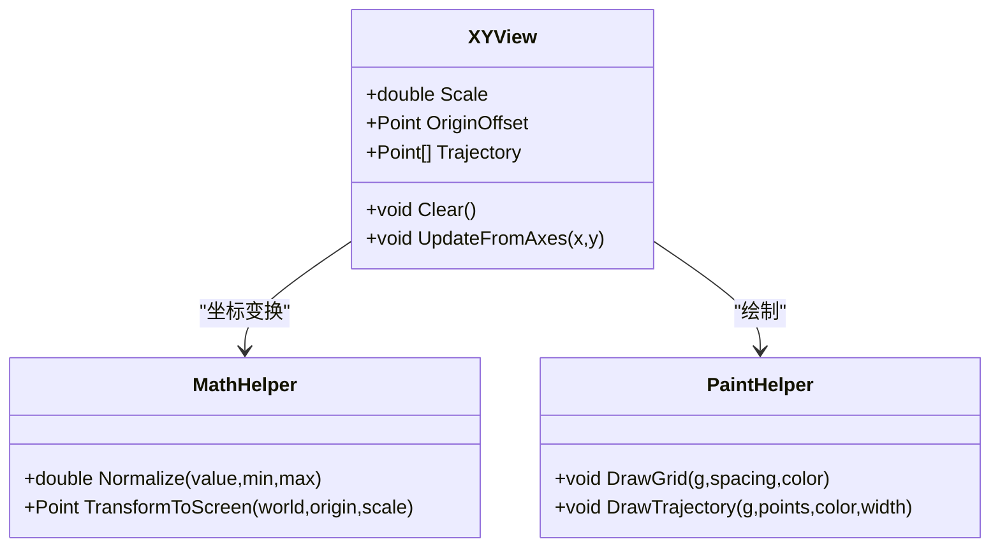
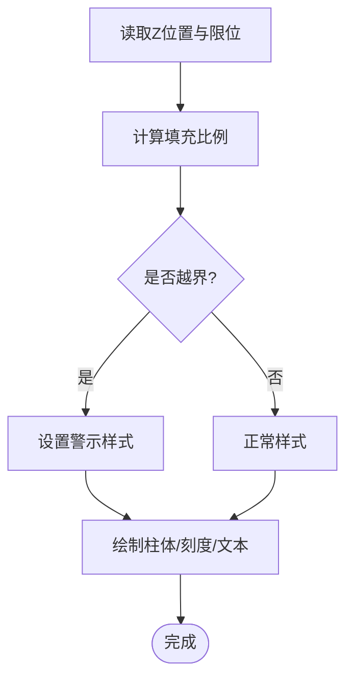
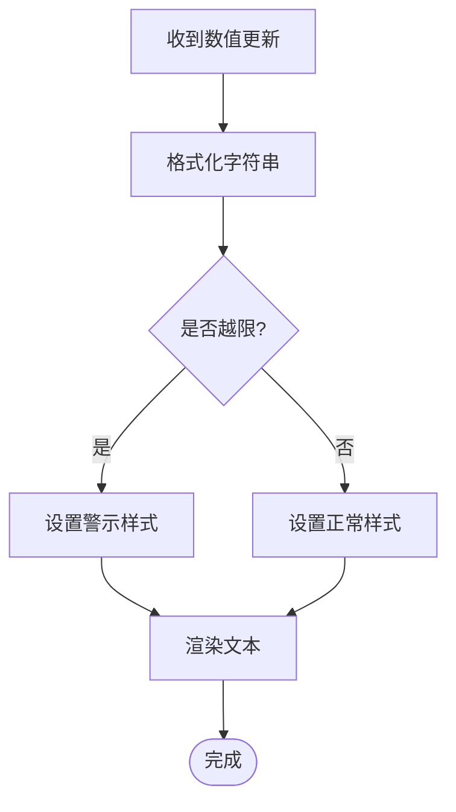
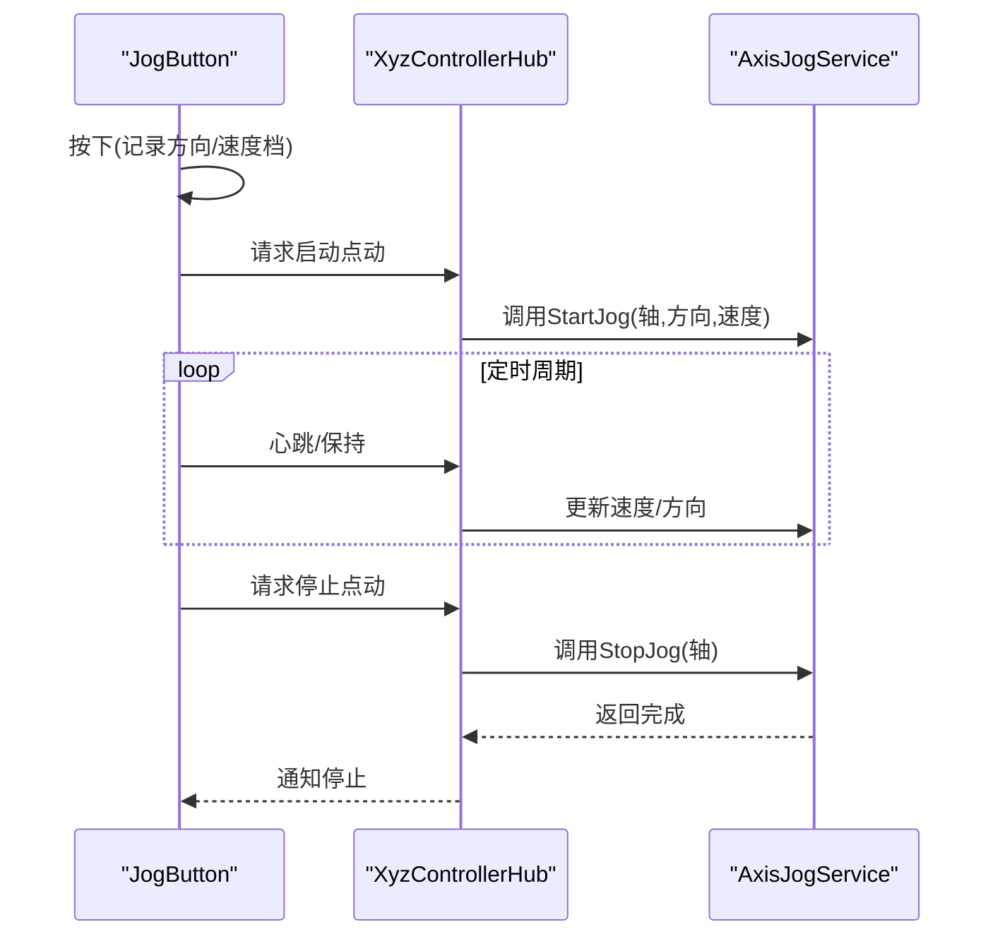
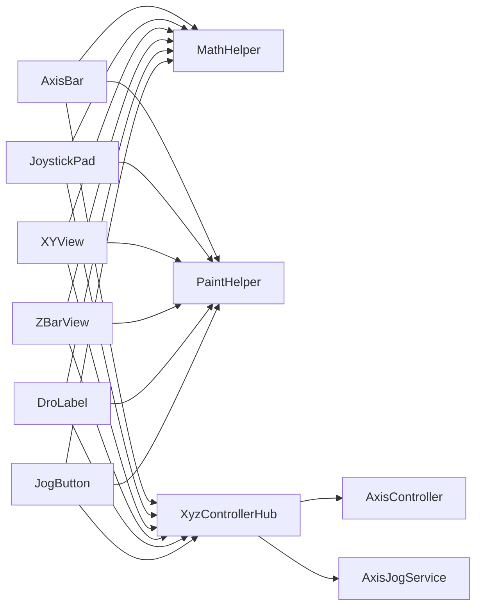

# 自定义控件库

<cite>
**本文引用的文件**   
- [AxisBar.cs](file://src/XyzController.Controls/AxisBar.cs)
- [JoystickPad.cs](file://src/XyzController.Controls/JoystickPad.cs)
- [XYView.cs](file://src/XyzController.Controls/XYView.cs)
- [ZBarView.cs](file://src/XyzController.Controls/ZBarView.cs)
- [DroLabel.cs](file://src/XyzController.Controls/DroLabel.cs)
- [JogButton.cs](file://src/XyzController.Controls/JogButton.cs)
- [MathHelper.cs](file://src/XyzController.Controls/MathHelper.cs)
- [PaintHelper.cs](file://src/XyzController.Controls/PaintHelper.cs)
- [XyzControllerHub.cs](file://src/XyzController/Logic/XyzControllerHub.cs)
- [AxisController.cs](file://src/XyzController/Logic/AxisController.cs)
- [AxisJogService.cs](file://src/XyzController/Logic/AxisJogService.cs)
- [MainForm.cs](file://src/XyzController/MainForm.cs)
</cite>

## 目录
1. [简介](#简介)
2. [项目结构](#项目结构)
3. [核心组件](#核心组件)
4. [架构总览](#架构总览)
5. [详细组件分析](#详细组件分析)
6. [依赖关系分析](#依赖关系分析)
7. [性能考虑](#性能考虑)
8. [故障排查指南](#故障排查指南)
9. [结论](#结论)
10. [附录：开发指南与最佳实践](#附录开发指南与最佳实践)

## 简介
本库提供面向多轴控制场景的WPF/WinForms通用UI控件集合，包括轴进度条、摇杆控制面板、XY平面视图、Z轴垂直视图、数字位置标签和点动按钮等。控件围绕统一的轴控制器与点动服务进行数据绑定与事件驱动交互，支持丰富的样式定制与组合使用模式，便于快速构建人机界面与调试工具。

## 项目结构
- 控件实现位于 XyzController.Controls 命名空间下，包含各独立控件与绘图/数学辅助类。
- 逻辑层位于 XyzController.Logic 命名空间下，提供轴控制器、点动服务与中心协调器。
- 演示与应用位于 XyzController 主工程，展示控件集成与交互流程。
- WPF宿主工程用于在WPF中承载WinForms控件。

图表来源
- [AxisBar.cs](file://src/XyzController.Controls/AxisBar.cs)
- [JoystickPad.cs](file://src/XyzController.Controls/JoystickPad.cs)
- [XYView.cs](file://src/XyzController.Controls/XYView.cs)
- [ZBarView.cs](file://src/XyzController.Controls/ZBarView.cs)
- [DroLabel.cs](file://src/XyzController.Controls/DroLabel.cs)
- [JogButton.cs](file://src/XyzController.Controls/JogButton.cs)
- [MathHelper.cs](file://src/XyzController.Controls/MathHelper.cs)
- [PaintHelper.cs](file://src/XyzController.Controls/PaintHelper.cs)
- [XyzControllerHub.cs](file://src/XyzController/Logic/XyzControllerHub.cs)
- [AxisController.cs](file://src/XyzController/Logic/AxisController.cs)
- [AxisJogService.cs](file://src/XyzController/Logic/AxisJogService.cs)
- [MainForm.cs](file://src/XyzController/MainForm.cs)

章节来源
- [XyzControllerHub.cs](file://src/XyzController/Logic/XyzControllerHub.cs)
- [AxisController.cs](file://src/XyzController/Logic/AxisController.cs)
- [AxisJogService.cs](file://src/XyzController/Logic/AxisJogService.cs)
- [MainForm.cs](file://src/XyzController/MainForm.cs)

## 核心组件
本节概述每个控件的职责、关键属性、事件与样式能力，并给出典型用法路径参考。

- AxisBar（轴进度条）
  - 功能：可视化显示单轴当前位置与范围，支持拖动更新位置。
  - 关键属性：最小值/最大值、当前值、步长、刻度密度、颜色主题、方向（水平/垂直）。
  - 事件：位置变化、开始拖动、结束拖动。
  - 样式：刻度线样式、滑块形状、背景渐变、文本格式。
  - 数据绑定：双向绑定到轴位置或任意数值源。
  - 示例路径：[MainForm.cs](file://src/XyzController/MainForm.cs)

- JoystickPad（摇杆控制面板）
  - 功能：二维输入面板，常用于XY平面控制或双轴联动。
  - 关键属性：半径、死区阈值、返回中心力度、按键映射、视觉反馈强度。
  - 事件：移动中、按下、释放、复位。
  - 样式：底座圆环、手柄形状、轨迹线、高亮色。
  - 数据绑定：输出为向量或两轴坐标对。
  - 示例路径：[MainForm.cs](file://src/XyzController/MainForm.cs)

- XYView（XY平面视图）
  - 功能：二维坐标系视图，显示轨迹、目标点与边界框。
  - 关键属性：缩放级别、原点偏移、网格间距、轨迹历史长度、颜色方案。
  - 事件：缩放变更、平移、点击选择、轨迹清空。
  - 样式：网格线、坐标轴标注、轨迹线宽与颜色、点标记大小。
  - 数据绑定：订阅轴位置与轨迹增量。
  - 示例路径：[MainForm.cs](file://src/XyzController/MainForm.cs)

- ZBarView（Z轴垂直视图）
  - 功能：Z轴专用垂直视图，强调上下行程与限位指示。
  - 关键属性：上/下限位、当前高度、阻尼动画时长、安全区域。
  - 事件：越界警告、到达限位、动画完成。
  - 样式：柱状填充、刻度、阴影、警示色。
  - 数据绑定：单向或双向绑定至Z轴位置。
  - 示例路径：[MainForm.cs](file://src/XyzController/MainForm.cs)

- DroLabel（数字位置标签）
  - 功能：高精度数值显示，支持单位、小数位数、刷新频率。
  - 关键属性：格式化字符串、单位后缀、刷新间隔、颜色状态。
  - 事件：数值更新、越限告警。
  - 样式：字体、对齐、边框、闪烁提示。
  - 数据绑定：绑定到任意数值属性。
  - 示例路径：[MainForm.cs](file://src/XyzController/MainForm.cs)

- JogButton（点动按钮）
  - 功能：长按点动控制，支持多段速度与方向切换。
  - 关键属性：速度档位、加速曲线、按住重复频率、方向键映射。
  - 事件：开始点动、停止点动、速度切换。
  - 样式：按压态、禁用态、指示灯。
  - 数据绑定：触发点动命令或设置速度档位。
  - 示例路径：[MainForm.cs](file://src/XyzController/MainForm.cs)

章节来源
- [AxisBar.cs](file://src/XyzController.Controls/AxisBar.cs)
- [JoystickPad.cs](file://src/XyzController.Controls/JoystickPad.cs)
- [XYView.cs](file://src/XyzController.Controls/XYView.cs)
- [ZBarView.cs](file://src/XyzController.Controls/ZBarView.cs)
- [DroLabel.cs](file://src/XyzController.Controls/DroLabel.cs)
- [JogButton.cs](file://src/XyzController.Controls/JogButton.cs)
- [MainForm.cs](file://src/XyzController/MainForm.cs)

## 架构总览
控件通过中心协调器与轴控制器/点动服务解耦，形成“视图—协调器—控制器/服务”的分层结构。视图负责渲染与用户交互，协调器聚合轴状态与命令分发，控制器与服务负责运动学与业务规则。

图表来源
- [XyzControllerHub.cs](file://src/XyzController/Logic/XyzControllerHub.cs)
- [AxisController.cs](file://src/XyzController/Logic/AxisController.cs)
- [AxisJogService.cs](file://src/XyzController/Logic/AxisJogService.cs)
- [AxisBar.cs](file://src/XyzController.Controls/AxisBar.cs)
- [JoystickPad.cs](file://src/XyzController.Controls/JoystickPad.cs)

## 详细组件分析

### AxisBar（轴进度条）
- 职责：将轴的线性位置以进度条形式呈现，支持拖拽直接修改位置。
- 关键流程：鼠标按下→计算相对位置→转换为物理值→通过协调器写入轴→订阅回调刷新。
- 样式要点：刻度密度、滑块尺寸、颜色渐变、文本格式。
- 数据绑定：Value/Min/Max/Step 与轴位置属性双向绑定。
- 错误处理：越界裁剪、无效输入忽略、异常回退到上次有效值。

图表来源
- [AxisBar.cs](file://src/XyzController.Controls/AxisBar.cs)
- [PaintHelper.cs](file://src/XyzController.Controls/PaintHelper.cs)
- [MathHelper.cs](file://src/XyzController.Controls/MathHelper.cs)

章节来源
- [AxisBar.cs](file://src/XyzController.Controls/AxisBar.cs)
- [PaintHelper.cs](file://src/XyzController.Controls/PaintHelper.cs)
- [MathHelper.cs](file://src/XyzController.Controls/MathHelper.cs)

### JoystickPad（摇杆控制面板）
- 职责：接收二维手势，输出向量或两轴坐标，支持死区与自动回弹。
- 关键流程：指针移动→限制在圆内→应用死区→映射到轴坐标→发布事件。
- 样式要点：底座圆环、手柄半径、轨迹线、高亮反馈。
- 数据绑定：输出为向量或X/Y分量，可分别绑定到不同轴。
- 错误处理：越界归一化、死区过滤、抖动抑制。

图表来源
- [JoystickPad.cs](file://src/XyzController.Controls/JoystickPad.cs)
- [MathHelper.cs](file://src/XyzController.Controls/MathHelper.cs)

章节来源
- [JoystickPad.cs](file://src/XyzController.Controls/JoystickPad.cs)
- [MathHelper.cs](file://src/XyzController.Controls/MathHelper.cs)

### XYView（XY平面视图）
- 职责：二维视图，显示轨迹、目标点、边界框与网格。
- 关键流程：订阅轴位置→累积轨迹点→变换到屏幕坐标→重绘。
- 样式要点：网格间距、轨迹线宽/颜色、点标记大小、缩放/平移。
- 数据绑定：订阅位置流与轨迹增量；支持清空与导出。
- 错误处理：轨迹溢出裁剪、空数据保护、缩放边界限制。

图表来源
- [XYView.cs](file://src/XyzController.Controls/XYView.cs)
- [MathHelper.cs](file://src/XyzController.Controls/MathHelper.cs)
- [PaintHelper.cs](file://src/XyzController.Controls/PaintHelper.cs)

章节来源
- [XYView.cs](file://src/XyzController.Controls/XYView.cs)
- [MathHelper.cs](file://src/XyzController.Controls/MathHelper.cs)
- [PaintHelper.cs](file://src/XyzController.Controls/PaintHelper.cs)

### ZBarView（Z轴垂直视图）
- 职责：Z轴专用垂直视图，强调上下行程与限位。
- 关键流程：读取Z位置→计算填充高度→对比限位→绘制柱体与刻度。
- 样式要点：柱体填充、阴影、刻度、越界警示色。
- 数据绑定：绑定Z轴位置与限位参数。
- 错误处理：越界裁剪、负值保护、动画插值平滑。

图表来源
- [ZBarView.cs](file://src/XyzController.Controls/ZBarView.cs)
- [PaintHelper.cs](file://src/XyzController.Controls/PaintHelper.cs)
- [MathHelper.cs](file://src/XyzController.Controls/MathHelper.cs)

章节来源
- [ZBarView.cs](file://src/XyzController.Controls/ZBarView.cs)
- [PaintHelper.cs](file://src/XyzController.Controls/PaintHelper.cs)
- [MathHelper.cs](file://src/XyzController.Controls/MathHelper.cs)

### DroLabel（数字位置标签）
- 职责：高精度数值显示，支持格式化与状态指示。
- 关键流程：数值更新→格式化→刷新文本与颜色。
- 样式要点：字体、对齐、边框、闪烁提示。
- 数据绑定：绑定任意数值属性，支持单位后缀。
- 错误处理：NaN/Infinity处理、格式异常回退。

图表来源
- [DroLabel.cs](file://src/XyzController.Controls/DroLabel.cs)
- [MathHelper.cs](file://src/XyzController.Controls/MathHelper.cs)

章节来源
- [DroLabel.cs](file://src/XyzController.Controls/DroLabel.cs)
- [MathHelper.cs](file://src/XyzController.Controls/MathHelper.cs)

### JogButton（点动按钮）
- 职责：长按点动控制，支持多段速度与方向切换。
- 关键流程：按下→启动定时器→按周期发送速度指令→松开停止。
- 样式要点：按压态、禁用态、指示灯。
- 数据绑定：触发点动命令或设置速度档位。
- 错误处理：重复按下保护、超时中断、异常恢复。

图表来源
- [JogButton.cs](file://src/XyzController.Controls/JogButton.cs)
- [XyzControllerHub.cs](file://src/XyzController/Logic/XyzControllerHub.cs)
- [AxisJogService.cs](file://src/XyzController/Logic/AxisJogService.cs)

章节来源
- [JogButton.cs](file://src/XyzController.Controls/JogButton.cs)
- [XyzControllerHub.cs](file://src/XyzController/Logic/XyzControllerHub.cs)
- [AxisJogService.cs](file://src/XyzController/Logic/AxisJogService.cs)

## 依赖关系分析
- 控件层依赖数学与绘制辅助类，降低耦合度并提升复用性。
- 所有控件通过中心协调器访问轴控制器与点动服务，避免控件间直接耦合。
- 应用层（MainForm）作为编排者，初始化协调器并将控件与数据源绑定。

图表来源
- [AxisBar.cs](file://src/XyzController.Controls/AxisBar.cs)
- [JoystickPad.cs](file://src/XyzController.Controls/JoystickPad.cs)
- [XYView.cs](file://src/XyzController.Controls/XYView.cs)
- [ZBarView.cs](file://src/XyzController.Controls/ZBarView.cs)
- [DroLabel.cs](file://src/XyzController.Controls/DroLabel.cs)
- [JogButton.cs](file://src/XyzController.Controls/JogButton.cs)
- [MathHelper.cs](file://src/XyzController.Controls/MathHelper.cs)
- [PaintHelper.cs](file://src/XyzController.Controls/PaintHelper.cs)
- [XyzControllerHub.cs](file://src/XyzController/Logic/XyzControllerHub.cs)
- [AxisController.cs](file://src/XyzController/Logic/AxisController.cs)
- [AxisJogService.cs](file://src/XyzController/Logic/AxisJogService.cs)

章节来源
- [XyzControllerHub.cs](file://src/XyzController/Logic/XyzControllerHub.cs)
- [AxisController.cs](file://src/XyzController/Logic/AxisController.cs)
- [AxisJogService.cs](file://src/XyzController/Logic/AxisJogService.cs)

## 性能考虑
- 减少重绘：仅在数据变化或交互时触发绘制，避免每帧全量刷新。
- 批量更新：合并多次位置更新，采用节流策略降低UI压力。
- 几何计算优化：缓存常用变换矩阵与颜色对象，复用绘制资源。
- 轨迹管理：限制轨迹历史长度，及时清理旧点，防止内存增长。
- 动画平滑：使用插值算法平滑过渡，避免跳变导致的视觉抖动。

## 故障排查指南
- 数值异常：检查格式化与越界处理逻辑，确保NaN/Infinity被正确替换。
- 无响应：确认事件订阅是否正确注册，协调器是否成功转发命令。
- 绘制错位：核对坐标变换与缩放参数，验证原点偏移与边界条件。
- 点动不停止：检查定时器释放与停止命令下发路径，确保异常分支能恢复。
- 样式不生效：确认样式属性覆盖顺序与默认值优先级。

章节来源
- [AxisBar.cs](file://src/XyzController.Controls/AxisBar.cs)
- [JoystickPad.cs](file://src/XyzController.Controls/JoystickPad.cs)
- [XYView.cs](file://src/XyzController.Controls/XYView.cs)
- [ZBarView.cs](file://src/XyzController.Controls/ZBarView.cs)
- [DroLabel.cs](file://src/XyzController.Controls/DroLabel.cs)
- [JogButton.cs](file://src/XyzController.Controls/JogButton.cs)
- [XyzControllerHub.cs](file://src/XyzController/Logic/XyzControllerHub.cs)

## 结论
本控件库通过清晰的层次划分与统一的数据绑定机制，提供了直观且可扩展的多轴控制UI能力。借助中心协调器与辅助类，控件具备良好可维护性与高性能表现，适合快速搭建工业级人机界面与调试工具。

## 附录：开发指南与最佳实践
- 继承基类
  - 从基础控件派生，保留绘制与交互骨架，仅重写必要方法。
  - 使用受保护钩子扩展布局与测量逻辑。
- 重写绘制方法
  - 分离几何计算与绘制逻辑，优先使用辅助类完成坐标变换与图形绘制。
  - 采用离屏缓冲减少闪烁。
- 处理用户输入
  - 明确输入优先级与冲突消解策略（如同时按下多个按钮）。
  - 引入死区与抖动抑制，提高稳定性。
- 实现数据绑定
  - 暴露可绑定的依赖属性，支持双向同步。
  - 在数据变更时触发轻量更新，避免阻塞UI线程。
- 组合使用模式
  - 将JoystickPad与XYView组合，实现所见即所得的二维控制。
  - 将AxisBar与DroLabel并列，提供精确读数与快捷调整。
  - 使用JogButton配合ZBarView，实现Z轴快速定位与安全限位提示。
- 示例路径
  - 控件初始化与绑定：[MainForm.cs](file://src/XyzController/MainForm.cs)
  - 协调器与控制器集成：[XyzControllerHub.cs](file://src/XyzController/Logic/XyzControllerHub.cs)、[AxisController.cs](file://src/XyzController/Logic/AxisController.cs)
  - 点动服务调用：[AxisJogService.cs](file://src/XyzController/Logic/AxisJogService.cs)