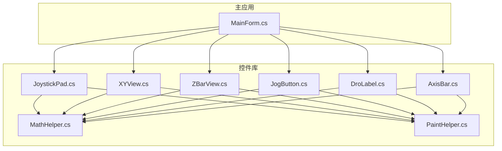
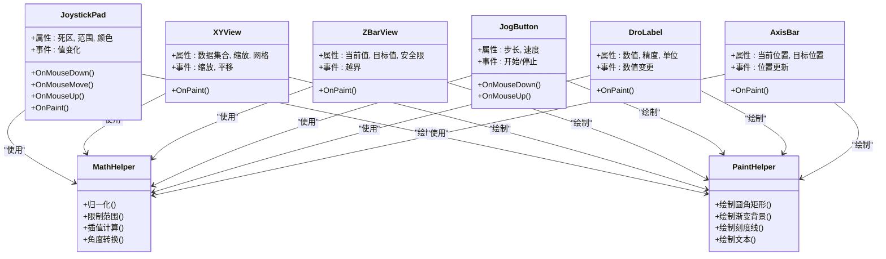
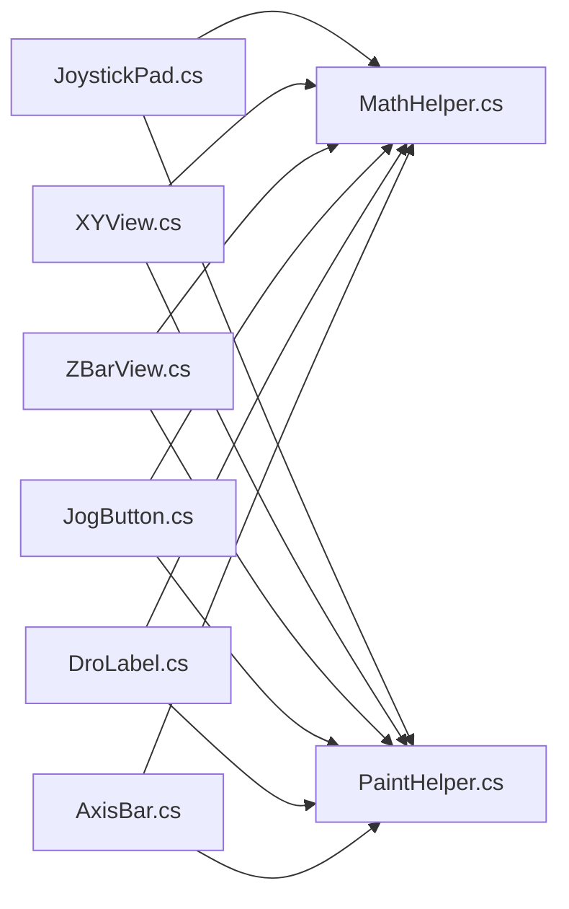

# 自定义控件库

<cite>
**本文引用的文件**   
- [JoystickPad.cs](file://src/XyzController.Controls/JoystickPad.cs)
- [XYView.cs](file://src/XyzController.Controls/XYView.cs)
- [ZBarView.cs](file://src/XyzController.Controls/ZBarView.cs)
- [JogButton.cs](file://src/XyzController.Controls/JogButton.cs)
- [DroLabel.cs](file://src/XyzController.Controls/DroLabel.cs)
- [AxisBar.cs](file://src/XyzController.Controls/AxisBar.cs)
- [MathHelper.cs](file://src/XyzController.Controls/MathHelper.cs)
- [PaintHelper.cs](file://src/XyzController.Controls/PaintHelper.cs)
- [MainForm.cs](file://src/XyzController/MainForm.cs)
</cite>

## 目录
1. [简介](#简介)
2. [项目结构](#项目结构)
3. [核心组件](#核心组件)
4. [架构总览](#架构总览)
5. [详细组件分析](#详细组件分析)
6. [依赖关系分析](#依赖关系分析)
7. [性能考虑](#性能考虑)
8. [故障排查指南](#故障排查指南)
9. [结论](#结论)
10. [附录](#附录)

## 简介
本文件为 XyzController.Controls 自定义控件库的全面文档，覆盖以下可视化控件：虚拟摇杆 JoystickPad、二维视图 XYView、Z轴专用显示 ZBarView、运动按钮 JogButton、数字显示器 DroLabel、位置指示条 AxisBar。文档将说明各控件的功能特性、属性配置、事件处理与样式定制选项，并提供集成示例路径、绘制原理、性能优化技巧与扩展方法，同时给出控件间的协作模式与组合使用场景，兼顾初学者入门与高级开发者定制需求。

## 项目结构
XyzController.Controls 位于 src/XyzController.Controls 目录下，包含若干独立的可复用 WinForms 控件及其辅助工具类；主应用位于 src/XyzController，通过 MainForm 演示控件的集成与交互。

图表来源
- [JoystickPad.cs](file://src/XyzController.Controls/JoystickPad.cs)
- [XYView.cs](file://src/XyzController.Controls/XYView.cs)
- [ZBarView.cs](file://src/XyzController.Controls/ZBarView.cs)
- [JogButton.cs](file://src/XyzController.Controls/JogButton.cs)
- [DroLabel.cs](file://src/XyzController.Controls/DroLabel.cs)
- [AxisBar.cs](file://src/XyzController.Controls/AxisBar.cs)
- [MathHelper.cs](file://src/XyzController.Controls/MathHelper.cs)
- [PaintHelper.cs](file://src/XyzController.Controls/PaintHelper.cs)
- [MainForm.cs](file://src/XyzController/MainForm.cs)

章节来源
- [JoystickPad.cs](file://src/XyzController.Controls/JoystickPad.cs)
- [XYView.cs](file://src/XyzController.Controls/XYView.cs)
- [ZBarView.cs](file://src/XyzController.Controls/ZBarView.cs)
- [JogButton.cs](file://src/XyzController.Controls/JogButton.cs)
- [DroLabel.cs](file://src/XyzController.Controls/DroLabel.cs)
- [AxisBar.cs](file://src/XyzController.Controls/AxisBar.cs)
- [MathHelper.cs](file://src/XyzController.Controls/MathHelper.cs)
- [PaintHelper.cs](file://src/XyzController.Controls/PaintHelper.cs)
- [MainForm.cs](file://src/XyzController/MainForm.cs)

## 核心组件
本节概述各控件的职责与典型用法要点（不直接展示代码内容，提供源码路径以便查阅）：

- JoystickPad 虚拟摇杆
  - 功能：支持鼠标拖拽与触摸输入，输出归一化的二维向量，常用于控制 XY 平面移动或方向选择。
  - 关键属性：范围映射、死区阈值、视觉反馈（中心点、外环、手柄位置）、是否启用锁定/回弹等。
  - 事件：按下、移动、释放、值变化等，便于上层逻辑订阅并驱动控制器。
  - 样式：颜色、边框、阴影、刻度线、背景渐变等。
  - 参考路径：[JoystickPad.cs](file://src/XyzController.Controls/JoystickPad.cs)

- XYView 二维视图
  - 功能：在二维平面上绘制轨迹、网格、坐标轴、光标与数据点，适合展示 XY 平面加工路径或实时位置。
  - 关键属性：坐标系范围、缩放级别、网格密度、线条样式、数据集合绑定。
  - 事件：缩放、平移、点击、悬停提示等。
  - 样式：主题色、网格线粗细、标注字体、图例可见性。
  - 参考路径：[XYView.cs](file://src/XyzController.Controls/XYView.cs)

- ZBarView Z轴专用显示
  - 功能：以垂直条形方式直观显示 Z 轴当前位置、目标位置与安全边界，常用于深度/高度监控。
  - 关键属性：最小/最大行程、当前值、目标值、安全上下限、刻度间距、颜色分区。
  - 事件：越界警告、到达目标、步进更新等。
  - 样式：渐变色带、指针形状、刻度标签格式。
  - 参考路径：[ZBarView.cs](file://src/XyzController.Controls/ZBarView.cs)

- JogButton 运动按钮
  - 功能：用于增量式“点动”控制，支持按住连续运行、双击快速步进、长按加速等交互。
  - 关键属性：步长、速度曲线、按键行为（单击/按住/双击）、方向标识。
  - 事件：开始运动、停止运动、步进完成、错误中断。
  - 样式：图标、按压态高亮、禁用态灰度。
  - 参考路径：[JogButton.cs](file://src/XyzController.Controls/JogButton.cs)

- DroLabel 数字显示器
  - 功能：高精度数值显示，支持单位、小数位数、千分位分隔、闪烁/动画提示。
  - 关键属性：数值、精度、单位字符串、对齐方式、颜色状态（正常/越界）。
  - 事件：数值变更、越界告警。
  - 样式：字体、字号、前景/背景色、边框。
  - 参考路径：[DroLabel.cs](file://src/XyzController.Controls/DroLabel.cs)

- AxisBar 位置指示条
  - 功能：单轴位置可视化，显示当前位置、目标位置、限位标记与进度比例。
  - 关键属性：轴名、最小/最大值、当前位置、目标位置、刻度、颜色。
  - 事件：位置更新、越界提示。
  - 样式：轨道样式、滑块形状、刻度样式。
  - 参考路径：[AxisBar.cs](file://src/XyzController.Controls/AxisBar.cs)

章节来源
- [JoystickPad.cs](file://src/XyzController.Controls/JoystickPad.cs)
- [XYView.cs](file://src/XyzController.Controls/XYView.cs)
- [ZBarView.cs](file://src/XyzController.Controls/ZBarView.cs)
- [JogButton.cs](file://src/XyzController.Controls/JogButton.cs)
- [DroLabel.cs](file://src/XyzController.Controls/DroLabel.cs)
- [AxisBar.cs](file://src/XyzController.Controls/AxisBar.cs)

## 架构总览
控件库采用分层设计：UI 控件层负责绘制与交互，数学与绘图工具层提供通用能力，主应用层进行组合与业务编排。

图表来源
- [JoystickPad.cs](file://src/XyzController.Controls/JoystickPad.cs)
- [XYView.cs](file://src/XyzController.Controls/XYView.cs)
- [ZBarView.cs](file://src/XyzController.Controls/ZBarView.cs)
- [JogButton.cs](file://src/XyzController.Controls/JogButton.cs)
- [DroLabel.cs](file://src/XyzController.Controls/DroLabel.cs)
- [AxisBar.cs](file://src/XyzController.Controls/AxisBar.cs)
- [MathHelper.cs](file://src/XyzController.Controls/MathHelper.cs)
- [PaintHelper.cs](file://src/XyzController.Controls/PaintHelper.cs)

## 详细组件分析

### JoystickPad 虚拟摇杆
- 功能特性
  - 支持鼠标与触摸输入，输出归一化二维向量。
  - 可配置死区、范围映射、回弹与锁定模式。
- 属性配置
  - 死区阈值、可视半径、中心偏移、颜色主题、刻度线密度。
- 事件处理
  - 按下/移动/释放、值变化回调，供上层订阅驱动控制器。
- 样式定制
  - 背景渐变、外环描边、手柄形状与阴影、刻度颜色。
- 绘制原理
  - 基于 PaintHelper 绘制圆形区域与手柄位置，根据输入计算归一化向量并触发值变化事件。
- 性能优化
  - 仅在尺寸变化或值变化时重绘；避免每帧全量绘制；使用双缓冲减少闪烁。
- 扩展方法
  - 继承并重写 OnPaint 实现自定义外观；暴露更多交互模式（如多指手势）。
- 集成示例路径
  - 在主应用中创建实例、设置属性、订阅事件并绑定到控制器逻辑。
  - 参考路径：[MainForm.cs](file://src/XyzController/MainForm.cs)

章节来源
- [JoystickPad.cs](file://src/XyzController.Controls/JoystickPad.cs)
- [PaintHelper.cs](file://src/XyzController.Controls/PaintHelper.cs)
- [MathHelper.cs](file://src/XyzController.Controls/MathHelper.cs)
- [MainForm.cs](file://src/XyzController/MainForm.cs)

### XYView 二维视图
- 功能特性
  - 绘制网格、坐标轴、轨迹与数据点，支持缩放与平移。
- 属性配置
  - 坐标系范围、缩放级别、网格密度、线条样式、数据集合。
- 事件处理
  - 缩放、平移、点击、悬停提示等事件。
- 样式定制
  - 主题色、网格线粗细、标注字体、图例可见性。
- 绘制原理
  - 将数据坐标映射到屏幕坐标，按网格与数据集合顺序绘制，优先绘制背景与网格再绘制数据。
- 性能优化
  - 使用离屏缓存绘制静态背景；增量更新数据区域；按需重绘。
- 扩展方法
  - 添加图层系统、叠加多个数据集、导出图像。
- 集成示例路径
  - 在主应用中绑定数据源、响应缩放/平移事件、联动其他控件。
  - 参考路径：[MainForm.cs](file://src/XyzController/MainForm.cs)

章节来源
- [XYView.cs](file://src/XyzController.Controls/XYView.cs)
- [PaintHelper.cs](file://src/XyzController.Controls/PaintHelper.cs)
- [MathHelper.cs](file://src/XyzController.Controls/MathHelper.cs)
- [MainForm.cs](file://src/XyzController/MainForm.cs)

### ZBarView Z轴专用显示
- 功能特性
  - 垂直条形显示 Z 轴当前位置、目标位置与安全边界。
- 属性配置
  - 最小/最大行程、当前值、目标值、安全上下限、刻度间距、颜色分区。
- 事件处理
  - 越界警告、到达目标、步进更新。
- 样式定制
  - 渐变色带、指针形状、刻度标签格式。
- 绘制原理
  - 将数值映射到垂直区间，绘制轨道、刻度、当前位置与目标位置标记。
- 性能优化
  - 数值变化时局部重绘；避免频繁刷新；使用双缓冲。
- 扩展方法
  - 增加多段安全区、动态阈值、动画过渡效果。
- 集成示例路径
  - 在主应用中监听 Z 轴状态并更新属性，结合报警逻辑。
  - 参考路径：[MainForm.cs](file://src/XyzController/MainForm.cs)

章节来源
- [ZBarView.cs](file://src/XyzController.Controls/ZBarView.cs)
- [PaintHelper.cs](file://src/XyzController.Controls/PaintHelper.cs)
- [MathHelper.cs](file://src/XyzController.Controls/MathHelper.cs)
- [MainForm.cs](file://src/XyzController/MainForm.cs)

### JogButton 运动按钮
- 功能特性
  - 支持按住连续运行、双击快速步进、长按加速等交互。
- 属性配置
  - 步长、速度曲线、按键行为、方向标识。
- 事件处理
  - 开始运动、停止运动、步进完成、错误中断。
- 样式定制
  - 图标、按压态高亮、禁用态灰度。
- 绘制原理
  - 基于 PaintHelper 绘制按钮外观，根据交互状态切换视觉反馈。
- 性能优化
  - 仅当状态变化时重绘；节流高频事件；避免阻塞 UI 线程。
- 扩展方法
  - 自定义速度曲线、组合键、快捷键绑定。
- 集成示例路径
  - 在主应用中订阅事件并调用控制器 API 执行运动。
  - 参考路径：[MainForm.cs](file://src/XyzController/MainForm.cs)

章节来源
- [JogButton.cs](file://src/XyzController.Controls/JogButton.cs)
- [PaintHelper.cs](file://src/XyzController.Controls/PaintHelper.cs)
- [MathHelper.cs](file://src/XyzController.Controls/MathHelper.cs)
- [MainForm.cs](file://src/XyzController/MainForm.cs)

### DroLabel 数字显示器
- 功能特性
  - 高精度数值显示，支持单位、小数位数、千分位分隔、闪烁/动画提示。
- 属性配置
  - 数值、精度、单位字符串、对齐方式、颜色状态。
- 事件处理
  - 数值变更、越界告警。
- 样式定制
  - 字体、字号、前景/背景色、边框。
- 绘制原理
  - 格式化数值后使用 PaintHelper 绘制文本与可选边框。
- 性能优化
  - 数值未变化时跳过重绘；批量更新合并刷新。
- 扩展方法
  - 自定义格式化器、动态单位切换、趋势箭头。
- 集成示例路径
  - 在主应用中绑定轴位置或传感器读数，实时更新显示。
  - 参考路径：[MainForm.cs](file://src/XyzController/MainForm.cs)

章节来源
- [DroLabel.cs](file://src/XyzController.Controls/DroLabel.cs)
- [PaintHelper.cs](file://src/XyzController.Controls/PaintHelper.cs)
- [MathHelper.cs](file://src/XyzController.Controls/MathHelper.cs)
- [MainForm.cs](file://src/XyzController/MainForm.cs)

### AxisBar 位置指示条
- 功能特性
  - 单轴位置可视化，显示当前位置、目标位置、限位标记与进度比例。
- 属性配置
  - 轴名、最小/最大值、当前位置、目标位置、刻度、颜色。
- 事件处理
  - 位置更新、越界提示。
- 样式定制
  - 轨道样式、滑块形状、刻度样式。
- 绘制原理
  - 将数值映射到水平区间，绘制轨道、刻度、当前位置与目标位置标记。
- 性能优化
  - 数值变化时局部重绘；避免频繁刷新；使用双缓冲。
- 扩展方法
  - 多段区间着色、动态阈值、动画过渡效果。
- 集成示例路径
  - 在主应用中监听轴状态并更新属性，联动报警与日志。
  - 参考路径：[MainForm.cs](file://src/XyzController/MainForm.cs)

章节来源
- [AxisBar.cs](file://src/XyzController.Controls/AxisBar.cs)
- [PaintHelper.cs](file://src/XyzController.Controls/PaintHelper.cs)
- [MathHelper.cs](file://src/XyzController.Controls/MathHelper.cs)
- [MainForm.cs](file://src/XyzController/MainForm.cs)

### 绘制与数学工具
- MathHelper
  - 提供归一化、范围限制、插值计算、角度转换等通用数学函数，被所有控件复用。
  - 参考路径：[MathHelper.cs](file://src/XyzController.Controls/MathHelper.cs)
- PaintHelper
  - 封装常用绘制操作：圆角矩形、渐变背景、刻度线、文本绘制等，提升一致性与性能。
  - 参考路径：[PaintHelper.cs](file://src/XyzController.Controls/PaintHelper.cs)

章节来源
- [MathHelper.cs](file://src/XyzController.Controls/MathHelper.cs)
- [PaintHelper.cs](file://src/XyzController.Controls/PaintHelper.cs)

## 依赖关系分析
控件对工具层的依赖清晰且单向，降低耦合度，提高可测试性与可维护性。

图表来源
- [JoystickPad.cs](file://src/XyzController.Controls/JoystickPad.cs)
- [XYView.cs](file://src/XyzController.Controls/XYView.cs)
- [ZBarView.cs](file://src/XyzController.Controls/ZBarView.cs)
- [JogButton.cs](file://src/XyzController.Controls/JogButton.cs)
- [DroLabel.cs](file://src/XyzController.Controls/DroLabel.cs)
- [AxisBar.cs](file://src/XyzController.Controls/AxisBar.cs)
- [MathHelper.cs](file://src/XyzController.Controls/MathHelper.cs)
- [PaintHelper.cs](file://src/XyzController.Controls/PaintHelper.cs)

章节来源
- [JoystickPad.cs](file://src/XyzController.Controls/JoystickPad.cs)
- [XYView.cs](file://src/XyzController.Controls/XYView.cs)
- [ZBarView.cs](file://src/XyzController.Controls/ZBarView.cs)
- [JogButton.cs](file://src/XyzController.Controls/JogButton.cs)
- [DroLabel.cs](file://src/XyzController.Controls/DroLabel.cs)
- [AxisBar.cs](file://src/XyzController.Controls/AxisBar.cs)
- [MathHelper.cs](file://src/XyzController.Controls/MathHelper.cs)
- [PaintHelper.cs](file://src/XyzController.Controls/PaintHelper.cs)

## 性能考虑
- 双缓冲与局部重绘
  - 所有控件应启用双缓冲以减少闪烁；仅在必要区域重绘，避免整窗体重绘。
- 事件节流与批处理
  - 高频事件（如移动、数值更新）需节流与合并，降低 UI 压力。
- 离屏缓存
  - 静态背景（网格、刻度）可缓存至离屏位图，数据变化时仅叠加动态元素。
- 资源管理
  - 及时释放画笔、画刷、字体等资源；避免在绘制路径中分配新对象。
- 测量与基准
  - 使用性能计数器或采样工具定位瓶颈；针对热点路径优化算法与绘制顺序。

## 故障排查指南
- 常见问题
  - 控件不显示：检查父容器尺寸与可见性；确认已启用双缓冲。
  - 绘制异常：核对坐标映射与裁剪区域；验证颜色与透明度设置。
  - 事件无响应：确认事件订阅是否正确；检查输入捕获与焦点状态。
  - 性能抖动：定位频繁重绘与对象分配；引入节流与缓存。
- 调试建议
  - 在关键绘制路径加入日志；使用断点观察属性变化；逐步缩小问题范围。
  - 借助单元测试验证数学工具与边界条件。

## 结论
XyzController.Controls 提供了面向 CNC/运动控制的可视化控件集，具备清晰的职责划分、良好的可扩展性与一致的绘制风格。通过合理配置属性、订阅事件与定制样式，可在主应用中快速构建专业的人机界面。遵循性能优化与调试最佳实践，可获得稳定流畅的用户体验。

## 附录

### 控件间协作模式与组合使用场景
- 摇杆 + 二维视图
  - JoystickPad 输出归一化向量驱动 XYView 轨迹预览，形成“所见即所得”的操作体验。
- Z轴显示 + 数字显示器
  - ZBarView 与 DroLabel 同步显示 Z 轴当前位置与目标值，配合越界告警提升安全性。
- 运动按钮 + 位置指示条
  - JogButton 触发步进运动，AxisBar 实时反映位置变化，形成闭环反馈。
- 统一主题与样式
  - 通过共享的 PaintHelper 与 MathHelper 确保视觉与数值一致性。

### 集成示例路径
- 在主应用中创建控件实例、设置属性、订阅事件并绑定到控制器逻辑。
- 参考路径：[MainForm.cs](file://src/XyzController/MainForm.cs)