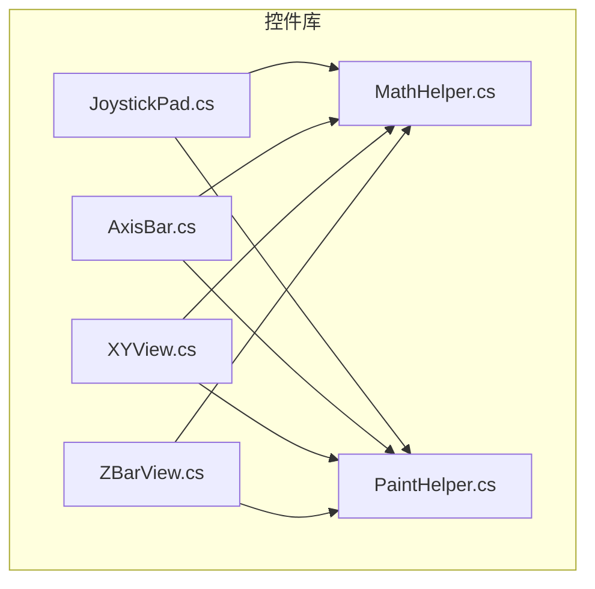
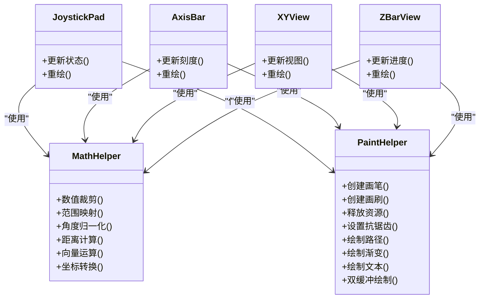
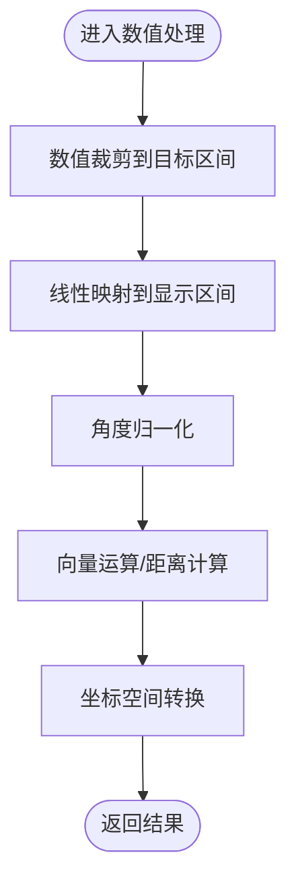
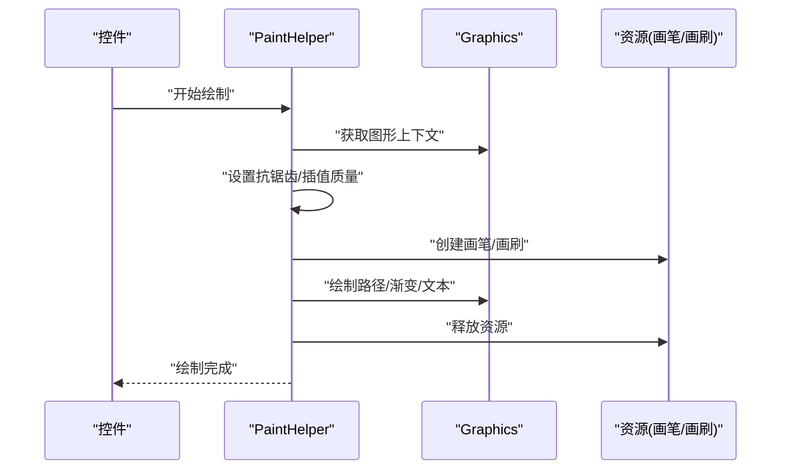
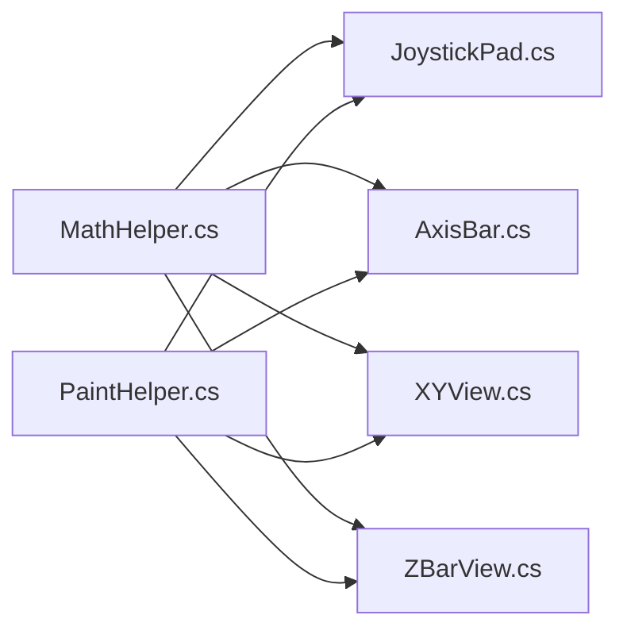

# 辅助工具类

<cite>
**本文引用的文件**   
- [MathHelper.cs](file://src/XyzController.Controls/MathHelper.cs)
- [PaintHelper.cs](file://src/XyzController.Controls/PaintHelper.cs)
- [JoystickPad.cs](file://src/XyzController.Controls/JoystickPad.cs)
- [AxisBar.cs](file://src/XyzController.Controls/AxisBar.cs)
- [XYView.cs](file://src/XyzController.Controls/XYView.cs)
- [ZBarView.cs](file://src/XyzController.Controls/ZBarView.cs)
</cite>

## 目录
1. [简介](#简介)
2. [项目结构](#项目结构)
3. [核心组件](#核心组件)
4. [架构总览](#架构总览)
5. [详细组件分析](#详细组件分析)
6. [依赖分析](#依赖分析)
7. [性能考虑](#性能考虑)
8. [故障排查指南](#故障排查指南)
9. [结论](#结论)
10. [附录](#附录)

## 简介
本章节聚焦于控件库中的两个关键辅助工具类：MathHelper（数学计算）与 PaintHelper（绘图工具）。它们为坐标转换、数值处理、GDI+ 绘制等提供通用能力，被多个自定义控件复用，以提升开发效率与渲染一致性。文档将深入说明其功能特性、算法实现要点、使用场景、性能优化策略与内存管理最佳实践，并通过图示展示在控件中的集成方式。

## 项目结构
本项目采用按功能域组织的方式，控件位于 XyzController.Controls 工程下。其中：
- MathHelper.cs：集中提供数学运算与坐标变换方法
- PaintHelper.cs：封装 GDI+ 常用绘制技巧与资源管理
- JoystickPad.cs、AxisBar.cs、XYView.cs、ZBarView.cs：消费上述工具类的自定义控件

图表来源
- [MathHelper.cs](file://src/XyzController.Controls/MathHelper.cs)
- [PaintHelper.cs](file://src/XyzController.Controls/PaintHelper.cs)
- [JoystickPad.cs](file://src/XyzController.Controls/JoystickPad.cs)
- [AxisBar.cs](file://src/XyzController.Controls/AxisBar.cs)
- [XYView.cs](file://src/XyzController.Controls/XYView.cs)
- [ZBarView.cs](file://src/XyzController.Controls/ZBarView.cs)

章节来源
- [MathHelper.cs](file://src/XyzController.Controls/MathHelper.cs)
- [PaintHelper.cs](file://src/XyzController.Controls/PaintHelper.cs)
- [JoystickPad.cs](file://src/XyzController.Controls/JoystickPad.cs)
- [AxisBar.cs](file://src/XyzController.Controls/AxisBar.cs)
- [XYView.cs](file://src/XyzController.Controls/XYView.cs)
- [ZBarView.cs](file://src/XyzController.Controls/ZBarView.cs)

## 核心组件
本节概述两类工具的核心职责与典型用法：
- MathHelper：提供数值裁剪、范围映射、角度归一化、距离与向量运算、坐标空间转换等基础能力，供控件进行数据与视图之间的换算。
- PaintHelper：封装 GDI+ 绘制流程，包括画笔/画刷生命周期管理、抗锯齿设置、路径绘制、渐变填充、文本绘制、双缓冲绘制等，提升绘制一致性与性能。

章节来源
- [MathHelper.cs](file://src/XyzController.Controls/MathHelper.cs)
- [PaintHelper.cs](file://src/XyzController.Controls/PaintHelper.cs)

## 架构总览
下图展示了工具类与控件的协作关系：控件通过 MathHelper 完成坐标与数值计算，再通过 PaintHelper 执行高效绘制。

图表来源
- [MathHelper.cs](file://src/XyzController.Controls/MathHelper.cs)
- [PaintHelper.cs](file://src/XyzController.Controls/PaintHelper.cs)
- [JoystickPad.cs](file://src/XyzController.Controls/JoystickPad.cs)
- [AxisBar.cs](file://src/XyzController.Controls/AxisBar.cs)
- [XYView.cs](file://src/XyzController.Controls/XYView.cs)
- [ZBarView.cs](file://src/XyzController.Controls/ZBarView.cs)

## 详细组件分析

### MathHelper 数学计算类
- 设计目标
  - 提供稳定、可复用的数学与坐标转换方法，避免在各控件中重复实现
  - 保证数值边界安全与精度可控，减少异常与抖动
- 关键能力
  - 数值裁剪：将输入限制到指定区间，防止越界
  - 范围映射：将源区间线性映射到目标区间，常用于 UI 比例缩放
  - 角度归一化：将任意角度归一到标准范围，便于三角函数与方向判断
  - 距离与向量：欧氏距离、点积、归一化等，用于轨迹与姿态计算
  - 坐标转换：屏幕坐标与逻辑坐标互转，适配 DPI 与缩放
- 复杂度与稳定性
  - 多数操作为 O(1)，适合高频调用
  - 对除零、NaN、无穷大等边界条件进行保护
- 使用示例（以路径引用代替代码片段）
  - 在 JoystickPad 中，使用范围映射将摇杆位移映射到控件区域
    - [JoystickPad.cs](file://src/XyzController.Controls/JoystickPad.cs)
  - 在 AxisBar 中，使用数值裁剪确保刻度值不越界
    - [AxisBar.cs](file://src/XyzController.Controls/AxisBar.cs)
  - 在 XYView 中，使用坐标转换实现视图平移与缩放
    - [XYView.cs](file://src/XyzController.Controls/XYView.cs)
  - 在 ZBarView 中，使用距离计算评估进度条填充长度
    - [ZBarView.cs](file://src/XyzController.Controls/ZBarView.cs)

图表来源
- [MathHelper.cs](file://src/XyzController.Controls/MathHelper.cs)

章节来源
- [MathHelper.cs](file://src/XyzController.Controls/MathHelper.cs)
- [JoystickPad.cs](file://src/XyzController.Controls/JoystickPad.cs)
- [AxisBar.cs](file://src/XyzController.Controls/AxisBar.cs)
- [XYView.cs](file://src/XyzController.Controls/XYView.cs)
- [ZBarView.cs](file://src/XyzController.Controls/ZBarView.cs)

### PaintHelper 绘图工具类
- 设计目标
  - 统一绘制风格与质量，降低各控件的绘制差异
  - 规范 GDI+ 资源生命周期，避免句柄泄漏
- 关键能力
  - 资源管理：创建/释放画笔、画刷、字体等对象
  - 质量设置：启用抗锯齿、平滑曲线、高质量插值
  - 路径绘制：组合复杂形状，支持填充与描边
  - 渐变与纹理：线性/径向渐变填充，提升视觉表现
  - 文本绘制：对齐、阴影、高对比度文本输出
  - 双缓冲绘制：减少闪烁，提高滚动与动画流畅度
- 使用示例（以路径引用代替代码片段）
  - 在 JoystickPad 中，使用双缓冲绘制摇杆轨迹与指示器
    - [JoystickPad.cs](file://src/XyzController.Controls/JoystickPad.cs)
  - 在 AxisBar 中，使用路径绘制刻度线与滑块
    - [AxisBar.cs](file://src/XyzController.Controls/AxisBar.cs)
  - 在 XYView 中，使用渐变填充背景与网格线
    - [XYView.cs](file://src/XyzController.Controls/XYView.cs)
  - 在 ZBarView 中，使用高质量文本绘制百分比与单位
    - [ZBarView.cs](file://src/XyzController.Controls/ZBarView.cs)

图表来源
- [PaintHelper.cs](file://src/XyzController.Controls/PaintHelper.cs)

章节来源
- [PaintHelper.cs](file://src/XyzController.Controls/PaintHelper.cs)
- [JoystickPad.cs](file://src/XyzController.Controls/JoystickPad.cs)
- [AxisBar.cs](file://src/XyzController.Controls/AxisBar.cs)
- [XYView.cs](file://src/XyzController.Controls/XYView.cs)
- [ZBarView.cs](file://src/XyzController.Controls/ZBarView.cs)

### 在自定义控件中的复用模式
- 常见模式
  - 在控件的 OnPaint/OnRender 阶段调用 PaintHelper 的统一绘制接口
  - 在布局或数据更新时调用 MathHelper 的坐标与数值处理方法
- 扩展点
  - 通过参数化配置（如颜色、线宽、圆角半径）定制外观
  - 通过事件回调通知绘制完成，便于统计帧率或触发后续逻辑

章节来源
- [JoystickPad.cs](file://src/XyzController.Controls/JoystickPad.cs)
- [AxisBar.cs](file://src/XyzController.Controls/AxisBar.cs)
- [XYView.cs](file://src/XyzController.Controls/XYView.cs)
- [ZBarView.cs](file://src/XyzController.Controls/ZBarView.cs)

## 依赖分析
- 内部依赖
  - 所有控件均依赖 MathHelper 与 PaintHelper，形成“工具层—控件层”的清晰分层
- 外部依赖
  - 基于 .NET Framework 的 System.Drawing/GDI+ 进行绘制
- 耦合与内聚
  - 工具类高度内聚，对外暴露稳定的 API；控件仅依赖工具类，耦合度低
- 循环依赖
  - 无直接循环依赖，工具类不反向依赖控件

图表来源
- [MathHelper.cs](file://src/XyzController.Controls/MathHelper.cs)
- [PaintHelper.cs](file://src/XyzController.Controls/PaintHelper.cs)
- [JoystickPad.cs](file://src/XyzController.Controls/JoystickPad.cs)
- [AxisBar.cs](file://src/XyzController.Controls/AxisBar.cs)
- [XYView.cs](file://src/XyzController.Controls/XYView.cs)
- [ZBarView.cs](file://src/XyzController.Controls/ZBarView.cs)

章节来源
- [MathHelper.cs](file://src/XyzController.Controls/MathHelper.cs)
- [PaintHelper.cs](file://src/XyzController.Controls/PaintHelper.cs)
- [JoystickPad.cs](file://src/XyzController.Controls/JoystickPad.cs)
- [AxisBar.cs](file://src/XyzController.Controls/AxisBar.cs)
- [XYView.cs](file://src/XyzController.Controls/XYView.cs)
- [ZBarView.cs](file://src/XyzController.Controls/ZBarView.cs)

## 性能考虑
- 数值计算
  - 尽量使用 O(1) 的数学方法，避免在绘制循环中进行昂贵计算
  - 缓存中间结果（如映射后的坐标），仅在数据变化时重新计算
- 绘制优化
  - 启用抗锯齿与高质量插值，但注意在高刷新率场景下的开销
  - 使用双缓冲绘制减少闪烁与重绘次数
  - 批量绘制相同样式元素，减少画笔/画刷频繁创建与销毁
- 资源管理
  - 严格遵循“谁创建、谁释放”的原则，及时释放 GDI+ 对象
  - 避免在 OnPaint 中分配大量临时对象，必要时复用对象池
- 内存与句柄
  - 监控 GDI 句柄数量，防止泄漏导致系统不稳定
  - 在控件销毁或隐藏时主动清理资源

[本节为通用指导，无需特定文件来源]

## 故障排查指南
- 常见问题
  - 绘制闪烁：检查是否启用双缓冲，是否存在不必要的重绘
  - 资源泄漏：确认画笔/画刷/字体是否正确释放
  - 数值异常：检查裁剪与映射的边界条件，避免 NaN/Inf 传播
  - 坐标错位：核对坐标转换顺序与参考原点
- 定位建议
  - 在关键绘制入口添加日志，记录输入输出范围
  - 使用最小重现用例隔离问题，逐步验证工具方法行为

章节来源
- [PaintHelper.cs](file://src/XyzController.Controls/PaintHelper.cs)
- [MathHelper.cs](file://src/XyzController.Controls/MathHelper.cs)

## 结论
MathHelper 与 PaintHelper 作为底层工具层，为控件提供了稳定高效的数学与绘制能力。通过统一的 API 与良好的资源管理，显著提升了控件的可维护性与渲染质量。建议在新增控件时优先复用这些工具方法，并遵循本文的性能与内存管理建议，以获得更优的用户体验。

[本节为总结性内容，无需特定文件来源]

## 附录
- 快速上手清单
  - 在控件初始化时注册必要的样式与尺寸常量
  - 在数据更新时调用 MathHelper 的方法进行坐标与数值转换
  - 在绘制阶段调用 PaintHelper 的统一绘制接口
  - 在控件销毁时确保释放所有 GDI+ 资源
- 参考路径
  - 数值与坐标处理：[MathHelper.cs](file://src/XyzController.Controls/MathHelper.cs)
  - 绘制与资源管理：[PaintHelper.cs](file://src/XyzController.Controls/PaintHelper.cs)
  - 控件示例：[JoystickPad.cs](file://src/XyzController.Controls/JoystickPad.cs)、[AxisBar.cs](file://src/XyzController.Controls/AxisBar.cs)、[XYView.cs](file://src/XyzController.Controls/XYView.cs)、[ZBarView.cs](file://src/XyzController.Controls/ZBarView.cs)