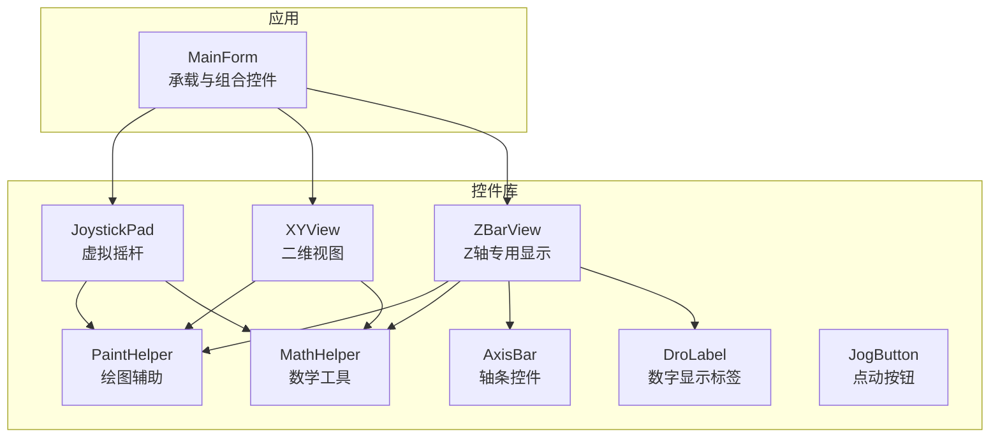
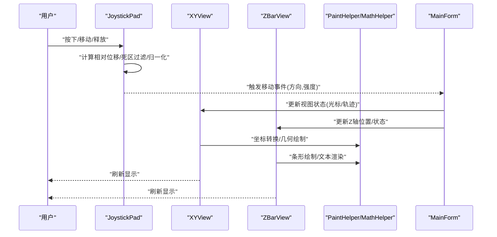
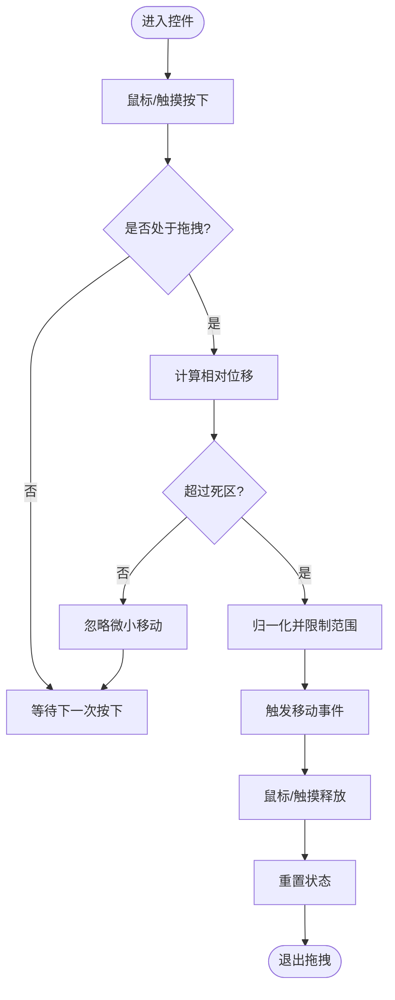
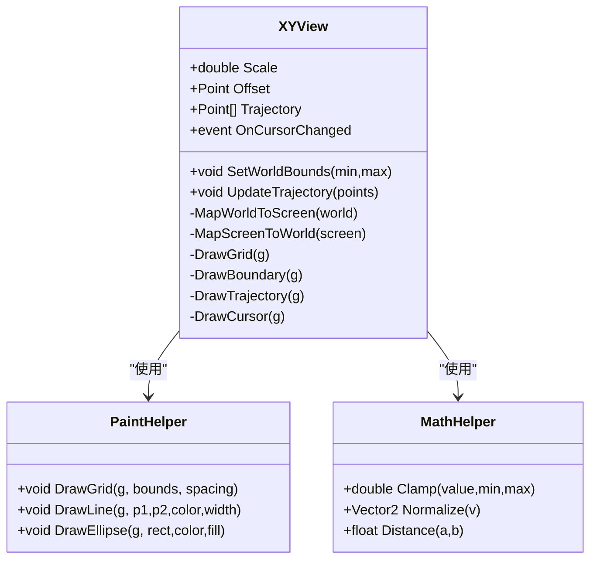
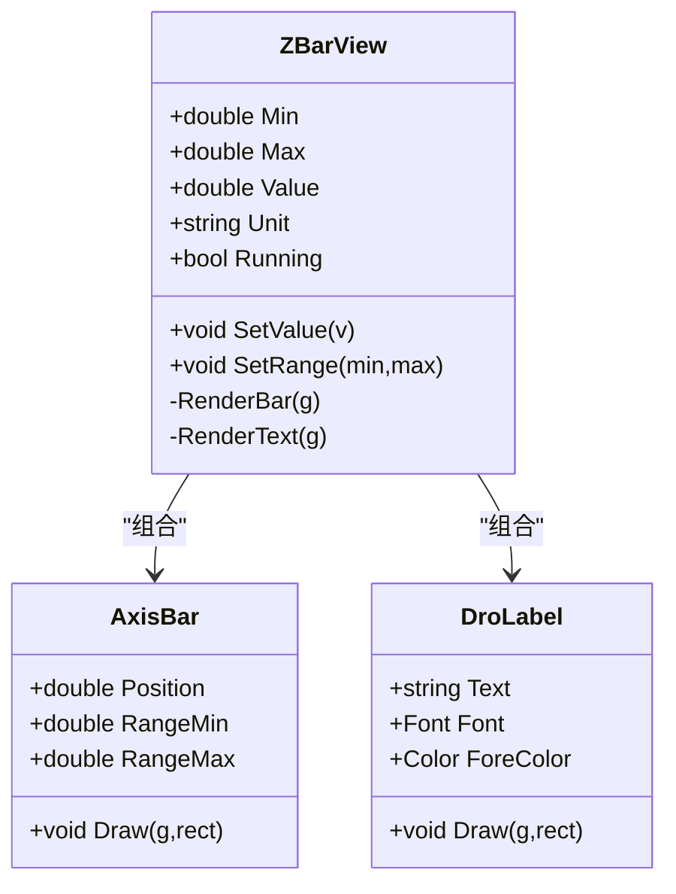
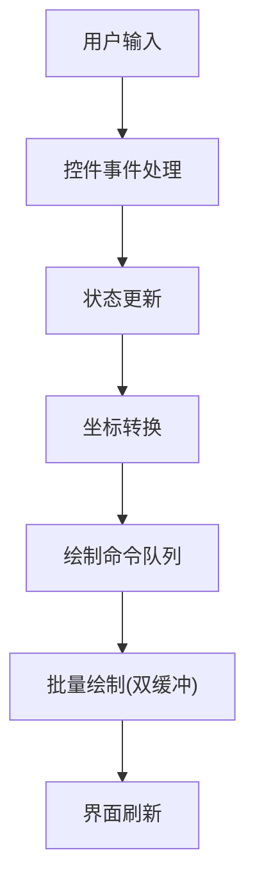
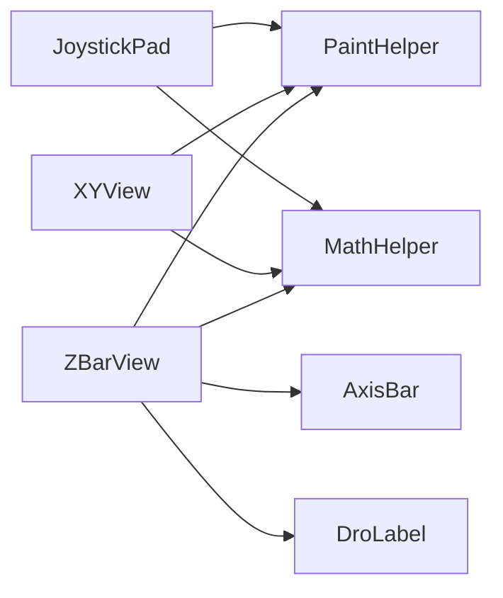

# 高级控件

<cite>
**本文引用的文件**   
- [JoystickPad.cs](file://src/XyzController.Controls/JoystickPad.cs)
- [XYView.cs](file://src/XyzController.Controls/XYView.cs)
- [ZBarView.cs](file://src/XyzController.Controls/ZBarView.cs)
- [AxisBar.cs](file://src/XyzController.Controls/AxisBar.cs)
- [PaintHelper.cs](file://src/XyzController.Controls/PaintHelper.cs)
- [MathHelper.cs](file://src/XyzController.Controls/MathHelper.cs)
- [DroLabel.cs](file://src/XyzController.Controls/DroLabel.cs)
- [JogButton.cs](file://src/XyzController.Controls/JogButton.cs)
- [MainForm.cs](file://src/XyzController/MainForm.cs)
</cite>

## 目录
1. [简介](#简介)
2. [项目结构](#项目结构)
3. [核心组件](#核心组件)
4. [架构总览](#架构总览)
5. [详细组件分析](#详细组件分析)
6. [依赖关系分析](#依赖关系分析)
7. [性能考虑](#性能考虑)
8. [故障排除指南](#故障排除指南)
9. [结论](#结论)
10. [附录](#附录)

## 简介
本文件面向高级用户与集成开发者，系统性阐述以下三个高级控件的设计与实现：
- JoystickPad 虚拟摇杆：用于二维平面（X/Y）的连续输入与交互控制。
- XYView 二维视图：用于在平面上可视化坐标、轨迹与边界，支持缩放、平移与高亮。
- ZBarView Z轴专用显示：用于直观展示Z轴位置、行程范围与状态指示。

文档覆盖复杂用户交互处理、事件驱动机制、图形绘制优化、坐标系统与渲染管道、性能调优策略，以及与主应用集成的最佳实践和常见问题排查方法。

## 项目结构
本项目采用分层组织方式：
- 控制层（Controls）：包含所有可复用UI控件与绘图辅助类。
- 业务逻辑层（Logic）：包含轴控制器、点动服务、通信Hub等。
- 应用入口（MainForm）：承载并组合上述控件，完成与后端逻辑的对接。

图表来源
- [MainForm.cs](file://src/XyzController/MainForm.cs)
- [JoystickPad.cs](file://src/XyzController.Controls/JoystickPad.cs)
- [XYView.cs](file://src/XyzController.Controls/XYView.cs)
- [ZBarView.cs](file://src/XyzController.Controls/ZBarView.cs)
- [AxisBar.cs](file://src/XyzController.Controls/AxisBar.cs)
- [PaintHelper.cs](file://src/XyzController.Controls/PaintHelper.cs)
- [MathHelper.cs](file://src/XyzController.Controls/MathHelper.cs)
- [DroLabel.cs](file://src/XyzController.Controls/DroLabel.cs)
- [JogButton.cs](file://src/XyzController.Controls/JogButton.cs)

章节来源
- [MainForm.cs](file://src/XyzController/MainForm.cs)
- [JoystickPad.cs](file://src/XyzController.Controls/JoystickPad.cs)
- [XYView.cs](file://src/XyzController.Controls/XYView.cs)
- [ZBarView.cs](file://src/XyzController.Controls/ZBarView.cs)
- [AxisBar.cs](file://src/XyzController.Controls/AxisBar.cs)
- [PaintHelper.cs](file://src/XyzController.Controls/PaintHelper.cs)
- [MathHelper.cs](file://src/XyzController.Controls/MathHelper.cs)
- [DroLabel.cs](file://src/XyzController.Controls/DroLabel.cs)
- [JogButton.cs](file://src/XyzController.Controls/JogButton.cs)

## 核心组件
本节聚焦三大高级控件的职责与协作关系：
- JoystickPad：捕获鼠标/触摸事件，计算相对位移，输出标准化向量；提供死区、灵敏度、归一化等参数。
- XYView：维护世界坐标与屏幕坐标映射，绘制网格、边界、轨迹点与光标；支持缩放和平移。
- ZBarView：以条形图形式展示Z轴当前位置、上下限与当前速度/状态；内部复用AxisBar与DroLabel进行数值显示。

关键设计要点
- 坐标系统：统一使用“世界坐标”表示物理或逻辑单位，“屏幕坐标”用于绘制与命中测试。
- 事件驱动：通过自定义事件将用户操作转换为高层语义（如“移动开始/进行中/结束”）。
- 绘制优化：双缓冲、区域裁剪、按需重绘、几何对象缓存。

章节来源
- [JoystickPad.cs](file://src/XyzController.Controls/JoystickPad.cs)
- [XYView.cs](file://src/XyzController.Controls/XYView.cs)
- [ZBarView.cs](file://src/XyzController.Controls/ZBarView.cs)
- [AxisBar.cs](file://src/XyzController.Controls/AxisBar.cs)
- [PaintHelper.cs](file://src/XyzController.Controls/PaintHelper.cs)
- [MathHelper.cs](file://src/XyzController.Controls/MathHelper.cs)
- [DroLabel.cs](file://src/XyzController.Controls/DroLabel.cs)

## 架构总览
下图展示了从用户输入到渲染输出的端到端流程，以及控件之间的依赖关系。

图表来源
- [JoystickPad.cs](file://src/XyzController.Controls/JoystickPad.cs)
- [XYView.cs](file://src/XyzController.Controls/XYView.cs)
- [ZBarView.cs](file://src/XyzController.Controls/ZBarView.cs)
- [PaintHelper.cs](file://src/XyzController.Controls/PaintHelper.cs)
- [MathHelper.cs](file://src/XyzController.Controls/MathHelper.cs)
- [MainForm.cs](file://src/XyzController/MainForm.cs)

## 详细组件分析

### JoystickPad 虚拟摇杆
职责与特性
- 输入捕获：处理鼠标/触摸的按下、移动、抬起事件。
- 坐标变换：将屏幕坐标映射为相对中心点的偏移量，并进行死区过滤与归一化。
- 事件输出：对外暴露移动开始、移动中、移动结束等事件，供上层订阅。
- 视觉反馈：绘制底座、摇杆头、轨迹线与刻度，支持主题色与尺寸定制。

交互与事件流
- 按下：记录初始位置，进入拖拽状态。
- 移动：计算增量，应用死区阈值，生成标准化向量，触发事件。
- 释放：重置状态，触发结束事件。

图表来源
- [JoystickPad.cs](file://src/XyzController.Controls/JoystickPad.cs)
- [PaintHelper.cs](file://src/XyzController.Controls/PaintHelper.cs)
- [MathHelper.cs](file://src/XyzController.Controls/MathHelper.cs)

章节来源
- [JoystickPad.cs](file://src/XyzController.Controls/JoystickPad.cs)
- [PaintHelper.cs](file://src/XyzController.Controls/PaintHelper.cs)
- [MathHelper.cs](file://src/XyzController.Controls/MathHelper.cs)

### XYView 二维视图
职责与特性
- 坐标系管理：维护世界坐标与屏幕坐标的双向映射，支持缩放与平移。
- 内容绘制：网格线、边界框、轨迹点、光标与标注。
- 交互支持：滚轮缩放、拖拽平移、点击定位、右键菜单（可选）。
- 数据绑定：接收来自上层的数据源（如轨迹点集合），按需增量更新。

坐标系统与渲染管道
- 世界坐标：物理单位或逻辑单位，便于与设备/算法对齐。
- 屏幕坐标：像素级坐标，用于GDI+绘制与命中测试。
- 渲染管线：背景→网格→边界→轨迹→光标→标注，按层次顺序绘制。

图表来源
- [XYView.cs](file://src/XyzController.Controls/XYView.cs)
- [PaintHelper.cs](file://src/XyzController.Controls/PaintHelper.cs)
- [MathHelper.cs](file://src/XyzController.Controls/MathHelper.cs)

章节来源
- [XYView.cs](file://src/XyzController.Controls/XYView.cs)
- [PaintHelper.cs](file://src/XyzController.Controls/PaintHelper.cs)
- [MathHelper.cs](file://src/XyzController.Controls/MathHelper.cs)

### ZBarView Z轴专用显示
职责与特性
- 条形可视化：以水平/垂直条形展示Z轴当前位置、上限与下限。
- 数值显示：结合DroLabel实时显示当前值与单位。
- 状态指示：根据运行状态改变颜色或动画效果。
- 复用组件：内部使用AxisBar作为基础条形控件。

图表来源
- [ZBarView.cs](file://src/XyzController.Controls/ZBarView.cs)
- [AxisBar.cs](file://src/XyzController.Controls/AxisBar.cs)
- [DroLabel.cs](file://src/XyzController.Controls/DroLabel.cs)

章节来源
- [ZBarView.cs](file://src/XyzController.Controls/ZBarView.cs)
- [AxisBar.cs](file://src/XyzController.Controls/AxisBar.cs)
- [DroLabel.cs](file://src/XyzController.Controls/DroLabel.cs)

### 概念性概览
下图给出一个不绑定具体代码的概念流程图，帮助理解整体交互与渲染过程。

[此图为概念性说明，无需图表来源]

## 依赖关系分析
- 低耦合：控件之间通过事件与属性进行松耦合通信，避免直接引用彼此的内部实现。
- 辅助类复用：PaintHelper与MathHelper被多个控件共享，减少重复代码，提升一致性。
- 组合优于继承：ZBarView通过组合AxisBar与DroLabel扩展功能，保持单一职责。

图表来源
- [JoystickPad.cs](file://src/XyzController.Controls/JoystickPad.cs)
- [XYView.cs](file://src/XyzController.Controls/XYView.cs)
- [ZBarView.cs](file://src/XyzController.Controls/ZBarView.cs)
- [AxisBar.cs](file://src/XyzController.Controls/AxisBar.cs)
- [PaintHelper.cs](file://src/XyzController.Controls/PaintHelper.cs)
- [MathHelper.cs](file://src/XyzController.Controls/MathHelper.cs)
- [DroLabel.cs](file://src/XyzController.Controls/DroLabel.cs)

章节来源
- [JoystickPad.cs](file://src/XyzController.Controls/JoystickPad.cs)
- [XYView.cs](file://src/XyzController.Controls/XYView.cs)
- [ZBarView.cs](file://src/XyzController.Controls/ZBarView.cs)
- [AxisBar.cs](file://src/XyzController.Controls/AxisBar.cs)
- [PaintHelper.cs](file://src/XyzController.Controls/PaintHelper.cs)
- [MathHelper.cs](file://src/XyzController.Controls/MathHelper.cs)
- [DroLabel.cs](file://src/XyzController.Controls/DroLabel.cs)

## 性能考虑
- 双缓冲绘制：启用控件双缓冲以减少闪烁与重绘开销。
- 区域裁剪：仅重绘受影响区域，避免整屏刷新。
- 几何对象缓存：对常用形状、画笔、字体进行缓存，减少分配与GC压力。
- 增量更新：轨迹点与数值变化时只更新必要元素。
- 事件节流：高频事件（如移动）进行采样或合并，降低处理频率。
- 缩放与平移：使用矩阵变换一次性完成坐标映射，避免逐点计算。

[本节为通用指导，无需章节来源]

## 故障排除指南
常见问题与解决思路
- 事件未触发或丢失
  - 检查控件是否启用鼠标/触摸捕获。
  - 确认事件订阅是否正确绑定且未被移除。
- 坐标不一致或漂移
  - 核对世界坐标与屏幕坐标的映射函数是否一致。
  - 检查缩放与平移状态是否与数据源同步。
- 绘制闪烁或卡顿
  - 确认已启用双缓冲。
  - 检查是否存在频繁创建画笔/字体等对象。
- Z轴显示异常
  - 校验最小/最大值设置是否合理。
  - 确保数值更新线程安全，必要时在主线程更新UI。

章节来源
- [JoystickPad.cs](file://src/XyzController.Controls/JoystickPad.cs)
- [XYView.cs](file://src/XyzController.Controls/XYView.cs)
- [ZBarView.cs](file://src/XyzController.Controls/ZBarView.cs)
- [PaintHelper.cs](file://src/XyzController.Controls/PaintHelper.cs)
- [MathHelper.cs](file://src/XyzController.Controls/MathHelper.cs)

## 结论
JoystickPad、XYView与ZBarView共同构成了一个高效、可扩展的高级控件体系。通过清晰的坐标系统、事件驱动机制与优化的渲染管道，它们能够胜任复杂的工业控制与可视化场景。建议在实际集成中遵循松耦合原则、合理使用辅助类，并结合性能调优策略以获得稳定流畅的用户体验。

[本节为总结性内容，无需章节来源]

## 附录
- 集成示例路径（参考）
  - 在应用中添加控件并订阅事件：参见 [MainForm.cs](file://src/XyzController/MainForm.cs)
  - 自定义摇杆外观与行为：参见 [JoystickPad.cs](file://src/XyzController.Controls/JoystickPad.cs)
  - 配置视图缩放与轨迹：参见 [XYView.cs](file://src/XyzController.Controls/XYView.cs)
  - 调整Z轴范围与显示样式：参见 [ZBarView.cs](file://src/XyzController.Controls/ZBarView.cs)

章节来源
- [MainForm.cs](file://src/XyzController/MainForm.cs)
- [JoystickPad.cs](file://src/XyzController.Controls/JoystickPad.cs)
- [XYView.cs](file://src/XyzController.Controls/XYView.cs)
- [ZBarView.cs](file://src/XyzController.Controls/ZBarView.cs)