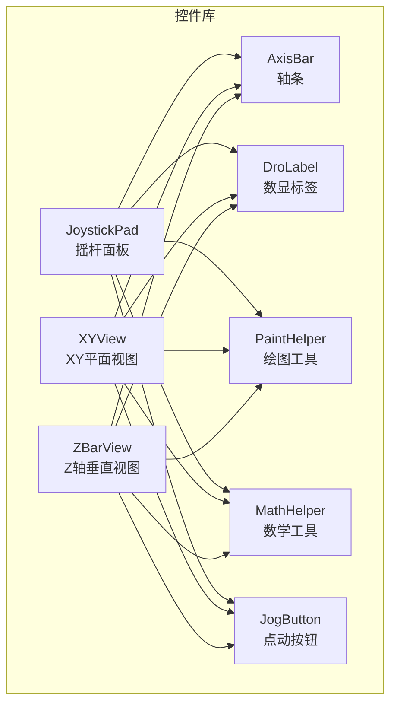
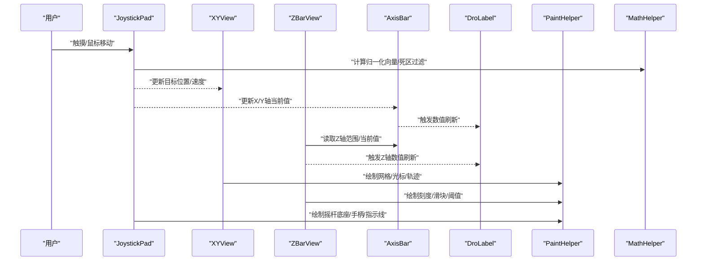
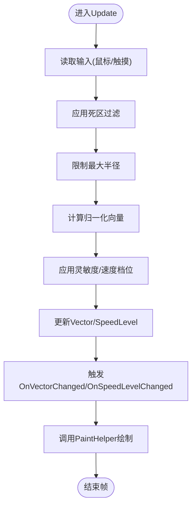
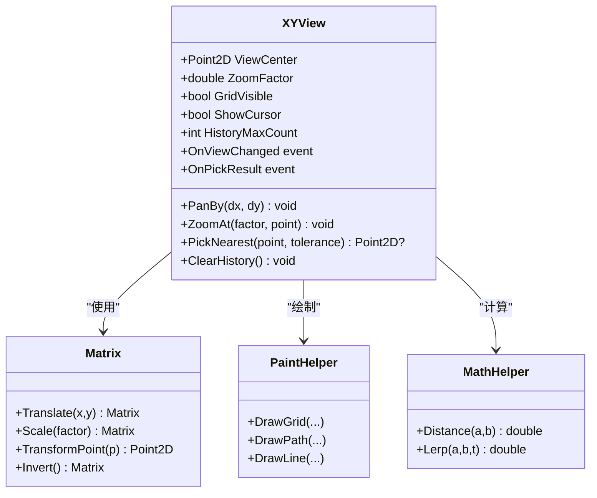
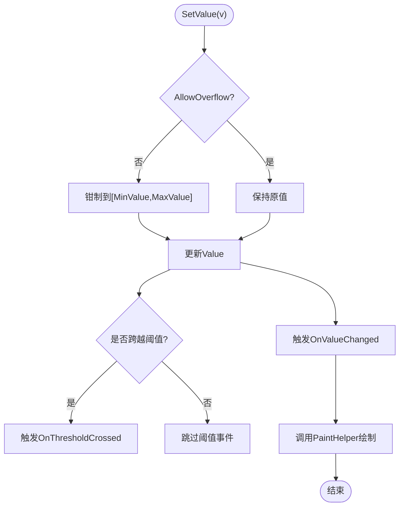
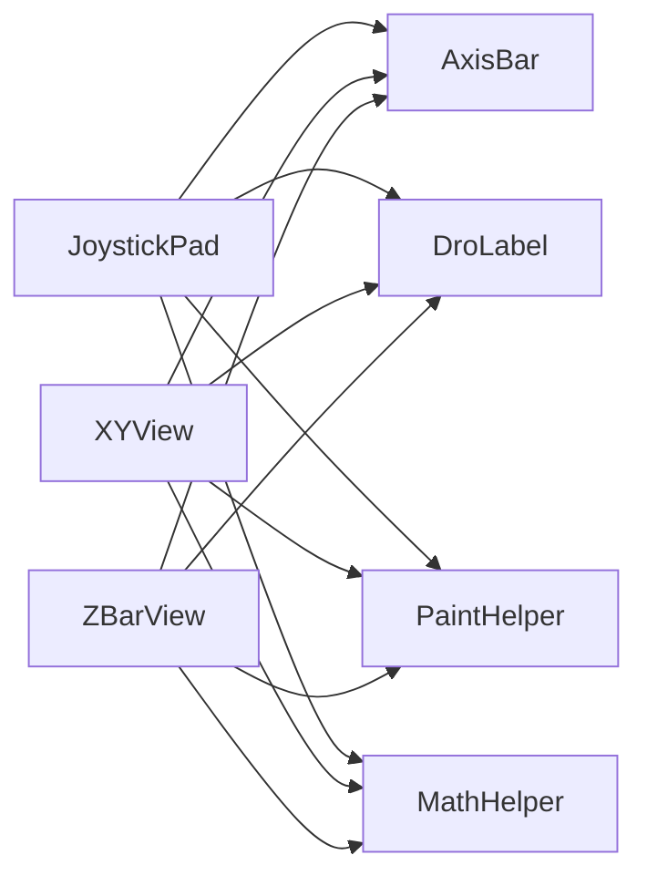

# 高级控件

<cite>
**本文引用的文件**   
- [JoystickPad.cs](file://src/XyzController.Controls/JoystickPad.cs)
- [XYView.cs](file://src/XyzController.Controls/XYView.cs)
- [ZBarView.cs](file://src/XyzController.Controls/ZBarView.cs)
- [AxisBar.cs](file://src/XyzController.Controls/AxisBar.cs)
- [PaintHelper.cs](file://src/XyzController.Controls/PaintHelper.cs)
- [MathHelper.cs](file://src/XyzController.Controls/MathHelper.cs)
- [DroLabel.cs](file://src/XyzController.Controls/DroLabel.cs)
- [JogButton.cs](file://src/XyzController.Controls/JogButton.cs)
- [MainForm.cs](file://src/XyzController/MainForm.cs)
- [TrajectoryViewForm.cs](file://src/XyzController/TrajectoryViewForm.cs)
</cite>

## 目录
1. [简介](#简介)
2. [项目结构](#项目结构)
3. [核心组件](#核心组件)
4. [架构总览](#架构总览)
5. [详细组件分析](#详细组件分析)
6. [依赖关系分析](#依赖关系分析)
7. [性能考虑](#性能考虑)
8. [故障排查指南](#故障排查指南)
9. [结论](#结论)
10. [附录：API参考与示例](#附录api参考与示例)

## 简介
本文件聚焦于XyzController中的三个复杂交互控件：JoystickPad摇杆控制面板、XYView XY平面视图、ZBarView Z轴垂直视图。文档从系统架构、数据流、渲染机制、坐标系统与变换矩阵、事件与交互处理、自定义绘制、性能优化与内存管理等方面进行全面说明，并提供面向开发者的API参考与使用示例，帮助读者在XYZ轴控制系统中高效集成与扩展这些控件。

## 项目结构
高级控件位于控件库项目中，围绕“显示-交互-辅助”三层组织：
- 显示层：JoystickPad、XYView、ZBarView负责UI呈现与用户交互
- 逻辑层：AxisBar承载轴状态与范围；DroLabel显示数值；JogButton提供点动控制
- 辅助层：PaintHelper封装绘图工具；MathHelper提供数学计算

图表来源
- [JoystickPad.cs](file://src/XyzController.Controls/JoystickPad.cs)
- [XYView.cs](file://src/XyzController.Controls/XYView.cs)
- [ZBarView.cs](file://src/XyzController.Controls/ZBarView.cs)
- [AxisBar.cs](file://src/XyzController.Controls/AxisBar.cs)
- [DroLabel.cs](file://src/XyzController.Controls/DroLabel.cs)
- [JogButton.cs](file://src/XyzController.Controls/JogButton.cs)
- [PaintHelper.cs](file://src/XyzController.Controls/PaintHelper.cs)
- [MathHelper.cs](file://src/XyzController.Controls/MathHelper.cs)

章节来源
- [JoystickPad.cs](file://src/XyzController.Controls/JoystickPad.cs)
- [XYView.cs](file://src/XyzController.Controls/XYView.cs)
- [ZBarView.cs](file://src/XyzController.Controls/ZBarView.cs)
- [AxisBar.cs](file://src/XyzController.Controls/AxisBar.cs)
- [DroLabel.cs](file://src/XyzController.Controls/DroLabel.cs)
- [JogButton.cs](file://src/XyzController.Controls/JogButton.cs)
- [PaintHelper.cs](file://src/XyzController.Controls/PaintHelper.cs)
- [MathHelper.cs](file://src/XyzController.Controls/MathHelper.cs)

## 核心组件
本节概述三大控件的职责与协作方式：
- JoystickPad：二维触控/鼠标驱动的虚拟摇杆，支持多指手势、死区、回弹、方向锁定等，输出归一化向量并驱动XYView与外部控制器
- XYView：二维坐标系下的轨迹与目标点可视化，支持缩放、平移、网格、光标拾取、碰撞检测
- ZBarView：单轴（Z）的垂直进度条式视图，支持范围映射、越界保护、步进增量、阈值指示

三者共享：
- AxisBar：统一的轴范围、当前位置、步进量、越界策略
- DroLabel：高精度数值显示，支持单位与精度配置
- PaintHelper：路径、渐变、阴影、抗锯齿等绘图封装
- MathHelper：坐标转换、距离、角度、插值等数学运算

章节来源
- [JoystickPad.cs](file://src/XyzController.Controls/JoystickPad.cs)
- [XYView.cs](file://src/XyzController.Controls/XYView.cs)
- [ZBarView.cs](file://src/XyzController.Controls/ZBarView.cs)
- [AxisBar.cs](file://src/XyzController.Controls/AxisBar.cs)
- [DroLabel.cs](file://src/XyzController.Controls/DroLabel.cs)
- [PaintHelper.cs](file://src/XyzController.Controls/PaintHelper.cs)
- [MathHelper.cs](file://src/XyzController.Controls/MathHelper.cs)

## 架构总览
下图展示控件间的依赖与数据流向：输入事件经JoystickPad转换为向量，更新XYView的视口与光标位置；ZBarView独立反映Z轴状态；所有视图通过AxisBar与DroLabel同步显示；PaintHelper与MathHelper为底层支撑。

图表来源
- [JoystickPad.cs](file://src/XyzController.Controls/JoystickPad.cs)
- [XYView.cs](file://src/XyzController.Controls/XYView.cs)
- [ZBarView.cs](file://src/XyzController.Controls/ZBarView.cs)
- [AxisBar.cs](file://src/XyzController.Controls/AxisBar.cs)
- [DroLabel.cs](file://src/XyzController.Controls/DroLabel.cs)
- [PaintHelper.cs](file://src/XyzController.Controls/PaintHelper.cs)
- [MathHelper.cs](file://src/XyzController.Controls/MathHelper.cs)

## 详细组件分析

### JoystickPad 摇杆控制面板
职责与特性
- 输入处理：支持鼠标拖拽与多点触控，具备死区、平滑过渡、边界约束、方向锁定
- 输出模型：输出归一化二维向量与速度档位，可绑定到外部控制器或内部AxisBar
- 交互反馈：视觉跟随、回弹动画、高亮区域、提示文本
- 自定义绘制：底座圆环、手柄椭圆、径向指示线、背景网格

关键属性与方法（摘要）
- 属性
  - DeadZone：死区半径比例
  - Sensitivity：灵敏度系数
  - SnapToAxes：是否吸附到轴向
  - MaxRadius：最大拖动半径
  - IsLocked：方向锁定开关
  - Vector：当前归一化向量
  - SpeedLevel：速度档位
- 方法
  - Reset()：复位到中心
  - SetRange(min,max)：设置物理范围映射
  - Update(dt)：每帧更新动画与状态
- 事件
  - OnVectorChanged：向量变化回调
  - OnSpeedLevelChanged：速度档位变化回调
  - OnReset：复位完成回调

坐标系统与变换
- 本地坐标以控件中心为原点，像素到物理单位的映射由SetRange与MathHelper完成
- 死区与边界采用极坐标判断与投影，避免抖动

渲染优化
- 双缓冲绘制，减少闪烁
- 按需重绘区域裁剪
- 预计算常用几何形状缓存

图表来源
- [JoystickPad.cs](file://src/XyzController.Controls/JoystickPad.cs)
- [MathHelper.cs](file://src/XyzController.Controls/MathHelper.cs)
- [PaintHelper.cs](file://src/XyzController.Controls/PaintHelper.cs)

章节来源
- [JoystickPad.cs](file://src/XyzController.Controls/JoystickPad.cs)
- [MathHelper.cs](file://src/XyzController.Controls/MathHelper.cs)
- [PaintHelper.cs](file://src/XyzController.Controls/PaintHelper.cs)

### XYView XY平面视图
职责与特性
- 视图控制：缩放、平移、网格显示、坐标轴标注
- 光标与拾取：十字光标、最近点拾取、碰撞检测
- 轨迹记录：历史轨迹绘制、轨迹清理、快照导出
- 联动：与JoystickPad输出联动，实时显示目标位置与运动趋势

关键属性与方法（摘要）
- 属性
  - ViewCenter：视图中心坐标
  - ZoomFactor：缩放因子
  - GridVisible：网格可见性
  - ShowCursor：光标可见性
  - HistoryMaxCount：历史轨迹最大长度
- 方法
  - PanBy(dx,dy)：平移视图
  - ZoomAt(factor,point)：以某点为中心缩放
  - PickNearest(point,tolerance)：拾取最近点
  - ClearHistory()：清空轨迹
- 事件
  - OnViewChanged：视图参数变化
  - OnPickResult：拾取结果回调

坐标系统与变换矩阵
- 世界坐标到屏幕坐标的变换由Matrix类组合实现，包含平移、缩放、旋转（可选）
- 拾取过程将屏幕坐标反变换为世界坐标，再执行距离比较

渲染管线
- 分层绘制：背景网格 -> 轨迹 -> 光标 -> 标注
- 使用PaintHelper批量绘制路径与线段，减少GDI+开销

图表来源
- [XYView.cs](file://src/XyzController.Controls/XYView.cs)
- [PaintHelper.cs](file://src/XyzController.Controls/PaintHelper.cs)
- [MathHelper.cs](file://src/XyzController.Controls/MathHelper.cs)

章节来源
- [XYView.cs](file://src/XyzController.Controls/XYView.cs)
- [PaintHelper.cs](file://src/XyzController.Controls/PaintHelper.cs)
- [MathHelper.cs](file://src/XyzController.Controls/MathHelper.cs)

### ZBarView Z轴垂直视图
职责与特性
- 单轴可视化：垂直进度条样式，显示当前值、上下限、步进增量、阈值标记
- 交互：滚轮缩放、拖拽滑块、键盘步进
- 联动：与AxisBar同步，越界时自动回退或报警提示

关键属性与方法（摘要）
- 属性
  - MinValue / MaxValue：范围
  - Value：当前值
  - Step：步进量
  - ThresholdLow / ThresholdHigh：阈值
  - AllowOverflow：是否允许越界
- 方法
  - SetValue(v)：设置值并校验范围
  - StepUp()/StepDown()：按步进量调整
  - Reset()：复位到默认值
- 事件
  - OnValueChanged：值变化回调
  - OnThresholdCrossed：越过阈值回调

绘制与交互流程
- 绘制顺序：背景槽 -> 填充条 -> 刻度 -> 滑块 -> 阈值线 -> 数值标签
- 交互优先级：滑块拖拽 > 滚轮缩放 > 键盘步进

图表来源
- [ZBarView.cs](file://src/XyzController.Controls/ZBarView.cs)
- [AxisBar.cs](file://src/XyzController.Controls/AxisBar.cs)
- [PaintHelper.cs](file://src/XyzController.Controls/PaintHelper.cs)

章节来源
- [ZBarView.cs](file://src/XyzController.Controls/ZBarView.cs)
- [AxisBar.cs](file://src/XyzController.Controls/AxisBar.cs)
- [PaintHelper.cs](file://src/XyzController.Controls/PaintHelper.cs)

### 辅助组件
- AxisBar：维护轴的Min/Max/Current/Step，提供越界策略与事件通知
- DroLabel：高精度显示，支持格式化与单位切换
- JogButton：点动控制，长按加速，双击复位
- PaintHelper：统一绘图接口，路径、渐变、阴影、字体渲染
- MathHelper：距离、角度、插值、四舍五入、范围映射

章节来源
- [AxisBar.cs](file://src/XyzController.Controls/AxisBar.cs)
- [DroLabel.cs](file://src/XyzController.Controls/DroLabel.cs)
- [JogButton.cs](file://src/XyzController.Controls/JogButton.cs)
- [PaintHelper.cs](file://src/XyzController.Controls/PaintHelper.cs)
- [MathHelper.cs](file://src/XyzController.Controls/MathHelper.cs)

## 依赖关系分析
- 松耦合：控件通过AxisBar与DroLabel进行状态同步，避免直接强耦合
- 辅助解耦：PaintHelper与MathHelper作为静态工具层，降低重复代码
- 事件驱动：各控件通过事件对外暴露变化，便于宿主窗体订阅与协调

图表来源
- [JoystickPad.cs](file://src/XyzController.Controls/JoystickPad.cs)
- [XYView.cs](file://src/XyzController.Controls/XYView.cs)
- [ZBarView.cs](file://src/XyzController.Controls/ZBarView.cs)
- [AxisBar.cs](file://src/XyzController.Controls/AxisBar.cs)
- [DroLabel.cs](file://src/XyzController.Controls/DroLabel.cs)
- [PaintHelper.cs](file://src/XyzController.Controls/PaintHelper.cs)
- [MathHelper.cs](file://src/XyzController.Controls/MathHelper.cs)

章节来源
- [JoystickPad.cs](file://src/XyzController.Controls/JoystickPad.cs)
- [XYView.cs](file://src/XyzController.Controls/XYView.cs)
- [ZBarView.cs](file://src/XyzController.Controls/ZBarView.cs)
- [AxisBar.cs](file://src/XyzController.Controls/AxisBar.cs)
- [DroLabel.cs](file://src/XyzController.Controls/DroLabel.cs)
- [PaintHelper.cs](file://src/XyzController.Controls/PaintHelper.cs)
- [MathHelper.cs](file://src/XyzController.Controls/MathHelper.cs)

## 性能考虑
- 渲染优化
  - 启用双缓冲与区域裁剪，减少无效绘制
  - 批量绘制路径与线段，合并相同样式绘制调用
  - 对频繁更新的元素（如光标、轨迹）使用离屏位图缓存
- 计算优化
  - 使用MathHelper的定点近似与快速函数，避免昂贵三角函数
  - 对拾取操作采用空间索引或分块检查，降低O(n)复杂度
- 内存管理
  - 及时释放临时对象，避免GC压力
  - 轨迹历史使用环形缓冲区，限制最大长度
  - 字体与画笔资源复用，避免重复创建
- 交互响应
  - 节流高频事件（如OnVectorChanged），合并多次更新
  - 动画使用固定时间步长，保证稳定帧率

[本节为通用指导，不直接分析具体文件]

## 故障排查指南
常见问题与定位建议
- 摇杆无响应
  - 检查死区设置是否过大
  - 确认输入捕获焦点与禁用状态
  - 查看OnVectorChanged是否被订阅
- XY视图错位
  - 核对Matrix变换顺序与缩放因子
  - 验证拾取容差与最近点算法
- Z轴越界
  - 检查AllowOverflow与阈值配置
  - 确认SetValue的钳制逻辑
- 绘制闪烁
  - 确认双缓冲开启与重绘区域裁剪
  - 减少每帧创建的图形对象

章节来源
- [JoystickPad.cs](file://src/XyzController.Controls/JoystickPad.cs)
- [XYView.cs](file://src/XyzController.Controls/XYView.cs)
- [ZBarView.cs](file://src/XyzController.Controls/ZBarView.cs)
- [AxisBar.cs](file://src/XyzController.Controls/AxisBar.cs)
- [PaintHelper.cs](file://src/XyzController.Controls/PaintHelper.cs)

## 结论
JoystickPad、XYView与ZBarView构成XyzController的核心交互与可视化能力。通过清晰的坐标系统、稳健的变换矩阵、高效的绘制与数学工具，以及完善的事件与属性体系，它们能够在复杂的XYZ轴控制系统中提供流畅的用户体验与可靠的性能表现。遵循本文档的API参考与实践建议，开发者可以快速集成并扩展这些高级控件。

[本节为总结性内容，不直接分析具体文件]

## 附录：API参考与示例

### API参考（摘要）
- JoystickPad
  - 属性：DeadZone、Sensitivity、SnapToAxes、MaxRadius、IsLocked、Vector、SpeedLevel
  - 方法：Reset()、SetRange(min,max)、Update(dt)
  - 事件：OnVectorChanged、OnSpeedLevelChanged、OnReset
- XYView
  - 属性：ViewCenter、ZoomFactor、GridVisible、ShowCursor、HistoryMaxCount
  - 方法：PanBy(dx,dy)、ZoomAt(factor,point)、PickNearest(point,tolerance)、ClearHistory()
  - 事件：OnViewChanged、OnPickResult
- ZBarView
  - 属性：MinValue、MaxValue、Value、Step、ThresholdLow、ThresholdHigh、AllowOverflow
  - 方法：SetValue(v)、StepUp()、StepDown()、Reset()
  - 事件：OnValueChanged、OnThresholdCrossed
- AxisBar
  - 属性：Min、Max、Current、Step、AllowOverflow
  - 方法：Clamp(value)、StepUp()、StepDown()
  - 事件：OnValueChanged
- DroLabel
  - 属性：Value、Format、Unit
  - 方法：Refresh()
- JogButton
  - 属性：Direction、HoldInterval、DoubleClickAction
  - 方法：StartJog()、StopJog()
- PaintHelper
  - 方法：DrawGrid、DrawPath、DrawLine、DrawText、ApplyShadow
- MathHelper
  - 方法：Distance、Angle、Lerp、MapRange、RoundTo

章节来源
- [JoystickPad.cs](file://src/XyzController.Controls/JoystickPad.cs)
- [XYView.cs](file://src/XyzController.Controls/XYView.cs)
- [ZBarView.cs](file://src/XyzController.Controls/ZBarView.cs)
- [AxisBar.cs](file://src/XyzController.Controls/AxisBar.cs)
- [DroLabel.cs](file://src/XyzController.Controls/DroLabel.cs)
- [JogButton.cs](file://src/XyzController.Controls/JogButton.cs)
- [PaintHelper.cs](file://src/XyzController.Controls/PaintHelper.cs)
- [MathHelper.cs](file://src/XyzController.Controls/MathHelper.cs)

### 使用示例（场景说明）
- 场景A：通过JoystickPad控制XYView光标与轨迹
  - 步骤：订阅OnVectorChanged，将向量映射到XYView的目标位置；启用HistoryMaxCount记录轨迹；根据ZoomFactor动态调整网格密度
  - 关键点：死区与灵敏度调优；轨迹缓存大小与清理策略
- 场景B：ZBarView与AxisBar联动
  - 步骤：初始化Min/Max/Step；订阅OnValueChanged与OnThresholdCrossed；在阈值跨越时触发告警或停止动作
  - 关键点：AllowOverflow策略；步进量与分辨率匹配
- 场景C：综合XYZ控制界面
  - 步骤：在主窗体中放置三控件；使用AxisBar作为共享状态源；DroLabel显示当前XYZ值；JogButton提供手动微调
  - 关键点：事件合并与节流；视图缩放与坐标一致性

章节来源
- [MainForm.cs](file://src/XyzController/MainForm.cs)
- [TrajectoryViewForm.cs](file://src/XyzController/TrajectoryViewForm.cs)
- [JoystickPad.cs](file://src/XyzController.Controls/JoystickPad.cs)
- [XYView.cs](file://src/XyzController.Controls/XYView.cs)
- [ZBarView.cs](file://src/XyzController.Controls/ZBarView.cs)
- [AxisBar.cs](file://src/XyzController.Controls/AxisBar.cs)
- [DroLabel.cs](file://src/XyzController.Controls/DroLabel.cs)
- [JogButton.cs](file://src/XyzController.Controls/JogButton.cs)