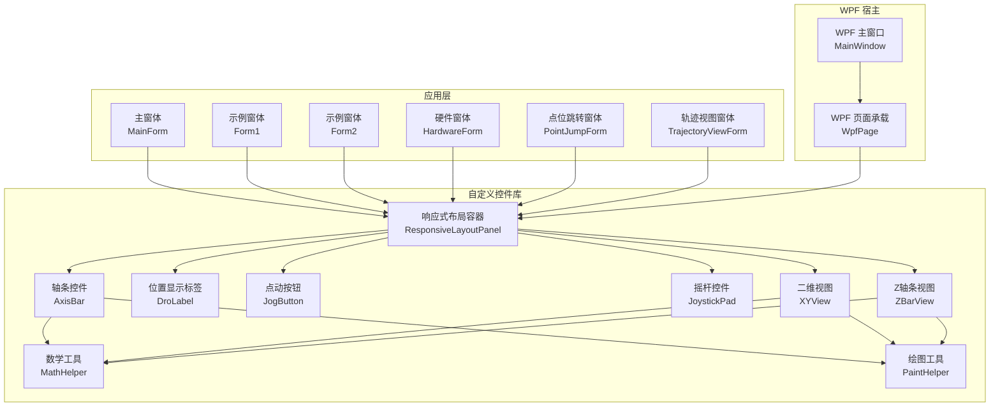
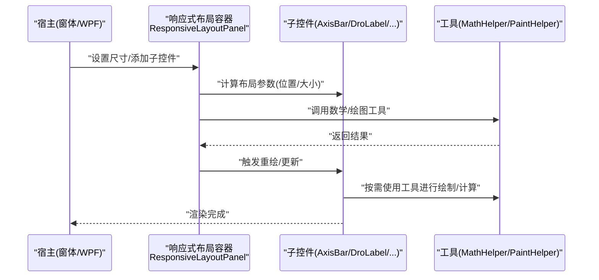
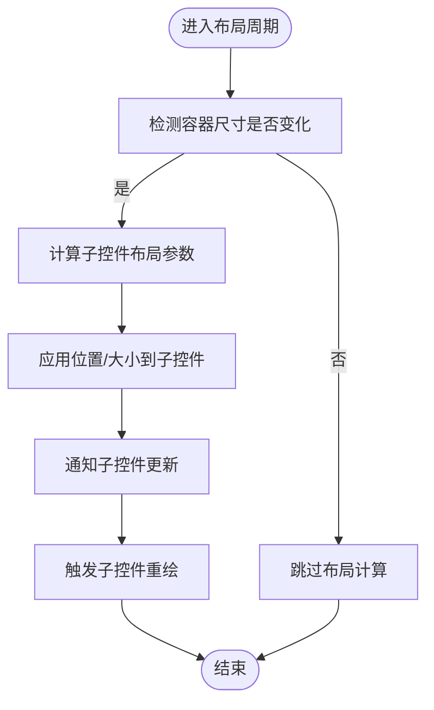
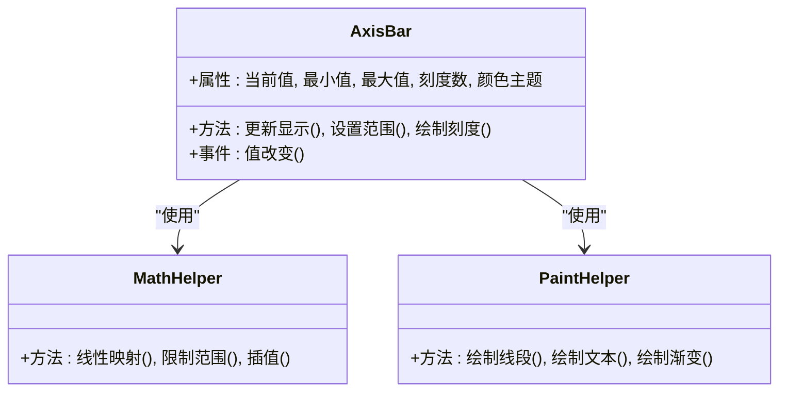
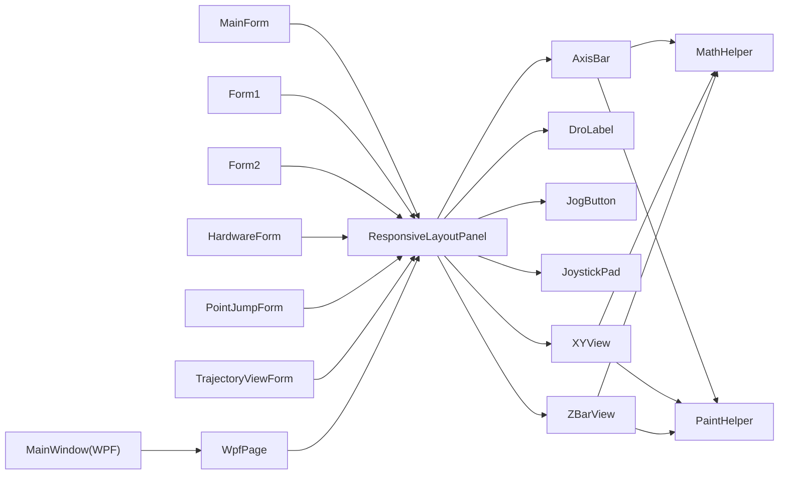

# 响应式布局控件

<cite>
**本文引用的文件**   
- [ResponsiveLayoutPanel.cs](file://src/XyzController.Controls/ResponsiveLayoutPanel.cs)
- [AxisBar.cs](file://src/XyzController.Controls/AxisBar.cs)
- [DroLabel.cs](file://src/XyzController.Controls/DroLabel.cs)
- [JogButton.cs](file://src/XyzController.Controls/JogButton.cs)
- [JoystickPad.cs](file://src/XyzController.Controls/JoystickPad.cs)
- [XYView.cs](file://src/XyzController.Controls/XYView.cs)
- [ZBarView.cs](file://src/XyzController.Controls/ZBarView.cs)
- [MathHelper.cs](file://src/XyzController.Controls/MathHelper.cs)
- [PaintHelper.cs](file://src/XyzController.Controls/PaintHelper.cs)
- [XyzController.Controls.csproj](file://src/XyzController.Controls/XyzController.Controls.csproj)
- [Form1.cs](file://src/XyzController/Form1.cs)
- [Form2.cs](file://src/XyzController/Form2.cs)
- [HardwareForm.cs](file://src/XyzController/HardwareForm.cs)
- [MainForm.cs](file://src/XyzController/MainForm.cs)
- [PointJumpForm.cs](file://src/XyzController/PointJumpForm.cs)
- [TrajectoryViewForm.cs](file://src/XyzController/TrajectoryViewForm.cs)
- [WpfPage.cs](file://src/XyzController.WpfHost/WpfPage.cs)
- [MainWindow.xaml.cs](file://src/XyzController.WpfHost/MainWindow.xaml.cs)
</cite>

## 目录
1. [简介](#简介)
2. [项目结构](#项目结构)
3. [核心组件](#核心组件)
4. [架构总览](#架构总览)
5. [详细组件分析](#详细组件分析)
6. [依赖关系分析](#依赖关系分析)
7. [性能考虑](#性能考虑)
8. [故障排查指南](#故障排查指南)
9. [结论](#结论)
10. [附录](#附录)

## 简介
本文件聚焦于“响应式布局控件”的设计与实现，围绕 XyzController 的 WinForms 自定义控件库展开。重点包括：
- 响应式布局容器 ResponsiveLayoutPanel 的布局策略、尺寸计算与重绘流程
- 常用业务控件（轴条、位置显示、点动按钮、摇杆、二维/三维视图）在响应式容器中的行为
- 与宿主窗体及 WPF 宿主页面的集成方式
- 关键算法与绘制辅助工具（数学与绘图）的使用要点

## 项目结构
本项目采用分层组织：
- 控制逻辑层：轴控制、点动服务、Hub 通信等
- 自定义控件库：提供可复用的 UI 控件与响应式布局容器
- 应用层：WinForms 主程序与示例窗体
- WPF 宿主：将 WinForms 控件嵌入 WPF 页面展示

图表来源
- [ResponsiveLayoutPanel.cs](file://src/XyzController.Controls/ResponsiveLayoutPanel.cs)
- [AxisBar.cs](file://src/XyzController.Controls/AxisBar.cs)
- [DroLabel.cs](file://src/XyzController.Controls/DroLabel.cs)
- [JogButton.cs](file://src/XyzController.Controls/JogButton.cs)
- [JoystickPad.cs](file://src/XyzController.Controls/JoystickPad.cs)
- [XYView.cs](file://src/XyzController.Controls/XYView.cs)
- [ZBarView.cs](file://src/XyzController.Controls/ZBarView.cs)
- [MathHelper.cs](file://src/XyzController.Controls/MathHelper.cs)
- [PaintHelper.cs](file://src/XyzController.Controls/PaintHelper.cs)
- [MainForm.cs](file://src/XyzController/MainForm.cs)
- [Form1.cs](file://src/XyzController/Form1.cs)
- [Form2.cs](file://src/XyzController/Form2.cs)
- [HardwareForm.cs](file://src/XyzController/HardwareForm.cs)
- [PointJumpForm.cs](file://src/XyzController/PointJumpForm.cs)
- [TrajectoryViewForm.cs](file://src/XyzController/TrajectoryViewForm.cs)
- [WpfPage.cs](file://src/XyzController.WpfHost/WpfPage.cs)
- [MainWindow.xaml.cs](file://src/XyzController.WpfHost/MainWindow.xaml.cs)

章节来源
- [XyzController.Controls.csproj](file://src/XyzController.Controls/XyzController.Controls.csproj)

## 核心组件
- 响应式布局容器 ResponsiveLayoutPanel
  - 负责子控件的尺寸自适应、间距管理、对齐与重排
  - 监听容器尺寸变化，触发子控件重新布局与绘制
  - 提供统一的布局策略接口，便于扩展新的排列模式
- 业务控件族
  - AxisBar：轴进度/范围可视化，支持刻度、阈值标记
  - DroLabel：实时位置数值显示，支持格式化与刷新频率控制
  - JogButton：点动控制按钮，支持长按/双击等行为
  - JoystickPad：虚拟摇杆输入，输出归一化方向向量
  - XYView：二维平面视图，用于轨迹预览与坐标映射
  - ZBarView：Z 轴条视图，常用于高度/深度指示
- 工具类
  - MathHelper：几何与坐标变换、插值、边界约束等
  - PaintHelper：通用绘制封装，减少重复代码并提升一致性

章节来源
- [ResponsiveLayoutPanel.cs](file://src/XyzController.Controls/ResponsiveLayoutPanel.cs)
- [AxisBar.cs](file://src/XyzController.Controls/AxisBar.cs)
- [DroLabel.cs](file://src/XyzController.Controls/DroLabel.cs)
- [JogButton.cs](file://src/XyzController.Controls/JogButton.cs)
- [JoystickPad.cs](file://src/XyzController.Controls/JoystickPad.cs)
- [XYView.cs](file://src/XyzController.Controls/XYView.cs)
- [ZBarView.cs](file://src/XyzController.Controls/ZBarView.cs)
- [MathHelper.cs](file://src/XyzController.Controls/MathHelper.cs)
- [PaintHelper.cs](file://src/XyzController.Controls/PaintHelper.cs)

## 架构总览
响应式布局体系以 ResponsiveLayoutPanel 为中心，向上被各窗体组合使用，向下驱动多个业务控件进行自适应布局与绘制。WPF 宿主通过 WpfPage 承载 WinForms 控件，使同一套控件可在 WPF 界面中复用。

图表来源
- [ResponsiveLayoutPanel.cs](file://src/XyzController.Controls/ResponsiveLayoutPanel.cs)
- [AxisBar.cs](file://src/XyzController.Controls/AxisBar.cs)
- [DroLabel.cs](file://src/XyzController.Controls/DroLabel.cs)
- [JogButton.cs](file://src/XyzController.Controls/JogButton.cs)
- [JoystickPad.cs](file://src/XyzController.Controls/JoystickPad.cs)
- [XYView.cs](file://src/XyzController.Controls/XYView.cs)
- [ZBarView.cs](file://src/XyzController.Controls/ZBarView.cs)
- [MathHelper.cs](file://src/XyzController.Controls/MathHelper.cs)
- [PaintHelper.cs](file://src/XyzController.Controls/PaintHelper.cs)

## 详细组件分析

### 响应式布局容器 ResponsiveLayoutPanel
- 职责
  - 维护子控件集合与布局策略
  - 根据容器尺寸动态计算每个子控件的位置与大小
  - 处理间距、对齐、换行与滚动区域
- 关键流程
  - 尺寸变更事件触发布局计算
  - 遍历子控件，应用策略生成矩形区域
  - 通知子控件更新并重绘
- 扩展点
  - 新增布局策略（如网格、流式、百分比）
  - 自定义间距与边距规则
  - 针对特定控件类型的适配逻辑

图表来源
- [ResponsiveLayoutPanel.cs](file://src/XyzController.Controls/ResponsiveLayoutPanel.cs)

章节来源
- [ResponsiveLayoutPanel.cs](file://src/XyzController.Controls/ResponsiveLayoutPanel.cs)

### 轴条控件 AxisBar
- 职责
  - 可视化轴的当前位置、行程范围、限位与阈值
  - 支持刻度线、颜色分区、动画过渡
- 交互
  - 鼠标拖拽调整目标位置（可选）
  - 键盘快捷键微调
- 数据绑定
  - 与轴控制器状态同步，周期性刷新显示

图表来源
- [AxisBar.cs](file://src/XyzController.Controls/AxisBar.cs)
- [MathHelper.cs](file://src/XyzController.Controls/MathHelper.cs)
- [PaintHelper.cs](file://src/XyzController.Controls/PaintHelper.cs)

章节来源
- [AxisBar.cs](file://src/XyzController.Controls/AxisBar.cs)

### 位置显示标签 DroLabel
- 职责
  - 显示轴或点的实时位置数值
  - 支持小数位数、单位、刷新频率控制
- 性能
  - 避免频繁全量重绘，仅更新文本区域
  - 与布局容器联动，确保在不同分辨率下可读性

章节来源
- [DroLabel.cs](file://src/XyzController.Controls/DroLabel.cs)

### 点动按钮 JogButton
- 职责
  - 提供点动控制入口，支持单击/长按/双击
  - 与点动服务协作，发送速度/方向指令
- 交互反馈
  - 按下态、禁用态、错误态视觉提示

章节来源
- [JogButton.cs](file://src/XyzController.Controls/JogButton.cs)

### 摇杆控件 JoystickPad
- 职责
  - 模拟物理摇杆，输出归一化的二维向量
  - 支持死区、灵敏度、回弹动画
- 数据流
  - 触摸/鼠标事件转换为方向向量
  - 与布局容器配合，保持比例缩放

章节来源
- [JoystickPad.cs](file://src/XyzController.Controls/JoystickPad.cs)

### 二维视图 XYView
- 职责
  - 在二维平面内绘制轨迹、参考线与坐标网格
  - 支持缩放、平移、坐标系转换
- 工具依赖
  - 使用 MathHelper 进行坐标映射与裁剪
  - 使用 PaintHelper 统一绘制风格

章节来源
- [XYView.cs](file://src/XyzController.Controls/XYView.cs)

### Z 轴条视图 ZBarView
- 职责
  - 垂直方向的轴条视图，常用于高度/深度指示
  - 与 AxisBar 类似但方向不同，支持阈值与动画

章节来源
- [ZBarView.cs](file://src/XyzController.Controls/ZBarView.cs)

### 工具类 MathHelper 与 PaintHelper
- MathHelper
  - 提供线性映射、边界约束、插值、角度换算等基础运算
  - 保证数值稳定性与精度控制
- PaintHelper
  - 封装常用绘制操作，统一字体、颜色、线条样式
  - 优化绘制路径，减少闪烁与重绘开销

章节来源
- [MathHelper.cs](file://src/XyzController.Controls/MathHelper.cs)
- [PaintHelper.cs](file://src/XyzController.Controls/PaintHelper.cs)

## 依赖关系分析
- 松耦合设计
  - 业务控件依赖工具类而非具体控制器，降低耦合度
  - 响应式布局容器不关心子控件内部实现，只关注布局参数
- 外部集成
  - 应用层窗体组合布局容器与业务控件
  - WPF 宿主通过 WpfPage 承载 WinForms 控件，实现跨框架复用

图表来源
- [MainForm.cs](file://src/XyzController/MainForm.cs)
- [Form1.cs](file://src/XyzController/Form1.cs)
- [Form2.cs](file://src/XyzController/Form2.cs)
- [HardwareForm.cs](file://src/XyzController/HardwareForm.cs)
- [PointJumpForm.cs](file://src/XyzController/PointJumpForm.cs)
- [TrajectoryViewForm.cs](file://src/XyzController/TrajectoryViewForm.cs)
- [ResponsiveLayoutPanel.cs](file://src/XyzController.Controls/ResponsiveLayoutPanel.cs)
- [AxisBar.cs](file://src/XyzController.Controls/AxisBar.cs)
- [DroLabel.cs](file://src/XyzController.Controls/DroLabel.cs)
- [JogButton.cs](file://src/XyzController.Controls/JogButton.cs)
- [JoystickPad.cs](file://src/XyzController.Controls/JoystickPad.cs)
- [XYView.cs](file://src/XyzController.Controls/XYView.cs)
- [ZBarView.cs](file://src/XyzController.Controls/ZBarView.cs)
- [MathHelper.cs](file://src/XyzController.Controls/MathHelper.cs)
- [PaintHelper.cs](file://src/XyzController.Controls/PaintHelper.cs)
- [MainWindow.xaml.cs](file://src/XyzController.WpfHost/MainWindow.xaml.cs)
- [WpfPage.cs](file://src/XyzController.WpfHost/WpfPage.cs)

章节来源
- [XyzController.Controls.csproj](file://src/XyzController.Controls/XyzController.Controls.csproj)

## 性能考虑
- 布局计算
  - 仅在容器尺寸变化时执行布局，避免每帧重算
  - 对大量子控件采用增量布局与批处理更新
- 绘制优化
  - 使用双缓冲减少闪烁
  - 局部重绘，仅更新受影响区域
  - 合并绘制命令，减少 GDI+ 调用次数
- 数据刷新
  - 控制刷新频率，避免高频更新导致 UI 卡顿
  - 对数值显示使用文本缓存与差异更新

[本节为通用指导，无需源码引用]

## 故障排查指南
- 布局异常
  - 检查容器尺寸事件是否正确触发
  - 确认子控件的最小/最大尺寸限制是否合理
  - 验证间距与对齐参数是否越界
- 绘制问题
  - 检查 PaintHelper 的画笔/画刷资源释放
  - 确认坐标映射与裁剪区域正确
- 交互无响应
  - 核对事件订阅与冒泡机制
  - 检查焦点管理与输入捕获逻辑
- WPF 宿主兼容
  - 确认 WpfPage 的承载方式与 DPI 设置一致
  - 验证 WinForms 控件的父容器生命周期

章节来源
- [ResponsiveLayoutPanel.cs](file://src/XyzController.Controls/ResponsiveLayoutPanel.cs)
- [PaintHelper.cs](file://src/XyzController.Controls/PaintHelper.cs)
- [WpfPage.cs](file://src/XyzController.WpfHost/WpfPage.cs)

## 结论
响应式布局控件以 ResponsiveLayoutPanel 为核心，结合一系列业务控件与工具类，实现了跨分辨率、跨容器的自适应 UI 能力。通过松耦合设计与工具化封装，既保证了可扩展性，也提升了绘制与交互性能。在 WPF 宿主中的良好集成进一步增强了复用价值。

[本节为总结性内容，无需源码引用]

## 附录
- 最佳实践
  - 优先使用响应式布局容器管理复杂界面
  - 将通用绘制逻辑下沉至 PaintHelper，保持一致性
  - 对高频更新的数据采用节流与缓存策略
- 扩展建议
  - 新增布局策略时，遵循现有接口约定，确保向后兼容
  - 为新控件提供默认主题与尺寸约束，便于快速集成

[本节为概念性内容，无需源码引用]