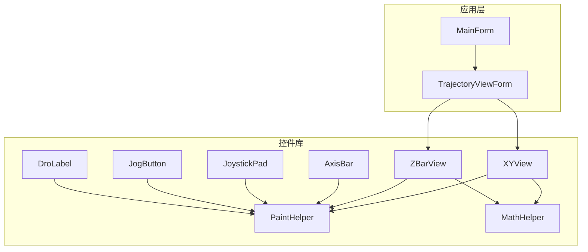
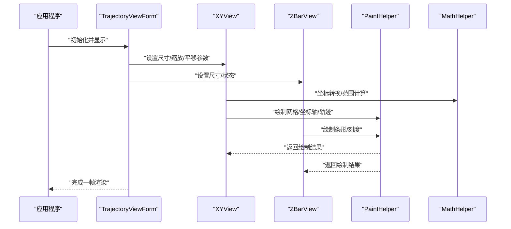
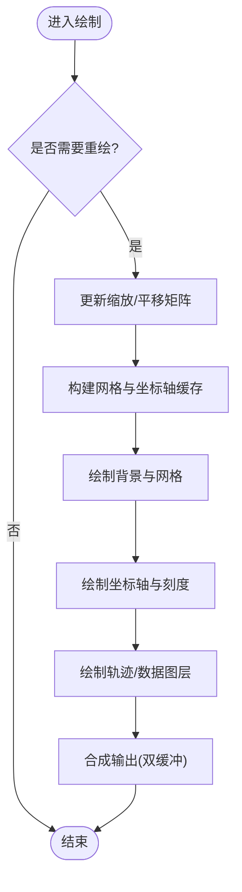
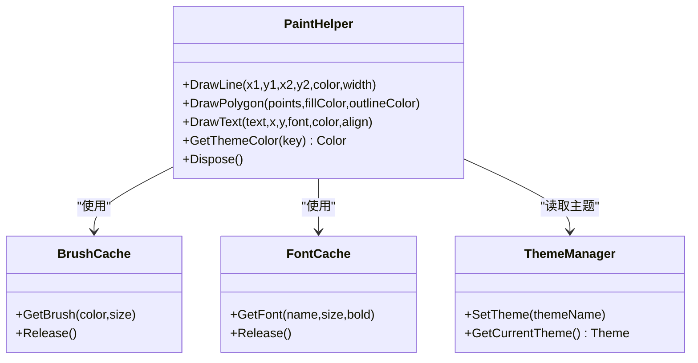
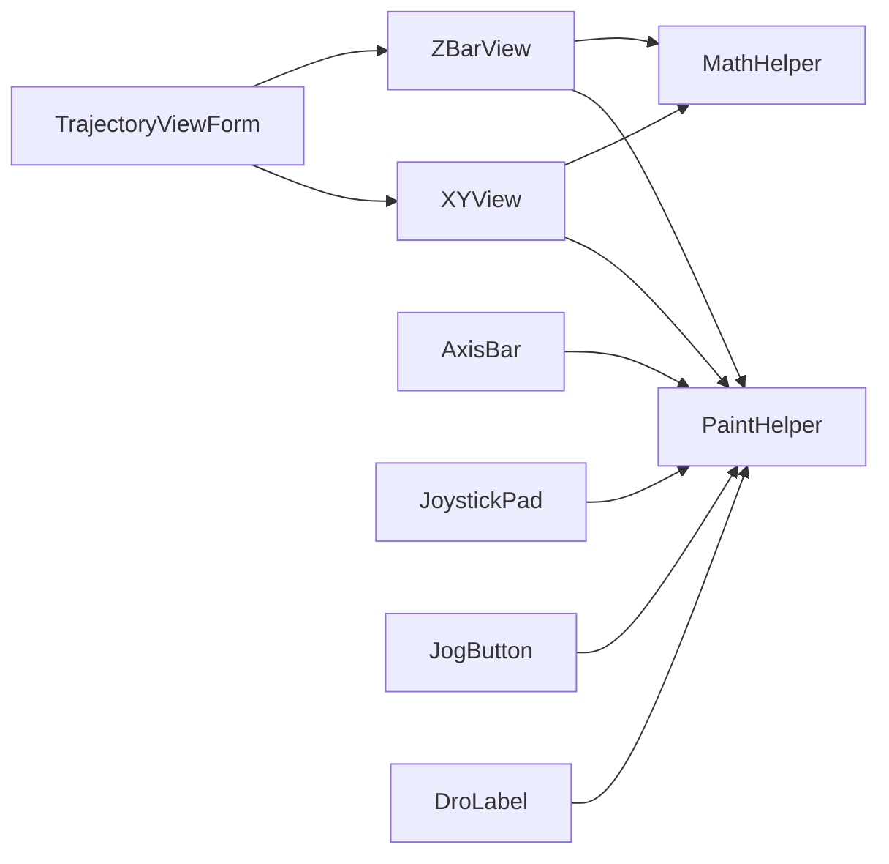

# 可视化渲染机制

<cite>
**本文引用的文件**   
- [TrajectoryViewForm.cs](file://src/XyzController/TrajectoryViewForm.cs)
- [PaintHelper.cs](file://src/XyzController.Controls/PaintHelper.cs)
- [XYView.cs](file://src/XyzController.Controls/XYView.cs)
- [ZBarView.cs](file://src/XyzController.Controls/ZBarView.cs)
- [AxisBar.cs](file://src/XyzController.Controls/AxisBar.cs)
- [JoystickPad.cs](file://src/XyzController.Controls/JoystickPad.cs)
- [JogButton.cs](file://src/XyzController.Controls/JogButton.cs)
- [DroLabel.cs](file://src/XyzController.Controls/DroLabel.cs)
- [MathHelper.cs](file://src/XyzController.Controls/MathHelper.cs)
- [MainForm.cs](file://src/XyzController/MainForm.cs)
</cite>

## 目录
1. [简介](#简介)
2. [项目结构](#项目结构)
3. [核心组件](#核心组件)
4. [架构总览](#架构总览)
5. [详细组件分析](#详细组件分析)
6. [依赖关系分析](#依赖关系分析)
7. [性能考虑](#性能考虑)
8. [故障排查指南](#故障排查指南)
9. [结论](#结论)
10. [附录](#附录)

## 简介
本文件聚焦于可视化渲染机制，围绕 TrajectoryViewForm 的图形渲染架构展开，系统阐述双缓冲绘制、重绘优化与内存管理策略；深入解析 PaintHelper 绘图辅助类的核心绘制函数（线条、多边形填充、文本渲染、颜色管理）；文档化视图控制能力（缩放级别、平移、网格显示、坐标轴绘制）；总结实时渲染的性能优化技巧（区域重绘、硬件加速与 GPU 优化思路）；并提供自定义绘制效果的实现指南（主题切换、动画效果、高级视觉特效），以及渲染性能分析与调试工具的使用建议。

## 项目结构
本项目采用分层组织：UI 窗体位于 XyzController 工程，可复用控件与通用绘制工具位于 XyzController.Controls 工程。TrajectoryViewForm 作为轨迹视图主入口，组合 XYView、ZBarView 等子视图进行分区域渲染；PaintHelper 提供跨控件共享的绘制原语；MathHelper 提供数学与坐标转换工具。

图表来源
- [TrajectoryViewForm.cs](file://src/XyzController/TrajectoryViewForm.cs)
- [XYView.cs](file://src/XyzController.Controls/XYView.cs)
- [ZBarView.cs](file://src/XyzController.Controls/ZBarView.cs)
- [PaintHelper.cs](file://src/XyzController.Controls/PaintHelper.cs)
- [MathHelper.cs](file://src/XyzController.Controls/MathHelper.cs)
- [AxisBar.cs](file://src/XyzController.Controls/AxisBar.cs)
- [JoystickPad.cs](file://src/XyzController.Controls/JoystickPad.cs)
- [JogButton.cs](file://src/XyzController.Controls/JogButton.cs)
- [DroLabel.cs](file://src/XyzController.Controls/DroLabel.cs)
- [MainForm.cs](file://src/XyzController/MainForm.cs)

章节来源
- [TrajectoryViewForm.cs](file://src/XyzController/TrajectoryViewForm.cs)
- [XYView.cs](file://src/XyzController.Controls/XYView.cs)
- [ZBarView.cs](file://src/XyzController.Controls/ZBarView.cs)
- [PaintHelper.cs](file://src/XyzController.Controls/PaintHelper.cs)
- [MathHelper.cs](file://src/XyzController.Controls/MathHelper.cs)
- [AxisBar.cs](file://src/XyzController.Controls/AxisBar.cs)
- [JoystickPad.cs](file://src/XyzController.Controls/JoystickPad.cs)
- [JogButton.cs](file://src/XyzController.Controls/JogButton.cs)
- [DroLabel.cs](file://src/XyzController.Controls/DroLabel.cs)
- [MainForm.cs](file://src/XyzController/MainForm.cs)

## 核心组件
- TrajectoryViewForm：轨迹视图容器，负责布局与协调各子视图的重绘与交互事件分发。
- XYView：二维轨迹与网格/坐标轴的绘制主体，承载缩放、平移、网格与坐标轴逻辑。
- ZBarView：Z 轴状态条视图，用于展示 Z 向位置或状态。
- PaintHelper：统一的绘制原语封装，包括线条、多边形、文本、颜色与画笔/画刷缓存。
- MathHelper：坐标变换、像素-世界坐标换算、范围计算等数学工具。
- AxisBar、JoystickPad、JogButton、DroLabel：辅助 UI 控件，复用 PaintHelper 完成自身绘制。

章节来源
- [TrajectoryViewForm.cs](file://src/XyzController/TrajectoryViewForm.cs)
- [XYView.cs](file://src/XyzController.Controls/XYView.cs)
- [ZBarView.cs](file://src/XyzController.Controls/ZBarView.cs)
- [PaintHelper.cs](file://src/XyzController.Controls/PaintHelper.cs)
- [MathHelper.cs](file://src/XyzController.Controls/MathHelper.cs)
- [AxisBar.cs](file://src/XyzController.Controls/AxisBar.cs)
- [JoystickPad.cs](file://src/XyzController.Controls/JoystickPad.cs)
- [JogButton.cs](file://src/XyzController.Controls/JogButton.cs)
- [DroLabel.cs](file://src/XyzController.Controls/DroLabel.cs)

## 架构总览
下图展示了 TrajectoryViewForm 与其子视图及绘制辅助类之间的协作关系，以及数据流向与绘制调用链。

图表来源
- [TrajectoryViewForm.cs](file://src/XyzController/TrajectoryViewForm.cs)
- [XYView.cs](file://src/XyzController.Controls/XYView.cs)
- [ZBarView.cs](file://src/XyzController.Controls/ZBarView.cs)
- [PaintHelper.cs](file://src/XyzController.Controls/PaintHelper.cs)
- [MathHelper.cs](file://src/XyzController.Controls/MathHelper.cs)

## 详细组件分析

### TrajectoryViewForm 渲染架构
- 职责边界
  - 作为容器，管理 XYView 与 ZBarView 的布局与生命周期。
  - 处理窗口大小变化、焦点与输入事件，转发到子视图。
  - 触发子视图按需重绘，避免整屏刷新。
- 双缓冲绘制
  - 通过启用控件的双缓冲减少闪烁，确保每帧在离屏缓冲区绘制后一次性呈现。
  - 建议在容器与子视图均启用双缓冲，降低复合控件的抖动。
- 重绘优化
  - 使用无效区域更新，仅重绘受影响的矩形区域。
  - 对静态背景（如网格、坐标轴）进行缓存，仅在缩放/平移时重建。
- 内存管理
  - 重用画笔、画刷、字体对象，避免频繁分配。
  - 及时释放临时位图与路径对象，防止内存碎片。

章节来源
- [TrajectoryViewForm.cs](file://src/XyzController/TrajectoryViewForm.cs)

### XYView 视图控制与绘制流程
- 缩放级别管理
  - 维护当前缩放因子与最小/最大缩放限制。
  - 根据鼠标滚轮或手势调整缩放，并以光标为中心进行缩放。
- 平移操作
  - 记录拖拽起始点与偏移量，实时更新视口偏移。
  - 支持惯性滚动与边界约束。
- 网格显示
  - 基于缩放动态计算网格间距，保证在不同缩放下可读性。
  - 网格线按层级绘制，避免过密导致的性能问题。
- 坐标轴绘制
  - 在视口边缘绘制刻度与标签，随缩放与平移同步更新。
  - 坐标轴单位与世界坐标映射由 MathHelper 提供。

图表来源
- [XYView.cs](file://src/XyzController.Controls/XYView.cs)
- [MathHelper.cs](file://src/XyzController.Controls/MathHelper.cs)

章节来源
- [XYView.cs](file://src/XyzController.Controls/XYView.cs)
- [MathHelper.cs](file://src/XyzController.Controls/MathHelper.cs)

### ZBarView 状态条绘制
- 职责
  - 以条形图形式展示 Z 轴位置或状态区间。
  - 提供刻度与数值标注，便于快速读取。
- 绘制要点
  - 使用统一的颜色与样式接口，便于主题切换。
  - 根据高度自适应刻度密度，保持清晰可读。

章节来源
- [ZBarView.cs](file://src/XyzController.Controls/ZBarView.cs)

### PaintHelper 绘图辅助类
- 设计目标
  - 封装常用绘制原语，统一样式与性能优化。
  - 提供画笔/画刷/字体缓存，减少 GC 压力。
- 核心功能
  - 线条绘制：支持实线/虚线、宽度、端点样式与抗锯齿。
  - 多边形填充：支持闭合路径、填充模式与描边。
  - 文本渲染：支持对齐、裁剪、阴影与高亮。
  - 颜色管理：主题色板、透明度混合、渐变与对比度适配。
- 性能策略
  - 对象池与缓存：重复使用的 GDI+ 对象集中管理。
  - 批量绘制：合并相邻线段与文本以减少上下文切换。
  - 区域裁剪：仅在可见区域内绘制，避免溢出计算。

图表来源
- [PaintHelper.cs](file://src/XyzController.Controls/PaintHelper.cs)

章节来源
- [PaintHelper.cs](file://src/XyzController.Controls/PaintHelper.cs)

### 其他控件的绘制复用
- AxisBar：复用 PaintHelper 绘制刻度与指示器。
- JoystickPad：绘制摇杆底座、手柄与轨迹反馈。
- JogButton：绘制按钮状态与图标。
- DroLabel：高精度数字显示，使用文本渲染优化。

章节来源
- [AxisBar.cs](file://src/XyzController.Controls/AxisBar.cs)
- [JoystickPad.cs](file://src/XyzController.Controls/JoystickPad.cs)
- [JogButton.cs](file://src/XyzController.Controls/JogButton.cs)
- [DroLabel.cs](file://src/XyzController.Controls/DroLabel.cs)

## 依赖关系分析
- 内部依赖
  - TrajectoryViewForm 依赖 XYView 与 ZBarView 进行分区域渲染。
  - XYView 与 ZBarView 共同依赖 PaintHelper 与 MathHelper。
  - 辅助控件（AxisBar、JoystickPad、JogButton、DroLabel）也依赖 PaintHelper。
- 外部依赖
  - 基于 Windows Forms/GDI+ 的绘制 API。
  - 可选的硬件加速后端（若平台支持）。

图表来源
- [TrajectoryViewForm.cs](file://src/XyzController/TrajectoryViewForm.cs)
- [XYView.cs](file://src/XyzController.Controls/XYView.cs)
- [ZBarView.cs](file://src/XyzController.Controls/ZBarView.cs)
- [PaintHelper.cs](file://src/XyzController.Controls/PaintHelper.cs)
- [MathHelper.cs](file://src/XyzController.Controls/MathHelper.cs)
- [AxisBar.cs](file://src/XyzController.Controls/AxisBar.cs)
- [JoystickPad.cs](file://src/XyzController.Controls/JoystickPad.cs)
- [JogButton.cs](file://src/XyzController.Controls/JogButton.cs)
- [DroLabel.cs](file://src/XyzController.Controls/DroLabel.cs)

章节来源
- [TrajectoryViewForm.cs](file://src/XyzController/TrajectoryViewForm.cs)
- [XYView.cs](file://src/XyzController.Controls/XYView.cs)
- [ZBarView.cs](file://src/XyzController.Controls/ZBarView.cs)
- [PaintHelper.cs](file://src/XyzController.Controls/PaintHelper.cs)
- [MathHelper.cs](file://src/XyzController.Controls/MathHelper.cs)
- [AxisBar.cs](file://src/XyzController.Controls/AxisBar.cs)
- [JoystickPad.cs](file://src/XyzController.Controls/JoystickPad.cs)
- [JogButton.cs](file://src/XyzController.Controls/JogButton.cs)
- [DroLabel.cs](file://src/XyzController.Controls/DroLabel.cs)

## 性能考虑
- 双缓冲与闪烁控制
  - 在容器与子视图启用双缓冲，避免中间态闪烁。
- 区域重绘
  - 精确计算无效矩形，只重绘受影响区域，降低绘制负载。
- 对象缓存与复用
  - 画笔、画刷、字体与路径对象集中缓存，减少分配与销毁开销。
- 批量绘制
  - 将相近的绘制命令合并，减少上下文切换与状态变更。
- 硬件加速与 GPU 优化
  - 优先使用平台支持的硬件加速路径。
  - 对复杂路径与纹理进行预渲染与缓存。
- 采样与降采样
  - 在高缩放级别下对密集数据进行抽样，保持流畅交互。
- 异步与后台计算
  - 将数据预处理与路径生成移至后台线程，UI 线程仅做合成与呈现。

[本节为通用性能指导，不直接分析具体文件]

## 故障排查指南
- 常见问题定位
  - 闪烁严重：检查是否启用了双缓冲，是否存在多次全屏重绘。
  - 卡顿明显：确认是否未启用区域重绘，是否存在大量对象分配。
  - 文本模糊：核对字体缓存与 DPI 设置，确保抗锯齿开启。
  - 颜色异常：检查主题配置与颜色空间，验证透明度混合。
- 调试建议
  - 使用性能分析器统计绘制耗时，识别热点函数。
  - 打印无效区域与实际绘制区域，验证重绘精度。
  - 监控内存占用与 GC 频率，评估对象缓存效果。

[本节为通用排障指导，不直接分析具体文件]

## 结论
TrajectoryViewForm 通过合理的容器职责划分与子视图协同，结合 PaintHelper 的统一绘制原语与缓存策略，实现了高效、稳定的轨迹可视化渲染。通过双缓冲、区域重绘、对象复用与硬件加速等手段，可在高帧率与大数据量场景下保持良好体验。同时，借助主题管理与可扩展的绘制接口，能够灵活扩展自定义视觉效果。

[本节为总结性内容，不直接分析具体文件]

## 附录
- 自定义绘制效果实现指南
  - 主题切换：在 PaintHelper 中维护主题色板，通过主题管理器动态替换颜色资源。
  - 动画效果：使用插值与时间戳驱动属性变化，结合增量重绘提升流畅度。
  - 高级视觉特效：利用路径与渐变组合实现发光、阴影与半透明叠加效果。
- 渲染性能分析与调试工具
  - 使用系统性能分析器采集 CPU/GPU 占用与绘制耗时。
  - 在关键绘制路径插入计时与日志，定位瓶颈。
  - 通过可视化工具观察无效区域与实际绘制区域的一致性。

[本节为补充说明，不直接分析具体文件]