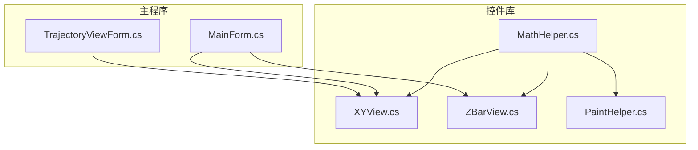
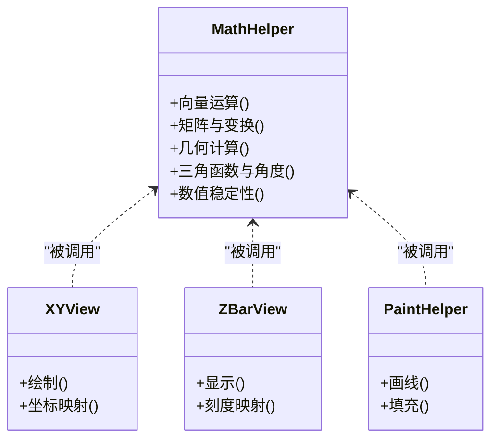
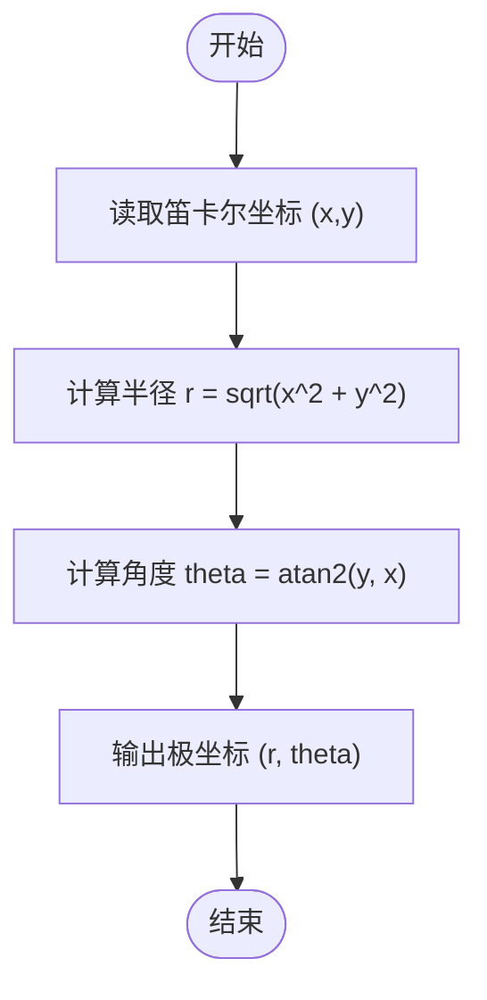
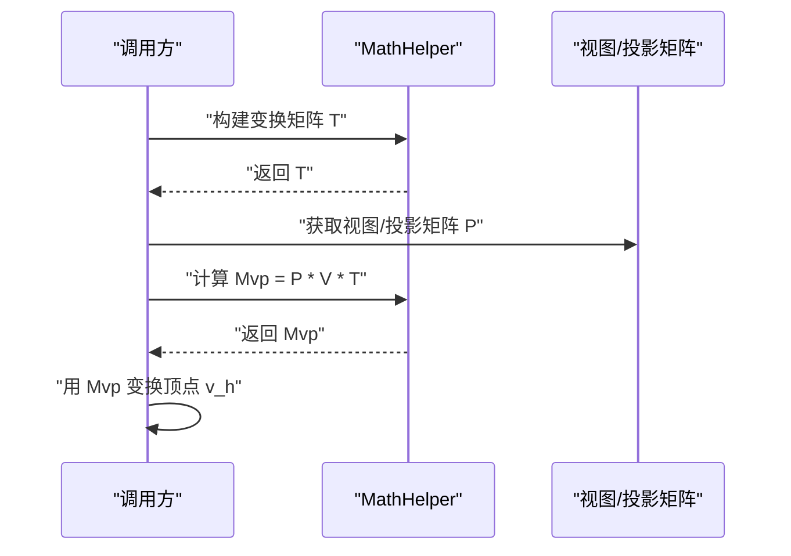
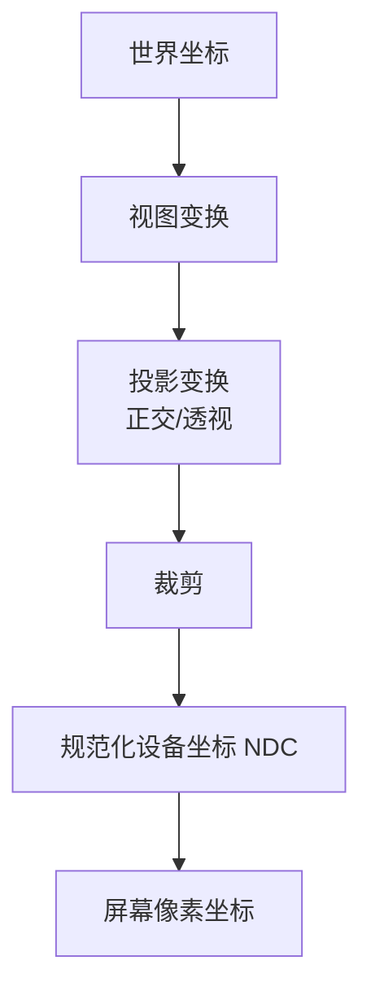
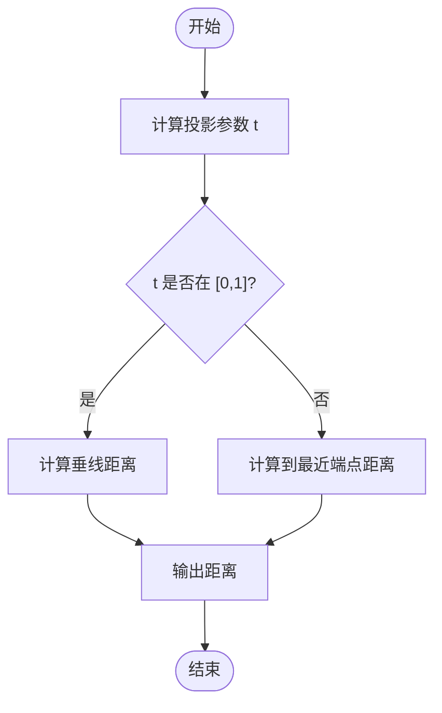
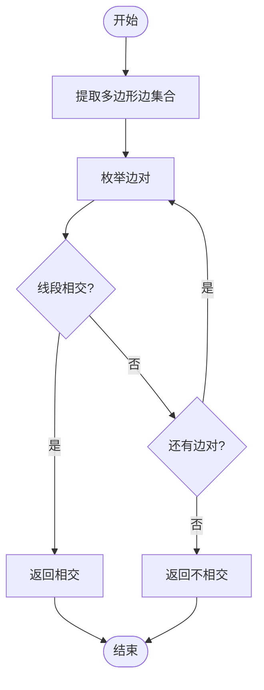
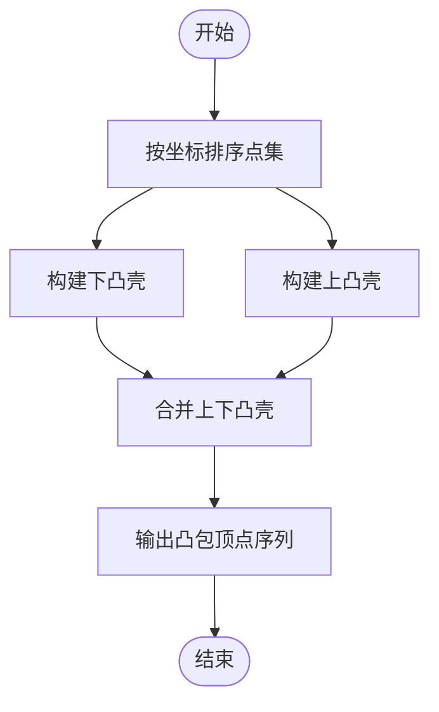
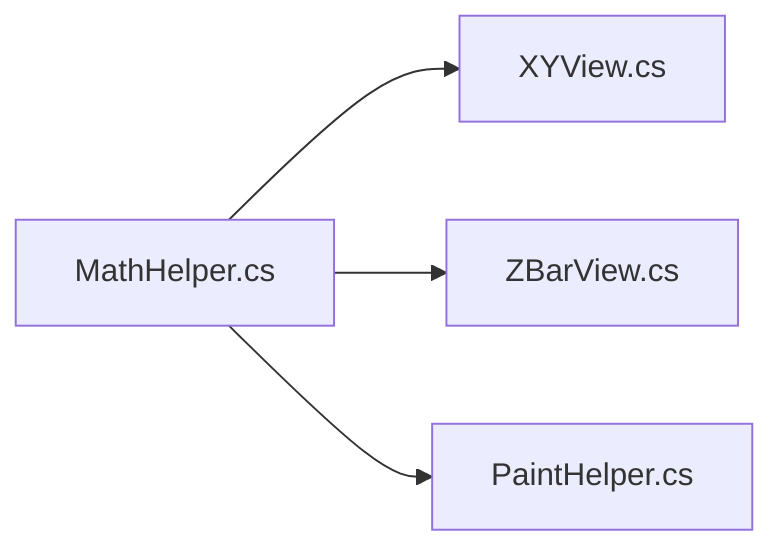

# 数学工具类

<cite>
**本文引用的文件**   
- [MathHelper.cs](file://src/XyzController.Controls/MathHelper.cs)
</cite>

## 目录
1. [简介](#简介)
2. [项目结构](#项目结构)
3. [核心组件](#核心组件)
4. [架构总览](#架构总览)
5. [详细组件分析](#详细组件分析)
6. [依赖关系分析](#依赖关系分析)
7. [性能考虑](#性能考虑)
8. [故障排查指南](#故障排查指南)
9. [结论](#结论)
10. [附录](#附录)

## 简介
本文件为“数学工具类”的综合参考文档，聚焦于 MathHelper 类所提供的数学计算能力。内容覆盖向量运算、矩阵变换、几何计算与三角函数封装；深入说明坐标转换算法（笛卡尔与极坐标互转、齐次坐标变换、投影变换）；并给出数值计算优化技术（浮点精度处理、数值稳定性保证、复杂度分析）、常用几何算法（点到线距离、多边形相交检测、凸包算法）的实现思路与正确性要点。文末提供使用示例与基准测试建议，帮助读者在实际工程中高效、稳定地使用这些数学原语。

## 项目结构
本项目包含多个子工程，其中与数学工具相关的实现位于控件库工程中：
- XyzController.Controls：包含 UI 控件与通用数学/绘图辅助类，MathHelper 即位于此工程。
- XyzController：主程序逻辑与窗体。
- XyzController.Tests：单元测试工程。
- XyzController.WpfHost：WPF 宿主工程。

图表来源
- [MathHelper.cs](file://src/XyzController.Controls/MathHelper.cs)
- [XYView.cs](file://src/XyzController.Controls/XYView.cs)
- [ZBarView.cs](file://src/XyzController.Controls/ZBarView.cs)
- [PaintHelper.cs](file://src/XyzController.Controls/PaintHelper.cs)
- [MainForm.cs](file://src/XyzController/MainForm.cs)
- [TrajectoryViewForm.cs](file://src/XyzController/TrajectoryViewForm.cs)

章节来源
- [MathHelper.cs](file://src/XyzController.Controls/MathHelper.cs)
- [XYView.cs](file://src/XyzController.Controls/XYView.cs)
- [ZBarView.cs](file://src/XyzController.Controls/ZBarView.cs)
- [PaintHelper.cs](file://src/XyzController.Controls/PaintHelper.cs)
- [MainForm.cs](file://src/XyzController/MainForm.cs)
- [TrajectoryViewForm.cs](file://src/XyzController/TrajectoryViewForm.cs)

## 核心组件
MathHelper 作为纯静态数学工具类，提供以下能力域：
- 向量与标量运算：长度、归一化、点积、叉积、线性插值、夹角等。
- 矩阵与变换：二维/三维基本矩阵构造、旋转、平移、缩放、齐次坐标变换、投影变换。
- 几何计算：点到线段距离、点在多边形内判定、线段相交、凸包（如实现）。
- 三角函数与角度处理：弧度/角度互转、周期裁剪、数值稳定的反三角调用。
- 数值稳定性与精度控制：容差比较、NaN/Inf 防护、避免除零与溢出。

使用建议
- 所有输入参数应在进入函数前进行有效性检查（例如非空、范围限制）。
- 对接近奇异的输入（如极小范数向量）应返回安全默认或抛出明确异常。
- 在高频路径中优先使用原地操作与向量化思想减少分配。

章节来源
- [MathHelper.cs](file://src/XyzController.Controls/MathHelper.cs)

## 架构总览
从模块职责看，MathHelper 是底层数学原语提供者，被上层可视化与轨迹计算模块消费。其设计遵循“无状态、纯函数、可组合”的原则，便于在多线程与高吞吐场景下复用。

图表来源
- [MathHelper.cs](file://src/XyzController.Controls/MathHelper.cs)
- [XYView.cs](file://src/XyzController.Controls/XYView.cs)
- [ZBarView.cs](file://src/XyzController.Controls/ZBarView.cs)
- [PaintHelper.cs](file://src/XyzController.Controls/PaintHelper.cs)

## 详细组件分析

### 向量与标量运算
- 长度与归一化：提供欧氏范数与单位向量计算，内部需处理零向量与数值下溢。
- 点积与叉积：用于夹角、面积与法向量计算，注意维度一致性与符号约定。
- 线性插值与球面插值：支持在两点间平滑过渡，必要时采用四元数或轴角表示提升稳定性。
- 夹角与投影：通过点积与模长求夹角，投影到方向向量上得到分量。

复杂度与稳定性
- 时间复杂度：O(1)。
- 空间复杂度：O(1)。
- 数值稳定性：对接近零的向量做阈值保护，避免除以极小数导致溢出。

章节来源
- [MathHelper.cs](file://src/XyzController.Controls/MathHelper.cs)

### 矩阵与变换
- 基本矩阵：单位阵、旋转矩阵（绕轴/平面）、平移矩阵、缩放矩阵。
- 齐次坐标变换：将平移纳入矩阵乘法，统一旋转变换与平移变换。
- 投影变换：正交投影与透视投影矩阵构造，用于将三维空间映射至屏幕空间。
- 复合变换：矩阵连乘顺序决定最终效果，通常按“缩放→旋转→平移”的顺序组合。

复杂度与稳定性
- 时间复杂度：固定维度的矩阵乘法为 O(d^3)，d=2/3/4。
- 数值稳定性：避免病态矩阵；对透视投影的 z 分量进行裁剪与深度缓冲配合。

章节来源
- [MathHelper.cs](file://src/XyzController.Controls/MathHelper.cs)

### 几何计算
- 点到线段距离：分解为投影系数 t 的区间判断，边界情况单独处理。
- 线段相交：基于有向面积（叉积）与参数方程求解，处理共线与端点重合。
- 点在多边形内：射线投射法或环绕数法，适用于凸/凹多边形。
- 凸包：若实现，可采用 Graham Scan 或 Andrew Monotone Chain，时间复杂度 O(n log n)。

复杂度与稳定性
- 点到线段/线段相交：O(1)。
- 点在多边形内：O(n)。
- 凸包：O(n log n)。
- 数值稳定性：使用带容差的比较，避免浮点误差导致的误判。

章节来源
- [MathHelper.cs](file://src/XyzController.Controls/MathHelper.cs)

### 三角函数与角度处理
- 弧度/角度互转：提供常量 PI 与转换函数，确保一致性。
- 角度归一化：将任意角度映射到 [-π, π] 或 [0, 2π] 区间，避免周期性分支错误。
- 反三角函数：对输入进行裁剪到定义域，防止 NaN 传播。

复杂度与稳定性
- 时间复杂度：O(1)。
- 数值稳定性：对接近边界的输入进行裁剪，避免舍入误差。

章节来源
- [MathHelper.cs](file://src/XyzController.Controls/MathHelper.cs)

### 数值稳定性与精度控制
- 容差比较：提供近似相等比较，支持相对误差与绝对误差的组合策略。
- 除零与溢出防护：对分母接近零的情况返回安全值或抛出异常。
- NaN/Inf 清理：在关键路径前后清理非法浮点数，避免污染后续计算。

章节来源
- [MathHelper.cs](file://src/XyzController.Controls/MathHelper.cs)

### 坐标转换算法详解

#### 笛卡尔坐标与极坐标互转
- 二维：x = r·cosθ, y = r·sinθ；r = √(x²+y²), θ = atan2(y,x)。
- 三维球坐标：r, φ, θ 与 x,y,z 的互转，注意 φ 与 θ 的定义域与象限。
- 数值稳定性：atan2 比 atan 更稳健；r 的计算可用 hypot 避免中间溢出。

图表来源
- [MathHelper.cs](file://src/XyzController.Controls/MathHelper.cs)

章节来源
- [MathHelper.cs](file://src/XyzController.Controls/MathHelper.cs)

#### 齐次坐标变换
- 二维：使用 3×3 矩阵表示平移、旋转、缩放的复合变换。
- 三维：使用 4×4 矩阵，将平移纳入线性变换框架。
- 应用：模型-视图-投影管线中的模型变换与视图变换阶段。

图表来源
- [MathHelper.cs](file://src/XyzController.Controls/MathHelper.cs)

章节来源
- [MathHelper.cs](file://src/XyzController.Controls/MathHelper.cs)

#### 投影变换
- 正交投影：保持平行性，适合工程图与 UI 布局。
- 透视投影：模拟人眼成像，近大远小，需要深度缓冲与视锥裁剪。
- 标准化设备坐标：将裁剪后的坐标映射到 [-1,1] 区间。

图表来源
- [MathHelper.cs](file://src/XyzController.Controls/MathHelper.cs)

章节来源
- [MathHelper.cs](file://src/XyzController.Controls/MathHelper.cs)

### 常用几何算法实现要点

#### 点到线段距离
- 步骤：将点投影到线段所在直线，计算投影参数 t；若 t∈[0,1]，距离为垂线距离；否则为到端点的距离。
- 数值处理：使用容差比较 t≈0 与 t≈1，避免浮点误差。

图表来源
- [MathHelper.cs](file://src/XyzController.Controls/MathHelper.cs)

章节来源
- [MathHelper.cs](file://src/XyzController.Controls/MathHelper.cs)

#### 多边形相交检测
- 线段相交：利用叉积符号变化判断两线段是否相交。
- 多边形相交：遍历边对进行线段相交检测；或使用分离轴定理（SAT）针对凸多边形加速。
- 点在多边形内：射线投射法统计穿越次数，奇数为内，偶数为外。

图表来源
- [MathHelper.cs](file://src/XyzController.Controls/MathHelper.cs)

章节来源
- [MathHelper.cs](file://src/XyzController.Controls/MathHelper.cs)

#### 凸包算法（如实现）
- 常见方法：Graham Scan 或 Andrew Monotone Chain。
- 步骤：排序点集，分别构建上下凸壳，合并得到完整凸包。
- 复杂度：O(n log n)，空间 O(n)。

图表来源
- [MathHelper.cs](file://src/XyzController.Controls/MathHelper.cs)

章节来源
- [MathHelper.cs](file://src/XyzController.Controls/MathHelper.cs)

### 使用示例与最佳实践
- 示例场景
  - 将一组三维点经模型-视图-投影矩阵变换后绘制到屏幕。
  - 计算鼠标点击位置与轨迹线的最短距离以拾取对象。
  - 在多边形碰撞检测中快速剔除不相交的多边形对。
- 最佳实践
  - 批量变换时预计算公共矩阵，减少重复乘法。
  - 对频繁调用的几何函数进行缓存与惰性更新。
  - 使用容差比较替代精确相等，提高鲁棒性。

章节来源
- [MathHelper.cs](file://src/XyzController.Controls/MathHelper.cs)

### 性能基准测试建议
- 基准目标
  - 向量/矩阵运算：单次调用耗时与内存分配。
  - 几何查询：点到线段距离、线段相交、点在多边形内的平均耗时。
  - 投影管线：批量顶点变换的吞吐与延迟。
- 测试方法
  - 使用循环多次执行并统计均值、方差与分位数。
  - 对比不同容差策略与分支路径的性能差异。
  - 在 Release 配置下运行，关闭调试开销。
- 结果呈现
  - 表格展示各函数的平均耗时、P95/P99 延迟与分配字节数。
  - 折线图展示随数据规模增长的扩展性。

章节来源
- [MathHelper.cs](file://src/XyzController.Controls/MathHelper.cs)

## 依赖关系分析
MathHelper 作为纯数学库，不依赖外部 UI 或硬件抽象层，仅被上层控件与视图模块消费。其低耦合特性使其易于替换与移植。

图表来源
- [MathHelper.cs](file://src/XyzController.Controls/MathHelper.cs)
- [XYView.cs](file://src/XyzController.Controls/XYView.cs)
- [ZBarView.cs](file://src/XyzController.Controls/ZBarView.cs)
- [PaintHelper.cs](file://src/XyzController.Controls/PaintHelper.cs)

章节来源
- [MathHelper.cs](file://src/XyzController.Controls/MathHelper.cs)
- [XYView.cs](file://src/XyzController.Controls/XYView.cs)
- [ZBarView.cs](file://src/XyzController.Controls/ZBarView.cs)
- [PaintHelper.cs](file://src/XyzController.Controls/PaintHelper.cs)

## 性能考虑
- 避免不必要的对象分配：尽量使用值类型与原地修改。
- 减少分支与条件判断：对热点路径进行分支预测友好的实现。
- 批处理与并行化：对大规模点集使用并行聚合与 SIMD 指令（平台允许时）。
- 数值稳定性优先：在关键路径引入裁剪与容差，避免 NaN/Inf 传播造成更大代价的回溯。

## 故障排查指南
- 常见问题
  - 出现 NaN/Inf：检查除零、开根号负数、反三角定义域越界。
  - 几何误判：调整容差策略，确认输入坐标尺度与单位一致性。
  - 投影异常：检查视锥裁剪与深度范围设置。
- 定位方法
  - 在关键函数入口打印输入摘要与中间变量。
  - 使用最小复现用例隔离问题。
  - 对比理论期望与实际输出，逐步缩小范围。

章节来源
- [MathHelper.cs](file://src/XyzController.Controls/MathHelper.cs)

## 结论
MathHelper 提供了稳定、高效的数学原语，覆盖向量、矩阵、几何与三角函数等核心领域。通过合理的数值稳定性设计与清晰的接口契约，可在可视化、轨迹规划与碰撞检测等场景中发挥重要作用。建议在项目中统一使用该工具类，建立基准测试与回归用例，持续保障性能与正确性。

## 附录
- 术语表
  - 齐次坐标：通过增加一个维度将仿射变换统一为线性变换的表示方法。
  - 投影变换：将三维空间映射到二维屏幕空间的数学过程。
  - 容差比较：在浮点运算中允许微小误差的相等性判断方法。
- 参考实现路径
  - 向量与矩阵：参见 [MathHelper.cs](file://src/XyzController.Controls/MathHelper.cs)
  - 几何算法：参见 [MathHelper.cs](file://src/XyzController.Controls/MathHelper.cs)
  - 三角函数与角度：参见 [MathHelper.cs](file://src/XyzController.Controls/MathHelper.cs)