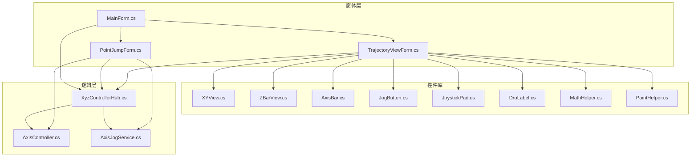
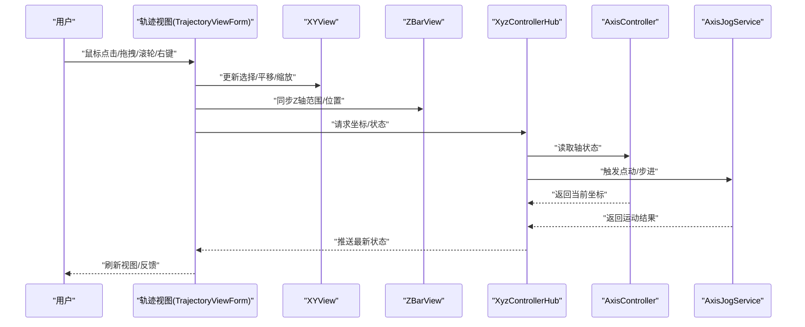
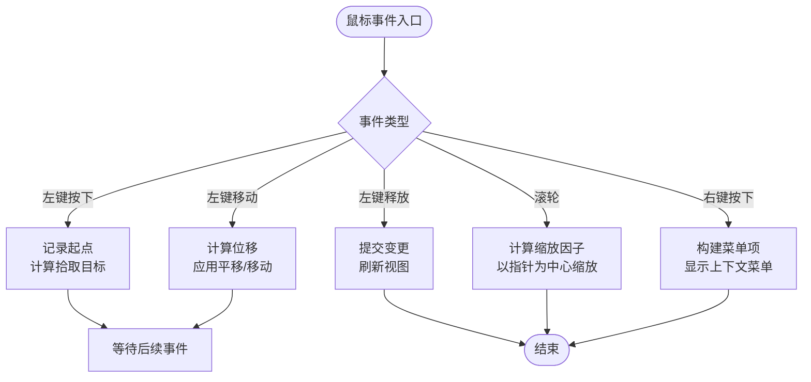
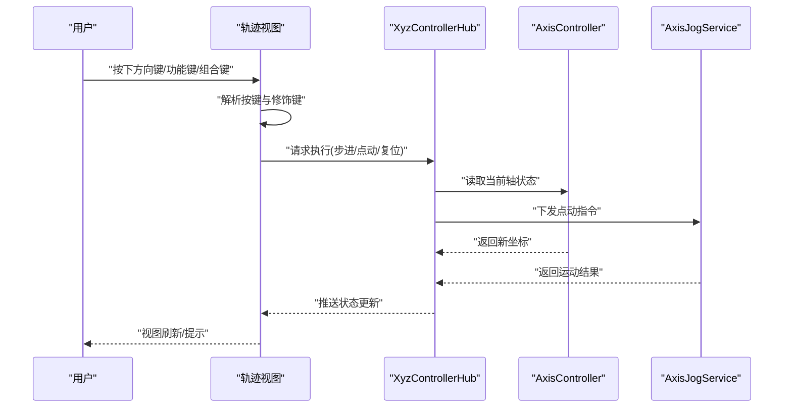
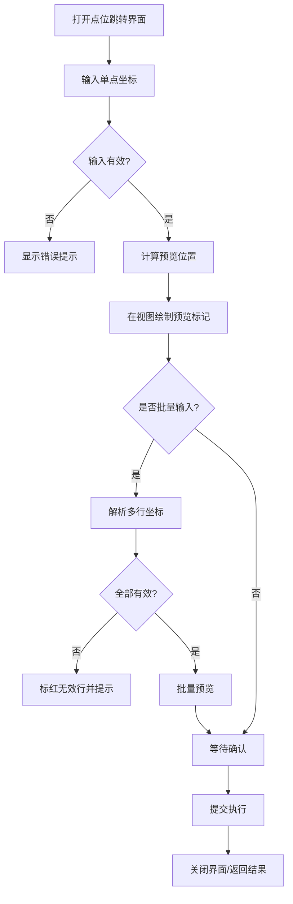
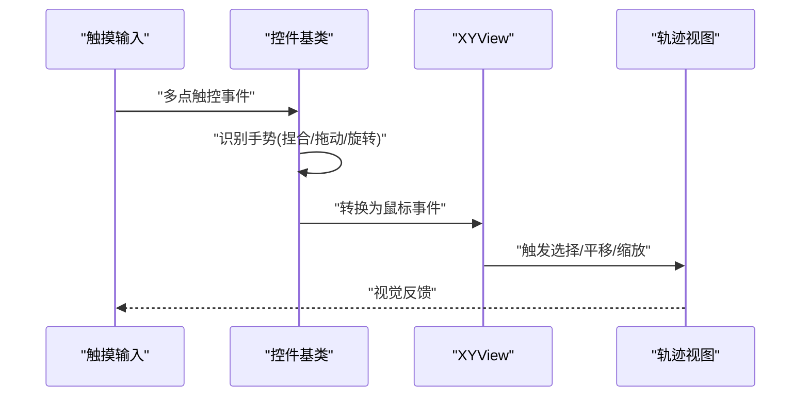
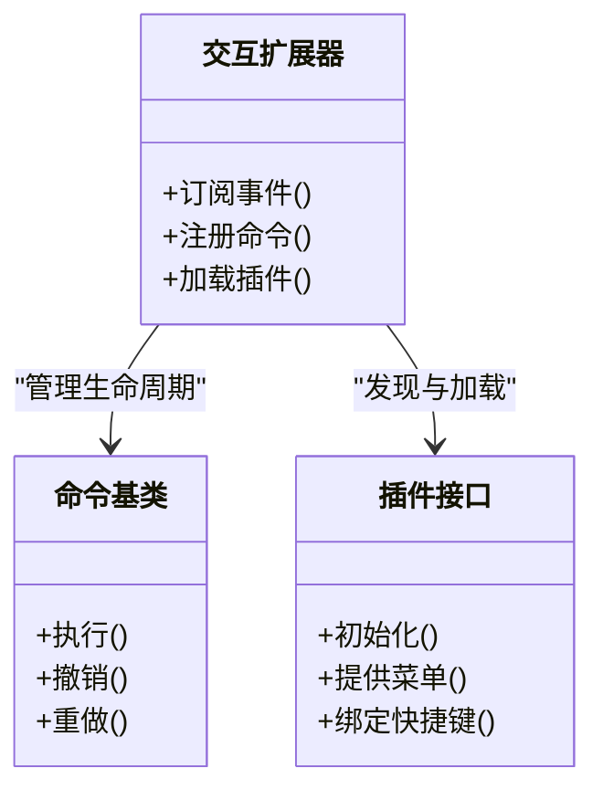
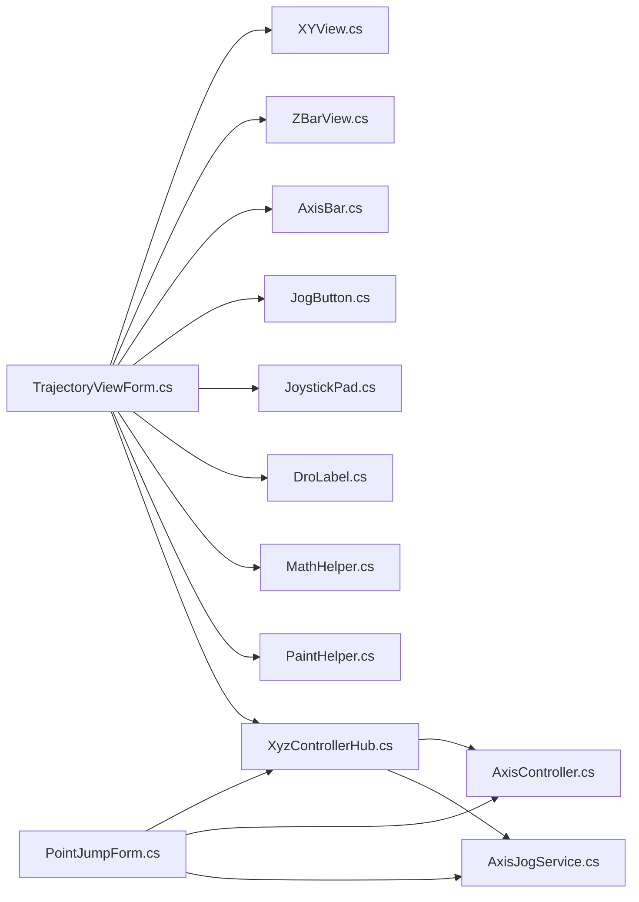

# 用户交互功能

<cite>
**本文引用的文件**   
- [TrajectoryViewForm.cs](file://src/XyzController/TrajectoryViewForm.cs)
- [PointJumpForm.cs](file://src/XyzController/PointJumpForm.cs)
- [XYView.cs](file://src/XyzController.Controls/XYView.cs)
- [ZBarView.cs](file://src/XyzController.Controls/ZBarView.cs)
- [AxisBar.cs](file://src/XyzController.Controls/AxisBar.cs)
- [JogButton.cs](file://src/XyzController.Controls/JogButton.cs)
- [JoystickPad.cs](file://src/XyzController.Controls/JoystickPad.cs)
- [DroLabel.cs](file://src/XyzController.Controls/DroLabel.cs)
- [MathHelper.cs](file://src/XyzController.Controls/MathHelper.cs)
- [PaintHelper.cs](file://src/XyzController.Controls/PaintHelper.cs)
- [MainForm.cs](file://src/XyzController/MainForm.cs)
- [XyzControllerHub.cs](file://src/XyzController/Logic/XyzControllerHub.cs)
- [AxisController.cs](file://src/XyzController/Logic/AxisController.cs)
- [AxisJogService.cs](file://src/XyzController/Logic/AxisJogService.cs)
</cite>

## 目录
1. [简介](#简介)
2. [项目结构](#项目结构)
3. [核心组件](#核心组件)
4. [架构总览](#架构总览)
5. [详细组件分析](#详细组件分析)
6. [依赖关系分析](#依赖关系分析)
7. [性能考虑](#性能考虑)
8. [故障排查指南](#故障排查指南)
9. [结论](#结论)
10. [附录](#附录)

## 简介
本章节聚焦于用户交互子系统，覆盖轨迹视图中的鼠标事件处理（点击选择、拖拽移动、滚轮缩放、右键菜单）、键盘快捷键支持（方向键控制、功能键绑定、组合键处理）、点位跳转界面 PointJumpForm 的交互逻辑（输入验证、实时预览、批量操作），以及手势识别与触摸支持、扩展机制（事件订阅、命令模式、插件化交互组件）和用户体验优化与可访问性建议。

## 项目结构
交互相关代码主要分布在以下模块：
- 窗体层：轨迹视图窗体、点位跳转窗体、主窗体
- 控件库：二维视图、Z轴条视图、轴条、点动按钮、摇杆、DRO显示等
- 逻辑层：控制器中枢、轴控制、点动服务

图表来源
- [TrajectoryViewForm.cs](file://src/XyzController/TrajectoryViewForm.cs)
- [PointJumpForm.cs](file://src/XyzController/PointJumpForm.cs)
- [XYView.cs](file://src/XyzController.Controls/XYView.cs)
- [ZBarView.cs](file://src/XyzController.Controls/ZBarView.cs)
- [AxisBar.cs](file://src/XyzController.Controls/AxisBar.cs)
- [JogButton.cs](file://src/XyzController.Controls/JogButton.cs)
- [JoystickPad.cs](file://src/XyzController.Controls/JoystickPad.cs)
- [DroLabel.cs](file://src/XyzController.Controls/DroLabel.cs)
- [MathHelper.cs](file://src/XyzController.Controls/MathHelper.cs)
- [PaintHelper.cs](file://src/XyzController.Controls/PaintHelper.cs)
- [MainForm.cs](file://src/XyzController/MainForm.cs)
- [XyzControllerHub.cs](file://src/XyzController/Logic/XyzControllerHub.cs)
- [AxisController.cs](file://src/XyzController/Logic/AxisController.cs)
- [AxisJogService.cs](file://src/XyzController/Logic/AxisJogService.cs)

章节来源
- [TrajectoryViewForm.cs](file://src/XyzController/TrajectoryViewForm.cs)
- [PointJumpForm.cs](file://src/XyzController/PointJumpForm.cs)
- [XYView.cs](file://src/XyzController.Controls/XYView.cs)
- [ZBarView.cs](file://src/XyzController.Controls/ZBarView.cs)
- [AxisBar.cs](file://src/XyzController.Controls/AxisBar.cs)
- [JogButton.cs](file://src/XyzController.Controls/JogButton.cs)
- [JoystickPad.cs](file://src/XyzController.Controls/JoystickPad.cs)
- [DroLabel.cs](file://src/XyzController.Controls/DroLabel.cs)
- [MathHelper.cs](file://src/XyzController.Controls/MathHelper.cs)
- [PaintHelper.cs](file://src/XyzController.Controls/PaintHelper.cs)
- [MainForm.cs](file://src/XyzController/MainForm.cs)
- [XyzControllerHub.cs](file://src/XyzController/Logic/XyzControllerHub.cs)
- [AxisController.cs](file://src/XyzController/Logic/AxisController.cs)
- [AxisJogService.cs](file://src/XyzController/Logic/AxisJogService.cs)

## 核心组件
- 轨迹视图 TrajectoryViewForm：承载鼠标交互（选择、拖拽、缩放、右键菜单）、键盘快捷键（方向键、功能键、组合键）与视图渲染联动。
- 点位跳转 PointJumpForm：提供点位输入、校验、预览与批量操作，驱动控制器执行跳转。
- XYView/ZBarView/AxisBar/JogButton/JoystickPad/DroLabel：提供基础交互与可视化能力，支撑上层窗体的交互实现。
- XyzControllerHub/AxisController/AxisJogService：封装设备控制与点动逻辑，供交互层调用。

章节来源
- [TrajectoryViewForm.cs](file://src/XyzController/TrajectoryViewForm.cs)
- [PointJumpForm.cs](file://src/XyzController/PointJumpForm.cs)
- [XYView.cs](file://src/XyzController.Controls/XYView.cs)
- [ZBarView.cs](file://src/XyzController.Controls/ZBarView.cs)
- [AxisBar.cs](file://src/XyzController.Controls/AxisBar.cs)
- [JogButton.cs](file://src/XyzController.Controls/JogButton.cs)
- [JoystickPad.cs](file://src/XyzController.Controls/JoystickPad.cs)
- [DroLabel.cs](file://src/XyzController.Controls/DroLabel.cs)
- [XyzControllerHub.cs](file://src/XyzController/Logic/XyzControllerHub.cs)
- [AxisController.cs](file://src/XyzController/Logic/AxisController.cs)
- [AxisJogService.cs](file://src/XyzController/Logic/AxisJogService.cs)

## 架构总览
交互系统采用“窗体-控件-逻辑”分层：
- 窗体负责编排交互流程与状态管理
- 控件负责具体输入捕获与绘制
- 逻辑层负责设备控制与业务规则

图表来源
- [TrajectoryViewForm.cs](file://src/XyzController/TrajectoryViewForm.cs)
- [XYView.cs](file://src/XyzController.Controls/XYView.cs)
- [ZBarView.cs](file://src/XyzController.Controls/ZBarView.cs)
- [XyzControllerHub.cs](file://src/XyzController/Logic/XyzControllerHub.cs)
- [AxisController.cs](file://src/XyzController/Logic/AxisController.cs)
- [AxisJogService.cs](file://src/XyzController/Logic/AxisJogService.cs)

## 详细组件分析

### 轨迹视图鼠标事件处理
- 点击选择：在 XYView 上拾取最近图元或网格点，更新选中状态并高亮；若启用吸附则对齐到网格。
- 拖拽移动：记录起始指针位置与偏移量，按增量更新视图平移或对象位置；根据 Shift/Ctrl 修饰键切换约束轴向或吸附行为。
- 滚轮缩放：以指针为中心进行视口缩放，限制最小/最大缩放比，避免过度放大导致精度丢失。
- 右键菜单：弹出上下文菜单，提供常用操作（如复制坐标、设置参考点、清空选择、显示/隐藏图层等）。

图表来源
- [TrajectoryViewForm.cs](file://src/XyzController/TrajectoryViewForm.cs)
- [XYView.cs](file://src/XyzController.Controls/XYView.cs)
- [ZBarView.cs](file://src/XyzController.Controls/ZBarView.cs)

章节来源
- [TrajectoryViewForm.cs](file://src/XyzController/TrajectoryViewForm.cs)
- [XYView.cs](file://src/XyzController.Controls/XYView.cs)
- [ZBarView.cs](file://src/XyzController.Controls/ZBarView.cs)

### 键盘快捷键支持
- 方向键控制：上下左右对应各轴微动，按住 Shift 加速，按住 Ctrl 减速；结合功能键可实现多轴联动。
- 功能键绑定：F1-F12 映射常用动作（如 F5 刷新、F9 复位、F10 锁定视角等），可在配置中自定义。
- 组合键处理：Ctrl+方向键为步进微调，Alt+方向键为连续点动，Esc 取消当前操作，Enter 确认输入。

图表来源
- [TrajectoryViewForm.cs](file://src/XyzController/TrajectoryViewForm.cs)
- [XyzControllerHub.cs](file://src/XyzController/Logic/XyzControllerHub.cs)
- [AxisController.cs](file://src/XyzController/Logic/AxisController.cs)
- [AxisJogService.cs](file://src/XyzController/Logic/AxisJogService.cs)

章节来源
- [TrajectoryViewForm.cs](file://src/XyzController/TrajectoryViewForm.cs)
- [XyzControllerHub.cs](file://src/XyzController/Logic/XyzControllerHub.cs)
- [AxisController.cs](file://src/XyzController/Logic/AxisController.cs)
- [AxisJogService.cs](file://src/XyzController/Logic/AxisJogService.cs)

### 点位跳转界面 PointJumpForm 交互逻辑
- 输入验证：对 X/Y/Z 输入框进行格式与范围校验，非法值即时提示并阻止提交。
- 实时预览：输入变化时计算目标位置并在 XYView 上绘制预览标记，支持吸附与网格对齐。
- 批量操作：支持从文本区域粘贴多点坐标，逐条解析、校验与预览，确认后批量执行跳转。

图表来源
- [PointJumpForm.cs](file://src/XyzController/PointJumpForm.cs)
- [TrajectoryViewForm.cs](file://src/XyzController/TrajectoryViewForm.cs)
- [XYView.cs](file://src/XyzController.Controls/XYView.cs)

章节来源
- [PointJumpForm.cs](file://src/XyzController/PointJumpForm.cs)
- [TrajectoryViewForm.cs](file://src/XyzController/TrajectoryViewForm.cs)
- [XYView.cs](file://src/XyzController.Controls/XYView.cs)

### 手势识别与触摸支持
- 多点触控：双指捏合缩放、双指拖动平移、三指旋转（如需要）可通过底层控件的事件转发至视图层处理。
- 移动端适配：在大屏与小屏设备上自适应布局，调整控件尺寸与触控热区，确保易用性。
- 事件桥接：将触摸事件转换为等效的鼠标事件，复用现有交互逻辑，降低维护成本。

图表来源
- [XYView.cs](file://src/XyzController.Controls/XYView.cs)
- [TrajectoryViewForm.cs](file://src/XyzController/TrajectoryViewForm.cs)

章节来源
- [XYView.cs](file://src/XyzController.Controls/XYView.cs)
- [TrajectoryViewForm.cs](file://src/XyzController/TrajectoryViewForm.cs)

### 自定义交互行为的扩展方法
- 事件订阅：通过公开事件总线或回调接口订阅鼠标/键盘/触摸事件，实现解耦的交互扩展。
- 命令模式：将交互动作封装为命令对象，支持撤销/重做、队列执行与条件触发。
- 插件化交互组件：定义统一接口，允许外部插件注入新的视图元素、菜单项与快捷键绑定。

图表来源
- [TrajectoryViewForm.cs](file://src/XyzController/TrajectoryViewForm.cs)
- [XyzControllerHub.cs](file://src/XyzController/Logic/XyzControllerHub.cs)

章节来源
- [TrajectoryViewForm.cs](file://src/XyzController/TrajectoryViewForm.cs)
- [XyzControllerHub.cs](file://src/XyzController/Logic/XyzControllerHub.cs)

### 用户体验优化与可访问性
- 响应式反馈：对关键操作提供即时视觉与听觉反馈，减少误操作焦虑。
- 容错设计：输入校验失败时给出明确修正建议，保留上次有效状态。
- 可访问性：为控件添加语义标签、键盘导航顺序、屏幕阅读器支持，确保不同能力用户均可使用。

[本节为通用指导，不直接分析具体文件]

## 依赖关系分析
交互层对控件库与逻辑层的依赖如下：

图表来源
- [TrajectoryViewForm.cs](file://src/XyzController/TrajectoryViewForm.cs)
- [PointJumpForm.cs](file://src/XyzController/PointJumpForm.cs)
- [XYView.cs](file://src/XyzController.Controls/XYView.cs)
- [ZBarView.cs](file://src/XyzController.Controls/ZBarView.cs)
- [AxisBar.cs](file://src/XyzController.Controls/AxisBar.cs)
- [JogButton.cs](file://src/XyzController.Controls/JogButton.cs)
- [JoystickPad.cs](file://src/XyzController.Controls/JoystickPad.cs)
- [DroLabel.cs](file://src/XyzController.Controls/DroLabel.cs)
- [MathHelper.cs](file://src/XyzController.Controls/MathHelper.cs)
- [PaintHelper.cs](file://src/XyzController.Controls/PaintHelper.cs)
- [XyzControllerHub.cs](file://src/XyzController/Logic/XyzControllerHub.cs)
- [AxisController.cs](file://src/XyzController/Logic/AxisController.cs)
- [AxisJogService.cs](file://src/XyzController/Logic/AxisJogService.cs)

章节来源
- [TrajectoryViewForm.cs](file://src/XyzController/TrajectoryViewForm.cs)
- [PointJumpForm.cs](file://src/XyzController/PointJumpForm.cs)
- [XYView.cs](file://src/XyzController.Controls/XYView.cs)
- [ZBarView.cs](file://src/XyzController.Controls/ZBarView.cs)
- [AxisBar.cs](file://src/XyzController.Controls/AxisBar.cs)
- [JogButton.cs](file://src/XyzController.Controls/JogButton.cs)
- [JoystickPad.cs](file://src/XyzController.Controls/JoystickPad.cs)
- [DroLabel.cs](file://src/XyzController.Controls/DroLabel.cs)
- [MathHelper.cs](file://src/XyzController.Controls/MathHelper.cs)
- [PaintHelper.cs](file://src/XyzController.Controls/PaintHelper.cs)
- [XyzControllerHub.cs](file://src/XyzController/Logic/XyzControllerHub.cs)
- [AxisController.cs](file://src/XyzController/Logic/AxisController.cs)
- [AxisJogService.cs](file://src/XyzController/Logic/AxisJogService.cs)

## 性能考虑
- 事件节流：高频鼠标/触摸事件应进行节流与合并，避免频繁重绘。
- 增量更新：仅重绘受影响区域，利用脏矩形策略提升渲染效率。
- 数据缓存：对轴状态与历史轨迹进行缓存，减少重复查询。
- 异步处理：长耗时操作（如批量跳转）应在后台线程执行，避免阻塞 UI。

[本节为通用指导，不直接分析具体文件]

## 故障排查指南
- 鼠标无响应：检查控件是否被遮挡、事件是否被拦截、焦点是否正确。
- 快捷键冲突：确认全局快捷键未与其他应用冲突，必要时重新绑定。
- 输入校验失败：核对输入格式、单位与范围，查看错误提示定位问题。
- 批量操作异常：逐行检查坐标有效性，关注边界条件与空行处理。

章节来源
- [TrajectoryViewForm.cs](file://src/XyzController/TrajectoryViewForm.cs)
- [PointJumpForm.cs](file://src/XyzController/PointJumpForm.cs)

## 结论
本交互子系统通过清晰的层次划分与可扩展的设计，实现了丰富的鼠标、键盘与触摸交互能力。借助事件订阅、命令模式与插件化机制，开发者可以灵活定制交互行为，同时兼顾性能与可访问性，为用户提供高效、稳定且友好的操作体验。

## 附录
- 术语表
  - 拾取：在视图中选择图元或点的过程
  - 吸附：将目标位置对齐到网格或参考线
  - 点动：按固定步长或速度移动轴
- 最佳实践
  - 保持交互一致性与可预测性
  - 提供明确的反馈与撤销能力
  - 优先保证键盘可达性与无障碍支持

[本节为通用指导，不直接分析具体文件]