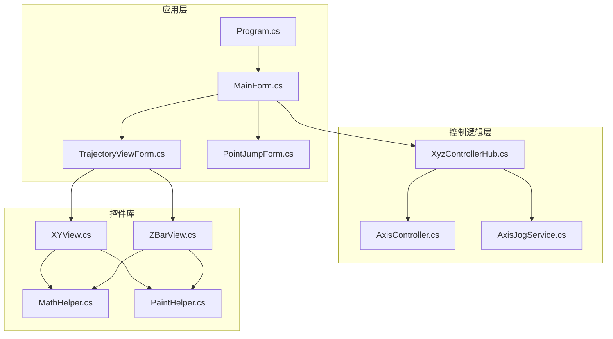
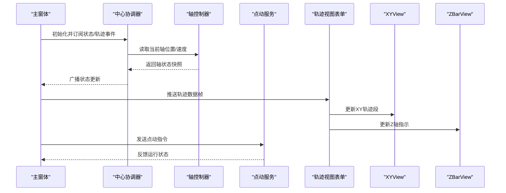
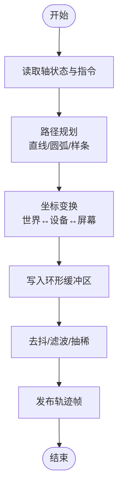
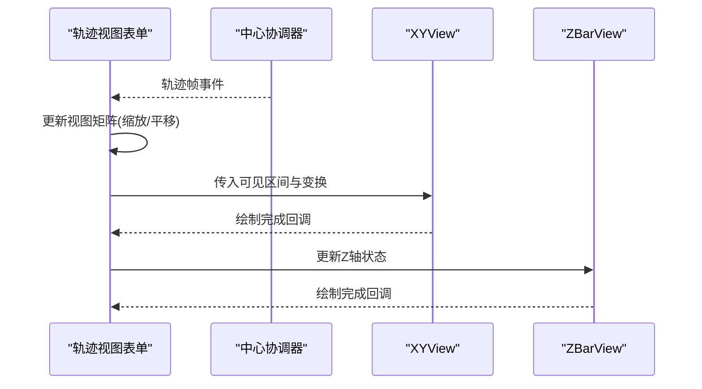
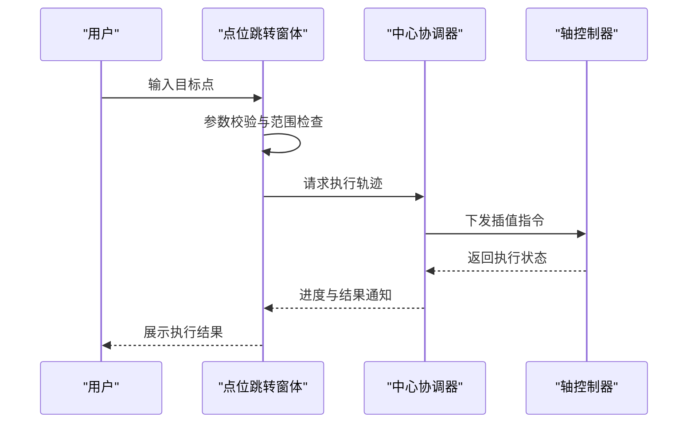
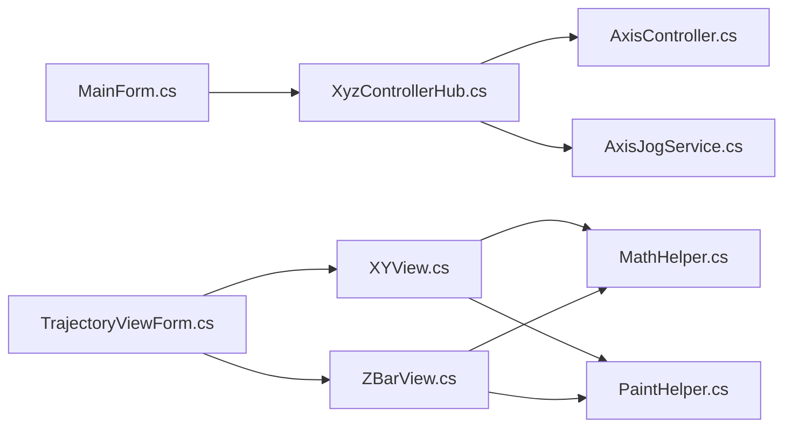

# 轨迹可视化系统

<cite>
**本文引用的文件**   
- [MainForm.cs](file://src/XyzController/MainForm.cs)
- [TrajectoryViewForm.cs](file://src/XyzController/TrajectoryViewForm.cs)
- [PointJumpForm.cs](file://src/XyzController/PointJumpForm.cs)
- [MathHelper.cs](file://src/XyzController.Controls/MathHelper.cs)
- [PaintHelper.cs](file://src/XyzController.Controls/PaintHelper.cs)
- [XYView.cs](file://src/XyzController.Controls/XYView.cs)
- [ZBarView.cs](file://src/XyzController.Controls/ZBarView.cs)
- [AxisController.cs](file://src/XyzController/Logic/AxisController.cs)
- [AxisJogService.cs](file://src/XyzController/Logic/AxisJogService.cs)
- [XyzControllerHub.cs](file://src/XyzController/Logic/XyzControllerHub.cs)
- [Program.cs](file://src/XyzController/Program.cs)
</cite>

## 目录
1. [简介](#简介)
2. [项目结构](#项目结构)
3. [核心组件](#核心组件)
4. [架构总览](#架构总览)
5. [详细组件分析](#详细组件分析)
6. [依赖关系分析](#依赖关系分析)
7. [性能考虑](#性能考虑)
8. [故障排查指南](#故障排查指南)
9. [结论](#结论)
10. [附录](#附录)

## 简介
本文件面向XyzController轨迹可视化系统的开发者与使用者，系统性阐述轨迹计算引擎、轨迹视图表单渲染机制、点位跳转功能以及数学与绘图工具类的实现原理与使用方式。文档覆盖路径规划算法、坐标变换、实时数据处理、图形绘制优化、缩放平移交互、数据格式规范、性能调优技巧与自定义可视化效果扩展方法，并提供实际使用示例与常见问题解决方案。

## 项目结构
系统采用分层与模块化组织：
- 应用层（WinForms）：主窗体、轨迹视图表单、点位跳转窗体、程序入口
- 控制逻辑层：轴控制器、点动服务、中心协调器
- 控件库：通用绘图与交互控件、数学与绘图辅助类
- WPF宿主与测试工程：用于集成与验证

图示来源
- [Program.cs](file://src/XyzController/Program.cs)
- [MainForm.cs](file://src/XyzController/MainForm.cs)
- [TrajectoryViewForm.cs](file://src/XyzController/TrajectoryViewForm.cs)
- [PointJumpForm.cs](file://src/XyzController/PointJumpForm.cs)
- [XyzControllerHub.cs](file://src/XyzController/Logic/XyzControllerHub.cs)
- [AxisController.cs](file://src/XyzController/Logic/AxisController.cs)
- [AxisJogService.cs](file://src/XyzController/Logic/AxisJogService.cs)
- [XYView.cs](file://src/XyzController.Controls/XYView.cs)
- [ZBarView.cs](file://src/XyzController.Controls/ZBarView.cs)
- [MathHelper.cs](file://src/XyzController.Controls/MathHelper.cs)
- [PaintHelper.cs](file://src/XyzController.Controls/PaintHelper.cs)

章节来源
- [Program.cs](file://src/XyzController/Program.cs)
- [MainForm.cs](file://src/XyzController/MainForm.cs)
- [TrajectoryViewForm.cs](file://src/XyzController/TrajectoryViewForm.cs)
- [PointJumpForm.cs](file://src/XyzController/PointJumpForm.cs)
- [XyzControllerHub.cs](file://src/XyzController/Logic/XyzControllerHub.cs)
- [AxisController.cs](file://src/XyzController/Logic/AxisController.cs)
- [AxisJogService.cs](file://src/XyzController/Logic/AxisJogService.cs)
- [XYView.cs](file://src/XyzController.Controls/XYView.cs)
- [ZBarView.cs](file://src/XyzController.Controls/ZBarView.cs)
- [MathHelper.cs](file://src/XyzController.Controls/MathHelper.cs)
- [PaintHelper.cs](file://src/XyzController.Controls/PaintHelper.cs)

## 核心组件
- 轨迹计算引擎
  - 负责路径规划、坐标变换与实时轨迹数据的采集、缓存与分发。
  - 通过中心协调器统一接入轴控制器与点动服务，提供稳定的数据源接口。
- 轨迹视图表单
  - 基于XYView与ZBarView进行二维平面与Z轴状态的可视化渲染。
  - 支持缩放、平移、轨迹回放、断线重连与增量更新。
- 点位跳转功能
  - 提供目标点输入、校验、插值与执行流程，确保运动安全与可追溯。
- 数学与绘图工具
  - MathHelper提供常用几何与数值运算；PaintHelper封装GDI+高效绘制原语。

章节来源
- [XyzControllerHub.cs](file://src/XyzController/Logic/XyzControllerHub.cs)
- [AxisController.cs](file://src/XyzController/Logic/AxisController.cs)
- [AxisJogService.cs](file://src/XyzController/Logic/AxisJogService.cs)
- [TrajectoryViewForm.cs](file://src/XyzController/TrajectoryViewForm.cs)
- [XYView.cs](file://src/XyzController.Controls/XYView.cs)
- [ZBarView.cs](file://src/XyzController.Controls/ZBarView.cs)
- [MathHelper.cs](file://src/XyzController.Controls/MathHelper.cs)
- [PaintHelper.cs](file://src/XyzController.Controls/PaintHelper.cs)

## 架构总览
系统以“控制-视图”解耦为核心思想：控制层暴露稳定接口，视图层专注渲染与交互。中心协调器作为总线，聚合轴状态、指令与事件，供各表单与控件订阅消费。

图示来源
- [MainForm.cs](file://src/XyzController/MainForm.cs)
- [XyzControllerHub.cs](file://src/XyzController/Logic/XyzControllerHub.cs)
- [AxisController.cs](file://src/XyzController/Logic/AxisController.cs)
- [AxisJogService.cs](file://src/XyzController/Logic/AxisJogService.cs)
- [TrajectoryViewForm.cs](file://src/XyzController/TrajectoryViewForm.cs)
- [XYView.cs](file://src/XyzController.Controls/XYView.cs)
- [ZBarView.cs](file://src/XyzController.Controls/ZBarView.cs)

## 详细组件分析

### 轨迹计算引擎
职责与要点
- 路径规划算法
  - 支持直线、圆弧与样条插值；在关节空间与笛卡尔空间之间进行转换。
  - 对多轴联动进行同步与加减速曲线规划，保证平滑性与约束满足。
- 坐标变换
  - 提供世界坐标系、设备坐标系与屏幕像素坐标的互转。
  - 处理零点偏移、比例因子与单位换算，确保显示与实际一致。
- 实时数据处理
  - 环形缓冲区存储历史轨迹点，按时间戳排序去抖。
  - 增量更新策略减少重复计算，结合双缓冲降低闪烁。

关键流程

图示来源
- [XyzControllerHub.cs](file://src/XyzController/Logic/XyzControllerHub.cs)
- [AxisController.cs](file://src/XyzController/Logic/AxisController.cs)
- [AxisJogService.cs](file://src/XyzController/Logic/AxisJogService.cs)

章节来源
- [XyzControllerHub.cs](file://src/XyzController/Logic/XyzControllerHub.cs)
- [AxisController.cs](file://src/XyzController/Logic/AxisController.cs)
- [AxisJogService.cs](file://src/XyzController/Logic/AxisJogService.cs)

### 轨迹视图表单渲染机制（TrajectoryViewForm）
渲染管线
- 数据驱动：从中心协调器订阅轨迹帧，维护可见窗口内的轨迹片段。
- 视图映射：将设备坐标映射到屏幕像素，依据缩放与平移参数计算变换矩阵。
- 增量绘制：仅重绘变化区域，使用双缓冲与裁剪矩形提升性能。
- 交互处理：鼠标滚轮缩放、拖拽平移、右键菜单与快捷键。

交互时序

图示来源
- [TrajectoryViewForm.cs](file://src/XyzController/TrajectoryViewForm.cs)
- [XYView.cs](file://src/XyzController.Controls/XYView.cs)
- [ZBarView.cs](file://src/XyzController.Controls/ZBarView.cs)

章节来源
- [TrajectoryViewForm.cs](file://src/XyzController/TrajectoryViewForm.cs)
- [XYView.cs](file://src/XyzController.Controls/XYView.cs)
- [ZBarView.cs](file://src/XyzController.Controls/ZBarView.cs)

### 点位跳转功能（PointJumpForm）
功能概述
- 用户输入目标点（X/Y/Z），系统进行边界与碰撞预检。
- 生成点到点的插值轨迹，支持速度与加速度限制。
- 执行前二次确认，执行中提供取消与急停。

执行序列

图示来源
- [PointJumpForm.cs](file://src/XyzController/PointJumpForm.cs)
- [XyzControllerHub.cs](file://src/XyzController/Logic/XyzControllerHub.cs)
- [AxisController.cs](file://src/XyzController/Logic/AxisController.cs)

章节来源
- [PointJumpForm.cs](file://src/XyzController/PointJumpForm.cs)
- [XyzControllerHub.cs](file://src/XyzController/Logic/XyzControllerHub.cs)
- [AxisController.cs](file://src/XyzController/Logic/AxisController.cs)

### 数学工具类（MathHelper）
能力清单
- 几何运算：距离、角度、投影、线段相交、包围盒计算。
- 数值方法：线性/三次样条插值、滤波（移动平均、低通）、采样率转换。
- 坐标变换：齐次变换矩阵、旋转与平移组合、尺度与偏移校正。
- 随机与噪声：高斯噪声、抖动序列，用于仿真与鲁棒性测试。

典型用法
- 在轨迹生成阶段进行插值与平滑。
- 在坐标变换阶段进行单位与零点校正。
- 在预处理阶段进行去噪与抽稀。

章节来源
- [MathHelper.cs](file://src/XyzController.Controls/MathHelper.cs)

### 绘图辅助类（PaintHelper）
能力清单
- 高效绘制：抗锯齿线条、填充区域、虚线样式、渐变背景。
- 批量绘制：顶点批处理、索引化绘制、裁剪矩形优化。
- 主题与样式：颜色管理、线宽自适应、字体与刻度标签。
- 调试输出：网格、标尺、坐标标注与测量信息。

与视图集成
- XYView与ZBarView通过PaintHelper统一绘制风格与性能优化。
- 支持按需开启调试叠加层，便于定位渲染问题。

章节来源
- [PaintHelper.cs](file://src/XyzController.Controls/PaintHelper.cs)
- [XYView.cs](file://src/XyzController.Controls/XYView.cs)
- [ZBarView.cs](file://src/XyzController.Controls/ZBarView.cs)

## 依赖关系分析
模块耦合与内聚
- 控制层内部通过中心协调器解耦，避免直接强耦合。
- 视图层依赖控件库与工具类，保持渲染逻辑单一职责。
- 工具类无外部业务依赖，具备良好复用性。

图示来源
- [MainForm.cs](file://src/XyzController/MainForm.cs)
- [TrajectoryViewForm.cs](file://src/XyzController/TrajectoryViewForm.cs)
- [XyzControllerHub.cs](file://src/XyzController/Logic/XyzControllerHub.cs)
- [AxisController.cs](file://src/XyzController/Logic/AxisController.cs)
- [AxisJogService.cs](file://src/XyzController/Logic/AxisJogService.cs)
- [XYView.cs](file://src/XyzController.Controls/XYView.cs)
- [ZBarView.cs](file://src/XyzController.Controls/ZBarView.cs)
- [MathHelper.cs](file://src/XyzController.Controls/MathHelper.cs)
- [PaintHelper.cs](file://src/XyzController.Controls/PaintHelper.cs)

章节来源
- [MainForm.cs](file://src/XyzController/MainForm.cs)
- [TrajectoryViewForm.cs](file://src/XyzController/TrajectoryViewForm.cs)
- [XyzControllerHub.cs](file://src/XyzController/Logic/XyzControllerHub.cs)
- [AxisController.cs](file://src/XyzController/Logic/AxisController.cs)
- [AxisJogService.cs](file://src/XyzController/Logic/AxisJogService.cs)
- [XYView.cs](file://src/XyzController.Controls/XYView.cs)
- [ZBarView.cs](file://src/XyzController.Controls/ZBarView.cs)
- [MathHelper.cs](file://src/XyzController.Controls/MathHelper.cs)
- [PaintHelper.cs](file://src/XyzController.Controls/PaintHelper.cs)

## 性能考虑
- 渲染优化
  - 使用双缓冲与区域重绘，避免整屏刷新。
  - 对长轨迹进行抽稀与分段绘制，仅在可视范围内计算与绘制。
  - 合并绘制调用，减少GDI对象创建与销毁。
- 数据流优化
  - 环形缓冲区与生产者-消费者模式，降低锁竞争。
  - 增量更新与差分传输，减少网络或进程间通信开销。
- 资源管理
  - 及时释放画笔、画刷与位图对象，避免内存泄漏。
  - 根据DPI与分辨率动态调整绘制精度与采样率。
- 线程模型
  - 控制与渲染分离，使用消息队列或事件驱动避免阻塞UI线程。
  - 对耗时计算使用后台任务，并在UI线程安全更新。

[本节为通用指导，不直接分析具体文件]

## 故障排查指南
常见问题与定位步骤
- 轨迹闪烁或卡顿
  - 检查是否启用双缓冲与区域重绘。
  - 确认是否在UI线程执行了耗时操作。
- 缩放/平移异常
  - 校验视图矩阵更新顺序与边界条件。
  - 检查坐标变换中的比例因子与零点偏移。
- 点位跳转失败
  - 核对目标点是否在允许范围内。
  - 查看执行前的安全检查与急停信号。
- 数据不同步
  - 确认事件订阅是否正确注册与注销。
  - 检查环形缓冲区溢出与丢帧策略。

章节来源
- [TrajectoryViewForm.cs](file://src/XyzController/TrajectoryViewForm.cs)
- [PointJumpForm.cs](file://src/XyzController/PointJumpForm.cs)
- [XyzControllerHub.cs](file://src/XyzController/Logic/XyzControllerHub.cs)

## 结论
XyzController轨迹可视化系统通过清晰的分层与模块化设计，实现了高性能的轨迹计算与可视化。中心协调器有效解耦控制与视图，数学与绘图工具类提升了复用性与稳定性。遵循本文档的性能建议与最佳实践，可进一步扩展自定义可视化效果与交互能力。

[本节为总结性内容，不直接分析具体文件]

## 附录

### 轨迹数据格式规范
- 字段定义
  - 时间戳：毫秒级单调递增时间。
  - 轴位置：X/Y/Z三轴坐标，单位为毫米或设备单位。
  - 速度/加速度：可选，用于高级分析与回放。
  - 状态码：正常、警告、错误等。
- 序列化建议
  - 二进制优先，必要时提供JSON兼容版本。
  - 压缩与分片传输，支持断点续传。
- 校验规则
  - 时间戳严格递增，允许少量乱序但需排序。
  - 坐标范围与物理约束校验。

[本节为概念性说明，不直接分析具体文件]

### 实际使用示例
- 启动应用
  - 运行程序入口，加载主窗体与默认配置。
- 打开轨迹视图
  - 在主窗体中打开轨迹视图表单，连接中心协调器并订阅轨迹事件。
- 执行点位跳转
  - 在点位跳转窗体中输入目标点，确认后发起执行。
- 自定义可视化
  - 继承XYView或ZBarView，重写绘制钩子，注入自定义图层。

章节来源
- [Program.cs](file://src/XyzController/Program.cs)
- [MainForm.cs](file://src/XyzController/MainForm.cs)
- [TrajectoryViewForm.cs](file://src/XyzController/TrajectoryViewForm.cs)
- [PointJumpForm.cs](file://src/XyzController/PointJumpForm.cs)