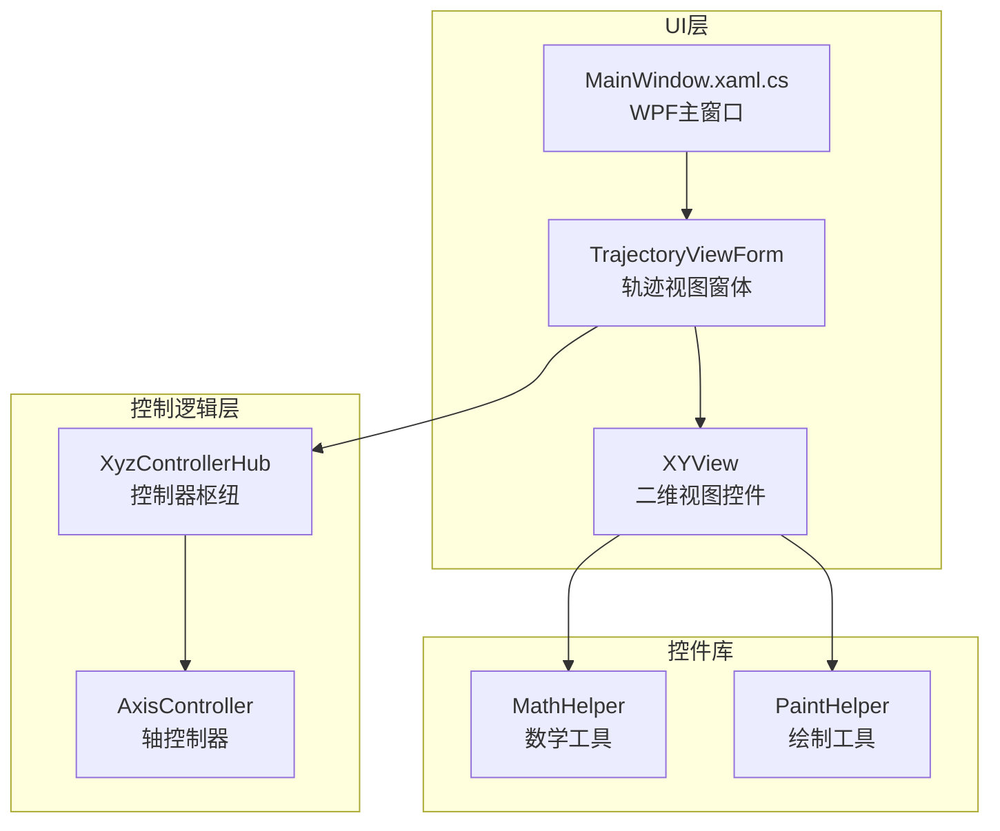
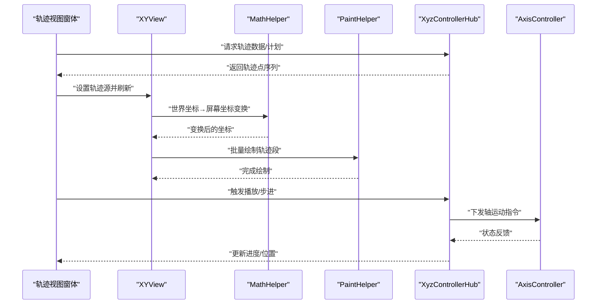
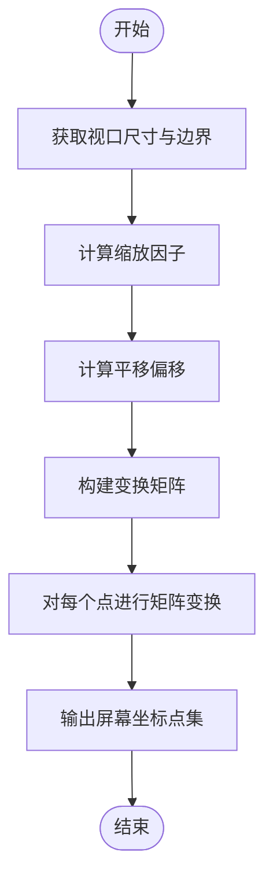
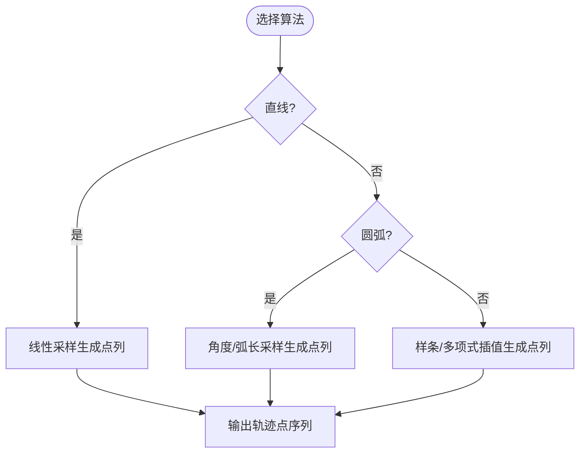
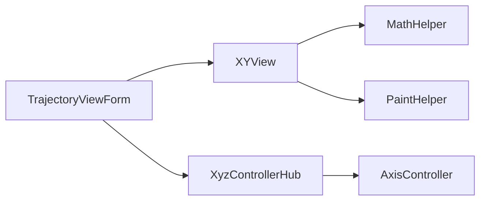

# 轨迹计算引擎

<cite>
**本文引用的文件**   
- [TrajectoryViewForm.cs](file://src/XyzController/TrajectoryViewForm.cs)
- [XYView.cs](file://src/XyzController.Controls/XYView.cs)
- [MathHelper.cs](file://src/XyzController.Controls/MathHelper.cs)
- [PaintHelper.cs](file://src/XyzController.Controls/PaintHelper.cs)
- [AxisController.cs](file://src/XyzController/Logic/AxisController.cs)
- [XyzControllerHub.cs](file://src/XyzController/Logic/XyzControllerHub.cs)
- [Program.cs](file://src/XyzController/Program.cs)
- [MainWindow.xaml.cs](file://src/XyzController.WpfHost/MainWindow.xaml.cs)
</cite>

## 目录
1. [简介](#简介)
2. [项目结构](#项目结构)
3. [核心组件](#核心组件)
4. [架构总览](#架构总览)
5. [详细组件分析](#详细组件分析)
6. [依赖关系分析](#依赖关系分析)
7. [性能考虑](#性能考虑)
8. [故障排查指南](#故障排查指南)
9. [结论](#结论)
10. [附录](#附录)

## 简介
本文件面向“轨迹计算引擎”的设计与实现，聚焦路径规划算法（直线插补、圆弧插补、复杂曲线生成）、坐标变换系统（世界坐标系到屏幕坐标系的转换、缩放和平移矩阵）、轨迹数据结构与序列化、实时计算优化策略（增量计算、缓存机制、性能监控），以及轨迹验证与碰撞检测。文档同时提供扩展指引，说明如何添加新的轨迹类型和自定义路径算法。

## 项目结构
本项目采用分层组织：UI展示层（WinForms/WPF）负责轨迹可视化；控制逻辑层负责轴控制与轨迹调度；控件库提供数学与绘制辅助；WPF宿主用于承载页面与交互。

图表来源
- [TrajectoryViewForm.cs](file://src/XyzController/TrajectoryViewForm.cs)
- [XYView.cs](file://src/XyzController.Controls/XYView.cs)
- [MathHelper.cs](file://src/XyzController.Controls/MathHelper.cs)
- [PaintHelper.cs](file://src/XyzController.Controls/PaintHelper.cs)
- [XyzControllerHub.cs](file://src/XyzController/Logic/XyzControllerHub.cs)
- [AxisController.cs](file://src/XyzController/Logic/AxisController.cs)
- [MainWindow.xaml.cs](file://src/XyzController.WpfHost/MainWindow.xaml.cs)

章节来源
- [Program.cs](file://src/XyzController/Program.cs)
- [MainWindow.xaml.cs](file://src/XyzController.WpfHost/MainWindow.xaml.cs)
- [TrajectoryViewForm.cs](file://src/XyzController/TrajectoryViewForm.cs)
- [XYView.cs](file://src/XyzController.Controls/XYView.cs)
- [MathHelper.cs](file://src/XyzController.Controls/MathHelper.cs)
- [PaintHelper.cs](file://src/XyzController.Controls/PaintHelper.cs)
- [XyzControllerHub.cs](file://src/XyzController/Logic/XyzControllerHub.cs)
- [AxisController.cs](file://src/XyzController/Logic/AxisController.cs)

## 核心组件
- 轨迹视图窗体：负责加载/生成轨迹数据、驱动动画播放、渲染轨迹点序列。
- 二维视图控件：封装世界坐标到屏幕坐标的映射、缩放平移矩阵、绘制管线。
- 数学工具：提供基础几何运算、插值函数、矩阵运算等。
- 绘制工具：提供批量绘制、抗锯齿、颜色与线型设置等。
- 控制器枢纽：协调轨迹计划、执行与状态同步。
- 轴控制器：管理各轴的步进/速度/加速度等底层参数。

章节来源
- [TrajectoryViewForm.cs](file://src/XyzController/TrajectoryViewForm.cs)
- [XYView.cs](file://src/XyzController.Controls/XYView.cs)
- [MathHelper.cs](file://src/XyzController.Controls/MathHelper.cs)
- [PaintHelper.cs](file://src/XyzController.Controls/PaintHelper.cs)
- [XyzControllerHub.cs](file://src/XyzController/Logic/XyzControllerHub.cs)
- [AxisController.cs](file://src/XyzController/Logic/AxisController.cs)

## 架构总览
整体流程从“轨迹定义/生成”开始，经“坐标变换”后进入“绘制管线”，并在“控制器枢纽”中统一调度执行。

图表来源
- [TrajectoryViewForm.cs](file://src/XyzController/TrajectoryViewForm.cs)
- [XYView.cs](file://src/XyzController.Controls/XYView.cs)
- [MathHelper.cs](file://src/XyzController.Controls/MathHelper.cs)
- [PaintHelper.cs](file://src/XyzController.Controls/PaintHelper.cs)
- [XyzControllerHub.cs](file://src/XyzController/Logic/XyzControllerHub.cs)
- [AxisController.cs](file://src/XyzController/Logic/AxisController.cs)

## 详细组件分析

### 坐标变换系统（世界坐标→屏幕坐标）
- 目标：将物理世界坐标转换为控件像素坐标，支持缩放与平移。
- 关键要素：
  - 视口矩形与边界：确定可绘制区域。
  - 缩放因子：根据世界范围与像素范围计算。
  - 平移偏移：将世界原点映射到屏幕左上角或中心。
  - 变换矩阵：组合缩放与平移，形成统一的仿射变换。
- 典型流程：
  - 输入：世界坐标点集、视口尺寸、缩放/平移参数。
  - 处理：逐点应用矩阵乘法得到屏幕坐标。
  - 输出：屏幕坐标点集供绘制使用。

章节来源
- [XYView.cs](file://src/XyzController.Controls/XYView.cs)
- [MathHelper.cs](file://src/XyzController.Controls/MathHelper.cs)
- [PaintHelper.cs](file://src/XyzController.Controls/PaintHelper.cs)

### 路径规划算法
- 直线插补：
  - 输入：起点、终点、步长或时间步。
  - 过程：按线性比例在两点间采样，生成等间距点列。
  - 输出：离散轨迹点序列。
- 圆弧插补：
  - 输入：起点、终点、圆心或半径、方向（顺时针/逆时针）。
  - 过程：计算角度增量，按弧长或角度步长采样，生成圆弧点列。
  - 输出：离散轨迹点序列。
- 复杂曲线生成：
  - 输入：控制点序列、样条阶数、采样密度。
  - 过程：基于样条或多项式基函数进行插值，必要时加入曲率约束。
  - 输出：平滑轨迹点序列。

章节来源
- [TrajectoryViewForm.cs](file://src/XyzController/TrajectoryViewForm.cs)
- [MathHelper.cs](file://src/XyzController.Controls/MathHelper.cs)

### 轨迹数据结构与存储格式
- 轨迹点类字段建议：
  - 位置：X、Y（三维可扩展Z）。
  - 时间戳：用于时序回放与同步。
  - 速度/加速度：可选，用于动力学约束与平滑。
  - 类型标识：区分直线、圆弧、样条等段类型。
  - 附加信息：如刀具半径补偿、进给倍率等。
- 序列化机制建议：
  - 文本格式：CSV/JSON，便于调试与交换。
  - 二进制格式：高效读写，适合大数据量轨迹。
  - 版本字段：保证向后兼容。
- 校验规则：
  - 非空检查、数值范围、连续性检查（相邻点距离阈值）。
  - 闭合性检查（首尾点一致性）。

章节来源
- [TrajectoryViewForm.cs](file://src/XyzController/TrajectoryViewForm.cs)
- [XYView.cs](file://src/XyzController.Controls/XYView.cs)

### 实时轨迹计算的优化策略
- 增量计算：
  - 仅对变化的区间重新采样，复用未变化部分。
  - 事件驱动刷新：当缩放/平移改变时局部重算。
- 缓存机制：
  - 缓存变换矩阵与常用中间结果。
  - 分段缓存：按轨迹段粒度缓存已生成的点列。
- 性能监控：
  - 记录每帧采样/变换/绘制耗时。
  - 统计内存占用与GC压力，避免频繁分配。
- 并行与批处理：
  - 批量变换与绘制减少调用开销。
  - 异步生成与UI线程渲染分离。

章节来源
- [XYView.cs](file://src/XyzController.Controls/XYView.cs)
- [PaintHelper.cs](file://src/XyzController.Controls/PaintHelper.cs)
- [TrajectoryViewForm.cs](file://src/XyzController/TrajectoryViewForm.cs)

### 轨迹验证与碰撞检测
- 轨迹验证：
  - 几何合法性：线段长度、圆弧半径正负与方向一致性。
  - 拓扑连续性：相邻段端点重合度阈值。
  - 动力学约束：最大速度/加速度/加加速度限制。
- 碰撞检测：
  - 静态障碍：多边形/圆形障碍物与轨迹段的相交测试。
  - 动态障碍：结合时间戳进行时空交集判断。
  - 安全裕度：引入膨胀半径或缓冲带。
- 回退策略：
  - 检测到冲突时自动重规划或降速通过。

章节来源
- [TrajectoryViewForm.cs](file://src/XyzController/TrajectoryViewForm.cs)
- [XyzControllerHub.cs](file://src/XyzController/Logic/XyzControllerHub.cs)

### 扩展指南：新增轨迹类型与自定义路径算法
- 步骤概览：
  - 定义新轨迹类型枚举与数据结构。
  - 实现对应插补算法，输出标准轨迹点序列。
  - 在视图层注册新类型，支持加载与预览。
  - 在控制器层接入执行与状态上报。
- 参考入口：
  - 轨迹视图窗体中的“生成/加载”入口。
  - 数学工具中的插补函数扩展点。
  - 控制器枢纽中的“计划→执行”接口。

章节来源
- [TrajectoryViewForm.cs](file://src/XyzController/TrajectoryViewForm.cs)
- [MathHelper.cs](file://src/XyzController.Controls/MathHelper.cs)
- [XyzControllerHub.cs](file://src/XyzController/Logic/XyzControllerHub.cs)

## 依赖关系分析
- 低耦合高内聚：
  - 视图层依赖数学与绘制工具，不直接操作轴控制。
  - 控制器枢纽作为编排者，屏蔽底层轴细节。
- 外部依赖：
  - UI框架（WinForms/WPF）用于渲染与交互。
  - 可能的IO库用于轨迹文件读写。

图表来源
- [TrajectoryViewForm.cs](file://src/XyzController/TrajectoryViewForm.cs)
- [XYView.cs](file://src/XyzController.Controls/XYView.cs)
- [MathHelper.cs](file://src/XyzController.Controls/MathHelper.cs)
- [PaintHelper.cs](file://src/XyzController.Controls/PaintHelper.cs)
- [XyzControllerHub.cs](file://src/XyzController/Logic/XyzControllerHub.cs)
- [AxisController.cs](file://src/XyzController/Logic/AxisController.cs)

章节来源
- [Program.cs](file://src/XyzController/Program.cs)
- [MainWindow.xaml.cs](file://src/XyzController.WpfHost/MainWindow.xaml.cs)

## 性能考虑
- 采样密度自适应：根据显示分辨率与缩放级别动态调整点数。
- 批处理绘制：合并同色/同线型的连续段，减少绘制调用。
- 内存复用：重用点集合与缓冲区，避免频繁分配。
- 异步流水线：后台生成轨迹，前台仅做轻量渲染。
- 指标采集：CPU/GC/绘制耗时埋点，定位瓶颈。

[本节为通用指导，不直接分析具体文件]

## 故障排查指南
- 常见问题：
  - 轨迹不显示：检查视口边界与缩放因子是否合理。
  - 轨迹抖动：确认采样步长与插补精度。
  - 播放卡顿：评估批量绘制与内存分配情况。
  - 碰撞误报：调整安全裕度与检测阈值。
- 诊断手段：
  - 打印关键中间变量（变换矩阵、采样点数量）。
  - 启用性能计数器，观察峰值与均值。
  - 导出轨迹片段至文本，离线验证。

章节来源
- [TrajectoryViewForm.cs](file://src/XyzController/TrajectoryViewForm.cs)
- [XYView.cs](file://src/XyzController.Controls/XYView.cs)
- [PaintHelper.cs](file://src/XyzController.Controls/PaintHelper.cs)

## 结论
本轨迹计算引擎以清晰的层次划分与模块化设计，实现了从轨迹生成、坐标变换到渲染与执行的完整链路。通过增量计算、缓存与批处理等手段，可在保持精度的前提下提升实时性。扩展新轨迹类型与自定义算法具备良好支撑点，便于后续功能演进。

[本节为总结性内容，不直接分析具体文件]

## 附录
- 术语表：
  - 插补：在已知关键点之间生成中间点的过程。
  - 仿射变换：包含缩放、平移、旋转的线性变换。
  - 样条：用分段多项式拟合曲线的数学方法。
- 参考入口路径：
  - 轨迹视图入口：[TrajectoryViewForm.cs](file://src/XyzController/TrajectoryViewForm.cs)
  - 坐标变换与绘制：[XYView.cs](file://src/XyzController.Controls/XYView.cs)、[PaintHelper.cs](file://src/XyzController.Controls/PaintHelper.cs)
  - 数学工具：[MathHelper.cs](file://src/XyzController.Controls/MathHelper.cs)
  - 控制编排：[XyzControllerHub.cs](file://src/XyzController/Logic/XyzControllerHub.cs)
  - 轴控制：[AxisController.cs](file://src/XyzController/Logic/AxisController.cs)