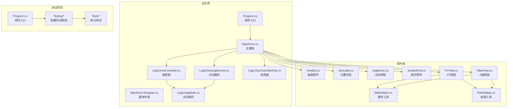
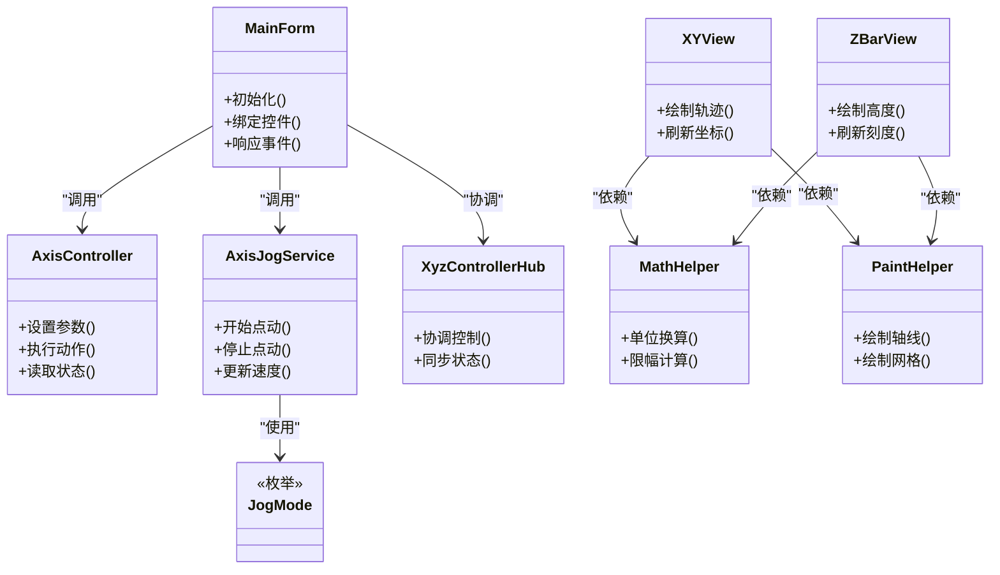
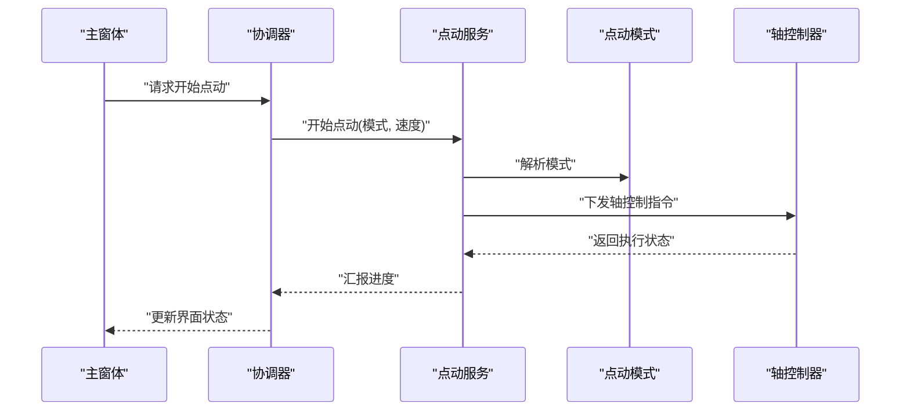
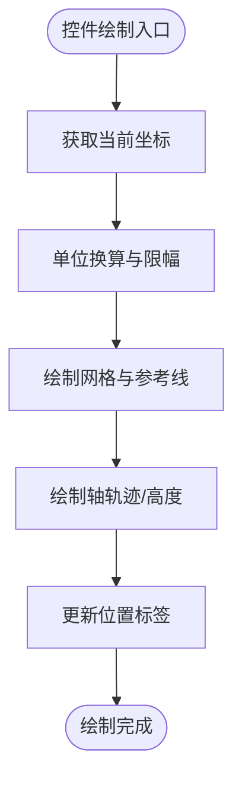
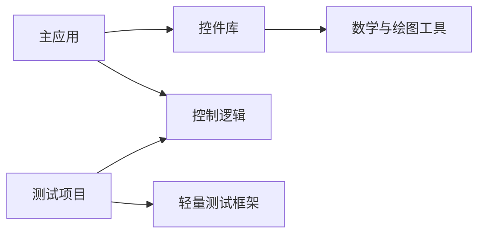

# 项目概述

<cite>
**本文引用的文件**   
- [README.md](file://README.md)
- [XyzController.sln](file://XyzController.sln)
- [Program.cs](file://src/XyzController/Program.cs)
- [MainForm.cs](file://src/XyzController/MainForm.cs)
- [MainForm.Designer.cs](file://src/XyzController/MainForm.Designer.cs)
- [AxisController.cs](file://src/XyzController/Logic/AxisController.cs)
- [AxisJogService.cs](file://src/XyzController/Logic/AxisJogService.cs)
- [JogMode.cs](file://src/XyzController/Logic/JogMode.cs)
- [XyzControllerHub.cs](file://src/XyzController/Logic/XyzControllerHub.cs)
- [AxisBar.cs](file://src/XyzController.Controls/AxisBar.cs)
- [DroLabel.cs](file://src/XyzController.Controls/DroLabel.cs)
- [JogButton.cs](file://src/XyzController.Controls/JogButton.cs)
- [JoystickPad.cs](file://src/XyzController.Controls/JoystickPad.cs)
- [XYView.cs](file://src/XyzController.Controls/XYView.cs)
- [ZBarView.cs](file://src/XyzController.Controls/ZBarView.cs)
- [MathHelper.cs](file://src/XyzController.Controls/MathHelper.cs)
- [PaintHelper.cs](file://src/XyzController.Controls/PaintHelper.cs)
- [XyzController.Tests.csproj](file://src/XyzController.Tests/XyzController.Tests.csproj)
- [Program.cs](file://src/XyzController.Tests/Program.cs)
- [Assert.cs](file://src/XyzController.Tests/Testing/Assert.cs)
- [TestAttribute.cs](file://src/XyzController.Tests/Testing/TestAttribute.cs)
- [TestRunner.cs](file://src/XyzController.Tests/Testing/TestRunner.cs)
- [AxisControllerTests.cs](file://src/XyzController.Tests/Tests/AxisControllerTests.cs)
- [AxisJogServiceTests.cs](file://src/XyzController.Tests/Tests/AxisJogServiceTests.cs)
- [XyzControllerHubTests.cs](file://src/XyzController.Tests/Tests/XyzControllerHubTests.cs)
</cite>

## 目录
1. [简介](#简介)
2. [项目结构](#项目结构)
3. [核心组件](#核心组件)
4. [架构总览](#架构总览)
5. [详细组件分析](#详细组件分析)
6. [依赖关系分析](#依赖关系分析)
7. [性能与可用性考虑](#性能与可用性考虑)
8. [故障排查指南](#故障排查指南)
9. [结论](#结论)
10. [附录：快速开始](#附录快速开始)

## 简介
XYZ控制器是一个基于C#与Windows Forms的桌面应用程序，用于控制XYZ三轴运动系统。项目采用分层设计，将业务逻辑、用户界面与自定义控件解耦，并通过测试项目保障核心逻辑的正确性。整体技术栈包括.NET Framework、Windows Forms以及GDI+图形库，提供轴控制、点动操作、实时坐标显示等关键能力。

## 项目结构
项目由三个主要工程组成：
- 主应用（XyzController）：包含程序入口、主窗体与核心控制逻辑。
- 控件库（XyzController.Controls）：封装可复用的UI控件与绘图辅助工具。
- 测试项目（XyzController.Tests）：包含轻量级测试框架与针对核心逻辑的单元测试。

图表来源
- [Program.cs](file://src/XyzController/Program.cs)
- [MainForm.cs](file://src/XyzController/MainForm.cs)
- [MainForm.Designer.cs](file://src/XyzController/MainForm.Designer.cs)
- [AxisController.cs](file://src/XyzController/Logic/AxisController.cs)
- [AxisJogService.cs](file://src/XyzController/Logic/AxisJogService.cs)
- [JogMode.cs](file://src/XyzController/Logic/JogMode.cs)
- [XyzControllerHub.cs](file://src/XyzController/Logic/XyzControllerHub.cs)
- [AxisBar.cs](file://src/XyzController.Controls/AxisBar.cs)
- [DroLabel.cs](file://src/XyzController.Controls/DroLabel.cs)
- [JogButton.cs](file://src/XyzController.Controls/JogButton.cs)
- [JoystickPad.cs](file://src/XyzController.Controls/JoystickPad.cs)
- [XYView.cs](file://src/XyzController.Controls/XYView.cs)
- [ZBarView.cs](file://src/XyzController.Controls/ZBarView.cs)
- [MathHelper.cs](file://src/XyzController.Controls/MathHelper.cs)
- [PaintHelper.cs](file://src/XyzController.Controls/PaintHelper.cs)
- [Program.cs](file://src/XyzController.Tests/Program.cs)
- [Assert.cs](file://src/XyzController.Tests/Testing/Assert.cs)
- [TestAttribute.cs](file://src/XyzController.Tests/Testing/TestAttribute.cs)
- [TestRunner.cs](file://src/XyzController.Tests/Testing/TestRunner.cs)

章节来源
- [README.md](file://README.md)
- [XyzController.sln](file://XyzController.sln)

## 核心组件
- 程序入口与主窗体
  - 程序入口负责初始化并启动主窗体。
  - 主窗体承载所有交互控件，并与控制逻辑进行绑定。
- 控制逻辑层
  - 轴控制器：管理各轴的参数、状态与基本动作。
  - 点动服务：处理点动命令、速度规划与执行。
  - 点动模式：定义点动的不同工作模式。
  - 协调器：统一调度轴控制与点动服务，维护系统状态。
- 自定义控件
  - 轴条控件：可视化展示轴位置与范围。
  - 位置标签：以数字形式显示当前坐标。
  - 点动按钮：触发点动操作的快捷控件。
  - 摇杆控件：通过拖拽或点击实现方向与速度控制。
  - XY视图与Z轴视图：分别绘制XY平面与Z轴位置的图形化表示。
  - 数学与绘图工具：为控件提供通用计算与绘制能力。
- 测试框架与用例
  - 轻量测试框架：提供断言、测试标记与运行器。
  - 单元测试：覆盖轴控制器、点动服务与协调器的关键路径。

章节来源
- [Program.cs](file://src/XyzController/Program.cs)
- [MainForm.cs](file://src/XyzController/MainForm.cs)
- [MainForm.Designer.cs](file://src/XyzController/MainForm.Designer.cs)
- [AxisController.cs](file://src/XyzController/Logic/AxisController.cs)
- [AxisJogService.cs](file://src/XyzController/Logic/AxisJogService.cs)
- [JogMode.cs](file://src/XyzController/Logic/JogMode.cs)
- [XyzControllerHub.cs](file://src/XyzController/Logic/XyzControllerHub.cs)
- [AxisBar.cs](file://src/XyzController.Controls/AxisBar.cs)
- [DroLabel.cs](file://src/XyzController.Controls/DroLabel.cs)
- [JogButton.cs](file://src/XyzController.Controls/JogButton.cs)
- [JoystickPad.cs](file://src/XyzController.Controls/JoystickPad.cs)
- [XYView.cs](file://src/XyzController.Controls/XYView.cs)
- [ZBarView.cs](file://src/XyzController.Controls/ZBarView.cs)
- [MathHelper.cs](file://src/XyzController.Controls/MathHelper.cs)
- [PaintHelper.cs](file://src/XyzController.Controls/PaintHelper.cs)
- [Assert.cs](file://src/XyzController.Tests/Testing/Assert.cs)
- [TestAttribute.cs](file://src/XyzController.Tests/Testing/TestAttribute.cs)
- [TestRunner.cs](file://src/XyzController.Tests/Testing/TestRunner.cs)
- [AxisControllerTests.cs](file://src/XyzController.Tests/Tests/AxisControllerTests.cs)
- [AxisJogServiceTests.cs](file://src/XyzController.Tests/Tests/AxisJogServiceTests.cs)
- [XyzControllerHubTests.cs](file://src/XyzController.Tests/Tests/XyzControllerHubTests.cs)

## 架构总览
系统采用“界面—逻辑—数据”的分层组织方式：
- 界面层：Windows Forms主窗体与自定义控件，负责输入采集与结果呈现。
- 逻辑层：轴控制、点动服务与协调器，负责业务规则与流程编排。
- 工具层：数学与绘图工具，为界面与控制逻辑提供通用能力。
- 测试层：独立工程，验证逻辑层的正确性与稳定性。

图表来源
- [MainForm.cs](file://src/XyzController/MainForm.cs)
- [AxisController.cs](file://src/XyzController/Logic/AxisController.cs)
- [AxisJogService.cs](file://src/XyzController/Logic/AxisJogService.cs)
- [JogMode.cs](file://src/XyzController/Logic/JogMode.cs)
- [XyzControllerHub.cs](file://src/XyzController/Logic/XyzControllerHub.cs)
- [XYView.cs](file://src/XyzController.Controls/XYView.cs)
- [ZBarView.cs](file://src/XyzController.Controls/ZBarView.cs)
- [MathHelper.cs](file://src/XyzController.Controls/MathHelper.cs)
- [PaintHelper.cs](file://src/XyzController.Controls/PaintHelper.cs)

## 详细组件分析

### 主应用与界面层
- 程序入口
  - 负责创建并运行主窗体，完成应用生命周期管理。
- 主窗体
  - 加载并组合各类控件，订阅用户交互事件。
  - 与逻辑层建立通信，驱动轴控制与点动服务。
  - 通过坐标标签与视图控件实时更新位置信息。

章节来源
- [Program.cs](file://src/XyzController/Program.cs)
- [MainForm.cs](file://src/XyzController/MainForm.cs)
- [MainForm.Designer.cs](file://src/XyzController/MainForm.Designer.cs)

### 控制逻辑层
- 轴控制器
  - 管理XYZ三轴的基本参数与状态，提供统一的控制接口。
- 点动服务
  - 接收点动指令，结合点动模式进行速度与方向控制。
- 点动模式
  - 定义不同的点动工作方式，供点动服务选择。
- 协调器
  - 作为中枢，协调轴控制器与点动服务，确保状态一致与顺序执行。

图表来源
- [MainForm.cs](file://src/XyzController/MainForm.cs)
- [XyzControllerHub.cs](file://src/XyzController/Logic/XyzControllerHub.cs)
- [AxisJogService.cs](file://src/XyzController/Logic/AxisJogService.cs)
- [JogMode.cs](file://src/XyzController/Logic/JogMode.cs)
- [AxisController.cs](file://src/XyzController/Logic/AxisController.cs)

章节来源
- [AxisController.cs](file://src/XyzController/Logic/AxisController.cs)
- [AxisJogService.cs](file://src/XyzController/Logic/AxisJogService.cs)
- [JogMode.cs](file://src/XyzController/Logic/JogMode.cs)
- [XyzControllerHub.cs](file://src/XyzController/Logic/XyzControllerHub.cs)

### 自定义控件与绘图
- 轴条控件与位置标签
  - 直观展示轴当前位置与行程范围，便于操作员快速定位。
- 点动按钮与摇杆控件
  - 提供便捷的手动控制入口，支持多方向与速度调节。
- XY视图与Z轴视图
  - 使用GDI+绘制二维轨迹与高度指示，配合数学工具进行坐标转换与限幅。
- 数学与绘图工具
  - 提供单位换算、数值限幅、网格与轴线绘制等通用功能。

图表来源
- [XYView.cs](file://src/XyzController.Controls/XYView.cs)
- [ZBarView.cs](file://src/XyzController.Controls/ZBarView.cs)
- [AxisBar.cs](file://src/XyzController.Controls/AxisBar.cs)
- [DroLabel.cs](file://src/XyzController.Controls/DroLabel.cs)
- [MathHelper.cs](file://src/XyzController.Controls/MathHelper.cs)
- [PaintHelper.cs](file://src/XyzController.Controls/PaintHelper.cs)

章节来源
- [AxisBar.cs](file://src/XyzController.Controls/AxisBar.cs)
- [DroLabel.cs](file://src/XyzController.Controls/DroLabel.cs)
- [JogButton.cs](file://src/XyzController.Controls/JogButton.cs)
- [JoystickPad.cs](file://src/XyzController.Controls/JoystickPad.cs)
- [XYView.cs](file://src/XyzController.Controls/XYView.cs)
- [ZBarView.cs](file://src/XyzController.Controls/ZBarView.cs)
- [MathHelper.cs](file://src/XyzController.Controls/MathHelper.cs)
- [PaintHelper.cs](file://src/XyzController.Controls/PaintHelper.cs)

### 测试框架与用例
- 轻量测试框架
  - 提供断言、测试标记与运行器，简化单元测试编写与执行。
- 单元测试
  - 覆盖轴控制器、点动服务与协调器的关键路径，保障逻辑稳定。

章节来源
- [Assert.cs](file://src/XyzController.Tests/Testing/Assert.cs)
- [TestAttribute.cs](file://src/XyzController.Tests/Testing/TestAttribute.cs)
- [TestRunner.cs](file://src/XyzController.Tests/Testing/TestRunner.cs)
- [AxisControllerTests.cs](file://src/XyzController.Tests/Tests/AxisControllerTests.cs)
- [AxisJogServiceTests.cs](file://src/XyzController.Tests/Tests/AxisJogServiceTests.cs)
- [XyzControllerHubTests.cs](file://src/XyzController.Tests/Tests/XyzControllerHubTests.cs)

## 依赖关系分析
- 主应用依赖控件库与逻辑层，形成“界面—逻辑”的清晰边界。
- 控件库内部通过数学与绘图工具降低耦合度，提升复用性。
- 测试项目独立于主应用，仅依赖逻辑层与测试框架，保证可测性。

图表来源
- [XyzController.sln](file://XyzController.sln)
- [XyzController.Tests.csproj](file://src/XyzController.Tests/XyzController.Tests.csproj)

章节来源
- [XyzController.sln](file://XyzController.sln)
- [XyzController.Tests.csproj](file://src/XyzController.Tests/XyzController.Tests.csproj)

## 性能与可用性考虑
- 界面刷新频率与渲染开销
  - 合理控制视图重绘频率，避免频繁刷新导致卡顿。
- 坐标计算与限幅
  - 在数学工具中集中处理单位换算与限幅，减少重复计算。
- 点动控制的平滑性
  - 通过点动服务对速度与加速度进行规划，提高操控体验。
- 资源释放与异常恢复
  - 在控件与窗体生命周期结束时释放GDI+资源，防止内存泄漏。

[本节为通用指导，不直接分析具体文件]

## 故障排查指南
- 无法启动应用
  - 检查程序入口是否正确创建并运行主窗体。
- 控件无响应
  - 确认主窗体是否已订阅控件的事件，并正确转发到逻辑层。
- 坐标显示异常
  - 检查数学工具的换算与限幅逻辑，核对视图刷新时机。
- 点动无效或异常
  - 核查点动模式配置与服务状态，确认轴控制器是否收到指令。
- 测试失败
  - 根据测试运行器输出定位失败用例，检查断言条件与模拟数据。

章节来源
- [Program.cs](file://src/XyzController/Program.cs)
- [MainForm.cs](file://src/XyzController/MainForm.cs)
- [XYView.cs](file://src/XyzController.Controls/XYView.cs)
- [ZBarView.cs](file://src/XyzController.Controls/ZBarView.cs)
- [AxisJogService.cs](file://src/XyzController/Logic/AxisJogService.cs)
- [AxisController.cs](file://src/XyzController/Logic/AxisController.cs)
- [TestRunner.cs](file://src/XyzController.Tests/Testing/TestRunner.cs)

## 结论
本项目以清晰的层次结构与可复用的控件库为基础，提供了稳定的XYZ三轴控制能力。通过测试项目的持续验证，保障了核心逻辑的可靠性。对于初学者，建议从主窗体与控件入手理解交互流程；对于有经验的开发者，可深入逻辑层与测试用例，进一步优化控制算法与性能表现。

[本节为总结性内容，不直接分析具体文件]

## 附录：快速开始
- 构建与运行
  - 打开解决方案文件以加载项目。
  - 生成主应用工程后，运行程序入口以启动主窗体。
- 基本操作
  - 使用点动按钮或摇杆控件进行手动控制。
  - 观察坐标标签与视图中的实时位置变化。
- 运行测试
  - 构建测试项目，通过测试运行器执行全部用例。
  - 根据测试结果调整逻辑层实现。

章节来源
- [XyzController.sln](file://XyzController.sln)
- [Program.cs](file://src/XyzController/Program.cs)
- [Program.cs](file://src/XyzController.Tests/Program.cs)
- [TestRunner.cs](file://src/XyzController.Tests/Testing/TestRunner.cs)