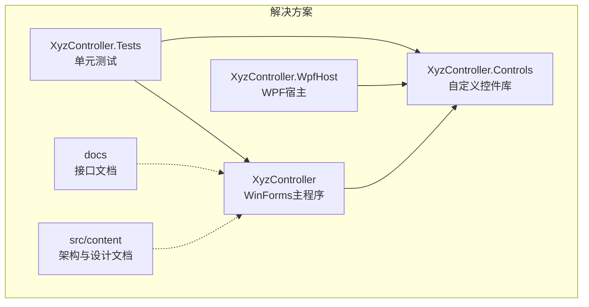
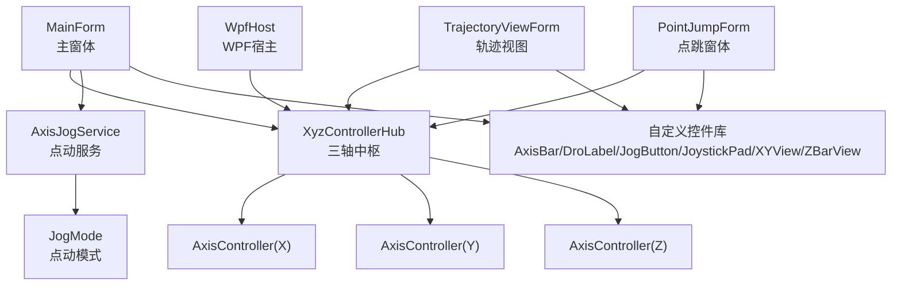
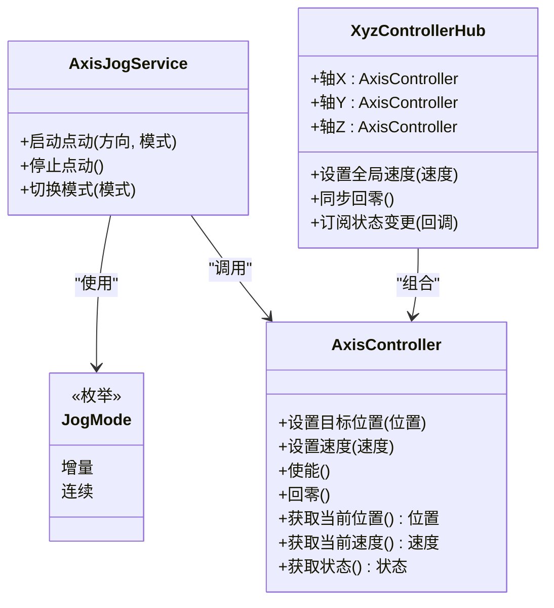
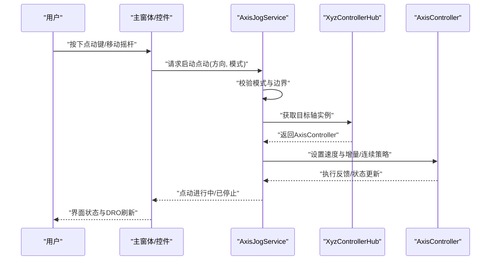
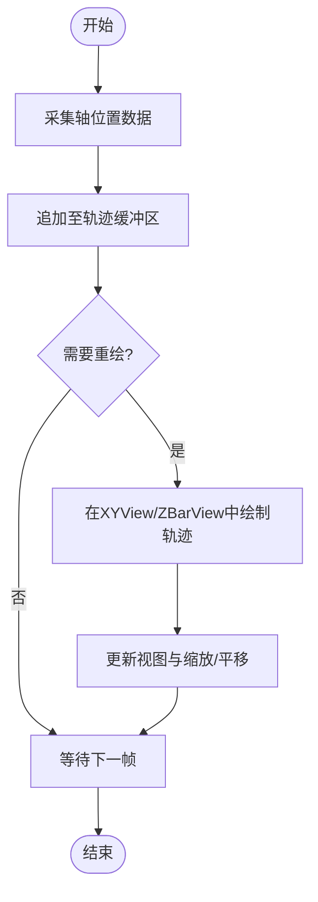
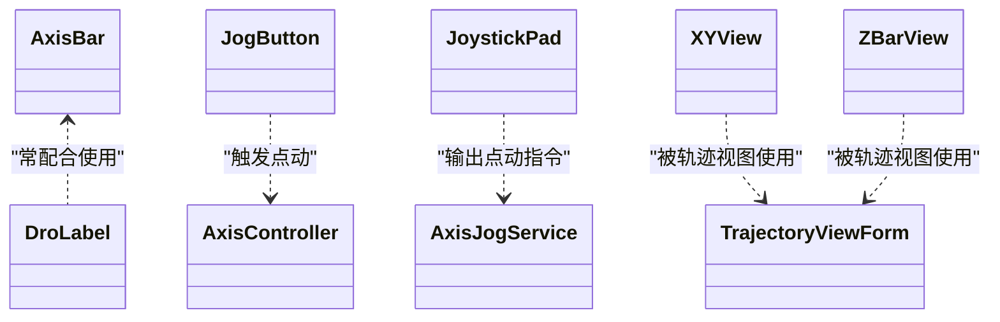
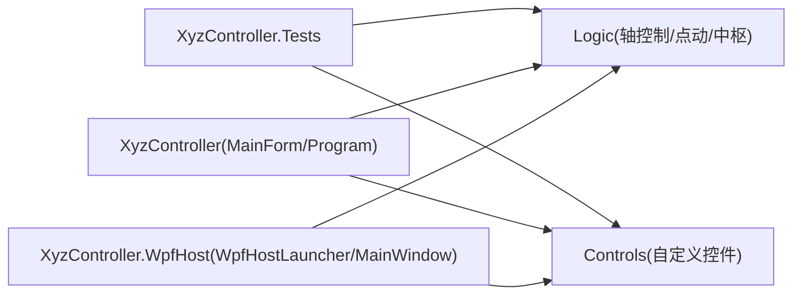

# 项目概述

<cite>
**本文引用的文件**   
- [README.md](file://README.md)
- [XyzController.sln](file://XyzController.sln)
- [Program.cs](file://src/XyzController/Program.cs)
- [MainForm.cs](file://src/XyzController/MainForm.cs)
- [AxisController.cs](file://src/XyzController/Logic/AxisController.cs)
- [AxisJogService.cs](file://src/XyzController/Logic/AxisJogService.cs)
- [JogMode.cs](file://src/XyzController/Logic/JogMode.cs)
- [XyzControllerHub.cs](file://src/XyzController/Logic/XyzControllerHub.cs)
- [TrajectoryViewForm.cs](file://src/XyzController/TrajectoryViewForm.cs)
- [PointJumpForm.cs](file://src/XyzController/PointJumpForm.cs)
- [AxisBar.cs](file://src/XyzController.Controls/AxisBar.cs)
- [DroLabel.cs](file://src/XyzController.Controls/DroLabel.cs)
- [JogButton.cs](file://src/XyzController.Controls/JogButton.cs)
- [JoystickPad.cs](file://src/XyzController.Controls/JoystickPad.cs)
- [XYView.cs](file://src/XyzController.Controls/XYView.cs)
- [ZBarView.cs](file://src/XyzController.Controls/ZBarView.cs)
- [WpfHostLauncher.cs](file://src/XyzController.WpfHost/WpfHostLauncher.cs)
- [MainWindow.xaml.cs](file://src/XyzController.WpfHost/MainWindow.xaml.cs)
- [WpfPage.cs](file://src/XyzController.WpfHost/WpfPage.cs)
- [核心架构设计.md](file://src/content/核心架构设计/核心架构设计.md)
- [主窗体协调器.md](file://src/content/核心架构设计/主窗体协调器.md)
- [点动服务.md](file://src/content/核心架构设计/点动服务.md)
- [组件通信机制.md](file://src/content/核心架构设计/组件通信机制.md)
- [轴控制系统.md](file://src/content/核心架构设计/轴控制系统.md)
- [自定义控件库.md](file://src/content/自定义控件库/自定义控件库.md)
- [基础控件.md](file://src/content/自定义控件库/基础控件.md)
- [高级控件.md](file://src/content/自定义控件库/高级控件.md)
</cite>

## 目录
1. [简介](#简介)
2. [项目结构](#项目结构)
3. [核心组件](#核心组件)
4. [架构总览](#架构总览)
5. [详细组件分析](#详细组件分析)
6. [依赖关系分析](#依赖关系分析)
7. [性能与可扩展性](#性能与可扩展性)
8. [快速开始指南](#快速开始指南)
9. [故障排查](#故障排查)
10. [结论](#结论)

## 简介
本项目是一个基于C#和WPF的桌面应用程序，面向XYZ三轴运动控制设备的界面管理与操作。系统提供轴控制、点动控制、轨迹可视化以及一套可复用的自定义控件库，旨在为设备调试、演示与集成提供统一的交互入口。

技术栈选择原因与优势：
- C# + WPF：成熟的桌面UI框架，数据绑定与可视化能力强，便于构建高响应性的控制面板与实时视图。
- 模块化工程组织：将业务逻辑、UI、控件库与宿主分离，提升可维护性与可测试性。
- 事件驱动与解耦：通过中心枢纽与页面化承载，降低耦合度，便于扩展新轴或新视图。

主要特性：
- 轴控制：对X/Y/Z轴进行位置、速度等参数配置与状态监控。
- 点动控制：支持多种点动模式（如增量、连续）与按键/摇杆输入。
- 轨迹可视化：在二维/三维视图中绘制并回放历史轨迹。
- 自定义控件库：封装常用工业HMI控件，如轴条、DRO显示、点动按钮、摇杆面板、XY视图与Z轴视图。

**章节来源**
- [README.md](file://README.md)
- [核心架构设计.md](file://src/content/核心架构设计/核心架构设计.md)

## 项目结构
解决方案包含多个工程，职责清晰、分层明确：
- XyzController：WinForms主程序入口与业务窗体，承载轴控制、点动、轨迹查看等核心功能。
- XyzController.Controls：自定义控件库，提供轴条、DRO、点动按钮、摇杆、XY/Z视图等。
- XyzController.WpfHost：WPF宿主工程，用于以WPF方式承载页面与控件，提供更现代的UI体验。
- XyzController.Tests：单元测试工程，覆盖核心逻辑与服务。
- docs：接口文档与替换指南。
- src/content：架构与设计说明文档。

**图表来源**
- [XyzController.sln](file://XyzController.sln)
- [Program.cs](file://src/XyzController/Program.cs)
- [WpfHostLauncher.cs](file://src/XyzController.WpfHost/WpfHostLauncher.cs)

**章节来源**
- [XyzController.sln](file://XyzController.sln)
- [Program.cs](file://src/XyzController/Program.cs)
- [WpfHostLauncher.cs](file://src/XyzController.WpfHost/WpfHostLauncher.cs)

## 核心组件
- 轴控制器（AxisController）：封装单轴控制能力，包括目标位置、速度、使能、回零等命令与状态上报。
- 点动服务（AxisJogService）：管理点动模式（JogMode），处理按键/摇杆输入到轴的增量或连续移动策略。
- XYZ控制器中枢（XyzControllerHub）：聚合X/Y/Z三轴控制器，提供统一入口与跨轴协同能力。
- 主窗体（MainForm）：作为WinForms侧的主协调器，组合各功能窗体与控件，负责生命周期与事件分发。
- 轨迹视图（TrajectoryViewForm）：提供轨迹记录、回放与可视化展示。
- 点跳窗体（PointJumpForm）：提供点到点定位与坐标输入界面。
- 自定义控件库：AxisBar、DroLabel、JogButton、JoystickPad、XYView、ZBarView等，支撑高效HMI构建。

**章节来源**
- [AxisController.cs](file://src/XyzController/Logic/AxisController.cs)
- [AxisJogService.cs](file://src/XyzController/Logic/AxisJogService.cs)
- [JogMode.cs](file://src/XyzController/Logic/JogMode.cs)
- [XyzControllerHub.cs](file://src/XyzController/Logic/XyzControllerHub.cs)
- [MainForm.cs](file://src/XyzController/MainForm.cs)
- [TrajectoryViewForm.cs](file://src/XyzController/TrajectoryViewForm.cs)
- [PointJumpForm.cs](file://src/XyzController/PointJumpForm.cs)
- [AxisBar.cs](file://src/XyzController.Controls/AxisBar.cs)
- [DroLabel.cs](file://src/XyzController.Controls/DroLabel.cs)
- [JogButton.cs](file://src/XyzController.Controls/JogButton.cs)
- [JoystickPad.cs](file://src/XyzController.Controls/JoystickPad.cs)
- [XYView.cs](file://src/XyzController.Controls/XYView.cs)
- [ZBarView.cs](file://src/XyzController.Controls/ZBarView.cs)

## 架构总览
系统采用“中枢+页面/窗体+控件”的分层架构：
- 中枢层：XyzControllerHub统一管理三轴控制器，对外暴露统一API。
- 业务层：AxisController与AxisJogService实现轴控制与点动策略。
- UI层：WinForms主程序与WPF宿主分别承载不同场景的界面；自定义控件库提供通用UI元素。
- 数据流：用户输入（按钮/摇杆/键盘）→ 点动服务 → 轴控制器 → 设备驱动（外部）→ 状态回调 → UI刷新。

**图表来源**
- [XyzControllerHub.cs](file://src/XyzController/Logic/XyzControllerHub.cs)
- [AxisController.cs](file://src/XyzController/Logic/AxisController.cs)
- [AxisJogService.cs](file://src/XyzController/Logic/AxisJogService.cs)
- [JogMode.cs](file://src/XyzController/Logic/JogMode.cs)
- [MainForm.cs](file://src/XyzController/MainForm.cs)
- [TrajectoryViewForm.cs](file://src/XyzController/TrajectoryViewForm.cs)
- [PointJumpForm.cs](file://src/XyzController/PointJumpForm.cs)
- [WpfHostLauncher.cs](file://src/XyzController.WpfHost/WpfHostLauncher.cs)
- [AxisBar.cs](file://src/XyzController.Controls/AxisBar.cs)
- [DroLabel.cs](file://src/XyzController.Controls/DroLabel.cs)
- [JogButton.cs](file://src/XyzController.Controls/JogButton.cs)
- [JoystickPad.cs](file://src/XyzController.Controls/JoystickPad.cs)
- [XYView.cs](file://src/XyzController.Controls/XYView.cs)
- [ZBarView.cs](file://src/XyzController.Controls/ZBarView.cs)

## 详细组件分析

### 中枢与轴控制类图

**图表来源**
- [AxisController.cs](file://src/XyzController/Logic/AxisController.cs)
- [AxisJogService.cs](file://src/XyzController/Logic/AxisJogService.cs)
- [JogMode.cs](file://src/XyzController/Logic/JogMode.cs)
- [XyzControllerHub.cs](file://src/XyzController/Logic/XyzControllerHub.cs)

**章节来源**
- [AxisController.cs](file://src/XyzController/Logic/AxisController.cs)
- [AxisJogService.cs](file://src/XyzController/Logic/AxisJogService.cs)
- [JogMode.cs](file://src/XyzController/Logic/JogMode.cs)
- [XyzControllerHub.cs](file://src/XyzController/Logic/XyzControllerHub.cs)

### 点动控制时序（从输入到执行）

**图表来源**
- [AxisJogService.cs](file://src/XyzController/Logic/AxisJogService.cs)
- [XyzControllerHub.cs](file://src/XyzController/Logic/XyzControllerHub.cs)
- [AxisController.cs](file://src/XyzController/Logic/AxisController.cs)
- [MainForm.cs](file://src/XyzController/MainForm.cs)
- [JogButton.cs](file://src/XyzController.Controls/JogButton.cs)
- [JoystickPad.cs](file://src/XyzController.Controls/JoystickPad.cs)

**章节来源**
- [AxisJogService.cs](file://src/XyzController/Logic/AxisJogService.cs)
- [XyzControllerHub.cs](file://src/XyzController/Logic/XyzControllerHub.cs)
- [AxisController.cs](file://src/XyzController/Logic/AxisController.cs)
- [MainForm.cs](file://src/XyzController/MainForm.cs)
- [JogButton.cs](file://src/XyzController.Controls/JogButton.cs)
- [JoystickPad.cs](file://src/XyzController.Controls/JoystickPad.cs)

### 轨迹可视化流程

**图表来源**
- [TrajectoryViewForm.cs](file://src/XyzController/TrajectoryViewForm.cs)
- [XYView.cs](file://src/XyzController.Controls/XYView.cs)
- [ZBarView.cs](file://src/XyzController.Controls/ZBarView.cs)

**章节来源**
- [TrajectoryViewForm.cs](file://src/XyzController/TrajectoryViewForm.cs)
- [XYView.cs](file://src/XyzController.Controls/XYView.cs)
- [ZBarView.cs](file://src/XyzController.Controls/ZBarView.cs)

### 自定义控件族概览
- AxisBar：轴进度与数值显示，常用于DRO联动。
- DroLabel：数字读数显示，绑定轴位置/速度等属性。
- JogButton：点动按键，封装按住/抬起事件与防抖。
- JoystickPad：虚拟摇杆，输出方向与力度信号。
- XYView：二维平面视图，支持轨迹绘制与缩放。
- ZBarView：Z轴高度指示器，适合剖面视图。

**图表来源**
- [AxisBar.cs](file://src/XyzController.Controls/AxisBar.cs)
- [DroLabel.cs](file://src/XyzController.Controls/DroLabel.cs)
- [JogButton.cs](file://src/XyzController.Controls/JogButton.cs)
- [JoystickPad.cs](file://src/XyzController.Controls/JoystickPad.cs)
- [XYView.cs](file://src/XyzController.Controls/XYView.cs)
- [ZBarView.cs](file://src/XyzController.Controls/ZBarView.cs)
- [TrajectoryViewForm.cs](file://src/XyzController/TrajectoryViewForm.cs)

**章节来源**
- [AxisBar.cs](file://src/XyzController.Controls/AxisBar.cs)
- [DroLabel.cs](file://src/XyzController.Controls/DroLabel.cs)
- [JogButton.cs](file://src/XyzController.Controls/JogButton.cs)
- [JoystickPad.cs](file://src/XyzController.Controls/JoystickPad.cs)
- [XYView.cs](file://src/XyzController.Controls/XYView.cs)
- [ZBarView.cs](file://src/XyzController.Controls/ZBarView.cs)
- [TrajectoryViewForm.cs](file://src/XyzController/TrajectoryViewForm.cs)

## 依赖关系分析
- WinForms主程序依赖中枢与业务逻辑，并通过自定义控件库构建界面。
- WPF宿主通过页面承载方式复用中枢与控件库，实现跨UI框架的统一能力。
- 测试工程直接依赖业务逻辑与控件库，验证核心行为与边界条件。

**图表来源**
- [Program.cs](file://src/XyzController/Program.cs)
- [MainForm.cs](file://src/XyzController/MainForm.cs)
- [WpfHostLauncher.cs](file://src/XyzController.WpfHost/WpfHostLauncher.cs)
- [MainWindow.xaml.cs](file://src/XyzController.WpfHost/MainWindow.xaml.cs)
- [WpfPage.cs](file://src/XyzController.WpfHost/WpfPage.cs)

**章节来源**
- [Program.cs](file://src/XyzController/Program.cs)
- [MainForm.cs](file://src/XyzController/MainForm.cs)
- [WpfHostLauncher.cs](file://src/XyzController.WpfHost/WpfHostLauncher.cs)
- [MainWindow.xaml.cs](file://src/XyzController.WpfHost/MainWindow.xaml.cs)
- [WpfPage.cs](file://src/XyzController.WpfHost/WpfPage.cs)

## 性能与可扩展性
- 渲染优化：轨迹视图建议采用双缓冲与增量绘制，避免全量重绘导致卡顿。
- 事件节流：点动输入需做去抖与限频，防止高频事件造成UI抖动与总线拥塞。
- 线程模型：设备状态回调应隔离于UI线程之外，通过安全调度更新界面。
- 可扩展性：新增轴类型可通过扩展中枢与控制器抽象；新增视图可通过WPF页面或WinForms窗体接入。

[本节为通用指导，不直接分析具体文件]

## 快速开始指南
环境要求：
- Windows平台
- .NET运行时与开发工具链（与解决方案目标一致）
- 可选：WPF运行环境（若使用WpfHost）

安装与运行：
- 打开解决方案文件，还原NuGet包（如有）。
- 选择启动项目：
  - WinForms主程序：设置XyzController为启动项，运行后进入主窗体。
  - WPF宿主：设置XyzController.WpfHost为启动项，运行后进入WPF窗口。
- 基本操作：
  - 在主窗体中选择目标轴，设置速度与步长。
  - 使用点动按钮或摇杆面板进行点动控制。
  - 打开轨迹视图，观察实时轨迹与回放。
  - 在点跳窗体中输入目标坐标，执行点到点定位。

**章节来源**
- [Program.cs](file://src/XyzController/Program.cs)
- [MainForm.cs](file://src/XyzController/MainForm.cs)
- [WpfHostLauncher.cs](file://src/XyzController.WpfHost/WpfHostLauncher.cs)
- [MainWindow.xaml.cs](file://src/XyzController.WpfHost/MainWindow.xaml.cs)
- [TrajectoryViewForm.cs](file://src/XyzController/TrajectoryViewForm.cs)
- [PointJumpForm.cs](file://src/XyzController/PointJumpForm.cs)

## 故障排查
常见问题与建议：
- 界面无响应：检查点动事件是否阻塞UI线程；确保状态回调使用异步调度。
- 轨迹闪烁：确认轨迹视图启用双缓冲，减少不必要的重绘区域。
- 点动异常：核对JogMode配置与边界限制；检查摇杆/按键事件的去抖逻辑。
- WPF宿主加载失败：确认WPF宿主初始化顺序与页面注册正确。

**章节来源**
- [AxisJogService.cs](file://src/XyzController/Logic/AxisJogService.cs)
- [JogMode.cs](file://src/XyzController/Logic/JogMode.cs)
- [TrajectoryViewForm.cs](file://src/XyzController/TrajectoryViewForm.cs)
- [WpfHostLauncher.cs](file://src/XyzController.WpfHost/WpfHostLauncher.cs)
- [MainWindow.xaml.cs](file://src/XyzController.WpfHost/MainWindow.xaml.cs)

## 结论
本方案以中枢为核心的分层架构，结合WinForms与WPF双宿主，提供了稳定、可扩展的XYZ轴控制桌面应用。通过丰富的自定义控件库与清晰的职责划分，既满足初学者快速上手的需求，也为有经验的开发者提供了足够的扩展空间。建议在后续迭代中持续完善错误处理、日志与性能监控，进一步提升系统的健壮性与可观测性。