# XyzController —— XYZ 轴实时控制器（WinForms）

一个用 C# + WinForms 写的纯软件模拟界面，用于实时控制一个虚拟的 XYZ 坐标点。项目采用分层设计，将业务逻辑、用户界面与自定义控件解耦，并通过独立的测试工程保障核心逻辑的正确性。

- **目标框架**：.NET Framework 4.6.1
- **UI 框架**：WinForms（GDI+ 手动绘制，不依赖第三方库）
- **解决方案组成**：主应用 `XyzController`、控件库 `XyzController.Controls`、测试工程 `XyzController.Tests`

## 目录

1. [界面一览](#界面一览)
2. [功能](#功能)
3. [项目结构](#项目结构)
4. [架构总览](#架构总览)
5. [核心组件详解](#核心组件详解)
   - [主窗体协调器（MainForm）](#主窗体协调器mainform)
   - [轴控制系统（AxisController）](#轴控制系统axiscontroller)
   - [点动服务（AxisJogService）](#点动服务axisjogservice)
   - [组件通信机制（XyzControllerHub）](#组件通信机制xyzcontrollerhub)
6. [自定义控件库](#自定义控件库)
   - [基础控件](#基础控件)
   - [高级控件](#高级控件)
   - [辅助工具类](#辅助工具类)
7. [测试框架](#测试框架)
8. [如何编译运行](#如何编译运行)
9. [设计要点](#设计要点)
10. [性能与可用性考虑](#性能与可用性考虑)
11. [故障排查指南](#故障排查指南)
12. [开发指南](#开发指南)
13. [扩展建议](#扩展建议)

## 界面一览

```
┌─────────────────────────────────────┬──────┬──────────────────────┐
│                                     │      │  X 轴                │
│         XY 俯视图                   │      │  ◀ -1 ═══●═══ +1 ▶   │
│      （网格 / 轨迹 / 当前点）       │  Z   │                      │
│                                     │  条  │  Y 轴                │
│                                     │      │  ▼ -1 ═══●═══ +1 ▲   │
│                                     │      │                      │
│                                     │      │  Z 轴                │
│                                     │      │  ▽ -1 ═══●═══ +1 △   │
│                                     │      │                      │
│                                     │      │  通用                │
│                                     │      │  速度：中 ──●──      │
│                                     │      │  [回原点][居中]      │
│                                     │      │  [清除轨迹][随机]    │
├─────────────────────────────────────┴──────┴──────────────────────┤
│ 当前 X=12.34 Y=-5.67 Z=0.00  →  目标 X=… Y=… Z=…                 │
└───────────────────────────────────────────────────────────────────┘
```

## 功能

### 多种控制方式（全部互相同步）

| 方式 | 说明 |
|---|---|
| **滑块** | 拖动 X / Y / Z 滑块设定目标 |
| **数字框** | 直接输入精确数值（支持小数） |
| **± 按钮** | 每次步进 1 |
| **键盘** | 方向键 / WASD 控制 X、Y；Q/E 或 PageUp/Down 控制 Z |
| **鼠标** | 在 XY 俯视图上左键拖动，直接设定目标点 |
| **右键** | 在 XY 视图上右键 → 设为原点 (0, 0) |
| **JOG 按钮** | 按住连续点动 / 寸动步进，支持模式切换与急停 |

### 键盘快捷键

| 按键 | 动作 |
|---|---|
| `←` `→` 或 `A` `D` | X 轴 ±1 |
| `↑` `↓` 或 `W` `S` | Y 轴 ±1 |
| `Q` `E` 或 `PgUp` `PgDn` | Z 轴 ±1 |
| `Shift` + 上述键 | 步进改为 ±10 |
| `Space` | 一键回原点 (0, 0, 0) |
| `Esc` | 清除运动轨迹 |

### 可视化

- **XY 俯视图**：自动绘制网格、坐标轴、十字光标、运动轨迹（最近 400 个点）和目标点（橙色空心圆）。
- **Z 条**：竖直进度条样式，带刻度、目标 Z 标记（橙色箭头）、当前 Z 指示条。
- **平滑动画**：当前值会以二次曲线插值逼近目标值，模拟真实电机的加减速过程。速度可在「通用」区调节。

## 项目结构

项目由三个工程组成，源码按功能分层组织：

```
XyzController/
├── XyzController.sln               # 解决方案文件
├── src/
│   ├── XyzController/              # 主应用：主窗体 + 业务逻辑层
│   │   ├── Program.cs              # 入口（[STAThread]、EnableVisualStyles）
│   │   ├── MainForm.cs             # 主窗体逻辑（事件绑定、键盘、动画）
│   │   ├── MainForm.Designer.cs    # 控件布局声明（InitializeComponent）
│   │   ├── Logic/
│   │   │   ├── AxisController.cs   # 轴控制器
│   │   │   ├── AxisJogService.cs   # 点动服务
│   │   │   ├── JogMode.cs          # 点动模式枚举
│   │   │   └── XyzControllerHub.cs # 协调器 / 通信枢纽
│   │   └── Properties/AssemblyInfo.cs
│   ├── XyzController.Controls/     # 控件库：可复用 UI 控件 + 绘图辅助
│   │   ├── JoystickPad.cs          # 虚拟摇杆
│   │   ├── XYView.cs               # XY 俯视图
│   │   ├── ZBarView.cs             # Z 轴竖条
│   │   ├── AxisBar.cs              # 位置指示条
│   │   ├── DroLabel.cs             # 数字显示器
│   │   ├── JogButton.cs            # 点动按钮
│   │   ├── MathHelper.cs           # 数学工具
│   │   ├── PaintHelper.cs          # 绘图工具
│   │   └── Properties/AssemblyInfo.cs
│   └── XyzController.Tests/        # 测试工程：轻量测试框架 + 单元测试
│       ├── Program.cs              # 测试入口
│       ├── Testing/                # TestAttribute / Assert / TestRunner
│       └── Tests/                  # AxisController / AxisJogService / Hub 测试
└── README.md
```

- **主应用（XyzController）**：包含程序入口、主窗体与核心控制逻辑。
- **控件库（XyzController.Controls）**：封装可复用的 UI 控件与绘图辅助工具。
- **测试项目（XyzController.Tests）**：包含轻量级测试框架与针对核心逻辑的单元测试。

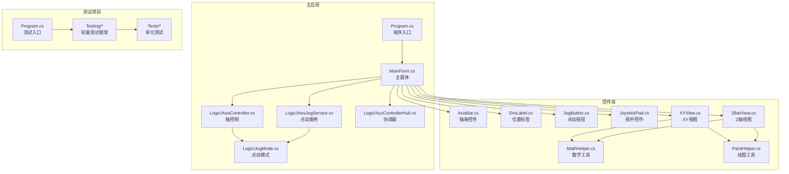

## 架构总览

系统采用"界面—逻辑—工具—测试"的分层组织方式，并遵循事件驱动模式：

- **界面层**：WinForms 主窗体与自定义控件，负责输入采集与结果呈现。
- **逻辑层**：轴控制、点动服务与协调器，负责业务规则与流程编排。
- **工具层**：数学与绘图工具，为界面与控制逻辑提供通用能力。
- **测试层**：独立工程，验证逻辑层的正确性与稳定性。

数据流从 UI 事件出发，经 MainForm 协调器进入业务逻辑，最终回写至 UI 进行可视化反馈。

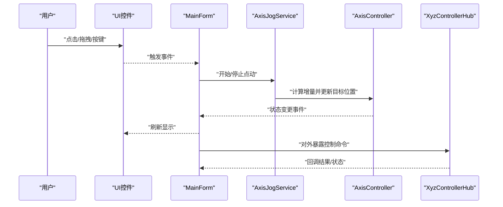

### 依赖关系

- 主应用依赖控件库与逻辑层，形成"界面—逻辑"的清晰边界。
- 控件库内部通过数学与绘图工具降低耦合度，提升复用性。
- 测试项目独立于主应用，仅依赖逻辑层与测试框架，保证可测性。
- 潜在风险：需避免 MainForm 过度膨胀，必要时拆分子协调器；避免控制器与服务互相直接引用，统一通过 Hub 通信。

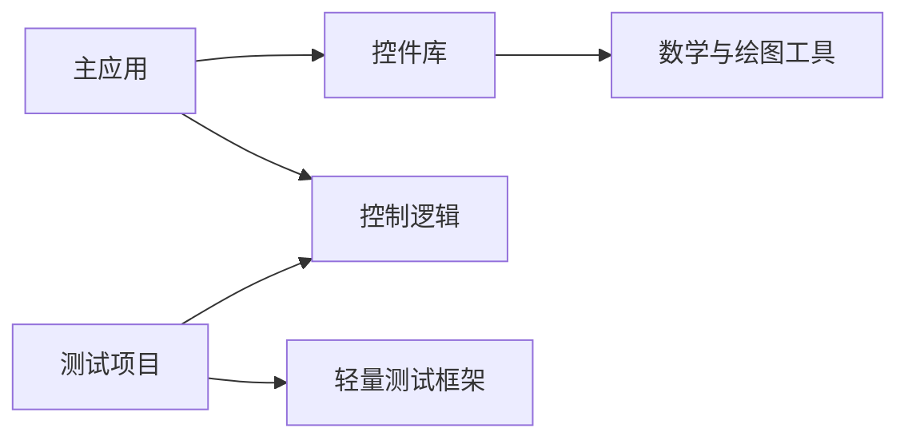

## 核心组件详解

### 主窗体协调器（MainForm）

MainForm 是纯 UI 层的协调器，不包含任何"算坐标/算动画"的业务逻辑，只负责：**捕获用户输入 → 转发给 Hub → 监听 Hub 变化 → 刷新控件**。

**设计模式**

- 协调器（Facade/Coordinator）：统一入口，屏蔽底层复杂性，为 UI 提供简洁的调用接口。
- 观察者（Observer）：订阅业务层的状态事件（`_hub.Changed`），驱动 UI 更新。

**生命周期管理**

- 初始化：构造函数中完成业务层对象创建、控件范围同步与事件订阅。
- 启动副作用：`OnLoad` 中启动动画定时器、锁定分隔条。把副作用放在 `OnLoad` 比放在构造函数更规范——设计器解析构造函数时会跳过 `OnLoad`，避免在设计器里触发动画/IO。
- 运行期：通过 `_syncing` 标志位防止 hub 回调里又改 UI 触发新事件（双向同步防递归）。
- 销毁：随窗体关闭释放控件与定时器资源。

**事件分发机制**

- 用户输入：滑块、数字框、± 按钮、JOG 按钮、摇杆/鼠标、键盘等事件由 MainForm 捕获，通过 `Tag` 携带目标轴对象，转发为业务命令。
- 状态回调：Hub 的 `Changed` 事件由 MainForm 路由到各 UI 控件（滑块、数字框、XY 视图、Z 条、状态栏）刷新显示。

**数据绑定策略**

- 单向绑定为主：从业务层到 UI 的只读展示（视图、标签、状态栏）。
- 双向交互：UI 输入经 MainForm 校验后下发给业务层。
- 线程安全：所有 UI 更新通过 WinForms 的线程调度机制进行。

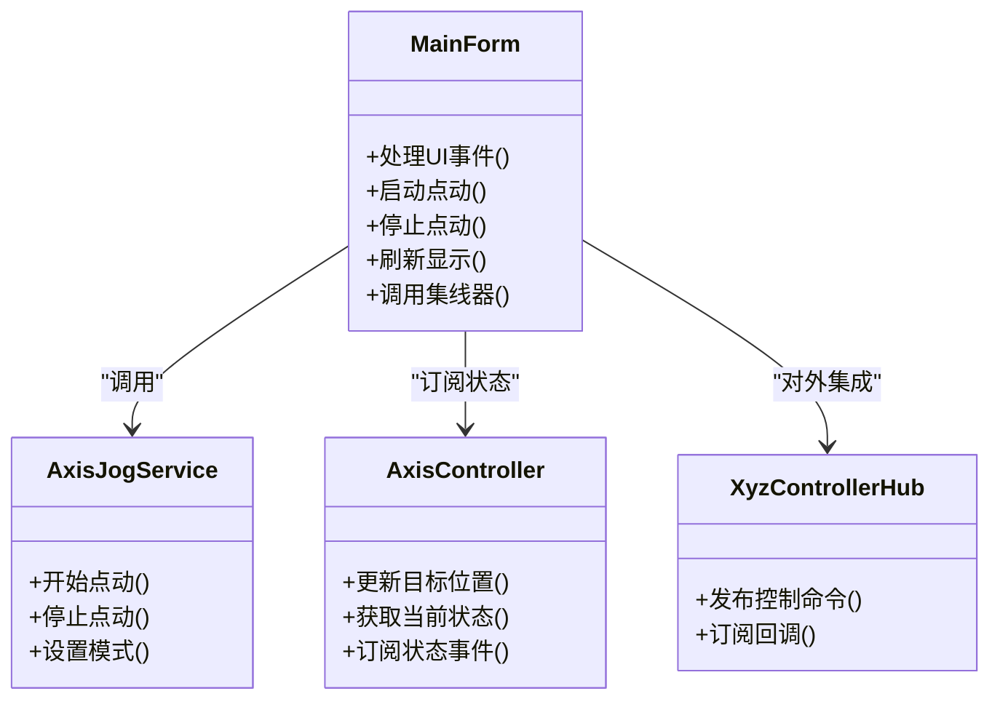

**用户输入到控制的序列流程**

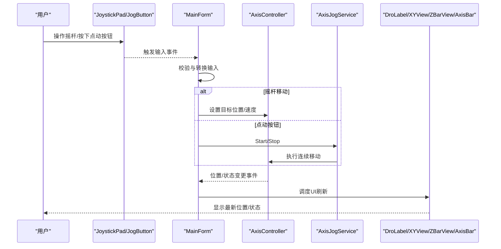

### 轴控制系统（AxisController）

AxisController 是轴控制的核心，承担以下职责：

- **轴位置管理**：维护当前坐标、目标坐标与行程范围（最小/最大限位）。
- **运动状态控制**：设置目标位置（`SetTarget`）、步进（`Step`）、回原点等状态机式控制。
- **速度调节**：配合全局速度设置，按二次曲线插值平滑逼近目标。
- **坐标计算**：边界检查与限幅，确保不超过安全边界；更新操作为 O(1)。

**关键流程：设置目标位置**

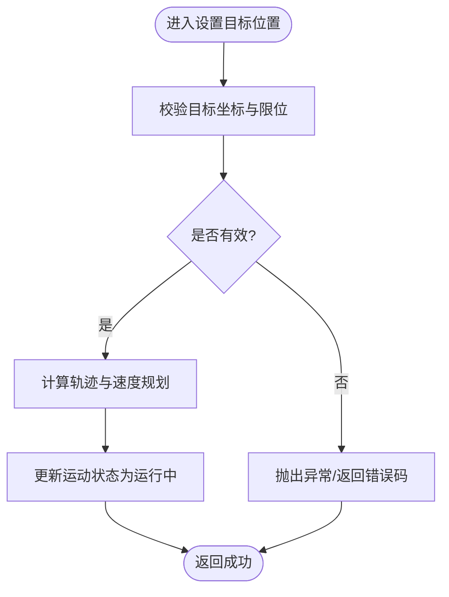

**JogMode 点动模式枚举**

- **连续模式（Continuous）**：按住时持续以设定速度向限位方向运动，松开（Stop）才停。
- **寸动模式（Incremental）**：每次触发按固定步长移动一步，步长可配置。

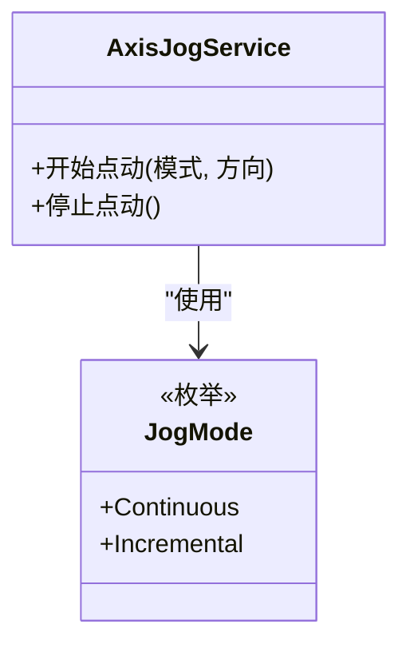

**生命周期与错误处理**

- 生命周期：控制器创建后加载配置、复位状态；退出前断开事件订阅、释放资源。
- 错误处理：对非法坐标、越界等情况进行校验，采取保护策略（限幅），并通过状态事件向 UI 反馈。
- 线程安全：公共方法保证并发访问安全，避免竞态条件。

### 点动服务（AxisJogService）

点动服务整体遵循"**输入采集—速度规划—平滑执行—状态反馈**"的闭环流程：UI 控件捕获用户操作并转换为点动命令；AxisJogService 根据 JogMode 与参数计算速度/步进策略，驱动 AxisController 更新目标位置；状态变化经 Hub 广播给 UI 更新。

**AxisJogService 职责**

- 接收来自 MainForm 的点动命令（`OnJogStart(direction)` / `OnJogStop()`），解析模式与参数。
- 根据 JogMode 选择寸动步进或连续运动策略。
- 驱动 AxisController 设置目标位置，寸动模式下每次 Jog 事件走一步。
- 管理运行生命周期（启动、停止）与急停（`EmergencyStop`）。

**启动 / 停止流程**

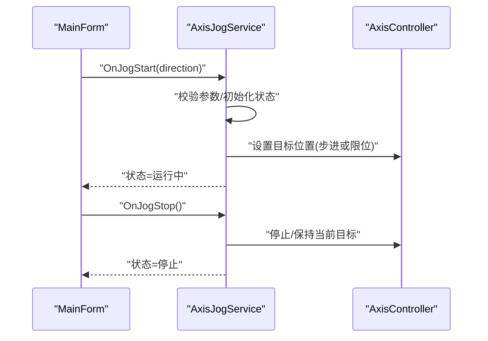

**速度曲线与加速度控制**

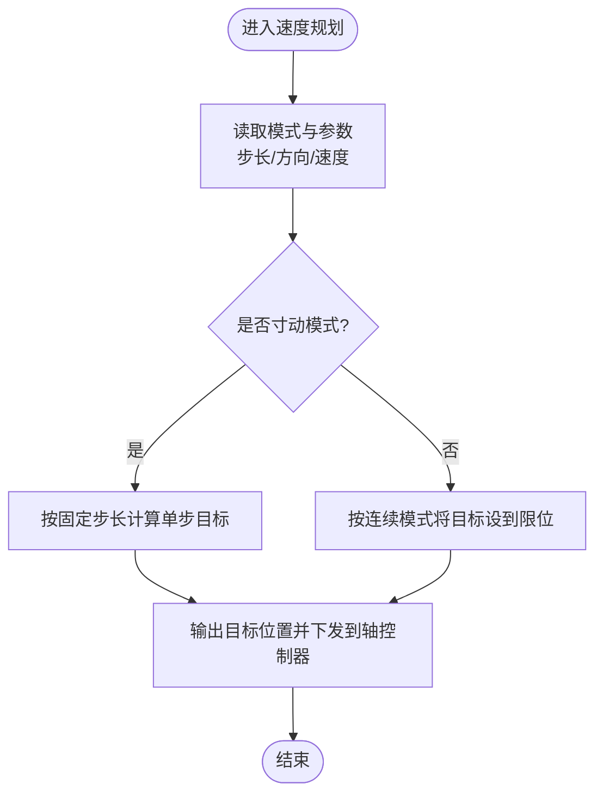

**与轴控制器的协作关系**

- AxisJogService 通过 AxisController 设置目标位置、读取状态。
- 当出现超限或非法输入时，AxisController 限幅保护，AxisJogService 执行安全降级（停止运动）。

### 组件通信机制（XyzControllerHub）

整体采用"**中心枢纽 + 事件驱动**"的架构：XyzControllerHub 作为系统的事件总线与协调器，集中管理组件间的消息路由、事件分发与状态广播。

- UI 通过 Hub 订阅轴状态变化（`Changed` 事件）；
- 业务服务（点动服务）通过 Hub 与控制器协作；
- Hub 聚合三个轴控制器（X / Y / Z），提供统一入口，确保低耦合与高内聚。

**设计模式**

- 事件总线：集中管理事件订阅与发布流程，降低组件耦合度。
- 观察者模式：订阅者注册回调，状态变更时通知所有订阅者。
- 中介者模式：Hub 作为中间人协调 UI、点动服务与多个轴控制器之间的交互。

**数据流向与状态同步**

- 单向数据流：UI → Hub → 控制器/服务 → Hub → UI。
- 状态快照：Hub 维护三轴当前值与目标值，订阅者可按需读取最新值。
- 全局设置：速度设置（`SpeedSetting`）、回原点（`ResetToOrigin`）、居中（`SetToCenter`）、随机目标（`SetRandomTarget`）等统一入口。

**错误传播与性能优化**

- 异常隔离：单个订阅者异常不影响其他订阅者。
- 订阅去重：同一订阅者重复注册同一事件时自动去重。
- 批量发布：合并高频小事件为批次事件，减少分发开销。
- 动画推进：`Advance()` 按固定节拍推进三轴插值，由 MainForm 的动画定时器驱动。

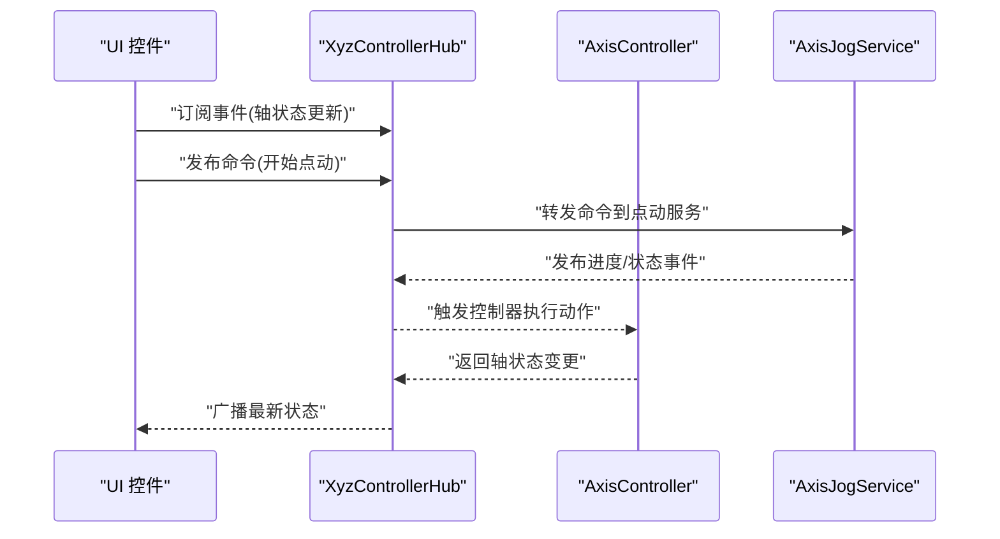

**事件驱动通信模型**

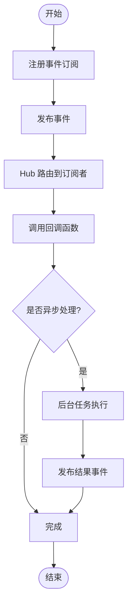

## 自定义控件库

控件库位于 `src/XyzController.Controls`，包含六个可复用 WinForms 控件与两个工具类。所有控件均继承 `Control` 并重写 `OnPaint`，使用 GDI+ 手绘；统一启用双缓冲（`DoubleBuffered = true`）、`ResizeRedraw = true` 与抗锯齿（`SmoothingMode.AntiAlias`），无第三方 UI 依赖。

| 控件 | 功能 |
|---|---|
| `JoystickPad` | 虚拟摇杆：鼠标/触摸输入，输出归一化二维向量，支持死区与灵敏度 |
| `XYView` | 二维视图：网格、坐标轴、十字光标、运动轨迹、目标点 |
| `ZBarView` | Z 轴竖条：当前位置、目标位置、刻度与安全边界 |
| `JogButton` | 点动按钮：按住连续运行（Jog 事件）、松开停止（Stop 事件） |
| `DroLabel` | 数字显示器：格式化数值显示，支持精度与单位 |
| `AxisBar` | 位置指示条：当前/目标位置、限位标记与进度比例 |
| `MathHelper` | 数学工具：限幅（Clamp）、范围映射、插值、坐标转换 |
| `PaintHelper` | 绘图工具：抗锯齿设置、渐变填充、刻度线、居中文本 |

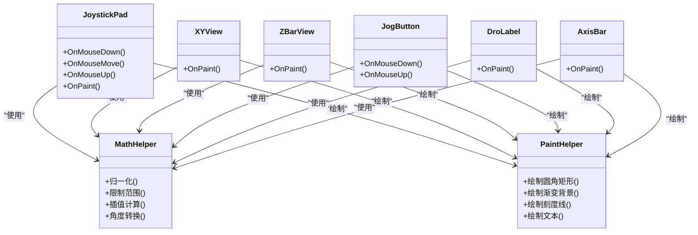

### 基础控件

#### JogButton 运动按钮

- **职责**：封装用户点击/按住行为，向上层发出"开始运动（Jog）/停止运动（Stop）"指令，支持方向、步长等参数。
- **设计要点**：
  - 输入处理：捕获鼠标按下/抬起事件，区分单击与长按，寸动模式下 Jog 事件会重复触发（每次走一步），连续模式下只在按下时触发一次。
  - 状态管理：维护"运行中/空闲"状态，避免重复触发。
  - 事件模型：通过 `Jog` / `Stop` 事件向宿主（MainForm）抛消息，由上层协调业务逻辑；`Tag` 可携带对应的点动服务实例。
- **常见问题**：
  - 快速多次点击导致状态错乱：需在内部加状态机保护。
  - 长按无响应：检查定时器与 UI 线程同步。
- 参考路径：`src/XyzController.Controls/JogButton.cs`、`src/XyzController/MainForm.cs`

#### DroLabel 数字显示器

- **职责**：以文本形式高精度显示数值（如轴坐标），支持格式化、精度、单位等。
- **设计要点**：
  - 数据绑定：接收外部数值源，内部缓存最新值，仅在值变化或尺寸变化时重绘，减少闪烁。
  - 格式化：支持固定小数位、单位后缀等。
- **常见问题**：
  - 频繁刷新导致界面卡顿：合并更新或使用双缓冲。
  - 数值过大/过小显示异常：校验格式与范围。
- 参考路径：`src/XyzController.Controls/DroLabel.cs`

#### AxisBar 位置指示条

- **职责**：单轴位置可视化，显示当前位置、目标位置、限位标记与进度比例。
- **设计要点**：
  - 比例映射：将物理坐标映射到像素区间，借助 `MathHelper` 进行数值计算。
  - 刻度与标签：按合理间隔绘制刻度线与数值标签（`PaintHelper.ChooseStep` 自动选择步长）。
  - 绘制工具：借助 `PaintHelper` 进行统一风格绘制。
- **绘制流程**：

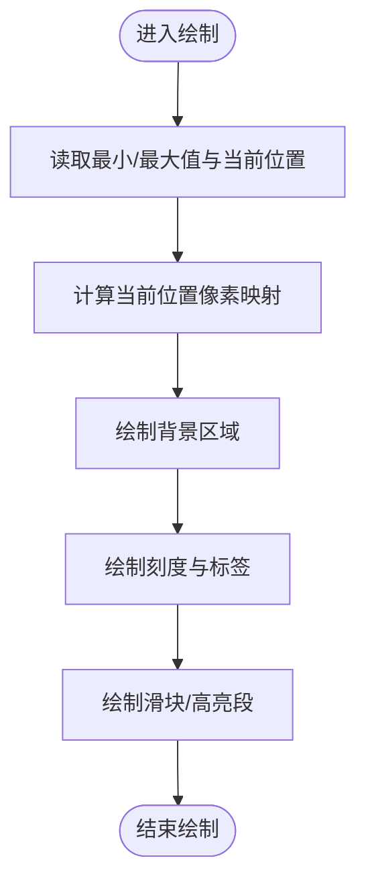

- **常见问题**：
  - 比例失真：检查最小/最大值与当前值的边界条件。
  - 标签重叠：动态调整刻度间隔或隐藏部分标签。
- 参考路径：`src/XyzController.Controls/AxisBar.cs`、`src/XyzController.Controls/MathHelper.cs`、`src/XyzController.Controls/PaintHelper.cs`

### 高级控件

#### JoystickPad 虚拟摇杆

- **职责与特性**：
  - 输入捕获：处理鼠标/触摸的按下、移动、抬起事件。
  - 坐标变换：将屏幕坐标映射为相对中心点的偏移量，并进行死区过滤与归一化。
  - 事件输出：对外暴露移动开始、移动中、移动结束等事件，供上层订阅。
  - 视觉反馈：绘制渐变底盘、虚线十字辅助线、死区圆、带白色描边的蓝色手柄及方向箭头提示。
- **交互与事件流**：按下记录初始位置进入拖拽状态 → 移动时计算增量、应用死区阈值、生成标准化向量并触发事件 → 释放时重置状态并触发结束事件。

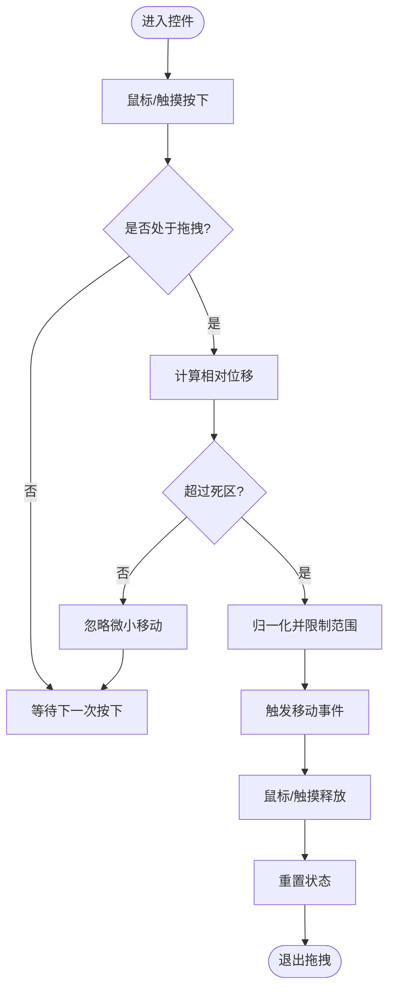

- 参考路径：`src/XyzController.Controls/JoystickPad.cs`

#### XYView 二维视图

- **职责与特性**：
  - 坐标系管理：维护逻辑坐标（RangeMin/RangeMax）与屏幕坐标的双向映射。
  - 内容绘制：网格线、坐标轴、十字光标、运动轨迹（最近 400 个点）与目标点（橙色空心圆），按"背景→网格→轨迹→光标→标注"的层次顺序绘制。
  - 交互支持：左键拖动直接设定目标点（`TargetSetByMouse` 事件）、右键设为原点。
  - 数据更新：`Advance(fraction)` 由动画定时器驱动，按插值系数推进当前点并重绘。
- **性能优化**：双缓冲减少闪烁；按需重绘；静态背景可缓存至离屏位图。
- 参考路径：`src/XyzController.Controls/XYView.cs`

#### ZBarView Z 轴专用显示

- **职责与特性**：
  - 条形可视化：以竖直条形展示 Z 轴当前位置、目标位置（橙色箭头）与刻度。
  - 状态指示：配合越界告警、到达目标等事件。
  - 复用组件：与 AxisBar 共享刻度步长选择与竖条区域计算逻辑（`PaintHelper.VerticalBarArea`）。
- **扩展方向**：多段安全区、动态阈值、动画过渡效果。
- 参考路径：`src/XyzController.Controls/ZBarView.cs`

### 辅助工具类

#### MathHelper 数学计算类

- **设计目标**：提供稳定、可复用的数学与坐标转换方法，避免在各控件中重复实现；保证数值边界安全与精度可控。
- **关键能力**：
  - 数值裁剪（`Clamp`）：将输入限制到指定区间，防止越界。
  - 范围映射：将源区间线性映射到目标区间，常用于 UI 比例缩放。
  - 插值计算：供平滑动画使用。
- **复杂度与稳定性**：多数操作为 O(1)，适合高频调用；对边界条件进行保护。
- 参考路径：`src/XyzController.Controls/MathHelper.cs`

#### PaintHelper 绘图工具类

- **设计目标**：统一绘制风格与质量，降低各控件的绘制差异；规范 GDI+ 资源生命周期，避免句柄泄漏。它是全局"视觉规范"的唯一来源。
- **关键能力**：
  - 质量设置（`SetupGraphics`）：启用抗锯齿、ClearType 文本。
  - 背景填充、刻度步长选择（`ChooseStep`）、居中文本绘制（`DrawCenteredTextInRect`）、竖直条区域计算（`VerticalBarArea`）。
  - 渐变填充、文本绘制、双缓冲配合。
- **使用示例**：
  - JoystickPad：渐变底盘与手柄绘制。
  - AxisBar / ZBarView：刻度线与竖条区域。
  - XYView：网格与轨迹。
- 参考路径：`src/XyzController.Controls/PaintHelper.cs`

**复用模式**：在控件的 `OnPaint` 阶段调用 `PaintHelper` 的统一绘制接口；在布局或数据更新时调用 `MathHelper` 的坐标与数值处理方法。新增控件务必优先复用这两个工具类。

### 控件间协作模式与组合使用场景

- **摇杆 + 二维视图**：JoystickPad 输出归一化向量驱动 XYView 轨迹预览，形成"所见即所得"的操作体验。
- **Z 轴显示 + 数字显示器**：ZBarView 与 DroLabel 同步显示 Z 轴当前位置与目标值，配合越界告警提升安全性。
- **运动按钮 + 位置指示条**：JogButton 触发步进运动，AxisBar 实时反映位置变化，形成闭环反馈。
- **统一主题与样式**：通过共享的 PaintHelper 与 MathHelper 确保视觉与数值一致性。
- **设计原则**：高内聚低耦合（每个控件专注单一职责）、事件驱动（通过事件通知父窗体）、可复用（控件可在不同界面复用）、组合优于继承。

## 测试框架

测试工程包含一个**轻量级、自托管**的单元测试框架（无第三方测试框架依赖），由三个关键部分组成：

- **TestAttribute**（测试标记）：标注某个公共无参实例方法为"测试方法"，供 TestRunner 通过反射发现。仅用于元数据标记，不包含运行时逻辑；可扩展 Category / Timeout / Skip 等属性。
- **Assert**（断言工具）：提供一系列静态断言方法（相等性比较、空值检查、条件判断、集合校验等）；断言失败时抛出异常，从而让 TestRunner 将对应测试标记为失败。
- **TestRunner**（测试执行器）：扫描当前程序集中所有类型与方法，查找带有 TestAttribute 的方法并通过反射调用执行；打印每个测试的名称、状态（通过/失败）、耗时与错误信息，并汇总报告。

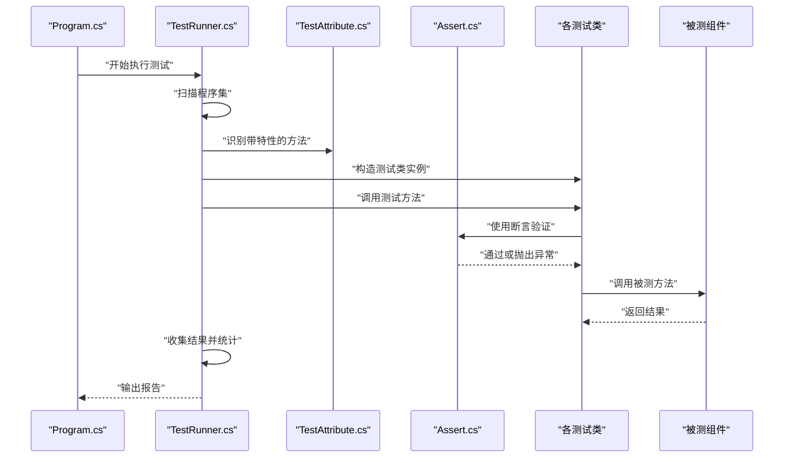

**TestRunner 执行流程**

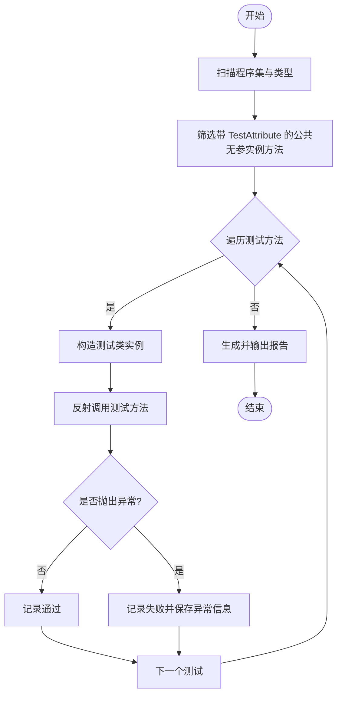

### 如何编写与执行测试

- **编写步骤**：新建测试类（命名建议以"被测类名+Tests"结尾）→ 在公共无参实例方法上添加 `[Test]` → 在方法内部使用 `Assert` 进行断言 → 如需准备资源，可在构造函数或专用初始化方法中完成。
- **测试方法要求**：必须是公共实例方法、无参数、带有 TestAttribute。
- **执行方式**：直接运行测试工程（XyzController.Tests）的入口程序，自动发现并执行全部测试，控制台输出报告。
- **现有用例**：
  - `AxisControllerTests`：验证轴控制器在给定输入下的行为，覆盖坐标边界、速度规划与状态切换。
  - `AxisJogServiceTests`：验证点动服务在不同 JogMode 下的行为差异、指令生成与停止逻辑。
  - `XyzControllerHubTests`：验证 Hub 对外暴露的接口行为、事件通知与状态同步。
- **最佳实践**：一次测试只关注一个行为；断言消息应明确表达期望与实际差异；保持测试稳定、快速、可重复；每个测试方法独立构造实例，避免共享状态导致竞态。

## 如何编译运行

### 方式 1：用 Visual Studio 打开（推荐）

1. 安装包含".NET 桌面开发"工作负载的 Visual Studio。
2. 双击 `XyzController.sln` 打开解决方案。
3. 生成解决方案（`Ctrl+Shift+B`），按 `F5` 调试运行，或 `Ctrl+F5` 直接运行。
4. 运行测试：将 XyzController.Tests 设为启动项目后运行，控制台输出测试报告。

### 方式 2：用 MSBuild 编译

```cmd
msbuild XyzController.sln /p:Configuration=Release
```

各工程输出在各自的 `bin\Release\` 目录下（控件库与测试框架为 dll）。

> **提示**：如果 `msbuild` 不在 PATH 中，可通过 `"%ProgramFiles(x86)%\Microsoft Visual Studio\Installer\vswhere.exe" -latest -requires Microsoft.Component.MSBuild -find MSBuild\**\Bin\MSBuild.exe` 定位 VS 自带的 MSBuild。

### 环境要求

- .NET Framework 4.6.1+（Windows 10/11 默认自带）。
- 系统自带的 csc 编译器位于 `C:\Windows\Microsoft.NET\Framework64\v4.0.30319\csc.exe`，可用于验证单个文件的语法（注意项目为 C# 5 兼容写法，事件订阅使用命名方法 + 显式委托构造）。

## 设计要点

1. **目标值 vs 当前值**：所有 UI 控件只修改目标值（Target），由 `animTimer`（50 FPS）按二次曲线插值把当前值（Current）平滑过渡过去——模拟真实电机的加减速过程。
2. **双向同步防递归**：滑块改了会同步数字框，数字框改了也会同步滑块。用 `_syncing` 标志位避免循环触发。
3. **UI 与业务分离**：MainForm 只做"捕获输入 → 转发 hub → 监听变化 → 刷新控件"，所有状态与算法都在 `Logic/` 层，便于测试与复用。
4. **双缓冲绘制**：自定义控件 `DoubleBuffered = true`，动画不闪烁。
5. **C# 5 兼容**：工控机上的旧 .NET 编译器不支持 Lambda 表达式，事件订阅统一使用命名方法 + 显式委托构造（`new EventHandler(...)`）。

## 性能与可用性考虑

- **界面刷新频率与渲染开销**：合理控制视图重绘频率；启用双缓冲；仅在必要区域重绘，避免整窗体刷新；静态背景（网格、刻度）可缓存至离屏位图。
- **事件节流与批处理**：对高频输入（摇杆、鼠标移动）进行采样与合并，降低 CPU 占用与 UI 压力。
- **坐标计算与限幅**：在 MathHelper 中集中处理单位换算与限幅，多数操作为 O(1)，减少重复计算与累积误差。
- **点动控制的平滑性**：通过点动服务对速度与步进进行规划，配合二次曲线插值，提高操控体验。
- **线程模型**：避免在 UI 线程执行耗时操作；UI 更新通过 WinForms 线程调度机制进行，保证跨线程安全。
- **资源释放与异常恢复**：在控件与窗体生命周期结束时释放 GDI+ 资源（画笔、画刷、字体）、取消事件订阅、停止定时器，防止内存与 GDI 句柄泄漏。
- **测试性能**：测试发现阶段使用反射，大型项目中可缓存类型与方法列表；每个测试独立构造实例；尽量用内存模拟对象替代真实 I/O。

## 故障排查指南

| 现象 | 排查方向 |
|---|---|
| 无法启动应用 | 检查 .NET Framework 版本与 VS 工作负载；确认解决方案与项目引用完整，清理并重建 |
| 控件无响应 | 确认 MainForm 已订阅控件事件并正确转发到逻辑层；检查 JogButton 内部状态机是否锁定 |
| 坐标显示异常 | 检查 MathHelper 的换算与限幅逻辑；核对视图刷新时机与格式字符串设置 |
| 点动无效或异常 | 核查 JogMode 配置与步长参数；确认 AxisController 是否收到指令；检查事件订阅是否生效 |
| 位置不更新 | 确认 AxisController 触发状态事件且 MainForm 已刷新 UI（`_syncing` 标志未卡死） |
| 绘制闪烁 / 卡顿 | 确认已启用双缓冲；检查是否存在频繁创建画笔/字体对象；引入节流与缓存 |
| 事件未触发 | 检查订阅是否正确注册、事件名称是否一致；确认组件销毁时未误注销 |
| 内存泄漏 | 确认关闭时已取消订阅、释放 GDI 对象、停止服务与定时器 |
| 测试未被发现 | 确认方法为公共、无参、实例方法，且带有 TestAttribute |
| 测试失败 | 根据 TestRunner 输出定位失败用例，检查断言条件与模拟数据；缩小范围单独运行 |

**调试建议**：在关键路径（事件触发、命令下发、状态回调）增加日志输出；使用断点跟踪事件链路与数据流；先验证 AxisController 与 AxisJogService 的行为，再检查 UI 绑定；隔离问题到单轴或单控件逐步复现。

## 开发指南

### 代码规范与命名约定

- 类名与方法名使用 PascalCase；字段与私有成员使用 camelCase（私有字段以 `_` 开头）。
- 按功能划分目录：Logic、Controls、Tests；每个文件职责单一。
- 公共 API 添加 XML 文档注释（`///`）；复杂算法补充行内注释说明意图与边界条件。
- 错误处理：明确抛出与捕获异常；对外暴露友好的错误信息；避免吞掉异常。
- 新增控件必须继承 `Control` 并重写 `OnPaint`；构造函数中务必设置 `DoubleBuffered = true`、`ResizeRedraw = true`，并在 `OnPaint` 开头调用 `PaintHelper.SetupGraphics(g)`。
- 所有尺寸基于 `ClientRectangle` 相对计算，禁止硬编码绝对像素值；状态变化后调用 `Invalidate()` 触发重绘，不要在事件处理中阻塞 UI 线程。

### 调试技巧与工具

- 断点调试：在关键方法入口与分支处设置断点，观察变量与调用栈。
- 日志记录：在 Hub 与点动服务中加入日志，记录命令、状态与异常。
- 性能分析：使用 Visual Studio 性能分析器识别热点函数与内存分配。
- 单元测试：使用 TestRunner 执行测试，结合 Assert 快速定位回归问题。

### 扩展开发

- **添加新的轴控制算法**：在 Logic 层新增算法类，实现统一接口（如 SetTarget / Step / Stop），在 Hub 中注册并提供配置项与切换机制。
- **自定义控件**：继承 `Control` 或复用现有控件基类，复用 MathHelper 与 PaintHelper，保持渲染与交互一致性。
- **业务逻辑扩展**：在 AxisJogService 中扩展 JogMode 与新策略，确保线程安全与状态一致；编写对应单元测试覆盖新增行为与边界条件。

### 版本管理与贡献

- 使用 Git 进行版本控制，提交信息清晰描述变更目的与影响范围。
- 代码审查关注可读性、健壮性与性能，确保测试覆盖率。
- 贡献流程：创建功能分支 → 提交变更 → 附上变更说明与测试截图/日志 → 审核通过后合并。

## 扩展建议

**接真实硬件**：只要在 MainForm 里改两处即可——

- **发送指令**：在 `SetTarget` / `animTimer_Tick` 末尾，把目标坐标通过串口发送出去（例如 `serialPort.WriteLine("G0 X" + x + " Y" + y + " Z" + z)`）。
- **读取反馈**：订阅串口的 `DataReceived` 事件，把回传的实际坐标更新到视图控件的当前值属性上。

界面、动画、轨迹、状态栏等可以完全复用。

**其他扩展方向**：

- 自定义 JogMode：新增点动模式并在 AxisJogService 中接入对应的速度/步进计算。
- 插件化轴控制器：通过接口抽象替换 AxisController 实现，适配不同硬件。
- 颜色与字体集中管理：当前 ARGB 常量与 Font 定义分散在各控件中，可提取到统一的 `Theme` / `DesignTokens` 类，便于一键换肤。
- 自适应参数：根据负载动态调整加速度与平滑系数。
- 测试框架增强：为 TestAttribute 增加 Category / Timeout / Skip 支持，引入并行执行与覆盖率报告。

---

> 本文整合自项目仓库 wiki（`.qoder/repowiki/zh/content`）的 12 篇文档：项目概述、核心架构设计、主窗体协调器、轴控制系统、点动服务、组件通信机制、自定义控件库、基础控件、高级控件、辅助工具类、测试框架、开发指南。
